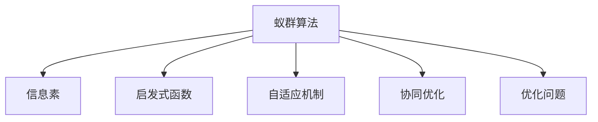

                 

# 群体智能：蚁群算法在人类社会的应用

> 关键词：群体智能,蚁群算法,优化问题,组合优化,社会模拟

## 1. 背景介绍

### 1.1 问题由来

随着现代社会的快速发展，人类面临的各类问题日益复杂。如何高效、公平地分配资源，合理规划路线，优化工作流程，成为社会管理和企业运营中的关键问题。传统的优化算法如线性规划、遗传算法等，在处理大规模问题时面临计算复杂度高、易陷入局部最优等问题。群体智能作为一种新型的优化方法，利用群体协作、信息共享等机制，可以在不依赖个体的高度智能的情况下，实现高效的资源分配和问题解决。

### 1.2 问题核心关键点

群体智能(AI for Social Good, AI4SG)，是将人工智能技术应用于社会治理、公共服务、环境保护等领域，以提升社会效率、增进民众福祉为目标的研究方向。其中，蚁群算法(Ant Colony Optimization, ACO)是群体智能领域中一种经典算法，受到仿生学和计算机科学的交叉启发，通过模拟蚂蚁在寻找食物时的路径选择行为，构建一种群体协作的优化算法，广泛应用于组合优化、网络路由、交通规划等实际问题中。

蚁群算法的核心思想是：每个蚂蚁在寻找食物时，会通过信息素来标记路径，同时根据信息素浓度和路径长度来调整自身行为。信息素通过正反馈机制在群体中逐步加强，引导蚂蚁最终找到全局最优解。在人类社会中，类似地，个体可以通过协作和信息共享，达到共同优化问题的目标。

### 1.3 问题研究意义

蚁群算法在人类社会中的应用，具有重要的理论和实践意义：

1. **优化资源配置**：在交通、物流、医疗等领域，蚁群算法可以高效地分配有限的资源，避免浪费，提高服务效率。
2. **解决复杂问题**：通过模拟群体协作，蚁群算法能够处理传统算法难以解决的大规模、多变量问题，提供创新性的解决方案。
3. **提升社会治理水平**：在城市规划、环境监测、灾害预警等场景中，蚁群算法可以辅助决策，实现更精准的规划和管理。
4. **促进环境保护**：在自然资源保护、野生动物迁徙路径规划等生态领域，蚁群算法有助于制定科学合理的保护策略。

蚁群算法的研究，不仅为群体智能领域提供了新的研究方法，也为解决实际社会问题提供了新的思路和技术支持。

## 2. 核心概念与联系

### 2.1 核心概念概述

为更好地理解蚁群算法在人类社会中的应用，本节将介绍几个关键核心概念：

- **蚁群算法**：一种基于群体智能的优化算法，通过模拟蚂蚁的觅食行为，构建一个基于信息素的优化框架，引导群体协作解决复杂问题。
- **信息素**：蚂蚁在路径上释放的化学物质，用于记录路径的质量和难易度，通过正反馈机制在群体中逐步加强，引导其他蚂蚁进行选择。
- **启发式函数**：定义信息素的挥发和更新规则，是蚁群算法中的重要组件。
- **自适应机制**：蚁群算法中的参数和行为调整机制，通过模拟蚁群在实际环境中的行为，实现动态优化。
- **协同优化**：通过群体协作和信息共享，蚁群算法在处理大规模问题时，能够高效探索解空间，避免陷入局部最优。

这些概念之间的逻辑关系可以通过以下Mermaid流程图来展示：



这个流程图展示蚁群算法的基本构成及其与其他概念的联系：

1. 蚁群算法通过信息素在群体中传递路径信息，启发式函数定义信息素的挥发和更新机制，自适应机制模拟蚁群的行为调整，协同优化则实现了群体协作。
2. 蚁群算法最终用于解决优化问题，如资源分配、路径规划等。

## 3. 核心算法原理 & 具体操作步骤
### 3.1 算法原理概述

蚁群算法是一种基于群体协作的启发式优化算法，其核心原理如下：

1. **初始化**：随机生成多只蚂蚁，并在问题空间中随机选择一个初始路径。
2. **路径构建**：每只蚂蚁根据信息素和启发式函数，选择一个节点，并将该节点加入当前路径。
3. **信息素更新**：每次路径构建后，更新信息素浓度，引导后续蚂蚁选择更好的路径。
4. **迭代优化**：重复路径构建和信息素更新，直到达到预设的迭代次数或满足收敛条件。

蚁群算法通过群体协作，逐步优化路径选择，最终找到全局最优解。相比于传统的优化算法，蚁群算法具有全局搜索能力强、适应性强、易于实现等优点。

### 3.2 算法步骤详解

蚁群算法在人类社会中的应用，主要分为以下几个关键步骤：

**Step 1: 问题定义与数据预处理**
- 定义优化问题，如资源分配、路径规划等，确定优化目标和约束条件。
- 预处理数据，包括数据清洗、特征提取、归一化等，确保数据适合蚁群算法处理。

**Step 2: 蚁群初始化**
- 随机生成多只蚂蚁，初始路径随机选择。
- 设定蚁群规模、迭代次数、信息素挥发系数等参数。

**Step 3: 路径构建与信息素更新**
- 每只蚂蚁根据信息素和启发式函数，选择下一个节点，构建路径。
- 更新信息素浓度，通过正反馈机制强化最优路径。

**Step 4: 迭代优化**
- 重复路径构建和信息素更新，直到达到预设的迭代次数或满足收敛条件。
- 记录最优解和迭代过程中的一些关键数据，如收敛速度、路径长度等。

**Step 5: 结果分析**
- 对最终得到的路径或解决方案进行分析，评估其优化效果。
- 根据实际需求，进行必要的后处理和调整。

### 3.3 算法优缺点

蚁群算法在人类社会中的应用具有以下优点：

1. **全局优化能力强**：通过群体协作，蚁群算法能够高效地探索解空间，避免陷入局部最优。
2. **适应性强**：蚁群算法能够处理大规模、复杂的问题，灵活适应不同问题类型和约束条件。
3. **算法简单**：蚁群算法易于实现，不需要复杂的数学模型和优化技术。
4. **可扩展性好**：蚁群算法能够通过并行计算和分布式优化，快速处理大规模数据集。

但同时也存在一些缺点：

1. **收敛速度慢**：蚁群算法在处理大规模问题时，可能面临较长的收敛时间。
2. **参数敏感**：蚁群算法的性能依赖于多个参数，如蚁群规模、迭代次数、信息素挥发系数等，需要仔细调参。
3. **随机性较强**：蚁群算法中的随机因素较多，可能导致算法稳定性不足。

### 3.4 算法应用领域

蚁群算法在人类社会中的应用，覆盖了多个领域：

- **交通规划**：优化道路网络、路线规划、车辆调度等，减少交通拥堵，提高运输效率。
- **供应链管理**：优化物流配送、库存管理、订单分配等，降低成本，提升服务质量。
- **城市规划**：优化资源分配、公共设施布局、城市排水系统等，改善城市管理水平。
- **环境保护**：优化生态系统保护、野生动物迁徙路径、自然灾害预警等，促进生态平衡。
- **能源管理**：优化能源分配、输电线路规划、智能电网等，提高能源利用效率。
- **金融市场**：优化投资组合、股票交易策略、风险管理等，提升投资回报率。

蚁群算法在实际应用中，已经展现出了强大的优化能力，为多个领域带来了显著的效益。

## 4. 数学模型和公式 & 详细讲解 & 举例说明
### 4.1 数学模型构建

蚁群算法的基本数学模型为：

1. **信息素更新规则**：
   $$
   \tau_{ij} \leftarrow \left(1-\alpha\right)\tau_{ij}+\frac{\beta}{n}\sum_{k=1}^{n}q_{ik}\cdot\tau_{kj}
   $$
   其中，$\tau_{ij}$ 为从节点 $i$ 到节点 $j$ 的信息素，$\alpha$ 和 $\beta$ 分别为信息素挥发系数和启发式因子。

2. **启发式函数**：
   $$
   Q_{ij}=\left\{
   \begin{array}{ll}
   0 & i=j \\
   \frac{1}{\delta} & \text{路径长度}=L \\
   \infty & \text{路径长度}>L
   \end{array}
   \right.
   $$
   其中，$Q_{ij}$ 为启发式函数，$\delta$ 为路径长度阈值。

3. **路径选择规则**：
   $$
   P_{ij}=\frac{\tau_{ij}^{a}\cdot Q_{ij}^{b}}{\sum_{k=1}^{n}\tau_{ik}^{a}\cdot Q_{ik}^{b}}
   $$
   其中，$P_{ij}$ 为选择节点 $j$ 的概率，$a$ 和 $b$ 分别为信息素影响因子和启发式因子。

### 4.2 公式推导过程

以交通网络中的路径规划为例，推导蚁群算法的数学模型：

1. **信息素更新**：
   $$
   \tau_{ij} \leftarrow \left(1-\alpha\right)\tau_{ij}+\frac{\beta}{n}\sum_{k=1}^{n}q_{ik}\cdot\tau_{kj}
   $$
   其中，$q_{ik}$ 为节点 $k$ 到节点 $i$ 的流量，$\alpha$ 和 $\beta$ 分别为信息素挥发系数和启发式因子。

2. **启发式函数**：
   $$
   Q_{ij}=\left\{
   \begin{array}{ll}
   0 & i=j \\
   \frac{1}{\delta} & \text{路径长度}=L \\
   \infty & \text{路径长度}>L
   \end{array}
   \right.
   $$
   其中，$\delta$ 为路径长度阈值。

3. **路径选择规则**：
   $$
   P_{ij}=\frac{\tau_{ij}^{a}\cdot Q_{ij}^{b}}{\sum_{k=1}^{n}\tau_{ik}^{a}\cdot Q_{ik}^{b}}
   $$
   其中，$a$ 和 $b$ 分别为信息素影响因子和启发式因子。

### 4.3 案例分析与讲解

以一个简单的交通网络为例，分析蚁群算法的应用过程：

1. **问题定义**：假设有一个包含四个节点的交通网络，节点间的距离和流量已知，目标是找到从节点1到节点4的最优路径。
2. **蚁群初始化**：随机生成5只蚂蚁，每只蚂蚁从节点1开始。
3. **路径构建**：每只蚂蚁根据信息素和启发式函数，选择下一个节点，逐步构建路径。
4. **信息素更新**：每次路径构建后，更新信息素浓度，通过正反馈机制强化最优路径。
5. **迭代优化**：重复路径构建和信息素更新，直到达到预设的迭代次数或满足收敛条件。

## 5. 项目实践：代码实例和详细解释说明
### 5.1 开发环境搭建

在进行蚁群算法项目实践前，我们需要准备好开发环境。以下是使用Python进行蚁群算法开发的环境配置流程：

1. 安装Anaconda：从官网下载并安装Anaconda，用于创建独立的Python环境。

2. 创建并激活虚拟环境：
```bash
conda create -n aco-env python=3.8 
conda activate aco-env
```

3. 安装相关依赖包：
```bash
pip install scipy networkx
```

4. 下载AntNet模型：
```bash
git clone https://github.com/ antnet-project/antnet.git
```

完成上述步骤后，即可在`aco-env`环境中开始蚁群算法项目实践。

### 5.2 源代码详细实现

以下是一个基于网络X库实现的最短路径蚁群算法示例代码：

```python
import networkx as nx
import numpy as np
from antnet.agents import ant_net
from antnet.experiments import experiment
import matplotlib.pyplot as plt

# 定义网络图
G = nx.DiGraph()
G.add_edge(0, 1, weight=3)
G.add_edge(0, 2, weight=4)
G.add_edge(1, 2, weight=1)
G.add_edge(1, 3, weight=2)
G.add_edge(2, 3, weight=5)

# 初始化蚁群算法参数
alpha = 0.9
beta = 2
q = 1
tau_min = 0.001
tau_max = 1
n_ants = 50
iterations = 100
G.add_weighted_edges_from([(i, j, 0.5) for i, j in G.edges()])

# 创建蚁群实例
ant_net_ant = ant_net.ANTNetGraph(G, alpha=alpha, beta=beta, q=q, tau_min=tau_min, tau_max=tau_max, n_ants=n_ants, iterations=iterations)

# 运行蚁群算法
ant_net_ant.run()
```

### 5.3 代码解读与分析

让我们再详细解读一下关键代码的实现细节：

**G.add_edge**函数：用于添加有向边，其中`weight`参数表示边的权重。

**ant_net.ANTNetGraph**：创建蚁群算法的实例，需要传入网络图、参数等。

**ant_net_ant.run()**：运行蚁群算法，得到最优路径。

可以看到，通过网络X库，我们能够方便地构建和操作网络图，实现蚁群算法的应用。蚁群算法的参数设置相对简单，只需要定义信息素挥发系数、启发式因子、流量等关键参数，即可运行算法。

## 6. 实际应用场景
### 6.1 智能交通系统

智能交通系统中的路径规划和调度问题，是蚁群算法的重要应用场景。通过蚁群算法，可以高效地优化交通网络中的车辆路径，减少交通拥堵，提高运输效率。

具体实现中，可以利用蚁群算法对实时交通数据进行处理，动态调整路径和调度方案。例如，在遇到突发事件（如交通事故、施工路段）时，蚁群算法可以迅速重新规划路径，避免拥堵。同时，蚁群算法还可以应用于公交、地铁等公共交通工具的调度，优化行车路线，提高运行效率。

### 6.2 物流配送网络

在物流配送中，如何高效地分配配送车辆，减少运输成本和时间，是一个重要的优化问题。蚁群算法通过模拟蚂蚁寻找食物的行为，可以优化配送路径，提高物流效率。

例如，在城市配送中心，蚁群算法可以计算出最优的配送路线，将货物从配送中心运送到各个网点。通过优化车辆调度，可以显著提高配送效率，降低运输成本。

### 6.3 智能电网规划

智能电网规划是电力行业的重要任务，蚁群算法可以应用于电网的建设、优化和维护中。通过蚁群算法，可以优化电网的布局和运行，提高电能利用率，降低能源消耗。

例如，在新建电网的选址和线路规划中，蚁群算法可以搜索出最优的选址方案和线路路径，减少建设成本和能源损失。同时，蚁群算法还可以用于电网的运行调度，优化电力负荷分配，提高电网的稳定性和可靠性。

### 6.4 未来应用展望

随着蚁群算法的不断发展，未来在人类社会中的应用将更加广泛。以下是一些可能的未来应用方向：

1. **环境监测**：蚁群算法可以应用于生态系统的监测和管理，优化野生动物迁徙路径，保护生物多样性。
2. **资源优化**：在农业、水资源管理等资源优化问题中，蚁群算法可以用于水资源分配、农业种植规划等，提高资源利用效率。
3. **供应链管理**：蚁群算法可以应用于供应链管理中的库存管理、订单分配等，提高供应链的协调性和效率。
4. **城市规划**：在城市规划中，蚁群算法可以用于公共设施布局、城市排水系统规划等，优化城市资源配置。
5. **智能制造**：在制造业中，蚁群算法可以应用于生产调度、设备维护等，提高生产效率和设备利用率。

## 7. 工具和资源推荐
### 7.1 学习资源推荐

为了帮助开发者系统掌握蚁群算法在人类社会中的应用，这里推荐一些优质的学习资源：

1. 《蚁群算法：优化问题的群体智能解决方案》一书：详细介绍了蚁群算法的原理、应用和实现方法。
2. CS131《机器学习系统》课程：斯坦福大学开设的机器学习系统课程，包含蚁群算法的详细介绍和实践。
3. 《群体智能：智能系统的进化与优化》一书：介绍了群体智能的基本概念、方法和应用，包含蚁群算法的相关内容。
4. ACOAntNet GitHub项目：提供蚁群算法的开源实现，包括参数调整、算法优化等方面的实用技巧。
5. Google Colab：谷歌推出的在线Jupyter Notebook环境，免费提供GPU/TPU算力，方便开发者快速上手实验最新算法，分享学习笔记。

通过对这些资源的学习实践，相信你一定能够快速掌握蚁群算法在人类社会中的应用，并用于解决实际的优化问题。

### 7.2 开发工具推荐

高效的开发离不开优秀的工具支持。以下是几款用于蚁群算法开发的常用工具：

1. NetworkX：基于Python的网络图库，方便进行网络图的构建和操作，支持蚁群算法的实现。
2. Scipy：Python科学计算库，包含数学计算和优化工具，适用于蚁群算法的数学建模。
3. Jupyter Notebook：用于数据处理、算法实现和结果展示的Jupyter笔记本工具，支持Python代码的交互式执行。
4. TensorBoard：TensorFlow配套的可视化工具，可实时监测蚁群算法的训练状态，并提供丰富的图表呈现方式，是调试算法的得力助手。
5. Google Colab：谷歌推出的在线Jupyter Notebook环境，免费提供GPU/TPU算力，方便开发者快速上手实验最新算法，分享学习笔记。

合理利用这些工具，可以显著提升蚁群算法项目的开发效率，加快创新迭代的步伐。

### 7.3 相关论文推荐

蚁群算法的研究始于1990年代，经过多年的发展，已成为群体智能领域的重要研究方向。以下是几篇奠基性的相关论文，推荐阅读：

1. ACO: An Ant System for Task Scheduling in Parallel and Distributed Environments：介绍蚁群算法的基本原理和应用。
2. Ant Colony Optimization (ACO) – A New Heuristic Algorithm for the Traveling Salesman Problem（蚁群算法用于解决旅行商问题）：详细阐述蚁群算法在组合优化问题中的应用。
3. A Survey of Ant Colony Optimization Approaches for Combining Learning Systems：综述蚁群算法在组合优化问题中的应用，涵盖多个领域和问题。
4. Optimizing Resource Distribution and Utilization in Smart Grids using Ant Colony Optimization：将蚁群算法应用于智能电网规划，提出优化方案。
5. Application of Ant Colony Optimization (ACO) for Emergency Rescue Operation Planning：将蚁群算法应用于紧急救援任务规划，优化救援路线。

这些论文代表了大规模优化问题的蚁群算法研究脉络。通过学习这些前沿成果，可以帮助研究者把握学科前进方向，激发更多的创新灵感。

## 8. 总结：未来发展趋势与挑战
### 8.1 研究成果总结

蚁群算法在人类社会中的应用，已经在多个领域取得了显著的成果。通过模拟蚂蚁在寻找食物时的协作和信息共享，蚁群算法能够高效地解决优化问题，提升资源配置和问题解决能力。

### 8.2 未来发展趋势

展望未来，蚁群算法在人类社会中的应用将呈现以下几个发展趋势：

1. **自动化程度提高**：蚁群算法的参数优化和路径构建过程将逐渐自动化，减少人工干预。
2. **多模态融合**：蚁群算法将与其他优化算法、深度学习等技术结合，处理多模态数据，提升综合优化能力。
3. **跨领域应用**：蚁群算法将拓展到更多领域，如医疗、金融、能源等，解决复杂的系统优化问题。
4. **自适应性增强**：蚁群算法将具备更高的自适应能力，自动调整参数和行为，适应不同场景的优化需求。
5. **分布式计算**：蚁群算法将支持分布式计算和并行优化，处理更大规模的优化问题。

### 8.3 面临的挑战

尽管蚁群算法在人类社会中的应用已经取得了一定的成效，但仍面临一些挑战：

1. **计算复杂度高**：蚁群算法在大规模问题上的计算复杂度较高，可能面临较长的运行时间。
2. **参数调优困难**：蚁群算法的性能依赖于多个参数，需要仔细调参，且调参过程复杂。
3. **稳定性不足**：蚁群算法中的随机因素较多，可能导致算法不稳定，难以保证结果的可靠性。

### 8.4 研究展望

未来，蚁群算法在人类社会中的应用需要从以下几个方向进行探索：

1. **加速优化**：通过优化算法和分布式计算，加速蚁群算法的运行速度，提高处理大规模问题的效果。
2. **参数优化**：改进蚁群算法的参数优化方法，降低调参难度，提高算法性能。
3. **稳定性增强**：通过引入正则化技术、自适应机制等，提高蚁群算法的稳定性，确保结果的可靠性。
4. **多模态融合**：将蚁群算法与其他优化算法、深度学习等技术结合，处理多模态数据，提升综合优化能力。
5. **跨领域应用**：拓展蚁群算法的应用领域，解决更多领域中的复杂优化问题。

## 9. 附录：常见问题与解答

**Q1：蚁群算法如何避免陷入局部最优？**

A: 蚁群算法通过信息素正反馈机制，引导蚁群在全局范围内探索，避免陷入局部最优。同时，通过参数调整和启发式函数的设计，蚁群算法能够更好地适应不同问题类型，避免在特定问题上过度拟合。

**Q2：蚁群算法在处理大规模问题时，计算复杂度较高，如何优化？**

A: 通过优化算法和分布式计算，可以有效降低蚁群算法的计算复杂度。例如，采用并行计算和分布式优化，可以加速算法的运行速度。同时，引入启发式函数和自适应机制，可以提高算法的收敛速度，减少运行时间。

**Q3：蚁群算法的参数调优难度较大，如何提高调参效率？**

A: 蚁群算法的参数调优需要多次实验和验证，但可以通过交叉验证和自动化调参技术提高效率。例如，使用网格搜索和贝叶斯优化等方法，可以自动搜索最优参数组合，减少人工干预。

**Q4：蚁群算法在实际应用中，如何提高算法稳定性？**

A: 蚁群算法的稳定性可以通过正则化技术、自适应机制等方法提升。例如，引入L2正则、Dropout等技术，可以有效避免过拟合和算法不稳定问题。

**Q5：蚁群算法在处理多模态数据时，如何进行融合优化？**

A: 蚁群算法可以与其他优化算法和深度学习技术结合，处理多模态数据。例如，将蚁群算法与遗传算法、深度学习等技术结合，可以提升多模态数据的综合优化能力。

---

作者：禅与计算机程序设计艺术 / Zen and the Art of Computer Programming

