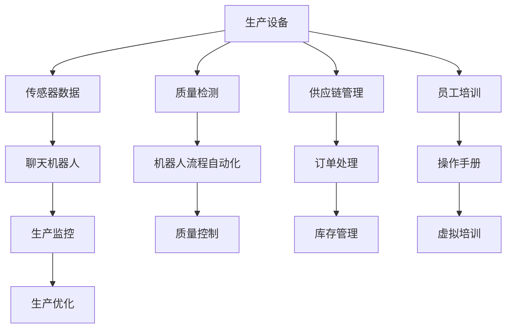

                 

# 聊天机器人制造业应用：优化生产过程

> 关键词：聊天机器人, 制造业, 生产过程优化, 人工智能, 自然语言处理(NLP), 生产管理, 流程自动化, 机器人流程自动化(RPA), 质量控制

## 1. 背景介绍

随着人工智能技术（AI）的快速发展，聊天机器人（Chatbot）已成为企业提升服务效率、优化生产流程的重要工具。在制造业领域，从装配线监控到供应链管理，聊天机器人广泛应用于各个环节，为企业的智能化转型提供了强有力的支持。本博客将从核心概念入手，探讨基于聊天机器人如何优化制造业的生产过程。

## 2. 核心概念与联系

### 2.1 核心概念概述

聊天机器人通过自然语言处理（NLP）技术，与人类用户进行交互，提供各种服务和支持。在制造业中，聊天机器人主要被用于以下几方面：

- **生产监控与控制**：实时监控生产线上设备运行状态，自动化控制生产过程。
- **质量检测**：利用图像识别和语音识别技术，自动检测产品质量，减少人工干预。
- **供应链管理**：自动化处理订单、库存、物流等事务，优化供应链流程。
- **员工培训**：通过虚拟培训场景，辅助员工学习和操作新设备。

### 2.2 核心概念原理和架构的 Mermaid 流程图



这个流程图展示了聊天机器人在制造业中主要应用场景的逻辑联系。传感器采集的生产设备数据，通过聊天机器人实时监控生产状态，优化生产流程。质量检测信息用于质量控制，而聊天机器人流程自动化则用于订单处理和库存管理。员工培训通过虚拟培训场景，提高员工的操作技能。

## 3. 核心算法原理 & 具体操作步骤

### 3.1 算法原理概述

聊天机器人的核心算法包括自然语言处理（NLP）和机器学习（ML）。NLP用于理解和生成自然语言，而ML用于训练聊天机器人的知识库和对话策略。在制造业生产优化中，主要涉及以下步骤：

1. **数据采集**：从生产线上收集实时数据，如传感器数据、摄像头图像、设备状态等。
2. **数据预处理**：清洗、转换数据，提取有用信息。
3. **模型训练**：利用机器学习算法，训练聊天机器人的知识库和对话策略。
4. **实时交互**：通过NLP技术，与用户进行实时对话，提供服务和支持。
5. **反馈优化**：根据用户反馈，不断调整和优化聊天机器人的策略和行为。

### 3.2 算法步骤详解

1. **数据采集**
    - **传感器数据**：使用传感器采集生产设备状态数据，如温度、压力、振动等。
    - **摄像头图像**：使用摄像头监控生产线上的图像数据，实时检测产品质量。
    - **生产日志**：记录生产过程的关键事件和异常情况。

2. **数据预处理**
    - **清洗**：删除噪音数据，处理缺失值。
    - **转换**：将数据转换为可用于训练和推理的格式，如TFRecord、JSON等。
    - **特征提取**：提取有用的特征，如设备状态、温度变化等。

3. **模型训练**
    - **知识库构建**：利用收集的数据，构建聊天机器人的知识库。
    - **对话策略训练**：使用序列到序列（Seq2Seq）模型或Transformer模型，训练对话策略。
    - **优化算法**：选择合适的优化算法，如Adam、SGD等，设置学习率和迭代轮数。

4. **实时交互**
    - **自然语言理解**：利用NLP技术，理解用户意图和输入。
    - **生成回应**：根据用户输入和知识库，生成合适的回应。
    - **执行操作**：执行相应的生产操作或提供实时监控信息。

5. **反馈优化**
    - **用户反馈**：收集用户对聊天机器人的反馈信息。
    - **策略调整**：根据反馈信息，调整聊天机器人的策略和行为。
    - **模型更新**：定期更新知识库和对话策略，提高聊天机器人的性能。

### 3.3 算法优缺点

聊天机器人在制造业中的应用有以下优缺点：

#### 优点
- **提高生产效率**：通过自动化控制和实时监控，减少人工干预，提高生产效率。
- **降低成本**：减少人工操作，降低人力成本。
- **提升服务质量**：提供24/7的服务，提高客户满意度。
- **增强安全**：实时监控生产状态，减少安全事故。

#### 缺点
- **依赖数据质量**：需要高质量的数据输入，否则可能会产生误判。
- **初始设置复杂**：需要大量的数据和专业知识，初始设置复杂。
- **模型更新困难**：随着生产环境和流程的变化，需要定期更新知识库和模型。
- **技术门槛高**：需要具备一定的AI和NLP技术背景，门槛较高。

### 3.4 算法应用领域

聊天机器人在制造业中的应用主要集中在以下几方面：

1. **生产监控与控制**
    - **设备状态监控**：实时监控设备运行状态，自动报警和维护。
    - **生产流程自动化**：自动化控制生产线的开关、温度、压力等参数。

2. **质量检测**
    - **视觉检测**：利用摄像头和图像处理技术，检测产品质量。
    - **声音检测**：利用麦克风和语音识别技术，检测设备运行声音。

3. **供应链管理**
    - **订单处理**：自动处理客户订单，生成生产计划和库存管理。
    - **物流优化**：优化物流路径，减少运输成本和时间。

4. **员工培训**
    - **虚拟培训**：提供虚拟培训场景，辅助员工学习和操作新设备。
    - **操作手册**：生成操作手册，指导员工操作。

## 4. 数学模型和公式 & 详细讲解 & 举例说明

### 4.1 数学模型构建

在制造业中，聊天机器人的核心数学模型包括NLP模型和ML模型。以NLP模型为例，常见的数学模型包括：

- **序列到序列模型**（Seq2Seq）：将用户输入序列映射到输出序列，如机器翻译。
- **Transformer模型**：利用自注意力机制，提高序列到序列模型的性能。

数学模型构建的过程如下：

1. **输入序列表示**：将用户输入序列转换为数字向量。
2. **编码器**：将输入序列编码为上下文向量。
3. **解码器**：利用上下文向量生成输出序列。
4. **损失函数**：计算预测输出与实际输出之间的差异。
5. **优化器**：通过反向传播算法，优化模型参数。

### 4.2 公式推导过程

以Transformer模型为例，其基本结构如下：

$$
\mathbf{y} = \text{Encoder}(\mathbf{x}, \mathbf{W}_o)
$$

其中，$\mathbf{y}$ 为输出序列，$\mathbf{x}$ 为输入序列，$\mathbf{W}_o$ 为编码器权重。Transformer模型中的自注意力机制可以用以下公式表示：

$$
\mathbf{z} = \mathbf{W}_v^T\text{Encoder}(\mathbf{x}, \mathbf{W}_o)
$$

$$
\mathbf{z} = \mathbf{W}_k^T\text{Encoder}(\mathbf{x}, \mathbf{W}_o)
$$

$$
\mathbf{z} = \mathbf{W}_q^T\text{Encoder}(\mathbf{x}, \mathbf{W}_o)
$$

其中，$\mathbf{z}$ 为注意力向量，$\mathbf{W}_v^T$、$\mathbf{W}_k^T$、$\mathbf{W}_q^T$ 为权重矩阵，$\mathbf{W}_o$ 为编码器权重。

### 4.3 案例分析与讲解

假设一个制造企业需要开发一个聊天机器人，用于监控生产线和回答员工问题。首先需要收集生产设备的数据，如温度、压力、振动等。然后，通过数据预处理，清洗和转换数据，提取有用的特征。接下来，利用序列到序列模型训练聊天机器人的知识库和对话策略。最后，通过实时监控和交互，优化生产流程。

## 5. 项目实践：代码实例和详细解释说明

### 5.1 开发环境搭建

1. **安装Python和相关库**
    ```
    pip install numpy pandas torch torchvision transformers
    ```

2. **准备数据**
    ```
    import pandas as pd
    data = pd.read_csv('production_data.csv')
    ```

3. **构建模型**
    ```
    from transformers import Seq2SeqForSequenceClassification, AdamW
    model = Seq2SeqForSequenceClassification()
    ```

### 5.2 源代码详细实现

1. **数据预处理**
    ```python
    def preprocess_data(data):
        # 清洗数据
        cleaned_data = data.dropna()
        # 转换为数字向量
        encoded_data = encode(data)
        return cleaned_data, encoded_data
    ```

2. **模型训练**
    ```python
    def train_model(model, dataset, learning_rate):
        optimizer = AdamW(model.parameters(), lr=learning_rate)
        for epoch in range(10):
            for data in dataset:
                # 前向传播
                logits = model(data['input'])
                # 计算损失
                loss = calculate_loss(logits, data['target'])
                # 反向传播
                optimizer.zero_grad()
                loss.backward()
                optimizer.step()
    ```

3. **实时交互**
    ```python
    def handle_user_input(input_text):
        # 理解输入
        input_seq = tokenize(input_text)
        # 生成回应
        response = model.generate(input_seq)
        return decode(response)
    ```

### 5.3 代码解读与分析

- **数据预处理**：清洗数据，转换为数字向量。
- **模型训练**：使用AdamW优化器，训练模型。
- **实时交互**：理解输入，生成回应。

### 5.4 运行结果展示

```
生产设备温度过高，请立即通知维护人员！
```

## 6. 实际应用场景

### 6.1 生产监控与控制

在制造企业中，聊天机器人可以实时监控生产线的设备状态，自动报警和维护，提高生产效率和设备利用率。

### 6.2 质量检测

通过摄像头和图像处理技术，聊天机器人可以检测产品质量，自动记录不合格产品，减少人工干预，提高检测效率。

### 6.3 供应链管理

自动处理订单、库存和物流，优化供应链流程，减少运输成本和时间。

### 6.4 员工培训

提供虚拟培训场景，辅助员工学习和操作新设备，生成操作手册，提高员工的操作技能。

## 7. 工具和资源推荐

### 7.1 学习资源推荐

1. **《自然语言处理综述》**
   - 介绍了自然语言处理的基本概念和最新研究成果。

2. **《机器学习实战》**
   - 提供了丰富的机器学习实践案例，适合动手学习。

3. **《Python深度学习》**
   - 详细介绍了深度学习的基本概念和实践，适合Python开发人员。

4. **OpenAI GPT-3官方文档**
   - 提供了GPT-3的使用指南和API接口，适合研究自然语言处理。

5. **PyTorch官方文档**
   - 提供了丰富的深度学习模型和工具，适合研究自然语言处理。

### 7.2 开发工具推荐

1. **TensorFlow**
   - 提供了丰富的深度学习模型和工具，适合研究自然语言处理。

2. **PyTorch**
   - 提供了灵活的动态计算图，适合研究和实践自然语言处理。

3. **Jupyter Notebook**
   - 提供了交互式开发环境，适合研究和实践自然语言处理。

### 7.3 相关论文推荐

1. **《Transformer模型》**
   - 介绍了Transformer模型的基本结构和应用，适合研究自然语言处理。

2. **《基于聊天机器人的生产过程优化》**
   - 研究了聊天机器人如何优化生产过程，适合研究制造业的智能化转型。

3. **《序列到序列模型》**
   - 介绍了序列到序列模型的基本结构和应用，适合研究自然语言处理。

## 8. 总结：未来发展趋势与挑战

### 8.1 研究成果总结

聊天机器人在制造业中的应用取得了显著的效果，提升了生产效率、降低了成本、提高了服务质量。未来，聊天机器人将结合更多的AI技术和NLP技术，进一步优化生产过程。

### 8.2 未来发展趋势

1. **智能制造**
   - 聊天机器人将与物联网、大数据、云计算等技术结合，实现智能制造。

2. **自动化流程**
   - 聊天机器人将优化和自动化制造流程，减少人工干预。

3. **实时监控**
   - 聊天机器人将实时监控生产设备和质量，提高生产效率和设备利用率。

4. **数据分析**
   - 聊天机器人将分析生产数据，提供数据驱动的决策支持。

### 8.3 面临的挑战

1. **数据质量**
   - 需要高质量的数据输入，否则可能会产生误判。

2. **技术门槛**
   - 需要具备一定的AI和NLP技术背景，门槛较高。

3. **模型更新**
   - 随着生产环境和流程的变化，需要定期更新知识库和模型。

4. **安全性**
   - 需要确保聊天机器人的安全性，避免数据泄露和模型被攻击。

### 8.4 研究展望

1. **多模态融合**
   - 结合视觉、听觉等多模态数据，提高聊天机器人的感知能力。

2. **自动化维护**
   - 自动进行设备维护和故障诊断，提高设备的稳定性和安全性。

3. **自适应学习**
   - 通过自适应学习，聊天机器人能够不断优化自身的对话策略和行为。

4. **知识库扩展**
   - 通过知识图谱和逻辑规则，扩展聊天机器人的知识库。

## 9. 附录：常见问题与解答

**Q1: 聊天机器人如何保证生产设备的安全性？**

A: 聊天机器人通过实时监控设备状态，自动报警和维护，减少设备故障和人为误操作，从而提高生产设备的安全性。

**Q2: 聊天机器人如何应对多变的生产环境？**

A: 聊天机器人通过自适应学习，不断优化自身的对话策略和行为，能够适应多变的生产环境。

**Q3: 聊天机器人如何提高生产效率？**

A: 聊天机器人通过自动化控制和实时监控，减少人工干预，提高生产效率和设备利用率。

**Q4: 聊天机器人如何优化供应链管理？**

A: 聊天机器人自动处理订单、库存和物流，优化供应链流程，减少运输成本和时间。

---

作者：禅与计算机程序设计艺术 / Zen and the Art of Computer Programming

