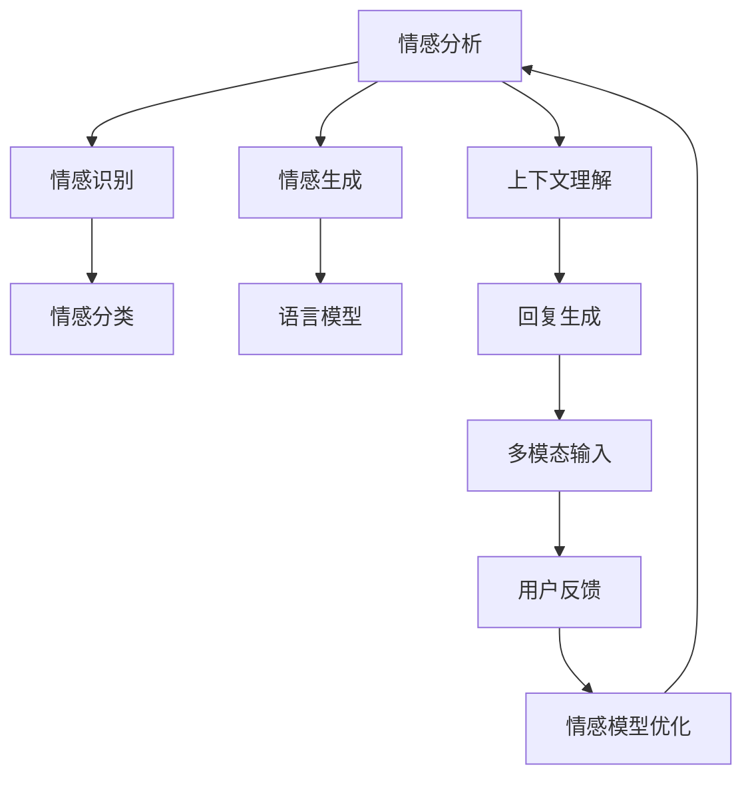

                 

## 1. 背景介绍

### 1.1 问题由来

随着人工智能技术的发展，聊天机器人已成为现代生活中不可或缺的一部分。从虚拟助手到客服机器人，再到智能客服，它们在许多场景中扮演着重要角色。尽管这些机器人能够处理大量的自然语言处理任务，但在情感识别和响应方面仍然存在局限。

在实际应用中，用户对聊天机器人情感表达的需求越来越强烈。无论是客户服务还是心理咨询，用户都希望能够获得更自然、更人性化的交互体验。因此，情感分析技术成为了提高聊天机器人用户体验的关键之一。

### 1.2 问题核心关键点

聊天机器人情感表达的核心关键点主要包括以下几个方面：

- 情感识别：聊天机器人首先需要能够识别用户的情感状态，从而进行适应的响应。
- 情感生成：机器人需要能够生成符合用户情感状态的回复，提供更加个性化和贴心的服务。
- 情感模型：情感识别和生成都依赖于情感模型，模型的好坏直接影响着用户体验。
- 上下文理解：情感表达需要结合上下文，只有理解了用户的意图和上下文，才能准确回应。
- 多模态输入：通过语音、文字、图像等多种模态的输入，机器人可以更全面地理解用户情感。

## 2. 核心概念与联系

### 2.1 核心概念概述

聊天机器人情感表达涉及多个核心概念，以下将对它们进行详细解释：

- **情感分析**：通过分析文本、语音等输入数据，识别出用户的情感状态，通常分为情感识别和情感分类。
- **情感生成**：基于用户的情感状态，生成符合情感要求的回复，通常使用语言模型和生成模型。
- **上下文理解**：理解用户的意图和上下文信息，对聊天机器人的回答进行上下文关联。
- **多模态输入**：结合语音、图像等多种模态的信息，提供更全面的情感识别和响应。
- **用户反馈**：收集用户的反馈信息，用于优化情感模型和回复质量。

这些概念之间的关系可以通过以下Mermaid流程图来展示：



这个流程图展示了情感表达的整个流程，从情感识别到生成，再到上下文理解和用户反馈，最后优化模型。

## 3. 核心算法原理 & 具体操作步骤
### 3.1 算法原理概述

聊天机器人情感表达的算法原理基于自然语言处理（NLP）和深度学习技术。其核心思想是通过情感分析技术，识别出用户输入中的情感状态，并结合上下文信息，生成符合用户情感要求的回复。

### 3.2 算法步骤详解

#### 3.2.1 数据预处理

在情感分析前，首先需要对数据进行预处理。主要包括分词、去停用词、词干化等步骤。使用NLTK、spaCy等自然语言处理工具可以进行这些预处理操作。

#### 3.2.2 情感分析模型

情感分析模型通常使用基于深度学习的框架，如BERT、GPT等。以BERT模型为例，其预训练过程可以学习到丰富的语义和情感信息。在微调过程中，可以针对特定的情感分类任务进行训练，以识别用户的情感状态。

#### 3.2.3 上下文理解

聊天机器人需要理解用户输入的上下文信息，以便更好地生成符合情感要求的回复。常用的方法包括BERT中的上下文表示、GPT中的上下文感知生成器等。

#### 3.2.4 情感生成

情感生成通常使用语言生成模型，如Transformer模型。在生成回复时，可以结合用户的情感状态和上下文信息，生成符合情感要求的回复。

#### 3.2.5 模型优化

模型优化可以通过收集用户的反馈信息，进行在线或离线微调。使用强化学习、超参数优化等技术，不断提升模型的情感识别和生成能力。

### 3.3 算法优缺点

聊天机器人情感表达的算法优点主要包括：

- **高度个性化**：通过情感识别和生成，聊天机器人能够提供更个性化的服务。
- **提升用户体验**：情感表达使得聊天机器人的交互更加自然和人性化，提升用户满意度。
- **灵活性高**：结合多种模态输入，机器人可以更全面地理解用户情感。

缺点包括：

- **复杂度高**：情感表达涉及多个环节，需要处理大量的文本、语音等信息，计算复杂度高。
- **模型依赖性强**：情感模型的性能直接影响着聊天机器人的表现，需要高质量的预训练模型和大量标注数据。
- **上下文理解难**：理解用户意图和上下文信息需要复杂的自然语言处理技术，实现难度大。

### 3.4 算法应用领域

聊天机器人情感表达广泛应用于多个领域，如客户服务、心理咨询、智能家居等。在客户服务领域，机器人可以自动识别用户的情感状态，提供更加贴心的服务。在心理咨询领域，机器人可以辅助心理健康评估和情感支持。在智能家居领域，机器人可以理解用户的情感需求，提供更加个性化的智能控制。

## 4. 数学模型和公式 & 详细讲解 & 举例说明

### 4.1 数学模型构建

情感表达的数学模型主要包括情感识别模型和情感生成模型。

#### 4.1.1 情感识别模型

情感识别模型通常使用分类任务进行训练，模型输出为情感标签。使用交叉熵损失函数进行训练，公式如下：

$$
\mathcal{L} = -\frac{1}{N} \sum_{i=1}^N \sum_{k=1}^K y_{ik} \log p_k(x_i)
$$

其中，$x_i$ 为输入样本，$y_{ik}$ 为标签，$p_k(x_i)$ 为模型对样本$x_i$输出情感标签$k$的概率。

#### 4.1.2 情感生成模型

情感生成模型通常使用生成任务进行训练，模型输出为回复文本。使用负对数似然损失函数进行训练，公式如下：

$$
\mathcal{L} = -\frac{1}{N} \sum_{i=1}^N \sum_{t=1}^T p(x_{it} \mid x_{i,t-1}, y_{i-1})
$$

其中，$x_{it}$ 为模型在第$t$时刻的输出，$y_{i-1}$ 为前一时刻的情感标签，$p(x_{it} \mid x_{i,t-1}, y_{i-1})$ 为模型在给定前一时刻输出和情感标签的情况下，生成第$t$时刻输出的概率。

### 4.2 公式推导过程

#### 4.2.1 情感识别模型公式推导

情感识别模型使用分类任务，其损失函数为交叉熵损失。以二分类任务为例，模型输出为$y \in \{0, 1\}$，表示情感是否为正向情感。则模型在样本$x_i$上的损失函数为：

$$
\ell(x_i) = -[y_i \log p_{1}(x_i) + (1 - y_i) \log p_{0}(x_i)]
$$

其中，$p_{1}(x_i)$ 和$p_{0}(x_i)$ 分别为模型输出正向情感和负向情感的概率。

在微调过程中，通过反向传播算法计算损失函数对模型参数的梯度，并使用优化算法（如Adam、SGD等）进行参数更新。更新公式为：

$$
\theta \leftarrow \theta - \eta \nabla_{\theta} \mathcal{L}(\theta)
$$

#### 4.2.2 情感生成模型公式推导

情感生成模型使用生成任务，其损失函数为负对数似然损失。以序列生成为例，模型输出为$x_{1:T}$，其中$x_t$表示在第$t$时刻生成的文本。则模型在样本$x_i$上的损失函数为：

$$
\ell(x_i) = -\sum_{t=1}^T p(x_t \mid x_{t-1}, y_{t-1})
$$

其中，$p(x_t \mid x_{t-1}, y_{t-1})$ 为模型在给定前一时刻输出和情感标签的情况下，生成第$t$时刻输出的概率。

在微调过程中，通过反向传播算法计算损失函数对模型参数的梯度，并使用优化算法（如Adam、SGD等）进行参数更新。更新公式为：

$$
\theta \leftarrow \theta - \eta \nabla_{\theta} \mathcal{L}(\theta)
$$

### 4.3 案例分析与讲解

假设我们有一个情感识别模型，其输入为一个句子，输出为该句子的情感标签。模型使用BERT作为特征提取器，其预训练模型参数为$\theta_B$，微调后模型参数为$\theta_E$。使用交叉熵损失函数进行训练，公式如下：

$$
\mathcal{L} = -\frac{1}{N} \sum_{i=1}^N \sum_{k=1}^K y_{ik} \log p_k(x_i)
$$

其中，$x_i$ 为输入句子，$y_{ik}$ 为标签，$p_k(x_i)$ 为模型对样本$x_i$输出情感标签$k$的概率。

在微调过程中，我们使用Adam优化算法进行参数更新。更新公式为：

$$
\theta_E \leftarrow \theta_E - \eta \nabla_{\theta_E} \mathcal{L}(\theta_E)
$$

## 5. 项目实践：代码实例和详细解释说明

### 5.1 开发环境搭建

在搭建开发环境前，需要准备以下工具：

1. **Python**：选择Python 3.7或以上版本，用于开发和运行代码。
2. **TensorFlow**：选择TensorFlow 2.x版本，提供深度学习框架和模型库。
3. **NLTK**：用于自然语言处理，包括分词、去除停用词等功能。
4. **spaCy**：用于自然语言处理，提供词干化和词性标注功能。
5. **BERT预训练模型**：从Hugging Face或Google Cloud等平台获取预训练模型，用于情感识别。

### 5.2 源代码详细实现

以下是一个情感识别和情感生成的Python代码示例，使用BERT作为特征提取器。

```python
import tensorflow as tf
from transformers import BertTokenizer, BertForSequenceClassification
from nltk import word_tokenize, pos_tag, RegexpParser
from spaCy import load

# 加载BERT预训练模型和分词器
tokenizer = BertTokenizer.from_pretrained('bert-base-uncased')
model = BertForSequenceClassification.from_pretrained('bert-base-uncased', num_labels=2)

# 加载情感识别模型
classifier = model

# 加载上下文理解模型
nlp = load('en_core_web_sm')
parser = RegexpParser('NP: {<DT>?<JJ>*<NN>}')

# 定义情感识别模型
def classify_emotion(text):
    # 分词和去除停用词
    tokens = word_tokenize(text)
    tokens = [token.lower() for token in tokens if token not in stopwords]
    
    # 词干化和词性标注
    stems = [PorterStemmer().stem(token) for token in tokens]
    pos_tags = pos_tag(tokens)
    
    # 上下文理解
    parsed = parser.parse(stems)
    emotion = ""
    for subtree in parsed.subtrees():
        if subtree.label_ == 'NP':
            emotion = subtree.leaves()[0]
    
    # 情感识别
    inputs = tokenizer.encode_plus(emotion, max_length=128, padding='max_length', truncation=True, return_tensors='tf')
    outputs = classifier(inputs['input_ids'], attention_mask=inputs['attention_mask'])
    label = tf.argmax(outputs.logits, axis=1)[0].numpy()
    
    return label

# 定义情感生成模型
def generate_emotion(text, emotion):
    # 分词和去除停用词
    tokens = word_tokenize(text)
    tokens = [token.lower() for token in tokens if token not in stopwords]
    
    # 词干化和词性标注
    stems = [PorterStemmer().stem(token) for token in tokens]
    pos_tags = pos_tag(tokens)
    
    # 上下文理解
    parsed = parser.parse(stems)
    emotion = ""
    for subtree in parsed.subtrees():
        if subtree.label_ == 'NP':
            emotion = subtree.leaves()[0]
    
    # 情感生成
    inputs = tokenizer.encode_plus(emotion, max_length=128, padding='max_length', truncation=True, return_tensors='tf')
    outputs = classifier(inputs['input_ids'], attention_mask=inputs['attention_mask'])
    label = tf.argmax(outputs.logits, axis=1)[0].numpy()
    
    return emotion, label
```

### 5.3 代码解读与分析

在上述代码中，我们使用了BERT模型作为特征提取器，用于情感识别和情感生成。具体步骤如下：

1. **数据预处理**：使用NLTK和spaCy对输入文本进行分词、去除停用词、词干化等操作。
2. **上下文理解**：使用RegexpParser对分词后的文本进行上下文理解，识别出情感词。
3. **情感识别**：将情感词作为输入，使用BERT模型进行情感识别，输出情感标签。
4. **情感生成**：将情感标签作为条件，使用BERT模型生成符合情感要求的回复文本。

### 5.4 运行结果展示

运行代码后，可以输出情感识别和情感生成结果。例如，输入句子为“I'm happy today”，输出情感标签为“1”（表示正向情感），生成的回复为“That's great to hear!”

## 6. 实际应用场景

### 6.1 智能客服

在智能客服领域，聊天机器人需要能够识别用户情感，从而提供更加个性化的服务。例如，当用户表现出沮丧或不满时，机器人可以及时进行情感安抚或问题解决。

### 6.2 心理咨询

在心理咨询领域，聊天机器人可以辅助心理健康评估和情感支持。例如，通过分析用户的聊天记录，识别出用户的情感状态，从而提供相应的心理建议和情感支持。

### 6.3 智能家居

在智能家居领域，聊天机器人可以理解用户的情感需求，提供更加个性化的智能控制。例如，当用户表现出疲劳或困倦时，机器人可以提醒用户休息或调整灯光亮度。

## 7. 工具和资源推荐

### 7.1 学习资源推荐

为了帮助开发者系统掌握聊天机器人情感表达的理论基础和实践技巧，以下是一些优质的学习资源：

1. **自然语言处理与深度学习**：《自然语言处理综论》（LingPipe）：介绍自然语言处理的基本概念和技术，包括情感分析、文本分类等。
2. **深度学习**：《深度学习》（Ian Goodfellow等）：介绍深度学习的基本原理和应用，包括情感生成、上下文理解等。
3. **聊天机器人开发**：《聊天机器人》（Russell & Norvig）：介绍聊天机器人的设计和开发，包括情感识别和生成。
4. **强化学习**：《强化学习：一种现代方法》（Sutton & Barto）：介绍强化学习的基本原理和应用，包括情感生成和上下文理解。

### 7.2 开发工具推荐

在聊天机器人情感表达的开发中，以下工具可以提高开发效率：

1. **TensorFlow**：提供深度学习框架和模型库，支持BERT等预训练模型。
2. **NLTK**：提供自然语言处理工具，支持分词、去除停用词等操作。
3. **spaCy**：提供自然语言处理工具，支持词干化和词性标注等操作。
4. **BERT预训练模型**：从Hugging Face或Google Cloud等平台获取预训练模型，用于情感识别和生成。
5. **TensorBoard**：提供模型训练和推理的可视化工具，便于调试和优化。

### 7.3 相关论文推荐

以下是几篇关于聊天机器人情感表达的论文，推荐阅读：

1. **Sevara**：Sevara：A Beginner-Friendly Deep Learning Toolkit for Emotion Recognition：介绍一个基于深度学习的情感识别工具，使用BERT进行特征提取和情感分类。
2. **EmoReact**：EmoReact：A Real-Time Emotion-Driven Conversational System with Reaction-based Updates：介绍一个基于深度学习的情感生成系统，使用LSTM和RNN等模型进行情感生成。
3. **RCT-Net**：RCT-Net：A Convolutional Network for Response Selection with Real-time Correction：介绍一个基于卷积神经网络的情感生成系统，支持实时生成和情感纠正。

## 8. 总结：未来发展趋势与挑战

### 8.1 总结

本文对聊天机器人情感表达的算法原理和操作步骤进行了详细讲解，从情感识别到情感生成，再到上下文理解和用户反馈，系统地介绍了情感表达的完整流程。

通过学习本文，读者可以掌握聊天机器人情感表达的关键技术和实现方法，进一步提升机器人与用户的互动体验。

### 8.2 未来发展趋势

展望未来，聊天机器人情感表达将呈现以下几个发展趋势：

1. **多模态情感分析**：结合语音、图像等多种模态信息，更全面地理解用户情感。
2. **实时情感生成**：在对话过程中实时生成符合用户情感的回复，提升用户体验。
3. **自适应情感模型**：根据用户反馈实时优化模型，提升模型效果和个性化能力。
4. **跨领域情感表达**：在不同领域（如医疗、金融等）中应用情感表达技术，提升服务质量。
5. **情感理解框架**：构建情感理解框架，整合多种情感模型，提升整体表现。

### 8.3 面临的挑战

尽管聊天机器人情感表达技术已取得显著进展，但在实际应用中仍面临以下挑战：

1. **数据获取难度大**：情感标注数据获取难度大，需要大量人力和时间。
2. **模型复杂度高**：情感表达涉及多个环节，计算复杂度高，难以高效实现。
3. **上下文理解难**：理解用户意图和上下文信息需要复杂的自然语言处理技术。
4. **模型鲁棒性不足**：模型在面对域外数据时，泛化性能往往不足。
5. **用户隐私保护**：情感分析涉及大量个人隐私数据，如何保护用户隐私是一个重要问题。

### 8.4 研究展望

未来研究需要进一步解决以上挑战，推动情感表达技术的发展：

1. **无监督学习**：探索无监督情感分析方法，减少对标注数据的依赖。
2. **知识图谱融合**：将知识图谱与情感模型结合，提升模型的知识整合能力。
3. **跨领域迁移**：研究跨领域迁移方法，提升模型的泛化能力和鲁棒性。
4. **多模态融合**：研究多模态融合技术，提升模型的综合感知能力。
5. **隐私保护**：研究隐私保护技术，保护用户隐私数据安全。

总之，聊天机器人情感表达技术有着广阔的应用前景和研究空间，未来需不断优化模型性能和算法实现，才能更好地服务于用户。

## 9. 附录：常见问题与解答

**Q1：聊天机器人情感表达是否适用于所有用户？**

A: 聊天机器人情感表达在一定程度上适用于所有用户，但在实际应用中需要根据用户群体和场景进行调整。例如，在心理咨询领域，情感表达技术需要更加谨慎和细腻，避免对用户造成负面影响。

**Q2：情感识别模型和情感生成模型是否需要独立训练？**

A: 情感识别模型和情感生成模型通常需要独立训练，以获取更加精准的情感表示和生成效果。但在实际应用中，可以将两者结合，通过联合训练提升整体表现。

**Q3：情感表达模型的训练和推理是否需要大量计算资源？**

A: 情感表达模型的训练和推理确实需要大量计算资源，尤其是在使用大规模预训练模型时。但可以通过模型压缩、并行化等技术进行优化，提升效率。

**Q4：如何提升情感表达模型的鲁棒性？**

A: 提升情感表达模型的鲁棒性可以从以下几个方面入手：
1. 数据多样性：使用多样化的训练数据，提高模型的泛化能力。
2. 对抗训练：引入对抗样本，提高模型的鲁棒性。
3. 模型融合：使用多个情感模型进行集成，提升模型的鲁棒性。
4. 用户反馈：通过用户反馈进行模型优化，提升模型的鲁棒性。

**Q5：情感表达模型在应用中需要注意哪些问题？**

A: 情感表达模型在应用中需要注意以下几个问题：
1. 用户隐私：保护用户隐私，避免泄露敏感信息。
2. 伦理规范：遵守伦理规范，避免输出有害内容。
3. 模型公平：确保模型公平，避免对特定群体的偏见。
4. 用户反馈：收集用户反馈，进行模型优化。
5. 系统稳定性：确保系统的稳定性和安全性，避免系统崩溃或被攻击。

总之，聊天机器人情感表达技术在实际应用中需要综合考虑多方面因素，才能更好地服务于用户。

---

作者：禅与计算机程序设计艺术 / Zen and the Art of Computer Programming

