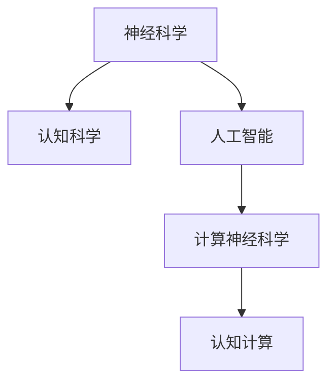

                 

## 1. 背景介绍

### 1.1 问题由来

人工智能(AI)和脑科学是当今科学和技术领域的两大前沿领域，各自在理论和应用上都取得了显著进展。近年来，脑科学与AI的交叉研究逐渐成为热点，揭示了智能的根本来源，为AI技术的发展带来了新的视角和方向。

### 1.2 问题核心关键点

脑科学与AI的交叉研究关注的核心问题包括：
1. **智能的本质**：理解人类智能的核心机制，为AI系统的设计提供生物学基础。
2. **认知过程建模**：将人类认知过程抽象为计算模型，指导AI算法的设计与优化。
3. **认知机制与神经网络的关联**：探索神经网络模型与人类认知机制之间的联系，促进认知计算的发展。
4. **计算能力与生物计算**：比较AI计算模型与人类生物神经网络之间的计算能力和效率，寻找可能的改进方向。
5. **智能的伦理和社会影响**：探讨AI技术的伦理和社会影响，推动智能技术的负责任应用。

这些核心问题不仅涉及理论上的深度研究，也关乎实际应用的广泛意义。脑科学与AI的交叉研究为理解智能的奥秘和推动AI技术的实际应用提供了新的思路和方法。

### 1.3 问题研究意义

脑科学与AI的交叉研究具有重要的学术和实践意义：
1. **理论创新**：结合神经科学和认知科学的最新研究成果，推动AI理论的创新和突破。
2. **应用拓展**：为AI技术提供新的算法和方法，增强其在医学、教育、交通等领域的应用潜力。
3. **伦理引导**：从脑科学的角度出发，为AI技术的发展提供伦理和社会的引导，确保AI技术的健康发展。
4. **跨学科合作**：促进计算机科学、神经科学、心理学等多个学科的交叉合作，推动科学研究和社会进步。

本文将围绕脑科学与AI的交叉研究，深入探讨智能的本质，揭示认知过程与AI算法的内在联系，分析脑科学对AI技术发展的启发和影响，展望未来发展趋势和面临的挑战。

## 2. 核心概念与联系

### 2.1 核心概念概述

为了更好地理解脑科学与AI的交叉研究，本节将介绍几个密切相关的核心概念：

- **神经科学**：研究神经系统的结构、功能及其与行为的关系，是脑科学与AI交叉研究的重要基础。
- **认知科学**：研究人类认知过程和智能机制，为AI算法的建模和优化提供生物学依据。
- **人工智能**：通过算法和计算模型模拟人类智能，包括感知、学习、推理等能力。
- **计算神经科学**：将计算机科学与神经科学相结合，研究神经网络模型及其在认知过程中的应用。
- **认知计算**：结合认知科学和计算科学，探索认知过程与计算模型的映射关系，指导AI算法的设计。

这些概念之间的逻辑关系可以通过以下Mermaid流程图来展示：



这个流程图展示了几大核心概念之间的关系：

1. 神经科学是认知科学和人工智能的基础。
2. 认知科学为人工智能提供了理论指导和生物学依据。
3. 计算神经科学和认知计算进一步将神经科学和认知科学的研究成果应用于AI技术。

## 3. 核心算法原理 & 具体操作步骤

### 3.1 算法原理概述

脑科学与AI的交叉研究，主要关注如何将认知科学的理论应用于AI算法的设计和优化。核心思想是通过对人类认知过程的理解，构建能够模拟人类智能的计算模型。具体步骤如下：

1. **认知过程建模**：将人类认知过程（如感知、记忆、推理等）抽象为计算模型，用于指导AI算法的设计。
2. **神经网络结构优化**：根据认知科学的理论，优化神经网络的结构和参数，增强其模拟人类智能的能力。
3. **数据驱动的学习**：利用神经科学的研究成果，设计有效的学习方法，提高模型的学习能力和泛化能力。
4. **跨学科融合**：结合神经科学、认知科学和计算机科学的最新研究成果，推动AI技术的发展。

### 3.2 算法步骤详解

脑科学与AI的交叉研究涉及多个学科，以下是具体的步骤详解：

**Step 1: 准备数据集和模型**
- 收集相关领域的神经科学和认知科学数据集，如神经元活动记录、行为数据等。
- 选择合适的神经网络模型，如卷积神经网络(CNN)、循环神经网络(RNN)、Transformer等，进行模型初始化。

**Step 2: 认知过程建模**
- 根据认知科学的研究成果，定义认知过程的计算模型。例如，使用激活函数模拟神经元的活动，使用递归神经网络模拟记忆和推理过程。
- 设计输入输出格式，将神经科学数据映射为神经网络模型的输入和输出。

**Step 3: 模型训练与优化**
- 使用神经科学数据集训练模型，并根据认知科学理论进行优化。例如，使用反向传播算法更新模型参数，调整激活函数和递归连接等方式。
- 在训练过程中引入正则化技术，如L2正则、Dropout等，避免过拟合。

**Step 4: 模型评估与验证**
- 使用独立数据集评估模型性能，包括精确度、召回率、F1值等指标。
- 进行交叉验证，确保模型的泛化能力和鲁棒性。

**Step 5: 实际应用与迭代改进**
- 将训练好的模型应用于实际问题中，进行测试和验证。
- 根据实际应用反馈，进一步迭代改进模型，提升性能。

### 3.3 算法优缺点

脑科学与AI的交叉研究具有以下优点：
1. **理论深度**：结合神经科学和认知科学的最新研究成果，提供了深厚的理论基础。
2. **算法优化**：根据认知过程建模，优化神经网络的结构和参数，提高模型的模拟能力。
3. **数据驱动**：利用神经科学数据进行训练，提升了模型的泛化能力和鲁棒性。

同时，也存在一些局限性：
1. **数据获取难度大**：高质量的神经科学数据获取难度较大，限制了研究进展。
2. **模型复杂度高**：神经网络结构复杂，训练和优化需要大量计算资源和时间。
3. **理论完备性不足**：脑科学和认知科学的部分理论尚未完全成熟，可能影响模型的准确性和泛化能力。

尽管存在这些局限性，脑科学与AI的交叉研究仍是大数据时代下AI技术发展的重要方向，为理解智能本质和推动AI技术应用提供了新的思路和方法。

### 3.4 算法应用领域

脑科学与AI的交叉研究在多个领域具有广泛应用前景：

- **医学诊断**：结合神经科学和认知科学，构建脑疾病诊断和治疗模型，提高诊断准确性和治疗效果。
- **脑机接口**：利用神经科学原理，开发高效脑机接口技术，实现人机互动。
- **认知辅助**：开发认知辅助工具，如智能康复机器人、认知训练软件等，促进特殊教育和技术辅助。
- **智能决策**：结合认知科学和认知计算，优化智能决策算法，应用于金融、交通、制造等领域。
- **情感计算**：研究人类情感的神经机制，构建情感计算模型，增强智能系统的情感理解和互动能力。

## 4. 数学模型和公式 & 详细讲解

### 4.1 数学模型构建

脑科学与AI的交叉研究涉及到复杂的数学模型和公式推导。以下是几个典型的数学模型构建示例：

**感知器模型**：
感知器是神经网络的基本单元，其数学模型如下：
$$
y = \sigma(w^T x + b)
$$
其中，$w$ 为权重向量，$b$ 为偏置项，$x$ 为输入向量，$\sigma$ 为激活函数（如Sigmoid），$y$ 为输出。

**反向传播算法**：
反向传播算法是神经网络训练的主要方法，其核心思想是通过链式法则计算梯度，更新模型参数。反向传播的数学公式如下：
$$
\frac{\partial L}{\partial w} = \frac{\partial L}{\partial y} \frac{\partial y}{\partial z} \frac{\partial z}{\partial w}
$$
其中，$L$ 为损失函数，$y$ 为输出，$z$ 为中间层输出。

**递归神经网络**：
递归神经网络（RNN）用于模拟记忆和序列处理。其数学模型如下：
$$
h_{t} = f(w_{h} h_{t-1} + w_{x} x_{t} + b)
$$
$$
y_{t} = g(w_{y} h_{t} + b)
$$
其中，$h_{t}$ 为记忆单元的输出，$x_{t}$ 为输入，$w_{h}$ 和 $w_{x}$ 为权重矩阵，$b$ 为偏置项，$y_{t}$ 为输出。

### 4.2 公式推导过程

以下以感知器模型为例，进行公式推导过程：

假设输入向量为 $x = (x_1, x_2, ..., x_n)$，权重向量为 $w = (w_1, w_2, ..., w_n)$，偏置项为 $b$，激活函数为 $\sigma$。感知器的输出为 $y = \sigma(w^T x + b)$。

给定输入和输出之间的误差 $\delta$，定义损失函数为均方误差 $L = \frac{1}{2} \delta^2$。则感知器的梯度更新公式为：
$$
w_i \leftarrow w_i - \eta \frac{\partial L}{\partial w_i} = w_i - \eta (\delta \frac{\partial \sigma(w^T x + b)}{\partial w_i})
$$
其中，$\eta$ 为学习率。

将 $\frac{\partial \sigma(w^T x + b)}{\partial w_i}$ 展开，得：
$$
\frac{\partial \sigma(w^T x + b)}{\partial w_i} = \sigma(w^T x + b) (1 - \sigma(w^T x + b)) x_i
$$

带入梯度更新公式，得：
$$
w_i \leftarrow w_i - \eta (\delta \sigma(w^T x + b) (1 - \sigma(w^T x + b)) x_i)
$$

该公式即为感知器模型的梯度更新公式。通过反向传播算法，可以计算任意神经网络模型的梯度，从而进行参数更新。

### 4.3 案例分析与讲解

**案例一：记忆机制的神经网络建模**
- 通过递归神经网络（RNN）模拟人类记忆过程。RNN中的记忆单元 $h_{t}$ 用于存储历史信息，根据当前输入 $x_{t}$ 和记忆单元 $h_{t-1}$，通过线性变换和激活函数计算当前记忆单元输出 $h_{t}$。
- 记忆单元的输出 $h_{t}$ 作为下一层输入，经过进一步的线性变换和激活函数，得到当前输出 $y_{t}$。

**案例二：视觉感知与卷积神经网络**
- 卷积神经网络（CNN）用于模拟视觉感知过程。通过卷积操作提取图像的局部特征，通过池化操作降维并保留主要特征，最终通过全连接层进行分类。
- CNN的每一层通过参数共享和局部连接，减少了模型参数量，提高了计算效率。

## 5. 项目实践：代码实例和详细解释说明

### 5.1 开发环境搭建

在进行脑科学与AI的交叉研究时，需要准备好开发环境。以下是使用Python进行TensorFlow开发的常见环境配置流程：

1. 安装Anaconda：从官网下载并安装Anaconda，用于创建独立的Python环境。

2. 创建并激活虚拟环境：
```bash
conda create -n tf-env python=3.8 
conda activate tf-env
```

3. 安装TensorFlow：根据CUDA版本，从官网获取对应的安装命令。例如：
```bash
conda install tensorflow -c tf
```

4. 安装各类工具包：
```bash
pip install numpy pandas scikit-learn matplotlib tqdm jupyter notebook ipython
```

完成上述步骤后，即可在`tf-env`环境中开始开发实践。

### 5.2 源代码详细实现

下面我们以递归神经网络（RNN）为例，给出使用TensorFlow对认知过程进行建模的代码实现。

首先，定义RNN模型的结构：

```python
import tensorflow as tf

class RNN(tf.keras.Model):
    def __init__(self, input_dim, hidden_dim, output_dim):
        super(RNN, self).__init__()
        self.hidden_dim = hidden_dim
        self.i2h = tf.keras.layers.Dense(hidden_dim, activation='tanh')
        self.h2o = tf.keras.layers.Dense(output_dim, activation='softmax')
        
    def call(self, x, h):
        h = self.i2h(tf.concat([x, h], axis=1))
        h = self.h2o(h)
        return h
```

然后，定义训练和评估函数：

```python
def train_model(model, data, learning_rate, batch_size, epochs):
    model.compile(loss='categorical_crossentropy', optimizer=tf.keras.optimizers.Adam(learning_rate), metrics=['accuracy'])
    
    model.fit(data['x'], data['y'], batch_size=batch_size, epochs=epochs, validation_split=0.2)
    
def evaluate_model(model, data):
    loss, accuracy = model.evaluate(data['x'], data['y'])
    print(f"Loss: {loss}, Accuracy: {accuracy}")
```

最后，启动训练流程并在测试集上评估：

```python
input_dim = 5  # 输入维度
hidden_dim = 10  # 隐藏维度
output_dim = 3  # 输出维度

model = RNN(input_dim, hidden_dim, output_dim)
x_train, y_train = load_data()  # 加载训练数据
x_test, y_test = load_data()  # 加载测试数据

train_model(model, x_train, y_train, batch_size=32, epochs=10)
evaluate_model(model, x_test, y_test)
```

以上就是使用TensorFlow对RNN进行认知过程建模的完整代码实现。可以看到，通过TensorFlow的便捷封装，我们可以轻松实现复杂的神经网络模型。

### 5.3 代码解读与分析

让我们再详细解读一下关键代码的实现细节：

**RNN类**：
- `__init__`方法：初始化模型的层和激活函数。
- `call`方法：定义模型的前向传播过程。在每一层中，将输入与记忆单元连接，并通过线性变换和激活函数计算输出。

**train_model函数**：
- `compile`方法：配置模型的优化器、损失函数和评估指标。
- `fit`方法：使用训练数据集进行模型训练，并进行验证集评估。

**evaluate_model函数**：
- `evaluate`方法：在测试数据集上评估模型性能，输出损失和准确率。

**训练流程**：
- 定义输入和输出维度。
- 创建RNN模型，加载训练数据和测试数据。
- 进行模型训练和评估。

在实际应用中，还需要考虑更多的细节，如模型保存、超参数调优、模型评估等。但核心的脑科学与AI的交叉研究范式基本与此类似。

## 6. 实际应用场景

### 6.1 医学诊断

脑科学与AI的交叉研究在医学诊断领域具有广泛应用前景。通过研究人类大脑的神经机制，结合AI技术，可以开发高效的医疗诊断系统。

具体而言，可以收集大量脑成像数据（如fMRI、PET等），并标注相关疾病（如阿尔茨海默病、抑郁症等）。在此基础上对预训练神经网络进行微调，使其能够自动诊断脑部疾病。通过训练好的模型，可以快速分析新的脑成像数据，辅助医生进行诊断和治疗。

### 6.2 脑机接口

脑机接口（BCI）技术通过将人脑信号转化为机器指令，实现人机互动。脑科学与AI的交叉研究为脑机接口技术的开发提供了重要支持。

例如，通过记录脑电信号（EEG）和脑成像数据（fMRI），结合深度学习模型进行分类和解码。模型可以学习不同脑区对应的功能，将用户的思维指令转化为机器指令，实现人机互动。该技术在康复训练、智能控制等领域具有广泛应用前景。

### 6.3 认知辅助

认知辅助工具可以帮助有特殊需求的人群提高生活质量。通过脑科学与AI的交叉研究，可以开发智能康复机器人、认知训练软件等工具，促进特殊教育和技术辅助。

例如，针对自闭症儿童的认知训练，可以设计特定任务，结合深度学习模型进行训练。模型可以学习自闭症儿童的认知特点，提供个性化的训练方案，提高其认知能力和社交技能。

### 6.4 智能决策

在金融、交通、制造等领域，决策过程中存在大量复杂的数据和信息。脑科学与AI的交叉研究可以优化智能决策算法，提高决策的准确性和效率。

例如，在金融风险评估中，可以结合认知科学的研究成果，构建风险评估模型。模型可以学习风险因素的认知模式，预测金融风险，辅助投资者进行决策。

## 7. 工具和资源推荐

### 7.1 学习资源推荐

为了帮助开发者系统掌握脑科学与AI的交叉研究，这里推荐一些优质的学习资源：

1. 《计算神经科学导论》：本书系统介绍了计算神经科学的基本理论和应用，为脑科学与AI的交叉研究提供了坚实的基础。
2. 《认知计算基础》：本书深入讲解了认知科学和认知计算的基本概念和应用，为AI算法的设计提供了理论指导。
3. 《深度学习与脑科学》：本书结合深度学习和脑科学的研究成果，探讨了智能的本质和AI技术的应用。
4. 《神经网络与深度学习》：本书系统介绍了神经网络和深度学习的基本理论和应用，为AI算法的实现提供了实践指南。

通过对这些资源的学习实践，相信你一定能够快速掌握脑科学与AI的交叉研究方法，并用于解决实际的AI问题。

### 7.2 开发工具推荐

高效的开发离不开优秀的工具支持。以下是几款用于脑科学与AI的交叉研究开发的常用工具：

1. TensorFlow：基于Python的开源深度学习框架，灵活动态的计算图，适合快速迭代研究。
2. PyTorch：基于Python的开源深度学习框架，易于使用的API，适合快速原型设计和实验。
3. Jupyter Notebook：交互式编程环境，支持Python、R、Julia等多种语言，方便共享和学习。
4. Weights & Biases：模型训练的实验跟踪工具，可以记录和可视化模型训练过程中的各项指标，方便对比和调优。
5. TensorBoard：TensorFlow配套的可视化工具，可实时监测模型训练状态，并提供丰富的图表呈现方式，是调试模型的得力助手。

合理利用这些工具，可以显著提升脑科学与AI的交叉研究的开发效率，加快创新迭代的步伐。

### 7.3 相关论文推荐

脑科学与AI的交叉研究涉及到多个领域的前沿研究，以下是几篇奠基性的相关论文，推荐阅读：

1. "A Computational Model of Neuronal Dynamics"：展示了神经元活动与计算模型的联系，推动了认知计算的发展。
2. "Deep Brain Stimulation for Epilepsy: Principles and Practice"：介绍了深度脑刺激技术在医学中的应用，展示了脑科学与AI的结合。
3. "Deep Learning and the Brain"：探讨了深度学习模型在脑科学研究中的应用，揭示了智能的根本来源。
4. "Cognitive Computational Architecture"：详细介绍了认知计算的基本框架和应用，为AI算法的设计提供了指导。

这些论文代表了大脑科学与AI交叉研究的发展脉络。通过学习这些前沿成果，可以帮助研究者把握学科前进方向，激发更多的创新灵感。

## 8. 总结：未来发展趋势与挑战

### 8.1 总结

本文对脑科学与AI的交叉研究进行了全面系统的介绍。首先阐述了脑科学与AI的交叉研究的研究背景和意义，明确了交叉研究在理解智能本质和推动AI技术应用中的重要性。其次，从原理到实践，详细讲解了认知过程与AI算法的内在联系，分析了脑科学对AI技术发展的启发和影响，展望了未来发展趋势和面临的挑战。

通过本文的系统梳理，可以看到，脑科学与AI的交叉研究为理解智能的奥秘和推动AI技术应用提供了新的思路和方法。未来，随着脑科学和AI技术的不断进步，这种交叉研究必将在更多领域得到应用，为人类认知智能的进化带来深远影响。

### 8.2 未来发展趋势

展望未来，脑科学与AI的交叉研究将呈现以下几个发展趋势：

1. **计算能力提升**：随着计算技术的不断进步，神经网络模型的计算能力和效率将显著提升。超级计算机和大规模分布式计算将为复杂认知过程的模拟提供新的可能性。
2. **数据获取和标注**：随着数据采集和标注技术的进步，高质量的神经科学数据将更加容易获取，为认知过程建模提供更多样化的数据支持。
3. **跨学科融合**：脑科学与AI的交叉研究将进一步融合心理学、神经科学、认知科学等多个学科的最新研究成果，推动认知计算的发展。
4. **伦理和社会影响**：随着脑科学与AI技术的不断发展，其伦理和社会影响也将成为重要的研究方向。如何在确保隐私和公平的前提下，推动技术应用，是未来的一个重要课题。
5. **多模态融合**：脑科学与AI的交叉研究将更多地结合视觉、听觉、触觉等多模态信息，构建更加全面和准确的认知模型。

以上趋势凸显了脑科学与AI交叉研究的广阔前景。这些方向的探索发展，必将进一步提升脑科学和AI技术的性能和应用范围，为人类认知智能的进化带来深远影响。

### 8.3 面临的挑战

尽管脑科学与AI的交叉研究已经取得了显著进展，但在迈向更加智能化、普适化应用的过程中，仍面临诸多挑战：

1. **数据获取和标注难度大**：高质量的神经科学数据获取难度较大，限制了研究进展。同时，神经科学数据标注需要高专业性，耗时耗力。
2. **模型复杂度较高**：神经网络模型结构复杂，训练和优化需要大量计算资源和时间。大规模模型的参数量可能达到数亿甚至更多。
3. **理论完备性不足**：脑科学和认知科学的部分理论尚未完全成熟，可能影响模型的准确性和泛化能力。
4. **伦理和社会影响**：脑科学与AI技术的快速发展，可能带来隐私泄露、决策偏见等伦理和社会问题。如何在确保隐私和公平的前提下，推动技术应用，是未来的一个重要课题。
5. **多模态融合难度大**：多模态信息的整合和融合技术仍需进一步突破，才能实现更加全面和准确的认知过程建模。

这些挑战需要跨学科的协同努力，通过不断创新和突破，才能推动脑科学与AI的交叉研究迈向更高的台阶。

### 8.4 研究展望

面对脑科学与AI的交叉研究所面临的挑战，未来的研究需要在以下几个方面寻求新的突破：

1. **数据驱动的模型优化**：通过大规模数据集驱动模型优化，提升模型的泛化能力和鲁棒性。
2. **计算能力和资源优化**：开发高效的计算框架和算法，优化模型的训练和推理过程，提高计算效率和资源利用率。
3. **多模态信息融合**：探索多模态信息的整合和融合技术，构建更加全面和准确的认知模型。
4. **伦理和社会影响**：在技术发展过程中，注重伦理和社会影响，推动技术应用的公平和透明。
5. **跨学科合作**：促进脑科学、认知科学、计算机科学等多个学科的交叉合作，推动认知计算的发展。

这些研究方向的探索，必将引领脑科学与AI的交叉研究迈向更高的台阶，为人类认知智能的进化带来深远影响。

## 9. 附录：常见问题与解答

**Q1：脑科学与AI的交叉研究是否适用于所有AI任务？**

A: 脑科学与AI的交叉研究主要关注认知过程和智能机制，适用于需要理解人类认知模式的AI任务。对于一些任务，如图像识别、自然语言处理等，直接应用深度学习算法即可，无需深入研究认知过程。

**Q2：如何选择适合的神经网络结构？**

A: 选择合适的神经网络结构需要根据具体任务和数据特点进行判断。例如，对于时间序列数据，可以使用递归神经网络（RNN）；对于图像数据，可以使用卷积神经网络（CNN）；对于非结构化数据，可以使用生成对抗网络（GAN）等。

**Q3：脑科学与AI的交叉研究如何与其他AI技术结合？**

A: 脑科学与AI的交叉研究可以与其他AI技术结合，形成更加强大的智能系统。例如，结合知识表示、因果推理、强化学习等技术，可以实现更加全面和灵活的AI应用。

**Q4：脑科学与AI的交叉研究面临哪些资源挑战？**

A: 脑科学与AI的交叉研究面临的主要资源挑战包括：
1. 高质量神经科学数据的获取和标注难度大。
2. 神经网络模型的计算复杂度高，训练和推理资源需求大。
3. 理论完备性不足，需要跨学科的合作和突破。

**Q5：脑科学与AI的交叉研究如何促进AI技术的应用？**

A: 脑科学与AI的交叉研究可以提供更加全面和准确的认知模型，优化AI算法的设计和应用。例如，在智能决策、脑机接口、认知辅助等领域，基于脑科学的AI系统可以提供更加高效和准确的解决方案。

---

作者：禅与计算机程序设计艺术 / Zen and the Art of Computer Programming

