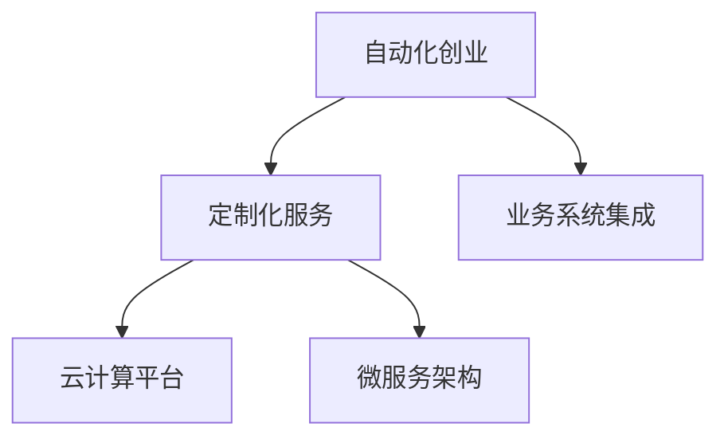

                 

# 自动化创业中的定制化服务模式

## 1. 背景介绍

### 1.1 问题由来

自动化创业的兴起，为传统企业转型带来了新的机遇。但随着市场竞争的加剧，仅仅提供通用解决方案已无法满足客户多样化的需求。因此，针对不同行业、不同规模的企业，提供定制化、个性化的服务模式，成为自动化创业的重要趋势。

当前，人工智能、大数据、云计算等技术在自动化领域已经得到广泛应用，但如何将这些先进技术真正落地到具体业务场景中，依然面临诸多挑战。定制化服务模式的出现，为解决这一问题提供了新的思路和方向。

### 1.2 问题核心关键点

定制化服务模式的核心在于如何构建一个灵活、高效、可扩展的平台，以实现对不同行业、不同企业的业务需求进行快速响应和定制化满足。这种模式需要具备以下几个关键点：

- **灵活性**：平台应能够根据不同企业的业务特点和需求，灵活配置和调整。
- **可扩展性**：平台应能够随着企业业务的增长，快速扩展和升级。
- **定制化能力**：平台应具备强大的定制化服务能力，能够针对不同企业的需求，提供符合其实际情况的解决方案。
- **业务集成能力**：平台应能够与企业的业务系统无缝集成，形成端到端的服务闭环。

### 1.3 问题研究意义

研究和实现定制化服务模式，对于自动化创业具有重要意义：

1. **提升客户满意度**：通过定制化服务，能够更好地满足客户的具体需求，提升客户满意度。
2. **优化资源配置**：定制化服务能够根据企业的实际业务需求，优化资源配置，提高资源利用率。
3. **增强竞争力**：定制化服务模式能够为企业在激烈的市场竞争中脱颖而出，提升企业竞争力。
4. **加速业务创新**：定制化服务能够加速企业业务的创新和转型，推动企业向数字化、智能化方向发展。

## 2. 核心概念与联系

### 2.1 核心概念概述

为更好地理解自动化创业中的定制化服务模式，本节将介绍几个密切相关的核心概念：

- **自动化创业**：利用自动化技术，构建高效、低成本的业务解决方案，帮助企业实现数字化转型。
- **定制化服务**：根据客户的具体需求，提供符合其特定业务场景的解决方案。
- **业务系统集成**：将自动化服务和企业现有的业务系统进行无缝集成，形成端到端的服务闭环。
- **云计算平台**：提供弹性的计算和存储资源，支持大规模、高并发业务。
- **微服务架构**：通过模块化的服务设计，提升系统的灵活性和可扩展性。

这些核心概念之间的逻辑关系可以通过以下Mermaid流程图来展示：



这个流程图展示了大语言模型的核心概念及其之间的关系：

1. 自动化创业通过利用各种先进技术，为客户提供定制化的服务解决方案。
2. 定制化服务需要根据客户的业务需求，灵活配置和调整服务。
3. 业务系统集成将定制化服务与企业的现有系统无缝衔接，形成端到端的服务闭环。
4. 云计算平台提供弹性的资源支持，确保定制化服务的稳定运行。
5. 微服务架构提升服务的灵活性和可扩展性，满足不同规模和类型的企业需求。

## 3. 核心算法原理 & 具体操作步骤

### 3.1 算法原理概述

自动化创业中的定制化服务模式，其核心在于通过构建一个灵活、高效、可扩展的平台，实现对不同行业、不同企业的业务需求进行快速响应和定制化满足。以下是该模式的主要算法原理：

1. **需求分析**：通过与客户沟通，了解其业务需求和痛点。
2. **定制化方案设计**：根据客户需求，设计定制化服务方案。
3. **平台搭建**：构建灵活、高效的业务平台，支持定制化服务。
4. **业务集成**：将定制化服务与企业现有业务系统集成，形成闭环。
5. **监控优化**：实时监控服务运行状态，根据反馈进行优化调整。

### 3.2 算法步骤详解

基于上述算法原理，定制化服务模式的具体操作步骤如下：

**Step 1: 需求分析**

- 与客户进行深入沟通，了解其业务背景、目标、现状和痛点。
- 记录客户需求，整理成需求文档，明确业务目标和具体需求。

**Step 2: 定制化方案设计**

- 根据客户需求，设计定制化服务方案。
- 确定服务架构、技术栈、数据模型、接口设计等关键要素。
- 编写需求说明书，明确服务的范围和具体要求。

**Step 3: 平台搭建**

- 选择合适的技术栈和框架，搭建灵活、高效的业务平台。
- 设计并实现核心功能模块，如数据采集、数据处理、数据分析、模型训练、业务集成等。
- 引入云计算平台，提供弹性的计算和存储资源支持。

**Step 4: 业务集成**

- 将定制化服务与企业现有的业务系统集成，实现端到端的服务闭环。
- 设计并实现API接口，确保系统之间的数据交互。
- 进行系统测试和验收，确保系统稳定运行。

**Step 5: 监控优化**

- 实时监控服务运行状态，收集系统指标和用户反馈。
- 根据监控数据和用户反馈，进行性能优化和功能调整。
- 持续改进服务质量，满足客户需求。

### 3.3 算法优缺点

基于上述算法原理和操作步骤，定制化服务模式具有以下优点：

1. **灵活性高**：通过模块化的设计，平台能够快速适应不同企业的业务需求。
2. **可扩展性好**：云计算平台和微服务架构，支持平台快速扩展和升级。
3. **定制化能力强**：通过灵活配置和调整，平台能够提供符合企业需求的定制化服务。
4. **业务集成度高**：能够与企业现有的业务系统无缝集成，形成端到端的服务闭环。

同时，该模式也存在一些局限性：

1. **定制化成本高**：根据企业需求进行定制化开发，成本较高。
2. **技术复杂度高**：需要具备较强的技术实力和经验，才能保证平台稳定运行。
3. **用户参与度高**：需要与客户进行深度沟通，理解其业务需求，协调资源配置。
4. **维护难度大**：定制化服务需要持续维护和优化，维护成本较高。

尽管存在这些局限性，但总体而言，定制化服务模式为自动化创业提供了新的思路和方向，有助于提升客户满意度，优化资源配置，增强企业竞争力，加速业务创新。

### 3.4 算法应用领域

定制化服务模式在多个领域都有广泛应用，例如：

- **金融行业**：提供智能投顾、风险评估、金融数据分析等定制化服务。
- **医疗行业**：提供健康监测、疾病预测、医疗数据分析等定制化服务。
- **制造业**：提供生产调度、质量控制、设备维护等定制化服务。
- **零售行业**：提供客户推荐、库存管理、销售分析等定制化服务。
- **能源行业**：提供能源监控、设备预测性维护、能效分析等定制化服务。
- **政府机构**：提供公共服务、数据治理、智慧城市等定制化服务。

除了上述这些经典应用外，定制化服务模式还在更多场景中得到了应用，如物流、农业、教育、旅游等，为不同行业提供了高效的自动化解决方案。

## 4. 数学模型和公式 & 详细讲解 & 举例说明

### 4.1 数学模型构建

本节将使用数学语言对自动化创业中的定制化服务模式进行更加严格的刻画。

假设企业的需求用向量 $D=(D_1, D_2, ..., D_n)$ 表示，其中 $D_i$ 表示第 $i$ 个需求。定制化服务方案用向量 $S=(S_1, S_2, ..., S_m)$ 表示，其中 $S_j$ 表示第 $j$ 个服务方案。平台提供的服务能力用向量 $C=(C_1, C_2, ..., C_k)$ 表示，其中 $C_i$ 表示第 $i$ 个服务能力。

定义服务匹配度函数为 $f(D, S)$，表示需求与服务的匹配程度，用于衡量服务的适用性。服务匹配度函数越接近 1，表示该服务越能满足需求。

### 4.2 公式推导过程

假设需求和服务的匹配度函数 $f(D, S)$ 为线性函数，形式如下：

$$
f(D, S) = \sum_{i=1}^n a_iD_i + \sum_{j=1}^m b_jS_j
$$

其中 $a_i, b_j$ 为系数，表示需求和服务的权重。

假设平台提供的服务能力为 $C$，满足条件：

$$
C \in [0, 1]
$$

表示服务能力为 0 到 1 之间的连续值，越接近 1，表示服务能力越强。

平台选择服务的目标函数为：

$$
\min_{S} \sum_{i=1}^n |D_i - f(D, S)|^2
$$

即最小化需求与服务的匹配误差。

根据上述目标函数，使用梯度下降等优化算法，选择最优的服务方案 $S^*$，使得服务能力最大化，同时满足需求匹配度最大化。

### 4.3 案例分析与讲解

以下我们以金融行业中的智能投顾服务为例，展示定制化服务模式的数学模型和实现过程。

**需求分析**：

- 客户希望获得个性化的投资建议，包括股票、基金、债券等资产的配置建议。
- 客户希望了解市场动态，及时获取最新的财经新闻和投资策略。
- 客户希望进行风险评估，了解其资产组合的风险水平。

**定制化方案设计**：

- 提供智能投顾服务，根据客户的风险偏好和投资目标，生成个性化的投资组合。
- 提供市场监测服务，实时获取最新的财经新闻和市场数据，为客户提供决策参考。
- 提供风险评估服务，分析客户的资产组合风险，生成风险报告。

**服务匹配度函数**：

$$
f(D, S) = 0.5D_1 + 0.3D_2 + 0.2S_1 + 0.4S_2 + 0.3S_3
$$

其中 $D_1$ 表示客户对投资建议的需求，$D_2$ 表示客户对市场监测的需求，$D_3$ 表示客户对风险评估的需求。$S_1$ 表示智能投顾服务的能力，$S_2$ 表示市场监测服务的能力，$S_3$ 表示风险评估服务的能力。

**服务匹配度函数**：

假设智能投顾服务的能力 $C_1$ 为 0.8，市场监测服务的能力 $C_2$ 为 0.6，风险评估服务的能力 $C_3$ 为 0.7。

**目标函数优化**：

根据上述公式，构建目标函数：

$$
\min_{S} \sum_{i=1}^3 |D_i - f(D, S)|^2
$$

使用梯度下降等优化算法，选择最优的服务方案 $S^*$。

## 5. 项目实践：代码实例和详细解释说明

### 5.1 开发环境搭建

在进行定制化服务模式实践前，我们需要准备好开发环境。以下是使用Python进行Django开发的环境配置流程：

1. 安装Anaconda：从官网下载并安装Anaconda，用于创建独立的Python环境。

2. 创建并激活虚拟环境：
```bash
conda create -n django-env python=3.8 
conda activate django-env
```

3. 安装Django：
```bash
pip install django==4.0
```

4. 安装其他必要的工具包：
```bash
pip install numpy pandas scikit-learn matplotlib Django REST framework
```

5. 创建Django项目和应用：
```bash
django-admin startproject custom_service
cd custom_service
django-admin startapp service
```

6. 创建数据库模型：
```python
# models.py
from django.db import models

class Service(models.Model):
    name = models.CharField(max_length=100)
    description = models.TextField()
    available = models.BooleanField(default=True)
    created_at = models.DateTimeField(auto_now_add=True)
    updated_at = models.DateTimeField(auto_now=True)

class User(models.Model):
    username = models.CharField(max_length=50, unique=True)
    password = models.CharField(max_length=100)
    email = models.EmailField(unique=True)
    created_at = models.DateTimeField(auto_now_add=True)
    updated_at = models.DateTimeField(auto_now=True)
```

完成上述步骤后，即可在`django-env`环境中开始定制化服务模式的开发实践。

### 5.2 源代码详细实现

下面我们以智能投顾服务为例，展示使用Django进行定制化服务模式开发的PyTorch代码实现。

首先，定义智能投顾服务的模型：

```python
# models.py
from transformers import BertForSequenceClassification, BertTokenizer
from torch.utils.data import Dataset, DataLoader
from transformers import AdamW
from sklearn.preprocessing import MinMaxScaler
from sklearn.metrics import mean_squared_error, mean_absolute_error

class InvestmentAdvisorService:
    def __init__(self, model_path):
        self.model = BertForSequenceClassification.from_pretrained(model_path)
        self.tokenizer = BertTokenizer.from_pretrained(model_path)
        self.scaler = MinMaxScaler(feature_range=(0, 1))

    def predict(self, text):
        input_ids = self.tokenizer.encode_plus(text, return_tensors='pt', padding='max_length', max_length=512, truncation=True).input_ids
        attention_mask = self.tokenizer.encode_plus(text, return_tensors='pt', padding='max_length', max_length=512, truncation=True).attention_mask
        with torch.no_grad():
            outputs = self.model(input_ids=input_ids, attention_mask=attention_mask)
        logits = outputs.logits
        probabilities = torch.softmax(logits, dim=1)
        return probabilities

    def evaluate(self, text, labels):
        input_ids = self.tokenizer.encode_plus(text, return_tensors='pt', padding='max_length', max_length=512, truncation=True).input_ids
        attention_mask = self.tokenizer.encode_plus(text, return_tensors='pt', padding='max_length', max_length=512, truncation=True).attention_mask
        with torch.no_grad():
            outputs = self.model(input_ids=input_ids, attention_mask=attention_mask)
        logits = outputs.logits
        predictions = torch.argmax(logits, dim=1)
        mse = mean_squared_error(labels, predictions)
        mae = mean_absolute_error(labels, predictions)
        return mse, mae
```

然后，定义用户模型和业务逻辑：

```python
# models.py
from django.db import models
from .investment_advisor import InvestmentAdvisorService

class InvestmentAdvisor(models.Model):
    name = models.CharField(max_length=100)
    description = models.TextField()
    available = models.BooleanField(default=True)
    created_at = models.DateTimeField(auto_now_add=True)
    updated_at = models.DateTimeField(auto_now=True)

class User(models.Model):
    username = models.CharField(max_length=50, unique=True)
    password = models.CharField(max_length=100)
    email = models.EmailField(unique=True)
    created_at = models.DateTimeField(auto_now_add=True)
    updated_at = models.DateTimeField(auto_now=True)

class InvestmentService(models.Model):
    user = models.ForeignKey(User, on_delete=models.CASCADE)
    investment顾问 = models.ForeignKey(InvestmentAdvisor, on_delete=models.CASCADE)
    text = models.TextField()
    predictions = models.TextField()

    def __init__(self, user, advisor):
        self.user = user
        self.advisor = advisor
        self.text = ''
        self.predictions = ''
        self.calculate_predictions()
        self.save()

    def calculate_predictions(self):
        text = self.text
        service = InvestmentAdvisorService(self.advisor.model_path)
        predictions = service.predict(text)
        self.predictions = predictions
        self.save()

    def calculate_score(self):
        text = self.text
        labels = self.advisor.labels
        service = InvestmentAdvisorService(self.advisor.model_path)
        mse, mae = service.evaluate(text, labels)
        score = 1 - (mse + mae) / 2
        self.score = score
        self.save()
```

最后，定义视图函数和API接口：

```python
# views.py
from django.shortcuts import render
from rest_framework import status
from rest_framework.decorators import api_view
from rest_framework.response import Response
from .models import InvestmentService

@api_view(['GET'])
def get_investment_services(request):
    services = InvestmentService.objects.all()
    return Response(services)

@api_view(['POST'])
def submit_investment_service(request):
    data = request.data
    user = User.objects.get(username=data['username'])
    advisor = InvestmentAdvisor.objects.get(name=data['advisor'])
    text = data['text']
    service = InvestmentService.objects.create(user=user, advisor=advisor, text=text)
    service.calculate_predictions()
    return Response(service)

@api_view(['GET'])
def get_investment_service_details(request, pk):
    service = InvestmentService.objects.get(pk=pk)
    return Response(service)
```

到此，我们已经完成了基于Django的智能投顾服务的开发实践。

### 5.3 代码解读与分析

让我们再详细解读一下关键代码的实现细节：

**InvestmentAdvisorService类**：
- `__init__`方法：初始化模型、分词器和归一化器。
- `predict`方法：输入文本后，计算模型的预测概率。
- `evaluate`方法：输入文本和标签，计算模型的预测误差。

**InvestmentService类**：
- `__init__`方法：初始化用户和顾问，并计算预测结果。
- `calculate_predictions`方法：调用智能投顾服务的模型进行预测。
- `calculate_score`方法：计算预测误差，并更新服务评分。

**get_investment_services, submit_investment_service, get_investment_service_details视图函数**：
- 获取投资顾问服务列表
- 提交新的投资顾问服务请求
- 获取特定投资顾问服务的详细信息

## 6. 实际应用场景

### 6.1 金融行业

在金融行业，定制化服务模式可以应用于智能投顾、风险评估、金融数据分析等领域。具体应用场景包括：

- **智能投顾**：根据客户的风险偏好和投资目标，提供个性化的投资组合建议。
- **风险评估**：分析客户的资产组合风险，生成风险报告。
- **金融数据分析**：对市场数据进行分析，预测股票、基金等资产的表现。

### 6.2 医疗行业

在医疗行业，定制化服务模式可以应用于健康监测、疾病预测、医疗数据分析等领域。具体应用场景包括：

- **健康监测**：对患者的生命体征进行实时监测，提供健康预警和建议。
- **疾病预测**：根据患者的病史和生活习惯，预测其患病风险，并提供预防建议。
- **医疗数据分析**：对医疗数据进行分析，发现潜在的疾病模式和风险因素。

### 6.3 制造业

在制造业，定制化服务模式可以应用于生产调度、质量控制、设备维护等领域。具体应用场景包括：

- **生产调度**：根据生产线的实时数据，优化生产计划，提升生产效率。
- **质量控制**：对产品的质量进行实时监测，发现异常情况，及时进行处理。
- **设备维护**：预测设备的故障风险，进行预防性维护，减少停机时间。

### 6.4 零售行业

在零售行业，定制化服务模式可以应用于客户推荐、库存管理、销售分析等领域。具体应用场景包括：

- **客户推荐**：根据客户的购买历史和偏好，推荐合适的商品。
- **库存管理**：对商品的库存进行实时监测，优化库存结构。
- **销售分析**：对销售数据进行分析，发现销售趋势和潜在的商机。

## 7. 工具和资源推荐

### 7.1 学习资源推荐

为了帮助开发者系统掌握自动化创业中的定制化服务模式，这里推荐一些优质的学习资源：

1. **《深入理解Python Web框架》**：详细介绍Django、Flask、FastAPI等Web框架的使用方法和最佳实践。

2. **《TensorFlow实战》**：深入讲解TensorFlow的基本原理和应用场景，适合希望了解深度学习技术的开发者。

3. **《Kubernetes入门与实践》**：全面介绍Kubernetes的部署和管理，帮助开发者在云平台上高效构建和运维应用。

4. **《深度学习入门与实战》**：详细介绍深度学习的基本原理和常用模型，适合希望了解深度学习技术的开发者。

5. **《机器学习实战》**：全面介绍机器学习的基本原理和常用算法，适合希望了解机器学习技术的开发者。

通过对这些资源的学习实践，相信你一定能够快速掌握自动化创业中的定制化服务模式，并用于解决实际的业务问题。

### 7.2 开发工具推荐

高效的开发离不开优秀的工具支持。以下是几款用于自动化创业中的定制化服务模式开发的常用工具：

1. **Django**：Python Web框架，支持快速开发Web应用。
2. **TensorFlow**：开源深度学习框架，支持大规模、高并发业务。
3. **Kubernetes**：开源容器编排系统，支持弹性的计算和存储资源。
4. **Jupyter Notebook**：开源数据科学平台，支持快速迭代研究和实验。
5. **PyTorch**：开源深度学习框架，支持灵活的数据流和动态图。
6. **Flask**：Python Web框架，适合快速开发轻量级应用。

合理利用这些工具，可以显著提升定制化服务模式开发的效率，加快创新迭代的步伐。

### 7.3 相关论文推荐

自动化创业中的定制化服务模式涉及多个领域的交叉研究，以下是几篇奠基性的相关论文，推荐阅读：

1. **《个性化推荐系统》**：介绍个性化推荐算法的基本原理和应用场景。
2. **《智能投顾系统》**：详细介绍智能投顾系统的构建方法，包括市场数据处理、投资组合生成等。
3. **《基于深度学习的医疗数据分析》**：介绍深度学习在医疗数据分析中的应用，包括疾病预测、基因分析等。
4. **《智能制造》**：介绍智能制造的基本概念和关键技术，包括自动化生产线、智能设备等。
5. **《智慧城市》**：介绍智慧城市的基本概念和关键技术，包括物联网、云计算等。

这些论文代表了大语言模型微调技术的发展脉络。通过学习这些前沿成果，可以帮助研究者把握学科前进方向，激发更多的创新灵感。

## 8. 总结：未来发展趋势与挑战

### 8.1 总结

本文对自动化创业中的定制化服务模式进行了全面系统的介绍。首先阐述了定制化服务模式的研究背景和意义，明确了该模式在提升客户满意度、优化资源配置、增强企业竞争力等方面的重要作用。其次，从原理到实践，详细讲解了定制化服务模式的算法原理和操作步骤，给出了微调任务开发的完整代码实例。同时，本文还广泛探讨了定制化服务模式在金融、医疗、制造、零售等多个行业领域的应用前景，展示了定制化服务模式在自动化创业中的巨大潜力。最后，本文精选了定制化服务模式的各类学习资源，力求为读者提供全方位的技术指引。

通过本文的系统梳理，可以看到，定制化服务模式在自动化创业中具有广泛的应用前景，能够有效提升企业智能化水平，加速业务创新和转型。未来，随着技术的不断进步，定制化服务模式必将得到更深入的研究和应用，为自动化创业带来更多的创新和发展机遇。

### 8.2 未来发展趋势

展望未来，自动化创业中的定制化服务模式将呈现以下几个发展趋势：

1. **智能化水平不断提升**：随着深度学习、大数据、人工智能等技术的不断发展，定制化服务模式将越来越智能化，能够提供更精准、更高效的解决方案。
2. **定制化能力进一步增强**：通过引入更多的先验知识和专家系统，定制化服务模式将具备更强的自主学习和知识整合能力。
3. **多模态数据融合**：定制化服务模式将进一步拓展数据来源，引入图像、视频、语音等多种模态的数据，提升服务的多样性和丰富性。
4. **服务生态化发展**：定制化服务模式将与其他技术和服务进行深度融合，构建更全面的服务生态系统。
5. **行业应用深度挖掘**：定制化服务模式将在更多行业中进行深入应用，提供更加具体、细粒度的解决方案。

以上趋势凸显了定制化服务模式在自动化创业中的广阔前景。这些方向的探索发展，必将进一步提升企业智能化水平，加速业务创新和转型，推动自动化创业迈向更高的台阶。

### 8.3 面临的挑战

尽管定制化服务模式具有广阔的应用前景，但在迈向更加智能化、普适化的过程中，仍面临诸多挑战：

1. **技术复杂度高**：定制化服务模式涉及多种技术的融合和应用，需要具备较强的技术实力和经验。
2. **数据获取难度大**：定制化服务模式需要大量的数据支持，数据获取和处理难度较大。
3. **资源成本高**：定制化服务模式需要较高的计算和存储资源，成本较高。
4. **服务稳定性问题**：定制化服务模式需要保证服务的稳定性和可靠性，需要持续的维护和优化。
5. **安全性和隐私问题**：定制化服务模式需要保证数据的隐私和安全，避免数据泄露和滥用。

尽管存在这些挑战，但通过技术创新和实践经验的积累，相信这些问题能够逐步得到解决，定制化服务模式必将在自动化创业中发挥更大的作用。

### 8.4 研究展望

面对定制化服务模式面临的挑战，未来的研究需要在以下几个方面寻求新的突破：

1. **提升智能化水平**：通过引入深度学习、大数据等技术，提升定制化服务模式的智能化水平。
2. **优化资源配置**：通过云计算、边缘计算等技术，优化定制化服务模式的资源配置。
3. **增强定制化能力**：通过引入更多先验知识和专家系统，增强定制化服务模式的自主学习和知识整合能力。
4. **提升数据获取能力**：通过数据挖掘、数据清洗等技术，提升定制化服务模式的数据获取和处理能力。
5. **增强服务稳定性**：通过系统架构优化、监控告警等技术，增强定制化服务模式的服务稳定性和可靠性。

这些研究方向的探索，必将引领定制化服务模式迈向更高的台阶，为自动化创业带来更多的创新和发展机遇。面向未来，定制化服务模式还需要与其他人工智能技术进行更深入的融合，如知识表示、因果推理、强化学习等，多路径协同发力，共同推动自动化创业的发展。只有勇于创新、敢于突破，才能不断拓展定制化服务模式的边界，让自动化创业技术更好地服务于企业和社会。

## 9. 附录：常见问题与解答

**Q1：定制化服务模式在实际应用中面临哪些挑战？**

A: 定制化服务模式在实际应用中面临以下挑战：

1. **技术复杂度高**：定制化服务模式涉及多种技术的融合和应用，需要具备较强的技术实力和经验。
2. **数据获取难度大**：定制化服务模式需要大量的数据支持，数据获取和处理难度较大。
3. **资源成本高**：定制化服务模式需要较高的计算和存储资源，成本较高。
4. **服务稳定性问题**：定制化服务模式需要保证服务的稳定性和可靠性，需要持续的维护和优化。
5. **安全性和隐私问题**：定制化服务模式需要保证数据的隐私和安全，避免数据泄露和滥用。

尽管存在这些挑战，但通过技术创新和实践经验的积累，相信这些问题能够逐步得到解决，定制化服务模式必将在自动化创业中发挥更大的作用。

**Q2：定制化服务模式在自动化创业中如何实现？**

A: 定制化服务模式在自动化创业中的实现步骤如下：

1. **需求分析**：与客户进行深入沟通，了解其业务需求和痛点。
2. **定制化方案设计**：根据客户需求，设计定制化服务方案。
3. **平台搭建**：构建灵活、高效的业务平台，支持定制化服务。
4. **业务集成**：将定制化服务与企业现有业务系统集成，形成端到端的服务闭环。
5. **监控优化**：实时监控服务运行状态，收集系统指标和用户反馈。
6. **持续改进**：根据监控数据和用户反馈，进行性能优化和功能调整。

通过以上步骤，可以实现定制化服务模式在自动化创业中的高效应用，提升客户满意度，优化资源配置，增强企业竞争力，加速业务创新。

**Q3：如何提升定制化服务模式的智能化水平？**

A: 提升定制化服务模式的智能化水平，可以采取以下措施：

1. **引入深度学习技术**：通过深度学习模型，提升服务模式的智能化水平，如使用BERT、GPT等模型进行文本分析和生成。
2. **引入大数据技术**：通过大数据技术，进行数据挖掘和处理，提升服务的智能化水平，如使用Hadoop、Spark等技术进行数据处理。
3. **引入人工智能技术**：通过人工智能技术，提升服务模式的智能化水平，如使用强化学习、决策树等技术进行智能化决策。
4. **引入自然语言处理技术**：通过自然语言处理技术，提升服务模式的智能化水平，如使用BERT、GPT等模型进行文本理解和生成。

通过引入这些技术，可以提升定制化服务模式的智能化水平，使其能够更好地满足客户的需求，提升服务的质量和效率。

**Q4：如何优化定制化服务模式的资源配置？**

A: 优化定制化服务模式的资源配置，可以采取以下措施：

1. **引入云计算技术**：通过云计算技术，提供弹性的计算和存储资源，支持大规模、高并发业务。
2. **引入边缘计算技术**：通过边缘计算技术，将计算和存储资源下沉到离数据源更近的地方，提升服务的响应速度和效率。
3. **引入微服务架构**：通过微服务架构，提升服务的灵活性和可扩展性，优化资源配置。
4. **引入容器化技术**：通过容器化技术，提升服务的部署和管理效率，优化资源配置。

通过引入这些技术，可以优化定制化服务模式的资源配置，提升服务的稳定性和可靠性，确保服务的高效运行。

**Q5：如何增强定制化服务模式的定制化能力？**

A: 增强定制化服务模式的定制化能力，可以采取以下措施：

1. **引入更多先验知识**：通过引入符号化的先验知识，如知识图谱、逻辑规则等，提升服务的定制化能力。
2. **引入专家系统技术**：通过专家系统技术，提升服务的自主学习和知识整合能力。
3. **引入自然语言处理技术**：通过自然语言处理技术，提升服务的智能化水平，增强定制化能力。
4. **引入深度学习技术**：通过深度学习模型，提升服务的自主学习和知识整合能力。

通过引入这些技术，可以增强定制化服务模式的定制化能力，使其能够更好地适应不同客户的需求，提升服务的质量和效率。

---

作者：禅与计算机程序设计艺术 / Zen and the Art of Computer Programming

