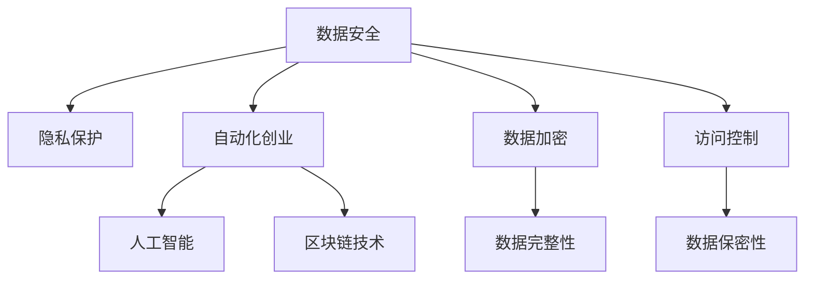

                 

# 自动化创业中的数据安全与隐私保护

> 关键词：数据安全,隐私保护,自动化,创业,人工智能

## 1. 背景介绍

### 1.1 问题由来
随着自动化技术和大数据在各行各业中的广泛应用，越来越多的创业项目需要依赖于大量的数据。这不仅带来了业务创新的可能，也使得数据安全与隐私保护问题变得愈发突出。如何在自动化创业中平衡数据的使用与保护，成为每个创业公司都必须面对的重要课题。

### 1.2 问题核心关键点
数据安全与隐私保护的核心在于如何在满足业务需求的同时，确保数据不被未授权访问、泄露或滥用。这不仅需要健全的法律框架和技术手段，还需要企业内部的合规管理与文化建设。

### 1.3 问题研究意义
数据安全与隐私保护对于自动化创业的重要性不言而喻。一个缺乏数据安全措施的创业项目，不仅可能面临法律诉讼和经济损失，还会损害企业的声誉和用户信任，进而影响长期发展。反之，通过严格的数据安全与隐私保护，可以提升客户信任度，构建品牌优势，为自动化创业项目奠定坚实基础。

## 2. 核心概念与联系

### 2.1 核心概念概述

为更好地理解数据安全与隐私保护在自动化创业中的应用，本节将介绍几个密切相关的核心概念：

- **数据安全**：指通过技术和管理手段，保护数据免受未授权访问、泄露、篡改和毁损，确保数据完整性和可用性。
- **隐私保护**：指在数据收集、存储、使用和共享过程中，保护个人或组织的隐私权益，防止隐私信息被滥用。
- **自动化创业**：指利用自动化技术，如人工智能、机器学习、自然语言处理等，创新业务模式，提升运营效率，降低成本，增加利润的创业活动。
- **人工智能(AI)**：通过算法和模型，使计算机具备类似人类智能的功能，包括但不限于语音识别、图像处理、自然语言处理等。
- **区块链技术**：一种分布式账本技术，通过加密和共识机制，确保数据的安全性和透明性。
- **数据加密**：对数据进行加密处理，即使数据被截获或泄露，未经授权也无法解读。
- **访问控制**：通过身份验证、权限管理等方式，控制对数据的访问权限，确保数据只被授权人员使用。

这些核心概念之间的逻辑关系可以通过以下Mermaid流程图来展示：



这个流程图展示了大语言模型的核心概念及其之间的关系：

1. 数据安全与隐私保护是大语言模型应用的前提条件。
2. 数据安全与隐私保护是大语言模型应用的必备技术。
3. 数据安全与隐私保护是大语言模型应用的重要保障。
4. 数据安全与隐私保护是大语言模型应用的重要组成部分。

这些概念共同构成了大语言模型的应用框架，使得大语言模型能够在满足数据安全与隐私保护要求的前提下，发挥其强大的数据分析和处理能力。通过理解这些核心概念，我们可以更好地把握大语言模型在自动化创业中的应用。

## 3. 核心算法原理 & 具体操作步骤
### 3.1 算法原理概述

在自动化创业中，数据安全与隐私保护的核心算法通常包括数据加密、访问控制、数据匿名化等。这些算法的基本思想是通过技术手段，确保数据在收集、存储、传输和使用的全生命周期中，不被未经授权的人员访问和滥用。

- **数据加密**：通过将原始数据转化为不可读的加密数据，确保数据在传输和存储过程中不被未授权访问。常用的加密算法包括对称加密、非对称加密、哈希函数等。
- **访问控制**：通过身份验证、权限管理等方式，控制对数据的访问权限，确保数据只被授权人员使用。常用的访问控制技术包括RBAC（基于角色的访问控制）、ABAC（基于属性的访问控制）等。
- **数据匿名化**：通过去除或伪装数据中的个人身份信息，减少数据泄露的风险。常用的数据匿名化技术包括泛化、聚合、去标识化等。

### 3.2 算法步骤详解

以数据加密为例，其具体操作步骤如下：

1. **密钥生成**：选择合适的加密算法和密钥长度，生成用于加密和解密的密钥。
2. **数据加密**：将原始数据使用密钥进行加密，生成密文。
3. **密文传输**：将密文通过网络传输到目标系统。
4. **数据解密**：接收方使用相应的密钥对密文进行解密，还原成原始数据。

以访问控制为例，其具体操作步骤如下：

1. **身份验证**：用户在访问系统时，需要通过身份验证，提供用户名、密码、令牌等信息。
2. **权限分配**：根据用户角色和职责，分配相应的访问权限，如读取、写入、修改等。
3. **权限检查**：系统在用户访问数据时，检查其是否具有相应的访问权限，决定是否允许访问。
4. **日志记录**：记录用户的访问日志，以便在发生安全事件时进行审计和追踪。

### 3.3 算法优缺点

数据安全与隐私保护的算法通常具有以下优点：

- **提高安全性**：通过加密和访问控制等手段，大大提高了数据在传输和存储过程中的安全性，减少了数据泄露和篡改的风险。
- **增强用户信任**：通过严格的数据保护措施，用户更愿意分享和信任自己的数据，为业务创新提供数据基础。
- **法律合规**：符合相关法律法规，避免因数据泄露而导致的法律风险和经济损失。

同时，这些算法也存在一些缺点：

- **技术复杂性高**：实施数据加密和访问控制等措施，需要较高的技术门槛和专业技能。
- **资源消耗大**：加密和解密等操作需要消耗大量的计算资源和时间，影响系统性能。
- **用户体验差**：过于复杂的访问控制措施，可能会降低用户的使用体验，增加系统操作的复杂性。
- **灵活性不足**：固定的加密和访问控制策略，可能无法应对不断变化的安全需求和业务场景。

### 3.4 算法应用领域

数据安全与隐私保护算法在自动化创业中有着广泛的应用，包括但不限于以下几个领域：

- **金融科技(Fintech)**：保护用户交易数据的安全，确保金融服务的稳定性和可靠性。
- **电子商务(E-commerce)**：保护用户购物数据的安全，避免数据泄露和欺诈。
- **健康医疗(Healthcare)**：保护患者健康数据的隐私，确保数据不被滥用和泄露。
- **智能制造(Intelligent Manufacturing)**：保护生产数据的安全，防止数据篡改和非法获取。
- **智能城市(Smart City)**：保护城市数据的安全，确保城市管理的透明性和安全性。

这些领域的大数据和人工智能应用，都需要严格的数据安全与隐私保护措施，以确保数据的完整性和安全性。

## 4. 数学模型和公式 & 详细讲解  
### 4.1 数学模型构建

本节将使用数学语言对数据安全与隐私保护的核心算法进行更加严格的刻画。

假设我们有一个数据集 $D$，包含 $n$ 条记录，每条记录包含 $m$ 个特征 $x_i=(x_{i1},x_{i2},...,x_{im})$，以及对应的标签 $y_i$。数据集 $D$ 需要满足数据安全和隐私保护的要求。

- **数据加密**：使用对称加密算法，将原始数据 $x_i$ 加密为密文 $E_k(x_i)$，其中 $k$ 为加密密钥。
- **访问控制**：通过身份验证和权限检查，控制用户对数据 $x_i$ 的访问权限。

### 4.2 公式推导过程

以对称加密算法为例，其核心公式为：

$$
E_k(x_i) = F_k(x_i) \oplus k
$$

其中 $F_k(x_i)$ 为加密算法，$\oplus$ 表示异或运算。解密算法为：

$$
D_k(E_k(x_i)) = F_k^{-1}(E_k(x_i)) \oplus k
$$

其中 $F_k^{-1}$ 为解密算法。

以访问控制为例，其核心逻辑为：

1. 用户 $u$ 请求访问数据 $x_i$，提供身份验证信息 $u$。
2. 系统验证用户 $u$ 的身份，分配相应的访问权限 $P_u$。
3. 当用户 $u$ 尝试访问数据 $x_i$ 时，检查是否满足权限 $P_u$，决定是否允许访问。

### 4.3 案例分析与讲解

假设一个电子商务平台需要对用户订单数据进行加密和访问控制。具体步骤如下：

1. **密钥生成**：系统生成一个256位的对称加密密钥 $k$。
2. **数据加密**：系统将用户订单数据 $x_i$ 使用密钥 $k$ 进行加密，生成密文 $E_k(x_i)$。
3. **数据传输**：将密文 $E_k(x_i)$ 传输到订单处理系统。
4. **数据解密**：订单处理系统使用密钥 $k$ 对密文 $E_k(x_i)$ 进行解密，还原成原始订单数据 $x_i$。
5. **访问控制**：订单处理系统对订单数据 $x_i$ 进行权限检查，仅允许授权人员访问和处理。

以上是一个简单的数据加密和访问控制案例，实际应用中还需要考虑更多的安全因素，如数据传输过程中的加密、密钥管理、安全审计等。

## 5. 项目实践：代码实例和详细解释说明
### 5.1 开发环境搭建

在进行数据安全与隐私保护的实践前，我们需要准备好开发环境。以下是使用Python进行数据加密和访问控制的开发环境配置流程：

1. 安装Anaconda：从官网下载并安装Anaconda，用于创建独立的Python环境。

2. 创建并激活虚拟环境：
```bash
conda create -n cryptography-env python=3.8 
conda activate cryptography-env
```

3. 安装必要的库：
```bash
pip install cryptography numpy pandas scikit-learn matplotlib tqdm jupyter notebook ipython
```

4. 安装加密库和访问控制库：
```bash
pip install cryptography PyJWT
```

完成上述步骤后，即可在`cryptography-env`环境中开始开发实践。

### 5.2 源代码详细实现

这里我们以对称加密和访问控制为例，给出使用Python进行数据加密和访问控制的代码实现。

首先，定义一个简单的订单数据：

```python
import numpy as np

data = np.random.randint(0, 100, size=(100, 5))
```

然后，定义一个简单的对称加密函数：

```python
from cryptography.fernet import Fernet

def encrypt_data(data, key):
    cipher_suite = Fernet(key)
    cipher_text = cipher_suite.encrypt(data)
    return cipher_text
```

接着，定义一个简单的访问控制函数：

```python
def access_control(data, user_id, permissions):
    if permissions[user_id] == 'read':
        print('User:', user_id, 'has read permission.')
    elif permissions[user_id] == 'write':
        print('User:', user_id, 'has write permission.')
    else:
        print('User:', user_id, 'does not have permission.')
```

最后，将加密和访问控制函数结合起来，完成整个流程：

```python
if __name__ == '__main__':
    # 生成密钥
    key = Fernet.generate_key()

    # 加密数据
    cipher_text = encrypt_data(data, key)

    # 传输数据
    # ...

    # 解密数据
    data_decrypted = Fernet(key).decrypt(cipher_text)

    # 访问控制
    permissions = {'user1': 'read', 'user2': 'write'}
    access_control(data_decrypted, 'user1', permissions)
    access_control(data_decrypted, 'user2', permissions)
```

以上就是使用Python进行数据加密和访问控制的基本代码实现。可以看到，通过简单的加密和权限检查，可以大大提高数据的安全性和隐私保护能力。

### 5.3 代码解读与分析

让我们再详细解读一下关键代码的实现细节：

**加密函数**：
- 使用Python的`cryptography`库中的`Fernet`类，生成对称加密密钥。
- 定义`encrypt_data`函数，使用密钥对数据进行加密，返回密文。

**访问控制函数**：
- 定义`access_control`函数，根据用户ID和权限，输出相应的提示信息。
- 在主函数中，生成密钥、加密数据、传输数据、解密数据、访问控制，实现数据安全与隐私保护的完整流程。

可以看到，通过Python实现的简单数据加密和访问控制，已经能够满足基本的安全需求。实际应用中，还需要更多的技术手段和安全策略，如密钥管理、多因素认证、分布式加密等，以应对复杂的安全场景。

## 6. 实际应用场景
### 6.1 金融科技(Fintech)

在金融科技领域，数据安全与隐私保护至关重要。金融数据涉及用户财务隐私，一旦泄露，将导致严重的经济损失和信用危机。

具体应用场景包括：

- **客户交易数据加密**：对客户的交易记录、消费信息等进行加密，确保数据在传输和存储过程中不被未授权访问。
- **身份验证与权限管理**：通过多因素认证、身份验证等手段，保护用户的交易权限，确保交易安全。
- **数据审计与监控**：记录交易日志，进行实时监控，及时发现并应对异常行为。

### 6.2 电子商务(E-commerce)

电子商务平台需要处理大量的用户购物数据，包括订单信息、支付记录等。这些数据的安全与隐私保护直接关系到用户的信任和平台的安全运营。

具体应用场景包括：

- **订单数据加密**：对用户的订单信息进行加密，确保数据在传输和存储过程中不被未授权访问。
- **用户访问控制**：对用户的订单数据进行权限控制，确保只有授权人员可以访问和处理订单信息。
- **数据审计与监控**：记录订单日志，进行实时监控，及时发现并应对异常行为。

### 6.3 健康医疗(Healthcare)

健康医疗领域涉及大量敏感的个人健康数据，如病历、诊断记录等。这些数据的安全与隐私保护至关重要，一旦泄露，将导致严重的隐私侵害和信任危机。

具体应用场景包括：

- **患者数据加密**：对患者的健康数据进行加密，确保数据在传输和存储过程中不被未授权访问。
- **访问控制与权限管理**：对患者的健康数据进行权限控制，确保只有授权人员可以访问和处理健康数据。
- **数据审计与监控**：记录患者访问日志，进行实时监控，及时发现并应对异常行为。

### 6.4 智能制造(Intelligent Manufacturing)

智能制造涉及大量的生产数据，如设备状态、生产过程、产品信息等。这些数据的安全与隐私保护直接关系到生产的安全和效率。

具体应用场景包括：

- **生产数据加密**：对生产数据进行加密，确保数据在传输和存储过程中不被未授权访问。
- **设备访问控制**：对生产设备进行权限控制，确保只有授权人员可以访问和操作生产设备。
- **数据审计与监控**：记录生产日志，进行实时监控，及时发现并应对异常行为。

### 6.5 智能城市(Smart City)

智能城市需要处理大量的城市数据，如交通流量、环境监测数据等。这些数据的安全与隐私保护直接关系到城市管理的稳定性和安全性。

具体应用场景包括：

- **城市数据加密**：对城市数据进行加密，确保数据在传输和存储过程中不被未授权访问。
- **访问控制与权限管理**：对城市数据进行权限控制，确保只有授权人员可以访问和处理城市数据。
- **数据审计与监控**：记录城市访问日志，进行实时监控，及时发现并应对异常行为。

## 7. 工具和资源推荐
### 7.1 学习资源推荐

为了帮助开发者系统掌握数据安全与隐私保护的理论基础和实践技巧，这里推荐一些优质的学习资源：

1. 《数据安全与隐私保护》系列博文：由数据安全与隐私保护专家撰写，深入浅出地介绍了数据安全与隐私保护的基本概念、核心技术和实践技巧。

2. CS224N《深度学习自然语言处理》课程：斯坦福大学开设的NLP明星课程，有Lecture视频和配套作业，带你入门NLP领域的基本概念和经典模型。

3. 《数据加密技术》书籍：详细介绍了对称加密、非对称加密、哈希函数等核心加密技术，适合深入学习数据加密原理和实现。

4. 《访问控制与权限管理》书籍：介绍了访问控制的多种技术和实现方法，如RBAC、ABAC、LDAP等，适合系统化学习访问控制理论。

5. 《隐私保护与数据匿名化》课程：介绍了隐私保护的基本概念、常用技术和实现方法，如泛化、聚合、去标识化等，适合系统化学习隐私保护理论。

通过对这些资源的学习实践，相信你一定能够快速掌握数据安全与隐私保护的关键技术，并用于解决实际的数据安全问题。

### 7.2 开发工具推荐

高效的开发离不开优秀的工具支持。以下是几款用于数据安全与隐私保护开发的常用工具：

1. Python：作为数据安全与隐私保护开发的主流语言，Python提供了丰富的库和框架，支持高效的数据处理和分析。

2. Anaconda：用于创建和管理Python环境，支持多种库和工具的灵活安装和配置。

3. PyJWT：用于生成和管理JSON Web Tokens（JWT），支持安全的身份验证和权限管理。

4. NumPy：用于高效处理多维数组和矩阵，支持数据的加密和解密等操作。

5. Scikit-learn：用于机器学习模型的训练和评估，支持数据的特征提取和分类等操作。

6. Matplotlib：用于数据可视化，支持绘制各种类型的图表，便于数据分析和可视化。

7. TensorBoard：用于监控和可视化模型训练过程，支持实时展示模型指标和图表。

8. Weights & Biases：用于实验跟踪和模型评估，支持记录和比较不同模型的性能和指标。

合理利用这些工具，可以显著提升数据安全与隐私保护任务的开发效率，加快创新迭代的步伐。

### 7.3 相关论文推荐

数据安全与隐私保护的发展源于学界的持续研究。以下是几篇奠基性的相关论文，推荐阅读：

1. "Public-Key Cryptography Standards (PKCS) No. 1: RSA Encryption"：RSA加密算法的基础文档，介绍了RSA加密和解密的具体实现。

2. "A Secure Hash Algorithm (SHA) for Digital Signatures"：SHA加密算法的基础文档，介绍了SHA-256等哈希函数的具体实现。

3. "Access Control Frameworks"：介绍了访问控制的多种技术和实现方法，如RBAC、ABAC、LDAP等，适合系统化学习访问控制理论。

4. "Data Anonymization Techniques"：介绍了数据匿名化的多种技术和实现方法，如泛化、聚合、去标识化等，适合系统化学习隐私保护理论。

5. "Privacy-Preserving Technologies in Healthcare"：介绍了健康医疗领域的数据隐私保护技术，如差分隐私、多方安全计算等，适合深入学习隐私保护在特定领域的应用。

这些论文代表了大数据安全与隐私保护技术的发展脉络。通过学习这些前沿成果，可以帮助研究者把握学科前进方向，激发更多的创新灵感。

## 8. 总结：未来发展趋势与挑战

### 8.1 总结

本文对数据安全与隐私保护在自动化创业中的应用进行了全面系统的介绍。首先阐述了数据安全与隐私保护的研究背景和意义，明确了数据安全与隐私保护在自动化创业中的重要价值。其次，从原理到实践，详细讲解了数据加密、访问控制等核心算法的原理和具体操作步骤，给出了数据安全与隐私保护的完整代码实例。同时，本文还广泛探讨了数据安全与隐私保护在金融科技、电子商务、健康医疗等多个行业领域的应用前景，展示了数据安全与隐私保护技术的巨大潜力。最后，本文精选了数据安全与隐私保护的学习资源，力求为读者提供全方位的技术指引。

通过本文的系统梳理，可以看到，数据安全与隐私保护在大数据和自动化创业中的应用前景广阔，其核心算法和实践技术为数据驱动的业务创新提供了重要保障。数据安全与隐私保护不仅保护了数据本身，更保障了数据驱动的业务模式的长期稳定性和用户信任度，为自动化创业项目的成功奠定了坚实基础。

### 8.2 未来发展趋势

展望未来，数据安全与隐私保护技术将呈现以下几个发展趋势：

1. **自动化安全技术**：随着人工智能和大数据分析技术的进步，自动化的数据安全与隐私保护技术将成为趋势。通过机器学习算法，实时监控和检测安全威胁，快速响应安全事件。

2. **多因素认证与身份验证**：传统的单一密码认证方式已不安全，多因素认证将成为主流。通过生物识别、短信验证、智能卡等手段，提高用户身份验证的安全性。

3. **区块链技术应用**：区块链技术通过分布式账本和共识机制，提供透明、可信的数据存储和交换环境，有望成为未来数据安全与隐私保护的重要技术。

4. **数据共享与合作**：在满足数据隐私保护的前提下，数据共享和合作将成为行业发展的趋势。通过多方安全计算、差分隐私等技术，实现数据的有效利用和共享。

5. **隐私保护新技术**：差分隐私、联邦学习等新兴技术将成为隐私保护的新手段。这些技术在保护数据隐私的同时，还能实现数据的有效利用和共享。

6. **数据治理与合规**：随着数据安全与隐私保护技术的不断发展，数据治理和合规管理将成为重要课题。通过数据治理框架，确保数据的安全、透明和合规使用。

以上趋势凸显了数据安全与隐私保护技术的广阔前景。这些方向的探索发展，必将进一步提升数据驱动的业务创新能力，为自动化创业项目提供更加坚实的保障。

### 8.3 面临的挑战

尽管数据安全与隐私保护技术已经取得了显著进展，但在迈向更加智能化、普适化应用的过程中，仍面临诸多挑战：

1. **技术复杂性高**：数据安全与隐私保护技术涉及复杂的数学和算法原理，需要较高的技术门槛和专业技能。

2. **资源消耗大**：加密和解密等操作需要消耗大量的计算资源和时间，影响系统性能。

3. **用户体验差**：过于复杂的身份验证和权限管理措施，可能会降低用户的使用体验，增加系统操作的复杂性。

4. **法律法规不完善**：数据安全与隐私保护法律法规尚不完善，缺乏统一的法律框架和技术标准。

5. **安全漏洞多**：数据安全与隐私保护技术面临多种安全漏洞和攻击手段，如SQL注入、跨站脚本等。

6. **数据治理难度大**：数据治理和合规管理涉及多部门、多系统的协同合作，难度较大。

正视数据安全与隐私保护面临的这些挑战，积极应对并寻求突破，将是大数据安全与隐私保护技术走向成熟的必由之路。相信随着学界和产业界的共同努力，这些挑战终将一一被克服，数据安全与隐私保护技术必将在构建安全、可靠、可控的智能系统中扮演越来越重要的角色。

### 8.4 研究展望

面对数据安全与隐私保护所面临的种种挑战，未来的研究需要在以下几个方面寻求新的突破：

1. **自动化安全技术**：研究如何利用机器学习、人工智能等技术，实现自动化的数据安全与隐私保护，提高安全响应的速度和效率。

2. **多因素认证与身份验证**：研究新的身份验证技术，如生物识别、智能卡等，提高身份验证的安全性和用户体验。

3. **区块链技术应用**：研究如何将区块链技术应用于数据存储和交换，提高数据的安全性和透明度。

4. **隐私保护新技术**：研究差分隐私、联邦学习等新兴隐私保护技术，在保护数据隐私的同时，实现数据的有效利用和共享。

5. **数据治理与合规**：研究数据治理和合规管理框架，确保数据的安全、透明和合规使用。

这些研究方向的探索，必将引领数据安全与隐私保护技术迈向更高的台阶，为数据驱动的业务创新提供更加坚实的保障。面向未来，数据安全与隐私保护技术还需要与其他人工智能技术进行更深入的融合，如知识表示、因果推理、强化学习等，多路径协同发力，共同推动智能系统的进步。只有勇于创新、敢于突破，才能不断拓展数据驱动的业务边界，让智能技术更好地造福人类社会。

## 9. 附录：常见问题与解答

**Q1：数据安全与隐私保护是否适用于所有自动化创业项目？**

A: 数据安全与隐私保护适用于大多数自动化创业项目，尤其是那些涉及大量用户数据和敏感信息的业务。但对于一些特定的业务场景，如实时数据处理、低带宽环境等，可能需要考虑其他替代方案。

**Q2：数据加密和访问控制有哪些常见技术？**

A: 数据加密和访问控制常见的技术包括：

- **对称加密**：如AES、DES等。使用同一个密钥进行加密和解密。
- **非对称加密**：如RSA、ECC等。使用公钥加密，私钥解密。
- **哈希函数**：如SHA-256、MD5等。将数据不可逆地映射成固定长度的哈希值。
- **访问控制**：如RBAC、ABAC等。基于角色和属性进行权限控制。
- **数据匿名化**：如泛化、聚合、去标识化等。去除或伪装数据中的个人身份信息。

**Q3：如何选择合适的加密算法？**

A: 选择合适的加密算法需要考虑以下几个因素：

- **安全性**：选择安全性高的算法，如AES-256、RSA-2048等。
- **性能**：选择性能好的算法，如AES-128、CHACHA20等。
- **可用性**：选择已广泛应用的算法，如AES、RSA等。
- **合规性**：选择符合法律法规的算法，如GDPR规定的算法。

**Q4：如何进行数据访问控制？**

A: 数据访问控制主要包括以下几个步骤：

1. **身份验证**：用户登录时，系统验证其身份信息。
2. **权限分配**：根据用户角色和职责，分配相应的访问权限，如读取、写入、修改等。
3. **权限检查**：用户访问数据时，系统检查其是否具有相应的访问权限，决定是否允许访问。
4. **日志记录**：记录用户的访问日志，以便在发生安全事件时进行审计和追踪。

**Q5：数据安全与隐私保护有哪些重要的法律和标准？**

A: 数据安全与隐私保护涉及的法律和标准包括：

- **《中华人民共和国网络安全法》**：对网络安全的总体要求和基本原则。
- **《通用数据保护条例》(GDPR)**：欧洲联盟制定的数据保护法规，要求企业和机构保护个人数据的隐私。
- **《中华人民共和国个人信息保护法》**：中国制定的一部针对个人信息保护的法律，规范了个人信息的收集、存储、使用和共享。
- **《信息安全技术 个人信息安全规范》**：国家标准化委员会制定的个人信息安全技术规范，指导企业和机构保护个人信息。

这些法律和标准为数据安全与隐私保护提供了法律和规范基础，是企业合规的必备依据。

**Q6：数据安全与隐私保护有哪些重要的技术挑战？**

A: 数据安全与隐私保护面临的技术挑战包括：

- **技术复杂性高**：数据安全与隐私保护涉及复杂的数学和算法原理，需要较高的技术门槛和专业技能。
- **资源消耗大**：加密和解密等操作需要消耗大量的计算资源和时间，影响系统性能。
- **用户体验差**：过于复杂的身份验证和权限管理措施，可能会降低用户的使用体验，增加系统操作的复杂性。
- **法律法规不完善**：数据安全与隐私保护法律法规尚不完善，缺乏统一的法律框架和技术标准。
- **安全漏洞多**：数据安全与隐私保护技术面临多种安全漏洞和攻击手段，如SQL注入、跨站脚本等。
- **数据治理难度大**：数据治理和合规管理涉及多部门、多系统的协同合作，难度较大。

正视这些挑战，积极应对并寻求突破，将是大数据安全与隐私保护技术走向成熟的必由之路。

---

作者：禅与计算机程序设计艺术 / Zen and the Art of Computer Programming

