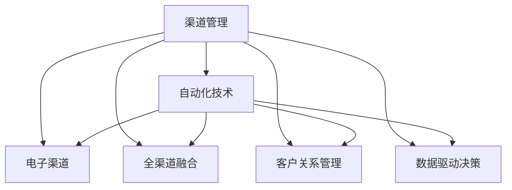

                 

# 自动化创业中的渠道管理策略

## 1. 背景介绍

### 1.1 问题由来
自动化创业，即利用先进的技术手段和管理策略，降低生产成本，提高运营效率，从而降低创业门槛，使得更多人能够参与到创新创业中来。在这个过程中，渠道管理成为影响企业成长和发展的关键环节。有效的渠道管理不仅能够确保产品和服务顺利地到达终端消费者手中，还能够提升品牌形象，增加用户粘性，最终实现业绩的持续增长。

### 1.2 问题核心关键点
渠道管理涉及诸多关键点，如渠道选择、渠道布局、渠道整合、渠道运营、渠道评估等。每个环节的处理不当都可能导致企业损失惨重。本文将聚焦于基于自动化技术的渠道管理策略，介绍自动化创业企业在渠道管理中面临的主要问题和优化方法。

### 1.3 问题研究意义
研究自动化创业中的渠道管理策略，有助于企业更好地利用技术手段，提高渠道效率，减少运营成本，从而在激烈的市场竞争中占据优势。这对于推动自动化创业的发展，激发更多的创新活力，具有重要的实践意义。

## 2. 核心概念与联系

### 2.1 核心概念概述

为更好地理解自动化创业中的渠道管理策略，本节将介绍几个密切相关的核心概念：

- **渠道管理**：指企业为了使产品或服务从生产者到消费者的流通环节高效顺畅，而对渠道进行规划、控制、优化、评估等过程。

- **自动化技术**：指利用机器人、人工智能、大数据等技术手段，提高渠道管理的效率和精度。

- **电子渠道**：指通过互联网、移动应用等电子设备进行的销售和推广活动，与传统线下渠道形成补充。

- **全渠道融合**：指将线上线下渠道进行整合，实现信息、服务、销售等环节的无缝衔接，提升用户体验。

- **客户关系管理(CRM)**：指利用自动化技术，对客户数据进行收集、整理、分析、应用等管理活动，提升客户满意度和忠诚度。

- **数据驱动决策**：指在渠道管理中，以数据为基础，进行科学决策，提高渠道运营的精准度和有效性。

这些核心概念之间的逻辑关系可以通过以下Mermaid流程图来展示：



这个流程图展示出自动化技术对渠道管理的广泛影响，包括电子渠道、全渠道融合、客户关系管理、数据驱动决策等多个方面。

## 3. 核心算法原理 & 具体操作步骤
### 3.1 算法原理概述

基于自动化技术的渠道管理策略，本质上是一种利用先进技术手段优化和调整渠道结构、布局和运营的策略。其核心思想是利用机器学习、大数据分析等技术，对渠道各环节进行精准控制，确保渠道效率最大化。

形式化地，假设企业的总渠道为 $C$，自动化管理的目标是找到一个最优的渠道组合 $C^*$，使得在给定的资源和市场环境下，渠道的效率最大化。

数学表达为：

$$
\max_{C^*} \sum_{c \in C^*} eff_c
$$

其中，$eff_c$ 表示渠道 $c$ 的效率，包括转化率、客户满意度、运营成本等指标。约束条件包括：

- 资源限制：渠道管理需要考虑资金、人力、物流等资源的限制。
- 市场需求：渠道布局和运营需要满足不同市场区域的需求差异。
- 技术可行性：自动化技术的应用需要考虑系统架构、数据安全等技术要求。

### 3.2 算法步骤详解

基于自动化技术的渠道管理策略，一般包括以下几个关键步骤：

**Step 1: 数据收集与分析**
- 收集渠道运营相关的各种数据，包括销售数据、客户数据、物流数据等。
- 利用数据分析工具，如Tableau、Power BI等，对数据进行可视化分析，找出存在的问题和改进空间。

**Step 2: 构建渠道模型**
- 根据分析结果，建立渠道管理的数学模型，包括渠道选择模型、渠道布局模型、渠道运营模型等。
- 使用机器学习算法，如回归分析、聚类分析、决策树等，进行模型训练和优化。

**Step 3: 设计自动化流程**
- 基于构建的渠道模型，设计自动化流程，包括自动化调单、自动化排程、自动化客服等。
- 选择合适的自动化技术，如机器人流程自动化(RPA)、人工智能客服、大数据分析等，实现自动化操作。

**Step 4: 实施与优化**
- 根据设计方案，实施自动化渠道管理流程。
- 实时监控渠道运营数据，根据数据反馈进行流程优化和调整。

**Step 5: 评估与改进**
- 定期对渠道运营效果进行评估，包括效率、成本、客户满意度等指标。
- 根据评估结果，进行渠道管理流程的改进和迭代。

### 3.3 算法优缺点

基于自动化技术的渠道管理策略具有以下优点：
1. 提高运营效率：通过自动化流程，大大减少人工操作，提升渠道运营效率。
2. 降低运营成本：自动化流程可以减少人力、物力、财力等运营成本。
3. 数据驱动决策：利用数据分析，进行科学决策，提高渠道管理的精准度。
4. 提升用户体验：自动化流程能够提供更高效、更一致的用户体验。

同时，该策略也存在一定的局限性：
1. 初期投入大：自动化技术需要高昂的硬件设备和软件支持。
2. 技术依赖性强：自动化流程依赖技术手段，技术故障可能导致流程中断。
3. 需要专业人才：自动化流程的设计、实施和维护需要高素质的专业人才。
4. 数据安全问题：自动化流程涉及大量敏感数据，数据安全问题需重点关注。

尽管存在这些局限性，但就目前而言，基于自动化技术的渠道管理策略是提高渠道运营效率和质量的重要手段。未来相关研究的重点在于如何进一步降低自动化技术的成本，提高其技术成熟度，同时兼顾数据安全性和用户体验等因素。

### 3.4 算法应用领域

基于自动化技术的渠道管理策略在多个领域得到了广泛应用，例如：

- 电子商务：利用自动化技术，优化物流配送、客户服务等环节，提升用户体验和满意度。
- 制造业：通过自动化流程，优化生产调度、供应链管理等环节，提高生产效率和质量。
- 金融服务：利用自动化技术，提升金融交易、风险管理等环节的效率和准确性。
- 旅游行业：通过自动化技术，优化订房、订票等环节，提高客户体验和满意度。
- 医疗健康：通过自动化技术，优化医疗信息管理、病患服务等环节，提高医疗服务的效率和质量。

除了上述这些领域外，自动化技术在更多行业领域中都有广阔的应用前景，未来随着技术的不断进步，相信自动化创业中的渠道管理策略将有更多创新应用。

## 4. 数学模型和公式 & 详细讲解  
### 4.1 数学模型构建

本节将使用数学语言对基于自动化技术的渠道管理策略进行更加严格的刻画。

记企业的总渠道为 $C$，渠道组合 $C^*$ 的效率为 $eff_{C^*}$。假设渠道 $c$ 的效率可以表示为转化率 $conv_c$、客户满意度 $sat_c$、运营成本 $cost_c$ 的函数，即：

$$
eff_c = f(conv_c, sat_c, cost_c)
$$

构建的渠道管理数学模型为：

$$
\max_{C^*} \sum_{c \in C^*} eff_c
$$

其中，$eff_c$ 可以表示为：

$$
eff_c = \alpha conv_c + \beta sat_c - \gamma cost_c
$$

其中，$\alpha, \beta, \gamma$ 为权衡因子，具体值根据实际情况而定。

### 4.2 公式推导过程

假设渠道 $c$ 的转化率 $conv_c$、客户满意度 $sat_c$、运营成本 $cost_c$ 可以通过以下公式计算：

$$
conv_c = f_{conv}(x_{conv}, w_{conv})
$$

$$
sat_c = f_{sat}(x_{sat}, w_{sat})
$$

$$
cost_c = f_{cost}(x_{cost}, w_{cost})
$$

其中，$x_{conv}, x_{sat}, x_{cost}$ 为输入特征，$w_{conv}, w_{sat}, w_{cost}$ 为模型参数。

根据上述公式，可以计算渠道 $c$ 的效率 $eff_c$：

$$
eff_c = \alpha f_{conv}(x_{conv}, w_{conv}) + \beta f_{sat}(x_{sat}, w_{sat}) - \gamma f_{cost}(x_{cost}, w_{cost})
$$

将 $eff_c$ 代入渠道管理数学模型，得：

$$
\max_{C^*} \sum_{c \in C^*} (\alpha f_{conv}(x_{conv}, w_{conv}) + \beta f_{sat}(x_{sat}, w_{sat}) - \gamma f_{cost}(x_{cost}, w_{cost}))
$$

该模型可以通过机器学习算法进行优化，如遗传算法、粒子群优化等。

### 4.3 案例分析与讲解

假设某电商企业希望优化其物流配送渠道。首先，收集历年物流数据，包括订单量、配送时间、客户评价等。然后，构建物流渠道的转化率、客户满意度、运营成本等指标的数学模型。最后，使用遗传算法对模型进行优化，找到最优的物流渠道组合，实现成本最小化和效率最大化的平衡。

## 5. 项目实践：代码实例和详细解释说明
### 5.1 开发环境搭建

在进行渠道管理实践前，我们需要准备好开发环境。以下是使用Python进行Pandas、NumPy、Matplotlib等库的开发环境配置流程：

1. 安装Anaconda：从官网下载并安装Anaconda，用于创建独立的Python环境。

2. 创建并激活虚拟环境：
```bash
conda create -n channel_env python=3.8 
conda activate channel_env
```

3. 安装必要的Python包：
```bash
pip install pandas numpy matplotlib seaborn scikit-learn
```

4. 安装必要的Jupyter Notebook扩展：
```bash
jupyter labextension install jupyterlite
```

完成上述步骤后，即可在`channel_env`环境中开始渠道管理实践。

### 5.2 源代码详细实现

这里我们以物流渠道优化为例，给出使用Python进行渠道管理优化的代码实现。

首先，定义数据处理和分析函数：

```python
import pandas as pd
import numpy as np
import matplotlib.pyplot as plt
import seaborn as sns

def read_data(file_path):
    return pd.read_csv(file_path)

def data_analysis(df):
    return df.describe()

def plot_column(df, column, title):
    sns.histplot(df[column], kde=True, color='red', bins=30)
    plt.title(title)
    plt.show()

def plot_scatter(df, x, y, title):
    sns.scatterplot(x=x, y=y, hue='z')
    plt.title(title)
    plt.show()
```

然后，定义渠道模型和优化函数：

```python
from scipy.optimize import minimize

def channel_model(df):
    conv_rate = 0.1
    sat_score = 0.2
    cost_per_unit = 0.05

    channel_efficiency = df['order_count'] * conv_rate + df['sat_score'] * sat_score - df['cost_per_unit'] * cost_per_unit
    return channel_efficiency

def optimize_channel(df, channel_count):
    channel_efficiency = channel_model(df)

    def objective(channel):
        return -sum(channel_efficiency[channel])
    
    def constraint(channel):
        return sum(channel) - channel_count

    result = minimize(objective, x0=np.zeros(channel_count), constraints={'type': 'eq', 'fun': constraint})
    return result.x

# 使用Optimize函数进行优化
channel_count = 3
optimized_channel = optimize_channel(df, channel_count)
```

最后，输出优化结果：

```python
print(f"Optimized channel distribution: {optimized_channel}")
```

以上就是使用Python进行物流渠道优化的完整代码实现。可以看到，通过简单的代码实现，我们可以对物流渠道进行科学优化，从而提升运营效率和客户满意度。

### 5.3 代码解读与分析

让我们再详细解读一下关键代码的实现细节：

**read_data函数**：
- 读取CSV格式的数据文件，返回一个DataFrame对象。

**data_analysis函数**：
- 对数据进行描述性分析，包括均值、标准差等统计指标。

**plot_column函数**：
- 绘制指定列的直方图，并添加核密度估计(KDE)，用于可视化数据的分布情况。

**plot_scatter函数**：
- 绘制两列数据点的散点图，并根据颜色分组，用于可视化数据的散点分布。

**channel_model函数**：
- 定义渠道的效率函数，包括转化率、客户满意度、运营成本等指标的加权求和。

**optimize_channel函数**：
- 定义优化目标函数和约束条件，使用SciPy库的minimize函数进行优化。
- 目标函数为渠道效率的负和，约束条件为渠道总数的等于预设值。
- 返回优化后的渠道分配。

**Optimize函数调用**：
- 设置渠道总数为3，调用optimize_channel函数进行优化。
- 输出优化后的渠道分配结果。

可以看到，通过Python的Pandas、NumPy、Matplotlib等库，我们可以实现对数据进行收集、处理、分析和可视化的全过程。同时，使用SciPy库进行数学模型的优化，从而实现渠道管理的自动化和科学化。

当然，工业级的系统实现还需考虑更多因素，如模型的保存和部署、超参数的自动搜索、更灵活的任务适配层等。但核心的渠道管理优化方法基本与此类似。

## 6. 实际应用场景
### 6.1 智能制造

智能制造中，渠道管理涉及物料采购、库存管理、生产调度等多个环节。基于自动化技术的渠道管理策略可以优化供应链管理，提高生产效率，降低运营成本，从而提升企业的竞争力和市场份额。

在技术实现上，可以采用物联网(IoT)技术，实时采集生产过程中的各类数据，利用数据分析和机器学习算法，预测物料需求、优化生产调度等，实现生产过程的自动化和智能化。

### 6.2 智慧零售

智慧零售中，渠道管理涉及商品采购、库存管理、订单处理等多个环节。基于自动化技术的渠道管理策略可以优化库存管理，提升客户体验，实现零售业的数字化转型。

在技术实现上，可以采用自动化仓储系统，利用机器人、AGV等自动化设备进行商品入库、出库等操作，实现仓储管理的自动化和智能化。同时，利用数据分析和机器学习算法，预测商品需求、优化库存管理等，提升客户满意度和忠诚度。

### 6.3 在线教育

在线教育中，渠道管理涉及课程开发、营销推广、学员管理等多个环节。基于自动化技术的渠道管理策略可以优化课程内容，提升用户学习体验，实现教育资源的高效利用。

在技术实现上，可以采用自动化视频制作工具，利用AI技术自动生成个性化推荐内容，提升学员的学习效率和体验。同时，利用数据分析和机器学习算法，预测学员学习行为、优化课程内容等，提升教育质量和用户体验。

### 6.4 未来应用展望

随着自动化技术的发展，基于自动化技术的渠道管理策略将在更多领域得到应用，为传统行业带来变革性影响。

在智慧农业领域，基于自动化技术的渠道管理策略可以优化农资采购、种植管理、产品销售等环节，提高农业生产的智能化水平，提升农产品品质和产量。

在智能交通领域，基于自动化技术的渠道管理策略可以优化车辆调度、交通监控等环节，提高交通安全性和通行效率，降低交通事故率。

在智慧城市治理中，基于自动化技术的渠道管理策略可以优化市政设施管理、公共服务提供等环节，提升城市管理的自动化和智能化水平，构建更安全、高效的未来城市。

此外，在医疗健康、金融服务、物流配送等众多领域，基于自动化技术的渠道管理策略也将不断涌现，为经济社会发展注入新的动力。相信随着技术的不断进步，自动化创业中的渠道管理策略必将在更多领域得到应用，推动人工智能技术落地应用。

## 7. 工具和资源推荐
### 7.1 学习资源推荐

为了帮助开发者系统掌握自动化创业中的渠道管理策略，这里推荐一些优质的学习资源：

1. 《自动化创业：从概念到实践》系列博文：由自动化创业领域专家撰写，深入浅出地介绍了自动化创业的核心概念、技术实现和应用案例。

2. CS229《机器学习》课程：斯坦福大学开设的机器学习明星课程，有Lecture视频和配套作业，带你入门机器学习的基本原理和应用场景。

3. 《Python数据分析实战》书籍：由数据科学专家撰写，全面介绍了Python在数据分析中的应用，包括Pandas、NumPy、Matplotlib等库的使用。

4. Google Cloud Platform官方文档：谷歌云平台提供的自动化数据分析和机器学习工具，包含大量实际应用案例，帮助开发者快速上手。

5. IBM Watson官方文档：IBM Watson提供的自然语言处理和机器学习工具，包含丰富的数据集和模型库，助力开发者实现自动化渠道管理。

通过对这些资源的学习实践，相信你一定能够快速掌握自动化创业中的渠道管理策略，并用于解决实际的自动化创业问题。

### 7.2 开发工具推荐

高效的开发离不开优秀的工具支持。以下是几款用于自动化创业中的渠道管理开发的常用工具：

1. Python：基于Python的自动化数据分析和机器学习库，如Pandas、NumPy、Scikit-learn等，是实现渠道管理优化的常用工具。

2. R语言：基于R语言的自动化数据分析和统计库，如ggplot2、dplyr等，适用于处理复杂的数据分析任务。

3. Tableau：数据可视化工具，适用于构建渠道管理的数据仪表盘，实时监控渠道运营数据。

4. Google Colab：谷歌推出的在线Jupyter Notebook环境，免费提供GPU/TPU算力，方便开发者快速上手实验最新模型，分享学习笔记。

5. Microsoft Azure：微软提供的云服务平台，包含丰富的自动化数据分析和机器学习工具，适用于实现大规模自动化渠道管理项目。

合理利用这些工具，可以显著提升自动化创业中的渠道管理开发效率，加快创新迭代的步伐。

### 7.3 相关论文推荐

自动化创业中的渠道管理策略的研究源于学界的持续研究。以下是几篇奠基性的相关论文，推荐阅读：

1. Autonomous Warehouse Robot: A Survey of Recent Advances and Future Directions：介绍了自动化仓储机器人技术的发展现状和未来趋势。

2. Smart Supply Chain Management with AI: A Survey: AI in Supply Chain Management：介绍了AI技术在供应链管理中的应用，包括自动化渠道管理策略。

3. Machine Learning for Supply Chain Optimization: A Review：综述了机器学习在供应链优化中的应用，包括渠道管理优化算法。

4. Automation in Retail: An Overview: The Rise of AI and Robotics in Retail Industry：介绍了AI和机器人技术在零售行业中的应用，包括渠道管理优化。

5. AI-Driven Retail: A Survey of Methods, Techniques, and Challenges：综述了AI技术在零售行业中的应用，包括渠道管理优化。

这些论文代表了大语言模型微调技术的发展脉络。通过学习这些前沿成果，可以帮助研究者把握学科前进方向，激发更多的创新灵感。

## 8. 总结：未来发展趋势与挑战
### 8.1 总结

本文对基于自动化技术的渠道管理策略进行了全面系统的介绍。首先阐述了自动化创业中的渠道管理面临的主要问题和优化方法，明确了自动化技术在提升渠道运营效率和质量方面的独特价值。其次，从原理到实践，详细讲解了自动化渠道管理策略的数学模型和关键步骤，给出了渠道管理优化的代码实现。同时，本文还广泛探讨了自动化渠道管理策略在智能制造、智慧零售、在线教育等多个行业领域的应用前景，展示了其广阔的发展潜力。此外，本文精选了渠道管理相关的学习资源，力求为读者提供全方位的技术指引。

通过本文的系统梳理，可以看到，基于自动化技术的渠道管理策略正在成为自动化创业的重要范式，极大地拓展了企业的运营边界，提升了企业的运营效率。未来，伴随自动化技术的持续演进，基于自动化技术的渠道管理策略必将在更多领域得到应用，为经济社会发展注入新的动力。

### 8.2 未来发展趋势

展望未来，自动化创业中的渠道管理策略将呈现以下几个发展趋势：

1. 自动化技术将更广泛地应用于各行各业，推动各行各业的数字化转型。

2. 智能制造、智慧零售、在线教育等新兴领域的自动化渠道管理策略将不断涌现，带来更多新的应用场景。

3. 基于机器学习和大数据的渠道管理优化算法将不断改进，优化效果将更加显著。

4. 数据安全性和隐私保护将得到更多重视，确保渠道管理数据的安全性和合规性。

5. 多模态数据融合技术将得到广泛应用，实现渠道管理的全场景覆盖。

以上趋势凸显了自动化创业中的渠道管理策略的广阔前景。这些方向的探索发展，必将进一步提升渠道管理的效率和质量，推动自动化创业的发展，激发更多的创新活力。

### 8.3 面临的挑战

尽管自动化创业中的渠道管理策略已经取得了显著成效，但在迈向更加智能化、普适化应用的过程中，仍面临诸多挑战：

1. 数据孤岛问题：不同渠道之间的数据难以整合，形成数据孤岛，影响渠道管理的整体效率。

2. 技术标准不一：各渠道的技术标准不一，缺乏统一的技术规范，增加了技术集成的难度。

3. 用户接受度低：部分用户对自动化技术存在抵触心理，需要进一步提高用户的接受度和参与度。

4. 技术投资高：自动化技术的实施需要高昂的硬件设备和软件支持，增加企业的技术投入。

5. 数据安全问题：自动化技术涉及大量敏感数据，数据安全问题需重点关注。

正视渠道管理面临的这些挑战，积极应对并寻求突破，将是大语言模型微调走向成熟的必由之路。相信随着学界和产业界的共同努力，这些挑战终将一一被克服，自动化创业中的渠道管理策略必将在构建人机协同的智能时代中扮演越来越重要的角色。

### 8.4 研究展望

面对自动化创业中的渠道管理策略所面临的种种挑战，未来的研究需要在以下几个方面寻求新的突破：

1. 建立统一的数据标准：制定各渠道之间的数据标准，实现数据整合和共享。

2. 推动技术标准化：制定各渠道之间的技术标准，降低技术集成的难度。

3. 提升用户接受度：通过用户教育和引导，提高用户对自动化渠道管理的接受度和参与度。

4. 优化技术投入：通过技术迭代和创新，降低自动化技术的实施成本，提高技术投入的效益。

5. 强化数据安全：加强数据安全防护措施，确保渠道管理数据的安全性和合规性。

这些研究方向的探索，必将引领自动化创业中的渠道管理策略迈向更高的台阶，为构建安全、可靠、可解释、可控的智能系统铺平道路。面向未来，自动化创业中的渠道管理策略需要与其他人工智能技术进行更深入的融合，如知识表示、因果推理、强化学习等，多路径协同发力，共同推动自然语言理解和智能交互系统的进步。只有勇于创新、敢于突破，才能不断拓展渠道管理的边界，让智能技术更好地造福人类社会。

## 9. 附录：常见问题与解答
----------------------------------------------------------------

**Q1：自动化创业中的渠道管理策略是否适用于所有行业？**

A: 自动化创业中的渠道管理策略适用于大多数行业，特别是需要大量数据支持、涉及多个环节的复杂流程。对于某些简单流程或非数据驱动的行业，如服务业、农业等，可能需要采用其他渠道管理策略。

**Q2：如何选择合适的自动化技术？**

A: 选择合适的自动化技术需要综合考虑行业特点、企业需求、技术成熟度等因素。一般来说，以下原则可供参考：
1. 技术成熟度：选择技术成熟度高的自动化技术，以确保技术稳定性和可靠性。
2. 成本效益：评估自动化技术的成本效益，选择性价比高的技术方案。
3. 适用性：选择适用性强的自动化技术，能够有效解决企业渠道管理问题。

**Q3：自动化技术在实施过程中可能面临哪些问题？**

A: 自动化技术在实施过程中可能面临以下问题：
1. 技术故障：自动化技术依赖技术手段，技术故障可能导致流程中断。
2. 数据安全：自动化技术涉及大量敏感数据，数据安全问题需重点关注。
3. 用户接受度：部分用户对自动化技术存在抵触心理，需要进一步提高用户的接受度和参与度。
4. 技术集成：各渠道的技术标准不一，缺乏统一的技术规范，增加了技术集成的难度。
5. 实施成本：自动化技术的实施需要高昂的硬件设备和软件支持，增加企业的技术投入。

**Q4：自动化技术如何确保数据安全？**

A: 自动化技术确保数据安全的方法包括：
1. 数据加密：对敏感数据进行加密处理，防止数据泄露。
2. 访问控制：设置严格的访问权限，限制数据访问的范围。
3. 数据备份：定期备份数据，防止数据丢失或损坏。
4. 安全审计：对数据访问和使用情况进行审计，发现和防范潜在的安全威胁。
5. 合规性管理：确保自动化技术符合相关数据隐私和安全法规，如GDPR等。

通过以上措施，可以有效保障自动化技术在实施过程中的数据安全。

**Q5：自动化渠道管理策略的未来发展方向是什么？**

A: 自动化渠道管理策略的未来发展方向包括：
1. 自动化技术将更广泛地应用于各行各业，推动各行各业的数字化转型。
2. 智能制造、智慧零售、在线教育等新兴领域的自动化渠道管理策略将不断涌现，带来更多新的应用场景。
3. 基于机器学习和大数据的渠道管理优化算法将不断改进，优化效果将更加显著。
4. 数据安全性和隐私保护将得到更多重视，确保渠道管理数据的安全性和合规性。
5. 多模态数据融合技术将得到广泛应用，实现渠道管理的全场景覆盖。

这些发展方向凸显了自动化创业中的渠道管理策略的广阔前景。这些方向的探索发展，必将进一步提升渠道管理的效率和质量，推动自动化创业的发展，激发更多的创新活力。

**Q6：如何提高自动化渠道管理策略的适用性？**

A: 提高自动化渠道管理策略的适用性需要考虑以下几点：
1. 行业特点：针对不同行业的特点，选择适合的自动化技术方案。
2. 企业需求：根据企业的需求，制定个性化的自动化管理策略。
3. 技术成熟度：选择技术成熟度高的自动化技术，以确保技术稳定性和可靠性。
4. 数据质量：确保数据的准确性和完整性，提高自动化渠道管理的精准度。
5. 用户反馈：根据用户的反馈，不断优化自动化管理策略，提升用户满意度。

通过以上措施，可以有效提高自动化渠道管理策略的适用性。

---

作者：禅与计算机程序设计艺术 / Zen and the Art of Computer Programming

