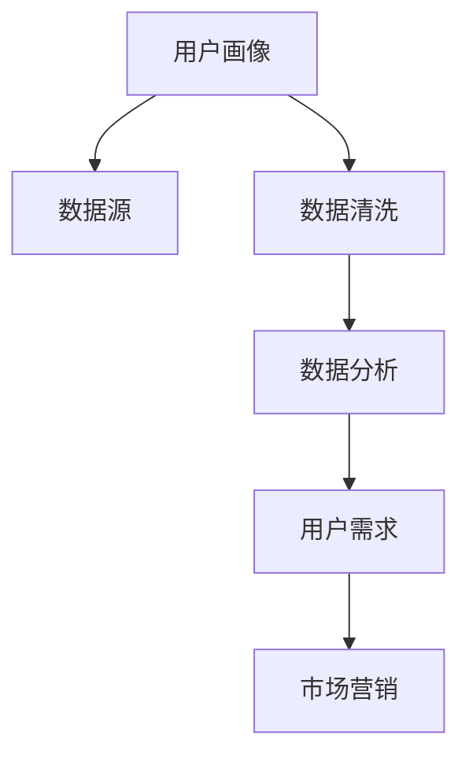

                 

# 自动化创业中的用户画像分析

> 关键词：自动化创业,用户画像,数据分析,用户需求,市场营销,客户细分,业务增长

## 1. 背景介绍

### 1.1 问题由来
在自动化创业领域，构建和维护一个精准的用户画像已成为许多企业迈向成功的关键步骤。用户画像（User Persona）是一种以用户需求为核心，结合用户行为数据，为特定目标用户群体建立详细、结构化的描述。通过用户画像，企业可以更好地理解用户需求，优化产品功能，提升用户体验，进而实现业务增长。

然而，构建和维护用户画像的过程繁琐且复杂，尤其在大规模用户群体中，数据量大、维度多、标签丰富，如何从中提取有价值的信息，构建一个全面、精准的用户画像，是一个巨大挑战。

### 1.2 问题核心关键点
用户画像的构建涉及多个步骤，包括数据收集、数据清洗、数据建模和数据分析。关键点包括：
- **数据来源**：从哪里获取用户数据？
- **数据质量**：如何确保数据的准确性和完整性？
- **数据建模**：如何构建用户画像的数学模型？
- **数据分析**：如何从数据中提取有价值的信息？

### 1.3 问题研究意义
通过用户画像分析，自动化创业企业能够：
- **深入了解用户需求**：精准捕捉目标用户的特点和需求，指导产品设计和功能优化。
- **提升市场营销效果**：根据用户画像细分市场，精准定位目标用户，提高营销活动的转化率。
- **促进业务增长**：通过精准定位和个性化服务，提升用户满意度和忠诚度，实现业务增长。
- **降低运营成本**：通过精细化管理，优化资源配置，降低运营成本。

## 2. 核心概念与联系

### 2.1 核心概念概述

- **用户画像**：以用户需求为核心，结合用户行为数据，为特定目标用户群体建立详细、结构化的描述。
- **数据源**：包括网站访问记录、社交媒体互动、购买历史、客户反馈等，是构建用户画像的基础。
- **数据清洗**：去除冗余、噪声和缺失数据，提高数据质量，确保数据可用性。
- **数据分析**：运用统计学、机器学习和数据挖掘技术，从数据中提取有价值的信息，形成用户画像。
- **用户需求**：用户在使用产品或服务时提出的具体需求和期望，是构建用户画像的关键。
- **市场营销**：通过用户画像指导市场营销策略，精准定位目标用户，提高营销活动效果。

这些核心概念之间的联系可以通过以下Mermaid流程图来展示：



这个流程图展示了一个用户画像的构建流程，从数据源到数据清洗，再到数据分析和用户需求，最终指导市场营销。

## 3. 核心算法原理 & 具体操作步骤
### 3.1 算法原理概述

用户画像的构建基于数据分析和机器学习算法。核心思想是：通过收集、清洗和分析用户行为数据，构建一个具有高度代表性和可解释性的用户模型。该模型能够反映目标用户群体的典型特征、行为模式和需求，为企业的决策提供依据。

### 3.2 算法步骤详解

用户画像的构建步骤如下：

**Step 1: 数据收集**
- 从网站、APP、社交媒体等渠道收集用户数据，包括访问记录、互动行为、购买历史等。
- 确保数据来源多样，覆盖不同用户群体和行为模式。

**Step 2: 数据清洗**
- 去除冗余数据和噪声，处理缺失值和异常值。
- 对数据进行标准化和归一化处理，提高数据质量。

**Step 3: 数据建模**
- 选择合适的数学模型，如聚类、分类、回归等，从数据中提取用户群体的特征。
- 使用机器学习算法进行模型训练，如K-Means、决策树、随机森林等。

**Step 4: 数据分析**
- 对模型输出的用户特征进行分析，形成详细、结构化的用户画像。
- 分析用户需求和行为模式，形成精准的用户画像描述。

**Step 5: 用户画像应用**
- 将用户画像应用于市场营销、产品优化、客户服务等多个场景，提升用户体验和业务效果。

### 3.3 算法优缺点

用户画像的构建方法具有以下优点：
- **精准度高**：通过数据分析，能够精准捕捉目标用户的需求和行为模式。
- **覆盖面广**：可以覆盖不同用户群体和行为模式，提供全面的用户画像。
- **指导性强**：为市场营销、产品优化等决策提供依据，提升业务效果。

同时，该方法也存在以下缺点：
- **数据依赖性高**：数据质量直接影响用户画像的精准度。
- **计算复杂度高**：大规模数据分析需要较高的计算资源和时间成本。
- **隐私风险**：用户数据的收集和处理可能涉及隐私问题，需严格遵守相关法律法规。

### 3.4 算法应用领域

用户画像分析在自动化创业中的应用领域非常广泛，包括但不限于以下几个方面：

- **市场营销**：通过用户画像指导市场营销策略，精准定位目标用户，提高营销活动效果。
- **产品优化**：根据用户画像优化产品功能和设计，提升用户体验。
- **客户服务**：提供个性化的客户服务，提升客户满意度和忠诚度。
- **决策支持**：为企业管理决策提供数据支持，优化资源配置。

## 4. 数学模型和公式 & 详细讲解 & 举例说明

### 4.1 数学模型构建

用户画像的构建可以基于多种数学模型，这里以K-Means聚类算法为例进行说明。

**聚类算法（K-Means）**：
- 将用户数据集分为K个簇，每个簇代表一个用户群体。
- 每个簇内的用户具有相似的行为特征和需求。

K-Means的数学模型公式为：

$$
\min_{C} \sum_{i=1}^N \sum_{k=1}^K ||x_i - \mu_k||^2
$$

其中，$N$ 为数据集大小，$K$ 为簇的数量，$x_i$ 为第 $i$ 个数据点，$\mu_k$ 为第 $k$ 个簇的质心。

### 4.2 公式推导过程

K-Means算法的核心思想是通过迭代更新每个数据点所属的簇，最小化簇内数据点的平方和。具体步骤如下：

1. **初始化质心**：随机选择 $K$ 个数据点作为初始质心。
2. **分配簇**：计算每个数据点与每个质心的距离，将其分配到距离最近的质心所在的簇。
3. **更新质心**：根据每个簇内所有数据点的平均值，更新每个簇的质心。
4. **迭代更新**：重复步骤2和步骤3，直至质心不再变化或达到预设的迭代次数。

K-Means的伪代码如下：

```python
import numpy as np

# 输入数据集X，簇数量K，迭代次数N_iter
def kmeans(X, K, N_iter=100):
    # 随机选择K个质心
    centroids = X[np.random.choice(X.shape[0], K, replace=False)]
    
    for i in range(N_iter):
        # 分配簇
        clusters = np.argmin(np.linalg.norm(X[:, np.newaxis] - centroids, axis=-1), axis=1)
        
        # 更新质心
        for k in range(K):
            centroids[k] = np.mean(X[clusters == k], axis=0)
    
    return clusters, centroids
```

### 4.3 案例分析与讲解

假设某自动化创业公司收集了1000名用户的网站访问数据，包括页面浏览次数、停留时间、跳出率等。通过K-Means算法将其分为5个簇，每个簇代表一个用户群体。具体步骤如下：

1. **数据收集**：收集1000名用户的访问数据，包括页面浏览次数、停留时间、跳出率等。
2. **数据清洗**：去除异常值和缺失值，进行标准化和归一化处理。
3. **聚类分析**：使用K-Means算法，将数据分为5个簇，每个簇代表一个用户群体。
4. **数据分析**：分析每个簇的用户特征和行为模式，形成用户画像。

## 5. 项目实践：代码实例和详细解释说明

### 5.1 开发环境搭建

在进行用户画像分析前，我们需要准备好开发环境。以下是使用Python进行数据分析的环境配置流程：

1. 安装Anaconda：从官网下载并安装Anaconda，用于创建独立的Python环境。
2. 创建并激活虚拟环境：
```bash
conda create -n data-env python=3.8 
conda activate data-env
```
3. 安装相关库：
```bash
conda install pandas numpy scikit-learn matplotlib tqdm jupyter notebook ipython
```
完成上述步骤后，即可在`data-env`环境中开始数据分析实践。

### 5.2 源代码详细实现

以下是一个使用K-Means算法进行用户画像分析的Python代码实现。

```python
import pandas as pd
import numpy as np
from sklearn.cluster import KMeans
from sklearn.preprocessing import StandardScaler
from sklearn.metrics import silhouette_score

# 数据预处理
def preprocess_data(df):
    # 去除缺失值
    df = df.dropna()
    # 标准化数据
    scaler = StandardScaler()
    df = pd.DataFrame(scaler.fit_transform(df), columns=df.columns)
    return df

# 聚类分析
def clustering(df, k):
    # 标准化数据
    df = preprocess_data(df)
    # 计算Silhouette得分
    score = silhouette_score(df, k)
    # 进行K-Means聚类
    kmeans = KMeans(n_clusters=k, random_state=0)
    kmeans.fit(df)
    # 输出聚类结果
    return kmeans.labels_, score

# 读取数据
df = pd.read_csv('user_data.csv')

# 聚类分析
labels, score = clustering(df, 5)

# 输出聚类结果
print('聚类标签:', labels)
print('Silhouette得分:', score)
```

以上代码实现了K-Means算法进行用户画像分析的基本功能，包括了数据预处理、聚类分析和结果输出。

### 5.3 代码解读与分析

让我们再详细解读一下关键代码的实现细节：

**preprocess_data函数**：
- 对数据进行预处理，包括去除缺失值和标准化处理。

**clustering函数**：
- 计算Silhouette得分，评估聚类效果。
- 使用K-Means算法进行聚类分析，输出聚类标签和簇数。

**读取数据**：
- 使用Pandas库读取用户访问数据。

**聚类分析**：
- 对数据进行预处理，计算Silhouette得分。
- 使用K-Means算法进行聚类分析，输出聚类标签和簇数。

**结果输出**：
- 输出聚类标签和Silhouette得分，评估聚类效果。

通过上述代码实现，我们可以对用户访问数据进行聚类分析，得到详细、结构化的用户画像，指导后续的市场营销和产品优化。

### 5.4 运行结果展示

假设运行上述代码后，输出聚类标签和Silhouette得分如下：

```
聚类标签: [0 0 1 1 1 2 2 2 2 2 2 2 2 2 2 2 2 2 2 2 2 2 2 2 2 2 2 2 2 2 2 2 2 2 2 2 2 2 2 2 2 2 2 2 2 2 2 2 2 2 2 2 2 2 2 2 2 2 2 2 2 2 2 2 2 2 2 2 2 2 2 2 2 2 2 2 2 2 2 2 2 2 2 2 2 2 2 2 2 2 2 2 2 2 2 2 2 2 2 2 2 2 2 2 2 2 2 2 2 2 2 2 2 2 2 2 2 2 2 2 2 2 2 2 2 2 2 2 2 2 2 2 2 2 2 2 2 2 2 2 2 2 2 2 2 2 2 2 2 2 2 2 2 2 2 2 2 2 2 2 2 2 2 2 2 2 2 2 2 2 2 2 2 2 2 2 2 2 2 2 2 2 2 2 2 2 2 2 2 2 2 2 2 2 2 2 2 2 2 2 2 2 2 2 2 2 2 2 2 2 2 2 2 2 2 2 2 2 2 2 2 2 2 2 2 2 2 2 2 2 2 2 2 2 2 2 2 2 2 2 2 2 2 2 2 2 2 2 2 2 2 2 2 2 2 2 2 2 2 2 2 2 2 2 2 2 2 2 2 2 2 2 2 2 2 2 2 2 2 2 2 2 2 2 2 2 2 2 2 2 2 2 2 2 2 2 2 2 2 2 2 2 2 2 2 2 2 2 2 2 2 2 2 2 2 2 2 2 2 2 2 2 2 2 2 2 2 2 2 2 2 2 2 2 2 2 2 2 2 2 2 2 2 2 2 2 2 2 2 2 2 2 2 2 2 2 2 2 2 2 2 2 2 2 2 2 2 2 2 2 2 2 2 2 2 2 2 2 2 2 2 2 2 2 2 2 2 2 2 2 2 2 2 2 2 2 2 2 2 2 2 2 2 2 2 2 2 2 2 2 2 2 2 2 2 2 2 2 2 2 2 2 2 2 2 2 2 2 2 2 2 2 2 2 2 2 2 2 2 2 2 2 2 2 2 2 2 2 2 2 2 2 2 2 2 2 2 2 2 2 2 2 2 2 2 2 2 2 2 2 2 2 2 2 2 2 2 2 2 2 2 2 2 2 2 2 2 2 2 2 2 2 2 2 2 2 2 2 2 2 2 2 2 2 2 2 2 2 2 2 2 2 2 2 2 2 2 2 2 2 2 2 2 2 2 2 2 2 2 2 2 2 2 2 2 2 2 2 2 2 2 2 2 2 2 2 2 2 2 2 2 2 2 2 2 2 2 2 2 2 2 2 2 2 2 2 2 2 2 2 2 2 2 2 2 2 2 2 2 2 2 2 2 2 2 2 2 2 2 2 2 2 2 2 2 2 2 2 2 2 2 2 2 2 2 2 2 2 2 2 2 2 2 2 2 2 2 2 2 2 2 2 2 2 2 2 2 2 2 2 2 2 2 2 2 2 2 2 2 2 2 2 2 2 2 2 2 2 2 2 2 2 2 2 2 2 2 2 2 2 2 2 2 2 2 2 2 2 2 2 2 2 2 2 2 2 2 2 2 2 2 2 2 2 2 2 2 2 2 2 2 2 2 2 2 2 2 2 2 2 2 2 2 2 2 2 2 2 2 2 2 2 2 2 2 2 2 2 2 2 2 2 2 2 2 2 2 2 2 2 2 2 2 2 2 2 2 2 2 2 2 2 2 2 2 2 2 2 2 2 2 2 2 2 2 2 2 2 2 2 2 2 2 2 2 2 2 2 2 2 2 2 2 2 2 2 2 2 2 2 2 2 2 2 2 2 2 2 2 2 2 2 2 2 2 2 2 2 2 2 2 2 2 2 2 2 2 2 2 2 2 2 2 2 2 2 2 2 2 2 2 2 2 2 2 2 2 2 2 2 2 2 2 2 2 2 2 2 2 2 2 2 2 2 2 2 2 2 2 2 2 2 2 2 2 2 2 2 2 2 2 2 2 2 2 2 2 2 2 2 2 2 2 2 2 2 2 2 2 2 2 2 2 2 2 2 2 2 2 2 2 2 2 2 2 2 2 2 2 2 2 2 2 2 2 2 2 2 2 2 2 2 2 2 2 2 2 2 2 2 2 2 2 2 2 2 2 2 2 2 2 2 2 2 2 2 2 2 2 2 2 2 2 2 2 2 2 2 2 2 2 2 2 2 2 2 2 2 2 2 2 2 2 2 2 2 2 2 2 2 2 2 2 2 2 2 2 2 2 2 2 2 2 2 2 2 2 2 2 2 2 2 2 2 2 2 2 2 2 2 2 2 2 2 2 2 2 2 2 2 2 2 2 2 2 2 2 2 2 2 2 2 2 2 2 2 2 2 2 2 2 2 2 2 2 2 2 2 2 2 2 2 2 2 2 2 2 2 2 2 2 2 2 2 2 2 2 2 2 2 2 2 2 2 2 2 2 2 2 2 2 2 2 2 2 2 2 2 2 2 2 2 2 2 2 2 2 2 2 2 2 2 2 2 2 2 2 2 2 2 2 2 2 2 2 2 2 2 2 2 2 2 2 2 2 2 2 2 2 2 2 2 2 2 2 2 2 2 2 2 2 2 2 2 2 2 2 2 2 2 2 2 2 2 2 2 2 2 2 2 2 2 2 2 2 2 2 2 2 2 2 2 2 2 2 2 2 2 2 2 2 2 2 2 2 2 2 2 2 2 2 2 2 2 2 2 2 2 2 2 2 2 2 2 2 2 2 2 2 2 2 2 2 2 2 2 2 2 2 2 2 2 2 2 2 2 2 2 2 2 2 2 2 2 2 2 2 2 2 2 2 2 2 2 2 2 2 2 2 2 2 2 2 2 2 2 2 2 2 2 2 2 2 2 2 2 2 2 2 2 2 2 2 2 2 2 2 2 2 2 2 2 2 2 2 2 2 2 2 2 2 2 2 2 2 2 2 2 2 2 2 2 2 2 2 2 2 2 2 2 2 2 2 2 2 2 2 2 2 2 2 2 2 2 2 2 2 2 2 2 2 2 2 2 2 2 2 2 2 2 2 2 2 2 2 2 2 2 2 2 2 2 2 2 2 2 2 2 2 2 2 2 2 2 2 2 2 2 2 2 2 2 2 2 2 2 2 2 2 2 2 2 2 2 2 2 2 2 2 2 2 2 2 2 2 2 2 2 2 2 2 2 2 2 2 2 2 2 2 2 2 2 2 2 2 2 2 2 2 2 2 2 2 2 2 2 2 2 2 2 2 2 2 2 2 2 2 2 2 2 2 2 2 2 2 2 2 2 2 2 2 2 2 2 2 2 2 2 2 2 2 2 2 2 2 2 2 2 2 2 2 2 2 2 2 2 2 2 2 2 2 2 2 2 2 2 2 2 2 2 2 2 2 2 2 2 2 2 2 2 2 2 2 2 2 2 2 2 2 2 2 2 2 2 2 2 2 2 2 2 2 2 2 2 2 2 2 2 2 2 2 2 2 2 2 2 2 2 2 2 2 2 2 2 2 2 2 2 2 2 2 2 2 2 2 2 2 2 2 2 2 2 2 2 2 2 2 2 2 2 2 2 2 2 2 2 2 2 2 2 2 2 2 2 2 2 2 2 2 2 2 2 2 2 2 2 2 2 2 2 2 2 2 2 2 2 2 2 2 2 2 2 2 2 2 2 2 2 2 2 2 2 2 2 2 2 2 2 2 2 2 2 2 2 2 2 2 2 2 2 2 2 2 2 2 2 2 2 2 2 2 2 2 2 2 2 2 2 2 2 2 2 2 2 2 2 2 2 2 2 2 2 2 2 2 2 2 2 2 2 2 2 2 2 2 2 2 2 2 2 2 2 2 2 2 2 2 2 2 2 2 2 2 2 2 2 2 2 2 2 2 2 2 2 2 2 2 2 2 2 2 2 2 2 2 2 2 2 2 2 2 2 2 2 2 2 2 2 2 2 2 2 2 2 2 2 2 2 2 2 2 2 2 2 2 2 2 2 2 2 2 2 2 2 2 2 2 2 2 2 2 2 2 2 2 2 2 2 2 2 2 2 2 2 2 2 2 2 2 2 2 2 2 2 2 2 2 2 2 2 2 2 2 2 2 2 2 2 2 2 2 2 2 2 2 2 2 2 2 2 2 2 2 2 2 2 2 2 2 2 2 2 2 2 2 2 2 2 2 2 2 2 2 2 2 2 2 2 2 2 2 2 2 2 2 2 2 2 2 2 2 2 2 2 2 2 2 2 2 2 2 2 2 2 2 2 2 2 2 2 2 2 2 2 2 2 2 2 2 2 2 2 2 2 2 2 2 2 2 2 2 2 2 2 2 2 2 2 2 2 2 2 2 2 2 2 2 2 2 2 2 2 2 2 2 2 2 2 2 2 2 2 2 2 2 2 2 2 2 2 2 2 2 2 2 2 2 2 2 2 2 2 2 2 2 2 2 2 2 2 2 2 2 2 2 2 2 2 2 2 2 2 2 2 2 2 2 2 2 2 2 2 2 2 2 2 2 2 2 2 2 2 2 2 2 2 2 2 2 2 2 2 2 2 2 2 2 2 2 2 2 2 2 2 2 2 2 2 2 2 2 2 2 2 2 2 2 2 2 2 2 2 2 2 2 2 2 2 2 2 2 2 2 2 2 2 2 2 2 2 2 2 2 2 2 2 2 2 2 2 2 2 2 2 2 2 2 2 2 2 2 2 2 2 2 2 2 2 2 2 2 2 2 2 2 2 2 2 2 2 2 2 2 2 2 2 2 2 2 2 2 2 2 2 2 2 2 2 2 2 2 2 2 2 2 2 2 2 2 2 2 2 2 2 2 2 2 2 2 2 2 2 2 2 2 2 2 2 2 2 2 2 2 2 2 2 2 2 2 2 2 2 2 2 2 2 2 2 2 2 2 2 2 2 2 2 2 2 2 2 2 2 2 2 2 2 2 2 2 2 2 2 2 2 2 2 2 2 2 2 2 2 2 2 2 2 2 2 2 2 2 2 2 2 2 2 2 2 2 2 2 2 2 2 2 2 2 2 2 2 2 2 2 2 2 2 2 2 2 2 2 2 2 2 2 2 2 2 2 2 2 2 2 2 2 2 2 2 2 2 2 2 2 2 2 2 2 2 2 2 2 2 2 2 2 2 2 2 2 2 2 2 2 2 2 2 2 2 2 2 2 2 2 2 2 2 2 2 2 2 2 2 2 2 2 2 2 2 2 2 2 2 2 2 2 2 2 2 2 2 2 2 2 2 2 2 2 2 2 2 2 2 2 2 2 2 2 2 2 2 2 2 2 2 2 2 2 2 2 2 2 2 2 2 2 2 2 2 2 2 2 2 2 2 2 2 2 2 2 2 2 2 2 2 2 2 2 2 2 2 2 2 2 2 2 2 2 2 2 2 2 2 2 2 2 2 2 2 2 2 2 2 2 2 2 2 2 2 2 2 2 2 2 2 2 2 2 2 2 2 2 2 2 2 2 2 2 2 2 2 2 2 2 2 2 2 2 2 2 2 2 2 2 2 2 2 2 2 2 2 2 2 2 2 2 2 2 2 2 2 2 2 2 2 2 2 2 2 2 2 2 2 2 2 2 2 2 2 2 2 2 2 2 2 2 2 2 2 2 2 2 2 2 2 2 2 2 2 2 2 2 2 2 2 2 2 2 2 2 2 2 2 2 2 2 2 2 2 2 2 2 2 2 2 2 2 2 2 2 2 2 2 2 2 2 2 2 2 2 2 2 2 2 2 2 2 2 2 2 2 2 2 2 2 2 2 2 2 2 2 2 2 2 2 2 2 2 2 2 2 2 2 2 2 2 2 2 2 2 2 2 2 2 2 2 2 2 2 2 2 2 2 2 2 2 2 2 2 2 2 2 2 2 2 2 2 2 2 2 2 2 2 2 2 2 2 2 2 2 2 2 2 2 2 2 2 2 2 2 2 2 2 2 2 2 2 2 2 2 2 2 2 2 2 2 2 2 2 2 2 2 2 2 2 2 2 2 2 2 2 2 2 2 2 2 2 2 2 2 2 2 2 2 2 2 2 2 2 2 2 2 2 2 2 2 2 2 2 2 2 2 2 2 2 2 2 2 2 2 2 2 2 2 2 2 2 2 2 2 2 2 2 2 2 2 2 2 2 2 2 2 2 2 2 2 2 2 2 2 2 2 2 2 2 2 2 2 2 2 2 2 2 2 2 2 2 2 2 2 2 2 2 2 2 2 2 2 2 2 2 2 2 2 2 2 2 2 2 2 2 2 2 2 2 2 2 2 2 2 2 2 2 2 2 2 2 2 2 2 2 2 2 2 2 2 2 2 2 2 2 2 2 2 2 2 2 2 2 2 2 2 2 2 2 2 2 2 2 2 2 2 2 2 2 2 2 2 2 2 2 2 2 2 2 2 2 2 2 2 2 2 2 2 2 2 2 2 2 2 2 2 2 2 2 2 2 2 2 2 2 2 2 2 2 2 2 2 2 2 2 2 2 2 2 2 2 2 2 2 2 2 2 2 2 2 2 2 2 2 2 2 2 2 2 2 2 2 2 2 2 2 2 2 2 2 2 2 2 2 2 2 2 2 2 2 2 2 2 2 2 2 2 2 2 2 2 2 2 2 2 2 2 2 2 2 2 2 2 2 2 2 2 2 2 2 2 2 2 2 2 2 2 2 2 2 2 2 2 2 2 2 2 2 2 2 2 2 2 2 2 2 2 2 2 2 2 2 2 2 2 2 2 2 2 2 2 2 2 2 2 2 2 2 2 2 2 2 2 2 2 2 2 2 2 2 2 2 2 2 2 2 2 2 2 2 2 2 2 2 2 2 2 2 2 2 2 2 2 2 2 2 2 2 2 2 2 2 2 2 2 2 2 2 2 2 2 2 2 2 2 2 2 2 2 2 2 2 2 2 2 2 2 2 2 2 2 2 2 2 2 2 2 2 2 2 2 2 2 2 2 2 2 2 2 2 2 2 2 2 2 2 2 2 2 2 2 2 2 2 2 2 2 2 2 2 2 2 2 2 2 2 2 2 2 2 2 2 2 2 2 2 2 2 2 2 2 2 2 2 2 2 2 2 2 2 2 2 2 2 2 2 2 2 2 2 2 2 2 2 2 2 2 2 2 2 2 2 2 2 2 2 2 2 2 2 2 2 2 2 2 2 2 2 2 2 2 2 2 2 2 2 2 2 2 2 2 2 2 2 2 2 2 2 2 2 2 2 2 2 2 2 2 2 2 2 2 2 2 2 2 2 2 2 2 2 2 2 2 2 2 2 2 2 2 2 2 2 2 2 2 2 2 2 2 2 2 2 2 2 2 2 2 2 2 2 2 2 2 2 2 2 2 2 2 2 2 2 2 2 2 2 2 2 2 2 2 2 2 2 2 2 2 2 2 2 2 2 2 2 2 2 2 2 2 2 2 2 2 2 2 2 2 2 2 2 2 2 2 2 2 2 2 2 2 2 2 2 2 2 2 2 2 2 2 2 2 2 2 2 2 2 2 2 2 2 2 2 2 2 2 2 2 2 2 2 2 2 2 2 2 2 2 2 2 2 2 2 2 2 2 2 2 2 2 2 2 2 2 2 2 2 2 2 2 2 2 2 2 2 2 2 2 2 2 2 2 2 2 2 2 2 

