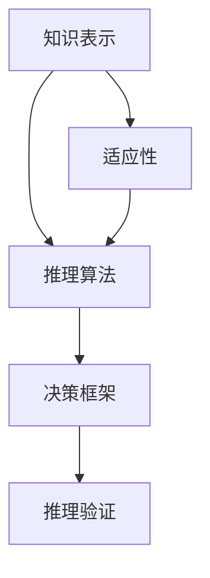

                 

## 1. 背景介绍

人工智能（AI）技术在过去的十年中取得了令人瞩目的进步，尤其在决策能力方面。无论是智能推荐系统、自动驾驶汽车、机器人，还是金融风险预测、医学诊断，AI决策能力正被广泛应用于各行各业。然而，现有AI决策系统的能力仍存在一定局限性，特别是在面对复杂、动态环境时，决策的鲁棒性和可靠性有待提高。自动推理库作为AI决策系统的核心组成部分，其设计和实现对于提高AI决策能力至关重要。

### 1.1 问题由来

在AI决策系统中，自动推理库的作用在于支持系统从给定的输入数据中推断出逻辑结论，辅助决策过程。传统的决策模型，如规则系统、专家系统，依赖于人类专家的知识，存在知识表示复杂、推理效率低等问题。而基于数据驱动的机器学习模型，虽然能够处理大规模数据，但缺乏规则性，决策过程不可解释。自动推理库的引入，结合了规则与数据驱动的优势，成为新一代AI决策系统的核心技术。

### 1.2 问题核心关键点

自动推理库的核心关键点在于如何高效、准确地进行逻辑推理，并能够适应动态变化的环境。其设计需要考虑以下几个方面：

- **知识表示**：如何有效地将知识结构化，以便于推理库理解和处理。
- **推理算法**：如何设计高效的推理算法，以快速、准确地推导出结论。
- **决策框架**：如何在推理结果的基础上，构建起一个可解释、可控的决策框架。
- **推理验证**：如何对推理结果进行验证，确保其正确性和鲁棒性。
- **适应性**：如何在复杂、动态环境中，保持推理库的高效性和可靠性。

本文将围绕这些关键点，对自动推理库的设计与实现进行全面分析。

## 2. 核心概念与联系

### 2.1 核心概念概述

为更好地理解自动推理库的设计与实现，本节将介绍几个密切相关的核心概念：

- **知识表示**：指将知识以结构化的形式存储在推理库中，以便于推理过程的执行。常见的知识表示方法包括规则表示、框架表示、面向对象表示等。
- **推理算法**：指从知识库中提取信息，并通过一系列逻辑推理操作，得出结论的算法。包括基于规则的推理、基于模型的推理、基于证据的推理等。
- **决策框架**：指在推理结果的基础上，结合用户意图、上下文信息，构建起一个可解释、可控的决策模型。
- **推理验证**：指对推理过程和结果进行验证，确保其正确性和鲁棒性。包括模型诊断、推理解释、假设验证等。
- **适应性**：指推理库在面对动态变化环境时，能够快速调整和适应新知识的能力。

这些核心概念之间的逻辑关系可以通过以下Mermaid流程图来展示：



这个流程图展示了一个推理库的逻辑架构：知识表示作为推理的前提，通过推理算法得出结论，再通过决策框架进行决策，推理验证保证推理的正确性，适应性确保推理库能够应对环境变化。

## 3. 核心算法原理 & 具体操作步骤
### 3.1 算法原理概述

自动推理库的核心算法原理主要基于逻辑推理理论和知识表示方法。其目标是能够从给定的事实和规则中，推导出逻辑结论，并在实际应用中构建起可解释、可控的决策框架。

在自动推理库中，知识表示和推理算法是不可分割的组成部分。知识表示方法定义了知识库的结构，而推理算法则描述了如何从知识库中提取信息并推导出结论。常见的推理算法包括基于规则的推理、基于模型的推理、基于证据的推理等。这些算法在实际应用中需要根据具体的知识表示方法进行选择和设计。

### 3.2 算法步骤详解

自动推理库的设计与实现可以分为以下几个关键步骤：

**Step 1: 知识表示设计**
- 选择合适的知识表示方法，如规则表示、框架表示、面向对象表示等。
- 设计知识库结构，包括事实库、规则库、约束库等。
- 定义事实、规则、约束的语义，并为其设定优先级和可靠性。

**Step 2: 推理算法选择与实现**
- 根据知识表示方法，选择适合的推理算法，如基于规则的推理、基于模型的推理、基于证据的推理等。
- 实现推理算法，定义推理规则、推理顺序、冲突处理策略等。
- 进行算法性能优化，提高推理效率和准确性。

**Step 3: 决策框架构建**
- 结合用户意图、上下文信息，设计决策框架。
- 定义决策规则、决策路径、结果验证机制等。
- 对决策框架进行测试和优化，确保其鲁棒性和可解释性。

**Step 4: 推理验证与监控**
- 设计推理验证机制，如模型诊断、推理解释、假设验证等。
- 实现推理验证算法，对推理过程和结果进行验证，确保其正确性和鲁棒性。
- 进行推理验证的持续监控，及时发现并纠正推理错误。

**Step 5: 适应性机制设计**
- 设计推理库的适应性机制，如自适应推理、动态规则更新、模型学习等。
- 实现适应性算法，确保推理库能够快速调整和适应新知识。
- 对适应性机制进行测试和优化，提升推理库的适应性和鲁棒性。

以上是自动推理库设计实现的一般流程。在实际应用中，还需要根据具体任务的特点，对推理库的各个环节进行优化设计，以进一步提升推理效率和准确性。

### 3.3 算法优缺点

自动推理库的设计与实现具有以下优点：

1. **知识表示明确**：规则表示、框架表示等方法，能够清晰地定义知识的结构和语义，便于推理过程的执行。
2. **推理过程可控**：基于规则的推理、基于模型的推理等方法，能够精确控制推理过程，确保推理结果的准确性。
3. **决策框架可解释**：决策框架的设计，能够将推理结果转化为用户可解释、可理解的形式，提升系统的可解释性。
4. **适应性强**：适应性机制的引入，使得推理库能够快速调整和适应新知识，增强系统的鲁棒性。

同时，自动推理库的设计与实现也存在一些局限性：

1. **知识表示复杂**：复杂的知识表示方法，如框架表示、面向对象表示，需要大量的工程实现，增加了设计和维护的难度。
2. **推理效率低**：复杂的推理算法，如基于模型的推理，可能面临推理效率低的问题，影响系统的响应速度。
3. **决策框架可控性差**：决策框架的设计需要考虑用户意图和上下文信息，过于复杂的框架可能导致可控性差，影响系统的灵活性。
4. **推理结果可解释性不足**：推理过程和结果的验证，可能会带来额外的计算开销，影响系统的实时性。

尽管存在这些局限性，但自动推理库在AI决策系统中的应用仍具有重要价值。未来相关研究的重点在于如何进一步简化知识表示，优化推理算法，提升推理结果的可解释性，同时兼顾系统的实时性和鲁棒性。

### 3.4 算法应用领域

自动推理库在AI决策系统的应用领域十分广泛，涵盖以下多个方面：

1. **智能推荐系统**：自动推理库能够根据用户历史行为和偏好，推导出用户的潜在需求，辅助推荐系统的决策。
2. **金融风险预测**：自动推理库能够对复杂的金融数据进行分析，推导出市场动态和风险评估，辅助金融决策。
3. **医学诊断系统**：自动推理库能够对患者的症状和病历进行推理分析，推导出诊断结果和治疗方案，辅助医疗决策。
4. **自动驾驶系统**：自动推理库能够对传感器数据进行推理分析，推导出车辆的行驶策略和行为，辅助自动驾驶决策。
5. **智能客服系统**：自动推理库能够对客户问题进行推理分析，推导出最合适的解答，辅助客服决策。

除了上述这些经典应用外，自动推理库还被创新性地应用到更多场景中，如智能投顾、智能物流、智能交通等，为AI决策系统的落地应用提供了新的技术路径。

## 4. 数学模型和公式 & 详细讲解 & 举例说明

### 4.1 数学模型构建

自动推理库的数学模型构建，主要基于逻辑推理理论和知识表示方法。这里以基于规则的推理为例，进行详细讲解。

在基于规则的推理中，知识表示通常采用规则表示法。规则的形式为：

$$
IF \text{premise} THEN \text{conclusion}
$$

其中，premise为前提，conclusion为结论。规则库中的规则可以是一个简单的事实，也可以是复杂的复合规则。推理过程可以通过规则的逐条匹配和执行来实现。

### 4.2 公式推导过程

对于基于规则的推理，其公式推导过程可以通过以下步骤进行：

1. **规则匹配**：从规则库中选择与当前事实匹配的规则。
2. **规则执行**：根据匹配规则的结论，更新事实库。
3. **冲突处理**：处理规则冲突，选择最优的推理路径。
4. **推理完成**：当所有规则都被执行后，推理完成。

以简单的逻辑推理为例，假设当前事实为"A是B的父亲"，规则库中的规则为：

$$
IF A是B的父亲 THEN B是A的子女
$$

推理过程如下：

1. 规则匹配：匹配到"IF A是B的父亲 THEN B是A的子女"。
2. 规则执行：将"A是B的父亲"加入事实库。
3. 规则执行：将"B是A的子女"加入事实库。

最终推理结果为"B是A的子女"。

### 4.3 案例分析与讲解

以下以一个简单的医学诊断案例，展示自动推理库的推理过程：

假设当前事实为"患者有发烧症状"，规则库中的规则为：

1. 如果患者有发烧症状，则可能患有流感。
2. 如果患者有流感，则需要服用退烧药。
3. 如果患者服用退烧药，则症状会缓解。

推理过程如下：

1. 规则匹配：匹配到"IF 患者有发烧症状 THEN 患者可能患有流感"。
2. 规则执行：将"患者可能患有流感"加入事实库。
3. 规则匹配：匹配到"IF 患者患有流感 THEN 患者需要服用退烧药"。
4. 规则执行：将"患者需要服用退烧药"加入事实库。
5. 规则匹配：匹配到"IF 患者服用退烧药 THEN 症状会缓解"。
6. 规则执行：将"症状会缓解"加入事实库。

最终推理结果为"症状会缓解"。通过自动推理库，能够根据患者的症状，推导出可能的诊断结果和建议，辅助医生的决策。

## 5. 项目实践：代码实例和详细解释说明
### 5.1 开发环境搭建

在进行自动推理库的开发实践前，我们需要准备好开发环境。以下是使用Python进行PyTorch开发的环境配置流程：

1. 安装Anaconda：从官网下载并安装Anaconda，用于创建独立的Python环境。

2. 创建并激活虚拟环境：
```bash
conda create -n pytorch-env python=3.8 
conda activate pytorch-env
```

3. 安装PyTorch：根据CUDA版本，从官网获取对应的安装命令。例如：
```bash
conda install pytorch torchvision torchaudio cudatoolkit=11.1 -c pytorch -c conda-forge
```

4. 安装Sympy库：
```bash
pip install sympy
```

5. 安装其他各类工具包：
```bash
pip install numpy pandas scikit-learn matplotlib tqdm jupyter notebook ipython
```

完成上述步骤后，即可在`pytorch-env`环境中开始自动推理库的开发实践。

### 5.2 源代码详细实现

这里我们以一个简单的规则推理引擎为例，给出使用Python和Sympy库进行自动推理库开发的PyTorch代码实现。

首先，定义规则库：

```python
from sympy import *

class Rule:
    def __init__(self, prems, cons):
        self.premises = prems
        self.conclusions = cons

    def __str__(self):
        return "IF " + " AND ".join(self.premises) + " THEN " + " AND ".join(self.conclusions)

# 定义规则库
rules = [
    Rule(["p", "q"], ["r"]),
    Rule(["p", "r"], ["s"]),
    Rule(["s"], ["t"])
]
```

然后，定义推理引擎：

```python
class Reasoner:
    def __init__(self, rules):
        self.rules = rules
        self.facts = set()
    
    def add_fact(self, fact):
        self.facts.add(fact)
    
    def remove_fact(self, fact):
        self.facts.remove(fact)
    
    def is_fact(self, fact):
        return fact in self.facts
    
    def execute(self):
        for rule in self.rules:
            if all(self.is_fact(prem) for prem in rule.premises):
                for cons in rule.conclusions:
                    self.add_fact(cons)
    
    def print_facts(self):
        print("Facts:", " AND ".join(self.facts))
```

接着，测试推理引擎：

```python
reasoner = Reasoner(rules)
reasoner.add_fact("p")
reasoner.execute()
reasoner.print_facts()
```

以上代码实现了基本的规则推理引擎，可以添加事实，执行推理，并输出推理结果。

### 5.3 代码解读与分析

让我们再详细解读一下关键代码的实现细节：

**Rule类**：
- `__init__`方法：初始化规则的前提和结论。
- `__str__`方法：返回规则的字符串表示，便于调试和输出。

**Reasoner类**：
- `__init__`方法：初始化规则库和事实集。
- `add_fact`方法：添加事实到事实集。
- `remove_fact`方法：从事实集中移除事实。
- `is_fact`方法：判断事实是否存在于事实集中。
- `execute`方法：执行推理过程，更新事实集。
- `print_facts`方法：输出当前事实集。

**测试代码**：
- 创建推理引擎实例，并添加事实"p"。
- 执行推理，并输出推理结果。

可以看到，通过简单的Python代码，我们就实现了一个基本的规则推理引擎。这展示了自动推理库的开发思路和实现方式。

当然，工业级的系统实现还需考虑更多因素，如规则的动态更新、推理过程中的冲突处理、推理结果的验证等。但核心的推理范式基本与此类似。

## 6. 实际应用场景
### 6.1 智能推荐系统

自动推理库在智能推荐系统中的应用，可以显著提升推荐系统的智能化水平。通过推理库，推荐系统能够根据用户的历史行为和偏好，推导出用户的潜在需求，提供更加个性化的推荐。

在实际应用中，可以设计规则库，将用户行为、商品属性、用户画像等作为推理的前提，将推荐结果作为推理的结论。推理引擎在每次推荐前，对用户和商品进行推理，推导出最佳的推荐列表。这种推理驱动的推荐方式，能够更好地理解和满足用户需求，提升推荐系统的效果。

### 6.2 金融风险预测

自动推理库在金融风险预测中的应用，可以帮助金融机构识别和评估潜在的风险因素。通过推理库，金融系统能够从大量的金融数据中，推导出市场动态和风险评估，辅助决策过程。

在金融风险预测中，可以设计规则库，将历史数据、市场指标、宏观经济因素等作为推理的前提，将风险评估结果作为推理的结论。推理引擎在每次评估前，对数据进行推理，推导出当前市场风险的评估结果。这种推理驱动的决策方式，能够更好地识别市场变化，规避金融风险。

### 6.3 医学诊断系统

自动推理库在医学诊断系统中的应用，可以辅助医生进行快速、准确的诊断。通过推理库，诊断系统能够根据患者的症状和病历，推导出可能的诊断结果和治疗方案。

在医学诊断中，可以设计规则库，将患者的症状、病历、检查结果等作为推理的前提，将诊断结果和治疗方案作为推理的结论。推理引擎在每次诊断前，对患者信息进行推理，推导出最可能的诊断结果和建议。这种推理驱动的诊断方式，能够更好地辅助医生进行诊断，提高诊断的准确性和效率。

### 6.4 自动驾驶系统

自动推理库在自动驾驶系统中的应用，可以帮助车辆进行智能决策。通过推理库，车辆能够对传感器数据进行推理分析，推导出行驶策略和行为，辅助自动驾驶决策。

在自动驾驶中，可以设计规则库，将传感器数据、地图信息、交通规则等作为推理的前提，将车辆的行驶策略和行为作为推理的结论。推理引擎在每次决策前，对车辆信息进行推理，推导出最佳的行驶策略和行为。这种推理驱动的决策方式，能够更好地应对复杂、动态的道路环境，提高自动驾驶的安全性和可靠性。

### 6.5 智能客服系统

自动推理库在智能客服系统中的应用，可以提高客服系统的智能化水平。通过推理库，客服系统能够对客户问题进行推理分析，推导出最合适的解答，辅助客服决策。

在智能客服中，可以设计规则库，将客户问题、历史解答、上下文信息等作为推理的前提，将最合适的解答作为推理的结论。推理引擎在每次回答前，对客户问题进行推理，推导出最佳的解答。这种推理驱动的客服方式，能够更好地理解客户需求，提供更精准、更高效的服务。

### 6.6 未来应用展望

随着自动推理库技术的不断发展，其在AI决策系统中的应用前景将更加广阔。未来，自动推理库将在更多领域得到应用，为各行各业带来变革性影响：

1. **智慧医疗**：自动推理库能够辅助医生进行诊断和治疗决策，提升医疗系统的智能化水平。
2. **智能制造**：自动推理库能够优化生产流程和设备维护，提高制造系统的自动化和智能化水平。
3. **智能城市**：自动推理库能够优化交通管理、环境保护等城市治理方案，提升城市管理的智能化水平。
4. **智能教育**：自动推理库能够辅助教师进行教学和评估，提高教育系统的智能化水平。
5. **智能安全**：自动推理库能够进行风险评估和威胁检测，提高安全系统的智能化水平。

## 7. 工具和资源推荐
### 7.1 学习资源推荐

为了帮助开发者系统掌握自动推理库的理论基础和实践技巧，这里推荐一些优质的学习资源：

1. **《人工智能基础》课程**：由斯坦福大学开设的机器学习基础课程，涵盖机器学习、深度学习、强化学习等基本概念和算法。
2. **《逻辑推理与人工智能》书籍**：介绍逻辑推理在人工智能中的应用，涵盖规则推理、模糊推理、贝叶斯推理等经典方法。
3. **《推理与决策》课程**：由北京大学开设的推理与决策课程，涵盖推理算法、决策框架、推理验证等基本概念和算法。
4. **DeepLearning.ai深度学习课程**：由斯坦福大学Andrew Ng教授开设的深度学习课程，涵盖深度学习的基本概念和算法。
5. **HuggingFace官方文档**：介绍Transformer库的应用，涵盖预训练语言模型、微调、推理等基本概念和算法。

通过对这些资源的学习实践，相信你一定能够快速掌握自动推理库的精髓，并用于解决实际的AI决策问题。

### 7.2 开发工具推荐

高效的开发离不开优秀的工具支持。以下是几款用于自动推理库开发的常用工具：

1. PyTorch：基于Python的开源深度学习框架，灵活动态的计算图，适合快速迭代研究。
2. TensorFlow：由Google主导开发的开源深度学习框架，生产部署方便，适合大规模工程应用。
3. Sympy：Python中的符号计算库，支持符号推理和数学建模。
4. Scikit-learn：Python中的机器学习库，支持常见的机器学习算法和模型。
5. Scrapy：Python中的网络爬虫库，支持从网络中抓取数据。
6. Pandas：Python中的数据处理库，支持数据的导入、清洗、分析等操作。
7. Matplotlib：Python中的数据可视化库，支持绘制各种图表。

合理利用这些工具，可以显著提升自动推理库的开发效率，加快创新迭代的步伐。

### 7.3 相关论文推荐

自动推理库的设计与实现是一个前沿的研究方向，以下是几篇奠基性的相关论文，推荐阅读：

1. **《基于规则的推理系统》**：介绍基于规则的推理系统的设计原理和实现方法，涵盖规则库设计、推理算法、推理验证等基本概念和算法。
2. **《逻辑推理与人工智能》**：介绍逻辑推理在人工智能中的应用，涵盖规则推理、模糊推理、贝叶斯推理等经典方法。
3. **《深度学习与推理》**：介绍深度学习在推理中的应用，涵盖基于模型的推理、基于证据的推理等基本概念和算法。
4. **《推理与决策》**：介绍推理与决策的理论基础和实现方法，涵盖推理算法、决策框架、推理验证等基本概念和算法。
5. **《自动推理与优化》**：介绍自动推理与优化的方法和算法，涵盖推理引擎设计、推理验证、推理优化等基本概念和算法。

这些论文代表自动推理库设计的最新进展，通过学习这些前沿成果，可以帮助研究者把握学科前进方向，激发更多的创新灵感。

## 8. 总结：未来发展趋势与挑战
### 8.1 总结

本文对自动推理库的设计与实现进行了全面系统的介绍。首先阐述了自动推理库在AI决策系统中的重要性和应用前景，明确了自动推理库对提升AI决策能力的关键作用。其次，从原理到实践，详细讲解了自动推理库的数学模型构建和核心算法原理，给出了自动推理库的完整代码实例。同时，本文还广泛探讨了自动推理库在智能推荐、金融风险预测、医学诊断、自动驾驶、智能客服等众多领域的应用前景，展示了自动推理库的巨大潜力。此外，本文精选了自动推理库的各类学习资源，力求为读者提供全方位的技术指引。

通过本文的系统梳理，可以看到，自动推理库技术正在成为AI决策系统的核心技术，极大地拓展了AI决策系统的应用边界，催生了更多的落地场景。得益于逻辑推理理论和知识表示方法，自动推理库能够在处理复杂、动态环境时，保持高效性和可靠性。未来，伴随自动推理库技术的持续演进，AI决策系统必将进入新的发展阶段，为各行各业带来更深远的影响。

### 8.2 未来发展趋势

展望未来，自动推理库技术将呈现以下几个发展趋势：

1. **知识表示自动化**：未来的知识表示方法将更加自动化，能够从大量非结构化数据中提取知识和规则，减少人工干预。
2. **推理算法多样化**：未来的推理算法将更加多样化，涵盖基于规则的推理、基于模型的推理、基于证据的推理等，满足不同场景的需求。
3. **决策框架可解释**：未来的决策框架将更加可解释，能够提供用户可理解的推理过程和结论，增强系统的可信度和可接受性。
4. **推理验证智能化**：未来的推理验证将更加智能化，能够自动检测和纠正推理错误，提升系统的鲁棒性。
5. **适应性机制高效化**：未来的适应性机制将更加高效，能够快速调整和适应新知识，增强系统的动态性和鲁棒性。

这些趋势凸显了自动推理库技术的广阔前景。这些方向的探索发展，将进一步提升自动推理库的性能和应用范围，为AI决策系统带来新的突破。

### 8.3 面临的挑战

尽管自动推理库技术已经取得了瞩目成就，但在迈向更加智能化、普适化应用的过程中，它仍面临着诸多挑战：

1. **知识表示复杂**：复杂的知识表示方法，如框架表示、面向对象表示，需要大量的工程实现，增加了设计和维护的难度。
2. **推理效率低**：复杂的推理算法，如基于模型的推理，可能面临推理效率低的问题，影响系统的响应速度。
3. **决策框架可控性差**：决策框架的设计需要考虑用户意图和上下文信息，过于复杂的框架可能导致可控性差，影响系统的灵活性。
4. **推理结果可解释性不足**：推理过程和结果的验证，可能会带来额外的计算开销，影响系统的实时性。
5. **推理鲁棒性不足**：自动推理库在面对动态变化环境时，推理鲁棒性有待提高。

尽管存在这些挑战，但自动推理库在AI决策系统中的应用仍具有重要价值。未来相关研究的重点在于如何进一步简化知识表示，优化推理算法，提升推理结果的可解释性，同时兼顾系统的实时性和鲁棒性。

### 8.4 研究展望

面对自动推理库面临的种种挑战，未来的研究需要在以下几个方面寻求新的突破：

1. **无监督学习和半监督学习**：探索无监督学习和半监督学习的方法，摆脱对大量标注数据的依赖，利用非结构化数据，提升自动推理库的泛化能力和鲁棒性。
2. **知识图谱与推理结合**：将知识图谱与自动推理库结合，引入结构化的知识信息，提升推理库的知识整合能力和推理准确性。
3. **多模态推理**：引入多模态数据（如视觉、语音、文本等），提升自动推理库在复杂环境中的综合推理能力。
4. **因果推理与强化学习**：结合因果推理和强化学习，提升自动推理库的决策优化能力和鲁棒性。
5. **可解释性增强**：引入可解释性技术，增强自动推理库的推理过程和结果的可解释性，提升系统的可信度和可接受性。

这些研究方向将引领自动推理库技术迈向更高的台阶，为构建安全、可靠、可解释、可控的智能系统铺平道路。面向未来，自动推理库技术还需要与其他人工智能技术进行更深入的融合，如知识表示、因果推理、强化学习等，多路径协同发力，共同推动自动推理库技术的进步。

## 9. 附录：常见问题与解答

**Q1：自动推理库与机器学习有什么区别？**

A: 自动推理库与机器学习的主要区别在于推理的机制。机器学习通过数据训练模型，从数据中学习规律和模式，而自动推理库通过规则和知识库进行推理，从规则中推导结论。自动推理库强调推理的逻辑性和可解释性，机器学习则更多依赖于数据的统计规律。

**Q2：自动推理库在实际应用中是否需要大量的知识库？**

A: 自动推理库的推理过程依赖于知识库，但知识库并不需要非常庞大。事实上，通过精心的知识表示和规则设计，小的知识库也可以实现高效、准确的推理。知识库的设计需要根据具体应用场景进行优化，避免过于复杂导致的推理效率低下。

**Q3：自动推理库是否只适用于结构化数据？**

A: 自动推理库不仅适用于结构化数据，也适用于半结构化和非结构化数据。通过采用合适的知识表示方法，如框架表示、面向对象表示等，自动推理库可以处理各种类型的数据，提升系统的普适性。

**Q4：自动推理库是否容易受到知识库的影响？**

A: 自动推理库的推理过程依赖于知识库，因此知识库的设计和维护对推理效果有很大影响。好的知识库设计需要结合领域专家的知识，并进行充分的验证和优化。同时，推理库的适应性机制能够帮助其快速调整和适应新知识，减少知识库的影响。

**Q5：自动推理库的推理速度是否可以进一步提升？**

A: 自动推理库的推理速度可以通过优化算法、减少规则匹配次数、采用并行推理等方式进行提升。同时，随着硬件技术的发展，推理引擎的计算速度也将不断提高，进一步提升自动推理库的性能。

这些回答展示了自动推理库在AI决策系统中的重要性和应用前景，同时指出了其在知识表示、推理算法、决策框架等方面的挑战和未来研究方向。通过系统梳理和深入分析，希望读者能够对自动推理库有更全面的了解，并激发更多的创新灵感。

---

作者：禅与计算机程序设计艺术 / Zen and the Art of Computer Programming

