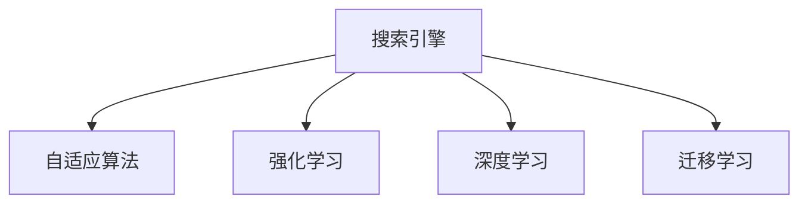

                 

# 自我学习AI：搜索引擎的进化

## 1. 背景介绍

### 1.1 问题由来
自1998年Google搜索引擎问世以来，搜索引擎已从简单的文本匹配发展为集搜索、广告、数据分析于一体的复杂系统。伴随大数据和人工智能技术的进步，搜索引擎的智能化水平不断提升，已具备高度自适应和自我优化的能力，能够根据用户搜索行为和反馈进行自我学习和优化。

### 1.2 问题核心关键点
搜索引擎的自我学习主要依赖于机器学习和深度学习技术。具体来说，搜索引擎会根据用户点击行为、搜索查询、广告点击率等数据进行训练，不断优化其检索算法和排名策略。主要方法包括：

- 在线学习(Online Learning)：搜索引擎在处理每条搜索请求时，实时更新模型参数，提升模型预测准确性。
- 强化学习(Reinforcement Learning)：搜索引擎通过观察和反馈，逐步优化广告投放和内容排序策略，提升用户体验。
- 深度学习(Deep Learning)：搜索引擎使用神经网络模型对数据进行特征提取和模式识别，提升搜索相关性。
- 转移学习(Transfer Learning)：搜索引擎通过迁移学习技术，利用预训练模型获取更广泛的知识，提升模型泛化能力。

### 1.3 问题研究意义
研究搜索引擎的自我学习能力，对于理解现代互联网的运行机制，提升搜索质量和用户体验，具有重要意义：

1. 提升搜索效率。自我学习的搜索引擎能够根据用户需求动态调整检索算法和数据策略，实时优化搜索结果相关性。
2. 提高广告效益。通过强化学习优化广告投放策略，提高点击率和广告转化率，为搜索引擎运营商带来更多收益。
3. 增强数据分析能力。自我学习搜索引擎能够自动提取和分析搜索数据，帮助搜索引擎运营者洞察用户行为和市场趋势。
4. 加速技术创新。自我学习搜索引擎通过不断优化和迭代，推动搜索引擎技术前沿的发展。
5. 改善用户体验。自我学习的搜索引擎能够更准确、更快速地为用户提供相关搜索结果，提升搜索体验。

## 2. 核心概念与联系

### 2.1 核心概念概述

为更好地理解搜索引擎的自我学习机制，本节将介绍几个关键概念：

- 搜索引擎(Search Engine)：帮助用户检索网页、图片、视频等互联网资源的系统，是现代互联网的基础设施。
- 自适应算法(Adaptive Algorithm)：能够根据用户反馈和数据变化动态调整的算法，提升模型的性能。
- 强化学习(Reinforcement Learning)：通过观察和反馈逐步优化模型策略，最大化系统效益。
- 深度学习(Deep Learning)：利用神经网络模型对数据进行特征提取和模式识别。
- 迁移学习(Transfer Learning)：利用预训练模型获取知识，提升模型泛化能力。

这些核心概念之间的逻辑关系可以通过以下Mermaid流程图来展示：



这个流程图展示了搜索引擎的核心概念及其之间的关系：

1. 搜索引擎通过自适应算法不断优化其检索和展示策略。
2. 强化学习帮助搜索引擎根据用户反馈动态调整广告和内容排名。
3. 深度学习使得搜索引擎能够更准确地理解和处理用户搜索查询。
4. 迁移学习帮助搜索引擎利用预训练模型，提升模型泛化能力。

这些概念共同构成了搜索引擎的智能化基础，使其能够根据用户需求和市场变化，实时调整和优化搜索结果和广告投放策略。

## 3. 核心算法原理 & 具体操作步骤

### 3.1 算法原理概述

搜索引擎的自我学习过程，本质上是一种在线学习和强化学习相结合的过程。其核心思想是：通过用户搜索行为、点击行为等数据，实时更新模型参数，不断提升模型预测和决策能力。

具体来说，搜索引擎会根据用户的每次查询行为，计算出点击率、停留时间、广告点击率等指标，作为反馈信号。然后，利用这些反馈信号对模型进行在线更新，优化搜索算法和广告策略，提高用户体验和运营收益。

### 3.2 算法步骤详解

搜索引擎的自我学习主要包括以下几个关键步骤：

**Step 1: 数据收集和处理**
- 收集用户搜索行为数据、点击数据、广告点击数据等。
- 对数据进行清洗、标注，构建训练样本集。
- 设计损失函数，量化模型输出与真实标签的差异。

**Step 2: 模型训练和优化**
- 选择合适的模型和算法，如深度神经网络、强化学习算法。
- 设置模型的初始化参数，并定义优化算法和超参数。
- 使用训练样本进行模型训练，最小化损失函数。
- 定期在验证集上评估模型性能，根据评估结果调整超参数和模型结构。

**Step 3: 实时反馈和优化**
- 部署训练好的模型到生产环境。
- 实时接收用户搜索请求和反馈信号。
- 根据反馈信号，调整模型参数，提升搜索和广告效果。
- 重复以上步骤，不断迭代优化模型。

### 3.3 算法优缺点

搜索引擎的自我学习算法具有以下优点：
1. 高效实时。通过在线学习和实时反馈，搜索引擎能够迅速响应用户需求，提升搜索相关性和广告效果。
2. 泛化性强。自适应算法和迁移学习技术，使得搜索引擎能够适应不同场景和任务，提升模型泛化能力。
3. 精确度高。深度学习技术能够自动提取数据特征，提高搜索和广告预测准确性。
4. 数据驱动。通过不断收集和分析用户数据，搜索引擎能够持续优化其算法和策略，提升用户体验和运营效益。

同时，该方法也存在一些局限性：
1. 依赖数据质量。搜索和广告的效果，很大程度上取决于数据的准确性和代表性。
2. 模型复杂度高。深度神经网络和高频次优化，导致模型复杂度较高，训练和推理速度较慢。
3. 数据隐私问题。搜索引擎需要收集和分析大量用户数据，涉及隐私保护和数据安全问题。
4. 策略动态性强。强化学习导致策略频繁变化，难以进行长期规划和稳定性分析。
5. 计算资源需求高。高频次的在线更新和优化，需要大量的计算资源支持。

尽管存在这些局限性，但就目前而言，基于在线学习和强化学习的自我学习算法仍然是搜索引擎的主要优化手段。未来相关研究的重点在于如何进一步降低计算复杂度，增强策略稳定性和数据隐私保护，同时兼顾模型的实时性和准确性。

### 3.4 算法应用领域

搜索引擎的自我学习算法已经广泛应用于以下领域：

- 搜索算法优化：通过在线学习，实时调整搜索引擎的算法模型，提升搜索结果的相关性。
- 广告策略优化：通过强化学习，动态调整广告投放策略，提高广告点击率和转化率。
- 数据挖掘和分析：利用深度学习技术，自动提取和分析搜索数据，洞察用户行为和市场趋势。
- 多模态搜索：将文本、图片、音频等多模态数据融合，提升搜索引擎的智能化水平。
- 推荐系统：通过强化学习优化推荐策略，提高推荐效果和用户满意度。
- 智能问答：利用自然语言处理技术，提升智能问答系统的理解能力和回答质量。

除了上述这些核心应用外，搜索引擎的自我学习技术还被创新性地应用于内容推荐、用户画像构建、个性化搜索等场景中，进一步拓展了搜索引擎的应用边界。

## 4. 数学模型和公式 & 详细讲解

### 4.1 数学模型构建

搜索引擎的自我学习过程，可以通过数学模型进行形式化描述。

假设搜索引擎处理每个搜索请求，返回相关网页列表 $Q$，用户点击 $C$，点击网页相关度 $R$。则可以通过以下模型来描述搜索引擎的自我学习过程：

- 点击率模型：$C = f(Q, R)$，用户点击行为依赖于搜索结果的相关性和网页质量。
- 停留时间模型：$T = g(Q, R)$，用户在搜索结果页面停留的时间依赖于搜索结果的相关性和网页质量。
- 广告点击率模型：$A = h(Q, R)$，广告点击率依赖于搜索结果的相关性和广告内容。

其中 $f$、$g$、$h$ 为非线性函数，表示模型预测能力和复杂性。

### 4.2 公式推导过程

以下我们以广告点击率模型为例，推导广告点击率计算公式。

假设搜索引擎处理每个搜索请求，返回相关网页列表 $Q$，用户点击 $C$，点击网页相关度 $R$。则广告点击率模型可以表示为：

$$
A = \frac{C}{Q}
$$

其中 $C$ 为广告点击次数，$Q$ 为广告曝光次数。

在实际应用中，广告点击率计算公式通常会考虑点击行为和停留时间等指标，进行加权处理：

$$
A = \frac{C}{Q} \times \omega_1 + \frac{T}{Q} \times \omega_2
$$

其中 $\omega_1$ 和 $\omega_2$ 为不同指标的权重，通常需要根据具体场景进行调整。

### 4.3 案例分析与讲解

假设某搜索引擎有 $100$ 个广告位，每个广告位每天会接收到 $10,000$ 次广告展示。某次查询中，相关网页列表为 $100$，用户点击了其中 $10$ 次广告，平均停留时间为 $30$ 秒，广告点击率为 $5\%$。根据公式计算，点击率 $C=10$，停留时间 $T=3000$，广告点击率 $A=5\%$。

通过这种计算方式，搜索引擎能够实时反馈广告点击率，并根据反馈信号对广告策略进行调整，如调整广告位分配、优化广告内容等，从而提高广告效益和用户体验。

## 5. 项目实践：代码实例和详细解释说明

### 5.1 开发环境搭建

在进行搜索引擎自我学习实践前，我们需要准备好开发环境。以下是使用Python进行TensorFlow开发的开发环境配置流程：

1. 安装Anaconda：从官网下载并安装Anaconda，用于创建独立的Python环境。

2. 创建并激活虚拟环境：
```bash
conda create -n tf-env python=3.8 
conda activate tf-env
```

3. 安装TensorFlow：根据CUDA版本，从官网获取对应的安装命令。例如：
```bash
conda install tensorflow -c tf -c conda-forge
```

4. 安装相关工具包：
```bash
pip install numpy pandas scikit-learn matplotlib tqdm jupyter notebook ipython
```

完成上述步骤后，即可在`tf-env`环境中开始搜索引擎自我学习实践。

### 5.2 源代码详细实现

下面我们以搜索引擎点击率模型为例，给出使用TensorFlow实现的代码。

首先，定义模型的超参数：

```python
import tensorflow as tf
import numpy as np

tf.random.set_seed(42)

# 超参数
learning_rate = 0.01
batch_size = 128
num_epochs = 100
```

然后，定义点击率模型的函数：

```python
# 定义点击率模型
def click_rate_model(X, y):
    X = tf.keras.layers.Dense(64, activation='relu')(X)
    X = tf.keras.layers.Dense(64, activation='relu')(X)
    y_pred = tf.keras.layers.Dense(1, activation='sigmoid')(X)
    loss = tf.keras.losses.BinaryCrossentropy()(y_pred, y)
    optimizer = tf.keras.optimizers.Adam(learning_rate=learning_rate)
    model = tf.keras.Model(X, y_pred)
    model.compile(optimizer=optimizer, loss=loss, metrics=['accuracy'])
    return model
```

接下来，加载训练数据并进行模型训练：

```python
# 加载训练数据
X_train = np.load('train_X.npy')
y_train = np.load('train_y.npy')

# 定义模型
model = click_rate_model(X_train, y_train)

# 训练模型
model.fit(X_train, y_train, batch_size=batch_size, epochs=num_epochs, validation_split=0.2)
```

最后，评估模型性能并输出结果：

```python
# 加载测试数据
X_test = np.load('test_X.npy')
y_test = np.load('test_y.npy')

# 评估模型
y_pred = model.predict(X_test)
y_pred = (y_pred > 0.5).astype(int)
accuracy = tf.keras.metrics.Accuracy()(y_test, y_pred).numpy()
print(f'Test accuracy: {accuracy:.4f}')
```

### 5.3 代码解读与分析

让我们再详细解读一下关键代码的实现细节：

**点击率模型函数**：
- `Dense`层：全连接层，用于提取输入特征的表示。
- `relu`激活函数：非线性变换，提升模型表达能力。
- `sigmoid`激活函数：输出层激活函数，将模型输出转化为点击率的概率。
- `BinaryCrossentropy`损失函数：二分类交叉熵损失函数，用于衡量模型预测和真实标签的差异。
- `Adam`优化器：自适应优化算法，根据梯度信息动态调整学习率。
- `Model`类：封装模型层和损失函数，便于调用。

**训练过程**：
- `fit`方法：使用训练数据进行模型训练，设置训练批次大小、迭代次数和验证集比例。
- `model.predict`方法：使用测试数据进行模型评估，计算预测准确率。

**模型评估**：
- `accuracy`函数：计算预测准确率，使用`metrics.Accuracy`类计算模型准确率。
- 将模型输出转化为整数，进行准确率计算。

可以看出，TensorFlow提供了简单易用的接口，可以方便地实现点击率模型的训练和评估。开发者可以根据具体需求，调整模型结构和超参数，进行更高效的优化。

当然，工业级的系统实现还需考虑更多因素，如模型部署、超参数调优、模型保存等。但核心的自我学习流程基本与此类似。

## 6. 实际应用场景

### 6.1 智能广告系统

搜索引擎的自我学习算法被广泛应用于智能广告系统的优化。传统的广告系统往往需要人工设计和维护，难以实时适应市场变化和用户需求。而利用自我学习算法，广告系统能够根据用户行为实时调整广告策略，提升广告效益。

具体来说，智能广告系统可以收集用户点击行为、停留时间、广告点击率等数据，使用点击率模型进行训练和优化，实现以下效果：
1. 精准投放：根据用户行为特征，智能分配广告位，提升广告点击率。
2. 实时优化：实时调整广告内容，提升广告点击和转化效果。
3. 用户画像：利用用户点击和停留时间数据，构建用户画像，进行更精准的广告投放。

通过这种优化方式，智能广告系统能够大幅提升广告效益，同时提高用户体验和满意度。

### 6.2 个性化推荐系统

搜索引擎的自我学习算法在个性化推荐系统中也有广泛应用。传统的推荐系统往往依赖于静态规则和简单的评分模型，难以应对用户的多样化和个性化需求。利用自我学习算法，推荐系统能够根据用户历史行为和实时反馈，动态调整推荐策略，提升推荐效果。

具体来说，推荐系统可以收集用户浏览、点击、收藏、评分等行为数据，使用推荐模型进行训练和优化，实现以下效果：
1. 精准推荐：根据用户历史行为和实时反馈，推荐最符合用户需求的商品和内容。
2. 动态调整：实时调整推荐策略，提升推荐效果和用户体验。
3. 多模态融合：融合文本、图片、音频等多模态数据，提升推荐系统的智能化水平。

通过这种优化方式，个性化推荐系统能够更好地满足用户需求，提升推荐效果和用户体验，推动电商和内容平台的发展。

### 6.3 智能搜索系统

搜索引擎的自我学习算法在智能搜索系统中也有广泛应用。传统的搜索系统往往依赖于简单的关键词匹配算法，难以处理复杂的查询需求。利用自我学习算法，搜索系统能够根据用户搜索行为和反馈，动态调整搜索策略，提升搜索效果。

具体来说，智能搜索系统可以收集用户搜索行为、点击行为、广告点击率等数据，使用搜索模型进行训练和优化，实现以下效果：
1. 精准搜索：根据用户搜索行为和反馈，动态调整搜索算法，提升搜索结果的相关性。
2. 实时优化：实时调整搜索策略，提升搜索效果和用户体验。
3. 多模态搜索：融合文本、图片、音频等多模态数据，提升搜索系统的智能化水平。

通过这种优化方式，智能搜索系统能够更好地满足用户需求，提升搜索效果和用户体验，推动搜索引擎的发展。

### 6.4 未来应用展望

随着深度学习和强化学习技术的进步，基于自我学习的搜索引擎和推荐系统将不断进化，提升智能化水平和用户体验。

未来，自我学习算法将融合更多先验知识和规则，提升模型的泛化能力和解释性。通过引入多模态数据，搜索引擎和推荐系统将具备更全面的信息处理能力，实现更精准的个性化推荐和智能搜索。

此外，自我学习算法还将被广泛应用于智能客服、智能问答、智能交互等场景中，推动人工智能技术的广泛应用。相信随着技术的发展，自我学习算法将迎来更多创新突破，推动搜索引擎和推荐系统迈向更高的智能化水平。

## 7. 工具和资源推荐

### 7.1 学习资源推荐

为了帮助开发者系统掌握搜索引擎的自我学习理论基础和实践技巧，这里推荐一些优质的学习资源：

1. 《深度学习与搜索引擎》系列博文：由大模型技术专家撰写，深入浅出地介绍了深度学习在搜索引擎中的应用。

2. 《搜索广告优化技术》书籍：由搜索引擎优化专家撰写，介绍了广告点击率模型、转化率模型等经典优化算法。

3. 《个性化推荐系统》课程：斯坦福大学开设的推荐系统课程，有Lecture视频和配套作业，带你入门推荐系统开发。

4. Kaggle搜索引擎数据集：Kaggle平台上有大量搜索引擎数据集，可供研究者使用。

5. TensorFlow官方文档：TensorFlow的官方文档，提供了全面的API和样例代码，是学习搜索引擎自我学习算法的必备资料。

通过这些资源的学习实践，相信你一定能够快速掌握搜索引擎的自我学习精髓，并用于解决实际的搜索优化问题。

### 7.2 开发工具推荐

高效的开发离不开优秀的工具支持。以下是几款用于搜索引擎自我学习开发的常用工具：

1. TensorFlow：由Google主导开发的深度学习框架，生产部署方便，适合大规模工程应用。

2. PyTorch：基于Python的开源深度学习框架，灵活高效，适合快速迭代研究。

3. Weights & Biases：模型训练的实验跟踪工具，可以记录和可视化模型训练过程中的各项指标，方便对比和调优。

4. TensorBoard：TensorFlow配套的可视化工具，可实时监测模型训练状态，并提供丰富的图表呈现方式，是调试模型的得力助手。

5. Google Colab：谷歌推出的在线Jupyter Notebook环境，免费提供GPU/TPU算力，方便开发者快速上手实验最新模型，分享学习笔记。

合理利用这些工具，可以显著提升搜索引擎自我学习任务的开发效率，加快创新迭代的步伐。

### 7.3 相关论文推荐

搜索引擎的自我学习技术源于学界的持续研究。以下是几篇奠基性的相关论文，推荐阅读：

1. The Adaptive Information Retrieval Framework：提出Adaptive IR框架，通过在线学习和实时反馈提升搜索算法。

2. Deep Learning for Click-Through Rate Prediction：提出DeepCTR模型，使用深度神经网络进行点击率预测。

3. Learning to Rank: A Unified Approach for a Family of Recommender Engines：提出RankNet模型，使用强化学习优化推荐系统。

4. Click-Through Rate Prediction and beyond：提出SVM和SVM-Adaboost方法，提升点击率预测效果。

5. Deep Neural Network Based Recommender Systems：提出DLR方法，使用深度神经网络提升推荐效果。

这些论文代表了大模型学习技术的发展脉络。通过学习这些前沿成果，可以帮助研究者把握学科前进方向，激发更多的创新灵感。

## 8. 总结：未来发展趋势与挑战

### 8.1 总结

本文对搜索引擎的自我学习算法进行了全面系统的介绍。首先阐述了搜索引擎的自我学习背景和意义，明确了自我学习在提升搜索效率、广告效益、数据分析能力等方面的重要作用。其次，从原理到实践，详细讲解了点击率模型的训练和优化过程，给出了模型实现的代码实例。同时，本文还广泛探讨了自我学习算法在智能广告系统、个性化推荐系统、智能搜索系统等多个领域的应用前景，展示了自我学习算法的巨大潜力。此外，本文精选了自我学习技术的各类学习资源，力求为读者提供全方位的技术指引。

通过本文的系统梳理，可以看到，搜索引擎的自我学习算法正在成为智能搜索和推荐系统的重要范式，极大地拓展了深度学习和机器学习在搜索优化领域的应用。未来，伴随深度学习和强化学习技术的持续演进，基于自我学习的搜索引擎和推荐系统必将进一步提升智能化水平，为人类认知智能的进化带来深远影响。

### 8.2 未来发展趋势

展望未来，搜索引擎的自我学习技术将呈现以下几个发展趋势：

1. 深度学习与强化学习结合。深度学习能够自动提取数据特征，强化学习能够动态调整模型策略，两者结合能够实现更高效、更精准的搜索优化。

2. 多模态数据融合。融合文本、图片、音频等多模态数据，提升搜索和推荐系统的智能化水平。

3. 自适应算法优化。通过自适应算法，实时优化搜索结果和广告策略，提升用户体验和广告效益。

4. 模型压缩与优化。通过模型压缩和优化，降低计算资源消耗，提高模型部署效率。

5. 数据隐私保护。加强数据隐私保护，防止数据泄露和滥用。

6. 模型解释性提升。通过模型解释性分析，提升模型预测的透明度和可解释性。

以上趋势凸显了搜索引擎自我学习技术的广阔前景。这些方向的探索发展，必将进一步提升搜索和推荐系统的性能和用户体验，推动搜索引擎技术的成熟和普及。

### 8.3 面临的挑战

尽管搜索引擎的自我学习技术已经取得了瞩目成就，但在迈向更加智能化、普适化应用的过程中，它仍面临着诸多挑战：

1. 数据质量瓶颈。搜索和广告的效果，很大程度上取决于数据的准确性和代表性。如何提升数据质量，提高模型预测准确性，仍是重要问题。

2. 计算资源消耗。深度学习和强化学习算法需要大量计算资源，如何优化算法，降低资源消耗，仍需不断探索。

3. 模型解释性不足。深度学习模型通常被认为是"黑盒"系统，难以解释其内部工作机制和决策逻辑。如何提升模型解释性，满足监管需求，仍需研究。

4. 数据隐私问题。搜索引擎需要收集和分析大量用户数据，涉及隐私保护和数据安全问题。如何保护用户隐私，防止数据滥用，仍需重视。

5. 模型动态性强。强化学习导致策略频繁变化，难以进行长期规划和稳定性分析。如何优化策略稳定性，增强系统可控性，仍需研究。

6. 模型泛化能力。如何提升模型泛化能力，适应不同领域和任务，仍需探索。

正视搜索引擎自我学习面临的这些挑战，积极应对并寻求突破，将是大模型学习技术走向成熟的必由之路。相信随着学界和产业界的共同努力，这些挑战终将一一被克服，搜索引擎自我学习必将在构建智能搜索和推荐系统中扮演越来越重要的角色。

### 8.4 研究展望

面向未来，搜索引擎的自我学习技术需要在以下几个方面寻求新的突破：

1. 探索更高效的学习算法。寻找更高效、更稳定的算法，提升模型训练和推理效率。

2. 引入更多先验知识。将符号化的先验知识，如知识图谱、逻辑规则等，与神经网络模型进行巧妙融合，提升模型泛化能力和解释性。

3. 结合因果分析和博弈论工具。将因果分析方法引入搜索和推荐系统，识别出关键特征和脆弱点，提高系统的稳定性和可控性。

4. 纳入伦理道德约束。在模型训练目标中引入伦理导向的评估指标，过滤和惩罚有害内容，确保输出符合人类价值观和伦理道德。

这些研究方向的探索，必将引领搜索引擎自我学习技术迈向更高的台阶，为构建安全、可靠、可解释、可控的智能搜索和推荐系统铺平道路。面向未来，搜索引擎的自我学习技术还需要与其他人工智能技术进行更深入的融合，如知识表示、因果推理、强化学习等，多路径协同发力，共同推动自然语言理解和智能交互系统的进步。只有勇于创新、敢于突破，才能不断拓展搜索引擎的边界，让智能技术更好地造福人类社会。

## 9. 附录：常见问题与解答

**Q1：搜索引擎的自我学习算法是否适用于所有应用场景？**

A: 搜索引擎的自我学习算法在许多应用场景中具有很好的适应性，但仍然存在一些限制。例如，对于需要高度定制化的系统，传统的规则和策略设计仍然具有优势。此外，一些高风险、敏感的任务，如医疗诊断、金融交易等，可能更适合使用基于专家的规则系统，而非机器学习模型。

**Q2：如何优化搜索引擎的模型训练过程？**

A: 优化搜索引擎的模型训练过程，可以从以下几个方面入手：
1. 数据清洗和预处理：确保数据质量和代表性，减少噪音和偏差。
2. 特征工程：提取有意义的特征，提升模型表达能力。
3. 模型选择和调参：选择适合问题的模型，进行超参数调优。
4. 正则化和正则化：使用L2正则、Dropout等技术，防止过拟合。
5. 模型压缩和优化：通过剪枝、量化、蒸馏等方法，减小模型规模，提高推理效率。
6. 分布式训练：使用分布式计算，提升模型训练速度和稳定性。

这些策略往往需要根据具体任务和数据特点进行灵活组合。只有在数据、模型、训练、推理等各环节进行全面优化，才能最大限度地发挥搜索引擎自我学习的潜力。

**Q3：搜索引擎的自我学习算法如何处理多模态数据？**

A: 搜索引擎的自我学习算法在处理多模态数据时，通常采用以下策略：
1. 数据融合：将不同模态的数据进行融合，生成统一的特征表示。
2. 多模态网络：设计多模态神经网络，提升对多模态数据的处理能力。
3. 注意力机制：引入注意力机制，对不同模态数据进行加权处理。
4. 多任务学习：同时训练多个任务，提升模型泛化能力和稳定性。

这些策略通常需要结合具体任务进行优化，以实现更好的搜索和推荐效果。

**Q4：如何评估搜索引擎的模型效果？**

A: 评估搜索引擎的模型效果，通常使用以下指标：
1. 点击率预测准确率：衡量模型预测点击率的精度。
2. 转化率预测准确率：衡量模型预测广告转化的精度。
3. 平均停留时间：衡量用户在页面上的平均停留时间，反映用户体验。
4. 广告点击率优化：衡量模型优化广告点击率的效果。
5. 个性化推荐效果：衡量模型推荐个性化内容的精度和相关性。

这些指标通常需要结合具体任务进行定义和优化，以全面评估模型的效果。

**Q5：如何确保搜索引擎的模型数据隐私和安全？**

A: 确保搜索引擎的模型数据隐私和安全，可以采取以下措施：
1. 数据匿名化：对用户数据进行匿名化处理，防止数据泄露。
2. 数据加密：对传输和存储的数据进行加密，保障数据安全。
3. 访问控制：设置严格的访问控制策略，防止数据滥用。
4. 合规监管：遵守相关法律法规，保护用户隐私。

这些措施通常需要结合具体应用场景进行设计和实施，以确保数据隐私和安全。

---

作者：禅与计算机程序设计艺术 / Zen and the Art of Computer Programming

