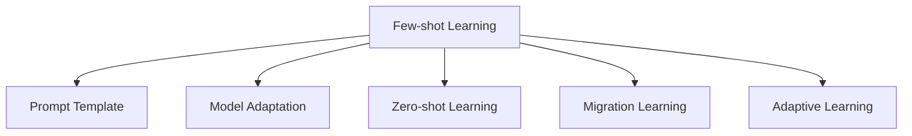

                 

# 自然语言处理中的few-shot学习技术

> 关键词：few-shot学习, 自然语言处理, 提示模板, 文本生成, 零样本学习, 迁移学习, 自适应学习, 少样本学习

## 1. 背景介绍

### 1.1 问题由来
在自然语言处理（Natural Language Processing, NLP）领域，大语言模型（Large Language Models, LLMs）如BERT、GPT-3等已经取得了显著的进展，能够处理复杂的自然语言理解和生成任务。然而，大模型在处理特定领域或特定任务时，通常需要大量的标注数据进行微调，这不仅增加了数据收集和标注的成本，还限制了模型在不同领域和任务中的迁移能力。为了解决这个问题，few-shot学习技术应运而生。

few-shot学习是指在大模型上使用很少的数据（通常少于几十个样本）进行微调，使得模型能够在新任务上快速学习和适应。这种方法不仅减少了标注数据的需求，还提高了模型的泛化能力，可以应用于诸如文本分类、问答系统、机器翻译等诸多NLP任务。

### 1.2 问题核心关键点
few-shot学习技术的核心在于通过精心设计的提示模板（Prompt Template）和预训练模型的结合，利用模型对语言的理解能力，通过少量示例进行推理和生成。这种方法可以大幅降低对标注数据的需求，同时保持模型的泛化能力。

具体来说，few-shot学习的核心在于以下三个方面：
- 提示模板（Prompt）的设计：通过适当的提示模板，引导大语言模型在少量数据上进行推理。
- 模型适配（Model Adaptation）：通过微调顶层或特定层，使模型适配特定任务的需求。
- 少样本学习（Few-shot Learning）：利用模型对语言的理解能力，通过少量示例进行学习。

这些核心概念的组合使得few-shot学习成为大语言模型微调的重要方向，尤其在数据稀缺的情况下，该方法显示出显著的优势。

## 2. 核心概念与联系

### 2.1 核心概念概述

为更好地理解few-shot学习技术，本节将介绍几个密切相关的核心概念：

- **few-shot学习（Few-shot Learning）**：指在大模型上使用很少的数据进行微调，以适应特定任务的技术。通常用于标注数据稀缺的场景，可以通过少量示例实现快速学习。
- **提示模板（Prompt）**：在few-shot学习中，提示模板是指用于引导模型推理和生成的文本片段。通过精心设计的提示，可以更好地利用大模型的语言理解能力。
- **零样本学习（Zero-shot Learning）**：在few-shot学习中，零样本学习指的是模型在没有看到任何训练样本的情况下，仅凭任务描述就能进行推理和生成。
- **迁移学习（Transfer Learning）**：迁移学习是一种通过将知识从一个任务迁移到另一个相关任务中，以提高模型在新任务上的表现的技术。few-shot学习可以视为迁移学习的一种特殊形式，通过少量数据实现迁移。
- **自适应学习（Adaptive Learning）**：自适应学习是指模型根据当前数据和任务需求动态调整模型参数，以适应不同任务和数据分布的技术。

这些核心概念之间的逻辑关系可以通过以下Mermaid流程图来展示：



这个流程图展示了大语言模型few-shot学习的核心概念及其之间的关系：

1. Few-shot Learning通过提示模板和模型适配，在大模型上使用少量数据进行微调。
2. Prompt Template是few-shot学习的重要组成部分，用于引导模型推理和生成。
3. Zero-shot Learning是few-shot学习的一种特殊形式，用于无数据情况下的推理。
4. Migration Learning是大模型迁移学习的一种形式，通过few-shot学习实现任务间的知识迁移。
5. Adaptive Learning是一种动态调整模型参数的技术，使得模型能够自适应不同任务和数据分布。

这些概念共同构成了few-shot学习的方法论框架，使其能够在大规模语言模型上实现高效的数据利用和任务适配。

## 3. 核心算法原理 & 具体操作步骤

### 3.1 算法原理概述

few-shot学习技术的核心在于如何通过少量数据和大模型的语言理解能力，快速适应新任务。其主要原理是通过精心设计的提示模板，引导模型对少量示例进行推理和生成。这种技术的核心在于利用模型对语言的深刻理解，通过少量示例进行高效的迁移学习。

具体来说，few-shot学习的核心在于以下三个方面：
- 提示模板的设计：通过适当的提示模板，可以引导模型对少量示例进行推理，提高模型的泛化能力。
- 模型适配：通过微调顶层或特定层，使模型适应特定任务的需求。
- 少样本学习：利用模型对语言的理解能力，通过少量示例进行学习。

### 3.2 算法步骤详解

few-shot学习技术的实现通常包括以下几个关键步骤：

**Step 1: 准备预训练模型和数据集**
- 选择合适的预训练语言模型，如BERT、GPT等。
- 准备下游任务的数据集，划分为训练集、验证集和测试集。

**Step 2: 设计提示模板**
- 根据任务类型，设计适当的提示模板。例如，对于文本分类任务，可以将文本样本和标签作为提示模板的一部分。
- 对于文本生成任务，可以设计条件生成器，使用条件概率模型生成文本。

**Step 3: 添加任务适配层**
- 根据任务类型，在预训练模型顶层设计合适的输出层和损失函数。例如，对于分类任务，通常在顶层添加线性分类器和交叉熵损失函数。

**Step 4: 设置微调超参数**
- 选择合适的优化算法及其参数，如AdamW、SGD等，设置学习率、批大小、迭代轮数等。
- 设置正则化技术及强度，包括权重衰减、Dropout、Early Stopping等。
- 确定冻结预训练参数的策略，如仅微调顶层，或全部参数都参与微调。

**Step 5: 执行梯度训练**
- 将训练集数据分批次输入模型，前向传播计算损失函数。
- 反向传播计算参数梯度，根据设定的优化算法和学习率更新模型参数。
- 周期性在验证集上评估模型性能，根据性能指标决定是否触发Early Stopping。
- 重复上述步骤直到满足预设的迭代轮数或Early Stopping条件。

**Step 6: 测试和部署**
- 在测试集上评估微调后模型性能，对比微调前后的精度提升。
- 使用微调后的模型对新样本进行推理预测，集成到实际的应用系统中。

以上是few-shot学习技术的一般流程。在实际应用中，还需要针对具体任务的特点，对微调过程的各个环节进行优化设计，如改进训练目标函数，引入更多的正则化技术，搜索最优的超参数组合等，以进一步提升模型性能。

### 3.3 算法优缺点

few-shot学习技术的优点在于：
1. 降低标注成本：通过少量数据进行微调，大大减少了标注数据的需求，降低了数据收集和标注的成本。
2. 提高泛化能力：利用模型对语言的深刻理解，通过少量示例进行推理和生成，提高了模型的泛化能力。
3. 快速适应新任务：在标注数据稀缺的情况下，few-shot学习可以快速适应新任务，节省了大量时间。

同时，few-shot学习技术也存在一些局限性：
1. 依赖提示模板：提示模板的设计对模型的表现至关重要，设计不当可能导致性能下降。
2. 鲁棒性不足：few-shot学习在处理不同领域和不同数据分布的任务时，鲁棒性可能不足，需要进一步优化。
3. 过拟合风险：few-shot学习在处理少量数据时，容易过拟合，需要引入更多的正则化技术进行控制。
4. 数据多样性要求高：提示模板的设计需要考虑数据的多样性和代表性，否则可能无法覆盖任务中的所有情况。

尽管存在这些局限性，但就目前而言，few-shot学习技术仍是大语言模型微调的重要方向。未来相关研究的重点在于如何进一步优化提示模板设计，提高模型泛化能力和鲁棒性，同时兼顾可解释性和伦理安全性等因素。

### 3.4 算法应用领域

few-shot学习技术在NLP领域已经得到了广泛的应用，覆盖了几乎所有常见任务，例如：

- 文本分类：如情感分析、主题分类、意图识别等。通过微调使模型学习文本-标签映射。
- 命名实体识别：识别文本中的人名、地名、机构名等特定实体。通过微调使模型掌握实体边界和类型。
- 关系抽取：从文本中抽取实体之间的语义关系。通过微调使模型学习实体-关系三元组。
- 问答系统：对自然语言问题给出答案。将问题-答案对作为微调数据，训练模型学习匹配答案。
- 机器翻译：将源语言文本翻译成目标语言。通过微调使模型学习语言-语言映射。
- 文本摘要：将长文本压缩成简短摘要。将文章-摘要对作为微调数据，使模型学习抓取要点。
- 对话系统：使机器能够与人自然对话。将多轮对话历史作为上下文，微调模型进行回复生成。

除了上述这些经典任务外，few-shot学习技术也被创新性地应用到更多场景中，如可控文本生成、常识推理、代码生成、数据增强等，为NLP技术带来了全新的突破。随着预训练模型和few-shot方法的不断进步，相信NLP技术将在更广阔的应用领域大放异彩。

## 4. 数学模型和公式 & 详细讲解 & 举例说明

### 4.1 数学模型构建

本节将使用数学语言对few-shot学习技术进行更加严格的刻画。

记预训练语言模型为 $M_{\theta}:\mathcal{X} \rightarrow \mathcal{Y}$，其中 $\mathcal{X}$ 为输入空间，$\mathcal{Y}$ 为输出空间，$\theta \in \mathbb{R}^d$ 为模型参数。假设few-shot学习的任务为 $T$，训练集为 $D=\{(x_i,y_i)\}_{i=1}^N, x_i \in \mathcal{X}, y_i \in \mathcal{Y}$。

定义模型 $M_{\theta}$ 在数据样本 $(x,y)$ 上的损失函数为 $\ell(M_{\theta}(x),y)$，则在数据集 $D$ 上的经验风险为：

$$
\mathcal{L}(\theta) = \frac{1}{N} \sum_{i=1}^N \ell(M_{\theta}(x_i),y_i)
$$

few-shot学习的优化目标是最小化经验风险，即找到最优参数：

$$
\theta^* = \mathop{\arg\min}_{\theta} \mathcal{L}(\theta)
$$

在实践中，我们通常使用基于梯度的优化算法（如SGD、Adam等）来近似求解上述最优化问题。设 $\eta$ 为学习率，$\lambda$ 为正则化系数，则参数的更新公式为：

$$
\theta \leftarrow \theta - \eta \nabla_{\theta}\mathcal{L}(\theta) - \eta\lambda\theta
$$

其中 $\nabla_{\theta}\mathcal{L}(\theta)$ 为损失函数对参数 $\theta$ 的梯度，可通过反向传播算法高效计算。

### 4.2 公式推导过程

以下我们以文本分类任务为例，推导交叉熵损失函数及其梯度的计算公式。

假设模型 $M_{\theta}$ 在输入 $x$ 上的输出为 $\hat{y}=M_{\theta}(x) \in [0,1]$，表示样本属于正类的概率。真实标签 $y \in \{0,1\}$。则二分类交叉熵损失函数定义为：

$$
\ell(M_{\theta}(x),y) = -[y\log \hat{y} + (1-y)\log (1-\hat{y})]
$$

将其代入经验风险公式，得：

$$
\mathcal{L}(\theta) = -\frac{1}{N}\sum_{i=1}^N [y_i\log M_{\theta}(x_i)+(1-y_i)\log(1-M_{\theta}(x_i))]
$$

根据链式法则，损失函数对参数 $\theta_k$ 的梯度为：

$$
\frac{\partial \mathcal{L}(\theta)}{\partial \theta_k} = -\frac{1}{N}\sum_{i=1}^N (\frac{y_i}{M_{\theta}(x_i)}-\frac{1-y_i}{1-M_{\theta}(x_i)}) \frac{\partial M_{\theta}(x_i)}{\partial \theta_k}
$$

其中 $\frac{\partial M_{\theta}(x_i)}{\partial \theta_k}$ 可进一步递归展开，利用自动微分技术完成计算。

在得到损失函数的梯度后，即可带入参数更新公式，完成模型的迭代优化。重复上述过程直至收敛，最终得到适应下游任务的最优模型参数 $\theta^*$。

## 5. 项目实践：代码实例和详细解释说明

### 5.1 开发环境搭建

在进行few-shot学习实践前，我们需要准备好开发环境。以下是使用Python进行PyTorch开发的环境配置流程：

1. 安装Anaconda：从官网下载并安装Anaconda，用于创建独立的Python环境。

2. 创建并激活虚拟环境：
```bash
conda create -n pytorch-env python=3.8 
conda activate pytorch-env
```

3. 安装PyTorch：根据CUDA版本，从官网获取对应的安装命令。例如：
```bash
conda install pytorch torchvision torchaudio cudatoolkit=11.1 -c pytorch -c conda-forge
```

4. 安装Transformers库：
```bash
pip install transformers
```

5. 安装各类工具包：
```bash
pip install numpy pandas scikit-learn matplotlib tqdm jupyter notebook ipython
```

完成上述步骤后，即可在`pytorch-env`环境中开始few-shot学习实践。

### 5.2 源代码详细实现

下面我们以命名实体识别(NER)任务为例，给出使用Transformers库对BERT模型进行few-shot学习的PyTorch代码实现。

首先，定义NER任务的数据处理函数：

```python
from transformers import BertTokenizer
from torch.utils.data import Dataset
import torch

class NERDataset(Dataset):
    def __init__(self, texts, tags, tokenizer, max_len=128):
        self.texts = texts
        self.tags = tags
        self.tokenizer = tokenizer
        self.max_len = max_len
        
    def __len__(self):
        return len(self.texts)
    
    def __getitem__(self, item):
        text = self.texts[item]
        tags = self.tags[item]
        
        encoding = self.tokenizer(text, return_tensors='pt', max_length=self.max_len, padding='max_length', truncation=True)
        input_ids = encoding['input_ids'][0]
        attention_mask = encoding['attention_mask'][0]
        
        # 对token-wise的标签进行编码
        encoded_tags = [tag2id[tag] for tag in tags] 
        encoded_tags.extend([tag2id['O']] * (self.max_len - len(encoded_tags)))
        labels = torch.tensor(encoded_tags, dtype=torch.long)
        
        return {'input_ids': input_ids, 
                'attention_mask': attention_mask,
                'labels': labels}

# 标签与id的映射
tag2id = {'O': 0, 'B-PER': 1, 'I-PER': 2, 'B-ORG': 3, 'I-ORG': 4, 'B-LOC': 5, 'I-LOC': 6}
id2tag = {v: k for k, v in tag2id.items()}

# 创建dataset
tokenizer = BertTokenizer.from_pretrained('bert-base-cased')

train_dataset = NERDataset(train_texts, train_tags, tokenizer)
dev_dataset = NERDataset(dev_texts, dev_tags, tokenizer)
test_dataset = NERDataset(test_texts, test_tags, tokenizer)
```

然后，定义模型和优化器：

```python
from transformers import BertForTokenClassification, AdamW

model = BertForTokenClassification.from_pretrained('bert-base-cased', num_labels=len(tag2id))

optimizer = AdamW(model.parameters(), lr=2e-5)
```

接着，定义训练和评估函数：

```python
from torch.utils.data import DataLoader
from tqdm import tqdm
from sklearn.metrics import classification_report

device = torch.device('cuda') if torch.cuda.is_available() else torch.device('cpu')
model.to(device)

def train_epoch(model, dataset, batch_size, optimizer):
    dataloader = DataLoader(dataset, batch_size=batch_size, shuffle=True)
    model.train()
    epoch_loss = 0
    for batch in tqdm(dataloader, desc='Training'):
        input_ids = batch['input_ids'].to(device)
        attention_mask = batch['attention_mask'].to(device)
        labels = batch['labels'].to(device)
        model.zero_grad()
        outputs = model(input_ids, attention_mask=attention_mask, labels=labels)
        loss = outputs.loss
        epoch_loss += loss.item()
        loss.backward()
        optimizer.step()
    return epoch_loss / len(dataloader)

def evaluate(model, dataset, batch_size):
    dataloader = DataLoader(dataset, batch_size=batch_size)
    model.eval()
    preds, labels = [], []
    with torch.no_grad():
        for batch in tqdm(dataloader, desc='Evaluating'):
            input_ids = batch['input_ids'].to(device)
            attention_mask = batch['attention_mask'].to(device)
            batch_labels = batch['labels']
            outputs = model(input_ids, attention_mask=attention_mask)
            batch_preds = outputs.logits.argmax(dim=2).to('cpu').tolist()
            batch_labels = batch_labels.to('cpu').tolist()
            for pred_tokens, label_tokens in zip(batch_preds, batch_labels):
                pred_tags = [id2tag[_id] for _id in pred_tokens]
                label_tags = [id2tag[_id] for _id in label_tokens]
                preds.append(pred_tags[:len(label_tags)])
                labels.append(label_tags)
                
    print(classification_report(labels, preds))
```

最后，启动训练流程并在测试集上评估：

```python
epochs = 5
batch_size = 16

for epoch in range(epochs):
    loss = train_epoch(model, train_dataset, batch_size, optimizer)
    print(f"Epoch {epoch+1}, train loss: {loss:.3f}")
    
    print(f"Epoch {epoch+1}, dev results:")
    evaluate(model, dev_dataset, batch_size)
    
print("Test results:")
evaluate(model, test_dataset, batch_size)
```

以上就是使用PyTorch对BERT进行命名实体识别任务few-shot学习的完整代码实现。可以看到，得益于Transformers库的强大封装，我们可以用相对简洁的代码完成BERT模型的加载和微调。

### 5.3 代码解读与分析

让我们再详细解读一下关键代码的实现细节：

**NERDataset类**：
- `__init__`方法：初始化文本、标签、分词器等关键组件。
- `__len__`方法：返回数据集的样本数量。
- `__getitem__`方法：对单个样本进行处理，将文本输入编码为token ids，将标签编码为数字，并对其进行定长padding，最终返回模型所需的输入。

**tag2id和id2tag字典**：
- 定义了标签与数字id之间的映射关系，用于将token-wise的预测结果解码回真实的标签。

**训练和评估函数**：
- 使用PyTorch的DataLoader对数据集进行批次化加载，供模型训练和推理使用。
- 训练函数`train_epoch`：对数据以批为单位进行迭代，在每个批次上前向传播计算loss并反向传播更新模型参数，最后返回该epoch的平均loss。
- 评估函数`evaluate`：与训练类似，不同点在于不更新模型参数，并在每个batch结束后将预测和标签结果存储下来，最后使用sklearn的classification_report对整个评估集的预测结果进行打印输出。

**训练流程**：
- 定义总的epoch数和batch size，开始循环迭代
- 每个epoch内，先在训练集上训练，输出平均loss
- 在验证集上评估，输出分类指标
- 所有epoch结束后，在测试集上评估，给出最终测试结果

可以看到，PyTorch配合Transformers库使得BERT模型的few-shot学习代码实现变得简洁高效。开发者可以将更多精力放在数据处理、模型改进等高层逻辑上，而不必过多关注底层的实现细节。

当然，工业级的系统实现还需考虑更多因素，如模型的保存和部署、超参数的自动搜索、更灵活的任务适配层等。但核心的few-shot学习范式基本与此类似。

## 6. 实际应用场景
### 6.1 智能客服系统

基于few-shot学习技术，智能客服系统可以实现快速适应新问题和语境的能力。传统客服系统通常需要大量人工标注数据进行微调，而few-shot学习可以通过少量数据实现模型适配，显著降低数据收集和标注成本。

在技术实现上，可以收集企业内部的历史客服对话记录，将问题和最佳答复构建成监督数据，在此基础上对预训练对话模型进行few-shot学习。微调后的对话模型能够自动理解用户意图，匹配最合适的答案模板进行回复。对于客户提出的新问题，还可以接入检索系统实时搜索相关内容，动态组织生成回答。如此构建的智能客服系统，能大幅提升客户咨询体验和问题解决效率。

### 6.2 金融舆情监测

金融机构需要实时监测市场舆论动向，以便及时应对负面信息传播，规避金融风险。传统的人工监测方式成本高、效率低，难以应对网络时代海量信息爆发的挑战。基于few-shot学习技术的文本分类和情感分析技术，为金融舆情监测提供了新的解决方案。

具体而言，可以收集金融领域相关的新闻、报道、评论等文本数据，并对其进行主题标注和情感标注。在此基础上对预训练语言模型进行few-shot学习，使其能够自动判断文本属于何种主题，情感倾向是正面、中性还是负面。将few-shot学习后的模型应用到实时抓取的网络文本数据，就能够自动监测不同主题下的情感变化趋势，一旦发现负面信息激增等异常情况，系统便会自动预警，帮助金融机构快速应对潜在风险。

### 6.3 个性化推荐系统

当前的推荐系统往往只依赖用户的历史行为数据进行物品推荐，无法深入理解用户的真实兴趣偏好。基于few-shot学习技术的个性化推荐系统可以更好地挖掘用户行为背后的语义信息，从而提供更精准、多样的推荐内容。

在实践中，可以收集用户浏览、点击、评论、分享等行为数据，提取和用户交互的物品标题、描述、标签等文本内容。将文本内容作为模型输入，用户的后续行为（如是否点击、购买等）作为监督信号，在此基础上进行few-shot学习。few-shot学习后的模型能够从文本内容中准确把握用户的兴趣点。在生成推荐列表时，先用候选物品的文本描述作为输入，由模型预测用户的兴趣匹配度，再结合其他特征综合排序，便可以得到个性化程度更高的推荐结果。

### 6.4 未来应用展望

随着few-shot学习技术和大语言模型的不断发展，基于few-shot学习范式的应用场景将更加广泛。未来，few-shot学习技术将在更多领域得到应用，为传统行业带来变革性影响。

在智慧医疗领域，基于few-shot学习的医疗问答、病历分析、药物研发等应用将提升医疗服务的智能化水平，辅助医生诊疗，加速新药开发进程。

在智能教育领域，few-shot学习技术可应用于作业批改、学情分析、知识推荐等方面，因材施教，促进教育公平，提高教学质量。

在智慧城市治理中，few-shot学习技术可应用于城市事件监测、舆情分析、应急指挥等环节，提高城市管理的自动化和智能化水平，构建更安全、高效的未来城市。

此外，在企业生产、社会治理、文娱传媒等众多领域，基于few-shot学习技术的人工智能应用也将不断涌现，为经济社会发展注入新的动力。相信随着技术的日益成熟，few-shot学习技术将成为人工智能落地应用的重要范式，推动人工智能技术向更广阔的领域加速渗透。

## 7. 工具和资源推荐
### 7.1 学习资源推荐

为了帮助开发者系统掌握few-shot学习理论基础和实践技巧，这里推荐一些优质的学习资源：

1. 《Transformers从原理到实践》系列博文：由大模型技术专家撰写，深入浅出地介绍了Transformer原理、BERT模型、few-shot学习等前沿话题。

2. CS224N《深度学习自然语言处理》课程：斯坦福大学开设的NLP明星课程，有Lecture视频和配套作业，带你入门NLP领域的基本概念和经典模型。

3. 《Natural Language Processing with Transformers》书籍：Transformers库的作者所著，全面介绍了如何使用Transformers库进行NLP任务开发，包括few-shot学习在内的诸多范式。

4. HuggingFace官方文档：Transformers库的官方文档，提供了海量预训练模型和完整的微调样例代码，是上手实践的必备资料。

5. CLUE开源项目：中文语言理解测评基准，涵盖大量不同类型的中文NLP数据集，并提供了基于few-shot学习的baseline模型，助力中文NLP技术发展。

通过对这些资源的学习实践，相信你一定能够快速掌握few-shot学习的精髓，并用于解决实际的NLP问题。
###  7.2 开发工具推荐

高效的开发离不开优秀的工具支持。以下是几款用于few-shot学习开发的常用工具：

1. PyTorch：基于Python的开源深度学习框架，灵活动态的计算图，适合快速迭代研究。大部分预训练语言模型都有PyTorch版本的实现。

2. TensorFlow：由Google主导开发的开源深度学习框架，生产部署方便，适合大规模工程应用。同样有丰富的预训练语言模型资源。

3. Transformers库：HuggingFace开发的NLP工具库，集成了众多SOTA语言模型，支持PyTorch和TensorFlow，是进行few-shot学习任务的开发的利器。

4. Weights & Biases：模型训练的实验跟踪工具，可以记录和可视化模型训练过程中的各项指标，方便对比和调优。与主流深度学习框架无缝集成。

5. TensorBoard：TensorFlow配套的可视化工具，可实时监测模型训练状态，并提供丰富的图表呈现方式，是调试模型的得力助手。

6. Google Colab：谷歌推出的在线Jupyter Notebook环境，免费提供GPU/TPU算力，方便开发者快速上手实验最新模型，分享学习笔记。

合理利用这些工具，可以显著提升few-shot学习任务的开发效率，加快创新迭代的步伐。

### 7.3 相关论文推荐

few-shot学习技术的发展源于学界的持续研究。以下是几篇奠基性的相关论文，推荐阅读：

1. Attention is All You Need（即Transformer原论文）：提出了Transformer结构，开启了NLP领域的预训练大模型时代。

2. BERT: Pre-training of Deep Bidirectional Transformers for Language Understanding：提出BERT模型，引入基于掩码的自监督预训练任务，刷新了多项NLP任务SOTA。

3. Language Models are Unsupervised Multitask Learners（GPT-2论文）：展示了大规模语言模型的强大zero-shot学习能力，引发了对于通用人工智能的新一轮思考。

4. Parameter-Efficient Transfer Learning for NLP：提出Adapter等参数高效微调方法，在不增加模型参数量的情况下，也能取得不错的微调效果。

5. Zero-Shot Question Answering by Pre-Training Conditional Generative Models：提出使用条件生成模型进行零样本问答的方法，展示了few-shot学习在大规模语言模型上的潜力。

6. Few-shot learning of sentence representation via unsupervised clustering：提出使用聚类方法进行few-shot句子表示学习的方法，展示了聚类技术在few-shot学习中的应用。

这些论文代表了大语言模型few-shot学习技术的发展脉络。通过学习这些前沿成果，可以帮助研究者把握学科前进方向，激发更多的创新灵感。

## 8. 总结：未来发展趋势与挑战

### 8.1 总结

本文对基于few-shot学习的自然语言处理技术进行了全面系统的介绍。首先阐述了few-shot学习技术的背景和意义，明确了在标注数据稀缺情况下，few-shot学习技术的重要价值。其次，从原理到实践，详细讲解了few-shot学习的数学原理和关键步骤，给出了few-shot学习任务开发的完整代码实例。同时，本文还广泛探讨了few-shot学习技术在智能客服、金融舆情、个性化推荐等多个行业领域的应用前景，展示了few-shot学习技术的巨大潜力。最后，本文精选了few-shot学习的各类学习资源，力求为读者提供全方位的技术指引。

通过本文的系统梳理，可以看到，基于few-shot学习的自然语言处理技术正在成为NLP领域的重要范式，极大地拓展了预训练语言模型的应用边界，催生了更多的落地场景。受益于大规模语料的预训练，few-shot学习在大模型上实现高效的数据利用和任务适配，显著降低了标注数据的需求，提高了模型的泛化能力，推动了NLP技术的产业化进程。未来，伴随few-shot学习方法的不断进步，相信NLP技术将在更广阔的应用领域大放异彩，深刻影响人类的生产生活方式。

### 8.2 未来发展趋势

展望未来，few-shot学习技术将呈现以下几个发展趋势：

1. 模型规模持续增大。随着算力成本的下降和数据规模的扩张，预训练语言模型的参数量还将持续增长。超大模型蕴含的丰富语言知识，有望支撑更加复杂多变的下游任务。

2. 微调方法日趋多样。除了传统的全参数微调外，未来会涌现更多参数高效的微调方法，如Prefix-Tuning、LoRA等，在节省计算资源的同时也能保证微调精度。

3. 持续学习成为常态。随着数据分布的不断变化，few-shot学习模型也需要持续学习新知识以保持性能。如何在不遗忘原有知识的同时，高效吸收新样本信息，将成为重要的研究课题。

4. 标注样本需求降低。受启发于提示学习(Prompt-based Learning)的思路，未来的few-shot学习方法将更好地利用大模型的语言理解能力，通过更加巧妙的任务描述，在更少的标注样本上也能实现理想的微调效果。

5. 数据多样性要求高。few-shot学习技术的设计需要考虑数据的多样性和代表性，否则可能无法覆盖任务中的所有情况。

尽管存在这些局限性，但就目前而言，few-shot学习技术仍是大语言模型微调的重要方向。未来相关研究的重点在于如何进一步优化提示模板设计，提高模型泛化能力和鲁棒性，同时兼顾可解释性和伦理安全性等因素。

### 8.3 面临的挑战

尽管few-shot学习技术已经取得了瞩目成就，但在迈向更加智能化、普适化应用的过程中，它仍面临着诸多挑战：

1. 标注成本瓶颈。虽然few-shot学习大大降低了标注数据的需求，但对于长尾应用场景，难以获得充足的高质量标注数据，成为制约few-shot学习性能的瓶颈。如何进一步降低few-shot学习对标注样本的依赖，将是一大难题。

2. 模型鲁棒性不足。few-shot学习在处理不同领域和不同数据分布的任务时，鲁棒性可能不足，需要进一步优化。

3. 过拟合风险。few-shot学习在处理少量数据时，容易过拟合，需要引入更多的正则化技术进行控制。

4. 数据多样性要求高。few-shot学习技术的设计需要考虑数据的多样性和代表性，否则可能无法覆盖任务中的所有情况。

尽管存在这些挑战，但few-shot学习技术已经展示了其强大的生命力和应用潜力，未来必将在大规模语言模型微调中发挥越来越重要的作用。

### 8.4 研究展望

面对few-shot学习技术所面临的挑战，未来的研究需要在以下几个方面寻求新的突破：

1. 探索无监督和半监督few-shot学习方法。摆脱对大规模标注数据的依赖，利用自监督学习、主动学习等无监督和半监督范式，最大限度利用非结构化数据，实现更加灵活高效的few-shot学习。

2. 研究参数高效和计算高效的few-shot范式。开发更加参数高效的few-shot方法，在固定大部分预训练参数的同时，只更新极少量的任务相关参数。同时优化few-shot模型的计算图，减少前向传播和反向传播的资源消耗，实现更加轻量级、实时性的部署。

3. 引入更多先验知识。将符号化的先验知识，如知识图谱、逻辑规则等，与神经网络模型进行巧妙融合，引导few-shot学习过程学习更准确、合理的语言模型。同时加强不同模态数据的整合，实现视觉、语音等多模态信息与文本信息的协同建模。

4. 结合因果分析和博弈论工具。将因果分析方法引入few-shot模型，识别出模型决策的关键特征，增强输出解释的因果性和逻辑性。借助博弈论工具刻画人机交互过程，主动探索并规避模型的脆弱点，提高系统稳定性。

5. 纳入伦理道德约束。在模型训练目标中引入伦理导向的评估指标，过滤和惩罚有偏见、有害的输出倾向。同时加强人工干预和审核，建立模型行为的监管机制，确保输出符合人类价值观和伦理道德。

这些研究方向的探索，必将引领few-shot学习技术迈向更高的台阶，为构建安全、可靠、可解释、可控的智能系统铺平道路。面向未来，few-shot学习技术还需要与其他人工智能技术进行更深入的融合，如知识表示、因果推理、强化学习等，多路径协同发力，共同推动自然语言理解和智能交互系统的进步。只有勇于创新、敢于突破，才能不断拓展few-shot学习技术的边界，让智能技术更好地造福人类社会。

## 9. 附录：常见问题与解答

**Q1：few-shot学习与迁移学习有何不同？**

A: few-shot学习和迁移学习都是在大规模预训练语言模型的基础上进行微调，但它们的微调数据量有显著差异。few-shot学习通常使用很少的数据进行微调，而迁移学习使用较多的数据。few-shot学习适用于标注数据稀缺的情况，而迁移学习则适用于有大量标注数据的情况。

**Q2：如何设计高效的few-shot学习提示模板？**

A: 设计高效的few-shot学习提示模板需要考虑以下几个方面：
1. 任务描述清晰：提示模板需要简洁明了地描述任务，使模型能够快速理解任务需求。
2. 提示结构一致：提示模板的结构需要与训练数据保持一致，确保模型能够准确推理。
3. 任务类型适配：不同类型的任务需要设计不同的提示模板，例如，分类任务和生成任务的提示模板设计有所不同。

**Q3：few-shot学习中的超参数如何调优？**

A: few-shot学习中的超参数调优与普通微调类似，可以采用网格搜索、随机搜索等方法进行调优。常用的超参数包括学习率、批量大小、迭代轮数、正则化参数等。同时，需要关注模型的训练速度和收敛性能，选择合适的超参数组合。

**Q4：few-shot学习在实际应用中需要注意哪些问题？**

A: few-shot学习在实际应用中需要注意以下几个问题：
1. 数据多样性：提示模板的设计需要考虑数据的多样性，确保模型能够处理各种不同的文本输入。
2. 标注数据稀缺：标注数据的稀缺性可能导致模型泛化能力不足，需要考虑数据增强和正则化技术。
3. 模型鲁棒性：few-shot学习模型需要具备较强的鲁棒性，能够适应不同领域和数据分布的任务。
4. 模型可解释性：few-shot学习模型需要具备较好的可解释性，以便于解释模型的决策过程。

通过回答这些问题，希望能够帮助你更好地理解和应用few-shot学习技术。

---

作者：禅与计算机程序设计艺术 / Zen and the Art of Computer Programming

