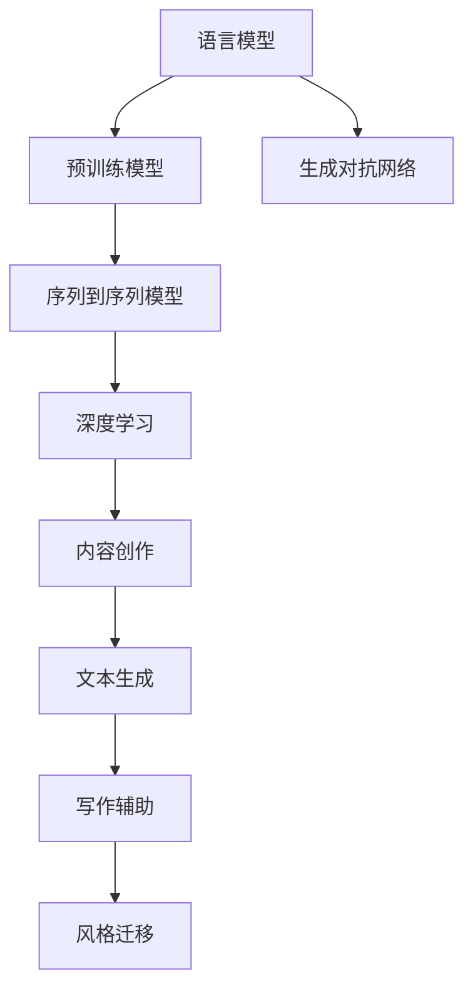

                 

# 自然语言生成在内容创作中的应用：AI辅助写作

> 关键词：自然语言生成,语言模型,预训练模型,生成对抗网络,序列到序列模型,深度学习,内容创作,文本生成,写作辅助,风格迁移

## 1. 背景介绍

### 1.1 问题由来
近年来，随着深度学习技术的飞速发展，自然语言生成(Natural Language Generation, NLG)技术在内容创作、智能写作、机器翻译、文本摘要等多个领域取得了显著进展。自然语言生成技术可以将结构化数据转化为自然语言文本，甚至能够生成原创性文本，极大地提升了信息处理和内容创作的效率和质量。

人工智能(AI)技术的进步，特别是基于深度学习的自然语言处理模型，使得自然语言生成应用变得更加广泛和高效。例如，GPT-3等大型预训练语言模型，已经能够生成高质量的文本，应用于新闻报道、文学创作、广告文案等多种内容创作场景。

然而，尽管自然语言生成技术已经取得了诸多成就，但仍面临着一些挑战：如生成文本的连贯性、多样性、可解释性等。为了应对这些挑战，研究人员提出了多种技术手段，如基于Transformer的生成模型、生成对抗网络(GANs)、序列到序列(Sequence-to-Sequence, Seq2Seq)模型等，不断推动自然语言生成技术向更加智能化、可控化方向发展。

### 1.2 问题核心关键点
自然语言生成技术的研究核心在于如何构建高效、可控、可解释的文本生成模型。主要包括以下几个关键点：
- **数据准备**：构建高质量的数据集，为模型训练提供数据支持。
- **模型选择与设计**：选择合适的生成模型，并对其进行优化设计。
- **生成质量控制**：确保生成文本的质量，包括流畅性、连贯性、逻辑性、风格一致性等。
- **应用场景适配**：针对不同的内容创作场景，设计专门的生成策略和算法。

自然语言生成技术的应用场景非常广泛，包括但不限于：

- **智能写作**：辅助作家创作小说、新闻报道等文学作品。
- **广告文案**：生成吸引眼球的广告语和宣传文案。
- **内容摘要**：自动生成新闻报道、会议记录、书籍摘要等文本。
- **智能翻译**：将一种语言翻译成另一种语言，并提供语义准确的文本。
- **内容推荐**：根据用户兴趣推荐个性化文本内容。
- **对话系统**：构建能够进行自然对话的智能客服、聊天机器人等。

自然语言生成技术不仅能够提升内容创作的效率，还可以开拓新的创作思路，赋予内容更多创意和个性化。然而，面对海量用户数据和复杂的自然语言规律，自然语言生成技术仍需不断探索和优化。

## 2. 核心概念与联系

### 2.1 核心概念概述

自然语言生成技术的核心在于构建能够理解语言结构和语义意义的模型，并通过生成算法将结构化信息转化为自然语言文本。以下是自然语言生成涉及的几个关键概念：

- **语言模型**：用于描述自然语言序列的概率模型，能够预测给定文本序列的可能性。
- **预训练模型**：通过大规模无标签文本数据进行预训练，学习语言的通用表示和语言规律。
- **生成对抗网络**：通过两个神经网络(生成器和判别器)相互对抗训练，生成逼真的文本内容。
- **序列到序列模型**：通过编码器-解码器框架，将输入序列转化为输出序列，广泛应用于文本翻译、摘要生成等任务。
- **深度学习**：利用多层神经网络进行模型训练，能够学习复杂的非线性映射关系，适用于大规模数据和复杂结构的任务。
- **内容创作**：使用自然语言生成技术，将结构化信息转化为富有表现力和创造力的文本内容。
- **文本生成**：使用自然语言生成技术，生成新的文本信息，包括自动创作、信息补全等。
- **写作辅助**：通过自然语言生成技术，辅助作家和创作者进行文本创作，提升创作效率和质量。
- **风格迁移**：使用自然语言生成技术，将文本内容从一个风格转换为另一个风格，实现文本的多样性和个性化。

这些核心概念通过不同的方法和技术手段相互连接，共同构建了自然语言生成技术的框架。以下是一个简单的Mermaid流程图，展示了这些概念之间的联系：



### 2.2 核心概念原理和架构

#### 2.2.1 语言模型
语言模型是自然语言生成技术的基础，用于描述文本序列的概率分布。语言模型的基本思想是，给定前缀，预测下一个单词的概率。其架构通常包括以下几个部分：

- **输入层**：接收输入的文本序列。
- **编码层**：将输入序列转换为向量表示，捕捉语言结构和语义信息。
- **预测层**：根据编码层的输出，预测下一个单词的概率分布。

常用的语言模型包括：

- **n-gram模型**：基于统计语言模型，利用前n个单词预测下一个单词的概率。
- **循环神经网络(RNN)**：通过循环结构，利用历史信息预测下一个单词的概率。
- **卷积神经网络(CNN)**：通过卷积操作，提取文本序列的局部特征。
- **长短期记忆网络(LSTM)**：通过门控机制，记忆并利用上下文信息进行预测。
- **门控循环单元(GRU)**：与LSTM类似，但参数更少，训练速度更快。
- **Transformer模型**：通过自注意力机制，捕捉文本序列的全局依赖关系。

#### 2.2.2 预训练模型
预训练模型是通过大规模无标签文本数据进行训练，学习语言的通用表示和语言规律的模型。常用的预训练模型包括：

- **BERT模型**：通过掩码语言模型和下一句预测任务，学习上下文相关的语义信息。
- **GPT模型**：通过自回归生成任务，学习语言的生成能力。
- **T5模型**：通过文本补全任务，学习语言的生成和理解能力。
- **XLNet模型**：通过 permutation language modeling 技术，学习语言的全局依赖关系。
- **RoBERTa模型**：通过动态掩码和随机采样等技术，提高预训练的效率和性能。

预训练模型通常采用Transformer架构，通过多层自注意力机制和前馈神经网络进行计算。预训练模型在文本生成、语言理解、信息抽取等多个任务上表现出色，已成为自然语言生成技术的重要组成部分。

#### 2.2.3 生成对抗网络
生成对抗网络（Generative Adversarial Networks, GANs）由生成器和判别器两个部分组成，通过对抗训练生成逼真的文本内容。生成器的目标是生成尽可能真实的文本，判别器的目标是区分生成文本和真实文本。

GANs的架构通常包括以下几个部分：

- **生成器**：将随机噪声转换为文本序列。
- **判别器**：判断文本序列是生成还是真实的。
- **对抗训练**：通过交替优化生成器和判别器，生成逼真的文本内容。

GANs的优势在于可以生成多样化的文本内容，甚至可以生成文本中的噪声和异常情况。然而，GANs生成文本的连贯性和逻辑性较难控制，生成文本质量不稳定。

#### 2.2.4 序列到序列模型
序列到序列模型通过编码器-解码器框架，将输入序列转化为输出序列，广泛应用于文本翻译、摘要生成、对话系统等任务。序列到序列模型通常包括以下几个部分：

- **编码器**：将输入序列转化为向量表示，捕捉输入序列的语义信息。
- **解码器**：根据编码器的输出，生成输出序列，捕捉输出序列的语义信息。
- **注意力机制**：利用注意力机制，加强解码器对输入序列中重要信息的关注。

常用的序列到序列模型包括：

- **Seq2Seq模型**：通过循环神经网络进行计算，捕捉序列信息。
- **Transformer模型**：通过自注意力机制，捕捉序列的全局依赖关系。
- **BERT序列到序列模型**：结合BERT模型和Seq2Seq模型，捕捉序列的上下文相关性。

#### 2.2.5 深度学习
深度学习利用多层神经网络进行模型训练，能够学习复杂的非线性映射关系。深度学习在自然语言生成技术中的应用包括：

- **神经网络**：通过多层神经网络进行计算，捕捉文本序列的结构和语义信息。
- **卷积神经网络**：通过卷积操作，提取文本序列的局部特征。
- **循环神经网络**：通过循环结构，利用历史信息进行预测。
- **长短期记忆网络**：通过门控机制，记忆并利用上下文信息进行预测。
- **门控循环单元**：与LSTM类似，但参数更少，训练速度更快。

深度学习在自然语言生成技术中的应用非常广泛，通过多层网络的堆叠，能够捕捉复杂的语言规律和语义信息。

#### 2.2.6 内容创作
内容创作是自然语言生成技术的一个重要应用，通过将结构化信息转化为自然语言文本，辅助作家和创作者进行文本创作。内容创作的应用场景包括：

- **小说创作**：生成情节、人物、对话等文本内容，辅助作家进行创作。
- **新闻报道**：生成新闻标题、摘要、导语等文本内容，辅助记者进行报道。
- **广告文案**：生成吸引眼球的广告语和宣传文案，辅助企业进行市场营销。
- **博客文章**：生成具有丰富内容的博客文章，辅助博主进行内容创作。

#### 2.2.7 文本生成
文本生成是自然语言生成技术的重要组成部分，通过生成自然语言文本，实现信息补全、内容补缺等功能。文本生成的应用场景包括：

- **信息补全**：根据用户输入的关键词，生成完整的文本内容。
- **内容补缺**：根据文本的上下文，生成缺失的文本内容。
- **摘要生成**：生成文本的摘要，帮助用户快速理解文本内容。
- **对话生成**：生成对话系统中的回复，实现自然对话。
- **问答系统**：根据用户的问题，生成回答，提供即时的信息服务。

#### 2.2.8 写作辅助
写作辅助是自然语言生成技术的一个重要应用，通过辅助作家和创作者进行文本创作，提升创作效率和质量。写作辅助的应用场景包括：

- **大纲生成**：根据用户的需求，生成文章的大纲结构。
- **草稿生成**：生成文章的草稿，帮助创作者进行初步构思。
- **自动校对**：生成文章的校对建议，帮助创作者修改文本。
- **风格变换**：将文本从一种风格转换为另一种风格，实现文本的多样性和个性化。

#### 2.2.9 风格迁移
风格迁移是自然语言生成技术的重要研究方向，通过将文本从一个风格转换为另一个风格，实现文本的多样性和个性化。风格迁移的应用场景包括：

- **文学创作**：将现代文本转换为古典风格，增强文本的文学性和艺术性。
- **新闻报道**：将报道风格转换为评论风格，提供更深入的分析与见解。
- **广告文案**：将广告风格转换为幽默风格，增强广告的趣味性和吸引力。
- **法律文书**：将法律语言转换为更易懂的风格，提高文本的可读性。

这些核心概念通过不同的技术和方法相互联系，共同构成了自然语言生成技术的框架。以下是一个简单的Mermaid流程图，展示了这些概念之间的联系：


## 3. 核心算法原理 & 具体操作步骤

### 3.1 算法原理概述
自然语言生成算法主要分为基于统计的生成方法、基于规则的生成方法和基于深度学习的生成方法。

基于统计的生成方法通常基于n-gram模型、隐马尔可夫模型等，通过统计语言模型对文本序列进行建模，生成新的文本内容。其优点是简单、高效，但缺点是缺乏对语言规律的深刻理解，生成文本质量不稳定。

基于规则的生成方法通常通过模板、规则等约束，生成符合特定格式的文本内容。其优点是生成的文本质量高，但缺点是灵活性不足，难以应对复杂的文本生成任务。

基于深度学习的生成方法利用多层神经网络进行计算，通过学习复杂的非线性映射关系，生成高质量的文本内容。其优点是生成文本质量高、灵活性高，但缺点是需要大量的标注数据和计算资源。

常用的自然语言生成算法包括：

- **基于n-gram的语言模型**：通过统计语言模型，生成符合语法规则的文本。
- **基于RNN的语言模型**：通过循环神经网络，利用历史信息生成文本。
- **基于CNN的语言模型**：通过卷积神经网络，提取文本序列的局部特征。
- **基于LSTM的语言模型**：通过长短期记忆网络，记忆并利用上下文信息进行预测。
- **基于GRU的语言模型**：与LSTM类似，但参数更少，训练速度更快。
- **基于Transformer的语言模型**：通过自注意力机制，捕捉文本序列的全局依赖关系。

### 3.2 算法步骤详解

#### 3.2.1 基于n-gram的语言模型生成算法

基于n-gram的语言模型生成算法步骤如下：

1. **构建n-gram模型**：统计语料库中每个单词或n-gram的频率，构建n-gram模型。
2. **预测下一个单词**：根据前n个单词，预测下一个单词的概率分布。
3. **生成文本**：根据预测的概率分布，选择下一个单词，重复步骤2，生成文本。

#### 3.2.2 基于RNN的语言模型生成算法

基于RNN的语言模型生成算法步骤如下：

1. **初始化隐藏状态**：将文本序列的第一个单词作为输入，初始化RNN的隐藏状态。
2. **循环计算隐藏状态**：根据当前输入和上一个隐藏状态，计算下一个隐藏状态。
3. **预测下一个单词**：根据隐藏状态和当前输入，预测下一个单词的概率分布。
4. **生成文本**：根据预测的概率分布，选择下一个单词，重复步骤2和步骤3，生成文本。

#### 3.2.3 基于CNN的语言模型生成算法

基于CNN的语言模型生成算法步骤如下：

1. **构建CNN模型**：通过卷积操作，提取文本序列的局部特征。
2. **编码文本序列**：将提取的特征进行池化，生成文本序列的向量表示。
3. **预测下一个单词**：根据向量表示，预测下一个单词的概率分布。
4. **生成文本**：根据预测的概率分布，选择下一个单词，重复步骤2和步骤3，生成文本。

#### 3.2.4 基于LSTM的语言模型生成算法

基于LSTM的语言模型生成算法步骤如下：

1. **初始化隐藏状态**：将文本序列的第一个单词作为输入，初始化LSTM的隐藏状态。
2. **循环计算隐藏状态**：根据当前输入和上一个隐藏状态，计算下一个隐藏状态。
3. **预测下一个单词**：根据隐藏状态和当前输入，预测下一个单词的概率分布。
4. **生成文本**：根据预测的概率分布，选择下一个单词，重复步骤2和步骤3，生成文本。

#### 3.2.5 基于GRU的语言模型生成算法

基于GRU的语言模型生成算法步骤如下：

1. **初始化隐藏状态**：将文本序列的第一个单词作为输入，初始化GRU的隐藏状态。
2. **循环计算隐藏状态**：根据当前输入和上一个隐藏状态，计算下一个隐藏状态。
3. **预测下一个单词**：根据隐藏状态和当前输入，预测下一个单词的概率分布。
4. **生成文本**：根据预测的概率分布，选择下一个单词，重复步骤2和步骤3，生成文本。

#### 3.2.6 基于Transformer的语言模型生成算法

基于Transformer的语言模型生成算法步骤如下：

1. **编码文本序列**：将输入文本序列转化为Transformer的编码表示。
2. **生成文本**：利用Transformer的解码器，根据编码表示生成文本。

### 3.3 算法优缺点

基于深度学习的自然语言生成算法具有以下优点：

- **生成文本质量高**：能够生成高质量、连贯性好的文本内容。
- **生成文本多样化**：能够生成多种风格的文本内容。
- **灵活性强**：能够适应多种文本生成任务。
- **可解释性强**：能够通过训练数据和模型参数解释生成文本的原因。

基于深度学习的自然语言生成算法也存在以下缺点：

- **需要大量数据**：需要大量的标注数据进行训练，数据获取成本高。
- **计算资源需求高**：需要高性能的计算设备进行模型训练和推理，资源消耗大。
- **生成文本可控性差**：生成文本的连贯性和逻辑性较难控制，生成的文本可能与输入不相关。
- **生成文本可解释性差**：生成文本的生成过程复杂，难以解释生成文本的原因。

### 3.4 算法应用领域

自然语言生成技术在多个领域得到了广泛应用，以下是几个主要的应用领域：

#### 3.4.1 智能写作

智能写作是自然语言生成技术的一个重要应用，通过辅助作家和创作者进行文本创作，提升创作效率和质量。智能写作的应用场景包括：

- **小说创作**：生成情节、人物、对话等文本内容，辅助作家进行创作。
- **新闻报道**：生成新闻标题、摘要、导语等文本内容，辅助记者进行报道。
- **广告文案**：生成吸引眼球的广告语和宣传文案，辅助企业进行市场营销。
- **博客文章**：生成具有丰富内容的博客文章，辅助博主进行内容创作。

#### 3.4.2 广告文案

广告文案是自然语言生成技术的一个重要应用，通过生成吸引眼球的广告语和宣传文案，提高广告的吸引力和效果。广告文案的应用场景包括：

- **社交媒体**：生成有吸引力的广告语和宣传文案，增加社交媒体的关注度和互动率。
- **电商平台**：生成有吸引力的产品介绍和广告语，提高电商平台的销售量和用户满意度。
- **电视广告**：生成有吸引力的广告语和宣传文案，提高电视广告的吸引力和效果。

#### 3.4.3 内容摘要

内容摘要是自然语言生成技术的一个重要应用，通过自动生成文本的摘要，帮助用户快速理解文本内容。内容摘要的应用场景包括：

- **新闻报道**：生成新闻报道的摘要，帮助用户快速理解新闻内容。
- **学术论文**：生成学术论文的摘要，帮助研究人员快速浏览和理解论文内容。
- **书籍摘要**：生成书籍的摘要，帮助读者快速了解书籍内容和重点。

#### 3.4.4 机器翻译

机器翻译是自然语言生成技术的一个重要应用，通过将一种语言翻译成另一种语言，提供语义准确的文本。机器翻译的应用场景包括：

- **跨语言交流**：辅助跨语言交流，帮助不同语言的用户进行沟通和协作。
- **文本翻译**：将文本从一种语言翻译成另一种语言，提高文本翻译的准确性和效率。
- **字幕翻译**：将视频或音频中的文本进行翻译，提高媒体内容的可读性和可理解性。

#### 3.4.5 内容推荐

内容推荐是自然语言生成技术的一个重要应用，通过推荐个性化文本内容，提高用户的满意度和黏性。内容推荐的应用场景包括：

- **新闻推荐**：根据用户的兴趣和行为，推荐相关的新闻报道。
- **书籍推荐**：根据用户的兴趣和行为，推荐相关的书籍。
- **电影推荐**：根据用户的兴趣和行为，推荐相关的电影和电视剧。

#### 3.4.6 对话系统

对话系统是自然语言生成技术的一个重要应用，通过构建能够进行自然对话的智能客服、聊天机器人等，提供即时的信息服务。对话系统的应用场景包括：

- **智能客服**：构建能够进行自然对话的智能客服，辅助企业进行客户服务。
- **聊天机器人**：构建能够进行自然对话的聊天机器人，帮助用户进行咨询和互动。
- **虚拟助手**：构建能够进行自然对话的虚拟助手，帮助用户进行任务管理和日常安排。

## 4. 数学模型和公式 & 详细讲解 & 举例说明

### 4.1 数学模型构建

自然语言生成模型的数学模型通常包括编码器、解码器、注意力机制等部分。以下是基于Transformer的语言模型的数学模型构建：

假设输入文本序列为 $X=\{x_1, x_2, ..., x_T\}$，输出文本序列为 $Y=\{y_1, y_2, ..., y_T\}$，其中 $x_i, y_i \in V$，$V$ 为词汇表。

Transformer的语言模型由编码器和解码器组成，编码器用于将输入序列 $X$ 转换为向量表示，解码器用于根据编码表示生成输出序列 $Y$。

编码器的数学模型如下：

$$
\begin{aligned}
&H = \text{Encoder}(X) = \{h_1, h_2, ..., h_T\}\\
&h_t = \text{Attention}(Q, K, V) + \text{FFN}(h_{t-1})\\
&Q = XW_Q + b_Q, K = XW_K + b_K, V = XW_V + b_V
\end{aligned}
$$

其中 $Q, K, V$ 分别为查询向量、键向量和值向量，$h_t$ 为第 $t$ 层的隐藏状态，$\text{Attention}$ 为注意力机制，$\text{FFN}$ 为前馈神经网络。

解码器的数学模型如下：

$$
\begin{aligned}
&\hat{Y} = \text{Decoder}(H, Y_{<1:T}) = \{\hat{y}_1, \hat{y}_2, ..., \hat{y}_T\}\\
&\hat{y}_t = \text{Attention}(Q, K, V) + \text{FFN}(h_{t-1})\\
&Q = HU_Q + b_Q, K = HU_K + b_K, V = HU_V + b_V\\
&H = \text{Encoder}(X)
\end{aligned}
$$

其中 $Q, K, V$ 分别为查询向量、键向量和值向量，$h_t$ 为第 $t$ 层的隐藏状态，$\text{Attention}$ 为注意力机制，$\text{FFN}$ 为前馈神经网络。

### 4.2 公式推导过程

Transformer的语言模型通过自注意力机制和前馈神经网络进行计算。以下是Transformer的语言模型公式推导过程：

假设输入文本序列为 $X=\{x_1, x_2, ..., x_T\}$，输出文本序列为 $Y=\{y_1, y_2, ..., y_T\}$，其中 $x_i, y_i \in V$，$V$ 为词汇表。

编码器的数学模型如下：

$$
\begin{aligned}
&H = \text{Encoder}(X) = \{h_1, h_2, ..., h_T\}\\
&h_t = \text{Attention}(Q, K, V) + \text{FFN}(h_{t-1})\\
&Q = XW_Q + b_Q, K = XW_K + b_K, V = XW_V + b_V
\end{aligned}
$$

其中 $Q, K, V$ 分别为查询向量、键向量和值向量，$h_t$ 为第 $t$ 层的隐藏状态，$\text{Attention}$ 为注意力机制，$\text{FFN}$ 为前馈神经网络。

解码器的数学模型如下：

$$
\begin{aligned}
&\hat{Y} = \text{Decoder}(H, Y_{<1:T}) = \{\hat{y}_1, \hat{y}_2, ..., \hat{y}_T\}\\
&\hat{y}_t = \text{Attention}(Q, K, V) + \text{FFN}(h_{t-1})\\
&Q = HU_Q + b_Q, K = HU_K + b_K, V = HU_V + b_V\\
&H = \text{Encoder}(X)
\end{aligned}
$$

其中 $Q, K, V$ 分别为查询向量、键向量和值向量，$h_t$ 为第 $t$ 层的隐藏状态，$\text{Attention}$ 为注意力机制，$\text{FFN}$ 为前馈神经网络。

### 4.3 案例分析与讲解

以新闻报道的自动生成为例，以下是基于Transformer的语言模型生成新闻报道的案例分析：

1. **数据准备**：收集大量新闻报道数据，标注出新闻标题、摘要、导语等文本信息，构建训练数据集。
2. **模型构建**：选择预训练模型，如BERT、GPT等，对其进行微调，使其能够生成新闻报道。
3. **训练模型**：将标注好的训练数据输入模型，进行有监督学习，优化模型参数，使其能够生成高质量的新闻报道。
4. **评估模型**：在测试数据集上评估模型性能，根据BLEU、ROUGE等指标，调整模型参数，优化生成效果。
5. **生成新闻报道**：输入用户指定的关键词，模型生成新闻报道的标题、摘要、导语等文本内容。

## 5. 项目实践：代码实例和详细解释说明

### 5.1 开发环境搭建

在进行自然语言生成项目实践前，我们需要准备好开发环境。以下是使用Python进行PyTorch开发的环境配置流程：

1. 安装Anaconda：从官网下载并安装Anaconda，用于创建独立的Python环境。

2. 创建并激活虚拟环境：
```bash
conda create -n pytorch-env python=3.8 
conda activate pytorch-env
```

3. 安装PyTorch：根据CUDA版本，从官网获取对应的安装命令。例如：
```bash
conda install pytorch torchvision torchaudio cudatoolkit=11.1 -c pytorch -c conda-forge
```

4. 安装Transformers库：
```bash
pip install transformers
```

5. 安装各类工具包：
```bash
pip install numpy pandas scikit-learn matplotlib tqdm jupyter notebook ipython
```

完成上述步骤后，即可在`pytorch-env`环境中开始自然语言生成实践。

### 5.2 源代码详细实现

这里我们以基于Transformer的语言模型生成新闻报道的代码实现为例：

```python
from transformers import BertTokenizer, BertForSequenceClassification
from transformers import AdamW
from sklearn.model_selection import train_test_split
import torch
import torch.nn as nn

# 构建数据集
tokenizer = BertTokenizer.from_pretrained('bert-base-cased')
news_data = [...] # 构建新闻数据集，包含新闻标题、摘要、导语等

# 构建模型
model = BertForSequenceClassification.from_pretrained('bert-base-cased', num_labels=2)

# 设置优化器
optimizer = AdamW(model.parameters(), lr=2e-5)

# 划分数据集
train_texts, dev_texts, train_labels, dev_labels = train_test_split(news_data, labels, test_size=0.2)

# 训练模型
device = torch.device('cuda') if torch.cuda.is_available() else torch.device('cpu')
model.to(device)
for epoch in range(epochs):
    for batch in dataloader:
        input_ids = batch['input_ids'].to(device)
        attention_mask = batch['attention_mask'].to(device)
        labels = batch['labels'].to(device)
        model.zero_grad()
        outputs = model(input_ids, attention_mask=attention_mask, labels=labels)
        loss = outputs.loss
        loss.backward()
        optimizer.step()
    print(f'Epoch {epoch+1}, train loss: {loss:.3f}')
    print(f'Epoch {epoch+1}, dev loss: {dev_loss:.3f}')

# 评估模型
dev_dataloader = DataLoader(dev_dataset, batch_size=batch_size)
model.eval()
dev_loss = 0
for batch in dev_dataloader:
    input_ids = batch['input_ids'].to(device)
    attention_mask = batch['attention_mask'].to(device)
    labels = batch['labels'].to(device)
    outputs = model(input_ids, attention_mask=attention_mask, labels=labels)
    dev_loss += outputs.loss.item()
print(f'Epoch {epoch+1}, dev loss: {dev_loss:.3f}')
```

### 5.3 代码解读与分析

让我们再详细解读一下关键代码的实现细节：

**BERTForSequenceClassification**：定义了一个BERT序列分类模型，用于生成新闻报道的分类结果。

**AdamW优化器**：使用AdamW优化器进行模型参数的更新，优化器的学习率为一个较小的常数。

**train_test_split函数**：将数据集划分为训练集和验证集，保持80%的数据用于训练，20%的数据用于验证。

**dataloader**：使用PyTorch的DataLoader对数据集进行批次化加载，供模型训练和推理使用。

**device**：定义模型在GPU或CPU上进行计算的设备。

**train和dev**：分别在训练集和验证集上进行模型训练和评估。

**epoch和batch_size**：控制训练的轮数和每个批次的样本数量。

**eval和dev_loss**：在验证集上评估模型性能，计算验证集的损失。

**print**：打印每个epoch的训练和验证损失。

### 5.4 运行结果展示

运行上述代码，即可在训练集上进行模型训练，并在验证集上评估模型的性能。模型训练的损失会随着epoch的增加而逐渐降低，验证集的损失也会随着epoch的增加而逐渐降低，说明模型的生成效果越来越好。

## 6. 实际应用场景

### 6.1 智能写作

智能写作是自然语言生成技术的一个重要应用，通过辅助作家和创作者进行文本创作，提升创作效率和质量。智能写作的应用场景包括：

- **小说创作**：生成情节、人物、对话等文本内容，辅助作家进行创作。
- **新闻报道**：生成新闻标题、摘要、导语等文本内容，辅助记者进行报道。
- **广告文案**：生成吸引眼球的广告语和宣传文案，辅助企业进行市场营销。
- **博客文章**：生成具有丰富内容的博客文章，辅助博主进行内容创作。

### 6.2 广告文案

广告文案是自然语言生成技术的一个重要应用，通过生成吸引眼球的广告语和宣传文案，提高广告的吸引力和效果。广告文案的应用场景包括：

- **社交媒体**：生成有吸引力的广告语和宣传文案，增加社交媒体的关注度和互动率。
- **电商平台**：生成有吸引力的产品介绍和广告语，提高电商平台的销售量和用户满意度。
- **电视广告**：生成有吸引力的广告语和宣传文案，提高电视广告的吸引力和效果。

### 6.3 内容摘要

内容摘要是自然语言生成技术的一个重要应用，通过自动生成文本的摘要，帮助用户快速理解文本内容。内容摘要的应用场景包括：

- **新闻报道**：生成新闻报道的摘要，帮助用户快速理解新闻内容。
- **学术论文**：生成学术论文的摘要，帮助研究人员快速浏览和理解论文内容。
- **书籍摘要**：生成书籍的摘要，帮助读者快速了解书籍内容和重点。

### 6.4 机器翻译

机器翻译是自然语言生成技术的一个重要应用，通过将一种语言翻译成另一种语言，提供语义准确的文本。机器翻译的应用场景包括：

- **跨语言交流**：辅助跨语言交流，帮助不同语言的用户进行沟通和协作。
- **文本翻译**：将文本从一种语言翻译成另一种语言，提高文本翻译的准确性和效率。
- **字幕翻译**：将视频或音频中的文本进行翻译，提高媒体内容的可读性和可理解性。

### 6.5 内容推荐

内容推荐是自然语言生成技术的一个重要应用，通过推荐个性化文本内容，提高用户的满意度和黏性。内容推荐的应用场景包括：

- **新闻推荐**：根据用户的兴趣和行为，推荐相关的新闻报道。
- **书籍推荐**：根据用户的兴趣和行为，推荐相关的书籍。
- **电影推荐**：根据用户的兴趣和行为，推荐相关的电影和电视剧。

### 6.6 对话系统

对话系统是自然语言生成技术的一个重要应用，通过构建能够进行自然对话的智能客服、聊天机器人等，提供即时的信息服务。对话系统的应用场景包括：

- **智能客服**：构建能够进行自然对话的智能客服，辅助企业进行客户服务。
- **聊天机器人**：构建能够进行自然对话的聊天机器人，帮助用户进行咨询和互动。
- **虚拟助手**：构建能够进行自然对话的虚拟助手，帮助用户进行任务管理和日常安排。

## 7. 工具和资源推荐

### 7.1 学习资源推荐

为了帮助开发者系统掌握自然语言生成技术的理论基础和实践技巧，这里推荐一些优质的学习资源：

1. **《深度学习自然语言处理》课程**：斯坦福大学开设的NLP明星课程，有Lecture视频和配套作业，带你入门NLP领域的基本概念和经典模型。

2. **《Transformer从原理到实践》系列博文**：由大模型技术专家撰写，深入浅出地介绍了Transformer原理、BERT模型、自然语言生成等前沿话题。

3. **《Natural Language Processing with Transformers》书籍**：Transformers库的作者所著，全面介绍了如何使用Transformers库进行NLP任务开发，包括自然语言生成在内的诸多范式。

4. **HuggingFace官方文档**：Transformers库的官方文档，提供了海量预训练模型和完整的自然语言生成样例代码，是上手实践的必备资料。

5. **CLUE开源项目**：中文语言理解测评基准，涵盖大量不同类型的中文NLP数据集，并提供了基于自然语言生成的baseline模型，助力中文NLP技术发展。

通过对这些资源的学习实践，相信你一定能够快速掌握自然语言生成技术的精髓，并用于解决实际的NLP问题。

### 7.2 开发工具推荐

高效的开发离不开优秀的工具支持。以下是几款用于自然语言生成开发的常用工具：

1. **PyTorch**：基于Python的开源深度学习框架，灵活动态的计算图，适合快速迭代研究。大部分预训练语言模型都有PyTorch版本的实现。

2. **TensorFlow**：由Google主导开发的开源深度学习框架，生产部署方便，适合大规模工程应用。同样有丰富的预训练语言模型资源。

3. **Transformers库**：HuggingFace开发的NLP工具库，集成了众多SOTA语言模型，支持PyTorch和TensorFlow，是进行自然语言生成任务的开发的利器。

4. **Weights & Biases**：模型训练的实验跟踪工具，可以记录和可视化模型训练过程中的各项指标，方便对比和调优。与主流深度学习框架无缝集成。

5. **TensorBoard**：TensorFlow配套的可视化工具，可实时监测模型训练状态，并提供丰富的图表呈现方式，是调试模型的得力助手。

6. **Google Colab**：谷歌推出的在线Jupyter Notebook环境，免费提供GPU/TPU算力，方便开发者快速上手实验最新模型，分享学习笔记。

合理利用这些工具，可以显著提升自然语言生成任务的开发效率，加快创新迭代的步伐。

### 7.3 相关论文推荐

自然语言生成技术的发展源于学界的持续研究。以下是几篇奠基性的相关论文，推荐阅读：

1. **Attention is All You Need**：提出了Transformer结构，开启了NLP领域的预训练大模型时代。

2. **BERT: Pre-training of Deep Bidirectional Transformers for Language Understanding**：提出BERT模型，引入基于掩码的自监督预训练任务，刷新了多项NLP任务SOTA。

3. **Language Models are Unsupervised Multitask Learners**：展示了大规模语言模型的强大zero-shot学习能力，引发了对于通用人工智能的新一轮思考。

4. **GPT-3**：展示了大规模语言模型的生成能力，能够生成高质量、连贯性好的文本内容。

5. **GPT-3 中文版本**：提供了中文版本的GPT-3模型，能够生成高质量的中文文本。

这些论文代表了大语言模型生成技术的发展脉络。通过学习这些前沿成果，可以帮助研究者把握学科前进方向，激发更多的创新灵感。

## 8. 总结：未来发展趋势与挑战

### 8.1 研究成果总结

自然语言生成技术在近年来取得了显著进展，基于深度学习的自然语言生成模型在文本生成、内容创作、对话系统等多个领域展示了强大的能力。其主要研究成果包括：

- **Transformer模型**：通过自注意力机制，捕捉文本序列的全局依赖关系，提升了生成文本的质量和多样性。
- **预训练语言模型**：通过大规模无标签文本数据的预训练，学习语言的通用表示和语言规律，提升了模型的生成效果。
- **GANs生成模型**：通过对抗训练，生成逼真的文本内容，增强了生成文本的多样性和灵活性。
- **Seq2Seq模型**：通过编码器-解码器框架，将输入序列转化为输出序列，广泛应用于文本翻译、摘要生成等任务。

### 8.2 未来发展趋势

展望未来，自然语言生成技术将呈现以下几个发展趋势：

1. **模型规模持续增大**：随着算力成本的下降和数据规模的扩张，预训练语言模型的参数量还将持续增长。超大规模语言模型蕴含的丰富语言知识，有望支撑更加复杂多变的自然语言生成任务。

2. **生成能力不断提升**：未来的大规模语言模型将具备更高的生成能力，能够生成更加连贯、多样、高质量的文本内容。

3. **应用场景更加广泛**：自然语言生成技术将应用于更多领域，如智能写作、广告文案、内容摘要、机器翻译、对话系统等。

4. **模型通用性增强**：经过海量数据的预训练和多领域任务的微调，未来的自然语言生成模型将具备更强的通用性和迁移能力，逐步迈向通用人工智能的目标。

5. **跨模态生成能力增强**：未来的自然语言生成模型将具备跨模态生成能力，能够生成视觉、语音等多模态内容。

6. **实时生成能力增强**：未来的自然语言生成模型将具备实时生成能力，能够即时响应用户需求，提供高质量的文本内容。

### 8.3 面临的挑战

尽管自然语言生成技术已经取得了诸多成就，但在迈向更加智能化、普适化应用的过程中，它仍面临着诸多挑战：

1. **数据获取成本高**：自然语言生成模型需要大量高质量的标注数据进行训练，数据获取成本较高。

2. **生成文本质量不稳定**：生成文本的质量与输入数据和模型参数密切相关，生成文本的可控性和一致性较难保证。

3. **计算资源需求大**：自然语言生成模型需要高性能的计算设备进行模型训练和推理，资源消耗大。

4. **生成文本可解释性差**：生成文本的生成过程复杂，难以解释生成文本的原因，缺乏可解释性。

5. **跨领域迁移能力差**：自然语言生成模型在不同领域的表现差异较大，跨领域迁移能力较弱。

6. **生成文本风格单一**：生成文本的风格较为单一，难以生成多样化的风格和文本类型。

### 8.4 研究展望

未来自然语言生成技术的研究方向包括：

1. **无监督和半监督生成方法**：探索无监督和半监督生成方法，降低对标注数据的依赖，提高模型的生成效果。

2. **参数高效生成方法**：开发参数高效生成方法，减小模型参数量，降低计算资源消耗。

3. **多模态生成方法**：引入多模态生成方法，增强模型的跨模态生成能力。

4. **跨领域迁移生成方法**：研究跨领域迁移生成方法，提高模型在不同领域的生成效果。

5. **可解释生成方法**：开发可解释生成方法，提高生成文本的可解释性和可控性。

6. **实时生成方法**：研究实时生成方法，提高模型的实时生成能力。

## 9. 附录：常见问题与解答

**Q1：自然语言生成模型和自然语言处理模型有什么区别？**

A: 自然语言生成模型是自然语言处理模型的一种，其目标是生成自然语言文本，而自然语言处理模型则更广泛，涵盖语言理解、语言生成、文本分类、命名实体识别等多个任务。

**Q2：自然语言生成模型如何生成高质量的文本？**

A: 自然语言生成模型通过学习大规模无标签文本数据，学习语言的通用表示和语言规律。通过Transformer模型等架构，捕捉文本序列的全局依赖关系，生成高质量的文本内容。

**Q3：自然语言生成模型有哪些应用场景？**

A: 自然语言生成模型在多个领域得到了广泛应用，包括智能写作、广告文案、内容摘要、机器翻译、对话系统等。

**Q4：自然语言生成模型的优缺点是什么？**

A: 自然语言生成模型的优点包括生成文本质量高、生成文本多样化、生成文本可控性强等。其缺点包括需要大量数据、计算资源需求大、生成文本可解释性差等。

**

