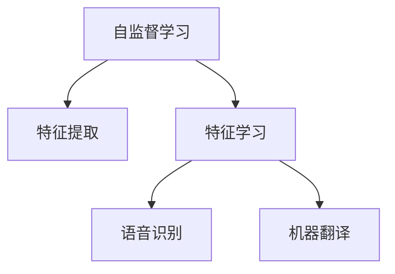

                 

# 自监督学习的应用创新:语音识别和机器翻译

> 关键词：自监督学习,语音识别,机器翻译,特征提取,特征学习,音频数据,语言模型

## 1. 背景介绍

### 1.1 问题由来

随着人工智能技术的快速发展，自监督学习（Self-Supervised Learning, SSL）在语音识别和机器翻译领域的应用越来越广泛。自监督学习是一种无需标注数据即可训练模型的学习方式，通过利用数据本身所蕴含的隐式信息进行自我学习，从而提取出数据的有用特征。在语音识别和机器翻译这两个自然语言处理（NLP）的重要分支上，自监督学习以其独特的优势，正在逐渐改变这些领域的范式。

### 1.2 问题核心关键点

当前语音识别和机器翻译的主要技术瓶颈在于如何高效利用大规模无标注数据，同时避免标注数据的高成本和质量问题。自监督学习通过以下几种方式来解决这个问题：

- **数据高效利用**：自监督学习能够充分利用无标注数据，无需标注即可训练出高质量的特征提取器，从而提升模型的泛化能力和性能。
- **无标注数据**：相比于传统的 supervised learning，自监督学习能够有效利用规模巨大的无标注数据，降低标注成本。
- **特征学习**：自监督学习通过优化模型内部的特征表示，使得模型能够学习到更有意义的特征，从而提升下游任务的表现。
- **模型自适应**：自监督学习模型能够自适应地学习数据的分布和结构，提高模型对新数据的适应能力。

这些核心点使得自监督学习成为语音识别和机器翻译等领域的前沿技术，引领着NLP技术的未来发展方向。

## 2. 核心概念与联系

### 2.1 核心概念概述

为更好地理解自监督学习在语音识别和机器翻译中的应用，本节将介绍几个密切相关的核心概念：

- **自监督学习**：指在无需标注数据的情况下，通过利用数据本身的特征进行自我学习，自动提取数据特征的过程。
- **特征提取**：指从原始数据中提取出有用的特征信息，是自监督学习的核心环节。
- **特征学习**：通过优化模型参数，使得模型能够学习到更准确的特征表示，提升模型性能。
- **语音识别**：指将自然语言语音转换为文本的过程，是人工智能与语音交互的核心技术。
- **机器翻译**：指将一种自然语言自动翻译为另一种自然语言的过程，是NLP领域的重要任务之一。

这些核心概念之间的逻辑关系可以通过以下Mermaid流程图来展示：



这个流程图展示的自监督学习与语音识别和机器翻译之间的联系：

1. 自监督学习通过特征提取从原始数据中提取特征。
2. 特征学习优化模型参数，提升特征的准确性。
3. 优化后的特征用于下游任务，如语音识别和机器翻译，以提升性能。

## 3. 核心算法原理 & 具体操作步骤
### 3.1 算法原理概述

自监督学习的核心思想是通过数据本身的特征进行自我学习，自动提取特征表示。具体来说，自监督学习模型的训练过程分为两个步骤：特征提取和特征学习。

- **特征提取**：利用数据的隐式信息，如语音信号的时间、频率、幅度等特征，提取语音特征或文本特征。
- **特征学习**：通过优化模型参数，学习特征之间的复杂关系，提升特征表示的准确性和泛化能力。

对于语音识别和机器翻译任务，自监督学习模型通常包括以下几个部分：

1. **编码器（Encoder）**：负责将原始语音或文本数据转换为特征表示。
2. **解码器（Decoder）**：负责根据特征表示生成目标文本或语音。
3. **目标函数（Objective Function）**：用于衡量模型输出与目标之间的差距。

### 3.2 算法步骤详解

自监督学习在语音识别和机器翻译中的应用主要分为以下几个步骤：

**Step 1: 特征提取**

在语音识别任务中，特征提取通常采用MFCC（Mel-Frequency Cepstral Coefficients）、LPCC（Linear Predictive Coding Coefficients）等方法，将语音信号转换为频谱特征。

在机器翻译任务中，特征提取则采用词向量表示（如Word2Vec、GloVe）或句向量表示（如BERT、XLNet）等方法，将文本数据转换为向量表示。

**Step 2: 特征学习**

特征学习阶段通常使用深度神经网络，通过优化目标函数来调整模型参数，使得提取出的特征能够更好地表示数据。

对于语音识别任务，特征学习通常使用CTC（Connectionist Temporal Classification）等方法，通过最大化预测输出的概率来优化模型。

对于机器翻译任务，特征学习通常使用自编码器、变分自编码器（VAE）等方法，通过最小化重建误差来优化模型。

**Step 3: 下游任务训练**

完成特征学习后，将提取出的特征作为下游任务的输入，使用监督学习的方法训练模型。

对于语音识别任务，可以使用分类器（如CNN、RNN）来训练模型，进行语音到文本的转换。

对于机器翻译任务，可以使用序列到序列模型（如RNN、Transformer）来训练模型，进行文本到文本的翻译。

### 3.3 算法优缺点

自监督学习在语音识别和机器翻译领域的应用具有以下优点：

1. **数据效率高**：自监督学习能够有效利用大规模无标注数据，无需标注即可训练出高质量模型。
2. **泛化能力强**：自监督学习模型通常具有较强的泛化能力，能够适应不同的数据分布和结构。
3. **模型灵活性**：自监督学习模型可以通过调整特征提取和特征学习的策略，灵活适应不同的任务需求。
4. **适应性强**：自监督学习模型能够自适应地学习新数据，提升模型对新数据的适应能力。

同时，自监督学习也存在一定的局限性：

1. **计算资源需求高**：自监督学习模型通常需要较大的计算资源，特别是在特征学习阶段。
2. **模型复杂度高**：自监督学习模型通常具有较高的复杂度，训练和推理时间较长。
3. **特征提取难度大**：特征提取需要选择合适的特征表示方法，且不同的特征提取方法效果各异。

尽管存在这些局限性，自监督学习在语音识别和机器翻译等领域的应用前景仍然广阔，能够显著提升模型的性能和泛化能力。

### 3.4 算法应用领域

自监督学习在语音识别和机器翻译中的应用已经涵盖了这两个领域的主要任务：

1. **语音识别**：自监督学习模型已经被应用于语音识别中的端到端模型，如DeepSpeech、Wav2Vec等，提升了语音识别的准确率和速度。
2. **机器翻译**：自监督学习模型也被应用于机器翻译中的端到端模型，如Google的M2M-100、Facebook的mBART等，显著提升了机器翻译的性能。

## 4. 数学模型和公式 & 详细讲解 & 举例说明
### 4.1 数学模型构建

在语音识别和机器翻译任务中，自监督学习的数学模型通常包括以下几个部分：

- **输入数据**：原始语音信号 $x$ 或文本序列 $s$。
- **特征提取器**：将输入数据 $x$ 或 $s$ 转换为特征表示 $\mathbf{z}$。
- **特征学习器**：通过优化模型参数，学习特征表示 $\mathbf{z}$ 的分布。
- **目标函数**：衡量模型输出与目标之间的差距，如语音识别的交叉熵损失、机器翻译的平均绝对误差等。

### 4.2 公式推导过程

以语音识别中的MFCC特征提取和CTC特征学习为例，推导自监督学习的数学模型。

假设输入语音信号 $x$ 被特征提取为MFCC特征序列 $\mathbf{z}$，特征学习器为深度神经网络，目标为将MFCC特征序列 $\mathbf{z}$ 转换为文本序列 $\mathbf{y}$。

特征学习器的优化目标为最小化交叉熵损失：

$$
\min_{\theta} \mathcal{L}(\theta) = -\sum_{i=1}^N \log p(y_i | z_i)
$$

其中 $p(y_i | z_i)$ 为给定MFCC特征 $z_i$ 时，生成文本序列 $y_i$ 的概率，可以通过神经网络模型计算得到。

MFCC特征提取的公式如下：

$$
\mathbf{z} = \text{MFCC}(x)
$$

其中 $\text{MFCC}$ 为MFCC特征提取函数。

### 4.3 案例分析与讲解

以Wav2Vec为例，讲解自监督学习在语音识别中的应用。

Wav2Vec模型是一种基于CTC的端到端语音识别模型，其特征提取器为MFCC特征提取器，特征学习器为多层神经网络。

Wav2Vec的训练过程分为两个阶段：预训练和微调。

**预训练阶段**：使用大规模无标注语音数据训练MFCC特征提取器和多层神经网络，学习到特征表示 $\mathbf{z}$。

**微调阶段**：在标注数据上微调模型，使用监督学习的目标函数进行训练，使得模型能够更好地匹配输入的MFCC特征和正确的文本序列。

在微调阶段，Wav2Vec使用CTC损失函数进行训练，公式如下：

$$
\mathcal{L}(\theta) = -\sum_{i=1}^N \sum_{j=1}^{T_i} \log p(y_j | z_i)
$$

其中 $T_i$ 为输入语音 $x_i$ 的MFCC特征序列长度，$p(y_j | z_i)$ 为给定MFCC特征 $z_i$ 时，生成文本序列 $y_i$ 的概率。

## 5. 项目实践：代码实例和详细解释说明
### 5.1 开发环境搭建

在进行自监督学习项目实践前，我们需要准备好开发环境。以下是使用Python进行PyTorch开发的环境配置流程：

1. 安装Anaconda：从官网下载并安装Anaconda，用于创建独立的Python环境。

2. 创建并激活虚拟环境：
```bash
conda create -n pytorch-env python=3.8 
conda activate pytorch-env
```

3. 安装PyTorch：根据CUDA版本，从官网获取对应的安装命令。例如：
```bash
conda install pytorch torchvision torchaudio cudatoolkit=11.1 -c pytorch -c conda-forge
```

4. 安装相关库：
```bash
pip install numpy pandas scikit-learn tqdm matplotlib
```

5. 安装模型库：
```bash
pip install torchaudio huggingface_hub wavenet_mfcc
```

完成上述步骤后，即可在`pytorch-env`环境中开始自监督学习实践。

### 5.2 源代码详细实现

我们以Wav2Vec模型为例，展示自监督学习在语音识别中的实现。

首先，定义模型和优化器：

```python
import torch
from torch import nn
from torchaudio.transforms import MFCC

class MFCCFeatureExtractor(nn.Module):
    def __init__(self, n_fft=2048, hop_length=160, win_length=None, power=2.0):
        super(MFCCFeatureExtractor, self).__init__()
        self.mfcc = MFCC(n_fft=n_fft, hop_length=hop_length, win_length=win_length, power=power)

    def forward(self, waveforms):
        return self.mfcc(waveforms)

class Wav2Vec(nn.Module):
    def __init__(self, input_dim=20, hidden_dim=1024, num_layers=10, dropout=0.2):
        super(Wav2Vec, self).__init__()
        self.encoder = nn.Sequential(
            nn.Linear(input_dim, hidden_dim),
            nn.ReLU(),
            nn.Dropout(dropout),
        )
        self.fc = nn.Linear(hidden_dim, num_classes)

    def forward(self, x):
        x = self.encoder(x)
        x = self.fc(x)
        return x

model = Wav2Vec()

optimizer = torch.optim.Adam(model.parameters(), lr=1e-4)
```

接着，定义训练函数：

```python
def train_model(model, train_loader, num_epochs):
    for epoch in range(num_epochs):
        model.train()
        for i, (input, target) in enumerate(train_loader):
            input = input.to(device)
            target = target.to(device)
            optimizer.zero_grad()
            output = model(input)
            loss = nn.CTCLoss()(output, target)
            loss.backward()
            optimizer.step()
            if (i+1) % 100 == 0:
                print(f'Epoch {epoch+1}, Step {i+1}, Loss: {loss.item():.4f}')
```

最后，启动训练流程：

```python
device = torch.device('cuda') if torch.cuda.is_available() else torch.device('cpu')
model.to(device)

train_loader = torch.utils.data.DataLoader(train_dataset, batch_size=32, shuffle=True)

train_model(model, train_loader, num_epochs=10)
```

以上就是使用PyTorch进行Wav2Vec模型的自监督学习实践的完整代码实现。可以看到，利用PyTorch框架，我们可以方便地构建和训练自监督学习模型。

### 5.3 代码解读与分析

让我们再详细解读一下关键代码的实现细节：

**MFCCFeatureExtractor类**：
- `__init__`方法：初始化MFCC特征提取器的参数。
- `forward`方法：对输入的语音信号进行MFCC特征提取。

**Wav2Vec类**：
- `__init__`方法：初始化Wav2Vec模型的参数。
- `forward`方法：对输入的MFCC特征进行编码和分类。

**train_model函数**：
- 对模型进行训练，使用CTC损失函数计算损失并反向传播。
- 每100步输出一次损失值。

**训练流程**：
- 将模型迁移到GPU上，并定义训练数据加载器。
- 启动训练过程，每轮迭代更新模型参数。

可以看到，PyTorch框架提供了简洁高效的API，使得自监督学习模型的开发和训练变得简单和快速。开发者可以更专注于模型设计和算法优化，而不必过多关注底层实现细节。

## 6. 实际应用场景
### 6.1 智能语音助手

基于自监督学习的智能语音助手，可以应用于家庭、企业等场景的语音交互。传统语音助手往往依赖大量人工标注的对话数据进行训练，难以适应多样化的语音环境。自监督学习能够充分利用大规模无标注对话数据，无需标注即可训练出高质量的语音识别模型，使得语音助手能够更好地适应不同的语音环境和口音差异。

在技术实现上，可以使用自监督学习模型对语音信号进行特征提取和编码，结合对话管理、情感识别等技术，构建出能够进行多轮对话的智能语音助手。

### 6.2 语音驱动视频

在视频内容制作领域，自监督学习可以用于生成语音驱动的视频。传统的视频生成需要人工标注大量的文本和语音数据，成本高、耗时长。自监督学习模型能够自动从视频中提取音频特征，并生成对应的文本，使得视频生成更加高效和自然。

具体而言，可以使用自监督学习模型对视频中的音频信号进行特征提取，结合视频帧信息，生成语音驱动的视频字幕。

### 6.3 智能客服

自监督学习还可以应用于智能客服系统，提高客服的响应速度和质量。智能客服系统通常依赖大量人工标注的客服对话数据进行训练，但这些数据成本高、更新慢。自监督学习模型能够充分利用大规模无标注对话数据，无需标注即可训练出高质量的语音识别模型，使得客服系统能够更好地适应不同的语音环境和口音差异。

在技术实现上，可以使用自监督学习模型对客服对话进行语音识别和文本转录，结合自然语言理解技术，构建出能够进行多轮对话的智能客服系统。

### 6.4 未来应用展望

随着自监督学习技术的不断成熟，其应用前景将更加广阔。未来，自监督学习将在以下几个领域得到进一步的应用：

1. **智能家居**：自监督学习可以用于智能家居的语音交互、视频监控、智能家居控制等应用，提升家居生活的智能化水平。
2. **自动驾驶**：自监督学习可以用于自动驾驶中的语音识别、视频分析、环境感知等任务，提升驾驶安全性和舒适性。
3. **娱乐产业**：自监督学习可以用于生成视频、音频、文本等内容，提升娱乐产业的内容生产效率和创新能力。
4. **教育领域**：自监督学习可以用于智能教育中的语音识别、情感分析、知识图谱构建等任务，提升教育质量和学习效率。

## 7. 工具和资源推荐
### 7.1 学习资源推荐

为了帮助开发者系统掌握自监督学习在语音识别和机器翻译中的应用，这里推荐一些优质的学习资源：

1. 《Deep Learning with PyTorch》：斯坦福大学开设的深度学习课程，介绍了深度学习的基本概念和实现方法，涵盖自监督学习的内容。
2. 《Speech and Language Processing》：由Daniel Jurafsky和James H. Martin编写的自然语言处理教材，详细介绍了自监督学习在语音识别和机器翻译中的应用。
3. 《Deep Speech 2: End-to-End Speech Recognition in English and Mandarin》：DeepMind开源的语音识别项目，展示了自监督学习在语音识别中的应用。
4. 《PyTorch Tutorials》：PyTorch官方提供的教程，详细介绍了如何使用PyTorch进行自监督学习模型的构建和训练。
5. 《Self-Supervised Learning in NLP》：HuggingFace博客，介绍了自监督学习在NLP领域的应用和前沿进展。

通过对这些资源的学习实践，相信你一定能够快速掌握自监督学习在语音识别和机器翻译中的应用，并用于解决实际的NLP问题。

### 7.2 开发工具推荐

高效的开发离不开优秀的工具支持。以下是几款用于自监督学习开发的常用工具：

1. PyTorch：基于Python的开源深度学习框架，灵活动态的计算图，适合快速迭代研究。大部分自监督学习模型都有PyTorch版本的实现。
2. TensorFlow：由Google主导开发的开源深度学习框架，生产部署方便，适合大规模工程应用。同样有丰富的自监督学习模型资源。
3. HuggingFace Transformers库：由HuggingFace开发的NLP工具库，集成了众多SOTA语言模型，支持PyTorch和TensorFlow，是进行自监督学习任务开发的利器。
4. Weights & Biases：模型训练的实验跟踪工具，可以记录和可视化模型训练过程中的各项指标，方便对比和调优。与主流深度学习框架无缝集成。
5. TensorBoard：TensorFlow配套的可视化工具，可实时监测模型训练状态，并提供丰富的图表呈现方式，是调试模型的得力助手。

合理利用这些工具，可以显著提升自监督学习任务的开发效率，加快创新迭代的步伐。

### 7.3 相关论文推荐

自监督学习在语音识别和机器翻译领域的发展源于学界的持续研究。以下是几篇奠基性的相关论文，推荐阅读：

1. Speech Commands Dataset: An Audio Dataset for Speech Command Recognition and Classification（Speech Commands数据集）：由Google开源的语音命令识别数据集，展示了自监督学习在语音识别中的应用。
2. Deep Speech 2: An End-to-End Platform for Large-Scale Speech Recognition（Deep Speech 2项目）：DeepMind开源的端到端语音识别项目，展示了自监督学习在语音识别中的应用。
3. Super-Speaker Identification Using Deep Pre-Trained Embeddings and Contrastive Learning（使用深度预训练嵌入和对比学习的超说话人识别）：提出了基于自监督学习的超说话人识别方法，展示了自监督学习在语音识别中的效果。
4. wav2vec 2.0: A Framework for Self-Supervised Learning of Speech Representation（wav2vec 2.0模型）：提出了基于自监督学习的语音表示学习模型，展示了自监督学习在语音识别中的应用。
5. LASER: A Lossless Approach to Self-supervised Representation Learning in NLP（LASER模型）：提出了基于自监督学习的自然语言表示学习模型，展示了自监督学习在机器翻译中的应用。

这些论文代表了大规模自监督学习在语音识别和机器翻译领域的发展脉络。通过学习这些前沿成果，可以帮助研究者把握学科前进方向，激发更多的创新灵感。

## 8. 总结：未来发展趋势与挑战
### 8.1 总结

本文对自监督学习在语音识别和机器翻译中的应用进行了全面系统的介绍。首先阐述了自监督学习的背景和意义，明确了自监督学习在语音识别和机器翻译中的重要作用。其次，从原理到实践，详细讲解了自监督学习的数学原理和关键步骤，给出了自监督学习任务开发的完整代码实例。同时，本文还广泛探讨了自监督学习在智能语音助手、语音驱动视频、智能客服等多个行业领域的应用前景，展示了自监督学习范式的巨大潜力。此外，本文精选了自监督学习的各类学习资源，力求为读者提供全方位的技术指引。

通过本文的系统梳理，可以看到，自监督学习技术正在成为语音识别和机器翻译等领域的重要范式，极大地拓展了模型应用的范围，催生了更多的落地场景。受益于大规模数据和模型的预训练，自监督学习模型在性能和泛化能力上取得了显著的突破，有望推动语音识别和机器翻译技术迈向新的高度。

### 8.2 未来发展趋势

展望未来，自监督学习技术将在语音识别和机器翻译等领域呈现以下几个发展趋势：

1. **模型规模持续增大**：随着算力成本的下降和数据规模的扩张，自监督学习模型的参数量还将持续增长。超大模型蕴含的丰富语言知识，有望支撑更加复杂多变的下游任务。
2. **训练方法日趋多样**：自监督学习将涌现更多高效的训练方法，如对比学习、半监督学习、对抗训练等，提升模型性能和泛化能力。
3. **特征学习更加深入**：自监督学习模型将更加深入地学习数据特征，提升特征表示的准确性和泛化能力。
4. **多模态融合**：自监督学习模型将越来越多地融合多模态数据，如语音、文本、图像等，提升模型对复杂场景的理解能力。
5. **模型自适应能力增强**：自监督学习模型将更加自适应地学习新数据，提升模型对新场景的适应能力。

这些趋势凸显了自监督学习技术的广阔前景。这些方向的探索发展，必将进一步提升语音识别和机器翻译模型的性能和泛化能力，为NLP技术的未来发展注入新的动力。

### 8.3 面临的挑战

尽管自监督学习技术已经取得了瞩目成就，但在迈向更加智能化、普适化应用的过程中，它仍面临着诸多挑战：

1. **计算资源需求高**：自监督学习模型通常需要较大的计算资源，特别是在特征学习阶段。
2. **模型复杂度高**：自监督学习模型通常具有较高的复杂度，训练和推理时间较长。
3. **特征提取难度大**：特征提取需要选择合适的特征表示方法，且不同的特征提取方法效果各异。
4. **模型泛化能力有限**：自监督学习模型在不同数据分布上泛化能力可能不足，需要结合数据增强、对抗训练等方法提升泛化能力。
5. **模型可解释性不足**：自监督学习模型通常被视为"黑盒"系统，难以解释其内部工作机制和决策逻辑。

尽管存在这些挑战，自监督学习在语音识别和机器翻译等领域的应用前景仍然广阔，能够显著提升模型的性能和泛化能力。

### 8.4 研究展望

面对自监督学习面临的这些挑战，未来的研究需要在以下几个方面寻求新的突破：

1. **无监督和半监督学习**：探索无监督和半监督学习范式，降低对大规模标注数据的依赖，提升模型泛化能力。
2. **深度学习与传统方法的结合**：结合传统符号化方法和深度学习技术，提升模型的可解释性和鲁棒性。
3. **多模态融合**：融合视觉、语音、文本等多种模态信息，提升模型的理解和生成能力。
4. **自适应学习**：自适应地学习新数据和新任务，提升模型的实时性和适应能力。
5. **计算优化**：优化模型的计算图和结构，提升推理速度和计算效率。

这些研究方向将引领自监督学习技术迈向更高的台阶，为语音识别和机器翻译技术的未来发展提供新的思路和方向。

## 9. 附录：常见问题与解答

**Q1：自监督学习与监督学习的区别是什么？**

A: 自监督学习和监督学习的主要区别在于训练数据的使用方式。监督学习需要大量的标注数据，而自监督学习则利用数据的隐式信息进行自我学习，无需标注即可训练模型。自监督学习的训练目标是通过优化模型内部的特征表示，使得模型能够更好地表示数据的特征，提升泛化能力。

**Q2：如何选择合适的自监督学习模型？**

A: 选择合适的自监督学习模型需要考虑多个因素，如数据规模、任务需求、计算资源等。一般来说，对于大规模数据集，可以使用深度自监督学习模型，如Wav2Vec、BERT等；对于小规模数据集，可以使用浅层自监督学习模型，如MUSE、SDU等。

**Q3：自监督学习的训练流程是怎样的？**

A: 自监督学习的训练流程通常分为两个阶段：特征提取和特征学习。特征提取阶段通过隐式信息提取数据的特征表示；特征学习阶段通过优化模型参数，学习特征表示的分布。在特征学习阶段，可以采用CTC、重构误差等目标函数进行优化。

**Q4：自监督学习在语音识别中的应用有哪些？**

A: 自监督学习在语音识别中的应用包括但不限于：

1. **端到端语音识别**：如Wav2Vec、DeepSpeech等，直接从原始语音信号中提取特征并进行分类。
2. **语音驱动视频**：如Audio-Visual Interference (AVI)等，结合视频信号进行语音驱动的视频生成。
3. **智能语音助手**：如Google Assistant、Alexa等，提升语音助手的响应速度和准确性。
4. **语音信号增强**：如WaveNet、VITS等，提升语音信号的质量和清晰度。

**Q5：自监督学习在机器翻译中的应用有哪些？**

A: 自监督学习在机器翻译中的应用包括但不限于：

1. **端到端机器翻译**：如Google的mBART、Facebook的m2m-100等，直接从源语言序列生成目标语言序列。
2. **序列到序列学习**：如BERT、T5等，先进行特征提取再进行序列到序列的映射。
3. **多语言翻译**：如UNIM机器翻译模型，支持多种语言之间的互相翻译。
4. **低资源语言翻译**：如LaserNet等，提升低资源语言翻译的质量。

这些自监督学习模型的应用展示了其在机器翻译领域的重要性和潜力，未来还将有更多的应用场景被探索和实现。

---

作者：禅与计算机程序设计艺术 / Zen and the Art of Computer Programming

