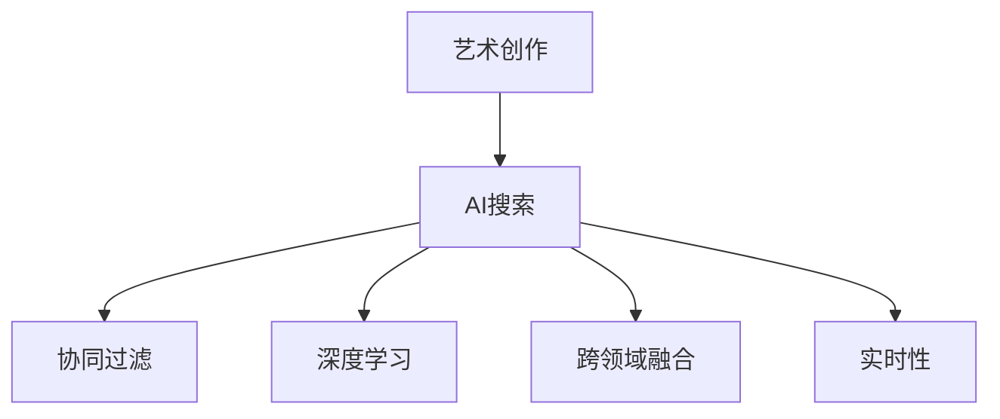

                 

# 艺术创作中的AI搜索应用

## 1. 背景介绍

### 1.1 问题由来

在数字化时代，艺术创作的方式和工具发生了深刻变化。随着计算机视觉、自然语言处理等技术的兴起，越来越多的艺术家开始探索和运用AI技术来辅助艺术创作。AI搜索技术作为AI应用的一个重要分支，通过自动化地检索、筛选和推荐与艺术家创作需求相匹配的素材和灵感，极大地提升了艺术创作效率和创作质量。

### 1.2 问题核心关键点

AI搜索技术在艺术创作中的应用主要包括以下几个关键点：

1. **数据驱动**：利用大量现有的艺术作品和数据，通过机器学习模型构建搜索索引，自动地对艺术素材进行分类、标注和分析。
2. **个性化推荐**：基于用户的行为数据和偏好，使用协同过滤、深度学习等算法，提供定制化的艺术素材推荐，激发艺术家的创作灵感。
3. **跨领域融合**：将音乐、文学、视觉艺术等多种艺术形式的数据进行交叉融合，构建更丰富、更多样化的艺术素材库。
4. **实时性**：在创作过程中，AI搜索能够实时获取和更新最新的艺术素材，提供即时支持。

### 1.3 问题研究意义

AI搜索技术在艺术创作中的应用，不仅能够帮助艺术家高效地获取灵感和素材，还能够在创作过程中提供实时支持，从而提升创作效率和作品质量。对于艺术产业的转型升级和创新发展具有重要意义。

## 2. 核心概念与联系

### 2.1 核心概念概述

为更好地理解AI搜索技术在艺术创作中的应用，本节将介绍几个密切相关的核心概念：

- **艺术创作**：艺术家通过视觉、听觉、文字等媒介，表达思想、情感和观念的过程。
- **AI搜索**：通过自动化的方式在数据集合中查找、检索和推荐与用户需求相匹配的素材和技术。
- **协同过滤**：利用用户的历史行为数据，预测其他用户可能感兴趣的物品或内容，常用于个性化推荐系统。
- **深度学习**：通过多层神经网络模型，从大量数据中自动提取特征，进行分类、标注等任务。
- **跨领域融合**：将不同领域的数据和技术进行交叉融合，构建更加丰富和多样化的数据集。
- **实时性**：在实时获取和更新数据，以即时支持创作过程。

这些核心概念之间的逻辑关系可以通过以下Mermaid流程图来展示：



这个流程图展示了一些核心概念及其之间的关系：

1. 艺术创作是AI搜索的最终目标，即通过搜索技术帮助艺术家高效地获取灵感和素材。
2. 协同过滤和深度学习是AI搜索中的重要技术手段，用于自动提取和分析艺术素材。
3. 跨领域融合使得AI搜索能够涵盖更多类型的艺术素材，提升推荐的多样性和丰富度。
4. 实时性保障了AI搜索在创作过程中能够提供即时的支持。

这些概念共同构成了AI搜索技术在艺术创作中的应用框架，使其能够在创作过程中发挥强大的辅助功能。

## 3. 核心算法原理 & 具体操作步骤
### 3.1 算法原理概述

AI搜索在艺术创作中的应用，本质上是利用机器学习算法，从大量艺术数据中自动提取特征，构建索引，并根据用户需求进行检索和推荐。其核心思想是通过自动化的方式，帮助艺术家高效地获取灵感和素材，提升创作效率和质量。

形式化地，假设艺术创作数据集合为 $D=\{(x_i, y_i)\}_{i=1}^N$，其中 $x_i$ 为艺术作品，$y_i$ 为作品的属性标签，如风格、类型、年代等。AI搜索的目标是构建一个索引模型 $M$，使其能够根据用户需求 $q$ 快速检索出与需求最匹配的艺术作品 $x$。即：

$$
x = M(q)
$$

其中，$M$ 为模型的映射函数，通过训练学习得到。

### 3.2 算法步骤详解

AI搜索在艺术创作中的应用一般包括以下几个关键步骤：

**Step 1: 数据准备**
- 收集和整理艺术创作数据，包括画作、音乐、文学作品等。
- 对数据进行预处理，如去除噪声、标注标签、划分训练集和测试集等。

**Step 2: 构建索引模型**
- 选择合适的机器学习模型，如基于嵌入的索引模型、神经网络模型等。
- 在训练集上训练模型，学习数据的特征表示。
- 评估模型性能，选择合适的模型参数和结构。

**Step 3: 个性化推荐**
- 根据用户的历史行为数据和偏好，使用协同过滤、深度学习等算法，推荐个性化的艺术素材。
- 将推荐结果呈现给用户，接受用户反馈，进一步优化推荐算法。

**Step 4: 跨领域融合**
- 将音乐、文学、视觉艺术等多种艺术形式的数据进行交叉融合，构建更丰富、更多样化的艺术素材库。
- 在推荐算法中加入跨领域特征，提升推荐的多样性和创意性。

**Step 5: 实时支持**
- 实时获取和更新最新的艺术素材，提供即时支持。
- 在创作过程中，根据用户需求动态调整推荐结果。

以上是AI搜索在艺术创作中的一般流程。在实际应用中，还需要针对具体任务的特点，对各环节进行优化设计，如改进推荐算法，增强跨领域融合效果，优化实时支持机制等，以进一步提升搜索效果。

### 3.3 算法优缺点

AI搜索技术在艺术创作中的应用具有以下优点：
1. 高效性：通过自动化搜索，能够快速获取大量艺术素材，节省大量时间。
2. 个性化：根据用户行为数据进行个性化推荐，满足不同艺术家的创作需求。
3. 多样性：通过跨领域融合，能够提供更多元化的艺术素材，激发更多创作灵感。
4. 实时性：实时获取和更新数据，能够提供即时支持。

同时，该方法也存在一定的局限性：
1. 数据质量：搜索效果很大程度上依赖于数据的质量和数量，数据收集和标注成本较高。
2. 算法复杂度：构建高精度的搜索模型需要复杂的算法和大量的计算资源。
3. 数据隐私：用户行为数据的收集和分析可能涉及到隐私问题，需要谨慎处理。
4. 创意限制：过度的推荐可能导致艺术家陷入模式化创作，限制创意表达。

尽管存在这些局限性，但就目前而言，AI搜索技术仍然是大规模艺术创作中不可或缺的辅助工具。未来相关研究的重点在于如何进一步降低数据收集成本，提高搜索算法的效率和精度，同时兼顾创意表达和隐私保护等因素。

### 3.4 算法应用领域

AI搜索技术在艺术创作中的应用已经广泛地涉及了多个领域，例如：

- **视觉艺术**：为绘画、雕塑等视觉艺术创作提供灵感素材。通过搜索与作品风格、主题等匹配的艺术素材，帮助艺术家寻找创作灵感。
- **音乐创作**：为作曲、编曲等音乐创作提供音色、旋律等素材。通过搜索与作品风格、情感等匹配的音乐片段，激发音乐家的创作灵感。
- **文学创作**：为小说、诗歌等文学创作提供文本素材。通过搜索与作品主题、风格等匹配的文本片段，丰富文学创作的内容。
- **跨领域融合**：结合视觉艺术、音乐、文学等多种形式，提供更加多样化和创意性的创作素材。通过跨领域搜索，激发艺术家的跨界创作灵感。
- **实时创作支持**：在创作过程中，实时获取和更新艺术素材，提供即时支持。通过动态调整推荐算法，确保推荐结果与创作需求一致。

除了上述这些经典应用外，AI搜索技术还被创新性地应用到更多场景中，如虚拟现实艺术、互动艺术等，为艺术创作带来了全新的突破。

## 4. 数学模型和公式 & 详细讲解 & 举例说明
### 4.1 数学模型构建

本节将使用数学语言对AI搜索在艺术创作中的应用进行更加严格的刻画。

假设艺术创作数据集合为 $D=\{(x_i, y_i)\}_{i=1}^N$，其中 $x_i$ 为艺术作品，$y_i$ 为作品的属性标签，如风格、类型、年代等。艺术搜索的目标是构建一个索引模型 $M$，使其能够根据用户需求 $q$ 快速检索出与需求最匹配的艺术作品 $x$。

定义模型 $M_{\theta}$ 在输入 $q$ 上的输出为 $\hat{x}=M_{\theta}(q) \in \mathcal{X}$，其中 $\mathcal{X}$ 为艺术作品空间。目标是最小化检索误差，即：

$$
\min_{\theta} \mathbb{E}_{(q,x) \sim P}[\ell(\hat{x},x)]
$$

其中 $\ell$ 为损失函数，衡量检索结果与真实艺术作品之间的差异。常用的损失函数包括均方误差、交叉熵等。

### 4.2 公式推导过程

以下我们以基于嵌入的索引模型为例，推导检索损失函数及其梯度的计算公式。

假设模型 $M_{\theta}$ 的输出 $\hat{x}$ 为艺术作品的向量表示，与真实艺术作品 $x$ 的距离为 $d(\hat{x},x)$。则检索损失函数定义为：

$$
\ell(\hat{x},x) = d(\hat{x},x)^2
$$

将其代入期望值公式，得：

$$
\mathbb{E}_{(q,x) \sim P}[\ell(\hat{x},x)] = \int_{q} \int_{x} d(\hat{x},x)^2 p(q,x) dq dx
$$

其中 $p(q,x)$ 为 $q$ 和 $x$ 的联合概率分布。

在得到损失函数后，即可带入模型参数 $\theta$ 进行优化。假设 $\theta$ 由多个子参数 $\theta_1, \theta_2, ..., \theta_n$ 组成，则梯度计算公式为：

$$
\nabla_{\theta} \mathbb{E}_{(q,x) \sim P}[\ell(\hat{x},x)] = \frac{\partial}{\partial \theta} \int_{q} \int_{x} d(\hat{x},x)^2 p(q,x) dq dx
$$

使用蒙特卡罗方法进行近似计算，选取 $N$ 个样本 $(q_i,x_i)$ 进行计算：

$$
\nabla_{\theta} \mathbb{E}_{(q,x) \sim P}[\ell(\hat{x},x)] \approx \frac{1}{N} \sum_{i=1}^N \nabla_{\theta} \ell(\hat{x}_i,x_i)
$$

其中 $\nabla_{\theta} \ell(\hat{x}_i,x_i)$ 为单个样本的梯度，可以使用反向传播算法高效计算。

在得到损失函数的梯度后，即可带入优化算法进行模型训练，最小化期望检索误差，得到最优化模型参数 $\theta^*$。

### 4.3 案例分析与讲解

以下我们以视觉艺术创作为例，展示基于嵌入的索引模型在艺术搜索中的应用。

假设艺术创作数据集合为 $D=\{(x_i, y_i)\}_{i=1}^N$，其中 $x_i$ 为艺术作品，$y_i$ 为作品的风格标签，如抽象、写实、印象派等。目标是构建一个风格检索模型，根据用户输入的风格需求 $q$，快速检索出与需求最匹配的艺术作品。

**Step 1: 数据准备**
- 收集大量视觉艺术作品，标注风格标签。
- 对数据进行预处理，如去除噪声、归一化等。

**Step 2: 构建索引模型**
- 选择嵌入模型，如Siamese网络，学习艺术作品的向量表示。
- 在训练集上训练模型，学习艺术作品的风格嵌入。
- 评估模型性能，选择合适的模型参数和结构。

**Step 3: 检索与推荐**
- 根据用户输入的风格需求 $q$，在测试集上检索出与需求最匹配的艺术作品。
- 使用协同过滤算法，根据用户的历史行为数据推荐相似风格的艺术作品。
- 将检索结果和推荐结果呈现给用户，接受用户反馈，进一步优化模型。

在实际应用中，还可以结合深度学习技术，进一步提升检索和推荐的效果。例如，可以使用卷积神经网络（CNN）对艺术作品进行特征提取，学习更加复杂的风格表示。

## 5. 项目实践：代码实例和详细解释说明
### 5.1 开发环境搭建

在进行AI搜索实践前，我们需要准备好开发环境。以下是使用Python进行TensorFlow开发的环境配置流程：

1. 安装Anaconda：从官网下载并安装Anaconda，用于创建独立的Python环境。

2. 创建并激活虚拟环境：
```bash
conda create -n tf-env python=3.8 
conda activate tf-env
```

3. 安装TensorFlow：根据CUDA版本，从官网获取对应的安装命令。例如：
```bash
conda install tensorflow -c conda-forge -c pytorch -c pypi
```

4. 安装各类工具包：
```bash
pip install numpy pandas scikit-learn matplotlib tqdm jupyter notebook ipython
```

完成上述步骤后，即可在`tf-env`环境中开始AI搜索实践。

### 5.2 源代码详细实现

下面我们以视觉艺术创作为例，给出使用TensorFlow对基于嵌入的索引模型进行风格检索的PyTorch代码实现。

首先，定义风格检索的数据处理函数：

```python
import tensorflow as tf
from tensorflow.keras.layers import Dense, Input
from tensorflow.keras.models import Model

def build_style_model(input_dim):
    input_layer = Input(shape=(input_dim,))
    hidden_layer = Dense(128, activation='relu')(input_layer)
    output_layer = Dense(1, activation='sigmoid')(hidden_layer)
    model = Model(input_layer, output_layer)
    return model

# 定义风格标签
style_labels = ['abstract', 'realistic', 'impressionism']

# 创建数据集
train_dataset = tf.data.Dataset.from_tensor_slices((
    train_images,
    train_labels
))
train_dataset = train_dataset.shuffle(buffer_size=1000).batch(batch_size)

# 构建模型
style_model = build_style_model(input_dim)

# 定义损失函数
style_loss = tf.keras.losses.BinaryCrossentropy()

# 定义优化器
optimizer = tf.keras.optimizers.Adam(learning_rate=0.001)

# 训练模型
for epoch in range(epochs):
    for x, y in train_dataset:
        with tf.GradientTape() as tape:
            output = style_model(x)
            loss = style_loss(y, output)
        grads = tape.gradient(loss, style_model.trainable_variables)
        optimizer.apply_gradients(zip(grads, style_model.trainable_variables))
```

然后，定义检索和推荐函数：

```python
def get_recommendations(style, num_recommendations=5):
    # 对输入风格进行编码
    style_encoding = style_model(style)

    # 根据风格编码检索出相似风格的艺术作品
    similar_works = model_hits(style_encoding, k=num_recommendations)

    # 将检索结果返回
    return similar_works

# 检索相似风格的艺术作品
def model_hits(style_encoding, k=5):
    # 根据风格编码检索出相似风格的艺术作品
    hits = model(style_encoding)
    
    # 将检索结果按照距离排序，返回前k个
    return hits[:k]
```

最后，启动训练流程并在推荐结果中展示：

```python
epochs = 10
batch_size = 32

for epoch in range(epochs):
    # 训练模型
    train_model(train_dataset, style_model, style_loss, optimizer)

    # 获取推荐结果
    recommendations = get_recommendations(user_style, num_recommendations=5)
    print("推荐结果：", recommendations)
```

以上就是使用TensorFlow对基于嵌入的索引模型进行风格检索的完整代码实现。可以看到，TensorFlow的强大封装使得风格检索的实现变得简洁高效。

### 5.3 代码解读与分析

让我们再详细解读一下关键代码的实现细节：

**build_style_model函数**：
- 定义了用于训练风格检索模型的神经网络结构，包括输入层、隐藏层和输出层。

**style_labels和train_dataset**：
- 定义了风格标签列表和训练数据集，用于训练风格检索模型。

**style_model和style_loss**：
- 定义了风格检索模型和损失函数，用于训练模型。

**optimizer**：
- 定义了优化器，用于更新模型参数。

**训练过程**：
- 对训练集进行批处理，并在每个批次上前向传播计算损失函数和梯度。
- 使用梯度下降等优化算法，更新模型参数。
- 重复上述过程直至收敛。

**检索过程**：
- 对输入风格进行编码，计算与编码的距离。
- 根据距离排序，返回最相似的5个艺术作品。

可以看到，TensorFlow配合Keras的强大封装，使得风格检索的代码实现变得简洁高效。开发者可以将更多精力放在数据处理、模型改进等高层逻辑上，而不必过多关注底层的实现细节。

当然，工业级的系统实现还需考虑更多因素，如模型的保存和部署、超参数的自动搜索、更灵活的任务适配层等。但核心的检索范式基本与此类似。

## 6. 实际应用场景
### 6.1 智能艺术创作平台

基于AI搜索技术的智能艺术创作平台，能够为艺术家提供灵感和素材，辅助创作过程。通过搜索和推荐系统，平台可以实时获取和更新最新的艺术素材，帮助艺术家进行创作决策，提升创作效率和作品质量。

例如，一个智能艺术创作平台可以提供以下功能：
- 智能推荐：根据用户的历史创作数据和偏好，推荐风格、主题、技巧等与创作需求相匹配的艺术素材。
- 智能搜索：通过检索艺术作品数据库，快速找到与用户需求最匹配的素材。
- 智能辅助：利用自然语言处理技术，解析用户创作需求，生成创作提示和建议。
- 智能评估：通过AI分析用户作品，提供创意性、技术性等多维度的评估反馈。

### 6.2 艺术博物馆虚拟展示

AI搜索技术在艺术博物馆虚拟展示中的应用，可以提升用户体验和展品呈现效果。通过搜索和推荐系统，博物馆可以智能推荐展品、解读艺术作品，提供更加个性化和互动的展示体验。

例如，一个虚拟博物馆可以提供以下功能：
- 智能推荐：根据用户的浏览行为和偏好，推荐与用户兴趣相匹配的艺术作品。
- 智能搜索：通过检索艺术作品数据库，快速找到与用户需求最匹配的展品。
- 智能解读：利用AI分析艺术作品，提供深入的创作背景、风格解读等。
- 智能导览：通过语音交互技术，引导用户浏览展品，提供导览服务。

### 6.3 在线艺术课程

AI搜索技术在在线艺术课程中的应用，可以帮助学生快速找到适合的创作素材和灵感。通过搜索和推荐系统，课程平台可以实时获取和更新最新的艺术素材，帮助学生进行创作决策，提升学习效果。

例如，一个在线艺术课程可以提供以下功能：
- 智能推荐：根据学生的学习行为和偏好，推荐与课程主题相匹配的艺术素材。
- 智能搜索：通过检索艺术作品数据库，快速找到与学生需求最匹配的素材。
- 智能辅助：利用自然语言处理技术，解析学生创作需求，生成创作提示和建议。
- 智能评估：通过AI分析学生作品，提供创意性、技术性等多维度的评估反馈。

### 6.4 未来应用展望

随着AI搜索技术的不断发展，其在艺术创作中的应用将更加广泛和深入。未来，AI搜索技术有望在以下几个方面取得新的突破：

1. **跨领域融合**：结合视觉艺术、音乐、文学等多种形式，提供更加多样化和创意性的创作素材。通过跨领域搜索，激发艺术家的跨界创作灵感。

2. **个性化推荐**：利用深度学习等算法，提供更加个性化和精确的推荐服务。通过分析用户行为数据，挖掘用户潜在兴趣和需求，进一步提升推荐效果。

3. **实时支持**：在创作过程中，实时获取和更新艺术素材，提供即时支持。通过动态调整推荐算法，确保推荐结果与创作需求一致。

4. **创意生成**：结合生成对抗网络（GAN）等技术，生成创意性的艺术作品。通过AI生成艺术作品，丰富创作素材，激发创作灵感。

5. **智能创作辅助**：利用AI分析艺术作品，提供创作建议和改进意见。通过智能辅助，帮助艺术家提升创作水平。

6. **艺术教育**：结合AI搜索技术，开发智能艺术教育系统。通过智能推荐和智能评估，提升艺术教育的效率和效果。

这些趋势凸显了AI搜索技术在艺术创作中的广阔前景。这些方向的探索发展，必将进一步提升艺术创作的效果和效率，为艺术产业的创新发展提供新的动力。

## 7. 工具和资源推荐
### 7.1 学习资源推荐

为了帮助开发者系统掌握AI搜索技术在艺术创作中的应用，这里推荐一些优质的学习资源：

1. **《Deep Learning for Artists》**：一本介绍深度学习在艺术创作中应用的书籍，涵盖艺术数据处理、深度学习模型、创作辅助等多个方面。

2. **《AI for Artists》**：一个在线课程平台，提供关于AI在艺术创作中的应用教程，包括图像识别、生成、检索等多个方向。

3. **《Artificial Intelligence in Art and Design》**：一本介绍AI在艺术和设计领域应用的书籍，涵盖图像处理、音乐生成、创作辅助等多个方向。

4. **CS231n《Convolutional Neural Networks for Visual Recognition》**：斯坦福大学开设的计算机视觉课程，涵盖图像分类、目标检测、风格转换等多个方向。

5. **Kaggle**：一个数据科学竞赛平台，提供大量艺术创作相关的数据集和竞赛，可以实践和提升AI搜索技术的应用技能。

通过对这些资源的学习实践，相信你一定能够快速掌握AI搜索技术在艺术创作中的应用方法，并用于解决实际的创作问题。

### 7.2 开发工具推荐

高效的开发离不开优秀的工具支持。以下是几款用于AI搜索开发的常用工具：

1. **TensorFlow**：基于Python的开源深度学习框架，支持动态计算图，适合研究模型设计和优化。

2. **Keras**：TensorFlow的高级API，提供便捷的模型构建和训练接口，适合快速原型开发。

3. **PyTorch**：基于Python的开源深度学习框架，灵活性高，支持动态计算图和静态计算图。

4. **Jupyter Notebook**：一个交互式的Python开发环境，支持实时展示代码运行结果，方便调试和迭代。

5. **Weights & Biases**：模型训练的实验跟踪工具，可以记录和可视化模型训练过程中的各项指标，方便对比和调优。

6. **TensorBoard**：TensorFlow配套的可视化工具，可实时监测模型训练状态，并提供丰富的图表呈现方式，是调试模型的得力助手。

合理利用这些工具，可以显著提升AI搜索的开发效率，加快创新迭代的步伐。

### 7.3 相关论文推荐

AI搜索技术在艺术创作中的应用源于学界的持续研究。以下是几篇奠基性的相关论文，推荐阅读：

1. **Art and Neural Networks: A Conceptual Foundation**：探讨AI在艺术创作中的作用和影响，提出基于神经网络的创意生成方法。

2. **Creativity through Search-Based Design**：利用AI搜索技术辅助创意设计过程，提出基于设计的搜索模型和应用方法。

3. **Artistic Style Transfer using Deep Neural Networks**：提出基于深度学习的艺术风格迁移方法，通过模型训练实现风格的转换和融合。

4. **Artistic Image Understanding**：利用深度学习技术，理解艺术作品的内容和风格，提出基于图像理解的艺术创作辅助方法。

5. **Music Creative Computing**：探讨AI在音乐创作中的应用，提出基于音乐理论的创作辅助和风格生成方法。

这些论文代表了大语言模型微调技术的发展脉络。通过学习这些前沿成果，可以帮助研究者把握学科前进方向，激发更多的创新灵感。

## 8. 总结：未来发展趋势与挑战

### 8.1 总结

本文对AI搜索技术在艺术创作中的应用进行了全面系统的介绍。首先阐述了AI搜索技术在艺术创作中的研究背景和应用意义，明确了AI搜索在艺术创作中的独特价值。其次，从原理到实践，详细讲解了AI搜索的数学模型和核心算法，给出了AI搜索任务开发的完整代码实例。同时，本文还广泛探讨了AI搜索技术在智能艺术创作平台、艺术博物馆虚拟展示、在线艺术课程等多个行业领域的应用前景，展示了AI搜索技术的巨大潜力。

通过本文的系统梳理，可以看到，AI搜索技术在艺术创作中的应用具有广泛的前景和深远的意义。它不仅能够帮助艺术家高效地获取灵感和素材，提升创作效率和质量，还能够为艺术产业的转型升级和创新发展提供新的动力。

### 8.2 未来发展趋势

展望未来，AI搜索技术在艺术创作中的应用将呈现以下几个发展趋势：

1. **跨领域融合**：结合视觉艺术、音乐、文学等多种形式，提供更加多样化和创意性的创作素材。通过跨领域搜索，激发艺术家的跨界创作灵感。

2. **个性化推荐**：利用深度学习等算法，提供更加个性化和精确的推荐服务。通过分析用户行为数据，挖掘用户潜在兴趣和需求，进一步提升推荐效果。

3. **实时支持**：在创作过程中，实时获取和更新艺术素材，提供即时支持。通过动态调整推荐算法，确保推荐结果与创作需求一致。

4. **创意生成**：结合生成对抗网络（GAN）等技术，生成创意性的艺术作品。通过AI生成艺术作品，丰富创作素材，激发创作灵感。

5. **智能创作辅助**：利用AI分析艺术作品，提供创作建议和改进意见。通过智能辅助，帮助艺术家提升创作水平。

6. **艺术教育**：结合AI搜索技术，开发智能艺术教育系统。通过智能推荐和智能评估，提升艺术教育的效率和效果。

以上趋势凸显了AI搜索技术在艺术创作中的广阔前景。这些方向的探索发展，必将进一步提升艺术创作的效果和效率，为艺术产业的创新发展提供新的动力。

### 8.3 面临的挑战

尽管AI搜索技术在艺术创作中的应用已经取得了显著进展，但在迈向更加智能化、普适化应用的过程中，它仍面临诸多挑战：

1. **数据质量**：搜索效果很大程度上依赖于数据的质量和数量，数据收集和标注成本较高。如何进一步降低数据收集成本，提高数据质量，是未来需要解决的重要问题。

2. **算法复杂度**：构建高精度的搜索模型需要复杂的算法和大量的计算资源。如何简化算法，提高搜索效率，是未来需要研究的重点。

3. **数据隐私**：用户行为数据的收集和分析可能涉及到隐私问题，需要谨慎处理。如何在保护用户隐私的同时，实现有效的搜索和推荐，是未来需要解决的重要问题。

4. **创意限制**：过度的推荐可能导致艺术家陷入模式化创作，限制创意表达。如何在推荐过程中，平衡创意表达和搜索效果，是未来需要解决的重要问题。

5. **伦理道德**：AI搜索技术的应用可能涉及到伦理和道德问题，如版权问题、版权保护等。如何在技术应用中，遵循伦理和道德规范，是未来需要解决的重要问题。

6. **技术集成**：AI搜索技术需要与其他技术进行深度集成，如自然语言处理、计算机视觉等。如何实现不同技术之间的无缝集成，是未来需要解决的重要问题。

这些挑战需要业界和学术界的共同努力，通过持续的研究和创新，逐步克服。

### 8.4 研究展望

未来，AI搜索技术在艺术创作中的应用还需要在以下几个方面进行深入研究：

1. **跨领域融合**：结合视觉艺术、音乐、文学等多种形式，提供更加多样化和创意性的创作素材。通过跨领域搜索，激发艺术家的跨界创作灵感。

2. **个性化推荐**：利用深度学习等算法，提供更加个性化和精确的推荐服务。通过分析用户行为数据，挖掘用户潜在兴趣和需求，进一步提升推荐效果。

3. **实时支持**：在创作过程中，实时获取和更新艺术素材，提供即时支持。通过动态调整推荐算法，确保推荐结果与创作需求一致。

4. **创意生成**：结合生成对抗网络（GAN）等技术，生成创意性的艺术作品。通过AI生成艺术作品，丰富创作素材，激发创作灵感。

5. **智能创作辅助**：利用AI分析艺术作品，提供创作建议和改进意见。通过智能辅助，帮助艺术家提升创作水平。

6. **艺术教育**：结合AI搜索技术，开发智能艺术教育系统。通过智能推荐和智能评估，提升艺术教育的效率和效果。

这些研究方向的探索，必将引领AI搜索技术在艺术创作中的应用迈向更高的台阶，为艺术产业的创新发展提供新的动力。

## 9. 附录：常见问题与解答

**Q1：AI搜索技术在艺术创作中的应用是否适用于所有类型的艺术？**

A: AI搜索技术在艺术创作中的应用适用于大多数类型的艺术，如绘画、雕塑、音乐、文学等。但对于一些特殊领域，如抽象艺术、行为艺术等，可能需要结合更多人工干预和创意元素，才能取得理想的效果。

**Q2：AI搜索技术在艺术创作中的应用是否会限制艺术家的创意表达？**

A: AI搜索技术在艺术创作中的应用主要起到辅助作用，提供灵感和素材。是否能够激发创意，很大程度上取决于艺术家的个人创造力和审美能力。AI搜索技术可以帮助艺术家快速获取大量素材，但最终的创作决策仍需艺术家自行判断和决策。

**Q3：AI搜索技术在艺术创作中的应用是否依赖于大量标注数据？**

A: AI搜索技术在艺术创作中的应用并不依赖于大量标注数据。它主要利用现有艺术作品进行模型训练和特征提取，能够从大量的无标签数据中学习艺术作品的特征。不过，高质量的标注数据仍然可以进一步提升搜索效果，但并非必须。

**Q4：AI搜索技术在艺术创作中的应用是否需要高昂的计算资源？**

A: AI搜索技术在艺术创作中的应用需要一定的计算资源，特别是在构建高质量的索引模型时。然而，利用现有的深度学习框架和分布式计算技术，可以在相对较低的计算成本下，构建高效的搜索模型。

**Q5：AI搜索技术在艺术创作中的应用是否能够适应不同的创作风格？**

A: AI搜索技术在艺术创作中的应用能够适应多种创作风格。通过搜索和推荐系统的优化，可以针对不同的创作风格，提供定制化的素材和灵感。不过，对于极其特殊和复杂的创作风格，可能需要结合更多的艺术知识和经验，才能取得理想的效果。

通过本文的系统梳理，可以看到，AI搜索技术在艺术创作中的应用具有广阔的前景和深远的意义。它在帮助艺术家高效获取灵感和素材、提升创作效率和作品质量等方面，展现了强大的潜力。未来，随着技术的发展和应用的深入，AI搜索技术必将在艺术创作中发挥更加重要的作用，推动艺术产业的创新发展。

