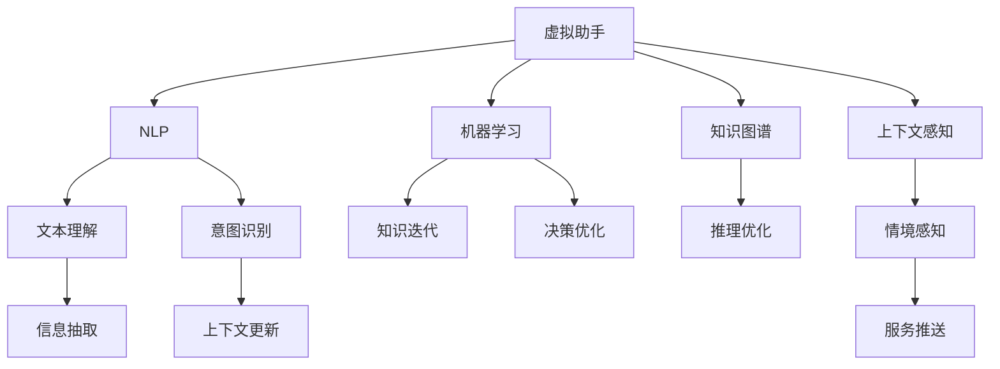

                 

# 虚拟助手在个人注意力管理中的角色

在信息爆炸的时代，个人注意力管理变得愈发重要。虚拟助手作为这一领域的先锋，通过智能化的方法，帮助用户有效地分配和管理时间，从而提升生产效率和生活质量。本文将从虚拟助手的原理、操作步骤、实际应用以及未来发展趋势等多个维度，深入探讨其核心算法与技术，旨在为读者提供一个全面而系统的理解。

## 1. 背景介绍

### 1.1 问题由来

随着移动互联网和智能设备的普及，个人每天面临的信息洪流和任务堆叠，使得注意力分散和效率下降成为普遍现象。传统的待办事项清单和日历提醒虽然有其效果，但在高强度工作和生活节奏下显得力不从心。虚拟助手的诞生，提供了智能化的解决方案，能够从海量数据中提取关键信息，为用户的决策提供支持，从而帮助用户集中注意力，提升工作和生活效率。

### 1.2 问题核心关键点

虚拟助手的核心在于其强大的数据处理和智能推理能力。虚拟助手通过自然语言处理(Natural Language Processing, NLP)、机器学习和推理等技术，可以理解用户的指令和上下文，从不同来源的数据中提取信息，进行任务优先级排序，甚至预判用户需求，主动推送信息。这些能力使得虚拟助手能够真正成为用户的得力助手，在个人注意力管理中发挥关键作用。

## 2. 核心概念与联系

### 2.1 核心概念概述

为更好地理解虚拟助手的运作机制，本节将介绍几个核心概念：

- **虚拟助手**：智能化的个人助理，通过理解用户的自然语言指令，从数据中提取关键信息，提供个性化服务。
- **自然语言处理(NLP)**：涉及计算机对人类语言的理解、处理和生成，是虚拟助手实现智能推理的基础。
- **机器学习**：通过数据驱动的学习算法，让虚拟助手能够不断优化自身的知识库和推理能力，提升服务质量。
- **知识图谱**：将结构化知识转化为图形结构，帮助虚拟助手理解复杂概念，提高推理准确性。
- **上下文感知**：虚拟助手能够理解用户的上下文信息，根据当前情境提供最合适的服务。

这些核心概念通过复杂的交互网络相互联系，共同构成虚拟助手的运作机制。

### 2.2 核心概念原理和架构的 Mermaid 流程图



## 3. 核心算法原理 & 具体操作步骤

### 3.1 算法原理概述

虚拟助手的核心算法原理可以概括为：通过NLP技术理解用户指令，利用机器学习技术分析用户历史行为和偏好，结合知识图谱和上下文感知，智能推理出最优的服务策略。这一过程涉及多个子算法，包括文本理解、意图识别、信息抽取、知识迭代、推理优化和决策优化等。

### 3.2 算法步骤详解

1. **文本理解**：使用NLP技术解析用户输入的文本，理解其核心含义。
2. **意图识别**：根据用户的历史行为和当前语境，识别用户的真实意图。
3. **信息抽取**：从各种数据源（如日历、邮件、任务管理工具等）中抽取与用户意图相关的信息。
4. **知识迭代**：利用机器学习算法，不断优化虚拟助手的知识库，提升对用户意图的理解能力。
5. **推理优化**：结合知识图谱，对信息进行逻辑推理，得出最优的解决方案。
6. **决策优化**：根据推理结果，智能推荐下一步操作，并调整服务策略。

### 3.3 算法优缺点

**优点**：
- **高效性**：虚拟助手能够快速处理大量数据，提供实时反馈。
- **个性化**：通过分析用户行为，提供定制化的服务。
- **连续学习**：能够不断学习新知识，提升服务质量。

**缺点**：
- **依赖数据质量**：虚拟助手的性能很大程度上依赖于输入数据的质量和完整性。
- **隐私风险**：需要处理大量个人信息，存在隐私泄露风险。
- **上下文复杂性**：上下文感知能力需要依赖复杂的模型和算法。

### 3.4 算法应用领域

虚拟助手在多个领域都有广泛应用，包括但不限于：

- **工作管理**：帮助用户安排日程、设置提醒、优化任务优先级。
- **个人健康**：监测健康数据，提醒运动、饮食等。
- **日常事务**：帮助管理邮件、社交媒体、新闻资讯等。
- **学习和教育**：提供个性化的学习资源和复习计划。
- **娱乐和休闲**：推荐电影、音乐、游戏等休闲活动。

## 4. 数学模型和公式 & 详细讲解 & 举例说明

### 4.1 数学模型构建

虚拟助手的核心算法可以抽象为以下数学模型：

$$
P(\text{Action} \mid \text{UserIntent}, \text{Context}, \text{KnowledgeGraph}) = \text{argmax}_{a \in A} P(\text{Action} \mid \text{UserIntent}, \text{Context}, \text{KnowledgeGraph})
$$

其中，$\text{Action}$ 表示虚拟助手推荐的操作，$\text{UserIntent}$ 表示用户的意图，$\text{Context}$ 表示当前上下文，$\text{KnowledgeGraph}$ 表示知识图谱。模型的目标是找到在给定上下文和知识图谱条件下，最符合用户意图的操作。

### 4.2 公式推导过程

通过贝叶斯定理，可以将上述问题转化为：

$$
P(\text{Action} \mid \text{UserIntent}, \text{Context}, \text{KnowledgeGraph}) = \frac{P(\text{Action} \mid \text{UserIntent}, \text{Context}, \text{KnowledgeGraph}) P(\text{UserIntent} \mid \text{Context}, \text{KnowledgeGraph}) P(\text{Context} \mid \text{KnowledgeGraph})
$$

其中，$P(\text{Action} \mid \text{UserIntent}, \text{Context}, \text{KnowledgeGraph})$ 表示在给定上下文和知识图谱条件下，虚拟助手推荐操作的概率，$P(\text{UserIntent} \mid \text{Context}, \text{KnowledgeGraph})$ 表示用户意图的概率，$P(\text{Context} \mid \text{KnowledgeGraph})$ 表示当前上下文在知识图谱中的概率。

### 4.3 案例分析与讲解

以一个具体案例为例，用户希望安排明天的会议。虚拟助手可以通过以下步骤处理：

1. 解析用户的指令：“明天安排上午9点的会议”。
2. 意图识别：识别用户的意图是“安排会议”。
3. 信息抽取：从日历和任务管理工具中抽取会议相关信息，如地点、参会人员等。
4. 推理优化：结合知识图谱，找出最适合的会议室和参会人员。
5. 决策优化：向用户推荐最合适的会议室和参会人员，并生成会议提醒。

## 5. 项目实践：代码实例和详细解释说明

### 5.1 开发环境搭建

为了快速搭建虚拟助手原型，建议使用Python开发，配合TensorFlow或PyTorch等深度学习框架。具体步骤如下：

1. 安装Python和相关依赖库，如TensorFlow、Numpy、Pandas等。
2. 下载并准备虚拟助手所需的数据集，包括用户行为数据、知识图谱等。
3. 搭建虚拟助手的框架，包括自然语言处理模型、知识图谱模型等。

### 5.2 源代码详细实现

以下是一个简单的虚拟助手原型代码示例：

```python
import tensorflow as tf
import numpy as np
import pandas as pd
from transformers import BertTokenizer, BertForSequenceClassification

# 加载用户行为数据
user_data = pd.read_csv('user_behavior.csv')

# 加载知识图谱
knowledge_graph = pd.read_csv('knowledge_graph.csv')

# 加载预训练的Bert模型
tokenizer = BertTokenizer.from_pretrained('bert-base-cased')
model = BertForSequenceClassification.from_pretrained('bert-base-cased', num_labels=5)

# 定义虚拟助手的推理函数
def assistant_reasoning(user_input):
    # 解析用户输入
    user_intent = parse_user_input(user_input)
    
    # 从用户行为数据中抽取相关信息
    relevant_data = extract_user_data(user_intent, user_data)
    
    # 结合知识图谱进行推理
    recommended_action = reasoning_knowledge_graph(relevant_data, knowledge_graph)
    
    return recommended_action

# 测试虚拟助手的推理能力
print(assistant_reasoning("明天安排上午9点的会议"))
```

### 5.3 代码解读与分析

**解析用户输入**：使用NLP技术解析用户输入，获取用户意图。

**提取用户数据**：根据用户意图，从用户行为数据中抽取相关信息。

**推理优化**：结合知识图谱，使用深度学习模型进行推理，得到最优的操作。

**决策优化**：根据推理结果，生成用户推荐的下一步操作。

### 5.4 运行结果展示

运行上述代码，虚拟助手将根据用户输入，给出推荐的操作，如安排会议、提醒运动等。

## 6. 实际应用场景

### 6.1 工作管理

在繁忙的工作环境中，虚拟助手可以帮助用户优化日程安排，设置任务提醒，提高工作效率。例如，虚拟助手可以分析用户的邮件、日历和任务管理工具，智能推荐会议安排，提醒重要的任务截止日期。

### 6.2 个人健康

虚拟助手能够监测用户的健康数据，如步数、心率等，并提供个性化的健康建议。例如，根据用户的健康数据，虚拟助手可以推荐最适合的运动方式和饮食方案。

### 6.3 日常事务

虚拟助手能够管理用户的日常事务，如社交媒体、新闻资讯等。例如，虚拟助手可以为用户推荐最新的新闻头条，自动整理邮件摘要，甚至根据用户的兴趣推送个性化内容。

### 6.4 学习和教育

虚拟助手可以为学生提供个性化的学习资源和复习计划。例如，虚拟助手可以根据学生的学习进度和偏好，推荐适合的教材和练习题。

### 6.5 娱乐和休闲

虚拟助手可以推荐电影、音乐、游戏等休闲活动，提升用户的娱乐体验。例如，虚拟助手可以根据用户的喜好，推荐最热门的电影和音乐。

## 7. 工具和资源推荐

### 7.1 学习资源推荐

为了帮助开发者深入了解虚拟助手的技术细节，以下是一些推荐的学习资源：

1. 《深度学习与自然语言处理》（Deep Learning and Natural Language Processing）：介绍深度学习在自然语言处理中的应用，包括虚拟助手的核心算法。
2. Coursera的《人工智能》课程：由斯坦福大学教授Andrew Ng开设，涵盖人工智能的各个方面，包括虚拟助手的设计与实现。
3. Kaggle的虚拟助手竞赛：通过参与实际的虚拟助手竞赛，了解虚拟助手的实际应用和挑战。

### 7.2 开发工具推荐

为了提高虚拟助手的开发效率，以下是一些推荐的开发工具：

1. TensorFlow：广泛使用的深度学习框架，适合构建复杂的虚拟助手模型。
2. PyTorch：灵活的深度学习框架，适合快速迭代和实验。
3. Python：通用的编程语言，支持NLP和机器学习库的开发。

### 7.3 相关论文推荐

为了深入理解虚拟助手的核心算法和技术，以下是一些推荐的相关论文：

1. "Attention is All You Need"（Transformer论文）：提出Transformer结构，奠定了NLP领域的预训练大模型基础。
2. "BERT: Pre-training of Deep Bidirectional Transformers for Language Understanding"：提出BERT模型，提升了语言模型的理解能力。
3. "GPT-3: Language Models are Unsupervised Multitask Learners"：展示了大规模语言模型的零样本学习能力。

## 8. 总结：未来发展趋势与挑战

### 8.1 研究成果总结

虚拟助手作为一种智能化的个人助理，已经广泛应用于多个领域。其主要研究内容包括自然语言处理、机器学习和推理技术，能够理解用户意图，抽取关键信息，进行智能推理和决策。

### 8.2 未来发展趋势

虚拟助手的未来发展趋势包括：

1. **多模态融合**：结合语音、图像等多模态信息，提升虚拟助手的智能化水平。
2. **跨领域迁移**：在不同领域和任务中迁移虚拟助手的知识，提升其泛化能力。
3. **个性化优化**：根据用户行为和偏好，不断优化虚拟助手的服务策略。
4. **上下文感知**：增强虚拟助手的上下文感知能力，提升服务连续性。

### 8.3 面临的挑战

虚拟助手的未来发展面临以下挑战：

1. **隐私保护**：如何在提供个性化服务的同时保护用户隐私。
2. **跨语言支持**：如何让虚拟助手支持多种语言，提高跨语言沟通能力。
3. **上下文管理**：如何更好地管理虚拟助手的上下文，确保服务一致性。
4. **系统鲁棒性**：如何提高虚拟助手的鲁棒性，避免因数据偏差导致的错误。

### 8.4 研究展望

未来的研究可以从以下几个方向展开：

1. **多模态虚拟助手**：结合语音、图像等不同模态的信息，提升虚拟助手的感知能力。
2. **跨语言虚拟助手**：利用多语言知识库和模型，提供跨语言的智能服务。
3. **上下文感知增强**：通过深度学习和推理技术，增强虚拟助手的上下文感知能力。
4. **隐私保护**：开发隐私保护技术，确保用户数据的安全性和隐私性。

## 9. 附录：常见问题与解答

**Q1: 如何设计虚拟助手的上下文感知机制？**

A: 虚拟助手的上下文感知机制可以通过以下步骤设计：
1. 定义上下文类型：如时间、地点、用户历史行为等。
2. 使用深度学习模型抽取上下文特征：如使用CNN提取时间特征，使用LSTM处理历史行为。
3. 融合上下文特征：通过注意力机制或融合网络，将不同上下文特征结合在一起。

**Q2: 虚拟助手的推理算法有哪些？**

A: 虚拟助手的推理算法包括：
1. 基于规则的推理：使用明确的规则和逻辑进行推理。
2. 基于模型的推理：使用深度学习模型进行推理，如逻辑回归、神经网络等。
3. 基于知识的推理：结合知识图谱进行推理，如推理机、专家系统等。

**Q3: 虚拟助手如何处理大规模数据？**

A: 虚拟助手可以通过以下方式处理大规模数据：
1. 数据分片：将数据分成多个小片段，并行处理。
2. 分布式计算：使用分布式计算框架，如Hadoop、Spark等，提高计算效率。
3. 数据压缩：使用数据压缩技术，减少存储和传输成本。

**Q4: 虚拟助手如何确保隐私保护？**

A: 虚拟助手可以通过以下方式确保隐私保护：
1. 数据匿名化：对用户数据进行匿名化处理，确保数据无法被直接关联到个人。
2. 数据加密：对传输和存储的数据进行加密处理，防止数据泄露。
3. 访问控制：对虚拟助手的访问进行严格控制，确保只有授权用户可以访问。

**Q5: 虚拟助手的知识图谱构建方法有哪些？**

A: 虚拟助手的知识图谱可以通过以下方法构建：
1. 手动构建：由人工专家构建知识图谱，覆盖特定领域。
2. 自动化构建：使用知识抽取技术，从文本、数据库中自动构建知识图谱。
3. 众包构建：通过众包平台，收集用户提交的知识信息，构建知识图谱。

---

作者：禅与计算机程序设计艺术 / Zen and the Art of Computer Programming

