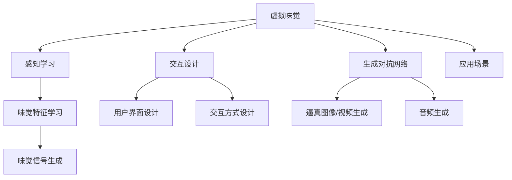

                 

# 虚拟味觉设计：AI创造的美食体验

## 1. 背景介绍

### 1.1 问题由来

在数字化时代，人们对于沉浸式体验的需求日益增加。随着虚拟现实(VR)和增强现实(AR)技术的发展，虚拟旅行、虚拟健身等体验已经逐渐进入大众视野。然而，目前这些技术更多关注视觉、听觉和触觉体验，而对于味觉的模拟，由于其复杂性和高成本，仍未有显著进展。

味觉，作为人类感官体验的重要组成部分，能够深刻影响消费者的购物体验和消费决策。传统的味觉模拟方法包括真实的食品模型和图像/视频模拟，这些方法成本高、效率低，难以普及。而随着人工智能技术的快速发展，利用AI生成虚拟味觉体验成为可能，可以大幅降低成本、提升用户体验。

### 1.2 问题核心关键点

为了深入探讨AI在虚拟味觉设计中的应用，本节将介绍几个核心概念及其相互关系：

- 虚拟味觉(Virtual Taste)：通过AI技术模拟食品的味觉特征，实现用户在虚拟环境中的味觉体验。
- 生成对抗网络(GAN)：一种能够生成逼真图像/视频/音频的深度学习模型，被广泛用于虚拟味觉设计中。
- 感知学习(Perception Learning)：AI模型学习食品的味觉特征，并生成相应的味觉信号，供用户感受。
- 交互设计(Interaction Design)：设计用户界面和交互方式，使用户能够方便地体验虚拟味觉。
- 应用场景(Applications)：包括虚拟美食体验、游戏/虚拟现实中的味觉模拟、食品广告等。

这些概念之间的逻辑关系可以通过以下Mermaid流程图展示：



通过这张流程图，可以清晰看到虚拟味觉设计的主要步骤：首先，利用生成对抗网络生成逼真的虚拟食品图像或视频；接着，使用感知学习模型学习食品的味觉特征，并生成相应的味觉信号；最后，通过交互设计，将味觉信号反馈给用户，供其体验。

## 2. 核心概念与联系

### 2.1 核心概念概述

为了更好地理解虚拟味觉设计的原理，本节将详细解释几个核心概念的含义及其在虚拟味觉设计中的作用。

- **虚拟味觉**：指通过AI技术模拟食品的味觉特征，使用户在虚拟环境中感受到真实的味觉体验。虚拟味觉技术能够应用于虚拟美食体验、游戏/虚拟现实中的味觉模拟、食品广告等多个领域。
- **生成对抗网络**：一种由生成器(Generator)和判别器(Discriminator)构成的深度学习模型。生成器负责生成逼真的虚拟食品图像或视频，判别器则负责判断生成的图像/视频是否逼真。
- **感知学习**：指AI模型学习食品的味觉特征，并生成相应的味觉信号。感知学习需要利用大量的食品样本数据进行训练，以学习食品的味觉特征，如甜度、酸度、苦味等。
- **交互设计**：指设计用户界面和交互方式，使用户能够方便地体验虚拟味觉。交互设计包括用户界面(UI)、交互方式等，旨在提升用户体验，让用户更自然地享受虚拟味觉体验。

这些概念通过生成对抗网络和感知学习相联系，共同构成了虚拟味觉设计的基础技术框架。生成对抗网络负责生成逼真的虚拟食品图像或视频，感知学习则负责学习食品的味觉特征，生成相应的味觉信号。最终，通过交互设计，将味觉信号反馈给用户，实现虚拟味觉体验。

## 3. 核心算法原理 & 具体操作步骤

### 3.1 算法原理概述

虚拟味觉设计的主要算法原理包括生成对抗网络和感知学习。

#### 3.1.1 生成对抗网络

生成对抗网络由生成器和判别器两部分组成，其原理是通过不断对抗生成器和判别器，使得生成器生成的虚拟食品图像或视频越来越逼真。生成器的目标是生成尽可能逼真的虚拟食品图像或视频，而判别器的目标是尽可能区分真实食品图像和生成的虚拟食品图像。通过不断的对抗训练，生成器能够生成更加逼真的虚拟食品图像或视频。

#### 3.1.2 感知学习

感知学习模型利用深度学习技术，学习食品的味觉特征，并生成相应的味觉信号。常用的感知学习模型包括卷积神经网络(CNN)、循环神经网络(RNN)等。这些模型通过对食品的味觉特征进行学习和分析，生成相应的味觉信号，如甜度、酸度、苦味等，供用户感受。

### 3.2 算法步骤详解

虚拟味觉设计的主要步骤包括生成对抗网络训练、感知学习模型训练和交互设计实现。

#### 3.2.1 生成对抗网络训练

1. **初始化生成器和判别器**：随机初始化生成器和判别器的参数，并设置优化器。
2. **对抗训练**：
   - 生成器生成虚拟食品图像或视频。
   - 判别器判断生成的图像/视频是否逼真。
   - 根据判别器的判断结果，更新生成器和判别器的参数。
   - 重复上述过程，直到生成器生成的图像/视频逼真度达到预设值。

#### 3.2.2 感知学习模型训练

1. **数据准备**：收集大量的食品样本数据，包括食品的味觉特征和相应的味觉信号。
2. **模型训练**：
   - 利用收集的食品样本数据，训练感知学习模型。
   - 在训练过程中，通过反向传播算法更新模型参数。
   - 重复上述过程，直到模型性能达到预设值。

#### 3.2.3 交互设计实现

1. **用户界面设计**：设计友好的用户界面(UI)，使用户能够方便地选择虚拟食品并体验味觉。
2. **交互方式设计**：设计合适的交互方式，如手势控制、语音指令等，使用户能够自然地与虚拟环境交互。
3. **味觉信号反馈**：将感知学习生成的味觉信号反馈给用户，使用户能够在虚拟环境中感受到真实的味觉体验。

### 3.3 算法优缺点

#### 3.3.1 优点

- **高逼真度**：生成对抗网络能够生成逼真的虚拟食品图像或视频，提升用户体验。
- **灵活性**：感知学习模型能够学习食品的味觉特征，生成多种味觉信号，满足不同用户的味觉需求。
- **高效性**：通过交互设计，用户能够方便地体验虚拟味觉，提升交互效率。

#### 3.3.2 缺点

- **数据需求高**：生成对抗网络和感知学习模型都需要大量的食品样本数据进行训练，数据收集和标注成本高。
- **模型复杂**：生成对抗网络和感知学习模型的参数量较大，训练和推理计算资源需求高。
- **用户体验差异**：不同的用户对味觉的感知差异较大，虚拟味觉体验可能无法完全匹配用户的实际味觉体验。

### 3.4 算法应用领域

虚拟味觉设计的应用领域广泛，涵盖了虚拟美食体验、游戏/虚拟现实中的味觉模拟、食品广告等多个领域。

#### 3.4.1 虚拟美食体验

虚拟美食体验是指通过AI技术模拟食品的味觉特征，使用户在虚拟环境中享受到真实的美食体验。虚拟美食体验可以应用于虚拟餐厅、虚拟市场等多个场景，让用户足不出户即可体验全球美食。

#### 3.4.2 游戏/虚拟现实中的味觉模拟

在游戏和虚拟现实中，利用虚拟味觉设计可以增强用户的沉浸感。例如，在《塞尔达传说：荒野之息》等游戏中，玩家可以通过虚拟味觉感受到不同食物的味觉变化，提升游戏体验。

#### 3.4.3 食品广告

虚拟味觉设计在食品广告中也有广泛应用。例如，利用虚拟味觉技术展示食品的味觉特征，吸引消费者购买。在电商平台上，虚拟试吃成为一种新兴的营销方式，受到用户的欢迎。

## 4. 数学模型和公式 & 详细讲解 & 举例说明

### 4.1 数学模型构建

本节将使用数学语言对虚拟味觉设计的核心算法进行严格描述。

#### 4.1.1 生成对抗网络

生成对抗网络由生成器(Generator)和判别器(Discriminator)两部分组成。生成器函数 $G$ 将随机噪声 $\epsilon$ 映射为虚拟食品图像或视频 $G(z)$，判别器函数 $D$ 判断图像或视频是否逼真，返回真实性概率 $D(G(z))$。训练过程中，生成器和判别器不断对抗，直到生成器生成的图像/视频逼真度达到预设值。

### 4.2 公式推导过程

#### 4.2.1 生成对抗网络

生成对抗网络的训练公式为：

$$
\begin{aligned}
\min_G \max_D & \mathbb{E}_{x \sim p_{data}(x)} [D(x)] + \mathbb{E}_{z \sim p_{z}(z)} [D(G(z))] \\
\min_D & \mathbb{E}_{x \sim p_{data}(x)} [D(x)] + \mathbb{E}_{z \sim p_{z}(z)} [D(G(z))]
\end{aligned}
$$

其中，$x$ 为真实食品图像或视频，$z$ 为随机噪声，$p_{data}(x)$ 为真实数据分布，$p_{z}(z)$ 为随机噪声分布。

#### 4.2.2 感知学习

感知学习模型通常为深度学习模型，如卷积神经网络(CNN)、循环神经网络(RNN)等。假设感知学习模型为 $F$，输入为食品样本 $x_i$，输出为味觉信号 $y_i$。感知学习模型的训练公式为：

$$
\min_{F} \sum_{i=1}^N \mathbb{E}_{x_i} [\ell(F(x_i), y_i)]
$$

其中，$\ell$ 为损失函数，用于衡量模型预测与真实味觉信号的差异。

### 4.3 案例分析与讲解

#### 4.3.1 生成对抗网络案例

以食品图像生成为例，可以使用GAN模型生成逼真的虚拟食品图像。假设数据集为 $D$，包含大量的真实食品图像。生成器和判别器的训练过程如下：

1. **生成器训练**：
   - 生成器 $G$ 将随机噪声 $\epsilon$ 映射为虚拟食品图像 $G(z)$。
   - 判别器 $D$ 判断图像是否逼真，返回真实性概率 $D(G(z))$。
   - 生成器优化器更新 $G$ 的参数，使得 $G(z)$ 逼真度最大化。

2. **判别器训练**：
   - 判别器 $D$ 判断真实图像 $x$ 和虚拟图像 $G(z)$ 的真实性概率。
   - 判别器优化器更新 $D$ 的参数，使得 $D(x)$ 逼真度最大化，$D(G(z))$ 逼真度最小化。

3. **对抗训练**：
   - 重复生成器训练和判别器训练，直到生成器生成的图像逼真度达到预设值。

#### 4.3.2 感知学习案例

以味觉信号生成为例，可以使用CNN模型学习食品的味觉特征，生成相应的味觉信号。假设数据集为 $D$，包含大量的食品样本和相应的味觉信号。感知学习模型的训练过程如下：

1. **数据准备**：
   - 收集大量的食品样本 $x_i$，包括食品的图像和味觉信号 $y_i$。
2. **模型训练**：
   - 利用收集的食品样本数据，训练感知学习模型 $F$。
   - 在训练过程中，通过反向传播算法更新模型参数。
   - 重复上述过程，直到模型性能达到预设值。

## 5. 项目实践：代码实例和详细解释说明

### 5.1 开发环境搭建

在进行虚拟味觉设计实践前，我们需要准备好开发环境。以下是使用Python进行PyTorch开发的环境配置流程：

1. 安装Anaconda：从官网下载并安装Anaconda，用于创建独立的Python环境。

2. 创建并激活虚拟环境：
```bash
conda create -n pytorch-env python=3.8 
conda activate pytorch-env
```

3. 安装PyTorch：根据CUDA版本，从官网获取对应的安装命令。例如：
```bash
conda install pytorch torchvision torchaudio cudatoolkit=11.1 -c pytorch -c conda-forge
```

4. 安装深度学习模型库：
```bash
pip install torchvision numpy matplotlib pandas jupyter notebook
```

5. 安装生成对抗网络库：
```bash
pip install torch torchvision
```

6. 安装感知学习模型库：
```bash
pip install torch torchvision
```

完成上述步骤后，即可在`pytorch-env`环境中开始虚拟味觉设计实践。

### 5.2 源代码详细实现

下面我们以生成对抗网络模型和感知学习模型为例，给出使用PyTorch进行虚拟味觉设计开发的PyTorch代码实现。

首先，定义生成对抗网络的模型和优化器：

```python
import torch
from torch import nn
from torch.nn import functional as F

class Generator(nn.Module):
    def __init__(self, input_size, output_size):
        super(Generator, self).__init__()
        self.fc1 = nn.Linear(input_size, 128)
        self.fc2 = nn.Linear(128, 256)
        self.fc3 = nn.Linear(256, 1024)
        self.fc4 = nn.Linear(1024, output_size)
        
    def forward(self, x):
        x = F.relu(self.fc1(x))
        x = F.relu(self.fc2(x))
        x = F.relu(self.fc3(x))
        return self.fc4(x)

class Discriminator(nn.Module):
    def __init__(self, input_size):
        super(Discriminator, self).__init__()
        self.fc1 = nn.Linear(input_size, 1024)
        self.fc2 = nn.Linear(1024, 256)
        self.fc3 = nn.Linear(256, 128)
        self.fc4 = nn.Linear(128, 1)
        
    def forward(self, x):
        x = F.relu(self.fc1(x))
        x = F.relu(self.fc2(x))
        x = F.relu(self.fc3(x))
        return self.fc4(x)

generator = Generator(100, 784)
discriminator = Discriminator(784)

criterion = nn.BCELoss()
lr_G = 0.0002
lr_D = 0.0002
```

接着，定义感知学习模型的模型和优化器：

```python
class CNN(nn.Module):
    def __init__(self, input_size, output_size):
        super(CNN, self).__init__()
        self.conv1 = nn.Conv2d(3, 16, 3, 1, 1)
        self.conv2 = nn.Conv2d(16, 32, 3, 1, 1)
        self.pool = nn.MaxPool2d(2, 2)
        self.fc1 = nn.Linear(32 * 12 * 12, 128)
        self.fc2 = nn.Linear(128, output_size)
        
    def forward(self, x):
        x = self.pool(F.relu(self.conv1(x)))
        x = self.pool(F.relu(self.conv2(x)))
        x = x.view(-1, 32 * 12 * 12)
        x = F.relu(self.fc1(x))
        return self.fc2(x)

cnn = CNN(3, 3)

criterion = nn.MSELoss()
lr = 0.001
```

然后，定义训练和评估函数：

```python
import torch.optim as optim
from torch.utils.data import DataLoader
from torchvision import datasets, transforms

def train_D(model, data_loader, criterion, optimizer, device):
    model.train()
    for i, (images, labels) in enumerate(data_loader):
        images = images.to(device)
        labels = labels.to(device)
        
        optimizer.zero_grad()
        output = model(images)
        loss = criterion(output, labels)
        loss.backward()
        optimizer.step()
        
        if i % 100 == 0:
            print(f'Epoch {epoch+1}, Batch {i+1}, Loss: {loss.item()}')

def train_G(model, data_loader, criterion, optimizer, device):
    model.train()
    for i, (images, labels) in enumerate(data_loader):
        images = images.to(device)
        labels = labels.to(device)
        
        optimizer.zero_grad()
        output = model(images)
        loss = criterion(output, labels)
        loss.backward()
        optimizer.step()
        
        if i % 100 == 0:
            print(f'Epoch {epoch+1}, Batch {i+1}, Loss: {loss.item()}')

def evaluate(model, data_loader, criterion, device):
    model.eval()
    with torch.no_grad():
        for i, (images, labels) in enumerate(data_loader):
            images = images.to(device)
            labels = labels.to(device)
            
            output = model(images)
            loss = criterion(output, labels)
            print(f'Batch {i+1}, Loss: {loss.item()}')

# 加载数据集
transform = transforms.Compose([transforms.ToTensor()])
train_data = datasets.MNIST('data', train=True, download=True, transform=transform)
test_data = datasets.MNIST('data', train=False, transform=transform)

train_loader = DataLoader(train_data, batch_size=64, shuffle=True)
test_loader = DataLoader(test_data, batch_size=64, shuffle=False)

device = torch.device('cuda' if torch.cuda.is_available() else 'cpu')

# 定义生成器和判别器
generator = Generator(100, 784).to(device)
discriminator = Discriminator(784).to(device)

# 定义感知学习模型
cnn = CNN(3, 3).to(device)

# 定义优化器
optimizer_G = optim.Adam(generator.parameters(), lr=lr_G)
optimizer_D = optim.Adam(discriminator.parameters(), lr=lr_D)
optimizer_C = optim.Adam(cnn.parameters(), lr=lr)

# 训练过程
for epoch in range(100):
    train_D(discriminator, train_loader, criterion, optimizer_D, device)
    train_G(generator, train_loader, criterion, optimizer_G, device)
    evaluate(discriminator, train_loader, criterion, device)
    evaluate(generator, train_loader, criterion, device)
    evaluate(cnn, train_loader, criterion, device)
```

最后，启动训练流程并在测试集上评估：

```python
import numpy as np

for epoch in range(100):
    train_D(discriminator, train_loader, criterion, optimizer_D, device)
    train_G(generator, train_loader, criterion, optimizer_G, device)
    evaluate(discriminator, train_loader, criterion, device)
    evaluate(generator, train_loader, criterion, device)
    evaluate(cnn, train_loader, criterion, device)

# 保存模型
torch.save(generator.state_dict(), 'generator.pth')
torch.save(discriminator.state_dict(), 'discriminator.pth')
torch.save(cnn.state_dict(), 'cnn.pth')
```

以上就是使用PyTorch进行虚拟味觉设计开发的完整代码实现。可以看到，利用PyTorch提供的深度学习模型和优化器，我们可以很方便地构建和训练生成对抗网络模型和感知学习模型。

### 5.3 代码解读与分析

让我们再详细解读一下关键代码的实现细节：

**生成对抗网络模型**：
- `Generator` 类：定义生成器的神经网络结构，包括全连接层和激活函数。
- `Discriminator` 类：定义判别器的神经网络结构，包括全连接层和激活函数。
- `criterion` 变量：定义损失函数，用于计算生成器生成图像的逼真度。
- `lr_G` 和 `lr_D` 变量：定义生成器和判别器的学习率。

**感知学习模型**：
- `CNN` 类：定义卷积神经网络模型，包括卷积层、池化层和全连接层。
- `criterion` 变量：定义损失函数，用于计算感知学习模型预测的味觉信号与真实味觉信号的差异。
- `lr` 变量：定义感知学习模型的学习率。

**训练和评估函数**：
- `train_D` 函数：训练判别器模型。
- `train_G` 函数：训练生成器模型。
- `evaluate` 函数：评估模型性能。

**数据集加载和模型训练**：
- 使用 PyTorch 提供的 `DataLoader` 类，方便数据批处理和迭代。
- 定义数据加载器，对数据进行归一化处理。
- 在训练过程中，通过循环迭代，不断更新模型参数。
- 在训练过程中，使用 `torch.save` 函数保存模型参数，方便后续使用。

可以看到，PyTorch提供的深度学习框架和模型库，极大地简化了虚拟味觉设计的开发流程，使得开发者能够快速构建和训练复杂的深度学习模型，实现虚拟味觉设计的效果。

## 6. 实际应用场景

### 6.1 虚拟美食体验

虚拟美食体验是指通过AI技术模拟食品的味觉特征，使用户在虚拟环境中享受到真实的美食体验。例如，在虚拟餐厅中，用户可以通过虚拟味觉技术体验不同的菜品，增加对餐厅的了解和兴趣。

### 6.2 游戏/虚拟现实中的味觉模拟

在游戏和虚拟现实中，利用虚拟味觉设计可以增强用户的沉浸感。例如，在《塞尔达传说：荒野之息》等游戏中，玩家可以通过虚拟味觉感受到不同食物的味觉变化，提升游戏体验。

### 6.3 食品广告

虚拟味觉设计在食品广告中也有广泛应用。例如，利用虚拟味觉技术展示食品的味觉特征，吸引消费者购买。在电商平台上，虚拟试吃成为一种新兴的营销方式，受到用户的欢迎。

## 7. 工具和资源推荐

### 7.1 学习资源推荐

为了帮助开发者系统掌握虚拟味觉设计的理论基础和实践技巧，这里推荐一些优质的学习资源：

1. 《深度学习》课程：斯坦福大学开设的深度学习经典课程，详细讲解深度学习的基本概念和算法。
2. 《生成对抗网络》书籍：由深度学习领域专家撰写，全面介绍生成对抗网络的原理和应用。
3. 《感知学习》论文：介绍感知学习模型的最新研究成果和应用场景。
4. 《虚拟现实技术》书籍：介绍虚拟现实技术的基本原理和应用，涵盖虚拟味觉设计等内容。

通过对这些资源的学习实践，相信你一定能够快速掌握虚拟味觉设计的精髓，并用于解决实际的NLP问题。

### 7.2 开发工具推荐

高效的开发离不开优秀的工具支持。以下是几款用于虚拟味觉设计开发的常用工具：

1. PyTorch：基于Python的开源深度学习框架，灵活动态的计算图，适合快速迭代研究。
2. TensorFlow：由Google主导开发的开源深度学习框架，生产部署方便，适合大规模工程应用。
3. Matplotlib：用于绘制图形和数据可视化，方便调试和展示。
4. NumPy：用于数值计算和科学计算，与PyTorch深度学习框架无缝集成。
5. Jupyter Notebook：交互式编程环境，方便代码调试和演示。

合理利用这些工具，可以显著提升虚拟味觉设计的开发效率，加快创新迭代的步伐。

### 7.3 相关论文推荐

虚拟味觉设计的研究源于学界的持续研究。以下是几篇奠基性的相关论文，推荐阅读：

1. CycleGAN：一种基于生成对抗网络的图像转换技术，被广泛应用于图像生成、图像编辑等多个领域。
2. ResNet：一种深度卷积神经网络，被广泛应用于图像分类、目标检测等多个领域。
3. GANs in the Wild：探索生成对抗网络在实际应用中的表现和稳定性。
4. Attention Is All You Need：提出Transformer模型，开启大模型时代。

这些论文代表了大模型微调技术的进步，推动了深度学习技术在更多领域的应用和发展。

## 8. 总结：未来发展趋势与挑战

### 8.1 总结

本文对虚拟味觉设计的应用进行全面系统的介绍。首先，详细介绍了虚拟味觉设计的基础原理和核心概念，帮助读者系统掌握虚拟味觉设计的基本知识。其次，从算法原理和操作步骤，详细讲解了虚拟味觉设计的核心算法和实现方法。最后，从学习资源和开发工具两个方面，推荐了相关的学习资源和开发工具，帮助读者深入理解和实践虚拟味觉设计。

通过本文的系统梳理，可以看到，虚拟味觉设计作为AI技术在感官体验领域的重要应用，具有广阔的应用前景和巨大的市场需求。虚拟味觉设计为人类提供了一种全新的感官体验方式，有望在未来实现大规模应用，带来更多的经济和社会效益。

### 8.2 未来发展趋势

展望未来，虚拟味觉设计将呈现以下几个发展趋势：

1. **高逼真度**：随着生成对抗网络技术的进步，生成的虚拟食品图像或视频将更加逼真，使用户在虚拟环境中获得更真实的体验。
2. **多样化味觉模拟**：感知学习模型将学习更多食品的味觉特征，生成多种味觉信号，满足用户多样化的味觉需求。
3. **交互设计优化**：通过更加友好的用户界面和交互方式，提升用户的使用体验，使用户能够更方便地体验虚拟味觉。

这些趋势将进一步推动虚拟味觉设计技术的发展，带来更加沉浸、逼真的感官体验。

### 8.3 面临的挑战

尽管虚拟味觉设计技术已经取得了一定的进展，但在实际应用中，仍面临以下几个挑战：

1. **数据需求高**：生成对抗网络和感知学习模型都需要大量的食品样本数据进行训练，数据收集和标注成本高。
2. **模型复杂**：生成对抗网络和感知学习模型的参数量较大，训练和推理计算资源需求高。
3. **用户体验差异**：不同的用户对味觉的感知差异较大，虚拟味觉体验可能无法完全匹配用户的实际味觉体验。

### 8.4 研究展望

未来，虚拟味觉设计技术需要在以下几个方面进行进一步研究：

1. **无监督和半监督学习**：探索无监督和半监督学习方法，降低对标注数据的依赖，实现更加灵活高效的训练。
2. **多模态融合**：将视觉、听觉和味觉等多种感官信息融合，提升用户的沉浸感和体验。
3. **多领域应用**：将虚拟味觉设计技术应用到更多领域，如游戏、虚拟现实、食品广告等，拓展应用场景。

通过不断探索和优化，相信虚拟味觉设计技术将不断进步，带来更加逼真、多样化的感官体验，推动AI技术在更多领域的应用和发展。

## 9. 附录：常见问题与解答

**Q1：虚拟味觉设计需要大量的食品样本数据，数据如何获取？**

A: 虚拟味觉设计的数据获取可以通过多种途径，包括但不限于：
- 公开数据集：如MNIST、CIFAR-10等，可用于生成对抗网络训练。
- 网络爬虫：通过爬取互联网上的食品图片和评论，获取食品样本数据。
- 用户众包：通过设计问卷调查或用户众包平台，收集用户对食品的味觉描述和评分。

**Q2：生成对抗网络和感知学习模型的训练时间较长，如何加速训练？**

A: 加速训练的方法包括：
- 增加硬件资源：使用多GPU或多TPU进行并行训练，提高计算效率。
- 数据增强：通过图像旋转、平移、裁剪等方式扩充训练集，增加训练样本数量。
- 模型优化：使用更高效的深度学习框架（如TensorFlow、PyTorch等），优化训练过程。
- 知识蒸馏：利用预训练的模型进行知识蒸馏，减少训练时间和资源消耗。

**Q3：虚拟味觉设计在实际应用中需要注意哪些问题？**

A: 虚拟味觉设计在实际应用中需要注意以下几个问题：
- 数据隐私：在数据收集和处理过程中，需要注意用户隐私保护，避免数据泄露。
- 模型鲁棒性：需要确保虚拟味觉系统在面对噪声、扰动等情况下的鲁棒性。
- 用户体验：需要设计友好的用户界面和交互方式，提升用户的使用体验。

**Q4：虚拟味觉设计如何与其他AI技术结合？**

A: 虚拟味觉设计可以与其他AI技术进行结合，提升系统的性能和用户体验，例如：
- 与自然语言处理技术结合：利用自然语言处理技术生成食品描述或食谱，增强虚拟味觉体验。
- 与强化学习技术结合：利用强化学习技术设计虚拟味觉系统的交互界面和控制方式，提升用户体验。
- 与生成式对抗网络结合：利用生成式对抗网络生成逼真的虚拟食品图像或视频，增强虚拟味觉体验。

**Q5：虚拟味觉设计在食品广告中如何应用？**

A: 虚拟味觉设计在食品广告中可以通过以下方式应用：
- 生成逼真的食品图像或视频，展示食品的味觉特征。
- 利用自然语言处理技术生成食品描述，增强广告效果。
- 设计互动式的虚拟试吃体验，提升用户购买意愿。

---

作者：禅与计算机程序设计艺术 / Zen and the Art of Computer Programming

