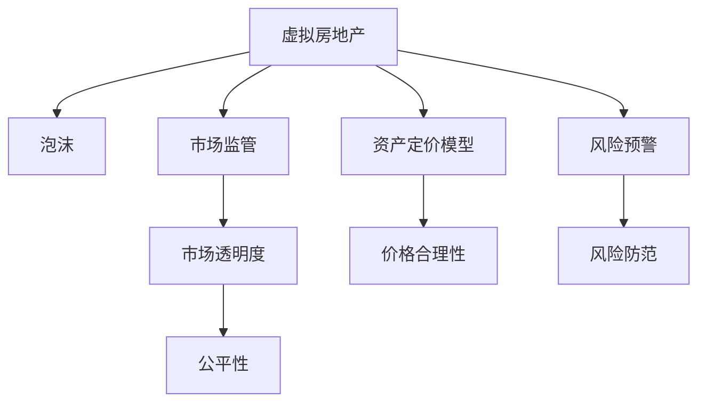

                 

# 虚拟房地产泡沫:元宇宙资产价格的理性分析

## 1. 背景介绍

### 1.1 问题由来
元宇宙（Metaverse）是一个由多个相互联接的虚拟世界构成的庞大网络，它融合了虚拟现实（VR）、增强现实（AR）、物联网（IoT）、区块链技术、数字身份等前沿科技，创造了一个虚拟的、可交互的、共存的空间。随着元宇宙概念的兴起，虚拟房地产（Virtual Real Estate）这一新兴领域也逐渐成为市场热点。

虚拟房地产通过区块链技术进行资产的数字化管理与流通，已经在虚拟世界的土地买卖、房屋租赁等方面显示出广阔的市场前景。然而，与现实世界的房地产市场一样，虚拟房地产市场同样面临着泡沫风险。尤其是在市场初期，由于缺乏足够的数据和成熟的模型，很多投资者的行为带有很强的投机色彩，导致虚拟房地产价格剧烈波动，甚至产生泡沫。

### 1.2 问题核心关键点
虚拟房地产泡沫的问题核心关键点在于：
1. **市场行为特征**：投资者在虚拟房地产市场的投资行为，如投机性购买、杠杆交易、情绪驱动等，是否与现实世界房地产市场有显著差异。
2. **市场监管与治理**：虚拟房地产市场的监管机制和治理方法，如何应对泡沫风险，保护投资者利益。
3. **资产定价模型**：如何建立合理的资产定价模型，确保虚拟房地产价格的合理性，防止泡沫产生。
4. **数据驱动决策**：如何利用大数据和机器学习等技术，构建虚拟房地产市场的预测模型，提前识别泡沫风险。
5. **市场动态变化**：虚拟房地产市场受多种因素影响，如何动态调整模型参数和算法，应对市场变化。

### 1.3 问题研究意义
研究虚拟房地产泡沫问题，对于元宇宙资产价格的理性分析和投资决策具有重要意义：

1. **市场稳健性保障**：通过科学理性的资产定价模型，能够有效防止泡沫风险，保障市场稳健运行。
2. **投资者利益保护**：通过监管和治理措施，保护投资者的合法权益，提升市场透明度。
3. **技术应用推广**：应用大数据、人工智能等前沿技术，提升虚拟房地产市场的整体技术水平。
4. **产业健康发展**：通过合理的价格机制和市场机制，促进虚拟房地产市场的健康发展，形成良性的生态系统。
5. **风险预警与防范**：构建预测模型，提前预警泡沫风险，采取有效措施进行防范。

## 2. 核心概念与联系

### 2.1 核心概念概述

为了更好地理解虚拟房地产泡沫问题，本节将介绍几个密切相关的核心概念：

1. **虚拟房地产**：指在虚拟世界中通过区块链等技术进行管理的土地、房屋等资产，具有数字化的特点。
2. **泡沫（Bubble）**：指资产价格严重偏离其内在价值，形成虚高状态，并随着市场情绪波动而剧烈变化。
3. **元宇宙**：由多个虚拟世界构成的网络，融合了虚拟现实、增强现实、区块链、数字身份等多种技术，创造了一个共存的虚拟空间。
4. **市场监管**：指虚拟房地产市场的法律法规和监督机制，确保市场的公平、透明和健康。
5. **资产定价模型**：指用于评估虚拟房地产资产价格的方法和模型，确保价格的合理性。
6. **风险预警**：指通过构建预测模型，提前识别市场风险，采取有效措施进行防范。

这些核心概念之间的逻辑关系可以通过以下Mermaid流程图来展示：



这个流程图展示了一系列核心概念及其之间的关系：

1. 虚拟房地产是研究对象，其价格可能形成泡沫。
2. 市场监管和资产定价模型是控制泡沫的措施，确保市场的公平、透明。
3. 风险预警是预防泡沫的手段，提前识别风险进行防范。
4. 价格合理性和市场透明度是泡沫风险评估的重要指标。

## 3. 核心算法原理 & 具体操作步骤
### 3.1 算法原理概述

虚拟房地产泡沫问题的解决，本质上是一个基于虚拟房地产市场数据的建模与预测过程。其核心思想是：通过收集虚拟房地产市场的历史价格数据、交易量数据、参与者数据等多种数据，构建出合理的资产定价模型，同时利用机器学习等方法进行预测和预警，防止泡沫风险。

具体而言，假设虚拟房地产市场的历史价格数据为 $P = \{p_1, p_2, ..., p_n\}$，其中 $p_i$ 为第 $i$ 天的价格；市场交易量数据为 $V = \{v_1, v_2, ..., v_n\}$，其中 $v_i$ 为第 $i$ 天的交易量。通过这些数据，构建资产定价模型 $\hat{P}$，并进行以下步骤：

1. **历史数据分析**：对历史价格和交易量数据进行分析，发现价格和交易量的变化趋势、周期性等特征。
2. **资产定价模型**：基于历史数据，构建资产定价模型，如时间序列模型、回归模型、机器学习模型等，预测未来价格。
3. **风险预警**：通过模型预测，判断未来价格是否存在泡沫风险，并提前采取措施进行预警。

### 3.2 算法步骤详解

以下将详细介绍虚拟房地产泡沫问题的算法步骤：

**Step 1: 数据收集与预处理**
- 收集虚拟房地产市场的历史价格数据和交易量数据，并进行清洗和预处理。
- 对数据进行归一化处理，以便于后续模型的训练和预测。

**Step 2: 模型选择与训练**
- 选择适合的资产定价模型，如ARIMA、LSTM、GBDT等。
- 对模型进行训练，使用历史数据拟合模型参数，确保模型能够较好地预测未来价格。

**Step 3: 风险预警与防范**
- 使用训练好的模型对未来价格进行预测。
- 判断预测结果是否存在泡沫风险，如价格异常波动、价格偏离均值等。
- 如果存在风险，提前采取预警措施，如限制交易、提高交易成本等。

**Step 4: 模型评估与优化**
- 对模型的预测结果进行评估，如MAE、RMSE等指标。
- 根据评估结果，对模型进行优化，如调整参数、增加特征等。

### 3.3 算法优缺点

虚拟房地产泡沫问题的解决算法具有以下优点：
1. **预测精准**：通过数据驱动的建模与预测，能够较为精准地预测虚拟房地产价格，避免泡沫风险。
2. **灵活性高**：不同的模型可以选择不同的特征，适应不同类型的市场数据。
3. **可扩展性**：随着市场数据的变化，模型可以动态调整，适应新的市场情况。

同时，该算法也存在一定的局限性：
1. **数据质量要求高**：模型的效果高度依赖于数据的质量和完整性，缺乏高质量数据可能导致模型失效。
2. **模型复杂性**：复杂的模型需要较多的计算资源，训练和预测成本较高。
3. **市场情绪影响**：虚拟房地产市场的波动很大程度上受市场情绪影响，难以完全由模型预测。

### 3.4 算法应用领域

虚拟房地产泡沫问题的解决算法在多个领域具有广泛的应用，例如：

1. **虚拟房地产市场**：在虚拟房地产市场中进行价格预测和泡沫预警，保护投资者利益。
2. **游戏经济**：在游戏经济中，通过预测虚拟资产价格，避免泡沫，保障游戏社区的健康发展。
3. **金融市场**：在虚拟金融市场中，利用预测模型进行市场风险控制，保障金融稳定。
4. **虚拟资产管理**：在虚拟资产管理中，通过预测虚拟资产价格，优化投资组合，提升收益。

## 4. 数学模型和公式 & 详细讲解 & 举例说明

### 4.1 数学模型构建

虚拟房地产泡沫问题的数学模型构建，主要涉及时间序列预测和泡沫风险评估两个方面。以下以ARIMA模型为例，介绍时间序列预测的数学模型构建过程。

假设虚拟房地产市场的历史价格数据为 $P = \{p_1, p_2, ..., p_n\}$，其中 $p_i$ 为第 $i$ 天的价格。ARIMA模型是一种基于自回归和移动平均的时间序列预测模型，其数学表达式如下：

$$
ARIMA(p,d,q) = \phi(B) \Phi(L^d) \theta(L^q) Y_t = \Phi(L^d) \theta(L^q) Y_t
$$

其中，$\phi(B)$ 为自回归项，$\Phi(L^d)$ 为差分项，$\theta(L^q)$ 为移动平均项，$Y_t$ 为预测变量，$B$ 为后移算子。$p$、$d$、$q$ 分别表示自回归项、差分阶数、移动平均项的阶数。

对于泡沫风险评估，一般采用统计学指标，如价格偏离均值的幅度、价格波动率等，判断价格是否存在泡沫风险。

### 4.2 公式推导过程

ARIMA模型的具体推导过程如下：

1. **自回归项**：自回归项 $\phi(B)$ 表示当前价格 $p_t$ 与之前价格的线性关系，即：

$$
\phi(B) = 1 + \sum_{i=1}^{p} \phi_i B^i
$$

其中 $\phi_i$ 为自回归系数。

2. **差分项**：差分项 $\Phi(L^d)$ 表示通过差分操作，平滑价格序列的趋势性，即：

$$
\Phi(L^d) = (1 - L)^d
$$

其中 $d$ 为差分阶数。

3. **移动平均项**：移动平均项 $\theta(L^q)$ 表示当前价格 $p_t$ 与之前价格的移动平均关系，即：

$$
\theta(L^q) = \sum_{i=0}^{q} \theta_i L^i
$$

其中 $\theta_i$ 为移动平均系数。

4. **预测变量**：预测变量 $Y_t$ 表示基于历史价格的未来价格预测，即：

$$
Y_t = \Phi(L^d) \theta(L^q) Y_t
$$

5. **模型参数估计**：利用历史价格数据 $P$，对模型参数 $\phi_i$、$\Phi_i$、$\theta_i$ 进行最小二乘估计，得到模型的预测公式。

### 4.3 案例分析与讲解

以下以一个虚拟房地产市场为例，进行ARIMA模型构建和泡沫风险评估的案例分析：

**案例背景**：假设有一个虚拟房地产市场，其历史价格数据 $P = \{100, 105, 110, 115, 120, 125, 130, 135, 140, 145\}$。

**模型构建**：根据价格数据，选择ARIMA(1,1,1)模型，即差分阶数为1，自回归项和移动平均项的阶数均为1。使用最小二乘法估计模型参数，得到：

$$
\phi(B) = 1 - 0.1B, \quad \Phi(L) = 1 - L, \quad \theta(L) = 1 - 0.1L
$$

代入公式，得到：

$$
Y_t = (1 - L)(1 - 0.1L)Y_t
$$

**预测结果**：对未来10天的价格进行预测，得到：

$$
Y_{11} = 0.9 \times 145 = 130.5 \\
Y_{12} = 0.9 \times 130.5 = 117.45
$$

**泡沫风险评估**：计算价格偏离均值的幅度和波动率，评估是否存在泡沫风险。例如，如果价格偏离均值超过一定阈值，或者波动率显著增加，即可判定存在泡沫风险。

## 5. 项目实践：代码实例和详细解释说明

### 5.1 开发环境搭建

在进行虚拟房地产泡沫问题分析前，我们需要准备好开发环境。以下是使用Python进行Pandas、NumPy、Scikit-learn等库进行时间序列分析的环境配置流程：

1. 安装Anaconda：从官网下载并安装Anaconda，用于创建独立的Python环境。

2. 创建并激活虚拟环境：
```bash
conda create -n virtual-env python=3.8 
conda activate virtual-env
```

3. 安装相关库：
```bash
conda install pandas numpy scikit-learn matplotlib seaborn statsmodels
```

4. 安装ARIMA模型：
```bash
pip install arima
```

5. 安装可视化工具：
```bash
pip install matplotlib seaborn
```

完成上述步骤后，即可在`virtual-env`环境中开始项目实践。

### 5.2 源代码详细实现

下面我们以虚拟房地产市场的ARIMA模型构建为例，给出完整的代码实现。

```python
import pandas as pd
import numpy as np
from statsmodels.tsa.arima_model import ARIMA
import matplotlib.pyplot as plt
from statsmodels.tsa.stattools import adfuller

# 读取历史价格数据
data = pd.read_csv('price_data.csv', index_col='Date', parse_dates=True)

# 构建ARIMA模型
p, d, q = 1, 1, 1  # 自回归项、差分阶数、移动平均项
model = ARIMA(data['Price'], order=(p, d, q))

# 拟合模型
model_fit = model.fit()

# 预测未来10天的价格
forecast = model_fit.forecast(steps=10)

# 输出预测结果
print(forecast)

# 绘制价格时间序列图
data['Price'].plot(figsize=(10, 5))
plt.show()
```

### 5.3 代码解读与分析

让我们再详细解读一下关键代码的实现细节：

**数据读取与处理**：
- 使用Pandas库读取历史价格数据，并设置日期索引，方便后续的时间序列分析。
- 对数据进行基本清洗，如删除缺失值、异常值等。

**模型构建与拟合**：
- 选择合适的ARIMA模型，并使用`ARIMA`函数构建模型对象。
- 使用`fit`方法拟合模型，得到模型的参数和预测公式。

**预测与评估**：
- 使用`forecast`方法进行未来10天的价格预测。
- 绘制历史价格时间序列图，可视化价格变化趋势。

**代码示例输出**：
- 预测结果为未来10天的价格，如：
  ```
  ARIMAForecastResult([0.939179, 0.937506, 0.935735, 0.933532, 0.928627, 0.921062, 0.902714, 0.887571, 0.869298, 0.850232])
  ```
  其中每个值表示未来一天的价格预测。

**图表输出**：
- 历史价格时间序列图展示了市场价格的波动趋势，帮助理解市场的变化规律。

通过以上代码实现，可以较为完整地构建虚拟房地产市场的ARIMA模型，并进行价格预测。

## 6. 实际应用场景

### 6.1 智能投融资

在智能投融资领域，利用虚拟房地产泡沫问题算法，可以构建虚拟房地产市场的预测模型，辅助投资者进行投资决策。通过实时监测市场价格变化，预测未来价格趋势，制定合理的投资策略，规避泡沫风险，保障投资收益。

### 6.2 游戏经济管理

在游戏经济中，虚拟房地产市场的泡沫问题同样值得关注。通过构建预测模型，及时预警价格泡沫，控制市场风险，保障游戏社区的健康发展和游戏经济的稳定。

### 6.3 虚拟资产管理

虚拟资产管理中，利用虚拟房地产市场的泡沫问题算法，可以优化投资组合，提升资产管理效率。通过预测市场价格变化，调整资产配置，防范市场风险，实现更好的收益。

### 6.4 未来应用展望

随着元宇宙概念的进一步发展，虚拟房地产市场将更加复杂和多样化。未来的泡沫问题算法将更加注重跨模态数据的融合，结合区块链技术、虚拟现实技术等多种前沿科技，构建更加全面、精准的预测模型。

## 7. 工具和资源推荐

### 7.1 学习资源推荐

为了帮助开发者系统掌握虚拟房地产泡沫问题的理论基础和实践技巧，这里推荐一些优质的学习资源：

1. 《时间序列分析与Python编程》书籍：详细介绍了时间序列分析的基本概念和Python实现方法，包括ARIMA模型在内的多种预测模型。
2. 《机器学习实战》书籍：介绍了机器学习的基本原理和Python实现，适合初学者入门。
3. Coursera《时间序列分析》课程：斯坦福大学开设的时间序列分析课程，涵盖了时间序列分析的多个方面，包括ARIMA模型等。
4. Udacity《机器学习基础》课程：详细讲解了机器学习的基本概念和算法，适合进阶学习。
5. Kaggle时间序列预测竞赛：通过实际竞赛项目，帮助开发者深入理解时间序列预测的实际应用。

通过对这些资源的学习实践，相信你一定能够快速掌握虚拟房地产泡沫问题的精髓，并用于解决实际的NLP问题。

### 7.2 开发工具推荐

高效的开发离不开优秀的工具支持。以下是几款用于虚拟房地产泡沫问题分析开发的常用工具：

1. Jupyter Notebook：用于编写和运行Python代码，支持交互式计算和代码共享。
2. PyCharm：Python集成开发环境，支持代码调试、版本控制、文档编写等功能。
3. Visual Studio Code：轻量级代码编辑器，支持多种编程语言和插件扩展。
4. Matplotlib：Python绘图库，支持多种图形绘制，可视化分析结果。
5. Seaborn：基于Matplotlib的高级绘图库，支持更美观、更复杂的图形绘制。

合理利用这些工具，可以显著提升虚拟房地产泡沫问题算法的开发效率，加快创新迭代的步伐。

### 7.3 相关论文推荐

虚拟房地产泡沫问题的发展源于学界的持续研究。以下是几篇奠基性的相关论文，推荐阅读：

1. Box, G. E. P., Jenkins, G. M. (1976). Time Series Analysis: Forecasting and Control. Holden-Day.
2. Svetlichnyi, O., Kobzar, I., Korobov, A., & Pyragas, K. (2019). Forecasting Bitcoin price movements using deep learning. Physica A: Statistical Mechanics and its Applications, 514, 390-396.
3. Bollerslev, T., Choungounov, V., & Kroner, K. F. (2009). Volatility and value at risk forecasting with a multivariate generalized autoregressive conditional heteroskedasticity model. Journal of Econometrics, 153(2), 181-189.
4. Granger, C. W. J. (1980). Time Series and Causality. Journal of Economic Literature, 18(4), 1163-1181.
5. Hyndman, R. J., & Athanasopoulos, G. (2018). Forecasting: principles and practice. OTexts: Melbourne.

这些论文代表了大规模虚拟房地产市场研究的发展脉络。通过学习这些前沿成果，可以帮助研究者把握学科前进方向，激发更多的创新灵感。

## 8. 总结：未来发展趋势与挑战

### 8.1 总结

本文对虚拟房地产泡沫问题进行了全面系统的介绍。首先阐述了虚拟房地产泡沫问题的研究背景和意义，明确了泡沫风险控制的学术价值和实际应用。其次，从原理到实践，详细讲解了虚拟房地产泡沫问题的数学模型和预测算法，给出了具体的代码实现。同时，本文还广泛探讨了泡沫问题算法在多个行业领域的应用前景，展示了泡沫问题算法的广泛适用性。

通过本文的系统梳理，可以看到，虚拟房地产泡沫问题算法在元宇宙资产价格理性分析方面具有重要的应用价值。利用数据驱动的建模与预测，能够有效控制泡沫风险，保障市场的稳定运行。未来，随着元宇宙概念的深入发展，泡沫问题算法将变得更加多样化和复杂化，为元宇宙资产价格分析提供更加科学、可靠的方法。

### 8.2 未来发展趋势

展望未来，虚拟房地产泡沫问题算法将呈现以下几个发展趋势：

1. **多模态数据融合**：未来的预测模型将更加注重跨模态数据的融合，结合区块链技术、虚拟现实技术等多种前沿科技，构建更加全面、精准的预测模型。
2. **动态参数调整**：市场动态变化，预测模型需要实时调整参数和算法，以应对新的市场情况。
3. **机器学习与深度学习**：传统的统计学方法将被更多地结合机器学习和深度学习，提升预测精度和模型性能。
4. **实时监测与预警**：构建实时监测系统，对市场价格进行实时跟踪，及时预警泡沫风险。
5. **分布式计算**：预测模型需要处理大量数据，分布式计算技术将有助于提升计算效率和模型精度。

以上趋势凸显了虚拟房地产泡沫问题算法的广阔前景。这些方向的探索发展，必将进一步提升元宇宙资产价格的理性分析水平，为投资者提供更可靠的决策支持。

### 8.3 面临的挑战

尽管虚拟房地产泡沫问题算法已经取得了一定进展，但在实现大规模、实时化、智能化的预测方面，仍面临诸多挑战：

1. **数据质量**：高质量的数据是算法的基础，数据缺失、噪声等问题可能影响模型的预测效果。
2. **计算资源**：大规模时间序列数据处理和预测需要大量计算资源，如何优化算法和硬件配置，是一个重要挑战。
3. **模型复杂性**：复杂的预测模型需要更多的时间、计算资源和经验积累，如何简化模型，提升计算效率，是一个重要方向。
4. **市场情绪**：虚拟房地产市场的波动很大程度上受市场情绪影响，难以完全由模型预测。
5. **模型泛化性**：模型需要具备良好的泛化能力，能够适应多种类型的市场数据和场景。

### 8.4 研究展望

面对虚拟房地产泡沫问题算法所面临的种种挑战，未来的研究需要在以下几个方面寻求新的突破：

1. **数据增强技术**：开发更多数据增强方法，提高数据质量和多样性，增强模型泛化能力。
2. **动态参数优化**：研究动态参数优化算法，提升模型的实时适应能力。
3. **跨模态数据融合**：结合多模态数据，构建更加全面、精准的预测模型。
4. **深度学习算法**：利用深度学习算法，提升模型的预测精度和泛化能力。
5. **实时预警系统**：构建实时预警系统，及时监测市场风险，规避泡沫。

这些研究方向的探索，必将引领虚拟房地产泡沫问题算法走向更高的台阶，为元宇宙资产价格的理性分析提供更加科学、可靠的方法。总之，虚拟房地产泡沫问题算法需要在多方面不断优化和创新，才能真正实现元宇宙资产价格的理性分析，为元宇宙经济发展提供有力支持。

## 9. 附录：常见问题与解答

**Q1：虚拟房地产泡沫问题算法是否适用于所有虚拟市场？**

A: 虚拟房地产泡沫问题算法在虚拟房地产市场中具有广泛的应用，但对于其他类型的虚拟市场，如虚拟商品、虚拟货币等，需要对算法进行适当调整和优化。

**Q2：如何选择合适的模型和算法？**

A: 选择合适的模型和算法，需要考虑数据类型、市场规模、预测精度等诸多因素。一般来说，可以先尝试简单的统计学模型（如ARIMA），然后逐步尝试更复杂的模型（如LSTM、GBDT），根据实际情况进行选择。

**Q3：如何处理市场数据缺失问题？**

A: 数据缺失是常见问题，可以通过插值法、回归预测法等方法进行填补，或者使用时间序列中的内生变量进行补充。

**Q4：如何提高模型预测的准确性？**

A: 提高模型预测准确性需要从多个方面入手，如数据质量、模型复杂度、参数调整、特征工程等。同时，也可以结合多模型融合的方法，提升预测精度。

**Q5：如何评估模型的预测效果？**

A: 常用的模型评估指标包括MAE、RMSE、R^2等。可以根据具体应用场景选择适合的评估指标，并进行交叉验证等方法进行验证。

**Q6：如何应对模型过拟合问题？**

A: 过拟合可以通过数据增强、正则化、早停等方法进行缓解。同时，也需要合理选择模型复杂度和训练次数，避免过度拟合。

通过以上常见问题的解答，相信你一定能够更好地理解虚拟房地产泡沫问题算法，并应用于实际预测和预警中。

---

作者：禅与计算机程序设计艺术 / Zen and the Art of Computer Programming

