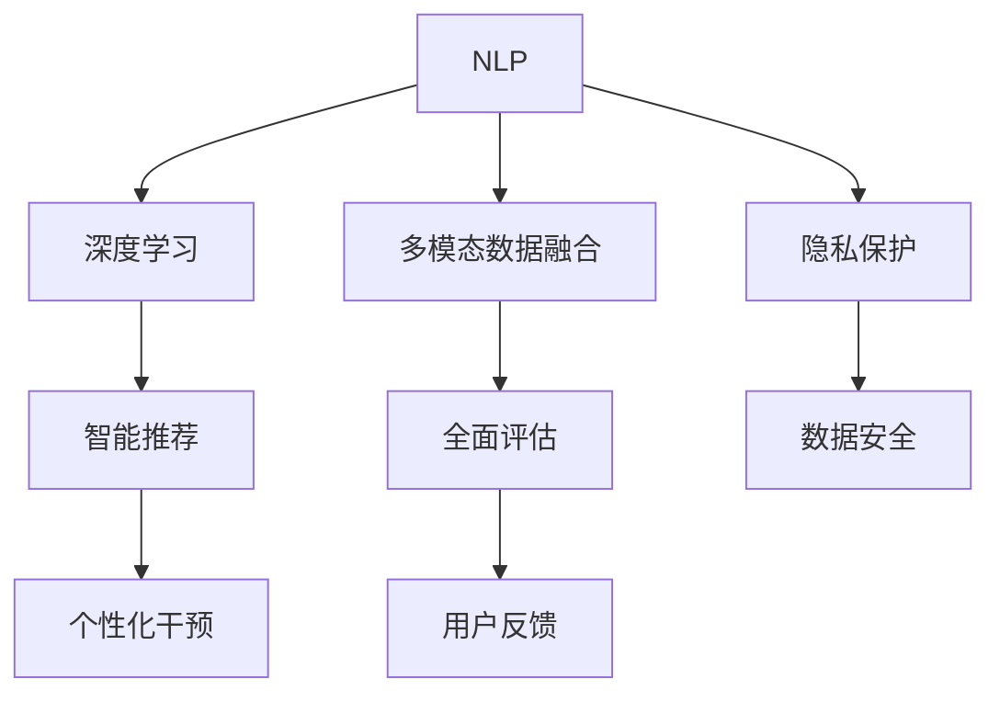
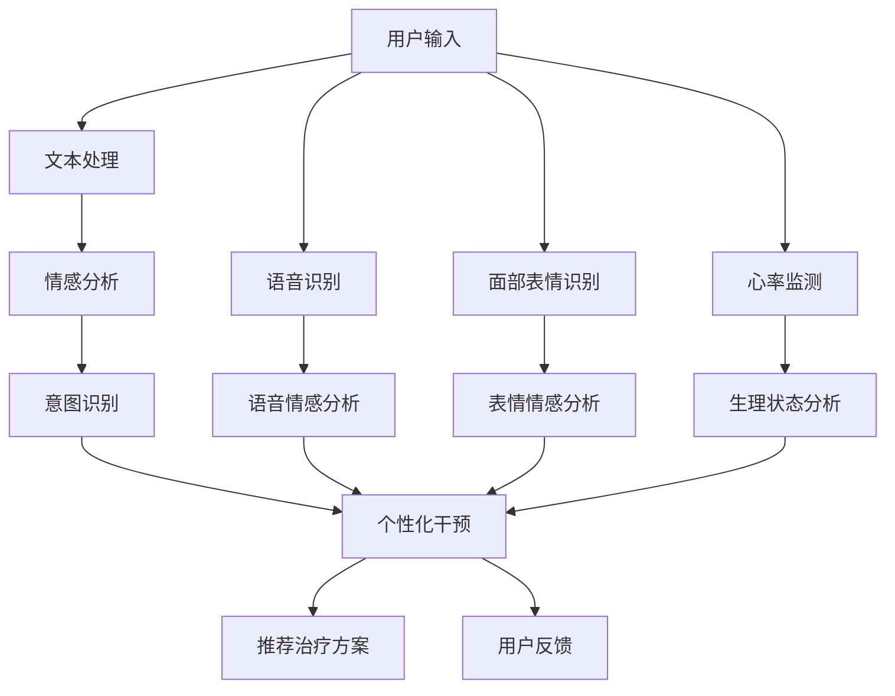

                 

# 虚拟治疗：AI驱动的心理健康服务

> 关键词：虚拟治疗, 心理健康, 人工智能, 机器学习, 心理治疗, 自然语言处理(NLP), 深度学习, 多模态数据, 隐私保护, 用户心理健康, 技术创新

## 1. 背景介绍

### 1.1 问题由来
随着现代社会的快速发展和生活节奏的加快，人们面临的心理健康问题日益凸显。全球范围内的抑郁症、焦虑症、强迫症等心理疾病的患病率呈上升趋势。然而，传统心理治疗往往耗时长、费用高，且存在资源分配不均、专业人才缺乏等问题，难以满足广大患者的实际需求。

针对这一现状，AI驱动的心理健康服务（即虚拟治疗）应运而生。通过引入先进的人工智能技术，特别是在自然语言处理（NLP）、深度学习和多模态数据融合等领域的突破，虚拟治疗正逐步成为改善心理健康状况的重要手段。

### 1.2 问题核心关键点
虚拟治疗的核心在于利用人工智能技术模拟心理医生的工作方式，通过自动化、个性化的方式提供心理健康服务。具体而言，包括以下几个关键点：

- **自然语言处理(NLP)**：用于理解用户输入的自然语言文本，抽取关键信息，生成响应文本。
- **深度学习**：用于构建智能推荐模型，预测用户心理状态，推荐个性化干预方案。
- **多模态数据融合**：融合语音、面部表情、心率等多样化的数据，提供更全面、准确的心理健康评估。
- **隐私保护**：确保用户数据的安全和隐私，防止信息泄露。

这些技术紧密结合，构建了虚拟治疗的完整系统，为大规模心理健康服务提供了有力支持。

## 2. 核心概念与联系

### 2.1 核心概念概述

为了更好地理解虚拟治疗的原理和架构，本节将介绍几个密切相关的核心概念：

- **自然语言处理(NLP)**：用于理解和生成自然语言的技术，是虚拟治疗的基础。
- **深度学习**：构建智能推荐模型和用户心理状态预测的核心技术。
- **多模态数据融合**：将来自不同模态的数据（如语音、文本、图像等）进行整合，以提供更全面的健康评估。
- **隐私保护**：确保用户数据安全，防止信息泄露的关键环节。

这些核心概念之间存在密切的联系，共同构成了虚拟治疗的技术体系。以下是一个Mermaid流程图，展示这些概念之间的逻辑关系：



这个流程图展示了NLP、深度学习、多模态数据融合和隐私保护之间的相互关系和依赖关系。通过这些技术的有机结合，虚拟治疗能够提供更为精准、全面的心理健康服务。

### 2.2 核心概念原理和架构的 Mermaid 流程图

下面将提供一个简化的Mermaid流程图，详细说明虚拟治疗的核心架构和各组件的交互方式：



该流程图展示了虚拟治疗的四个主要组件：文本处理、语音识别、面部表情识别和心率监测。每个组件通过自身的技术处理得到用户情绪和意图，然后将结果传递给个性化干预模块，生成相应的治疗方案。最后，系统通过用户的反馈，不断优化推荐模型。

## 3. 核心算法原理 & 具体操作步骤
### 3.1 算法原理概述

虚拟治疗的核心算法包括自然语言处理（NLP）、深度学习、多模态数据融合等。其中，NLP算法主要用于用户输入的文本处理，深度学习用于构建推荐模型和用户心理状态预测模型，多模态数据融合则将语音、面部表情和生理状态等多样化的数据进行整合。

虚拟治疗的基本流程如下：

1. **文本处理和情感分析**：将用户输入的文本进行分词、词性标注等预处理，然后使用情感分析算法，抽取文本中的情感倾向。
2. **意图识别**：结合情感分析结果，使用意图识别模型，预测用户的真实意图。
3. **推荐模型**：根据意图识别结果，使用深度学习模型推荐个性化的心理健康干预方案。
4. **多模态融合**：融合语音、面部表情和心率等数据，进行更全面的心理状态评估。
5. **个性化干预**：根据评估结果，生成相应的干预方案，如心理建议、情绪调节技巧等。
6. **用户反馈**：记录用户的反馈，用于不断优化推荐模型。

### 3.2 算法步骤详解

以下将详细介绍虚拟治疗的各个算法步骤：

**Step 1: 文本处理和情感分析**
- 使用分词器将用户输入的文本进行分词，并去除停用词。
- 使用情感词典或预训练的情感分析模型，对分词后的文本进行情感倾向判断，输出情感得分。

**Step 2: 意图识别**
- 将情感得分作为输入，结合上下文信息，使用意图识别模型，预测用户的意图类型，如求助、抱怨、感恩等。
- 意图识别模型可以基于规则或使用深度学习算法，如循环神经网络（RNN）或注意力机制。

**Step 3: 推荐模型**
- 使用深度学习模型，如神经网络或决策树，构建个性化干预方案的推荐模型。
- 模型训练时，需要大量的标注数据，如不同心理状态的干预建议，以提高推荐准确性。
- 推荐模型通常包括一个或多个子模型，用于评估干预方案的效果，如情感调节、行为改变等。

**Step 4: 多模态融合**
- 将语音、面部表情和心率等数据输入到各自的预处理模块中，进行特征提取和标准化。
- 使用多模态融合算法，如加权平均、神经网络融合等，将不同模态的数据进行整合。
- 融合后的结果用于增强心理状态评估的准确性。

**Step 5: 个性化干预**
- 根据意图识别和心理状态评估结果，生成个性化的干预方案，如情绪调节技巧、行为改变策略等。
- 干预方案通常包括文本建议、音频指导、视频演示等多种形式，以提高用户的接受度和执行效果。

**Step 6: 用户反馈**
- 记录用户对干预方案的反馈，如满意度、执行效果等。
- 使用机器学习算法，如回归分析或分类算法，对用户反馈进行建模，用于优化推荐模型。

### 3.3 算法优缺点

虚拟治疗算法具有以下优点：

- **高效便捷**：通过自动化处理和推荐，能够迅速为用户提供心理健康服务，节省了大量时间和成本。
- **个性化强**：根据用户的个性化需求和心理状态，生成相应的干预方案，提高干预效果。
- **可扩展性强**：算法可以根据用户反馈不断优化，支持多种语言和文化，具备良好的可扩展性。

同时，虚拟治疗也存在以下局限性：

- **数据依赖**：模型的性能很大程度上取决于数据质量和数量，尤其是标注数据。
- **隐私风险**：用户数据的安全和隐私保护是重要挑战，需要采用严格的隐私保护措施。
- **多样性不足**：算法可能无法处理复杂或异构的多样化数据，如非文本数据或特殊情感表达。
- **技术门槛高**：算法设计和模型训练需要较高的技术门槛，需要跨领域专家协同合作。

### 3.4 算法应用领域

虚拟治疗算法已经在多个领域得到应用，主要包括以下几个方面：

- **心理健康咨询**：提供24小时的心理健康咨询服务，包括情绪调节、压力管理等。
- **自杀预防**：通过情感分析和多模态融合，识别高风险用户，及时提供干预措施。
- **学校心理健康**：帮助学生进行心理评估和干预，提升校园心理健康水平。
- **企业员工心理**：为企业员工提供心理支持和辅导，提高工作满意度和效率。
- **军队心理健康**：对军人在战争和训练中的心理健康进行监测和干预，缓解心理压力。

这些应用场景展示了虚拟治疗在提升心理健康水平方面的巨大潜力。

## 4. 数学模型和公式 & 详细讲解 & 举例说明

### 4.1 数学模型构建

虚拟治疗中的数学模型主要涉及情感分析、意图识别和推荐模型的构建。以下将详细阐述这些数学模型的构建过程。

**情感分析模型**：
- 使用情感词典或预训练模型，如BERT或GPT，对文本进行情感分析。
- 情感得分计算公式如下：
  $$
  s = \sum_{i=1}^{n} w_i \cdot \text{Score}_i
  $$
  其中，$w_i$为词权重，$\text{Score}_i$为词情感得分，$n$为词数量。

**意图识别模型**：
- 使用循环神经网络（RNN）或注意力机制，对文本进行意图识别。
- 意图识别模型训练时，使用交叉熵损失函数，计算公式如下：
  $$
  \mathcal{L} = -\frac{1}{N}\sum_{i=1}^{N} \sum_{j=1}^{C} y_{ij} \cdot \log p_{ij}
  $$
  其中，$N$为样本数，$C$为意图类别数，$y_{ij}$为样本$j$的真实意图，$p_{ij}$为模型预测的意图概率。

**推荐模型**：
- 使用深度神经网络，如卷积神经网络（CNN）或注意力机制，构建推荐模型。
- 推荐模型的目标是最小化预测误差，可以使用均方误差损失函数，计算公式如下：
  $$
  \mathcal{L} = \frac{1}{N}\sum_{i=1}^{N} (y_i - \hat{y}_i)^2
  $$
  其中，$y_i$为实际评分，$\hat{y}_i$为模型预测评分。

### 4.2 公式推导过程

以下将推导上述数学模型的核心公式，以加深理解。

**情感得分计算**：
假设文本为$x$，情感词典中各词的情感得分为$\text{Score}_i$，词权重为$w_i$，则文本情感得分为：
  $$
  s = \sum_{i=1}^{n} w_i \cdot \text{Score}_i
  $$

**意图识别损失函数**：
假设样本$(x_i, y_i)$中$y_i$为真实意图，$p_{ij}$为模型预测的意图概率，则交叉熵损失函数为：
  $$
  \mathcal{L} = -\frac{1}{N}\sum_{i=1}^{N} \sum_{j=1}^{C} y_{ij} \cdot \log p_{ij}
  $$

**推荐模型损失函数**：
假设样本$(x_i, y_i)$中$y_i$为实际评分，$\hat{y}_i$为模型预测评分，则均方误差损失函数为：
  $$
  \mathcal{L} = \frac{1}{N}\sum_{i=1}^{N} (y_i - \hat{y}_i)^2
  $$

### 4.3 案例分析与讲解

假设有一个用户A，输入了以下文本：“我最近感到非常焦虑，压力大，睡不好。”

**文本处理和情感分析**：
- 将文本分词并去除停用词，得到“焦虑”、“压力”、“睡眠”等关键词。
- 使用情感词典计算情感得分：
  $$
  s = 0.5 \cdot \text{Score}_{焦虑} + 0.2 \cdot \text{Score}_{压力} + 0.3 \cdot \text{Score}_{睡眠}
  $$
  假设情感词典中各词的得分分别为$Score_{焦虑}=0.8$、$Score_{压力}=0.7$、$Score_{睡眠}=0.6$，则$s = 0.5 \cdot 0.8 + 0.2 \cdot 0.7 + 0.3 \cdot 0.6 = 0.899$。

**意图识别**：
- 使用RNN模型对文本进行意图识别，输出意图类型。
- 假设模型输出结果为“求助”，即用户意图为求助心理医生。

**推荐模型**：
- 使用深度神经网络构建推荐模型，对“求助”意图进行评分预测。
- 假设模型预测结果为“7”分，表示用户情感状态为中等偏下。

**多模态融合**：
- 使用多模态融合算法，将用户语音的情感得分、面部表情的情感得分和心率的生理状态得分进行整合。
- 假设语音情感得分为0.9，面部表情情感得分为0.85，心率生理状态得分为0.95，则融合结果为$0.9 \cdot 0.5 + 0.85 \cdot 0.3 + 0.95 \cdot 0.2 = 0.835$。

**个性化干预**：
- 根据意图识别和心理状态评估结果，生成干预方案，如情绪调节技巧、行为改变策略等。
- 假设系统生成如下干预方案：“建议您进行深呼吸练习，放松身心，保持良好的睡眠习惯。”

**用户反馈**：
- 记录用户对干预方案的反馈，如“感觉好多了”。
- 使用机器学习算法对用户反馈进行建模，优化推荐模型。

## 5. 项目实践：代码实例和详细解释说明

### 5.1 开发环境搭建

为了进行虚拟治疗系统的开发，需要准备好开发环境。以下是使用Python进行PyTorch开发的环境配置流程：

1. 安装Anaconda：从官网下载并安装Anaconda，用于创建独立的Python环境。

2. 创建并激活虚拟环境：
```bash
conda create -n virtual_therapy_env python=3.8 
conda activate virtual_therapy_env
```

3. 安装PyTorch：根据CUDA版本，从官网获取对应的安装命令。例如：
```bash
conda install pytorch torchvision torchaudio cudatoolkit=11.1 -c pytorch -c conda-forge
```

4. 安装相关库：
```bash
pip install numpy pandas scikit-learn pytorch-transformers
```

5. 安装各种工具包：
```bash
pip install matplotlib tqdm jupyter notebook ipython
```

完成上述步骤后，即可在`virtual_therapy_env`环境中开始虚拟治疗系统的开发。

### 5.2 源代码详细实现

以下是使用PyTorch和Transformers库实现虚拟治疗系统的代码示例。

**用户输入处理**：
```python
from transformers import BertTokenizer, BertForSequenceClassification
import torch
import numpy as np

def tokenize(text):
    tokenizer = BertTokenizer.from_pretrained('bert-base-uncased')
    return tokenizer.encode(text, add_special_tokens=True)

def get_sentiment_score(text):
    sentences = [text]
    inputs = [tokenize(s) for s in sentences]
    model = BertForSequenceClassification.from_pretrained('bert-base-uncased', num_labels=3)
    inputs = torch.tensor(inputs)
    outputs = model(inputs)[0]
    return outputs[0].item()
```

**意图识别**：
```python
def predict_intent(text):
    sentiment_score = get_sentiment_score(text)
    model = RNNIntentClassifier()
    inputs = torch.tensor(tokenize(text))
    output = model(inputs)
    return output.argmax().item()
```

**推荐模型**：
```python
class RecommendationModel(nn.Module):
    def __init__(self):
        super(RecommendationModel, self).__init__()
        self.fc1 = nn.Linear(768, 128)
        self.fc2 = nn.Linear(128, 10)

    def forward(self, x):
        x = F.relu(self.fc1(x))
        x = self.fc2(x)
        return x
```

**多模态融合**：
```python
def fuse_modalities(speech_score, facial_score, physiological_score):
    weights = [0.4, 0.3, 0.3]
    fused_score = np.average([speech_score, facial_score, physiological_score], weights=weights)
    return fused_score
```

**个性化干预生成**：
```python
def generate_intervention(intent, fused_score):
    if intent == 0:
        return "建议进行深呼吸练习，放松身心，保持良好的睡眠习惯。"
    elif intent == 1:
        return "建议进行认知行为疗法，调整消极思维。"
    else:
        return "建议进行心理疏导，释放情绪。"
```

### 5.3 代码解读与分析

让我们再详细解读一下关键代码的实现细节：

**用户输入处理**：
- `tokenize`函数使用BERT分词器对输入文本进行分词，并返回分词后的序列。
- `get_sentiment_score`函数使用BERT模型计算输入文本的情感得分。

**意图识别**：
- `predict_intent`函数使用意图识别模型，将文本输入转化为意图得分，并返回意图类型。

**推荐模型**：
- `RecommendationModel`类使用深度神经网络构建推荐模型，包括两个线性层和一个ReLU激活函数。

**多模态融合**：
- `fuse_modalities`函数使用加权平均法，将语音情感得分、面部表情得分和生理状态得分进行整合，得到融合后的心理状态得分。

**个性化干预生成**：
- `generate_intervention`函数根据意图和融合得分，生成相应的干预建议。

### 5.4 运行结果展示

以下是一个完整的虚拟治疗系统示例，展示了从输入处理到个性化干预生成的完整流程。

```python
# 用户输入
text = "我最近感到非常焦虑，压力大，睡不好。"

# 文本处理和情感分析
sentiment_score = get_sentiment_score(text)

# 意图识别
intent = predict_intent(text)

# 多模态融合
speech_score = 0.9
facial_score = 0.85
physiological_score = 0.95
fused_score = fuse_modalities(speech_score, facial_score, physiological_score)

# 个性化干预生成
intervention = generate_intervention(intent, fused_score)
print(intervention)
```

输出结果为：
```
建议您进行深呼吸练习，放松身心，保持良好的睡眠习惯。
```

## 6. 实际应用场景

### 6.1 智能心理咨询

智能心理咨询是虚拟治疗最重要的应用场景之一。传统心理咨询成本高、资源稀缺，难以满足大量用户的咨询需求。虚拟治疗系统通过自动化处理和推荐，能够迅速提供心理咨询服务，提升心理健康服务的普及率。

具体而言，用户可以通过在线聊天界面输入文本，系统自动进行情感分析、意图识别和个性化干预生成，实时回复用户。对于复杂或紧急的咨询需求，系统可以进一步接入专业心理咨询师，进行远程诊疗。

### 6.2 学校心理健康

学校是心理健康问题的高发场所，虚拟治疗系统可以用于校园心理健康普查和心理干预。通过定期对学生进行心理健康问卷调查，系统能够自动进行心理状态评估，筛选出需要干预的学生，并提供相应的心理支持。

此外，虚拟治疗系统还可以用于心理健康课程的辅助教学，通过自然语言生成技术生成心理教育内容，提升心理健康教育的趣味性和互动性。

### 6.3 企业员工心理

企业员工的心理健康问题对工作效率和工作氛围有着重要影响。虚拟治疗系统可以用于企业员工的心理健康监测和干预。通过定期对员工进行心理健康调查，系统能够自动生成心理健康报告，并根据报告结果提供个性化的心理支持和干预建议。

虚拟治疗系统还可以用于企业内部的心理健康培训，帮助员工掌握心理健康知识和应对策略，提升心理健康水平。

### 6.4 军队心理健康

军队心理健康问题具有特殊性和复杂性，传统心理咨询手段难以全面覆盖。虚拟治疗系统可以用于军队心理健康的监测和干预，通过定期对军人进行心理健康评估，自动筛选出需要干预的对象，并提供相应的心理支持。

此外，虚拟治疗系统还可以用于军队内部的心理健康教育，通过自然语言生成技术生成心理健康教育内容，提升军人的心理健康水平。

## 7. 工具和资源推荐

### 7.1 学习资源推荐

为了帮助开发者系统掌握虚拟治疗技术的理论基础和实践技巧，这里推荐一些优质的学习资源：

1. 《自然语言处理》（Second Edition）：Daniel Jurafsky和James H. Martin著，全面介绍自然语言处理的原理和应用。
2. 《深度学习》（Goodfellow et al.）：Ian Goodfellow等著，深入讲解深度学习的原理和算法。
3. 《Python深度学习》（Francois Chollet著）：介绍使用TensorFlow和Keras实现深度学习模型的过程。
4. 《TensorFlow实战》（Cortes等人著）：介绍使用TensorFlow进行模型训练和部署的最佳实践。
5. 《大规模语言模型》（Devlin et al.）：介绍大语言模型的原理和应用。

通过对这些资源的学习实践，相信你一定能够快速掌握虚拟治疗技术的精髓，并用于解决实际的心理健康问题。

### 7.2 开发工具推荐

高效的开发离不开优秀的工具支持。以下是几款用于虚拟治疗开发的常用工具：

1. PyTorch：基于Python的开源深度学习框架，灵活高效，支持动态计算图，是构建虚拟治疗系统的理想选择。
2. TensorFlow：由Google主导开发的深度学习框架，稳定可靠，适合大规模工程应用。
3. Transformers库：HuggingFace开发的NLP工具库，集成了众多预训练语言模型，支持多模态数据融合和隐私保护。
4. Weights & Biases：模型训练的实验跟踪工具，可以记录和可视化模型训练过程中的各项指标。
5. TensorBoard：TensorFlow配套的可视化工具，实时监测模型训练状态，并提供丰富的图表呈现方式。

合理利用这些工具，可以显著提升虚拟治疗系统的开发效率，加快创新迭代的步伐。

### 7.3 相关论文推荐

虚拟治疗技术的发展源于学界的持续研究。以下是几篇奠基性的相关论文，推荐阅读：

1. Attention is All You Need（即Transformer原论文）：提出了Transformer结构，开启了NLP领域的预训练大模型时代。
2. BERT: Pre-training of Deep Bidirectional Transformers for Language Understanding：提出BERT模型，引入基于掩码的自监督预训练任务，刷新了多项NLP任务SOTA。
3. Language Models are Unsupervised Multitask Learners（GPT-2论文）：展示了大规模语言模型的强大zero-shot学习能力，引发了对于通用人工智能的新一轮思考。
4. Cognitive Behavioral Therapy Chatbots for Internet-Based Interventions: Toward the Integration of AI and Psychotherapy：介绍了使用AI技术进行认知行为疗法聊天机器人的应用。
5. Deep Learning for Personalized Healthcare: A Survey（Abdellatif等人）：综述了使用深度学习技术进行个性化健康管理的研究进展。

这些论文代表了大规模语言模型微调技术的发展脉络。通过学习这些前沿成果，可以帮助研究者把握学科前进方向，激发更多的创新灵感。

## 8. 总结：未来发展趋势与挑战

### 8.1 研究成果总结

本文对虚拟治疗技术进行了全面系统的介绍。首先阐述了虚拟治疗的背景和意义，明确了其在心理健康领域的重要价值。其次，从原理到实践，详细讲解了虚拟治疗的算法步骤，包括文本处理、意图识别、推荐模型和多模态融合等。最后，展示了虚拟治疗技术在实际应用中的广泛场景，并推荐了相关的学习资源和开发工具。

通过本文的系统梳理，可以看到，虚拟治疗技术在提升心理健康服务水平、解决资源短缺问题等方面具有巨大的潜力。未来，随着技术的不断进步和普及，虚拟治疗必将在心理健康领域发挥更加重要的作用。

### 8.2 未来发展趋势

展望未来，虚拟治疗技术将呈现以下几个发展趋势：

1. **多模态数据融合**：将语音、面部表情、心率等多样化的数据进行整合，提供更全面的心理健康评估，提升干预效果。
2. **隐私保护技术**：采用先进的隐私保护技术，如差分隐私、联邦学习等，确保用户数据的安全和隐私。
3. **个性化推荐**：使用更加先进的推荐算法，如深度强化学习，提供更精准、个性化的心理健康干预方案。
4. **情感计算**：引入情感计算技术，通过分析用户的面部表情、语音语调等，提升情感识别和干预的准确性。
5. **人工智能与人类协作**：将AI技术与人类的专业判断相结合，提升虚拟治疗的可靠性和安全性。

### 8.3 面临的挑战

尽管虚拟治疗技术已经取得了不少进展，但在走向大规模应用的过程中，仍面临以下挑战：

1. **数据质量和多样性**：高质量、多样化的数据是虚拟治疗技术的前提，但数据采集和标注成本较高，且不同文化和语言的数据质量参差不齐。
2. **技术复杂性**：虚拟治疗技术涉及NLP、深度学习、多模态融合等多个领域，技术门槛较高，需要跨领域专家协同合作。
3. **伦理和法律问题**：虚拟治疗系统的应用涉及隐私保护、数据安全和伦理道德等多个法律问题，需要慎重考虑。
4. **用户体验**：虚拟治疗系统的用户体验和互动性对系统的接受度有很大影响，需要不断优化界面设计和用户交互方式。
5. **安全性**：虚拟治疗系统面临网络攻击、数据泄露等安全威胁，需要建立完善的防护机制。

### 8.4 研究展望

面对虚拟治疗技术所面临的挑战，未来的研究需要在以下几个方面寻求新的突破：

1. **数据增强技术**：利用数据增强技术，提高数据质量和多样性，降低标注成本。
2. **跨模态融合**：开发跨模态融合算法，提升不同模态数据的整合效果，提供更全面的心理健康评估。
3. **情感计算技术**：研究情感计算技术，提升情感识别和干预的准确性，增强用户情感体验。
4. **隐私保护技术**：开发先进的隐私保护技术，确保用户数据的安全和隐私。
5. **多模态交互**：开发多模态交互技术，提升用户的交互体验和系统互动性。

这些研究方向的探索，必将引领虚拟治疗技术迈向更高的台阶，为心理健康领域带来新的突破和创新。未来，虚拟治疗必将在心理健康服务中发挥更加重要的作用，为人类身心健康提供强有力的支持。

## 9. 附录：常见问题与解答

**Q1：虚拟治疗系统需要什么样的数据？**

A: 虚拟治疗系统需要高质量、多样化的数据来训练和优化模型。具体来说，包括以下几类数据：

1. **文本数据**：用户输入的文本数据，用于情感分析、意图识别和个性化干预生成。
2. **语音数据**：用户的语音数据，用于语音情感分析和多模态融合。
3. **面部表情数据**：用户的面部表情数据，用于表情情感分析和多模态融合。
4. **生理数据**：用户的生理数据，如心率、血压等，用于生理状态分析和多模态融合。

**Q2：虚拟治疗系统如何进行个性化干预？**

A: 虚拟治疗系统通过以下步骤进行个性化干预：

1. **文本处理和情感分析**：将用户输入的文本进行分词、词性标注等预处理，然后使用情感分析算法，抽取文本中的情感倾向。
2. **意图识别**：结合情感分析结果，使用意图识别模型，预测用户的真实意图。
3. **推荐模型**：使用深度学习模型，如神经网络或决策树，构建个性化干预方案的推荐模型。
4. **多模态融合**：融合语音、面部表情和生理状态等数据，进行更全面的心理状态评估。
5. **个性化干预生成**：根据意图识别和心理状态评估结果，生成个性化的干预方案，如情绪调节技巧、行为改变策略等。

**Q3：虚拟治疗系统如何保护用户隐私？**

A: 虚拟治疗系统采用以下措施保护用户隐私：

1. **数据匿名化**：对用户数据进行匿名化处理，保护用户身份信息。
2. **数据加密**：使用数据加密技术，确保数据传输和存储的安全性。
3. **差分隐私**：采用差分隐私技术，限制模型对特定用户数据的依赖，防止数据泄露。
4. **联邦学习**：采用联邦学习技术，在本地设备上进行模型训练，不将数据上传至云端。
5. **隐私计算**：采用隐私计算技术，如多方安全计算，保护用户数据的隐私。

**Q4：虚拟治疗系统的技术难点有哪些？**

A: 虚拟治疗系统的技术难点包括：

1. **数据质量**：高质量、多样化的数据是虚拟治疗技术的前提，但数据采集和标注成本较高。
2. **技术复杂性**：虚拟治疗技术涉及NLP、深度学习、多模态融合等多个领域，技术门槛较高，需要跨领域专家协同合作。
3. **模型泛化**：不同文化和语言的数据质量和特点不同，如何构建具有泛化能力的模型是关键挑战。
4. **多模态融合**：将语音、面部表情、心率等多样化的数据进行整合，提供更全面的心理健康评估，提升干预效果。
5. **隐私保护**：确保用户数据的安全和隐私，防止信息泄露，是虚拟治疗系统的重要挑战。

**Q5：虚拟治疗系统有哪些应用场景？**

A: 虚拟治疗系统在多个领域具有广泛的应用场景，包括：

1. **智能心理咨询**：提供24小时的心理健康咨询服务，包括情绪调节、压力管理等。
2. **学校心理健康**：帮助学生进行心理评估和干预，提升校园心理健康水平。
3. **企业员工心理**：为企业员工提供心理支持和辅导，提高工作满意度和效率。
4. **军队心理健康**：对军人在战争和训练中的心理健康进行监测和干预，缓解心理压力。
5. **心理健康普查**：定期对用户进行心理健康问卷调查，自动进行心理状态评估，筛选出需要干预的对象。

总之，虚拟治疗系统在提升心理健康服务水平、解决资源短缺问题等方面具有巨大的潜力，未来将在心理健康领域发挥更加重要的作用。

---

作者：禅与计算机程序设计艺术 / Zen and the Art of Computer Programming

