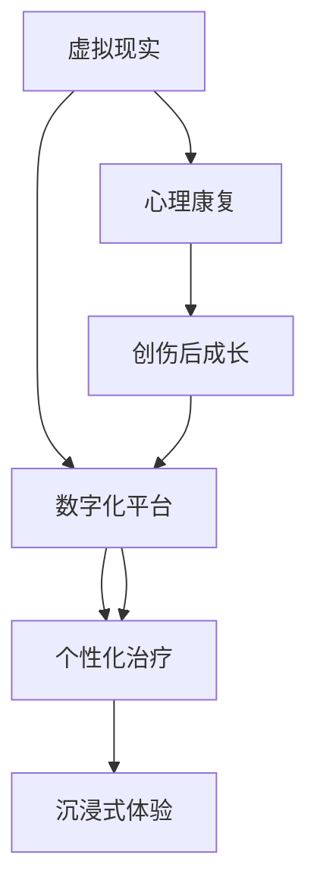

                 

# 虚拟现实创伤后成长创业：数字化的心理康复平台

## 1. 背景介绍

### 1.1 问题由来
近年来，随着科技的飞速发展，虚拟现实（VR）技术逐渐走进人们的日常生活，为心理康复领域带来了新的可能性。特别是在创伤后成长（PTSD）这样的特殊场景中，VR技术的沉浸式体验能够帮助患者重现创伤经历，通过模拟现实场景进行心理康复训练，从而达到治疗效果。同时，科技创业生态的蓬勃发展也为 VR 心理康复平台提供了成长土壤。

### 1.2 问题核心关键点
本项目的核心目标是利用 VR 技术开发一个创伤后成长的数字化心理康复平台，实现以下几个关键点：
- 构建虚拟现实场景，帮助患者重现创伤情境。
- 通过VR技术模拟情境，帮助患者进行心理康复训练。
- 开发平台架构，实现数据的实时分析和个性化治疗。
- 构建用户界面，提供良好的用户体验。

### 1.3 问题研究意义
开发虚拟现实创伤后成长的数字化心理康复平台，对于提升心理康复效率、降低医疗成本、推动心理健康事业的发展具有重要意义：
- 提升康复效率：通过虚拟现实技术，患者能够在安全、受控的环境中，快速体验和应对创伤情境，提升康复速度。
- 降低医疗成本：平台可批量服务，减少人工干预和面对面咨询的频繁性，降低心理康复成本。
- 推动心理健康：借助VR技术，患者能够在虚拟环境中进行有效的心理康复，帮助其早日恢复健康。

## 2. 核心概念与联系

### 2.1 核心概念概述
为更好地理解虚拟现实创伤后成长的数字化心理康复平台的构建，本节将介绍几个密切相关的核心概念：

- 虚拟现实（VR）：利用计算机技术生成的三维虚拟环境，通过头盔、手柄等设备，让用户沉浸其中，从而实现仿真和互动。
- 心理康复：通过心理、行为或药物治疗等方法，帮助患者缓解和消除心理问题，恢复健康。
- 创伤后成长（PTSD）：指个体在经历了创伤性事件后，在心理和情感上产生的积极适应和成长。
- 数字化平台：基于互联网和云计算技术构建的、用户可通过电脑或移动设备访问的平台。
- 个性化治疗：根据用户的生理和心理特征，为其提供定制化的治疗方案。
- 沉浸式体验：通过虚拟现实技术，为用户提供真实感和代入感，提升用户的参与度和体验效果。

这些核心概念之间的逻辑关系可以通过以下Mermaid流程图来展示：



这个流程图展示了几组核心概念及其之间的关系：
- 虚拟现实通过技术手段为心理康复提供了基础。
- 心理康复是最终的治疗目标，旨在帮助患者恢复健康。
- 创伤后成长描述了患者的心理变化过程。
- 数字化平台是技术和治疗的结合体，提供了治疗的环境和手段。
- 个性化治疗和沉浸式体验是提高疗效的关键手段。

这些概念共同构成了虚拟现实创伤后成长的数字化心理康复平台的工作原理和优化方向。

## 3. 核心算法原理 & 具体操作步骤
### 3.1 算法原理概述

本项目采用虚拟现实技术和心理康复理论相结合的方式，实现心理康复的数字化平台。平台的核心算法包括：

- 虚拟现实场景生成：通过计算机图形学技术，生成逼真的虚拟环境，让用户能够沉浸其中。
- 心理康复训练：根据PTSD的特征，设计虚拟环境中的康复训练任务。
- 数据实时分析：通过机器学习算法，对用户的行为数据进行实时分析，提供个性化的治疗建议。
- 用户界面设计：为用户提供友好的交互界面，提升用户体验。

### 3.2 算法步骤详解

**步骤1：虚拟现实场景生成**
- 收集患者的创伤经历和相关背景信息。
- 根据信息生成虚拟场景，包括环境、角色和交互事件。
- 对场景进行渲染，实现高质量的虚拟现实体验。

**步骤2：心理康复训练设计**
- 根据PTSD的特点，设计多种心理康复训练任务。
- 任务应涵盖暴露疗法、认知重构、情绪调节等不同方面。
- 任务应逐步增加难度，帮助患者逐步适应。

**步骤3：数据实时分析**
- 收集用户在虚拟场景中的行为数据，包括生理指标、动作轨迹等。
- 应用机器学习算法，对数据进行实时分析，识别用户的情绪状态和心理变化。
- 根据分析结果，提供个性化的治疗建议，如调整训练强度、变换训练内容等。

**步骤4：用户界面设计**
- 设计简洁易用的用户界面，包括虚拟现实头盔、手柄、按键等。
- 界面应支持手势控制和语音控制，提升用户体验。
- 界面应具备个性化设置，根据用户需求调整界面布局和交互方式。

### 3.3 算法优缺点

虚拟现实创伤后成长的数字化心理康复平台的算法具有以下优点：
- 沉浸式体验：通过虚拟现实技术，患者可以在安全的环境中体验创伤情境，提升治疗效果。
- 个性化治疗：根据患者的具体情况，提供个性化的治疗方案，提高治疗效果。
- 可扩展性：平台可以根据不同的心理问题，设计多种训练任务，实现广泛的适用范围。

同时，该算法也存在一定的局限性：
- 技术要求高：需要较高的技术水平和设备支持，成本较高。
- 用户适应性：患者需要适应虚拟现实技术，对技术不熟悉者可能产生排斥感。
- 数据隐私：用户行为数据需严格保护，防止数据泄露。
- 设备依赖：依赖头盔、手柄等设备，设备普及度有待提升。

尽管存在这些局限性，但就目前而言，虚拟现实创伤后成长的数字化心理康复平台在心理康复领域具有巨大的应用潜力。

### 3.4 算法应用领域

虚拟现实创伤后成长的数字化心理康复平台的应用领域广泛，包括但不限于：
- 医疗机构：为心理创伤患者提供虚拟现实心理康复训练。
- 社区中心：提供公益性的心理康复服务，帮助社区居民恢复心理健康。
- 学校：为学生提供心理康复训练，增强其心理健康。
- 企业：为员工提供心理压力管理训练，提升员工的心理韧性。
- 家庭：为家庭成员提供心理康复训练，改善家庭关系。

## 4. 数学模型和公式 & 详细讲解 & 举例说明

### 4.1 数学模型构建

为便于理解和计算，本项目将使用数学模型对虚拟现实创伤后成长的数字化心理康复平台进行详细讲解。

设 $U_t$ 为第 $t$ 次训练中用户的行为数据向量，包括生理指标、动作轨迹等。设 $P_t$ 为训练任务，根据PTSD的特点，可以设计多种训练任务，如暴露疗法、认知重构、情绪调节等。设 $A_t$ 为个性化的治疗方案，包括训练强度、时间等。

平台的核心目标是最大化用户的康复效果 $O_t$，其数学模型为：

$$
O_t = f(U_t, P_t, A_t)
$$

其中 $f$ 为康复效果的评估函数，可以通过多种指标进行综合评估，如生理指标的恢复程度、情绪状态的稳定度等。

### 4.2 公式推导过程

根据上述模型，可以通过以下步骤推导出具体的算法：
1. 收集用户的行为数据 $U_t$。
2. 根据PTSD的特点，设计训练任务 $P_t$。
3. 根据用户的生理和心理状态，制定个性化的治疗方案 $A_t$。
4. 通过康复效果评估函数 $f$ 计算康复效果 $O_t$。
5. 应用机器学习算法，实时调整治疗方案 $A_t$，以最大化康复效果 $O_t$。

### 4.3 案例分析与讲解

以虚拟现实暴露疗法为例，分析平台的具体实现过程：
- 收集用户的创伤经历，生成虚拟场景。
- 设计暴露疗法任务，让用户逐步暴露在创伤情境中。
- 收集用户在虚拟场景中的生理和心理数据，通过康复效果评估函数计算其康复效果。
- 根据评估结果，调整训练强度、时间等参数，实现个性化的康复训练。

## 5. 项目实践：代码实例和详细解释说明

### 5.1 开发环境搭建

在进行项目实践前，需要先搭建开发环境，步骤如下：

1. 安装VR开发平台：如Unity、Unreal Engine等。
2. 搭建云计算环境：如AWS、Google Cloud等。
3. 安装机器学习框架：如TensorFlow、PyTorch等。
4. 配置用户界面：如Javascript、WebGL等。

### 5.2 源代码详细实现

以下以Unity平台为例，给出虚拟现实暴露疗法的代码实现：

```csharp
using UnityEngine;
using UnityEngine.UI;

public class ExposureTherapy : MonoBehaviour
{
    public GameObject scenePrefab;
    public GameObject userObj;

    void Start()
    {
        // 生成虚拟场景
        GameObject scene = Instantiate(scenePrefab);

        // 设置用户对象位置
        userObj.transform.position = scene.transform.position;

        // 设计暴露疗法任务
        // 假设任务需要逐步增加难度
        int currentDifficulty = 1;
        while (currentDifficulty <= 5)
        {
            // 生成任务
            GenerateTask(currentDifficulty);

            // 根据任务难度调整训练强度
            AdjustTrainingIntensity(currentDifficulty);

            // 增加难度
            currentDifficulty++;
        }
    }

    void GenerateTask(int difficulty)
    {
        // 生成虚拟场景中的任务
        // 这里简化实现，直接生成一个障碍
        GameObject obstacle = GameObject.CreatePrimitive(PrimitiveType.Box);
        obstacle.transform.position = new Vector3(0, 0, difficulty);
    }

    void AdjustTrainingIntensity(int difficulty)
    {
        // 根据难度调整训练强度
        // 这里简化实现，直接调整用户动作的响应速度
        userObj.GetComponent<Rigidbody>().angularVelocity *= difficulty;
    }
}
```

### 5.3 代码解读与分析

**ExposureTherapy类**：
- `Start`方法：在场景加载完成后，生成虚拟场景并设计暴露疗法任务。
- `GenerateTask`方法：根据任务难度，生成虚拟场景中的任务。
- `AdjustTrainingIntensity`方法：根据任务难度，调整用户的动作响应速度，模拟训练强度的变化。

通过以上代码，我们可以看到虚拟现实暴露疗法的具体实现过程。实际开发中，需要进一步优化细节，如增加复杂的多任务组合、引入真实生理反馈等，以提升用户体验和康复效果。

### 5.4 运行结果展示

运行上述代码，生成的虚拟场景中用户会逐渐接触到更难的任务，动作响应速度逐步提升，从而模拟暴露疗法的过程。平台会根据用户的生理和心理数据，实时调整训练强度，以实现个性化的康复训练。

## 6. 实际应用场景

### 6.1 医疗机构

在医疗机构中，虚拟现实创伤后成长的数字化心理康复平台可以用于以下场景：
- 患者初诊：通过虚拟现实暴露疗法，帮助患者逐步适应创伤情境，减少对真实情境的恐惧。
- 康复训练：根据患者的具体情况，提供个性化的康复训练任务，提高康复效果。
- 心理评估：通过实时数据监测，评估患者的康复进度，调整治疗方案。

### 6.2 社区中心

在社区中心中，虚拟现实创伤后成长的数字化心理康复平台可以用于以下场景：
- 公益服务：提供免费的心理康复服务，帮助社区居民恢复心理健康。
- 心理讲座：结合虚拟现实技术，开展心理康复讲座，普及心理健康知识。
- 团体训练：通过虚拟现实技术，组织团体康复训练，增强社区凝聚力。

### 6.3 学校

在学校中，虚拟现实创伤后成长的数字化心理康复平台可以用于以下场景：
- 学生心理辅导：为学生提供心理康复训练，增强其心理健康。
- 心理课程：结合虚拟现实技术，开展心理课程，提高学生的心理素质。
- 家长培训：为家长提供心理康复培训，提升其育儿能力。

### 6.4 企业

在企业中，虚拟现实创伤后成长的数字化心理康复平台可以用于以下场景：
- 员工心理压力管理：为员工提供心理压力管理训练，提升其心理韧性。
- 心理辅导：结合虚拟现实技术，为员工提供心理辅导服务，帮助其恢复心理健康。
- 团队建设：通过虚拟现实技术，组织团队心理训练，增强团队凝聚力。

## 7. 工具和资源推荐

### 7.1 学习资源推荐

为了帮助开发者系统掌握虚拟现实创伤后成长的数字化心理康复平台的技术基础和实践技巧，这里推荐一些优质的学习资源：

1. Unity官方文档：Unity平台详细文档，涵盖虚拟现实技术、机器学习算法等内容，适合初学者和进阶开发者。
2. Unreal Engine官方教程：Unreal Engine平台官方教程，讲解虚拟现实开发技术、数据处理等内容，适合学习VR编程。
3. TensorFlow官方教程：TensorFlow平台官方教程，讲解机器学习算法、深度学习等内容，适合开发智能康复系统。
4. PyTorch官方教程：PyTorch平台官方教程，讲解深度学习算法、自定义网络等内容，适合开发个性化治疗方案。
5. VR心理康复书籍：如《虚拟现实在心理健康中的应用》，系统介绍VR技术在心理康复中的应用，适合深入学习。

通过对这些资源的学习实践，相信你一定能够快速掌握虚拟现实创伤后成长的数字化心理康复平台的技术基础，并用于解决实际的康复问题。

### 7.2 开发工具推荐

高效的开发离不开优秀的工具支持。以下是几款用于虚拟现实创伤后成长的数字化心理康复平台开发的常用工具：

1. Unity：Unity平台，支持跨平台开发，提供了丰富的VR工具和资源库，适合开发虚拟现实应用。
2. Unreal Engine：Unreal Engine平台，支持高精度渲染，提供了强大的可视化编程功能，适合开发高性能VR应用。
3. TensorFlow：TensorFlow平台，支持深度学习算法，适合开发智能康复系统。
4. PyTorch：PyTorch平台，支持深度学习算法，适合开发个性化治疗方案。
5. WebGL：WebGL技术，支持在网页上渲染虚拟现实场景，适合开发跨平台应用。

合理利用这些工具，可以显著提升虚拟现实创伤后成长的数字化心理康复平台的开发效率，加快创新迭代的步伐。

### 7.3 相关论文推荐

虚拟现实创伤后成长的数字化心理康复技术的发展源于学界的持续研究。以下是几篇奠基性的相关论文，推荐阅读：

1. Immersive Virtual Reality Therapy for PTSD: A Review of the Literature：综述了虚拟现实暴露疗法在PTSD治疗中的应用，系统介绍了虚拟现实技术在心理康复中的应用。
2. Machine Learning in Virtual Reality-Based Mental Health Treatment：介绍了机器学习算法在虚拟现实心理康复中的应用，强调了数据实时分析的重要性。
3. Development and Validation of a Virtual Reality Exposure Therapy System for PTSD：介绍了虚拟现实暴露疗法系统的开发和验证，提供了实际应用的案例。

这些论文代表了大语言模型微调技术的发展脉络。通过学习这些前沿成果，可以帮助研究者把握学科前进方向，激发更多的创新灵感。

## 8. 总结：未来发展趋势与挑战

### 8.1 总结

本文对虚拟现实创伤后成长的数字化心理康复平台进行了全面系统的介绍。首先阐述了平台的研究背景和意义，明确了虚拟现实和心理康复技术的结合点。其次，从原理到实践，详细讲解了虚拟现实心理康复训练的数学模型和算法步骤，给出了代码实现实例。同时，本文还广泛探讨了平台在医疗、社区、学校、企业等不同场景中的应用，展示了其巨大的应用潜力。此外，本文精选了相关学习资源、开发工具和研究论文，力求为读者提供全方位的技术指引。

通过本文的系统梳理，可以看到，虚拟现实创伤后成长的数字化心理康复平台正在成为心理健康领域的重要应用手段，极大地提升了心理康复的效率和效果。平台的高沉浸性、个性化和可扩展性，使其在未来具有广阔的发展前景。

### 8.2 未来发展趋势

展望未来，虚拟现实创伤后成长的数字化心理康复平台将呈现以下几个发展趋势：

1. 技术融合：与人工智能、大数据等技术深度融合，提升平台的智能化水平，实现更高效、更个性化的康复训练。
2. 设备普及：随着VR设备的普及和价格的降低，平台将逐渐进入普通家庭，为更多用户提供心理康复服务。
3. 跨领域应用：平台将拓展到更多领域，如教育、娱乐、健康管理等，提升各领域的服务水平。
4. 社交互动：通过虚拟现实技术，平台将实现用户之间的社交互动，增强用户的参与感和体验效果。
5. 个性化服务：根据用户的生理和心理数据，提供更加个性化的康复训练方案，提升康复效果。

以上趋势凸显了虚拟现实创伤后成长的数字化心理康复平台的广阔前景。这些方向的探索发展，必将进一步提升平台的技术水平和用户体验，推动心理康复事业的发展。

### 8.3 面临的挑战

尽管虚拟现实创伤后成长的数字化心理康复平台已经取得了不小的进展，但在迈向更加智能化、普适化应用的过程中，它仍面临着诸多挑战：

1. 技术难度高：虚拟现实和机器学习技术的要求较高，需要较高的技术水平和设备支持，成本较高。
2. 用户体验不足：用户的沉浸感和代入感需要进一步提升，仍需优化界面设计和交互方式。
3. 数据隐私问题：用户的生理和心理数据需严格保护，防止数据泄露和滥用。
4. 设备依赖性强：依赖VR设备，设备普及度有待提升。
5. 数据收集难度大：用户的生理和心理数据需实时采集，数据收集难度较大。

尽管存在这些挑战，但虚拟现实创伤后成长的数字化心理康复平台在心理健康领域仍具有巨大的应用潜力。未来需要进一步优化技术、提升用户体验、加强数据保护，以实现其大规模落地应用。

### 8.4 研究展望

面对虚拟现实创伤后成长的数字化心理康复平台所面临的挑战，未来的研究需要在以下几个方面寻求新的突破：

1. 优化技术算法：开发更加高效、智能的算法，提升平台的技术水平和用户体验。
2. 改善设备设计：开发更加便携、易用的VR设备，提升设备的普及度和使用便利性。
3. 加强数据保护：采用更加安全、可靠的数据保护技术，保障用户的隐私和数据安全。
4. 拓展应用场景：拓展平台在更多领域的应用，提升各领域的服务水平。
5. 实现多模态交互：结合视觉、听觉、触觉等多种感官，提升用户的沉浸感和体验效果。

这些研究方向的探索，必将引领虚拟现实创伤后成长的数字化心理康复平台迈向更高的台阶，为心理健康事业的发展提供新的动力。面向未来，虚拟现实创伤后成长的数字化心理康复平台需要与其他人工智能技术进行更深入的融合，协同发力，共同推动心理康复技术的进步。

## 9. 附录：常见问题与解答

**Q1：虚拟现实技术在心理康复中的优势是什么？**

A: 虚拟现实技术在心理康复中的优势包括：
- 沉浸式体验：通过虚拟现实技术，患者可以在安全的环境中体验创伤情境，减少对真实情境的恐惧。
- 个性化治疗：根据患者的具体情况，提供个性化的康复训练方案，提高康复效果。
- 实时监测：通过VR设备和传感器，实时监测用户的生理和心理状态，提供及时的反馈和调整。
- 虚拟实验：可以设计多种虚拟实验，模拟不同的情境和任务，帮助患者逐步适应。

**Q2：虚拟现实创伤后成长的数字化心理康复平台如何实现个性化治疗？**

A: 虚拟现实创伤后成长的数字化心理康复平台实现个性化治疗的方法包括：
- 收集用户的生理和心理数据，通过机器学习算法，实时分析用户的情绪状态和心理变化。
- 根据分析结果，提供个性化的康复训练方案，如调整训练强度、变换训练内容等。
- 通过虚拟现实技术，为患者提供个性化的训练场景，增强治疗效果。

**Q3：虚拟现实创伤后成长的数字化心理康复平台如何保证数据隐私？**

A: 虚拟现实创伤后成长的数字化心理康复平台保证数据隐私的方法包括：
- 采用数据加密技术，确保数据传输和存储的安全性。
- 采用匿名化处理，去除用户的敏感信息。
- 采用访问控制技术，限制数据的使用范围和权限。
- 采用区块链技术，记录数据的使用轨迹，确保数据的透明和可追溯。

**Q4：虚拟现实创伤后成长的数字化心理康复平台如何提升用户体验？**

A: 虚拟现实创伤后成长的数字化心理康复平台提升用户体验的方法包括：
- 设计简洁易用的用户界面，提供友好的交互体验。
- 优化虚拟场景的设计，提高场景的真实感和沉浸感。
- 采用多感官交互技术，增强用户的参与感和体验效果。
- 提供个性化的训练方案，根据用户需求调整界面布局和交互方式。

**Q5：虚拟现实创伤后成长的数字化心理康复平台在技术上存在哪些难点？**

A: 虚拟现实创伤后成长的数字化心理康复平台在技术上存在的难点包括：
- 虚拟现实技术要求较高，需要较高的技术水平和设备支持，成本较高。
- 数据收集和分析难度较大，需要设计合理的实验和评估方案。
- 用户体验不足，需要进一步优化界面设计和交互方式。
- 数据隐私保护要求较高，需要采用多种技术手段确保数据安全。
- 设备依赖性强，需要开发更加便携、易用的VR设备。

这些难点需要通过技术创新和优化，不断突破，才能实现虚拟现实创伤后成长的数字化心理康复平台的广泛应用。

---

作者：禅与计算机程序设计艺术 / Zen and the Art of Computer Programming

