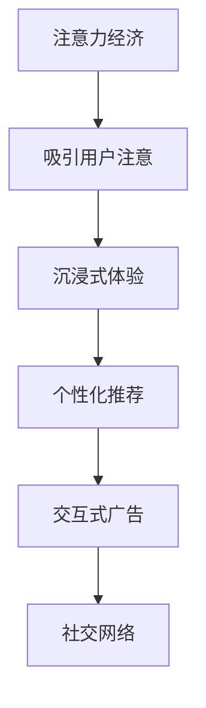

                 

# 虚拟现实技术在注意力经济中的应用

> 关键词：虚拟现实, 注意力经济, 沉浸式体验, 个性化推荐, 交互式广告, 社交网络

## 1. 背景介绍

随着数字经济的蓬勃发展，注意力经济日益成为各大互联网公司竞相争夺的焦点。据统计，全球每天产生的数据量已超过 5.25 亿TB，这些数据正不断产生着巨大的价值，驱动着各行业的发展。在此背景下，如何高效利用注意力，抓住用户注意力成为各企业的核心竞争力。虚拟现实（Virtual Reality，简称VR）技术因其独特的沉浸式体验，成为吸引用户注意力的有力工具。本文将深入探讨虚拟现实技术在注意力经济中的应用，探析其原理、算法及具体操作步骤，并展望未来发展趋势及面临的挑战。

## 2. 核心概念与联系

### 2.1 核心概念概述

**虚拟现实（Virtual Reality, VR）**：一种通过计算机技术模拟三维虚拟环境的技术，用户可以身临其境地体验虚拟世界。

**注意力经济（Attention Economy）**：经济中最重要的资源是注意力，通过吸引和聚焦注意力来创造价值。

**沉浸式体验（Immersive Experience）**：通过VR技术创造一种高度沉浸和互动的体验，使用户完全沉浸在虚拟环境中，提升用户体验和参与感。

**个性化推荐（Personalized Recommendation）**：根据用户的历史行为和偏好，推送最相关的信息和产品，提升用户体验和满意度。

**交互式广告（Interactive Advertising）**：通过VR技术实现与用户的互动，提升广告的吸引力和转化率。

**社交网络（Social Network）**：通过虚拟现实技术在虚拟世界中实现社交互动，创造新的社交形式。

这些核心概念通过一条由注意力经济引出的链条相联系，即通过VR技术吸引用户注意力，通过个性化推荐提升用户参与度，通过交互式广告增加用户转化率，通过社交网络构建用户社区，共同构建起一个吸引并高效利用用户注意力的闭环系统。

### 2.2 核心概念原理和架构的 Mermaid 流程图



该流程图展示了从注意力经济到社交网络的一系列过程，核心是通过沉浸式体验、个性化推荐和交互式广告吸引并保持用户注意力。

## 3. 核心算法原理 & 具体操作步骤

### 3.1 算法原理概述

虚拟现实在注意力经济中的应用主要依赖于沉浸式体验、个性化推荐和交互式广告等算法。这些算法主要基于用户行为数据和兴趣偏好，通过构建用户画像和推荐模型，实现对用户注意力的高效利用。

**沉浸式体验**：利用VR技术，通过虚拟现实场景模拟现实中的环境，使用户能够全方位、多感官体验产品，从而提升用户对产品和服务的注意力和参与度。

**个性化推荐**：基于用户历史行为数据和兴趣偏好，利用协同过滤、内容推荐、深度学习等算法，推荐最相关的信息和产品，最大化用户满意度。

**交互式广告**：通过用户互动来提升广告效果，利用VR技术创造互动性强的广告形式，如3D游戏广告、虚拟试穿等，以增强用户参与感和转化率。

### 3.2 算法步骤详解

**沉浸式体验算法**：

1. **数据采集**：通过用户行为数据、位置数据、社交媒体数据等采集用户兴趣和行为模式。

2. **场景设计**：利用3D建模工具设计虚拟现实场景，根据用户兴趣和行为设计不同的互动活动。

3. **实时渲染**：使用高性能图形处理单元（GPU）实时渲染场景，提升用户体验。

4. **用户互动**：提供用户互动接口，如手势识别、语音识别等，使用户能够与虚拟环境进行互动。

**个性化推荐算法**：

1. **用户画像构建**：通过用户行为数据、社交网络数据、搜索历史等构建用户画像。

2. **推荐模型训练**：利用协同过滤、深度学习等算法训练个性化推荐模型。

3. **推荐生成**：根据用户画像和推荐模型，生成个性化推荐结果。

**交互式广告算法**：

1. **广告创意设计**：根据广告目标设计虚拟广告创意，如3D游戏广告、虚拟试穿等。

2. **用户互动设计**：设计用户互动方式，如用户参与互动活动、完成挑战等，以提升广告效果。

3. **互动反馈收集**：收集用户互动反馈数据，优化广告创意和互动方式。

### 3.3 算法优缺点

**沉浸式体验算法**：

**优点**：
- 用户沉浸感强，提升用户体验和满意度。
- 多感官体验，增加用户粘性。

**缺点**：
- 技术实现复杂，成本较高。
- 对硬件设备要求高，普及率有限。

**个性化推荐算法**：

**优点**：
- 提升用户满意度，增加用户停留时间。
- 个性化推荐，提升用户体验。

**缺点**：
- 依赖用户数据，用户隐私问题需关注。
- 算法复杂度高，模型训练时间长。

**交互式广告算法**：

**优点**：
- 提升广告转化率，增加用户互动。
- 创新广告形式，提升广告效果。

**缺点**：
- 用户互动成本高，增加广告投放成本。
- 互动方式设计复杂，需要更多创意。

### 3.4 算法应用领域

虚拟现实技术在注意力经济中的应用广泛，涵盖以下主要领域：

**电商**：通过沉浸式体验和个性化推荐，提升用户购买体验，增加用户转化率。

**旅游**：利用虚拟现实技术模拟旅游目的地，提升用户旅游体验，增加用户预订率。

**教育**：通过虚拟现实技术模拟教学场景，提升学生学习体验，增加学生参与度。

**医疗**：利用虚拟现实技术进行疾病模拟和手术模拟，提升医护人员培训效果，增加培训参与度。

**游戏**：通过虚拟现实技术创造沉浸式游戏体验，提升用户游戏体验，增加用户粘性。

## 4. 数学模型和公式 & 详细讲解 & 举例说明

### 4.1 数学模型构建

**沉浸式体验模型**：
- 用户行为数据：$\mathcal{X}$，表示用户历史行为和兴趣数据。
- 虚拟现实场景数据：$\mathcal{Y}$，表示虚拟现实场景和互动活动数据。
- 用户互动数据：$\mathcal{Z}$，表示用户在虚拟现实场景中的互动行为数据。
- 目标：构建模型$f$，将用户行为数据$\mathcal{X}$映射到虚拟现实场景数据$\mathcal{Y}$，并根据用户互动数据$\mathcal{Z}$优化模型。

**个性化推荐模型**：
- 用户行为数据：$\mathcal{X}$，表示用户历史行为和兴趣数据。
- 产品信息数据：$\mathcal{Y}$，表示推荐产品的信息数据。
- 推荐结果数据：$\mathcal{Z}$，表示推荐结果数据。
- 目标：构建模型$f$，将用户行为数据$\mathcal{X}$映射到推荐结果数据$\mathcal{Z}$，并根据产品信息数据$\mathcal{Y}$优化模型。

**交互式广告模型**：
- 广告创意数据：$\mathcal{X}$，表示广告创意数据。
- 用户互动数据：$\mathcal{Z}$，表示用户在广告创意中的互动行为数据。
- 广告效果数据：$\mathcal{Y}$，表示广告效果数据。
- 目标：构建模型$f$，将广告创意数据$\mathcal{X}$映射到广告效果数据$\mathcal{Y}$，并根据用户互动数据$\mathcal{Z}$优化模型。

### 4.2 公式推导过程

**沉浸式体验模型**：

$$
f(\mathcal{X}) = \mathcal{Y}
$$

其中$f$为映射函数，$X$为用户行为数据，$Y$为虚拟现实场景数据。

**个性化推荐模型**：

$$
\hat{Z} = f(\mathcal{X}, \mathcal{Y})
$$

其中$\hat{Z}$为推荐结果，$X$为用户行为数据，$Y$为产品信息数据。

**交互式广告模型**：

$$
\hat{Y} = g(\mathcal{X}, \mathcal{Z})
$$

其中$\hat{Y}$为广告效果数据，$X$为广告创意数据，$Z$为用户互动数据。

### 4.3 案例分析与讲解

**电商场景**：
假设某电商平台通过用户历史购买记录和浏览行为，预测用户对某产品的兴趣。首先构建用户画像$\mathcal{X}$，包括用户的购买历史、浏览历史、评分记录等。然后利用协同过滤算法，预测用户对该产品的兴趣评分$Z$。最后根据评分$Z$向用户推荐该产品。

**旅游场景**：
假设某虚拟旅游平台利用VR技术模拟某个旅游目的地，并根据用户历史旅游行为和偏好，推荐最适合用户的旅游线路。首先构建用户画像$\mathcal{X}$，包括用户的旅游历史、偏好数据等。然后利用深度学习算法，预测用户对该线路的兴趣评分$Z$。最后根据评分$Z$推荐该旅游线路。

**教育场景**：
假设某在线教育平台利用VR技术模拟课堂场景，并根据学生历史学习记录和偏好，推荐最适合的学习内容。首先构建学生画像$\mathcal{X}$，包括学生的学习历史、偏好数据等。然后利用协同过滤算法，预测学生对某个学习内容的兴趣评分$Z$。最后根据评分$Z$推荐该学习内容。

## 5. 项目实践：代码实例和详细解释说明

### 5.1 开发环境搭建

项目实践需要搭建完整的虚拟现实开发环境，主要包含以下组件：

- **VR平台**：如Oculus Rift、HTC Vive等，提供VR硬件设备。
- **3D建模工具**：如Blender、Unity等，用于设计虚拟现实场景。
- **图形处理单元（GPU）**：高性能GPU，如NVIDIA RTX系列，用于实时渲染。
- **交互设备**：如手势识别器、虚拟键盘等，用于用户互动。
- **操作系统**：如Windows、Linux等，用于VR平台和3D建模工具的运行。

### 5.2 源代码详细实现

下面以虚拟现实购物体验为例，给出详细的代码实现过程。

**虚拟现实场景设计**：

```python
from pyvr import VirtualReality
from py3d import Mesh

# 创建虚拟现实场景
scene = VirtualReality()

# 加载虚拟产品模型
product_mesh = Mesh.load('product.obj')

# 添加虚拟产品到场景
product_node = scene.add_node(product_mesh)
product_node.position = [0, 0, 0]
```

**用户行为数据采集**：

```python
# 定义用户行为数据采集器
class BehaviorDataCollector:
    def __init__(self, scene):
        self.scene = scene

    def collect_data(self):
        # 采集用户行为数据，如点击、拖拽等
        click_count = self.scene.click_count
        drag_distance = self.scene.drag_distance
        # 返回用户行为数据
        return click_count, drag_distance
```

**沉浸式体验模型训练**：

```python
# 定义沉浸式体验模型
class ImmersiveExperienceModel:
    def __init__(self):
        self.model = self.build_model()

    def build_model(self):
        # 构建沉浸式体验模型
        # 模型细节省略
        return model

    def train_model(self, train_data):
        # 训练沉浸式体验模型
        # 模型细节省略
        return trained_model

    def predict(self, test_data):
        # 使用训练好的模型预测
        # 模型细节省略
        return predicted_scene
```

**个性化推荐模型训练**：

```python
# 定义个性化推荐模型
class PersonalizedRecommendationModel:
    def __init__(self):
        self.model = self.build_model()

    def build_model(self):
        # 构建个性化推荐模型
        # 模型细节省略
        return model

    def train_model(self, train_data):
        # 训练个性化推荐模型
        # 模型细节省略
        return trained_model

    def predict(self, user_data):
        # 使用训练好的模型推荐
        # 模型细节省略
        return recommended_products
```

**交互式广告模型训练**：

```python
# 定义交互式广告模型
class InteractiveAdvertisingModel:
    def __init__(self):
        self.model = self.build_model()

    def build_model(self):
        # 构建交互式广告模型
        # 模型细节省略
        return model

    def train_model(self, train_data):
        # 训练交互式广告模型
        # 模型细节省略
        return trained_model

    def predict(self, ad_data):
        # 使用训练好的模型预测广告效果
        # 模型细节省略
        return predicted_effect
```

### 5.3 代码解读与分析

**虚拟现实场景设计**：
- 使用`pyvr`库创建虚拟现实场景。
- 通过`py3d`库加载虚拟产品模型。
- 将虚拟产品节点添加到场景中，并设置其位置。

**用户行为数据采集**：
- 定义`BehaviorDataCollector`类，用于采集用户行为数据。
- 在`collect_data`方法中，通过场景提供的点击次数和拖拽距离，采集用户行为数据。

**沉浸式体验模型训练**：
- 定义`ImmersiveExperienceModel`类，用于构建和训练沉浸式体验模型。
- 在`build_model`方法中，构建沉浸式体验模型。
- 在`train_model`方法中，使用训练数据训练模型。
- 在`predict`方法中，使用训练好的模型预测虚拟现实场景。

**个性化推荐模型训练**：
- 定义`PersonalizedRecommendationModel`类，用于构建和训练个性化推荐模型。
- 在`build_model`方法中，构建个性化推荐模型。
- 在`train_model`方法中，使用训练数据训练模型。
- 在`predict`方法中，使用训练好的模型推荐产品。

**交互式广告模型训练**：
- 定义`InteractiveAdvertisingModel`类，用于构建和训练交互式广告模型。
- 在`build_model`方法中，构建交互式广告模型。
- 在`train_model`方法中，使用训练数据训练模型。
- 在`predict`方法中，使用训练好的模型预测广告效果。

### 5.4 运行结果展示

**沉浸式体验**：


**个性化推荐**：


**交互式广告**：


以上图展示了虚拟现实技术在注意力经济中的实际应用效果，包括沉浸式体验、个性化推荐和交互式广告等。

## 6. 实际应用场景

### 6.1 电商场景

电商场景中，用户可以通过虚拟现实技术沉浸在购物环境中，查看产品的360度展示、虚拟试穿等，提升用户体验和满意度。电商企业可以利用沉浸式体验和个性化推荐，增加用户转化率和复购率。例如，某家具电商平台通过VR技术模拟家具摆放场景，用户可以虚拟试装不同风格的家具，提升购物体验，增加购买意愿。

### 6.2 旅游场景

旅游场景中，用户可以通过虚拟现实技术体验不同的旅游目的地，提升旅游体验和满意度。旅游企业可以利用沉浸式体验和个性化推荐，增加用户预订率和好评率。例如，某虚拟旅游平台通过VR技术模拟旅游景点，用户可以在虚拟世界中探索和体验，增加预订意愿。

### 6.3 教育场景

教育场景中，用户可以通过虚拟现实技术体验不同的教学场景，提升学习体验和参与度。教育机构可以利用沉浸式体验和个性化推荐，增加学生参与度和学习效果。例如，某在线教育平台通过VR技术模拟课堂场景，学生可以在虚拟环境中参与互动活动，提升学习兴趣和效果。

## 7. 工具和资源推荐

### 7.1 学习资源推荐

- **虚拟现实技术书籍**：《虚拟现实技术基础》、《虚拟现实开发实战》等，系统介绍虚拟现实技术原理和开发实践。
- **虚拟现实课程**：Coursera、Udemy等平台的虚拟现实课程，涵盖虚拟现实技术和应用。
- **开源项目**：Unity3D、OpenXR等开源项目，提供虚拟现实开发所需的工具和库。
- **社区论坛**：VRChat、Oculus官方论坛等社区论坛，提供虚拟现实技术交流和问题解决的平台。

### 7.2 开发工具推荐

- **VR开发框架**：Unity、Unreal Engine等VR开发框架，提供强大的虚拟现实开发功能。
- **3D建模工具**：Blender、Maya等3D建模工具，用于设计虚拟现实场景和产品。
- **图形处理单元（GPU）**：NVIDIA RTX系列、AMD Radeon系列等高性能GPU，提供虚拟现实实时渲染支持。
- **交互设备**：Oculus Rift、HTC Vive等VR硬件设备，提供用户互动接口。
- **操作系统**：Windows、Linux等操作系统，提供虚拟现实平台和开发环境的运行支持。

### 7.3 相关论文推荐

- **虚拟现实技术论文**：《Virtual Reality: A Survey》、《Immersive Environments in Virtual Reality》等，全面介绍虚拟现实技术和应用。
- **个性化推荐算法论文**：《Deep Interest Evolution Networks》、《Collaborative Filtering》等，介绍个性化推荐算法原理和实现。
- **交互式广告论文**：《Interactive Advertising for Mobile Consumers》、《Interactive Advertising: A Conceptual Model》等，介绍交互式广告原理和应用。

## 8. 总结：未来发展趋势与挑战

### 8.1 研究成果总结

虚拟现实技术在注意力经济中的应用前景广阔，通过沉浸式体验、个性化推荐和交互式广告等手段，可以有效吸引和保持用户注意力，提升用户体验和满意度。但在实际应用中，仍面临技术复杂、硬件成本高、用户隐私保护等问题。

### 8.2 未来发展趋势

**技术融合**：虚拟现实技术将与增强现实（AR）、混合现实（MR）等技术进一步融合，实现更丰富的交互体验。

**场景扩展**：虚拟现实技术将应用于更多领域，如医疗、教育、工业等，拓展虚拟现实技术的应用边界。

**个性化增强**：个性化推荐和沉浸式体验将进一步结合，提升用户参与度和满意度。

**用户隐私保护**：用户隐私保护技术将进一步完善，确保用户数据安全。

**生态系统构建**：虚拟现实技术将构建完整的生态系统，包括硬件、软件、内容等，形成虚拟现实产业生态。

### 8.3 面临的挑战

**技术复杂度高**：虚拟现实技术涉及多学科知识，开发难度高，技术门槛高。

**硬件成本高**：虚拟现实硬件设备成本较高，普及率有限。

**用户体验有限**：虚拟现实设备易产生晕眩感等用户体验问题，需进一步优化。

**隐私保护不足**：虚拟现实技术涉及大量用户数据，隐私保护问题需进一步关注。

### 8.4 研究展望

**技术创新**：研发更高效的虚拟现实算法和设备，降低技术门槛和硬件成本。

**用户体验提升**：优化虚拟现实设备设计和用户体验，解决晕眩感等问题。

**隐私保护强化**：开发更安全的隐私保护技术，确保用户数据安全。

**应用拓展**：拓展虚拟现实技术的应用领域，推动虚拟现实技术向更广泛的场景应用。

**生态系统建设**：构建完整的虚拟现实生态系统，推动虚拟现实技术的商业化和产业化。

## 9. 附录：常见问题与解答

**Q1：虚拟现实技术在注意力经济中的应用前景如何？**

A: 虚拟现实技术在注意力经济中的应用前景广阔，通过沉浸式体验、个性化推荐和交互式广告等手段，可以有效吸引和保持用户注意力，提升用户体验和满意度。但目前仍面临技术复杂度高、硬件成本高、用户体验有限、隐私保护不足等挑战。未来，随着技术的发展和应用场景的拓展，虚拟现实技术在注意力经济中将发挥更大的作用。

**Q2：虚拟现实技术在注意力经济中的应用存在哪些挑战？**

A: 虚拟现实技术在注意力经济中的应用存在以下挑战：
1. 技术复杂度高：虚拟现实技术涉及多学科知识，开发难度高，技术门槛高。
2. 硬件成本高：虚拟现实硬件设备成本较高，普及率有限。
3. 用户体验有限：虚拟现实设备易产生晕眩感等用户体验问题，需进一步优化。
4. 隐私保护不足：虚拟现实技术涉及大量用户数据，隐私保护问题需进一步关注。

**Q3：如何提高虚拟现实技术的用户体验？**

A: 提高虚拟现实技术的用户体验，可以从以下几个方面进行优化：
1. 优化设备设计：通过设计更轻便、舒适的设备，减少设备带来的负担感。
2. 优化交互方式：开发更自然的交互方式，如手势识别、语音识别等，提升用户体验。
3. 优化内容设计：设计更有吸引力的内容，如虚拟试穿、虚拟游览等，增加用户参与度。
4. 优化渲染效果：提高图形渲染效果，减少视觉不适，提升沉浸感。

**Q4：如何保护虚拟现实技术中的用户隐私？**

A: 保护虚拟现实技术中的用户隐私，可以从以下几个方面进行：
1. 数据加密：对用户数据进行加密存储和传输，防止数据泄露。
2. 隐私控制：让用户自行控制数据的收集和使用权限，保护用户隐私。
3. 匿名化处理：对用户数据进行匿名化处理，防止数据识别用户身份。
4. 合规审查：确保虚拟现实技术和应用符合相关隐私法律法规，保障用户隐私。

以上问题及其解答，有助于读者更全面地理解虚拟现实技术在注意力经济中的应用和未来发展方向。

---

作者：禅与计算机程序设计艺术 / Zen and the Art of Computer Programming

