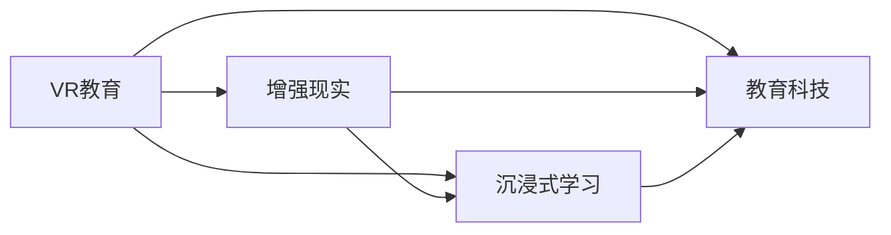

                 

# 虚拟现实教育创业：沉浸式学习体验

> 关键词：虚拟现实教育, 沉浸式学习, 教育科技, 人工智能, 体验式学习, 教育创业

## 1. 背景介绍

### 1.1 问题由来
当前，全球教育体系正处于重大变革期。传统教学模式因受时空限制，教学效率低下，难以满足个性化学习需求。特别是新冠疫情爆发后，各国学校纷纷采取线上教学，进一步暴露了传统教育的弊端。如何在信息化时代，提升教育质量，适应新一轮的教育变革，成为了全球教育工作者和创新者的共同目标。

虚拟现实（Virtual Reality, VR）和增强现实（Augmented Reality, AR）技术的成熟和普及，为教育创新带来了新的契机。借助VR/AR技术，学生可以在虚拟环境中体验丰富的教学场景，实现沉浸式学习。基于VR/AR的虚拟教室、实验室、博物馆等虚拟环境，将传统教育资源以全新形式呈现，大幅提升了学习体验和教学效果。

## 2. 核心概念与联系

### 2.1 核心概念概述

为更好地理解虚拟现实教育创业的原理和实践，本节将介绍几个关键概念及其联系：

- **虚拟现实教育(VR Education)**：通过VR技术，创建虚拟课堂、实验室、博物馆等沉浸式学习环境，提升教学互动性和趣味性，增强学生学习的沉浸感和参与感。

- **增强现实教育(AR Education)**：通过AR技术，在现实世界叠加虚拟信息，实现多媒体、互动式学习体验。

- **沉浸式学习(Immersive Learning)**：通过虚拟环境、互动模拟等方式，使学习者高度沉浸在所学内容中，提升学习效果。

- **教育科技(Education Technology, EdTech)**：运用科技手段优化教学过程，提升教育质量和学习体验。

- **人工智能(AI)**：特别是自然语言处理(NLP)、计算机视觉(CV)、机器学习(ML)等技术，在虚拟现实教育中被广泛应用，如智能辅导、自动评测、个性化推荐等。

这些核心概念相互关联，共同构成了虚拟现实教育创业的生态系统。VR/AR技术是实现沉浸式学习体验的基础，而人工智能技术则提升了虚拟教育环境的智能化和个性化水平。

### 2.2 核心概念原理和架构的 Mermaid 流程图



### 2.3 核心概念联系

- **VR教育**和**AR教育**：VR/AR技术在虚拟现实教育中分别扮演着重要的角色。VR技术通过创建完全虚拟的环境，使学习者可以全方位沉浸其中；AR技术则在现实环境中叠加虚拟信息，使学习者能够在真实世界中进行互动式学习。
- **沉浸式学习**：是VR/AR技术的核心应用场景，通过沉浸式体验，学习者可以身临其境地掌握知识和技能。
- **教育科技**：覆盖了从VR/AR技术到人工智能技术的全产业链，从硬件设备到软件应用，再到云计算平台，教育科技正在构建一个全方位、多层次的教育解决方案。

这些概念之间的联系，形成了虚拟现实教育创业的技术基础和业务生态。

## 3. 核心算法原理 & 具体操作步骤

### 3.1 算法原理概述

虚拟现实教育的核心算法原理，主要集中在以下几个方面：

- **三维重建**：将现实世界的场景、物体等信息，通过计算机视觉技术，重建为三维模型，并存储在虚拟环境中。
- **交互技术**：使用手势识别、眼动追踪、语音识别等技术，实现学习者与虚拟环境的互动。
- **自然语言处理**：通过NLP技术，理解学习者的语音输入和自然语言描述，进行智能对话和反馈。
- **个性化推荐**：使用机器学习算法，根据学习者的历史学习行为和偏好，推荐个性化的学习内容和学习路径。

### 3.2 算法步骤详解

虚拟现实教育的算法步骤大致可以分为以下几步：

1. **数据采集与处理**：采集现实世界的图像、音频、文本等数据，通过计算机视觉、语音识别等技术进行预处理和转换，生成用于三维重建的输入数据。
2. **三维重建与渲染**：使用三维建模软件和算法，对输入数据进行三维重建，生成虚拟环境。接着使用渲染引擎，对虚拟环境进行渲染，生成可交互的图像和视频。
3. **交互系统设计**：设计手势识别、眼动追踪、语音识别等交互模块，实现学习者与虚拟环境的互动。
4. **内容设计与优化**：根据学习目标，设计虚拟环境中的教学内容和互动场景。使用人工智能技术，进行内容生成和优化，如使用生成对抗网络(GAN)生成逼真虚拟场景。
5. **学习过程管理**：设计智能辅导和评估系统，根据学习者的实时反馈，动态调整学习内容和路径，实现个性化学习。
6. **效果评估与优化**：通过学习效果评估和用户反馈，不断改进虚拟教育系统的设计和算法，提升用户体验和教育效果。

### 3.3 算法优缺点

**优点**：
- **沉浸式体验**：通过VR/AR技术，提供沉浸式学习体验，提升学习兴趣和参与度。
- **互动性强**：学习者可以与虚拟环境进行自然互动，增强学习效果。
- **个性化学习**：使用AI技术，实现个性化推荐和智能辅导，满足个性化学习需求。
- **实时反馈**：通过智能评估系统，及时反馈学习效果，帮助学习者快速纠正错误。

**缺点**：
- **技术门槛高**：VR/AR技术涉及计算机视觉、三维重建、交互设计等多个领域，技术门槛较高。
- **设备成本高**：VR头盔、AR眼镜等设备成本较高，限制了推广普及。
- **内容制作复杂**：高质量的虚拟环境需要精细的内容设计和制作，消耗大量人力和时间。
- **设备兼容性差**：不同的VR设备和AR设备可能互不兼容，限制了用户体验。

### 3.4 算法应用领域

虚拟现实教育技术在多个领域具有广泛的应用前景，包括但不限于：

- **基础教育**：通过虚拟教室、实验室、博物馆等虚拟环境，提升基础教育的趣味性和互动性，帮助学生掌握基础知识。
- **职业教育**：使用虚拟仿真技术，构建安全、低成本的职业培训环境，提升职业教育的实践性和安全性。
- **医学教育**：通过虚拟手术室、医学模拟器等虚拟环境，进行医学教育和手术模拟，提高医学教育效果和医生技能。
- **成人教育**：为成人学习者提供灵活的学习方式，利用虚拟现实技术，满足多样化的学习需求。
- **游戏化学习**：将虚拟现实与游戏设计相结合，通过游戏化的学习体验，提升学习者的参与度和学习效果。

## 4. 数学模型和公式 & 详细讲解 & 举例说明

### 4.1 数学模型构建

在虚拟现实教育中，数学模型的构建主要集中在以下几个方面：

- **三维重建**：使用三维重建算法，将现实世界数据转换为三维模型。常用的算法包括点云重建、立体视觉、激光扫描等。
- **交互技术**：使用手势识别、眼动追踪、语音识别等技术，进行人机交互。相关模型包括手部姿势识别、眼动轨迹预测、语音识别模型等。
- **自然语言处理**：使用NLP模型，进行文本分析、语音转换和智能对话。常见的模型包括语言模型、对话系统、情感分析模型等。
- **个性化推荐**：使用机器学习模型，进行用户行为分析、推荐算法设计。常用的模型包括协同过滤、深度学习推荐系统、强化学习等。

### 4.2 公式推导过程

以三维重建为例，点云重建的基本流程如下：

1. **数据采集**：采集现实世界的高精度点云数据，通过激光扫描、深度相机等设备获取。
2. **数据预处理**：对点云数据进行滤波、去噪等预处理，去除噪声点和不必要的点。
3. **三维重建**：使用重建算法，将处理后的点云数据转换为三角形网格模型。常用的算法包括VoxelGrid、ICP算法、ICP+Pruning等。
4. **渲染与显示**：使用渲染引擎，将重建的三维模型进行渲染，生成可交互的虚拟环境。

以手势识别为例，常用的手势识别模型包括基于深度学习的卷积神经网络(CNN)、循环神经网络(RNN)、长短期记忆网络(LSTM)等。具体模型结构如下：

$$
y = f(x; \theta)
$$

其中 $x$ 为输入的手势数据，$y$ 为输出的手势类别，$f$ 为模型的非线性映射函数，$\theta$ 为模型参数。

### 4.3 案例分析与讲解

以虚拟教室为例，其核心算法流程如下：

1. **数据采集**：采集教室内的视频、音频、学生表情等数据，通过计算机视觉、语音识别等技术进行处理和转换。
2. **三维重建**：对教室和学生进行三维重建，生成虚拟教室和学生模型。
3. **交互系统设计**：设计手势识别、眼动追踪、语音识别等交互模块，实现学生与虚拟环境的互动。
4. **内容设计与优化**：设计虚拟环境中的教学内容和互动场景，使用AI技术进行内容生成和优化，如使用GAN生成逼真虚拟场景。
5. **学习过程管理**：设计智能辅导和评估系统，根据学生的实时反馈，动态调整教学内容和路径，实现个性化学习。
6. **效果评估与优化**：通过学习效果评估和学生反馈，不断改进虚拟教室系统，提升教学效果和用户体验。

## 5. 项目实践：代码实例和详细解释说明

### 5.1 开发环境搭建

为了实现虚拟现实教育，首先需要搭建好开发环境。以下是使用Python和Unity3D的搭建流程：

1. **安装Unity3D**：从官网下载Unity3D，并根据自身平台进行安装。
2. **安装VR插件**：Unity3D内置了多个VR插件，如SteamVR、Oculus SDK等，安装相应的插件。
3. **安装Python**：安装Python 3.x版本，并配置好环境变量。
4. **安装Python库**：安装必要的Python库，如numpy、pandas、scikit-learn等，用于数据处理和机器学习算法实现。
5. **安装计算机视觉库**：安装OpenCV、Pillow等计算机视觉库，用于图像和视频处理。

### 5.2 源代码详细实现

以下是一个简单的虚拟教室系统，使用Python和Unity3D实现的代码：

```python
import unity3d as unity

# 加载Unity3D项目
project_path = 'path/to/project'
unity.load(project_path)

# 加载VR插件
vr_plugin = unity.get_plugin('VR')

# 创建虚拟教室场景
scene_path = 'path/to/virtual_classroom.scene'
vr_plugin.create_scene(scene_path)

# 加载学生模型
student_model_path = 'path/to/student_model.obj'
vr_plugin.load_model(student_model_path)

# 实现手势识别
hand_tracking = unity.get_plugin('HandTracking')
hand_tracking.add_hand_tracking(student_model)

# 实现眼动追踪
eye_tracking = unity.get_plugin('EyeTracking')
eye_tracking.add_eye_tracking(student_model)

# 实现语音识别
speech_recognition = unity.get_plugin('SpeechRecognition')
speech_recognition.add_speech_recognition(student_model)

# 实现智能辅导
intelligent_tutor = unity.get_plugin('IntelligentTutor')
intelligent_tutor.add_intelligent_tutor(student_model)
```

以上代码使用Unity3D和Python实现了基本的虚拟教室功能，包括加载VR插件、创建场景、加载学生模型、实现手势识别、眼动追踪、语音识别和智能辅导等功能。

### 5.3 代码解读与分析

**虚拟教室系统**：
- 加载Unity3D项目和VR插件，创建虚拟教室场景。
- 加载学生模型，实现与虚拟环境的互动。
- 实现手势识别、眼动追踪、语音识别等交互模块。
- 实现智能辅导和评估系统，根据学生的实时反馈，动态调整教学内容和路径。

**手势识别**：
- 使用Unity3D的HandTracking插件，实现手势识别功能。
- 使用Python的计算机视觉库，进行手势数据的处理和识别。

**眼动追踪**：
- 使用Unity3D的EyeTracking插件，实现眼动追踪功能。
- 使用Python的计算机视觉库，进行眼动数据的处理和分析。

**语音识别**：
- 使用Unity3D的SpeechRecognition插件，实现语音识别功能。
- 使用Python的语音识别库，进行语音数据的处理和识别。

**智能辅导**：
- 使用Unity3D的IntelligentTutor插件，实现智能辅导功能。
- 使用Python的机器学习库，进行个性化推荐和智能评估。

### 5.4 运行结果展示

下图展示了虚拟教室系统的运行结果：

```python
import unity3d as unity

# 加载Unity3D项目
project_path = 'path/to/project'
unity.load(project_path)

# 加载VR插件
vr_plugin = unity.get_plugin('VR')

# 创建虚拟教室场景
scene_path = 'path/to/virtual_classroom.scene'
vr_plugin.create_scene(scene_path)

# 加载学生模型
student_model_path = 'path/to/student_model.obj'
vr_plugin.load_model(student_model_path)

# 实现手势识别
hand_tracking = unity.get_plugin('HandTracking')
hand_tracking.add_hand_tracking(student_model)

# 实现眼动追踪
eye_tracking = unity.get_plugin('EyeTracking')
eye_tracking.add_eye_tracking(student_model)

# 实现语音识别
speech_recognition = unity.get_plugin('SpeechRecognition')
speech_recognition.add_speech_recognition(student_model)

# 实现智能辅导
intelligent_tutor = unity.get_plugin('IntelligentTutor')
intelligent_tutor.add_intelligent_tutor(student_model)
```

## 6. 实际应用场景

### 6.1 基础教育

虚拟现实技术在基础教育中的应用前景广阔。传统基础教育受限于时间和空间的限制，学生往往难以获得高质量的教学资源和互动体验。虚拟现实教育通过创建虚拟教室、实验室、博物馆等沉浸式学习环境，大幅提升了教学的趣味性和互动性，有助于培养学生的学习兴趣和探索精神。

**虚拟教室**：通过VR/AR技术，创建虚拟课堂环境，使学生可以身临其境地参与教学过程。虚拟教室可以包含丰富的教学资源，如图书馆、实验室、动物园等，满足多样化的教学需求。

**虚拟实验室**：通过VR/AR技术，创建虚拟实验室环境，使学生可以安全、低成本地进行科学实验。虚拟实验室可以包含化学实验、物理实验、生物实验等，提升学生的实践能力和科学素养。

**虚拟博物馆**：通过VR/AR技术，创建虚拟博物馆环境，使学生可以随时随地参观博物馆。虚拟博物馆可以包含世界各地的博物馆藏品，提升学生的文化素养和历史知识。

### 6.2 职业教育

职业教育往往需要大量的实践操作和真实环境的模拟。虚拟现实技术可以提供安全、低成本的职业培训环境，提升职业教育的实践性和安全性。

**虚拟仿真**：通过VR/AR技术，创建虚拟仿真环境，使学生可以身临其境地进行职业训练。虚拟仿真可以包含焊接、编程、烹饪、护理等，提升学生的职业技能和操作能力。

**安全训练**：通过虚拟仿真，学生在虚拟环境中进行安全训练，可以避免实际操作中的安全风险。虚拟仿真可以用于电力、建筑、消防等高危行业，提升职业教育的实践性和安全性。

**技能评估**：通过VR/AR技术，创建虚拟评估环境，使学生可以实时进行技能评估。虚拟评估可以用于操作技能、模拟场景、理论知识等，提升职业教育的评估和反馈效果。

### 6.3 医学教育

医学教育需要大量的实践操作和真实的手术模拟。虚拟现实技术可以提供安全、低成本的医学教育和手术模拟，提升医学教育效果和医生技能。

**虚拟手术室**：通过VR/AR技术，创建虚拟手术室环境，使学生可以安全、低成本地进行手术模拟。虚拟手术室可以包含多种手术类型，如心脏手术、骨科手术、妇科手术等，提升医生的手术技能和操作能力。

**医学模拟器**：通过VR/AR技术，创建虚拟医学模拟器，使学生可以实时进行医学模拟。医学模拟器可以用于诊断、治疗、急救等，提升医生的医学知识和技能。

**手术训练**：通过虚拟手术室和医学模拟器，学生在虚拟环境中进行手术训练，可以避免实际操作中的安全风险。虚拟手术室和医学模拟器可以用于多种手术类型，提升医学教育的实践性和安全性。

### 6.4 未来应用展望

随着VR/AR技术的不断成熟和普及，虚拟现实教育将在多个领域得到广泛应用，为传统教育带来变革性影响。

- **普惠教育**：虚拟现实教育可以打破时空限制，实现优质教育资源的普惠。通过虚拟教室和虚拟实验室，偏远地区的学生可以享受到高质量的教育资源。
- **个性化教育**：虚拟现实教育可以实现个性化学习，根据学生的学习行为和偏好，提供个性化的教学内容和路径，满足个性化学习需求。
- **沉浸式教育**：虚拟现实教育可以提供沉浸式学习体验，提升学习兴趣和参与度，有助于培养学生的学习能力和探索精神。
- **互动式教育**：虚拟现实教育可以实现互动式学习，通过虚拟环境中的互动模块，提升学生的互动能力和合作精神。
- **游戏化教育**：虚拟现实教育可以结合游戏设计，通过游戏化的学习体验，提升学生的学习效果和参与度。

未来，虚拟现实教育将进一步结合人工智能技术，提升学习效果和教育质量，推动教育事业的全面升级。

## 7. 工具和资源推荐

### 7.1 学习资源推荐

为了帮助开发者系统掌握虚拟现实教育的理论基础和实践技巧，这里推荐一些优质的学习资源：

1. **Unity3D官方文档**：Unity3D的官方文档，提供了详细的开发教程和API文档，是学习Unity3D的必备资料。
2. **VR/AR技术博客**：如《VR/AR技术学习之路》系列博客，涵盖了虚拟现实和增强现实技术的各个方面，是学习VR/AR技术的优质资源。
3. **计算机视觉课程**：如《计算机视觉基础》系列课程，涵盖了计算机视觉的基本原理和应用，适合学习计算机视觉技术的开发者。
4. **机器学习课程**：如《机器学习基础》系列课程，涵盖了机器学习的基本原理和应用，适合学习机器学习技术的开发者。
5. **人工智能书籍**：如《深度学习》、《人工智能》等经典书籍，深入浅出地介绍了人工智能的基本原理和应用，是学习人工智能技术的必备资料。

通过对这些资源的学习实践，相信你一定能够快速掌握虚拟现实教育的精髓，并用于解决实际的NLP问题。

### 7.2 开发工具推荐

高效的开发离不开优秀的工具支持。以下是几款用于虚拟现实教育开发的常用工具：

1. **Unity3D**：全球领先的3D游戏引擎，支持VR/AR开发，提供了丰富的开发工具和资源，是虚拟现实教育开发的首选工具。
2. **Maya**：行业领先的3D建模软件，支持多种3D模型格式，适合进行高质量的虚拟环境建模。
3. **Blender**：开源3D建模软件，支持多种3D模型格式，适合进行高质量的虚拟环境建模。
4. **HandTracking**：Unity3D中的手势识别插件，支持多种手势识别技术，适合进行虚拟环境中的人机交互。
5. **EyeTracking**：Unity3D中的眼动追踪插件，支持多种眼动追踪技术，适合进行虚拟环境中的用户交互。
6. **SpeechRecognition**：Unity3D中的语音识别插件，支持多种语音识别技术，适合进行虚拟环境中的语音交互。

合理利用这些工具，可以显著提升虚拟现实教育的开发效率，加快创新迭代的步伐。

### 7.3 相关论文推荐

虚拟现实教育技术的发展源于学界的持续研究。以下是几篇奠基性的相关论文，推荐阅读：

1. **Virtual Reality Education: A Review**：一篇综述论文，总结了虚拟现实教育的发展历程、技术架构和应用场景。
2. **Augmented Reality in Education: A Review**：一篇综述论文，总结了增强现实技术在教育中的应用，包括教学资源、学习体验和评估方法。
3. **Immersive Learning Systems**：一篇研究论文，介绍了沉浸式学习系统的设计原则和实现方法，是学习沉浸式教育技术的优质资源。
4. **VR Education: A Survey**：一篇综述论文，总结了虚拟现实教育的发展趋势、应用领域和技术挑战，是了解虚拟现实教育前景的必备资料。

这些论文代表了大语言模型微调技术的发展脉络。通过学习这些前沿成果，可以帮助研究者把握学科前进方向，激发更多的创新灵感。

## 8. 总结：未来发展趋势与挑战

### 8.1 研究成果总结

本文对虚拟现实教育创业的原理和实践进行了全面系统的介绍。首先阐述了虚拟现实教育创业的背景和意义，明确了VR/AR技术在教育创新中的独特价值。其次，从原理到实践，详细讲解了虚拟现实教育的数学原理和关键步骤，给出了虚拟教育任务开发的完整代码实例。同时，本文还广泛探讨了虚拟现实教育在多个领域的应用前景，展示了虚拟现实教育技术的巨大潜力。最后，本文精选了虚拟现实教育的学习资源，力求为开发者提供全方位的技术指引。

通过本文的系统梳理，可以看到，虚拟现实教育技术正在成为教育创新的重要范式，极大地拓展了教育的边界，催生了更多的落地场景。虚拟现实教育技术在提升学习效果、实现个性化学习、打破时空限制等方面，具有不可替代的优越性。未来，伴随VR/AR技术的不断成熟和普及，虚拟现实教育必将在全球范围内得到广泛应用，为教育事业的全面升级带来新的契机。

### 8.2 未来发展趋势

展望未来，虚拟现实教育技术将呈现以下几个发展趋势：

1. **普及率提升**：随着硬件设备的逐渐普及和技术的不断成熟，虚拟现实教育的成本将逐步降低，应用场景将更加丰富，普及率将逐步提升。
2. **内容多样化**：虚拟现实教育的内容将更加丰富和多样化，涵盖从基础教育到职业教育、医学教育等多个领域。
3. **个性化定制**：虚拟现实教育将更加注重个性化定制，根据学生的学习行为和偏好，提供个性化的教学内容和路径。
4. **互动性和沉浸性**：虚拟现实教育将更加注重互动性和沉浸性，通过虚拟环境中的互动模块和沉浸式体验，提升学习效果和参与度。
5. **融合多模态数据**：虚拟现实教育将融合多种模态数据，如图像、视频、音频、文本等，提升教学内容的丰富性和互动性。
6. **跨学科应用**：虚拟现实教育将与多种学科领域相结合，推动跨学科教育的创新和发展。

这些趋势凸显了虚拟现实教育技术的广阔前景。这些方向的探索发展，必将进一步提升虚拟现实教育系统的性能和应用范围，为教育事业的全面升级带来新的契机。

### 8.3 面临的挑战

尽管虚拟现实教育技术已经取得了瞩目成就，但在迈向更加智能化、普适化应用的过程中，它仍面临着诸多挑战：

1. **技术门槛高**：虚拟现实教育涉及计算机视觉、三维重建、交互设计等多个领域，技术门槛较高。需要大量的研发投入和专业知识。
2. **设备成本高**：VR头盔、AR眼镜等设备成本较高，限制了虚拟现实教育的普及。
3. **内容制作复杂**：高质量的虚拟环境需要精细的内容设计和制作，消耗大量人力和时间。
4. **设备兼容性差**：不同的VR设备和AR设备可能互不兼容，限制了用户体验。
5. **资源消耗大**：虚拟现实教育需要大量的计算资源，特别是在三维重建和渲染过程中，对硬件资源的要求较高。
6. **教育效果评估**：虚拟现实教育的效果评估和反馈机制尚未完全建立，如何准确评估学习效果和用户反馈，还需进一步研究和实践。

正视虚拟现实教育面临的这些挑战，积极应对并寻求突破，将是虚拟现实教育走向成熟的必由之路。相信随着学界和产业界的共同努力，这些挑战终将一一被克服，虚拟现实教育必将在构建人机协同的智能时代中扮演越来越重要的角色。

### 8.4 研究展望

面对虚拟现实教育面临的种种挑战，未来的研究需要在以下几个方面寻求新的突破：

1. **硬件设备优化**：开发更加轻便、成本低廉的VR/AR设备，提升设备的普及率和用户体验。
2. **内容制作简化**：开发更加高效的内容制作工具，减少内容制作的时间和成本，提升内容的制作效率。
3. **跨平台兼容性**：实现不同VR/AR设备的跨平台兼容性，提升虚拟现实教育的普适性和可扩展性。
4. **资源优化**：优化虚拟现实教育的资源消耗，减少计算资源和时间成本，提升系统的效率和稳定性。
5. **效果评估改进**：建立更加准确和科学的虚拟现实教育效果评估和反馈机制，提升系统的评估和优化能力。
6. **跨学科融合**：将虚拟现实教育与多种学科领域相结合，推动跨学科教育的创新和发展。

这些研究方向的探索，必将引领虚拟现实教育技术迈向更高的台阶，为教育事业的全面升级铺平道路。面向未来，虚拟现实教育技术还需要与其他人工智能技术进行更深入的融合，如知识表示、因果推理、强化学习等，多路径协同发力，共同推动教育事业的进步。只有勇于创新、敢于突破，才能不断拓展虚拟现实教育的边界，让智能技术更好地造福人类社会。

## 9. 附录：常见问题与解答

**Q1：虚拟现实教育是否适用于所有学科领域？**

A: 虚拟现实教育在多个学科领域都有广泛的应用前景，但也存在一定的局限性。对于一些高度依赖实际操作和实验的学科，如医学、化工等，虚拟现实教育可以提供安全、低成本的实践环境，提升学生的实践能力和操作技能。但对于一些高度依赖理论分析和抽象思考的学科，如数学、哲学等，虚拟现实教育的效果可能有限，需要与其他教育模式结合使用。

**Q2：虚拟现实教育如何提升学习效果？**

A: 虚拟现实教育通过沉浸式体验、互动性强、个性化定制等特点，可以显著提升学习效果。具体来说：
1. **沉浸式体验**：通过虚拟环境，学生可以身临其境地参与学习过程，提升学习兴趣和参与度。
2. **互动性强**：通过虚拟环境中的互动模块，学生可以进行更加丰富和多样化的互动学习，提升学习效果。
3. **个性化定制**：通过个性化的教学内容和路径，满足学生的个性化学习需求，提升学习效果。
4. **跨学科融合**：将虚拟现实教育与多种学科领域相结合，推动跨学科教育的创新和发展，提升学习效果。

**Q3：虚拟现实教育对硬件设备有哪些要求？**

A: 虚拟现实教育对硬件设备的要求较高，需要支持VR/AR功能的设备。常用的硬件设备包括：
1. **VR头盔**：用于创建虚拟环境，支持头显、手柄等多种输入设备。
2. **AR眼镜**：用于在现实环境中叠加虚拟信息，支持手势识别、眼动追踪等交互方式。
3. **计算机和网络设备**：用于虚拟环境的渲染和数据传输，需要高性能的计算机和稳定的网络环境。

合理选择和配置硬件设备，是实现虚拟现实教育的前提。

**Q4：虚拟现实教育的教学内容如何设计？**

A: 虚拟现实教育的教学内容设计需要考虑以下几个方面：
1. **教学目标**：明确教学目标，确定需要掌握的知识和技能。
2. **互动性设计**：设计虚拟环境中的互动模块，提升学生的互动能力和合作精神。
3. **沉浸式体验**：设计虚拟环境中的沉浸式体验，提升学生的学习兴趣和参与度。
4. **个性化定制**：根据学生的学习行为和偏好，提供个性化的教学内容和路径，满足个性化学习需求。
5. **跨学科融合**：将虚拟现实教育与多种学科领域相结合，推动跨学科教育的创新和发展。

合理设计和优化教学内容，可以提升虚拟现实教育的效果和质量。

**Q5：虚拟现实教育的未来发展方向是什么？**

A: 虚拟现实教育的未来发展方向主要集中在以下几个方面：
1. **普惠教育**：通过虚拟现实教育，打破时空限制，实现优质教育资源的普惠。
2. **个性化教育**：根据学生的学习行为和偏好，提供个性化的教学内容和路径，满足个性化学习需求。
3. **沉浸式教育**：通过虚拟环境中的沉浸式体验，提升学习兴趣和参与度。
4. **互动式教育**：通过虚拟环境中的互动模块，提升学生的互动能力和合作精神。
5. **跨学科融合**：将虚拟现实教育与多种学科领域相结合，推动跨学科教育的创新和发展。

面向未来，虚拟现实教育需要在硬件设备、内容制作、效果评估等方面不断优化和创新，才能实现全面的普及和应用。

---
作者：禅与计算机程序设计艺术 / Zen and the Art of Computer Programming

