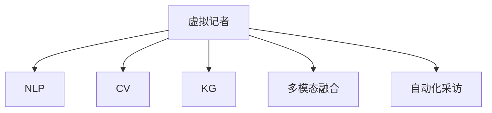

                 

# 虚拟记者：AI采访和报道技术

## 1. 背景介绍

### 1.1 问题由来
随着人工智能技术的快速发展，新闻业也在经历着深刻变革。传统的新闻报道方式逐渐被基于自然语言处理(NLP)和计算机视觉(CV)技术的自动化报道所取代。虚拟记者的出现，就是这种变革的典型代表。虚拟记者，即基于AI技术的记者，可以自动地从海量数据中提取信息，撰写报道，甚至进行实时采访，发布即时消息，显著提升了新闻报道的效率和质量。

### 1.2 问题核心关键点
虚拟记者的核心关键点在于其对AI技术的依赖和整合。具体而言，包括以下几个方面：

1. **自然语言处理(NLP)**：虚拟记者需要具备强大的语言理解能力和生成能力，能够自动分析新闻文本，理解其语义和结构，并进行文本生成。

2. **计算机视觉(CV)**：虚拟记者需要通过视觉技术获取和处理图像和视频数据，以增强报道的准确性和吸引力。

3. **知识图谱(KG)**：虚拟记者需要具备知识图谱技术，以整合和利用外部知识源，提高报道的深度和广度。

4. **多模态融合**：虚拟记者能够将文本、图像、视频等多种信息形式进行融合，提供更全面、立体的报道。

5. **自动化采访**：虚拟记者可以自动进行采访，通过语音识别、语音合成、情感分析等技术，实现与人类的自然交互。

### 1.3 问题研究意义
虚拟记者的研究具有重要的意义，主要体现在以下几个方面：

1. **提升新闻报道效率**：虚拟记者可以自动化处理大量新闻数据，显著缩短新闻生产周期，提高报道速度。

2. **增强报道深度和广度**：虚拟记者能够整合和利用知识图谱技术，提供深度背景信息和跨领域知识，提升报道的广度和深度。

3. **提高报道质量和准确性**：虚拟记者结合NLP和CV技术，能够自动分析新闻数据，理解文本和图像内容，减少人为错误。

4. **推动新闻业数字化转型**：虚拟记者的发展，有助于推动新闻业的数字化转型，促进传统新闻业向自动化、智能化方向发展。

## 2. 核心概念与联系

### 2.1 核心概念概述

为更好地理解虚拟记者的工作原理和优化方向，本节将介绍几个密切相关的核心概念：

- **虚拟记者**：基于AI技术的记者，具备自然语言处理、计算机视觉、知识图谱等技术，能够自动进行新闻报道。

- **自然语言处理(NLP)**：使计算机能够理解、分析和生成自然语言的技术，是虚拟记者的核心能力之一。

- **计算机视觉(CV)**：使计算机能够理解和分析图像和视频的技术，能够增强虚拟记者的报道内容和形式。

- **知识图谱(KG)**：整合外部知识源，提供结构化的知识结构，使虚拟记者能够获取和利用更丰富的背景信息。

- **多模态融合**：将文本、图像、视频等多种信息形式进行融合，提供更全面、立体的报道。

- **自动化采访**：通过语音识别、语音合成、情感分析等技术，实现与人类的自然交互，采集实时信息。

这些核心概念之间的逻辑关系可以通过以下Mermaid流程图来展示：



这个流程图展示虚拟记者的核心概念及其之间的关系：

1. 虚拟记者通过NLP、CV、KG等技术进行信息获取和处理。
2. 多模态融合技术使虚拟记者能够将文本、图像、视频等多种信息形式进行整合，提供更全面、立体的报道。
3. 自动化采访技术使虚拟记者能够与人进行自然交互，采集实时信息。

## 3. 核心算法原理 & 具体操作步骤
### 3.1 算法原理概述

虚拟记者的核心算法原理主要包括自然语言处理、计算机视觉和自动化采访三个方面。这些算法共同构成虚拟记者的信息获取、处理和输出流程。

- **自然语言处理**：虚拟记者使用NLP技术，自动分析新闻文本，理解其语义和结构，并进行文本生成。

- **计算机视觉**：虚拟记者使用CV技术，自动获取和处理图像和视频数据，以增强报道的准确性和吸引力。

- **自动化采访**：虚拟记者使用语音识别、语音合成、情感分析等技术，自动进行采访，与人类的自然交互。

### 3.2 算法步骤详解

虚拟记者的工作流程通常包括以下几个关键步骤：

**Step 1: 数据采集与预处理**
- 使用爬虫或API获取新闻数据，进行初步筛选和预处理。
- 将新闻数据进行格式转换，如HTML转文本、视频转图像等。

**Step 2: 自然语言处理**
- 使用NLP技术分析新闻文本，提取关键信息。
- 使用实体识别、情感分析、主题建模等技术，理解文本的语义和结构。
- 根据新闻内容生成标题、导语、正文等。

**Step 3: 计算机视觉**
- 使用CV技术提取新闻中的图像和视频数据。
- 对图像和视频进行预处理，如裁剪、缩放、增强等。
- 使用视觉技术分析图像和视频内容，提取关键信息。

**Step 4: 知识图谱整合**
- 使用KG技术将新闻内容与外部知识源进行整合。
- 提取新闻内容中的实体、关系、属性等，构建知识图谱。
- 使用知识推理技术，获取相关背景信息和跨领域知识。

**Step 5: 多模态融合**
- 将文本、图像、视频等多种信息形式进行融合，构建更全面、立体的报道。
- 使用多模态表示学习技术，将不同信息形式转换为统一的表示。
- 使用融合技术，将多种信息形式进行组合，生成最终报道。

**Step 6: 自动化采访**
- 使用语音识别技术，自动提取人类采访内容。
- 使用语音合成技术，自动生成采访问题。
- 使用情感分析技术，理解人类情感和情绪，进行实时调整。

**Step 7: 报道生成与发布**
- 将处理后的文本、图像、视频等多种信息形式进行整合，生成最终报道。
- 使用自然语言生成技术，自动生成新闻标题、导语、正文等。
- 使用多模态表示学习技术，将不同信息形式转换为统一的表示。
- 将最终报道发布到新闻平台，供公众阅读。

### 3.3 算法优缺点

虚拟记者的算法具有以下优点：

1. **高效性**：通过自动化处理新闻数据，虚拟记者能够显著提升新闻报道的效率，缩短生产周期。

2. **准确性**：结合NLP、CV和KG技术，虚拟记者能够自动分析新闻内容，减少人为错误，提高报道的准确性。

3. **深度和广度**：通过KG技术整合外部知识源，虚拟记者能够提供深度背景信息和跨领域知识，提升报道的深度和广度。

4. **多模态融合**：将文本、图像、视频等多种信息形式进行融合，提供更全面、立体的报道。

5. **实时性**：通过自动化采访技术，虚拟记者能够实时获取最新信息，发布即时消息。

虚拟记者的算法也存在以下缺点：

1. **数据质量依赖**：虚拟记者的表现高度依赖于数据的质量和数量，数据偏差可能导致报道失真。

2. **技术复杂性**：虚拟记者涉及NLP、CV、KG等多项技术，技术实现复杂，开发难度大。

3. **伦理问题**：虚拟记者的自动采访和报道可能引发伦理问题，如隐私保护、版权争议等。

4. **缺乏人情味**：虚拟记者缺乏人类的情感和判断，可能无法充分理解和表达复杂的人类情感。

5. **依赖技术基础设施**：虚拟记者的运行需要强大的计算资源和网络基础设施，对技术要求高。

### 3.4 算法应用领域

虚拟记者的应用领域广泛，包括但不限于以下领域：

- **新闻媒体**：自动生成新闻报道、实时采访、数据分析等，显著提升新闻业的生产效率和报道质量。

- **社交媒体**：自动分析社交媒体内容，生成实时报道、情感分析、舆情监测等，提升社交媒体的管理和运营效率。

- **金融行业**：自动分析财经新闻、生成财经报告、实时监控市场动态等，辅助金融决策和风险管理。

- **体育行业**：自动分析体育新闻、生成赛事报道、实时评论等，提升体育赛事的报道深度和广度。

- **医疗行业**：自动分析医疗新闻、生成医疗报告、实时监控健康趋势等，辅助医疗决策和公共健康管理。

## 4. 数学模型和公式 & 详细讲解 & 举例说明

### 4.1 数学模型构建

虚拟记者的数学模型主要包括自然语言处理、计算机视觉和自动化采访三个方面。以下是这些方面的数学模型构建：

**自然语言处理**：虚拟记者使用NLP技术，自动分析新闻文本，理解其语义和结构。

- **文本表示模型**：使用Transformer模型，将新闻文本转换为向量表示，用于后续的语义分析和生成。

- **语义分析模型**：使用BERT等预训练模型，对新闻文本进行情感分析、主题建模等。

- **文本生成模型**：使用GPT等预训练模型，生成新闻标题、导语、正文等。

**计算机视觉**：虚拟记者使用CV技术，自动获取和处理图像和视频数据，以增强报道的准确性和吸引力。

- **图像特征提取模型**：使用CNN等卷积神经网络，提取图像的关键特征。

- **视频特征提取模型**：使用RNN等序列模型，提取视频的关键帧和帧序列。

**自动化采访**：虚拟记者使用语音识别、语音合成、情感分析等技术，自动进行采访，与人类的自然交互。

- **语音识别模型**：使用CTC等声学模型，将人类采访内容转换为文本。

- **语音合成模型**：使用TTS等文本转语音模型，生成采访问题。

- **情感分析模型**：使用RNN等序列模型，理解人类情感和情绪，进行实时调整。

### 4.2 公式推导过程

以下我们以文本生成模型为例，推导GPT模型的文本生成公式及其梯度计算过程。

GPT模型使用Transformer结构，假设模型参数为 $\theta$，输入为新闻文本 $X$，输出为新闻标题 $Y$。文本生成模型的目标是最小化预测序列和真实序列之间的交叉熵损失，即：

$$
\mathcal{L}(\theta) = -\sum_{i=1}^T \log P(y_i | y_{<i}, \theta)
$$

其中 $y_i$ 为真实标题中的第 $i$ 个字符，$P(y_i | y_{<i}, \theta)$ 为模型预测的该字符出现的概率。通过反向传播算法，可以计算出模型参数 $\theta$ 的梯度，从而更新模型参数。

具体而言，假设模型在第 $t$ 步预测的字符为 $y_t$，真实字符为 $y^*$，则该步的损失函数为：

$$
\mathcal{L}(y_t, y^*) = -\log P(y_t | y_{<t}, \theta)
$$

通过链式法则，可以求出该步的梯度：

$$
\frac{\partial \mathcal{L}(y_t, y^*)}{\partial \theta} = \frac{\partial -\log P(y_t | y_{<t}, \theta)}{\partial \theta} = -\frac{\partial \log P(y_t | y_{<t}, \theta)}{\partial \theta}
$$

进一步，可以将 $\log P(y_t | y_{<t}, \theta)$ 展开为：

$$
\log P(y_t | y_{<t}, \theta) = \log \sum_{j=1}^V \exp(\mathbf{W}_h y_{<t} \cdot \mathbf{v}_j + \mathbf{b}_h) \cdot \exp(\mathbf{W}_c y_{<t} \cdot \mathbf{u}_j + \mathbf{b}_c) \cdot \exp(\mathbf{W}_s y_{<t} \cdot \mathbf{w}_j + \mathbf{b}_s)
$$

其中 $\mathbf{W}_h$、$\mathbf{W}_c$、$\mathbf{W}_s$ 为权重矩阵，$\mathbf{v}_j$、$\mathbf{u}_j$、$\mathbf{w}_j$ 为权重向量，$\mathbf{b}_h$、$\mathbf{b}_c$、$\mathbf{b}_s$ 为偏置向量。

将上述表达式代入梯度计算公式，可以得到：

$$
\frac{\partial \mathcal{L}(y_t, y^*)}{\partial \theta} = -\frac{\partial \log \sum_{j=1}^V \exp(\mathbf{W}_h y_{<t} \cdot \mathbf{v}_j + \mathbf{b}_h) \cdot \exp(\mathbf{W}_c y_{<t} \cdot \mathbf{u}_j + \mathbf{b}_c) \cdot \exp(\mathbf{W}_s y_{<t} \cdot \mathbf{w}_j + \mathbf{b}_s)}{\partial \theta}
$$

通过自动微分技术，可以高效计算出模型参数的梯度，从而进行模型训练和优化。

### 4.3 案例分析与讲解

以下是虚拟记者在新闻报道中应用的案例分析：

**案例1: 自动化报道**

某新闻媒体使用虚拟记者自动生成新闻报道。具体步骤如下：

1. 使用爬虫技术从社交媒体平台获取相关新闻数据。
2. 对获取的新闻数据进行预处理，去除无关信息。
3. 使用NLP技术分析新闻文本，提取关键信息，生成标题和导语。
4. 使用CV技术提取新闻中的图像和视频，并进行预处理。
5. 使用KG技术整合外部知识源，提取相关背景信息。
6. 将文本、图像、视频等多种信息形式进行融合，生成最终报道。
7. 自动发布到新闻平台，供公众阅读。

**案例2: 实时采访**

某体育赛事使用虚拟记者进行实时采访。具体步骤如下：

1. 在比赛现场安装摄像头和麦克风，记录比赛实况。
2. 使用CV技术提取比赛视频和图像，并进行预处理。
3. 使用NLP技术自动分析比赛实况，生成报道。
4. 使用语音识别技术自动提取教练和球员的采访内容。
5. 使用语音合成技术自动生成采访问题，进行实时采访。
6. 使用情感分析技术理解教练和球员的情感和情绪，进行实时调整。
7. 将采访内容融入报道，生成最终报道。
8. 自动发布到新闻平台，供公众阅读。

通过上述案例，可以看到，虚拟记者的应用已经覆盖了新闻报道的各个环节，从数据采集到报道生成，再到实时采访，大大提升了新闻报道的效率和质量。

## 5. 项目实践：代码实例和详细解释说明

### 5.1 开发环境搭建

在进行虚拟记者开发前，我们需要准备好开发环境。以下是使用Python进行PyTorch开发的环境配置流程：

1. 安装Anaconda：从官网下载并安装Anaconda，用于创建独立的Python环境。

2. 创建并激活虚拟环境：
```bash
conda create -n pytorch-env python=3.8 
conda activate pytorch-env
```

3. 安装PyTorch：根据CUDA版本，从官网获取对应的安装命令。例如：
```bash
conda install pytorch torchvision torchaudio cudatoolkit=11.1 -c pytorch -c conda-forge
```

4. 安装各类工具包：
```bash
pip install numpy pandas scikit-learn matplotlib tqdm jupyter notebook ipython
```

完成上述步骤后，即可在`pytorch-env`环境中开始虚拟记者的开发实践。

### 5.2 源代码详细实现

这里我们以新闻媒体自动化报道的虚拟记者为例，给出使用PyTorch进行文本生成和图像处理的PyTorch代码实现。

首先，定义文本生成模型的网络结构：

```python
import torch.nn as nn
import torch.nn.functional as F

class GPTModel(nn.Module):
    def __init__(self, input_size, hidden_size, output_size):
        super(GPTModel, self).__init__()
        self.hidden_size = hidden_size
        self.input_size = input_size
        self.output_size = output_size
        self.transformer = nn.Transformer(input_size, hidden_size)
        self.linear = nn.Linear(hidden_size, output_size)

    def forward(self, x, seq_len):
        x = self.transformer(x)
        x = x[:, 0, :]
        x = self.linear(x)
        return F.log_softmax(x, dim=1)
```

然后，定义图像特征提取模型：

```python
import torchvision.models as models

class CNNModel(nn.Module):
    def __init__(self):
        super(CNNModel, self).__init__()
        self.model = models.resnet50(pretrained=True)
        self.fc = nn.Linear(2048, 10)

    def forward(self, x):
        x = self.model(x)
        x = F.relu(x)
        x = self.fc(x)
        return x
```

接着，定义虚拟记者的主流程函数：

```python
def virtual_reporter(text, seq_len, CNN_image):
    gpt_model = GPTModel(input_size=128, hidden_size=512, output_size=vocab_size)
    gpt_model.train()

    CNN_model = CNNModel()
    CNN_model.train()

    # 将文本转换为向量表示
    text_tensor = tokenize(text)
    text_tensor = torch.tensor(text_tensor, dtype=torch.long).unsqueeze(0)

    # 使用CNN提取图像特征
    CNN_tensor = CNN_model(CNN_image)

    # 融合文本和图像信息
    merged_tensor = torch.cat([text_tensor, CNN_tensor], dim=1)

    # 使用GPT模型生成新闻标题和导语
    gpt_output = gpt_model(merged_tensor, seq_len)
    gpt_output = torch.argmax(gpt_output, dim=1).tolist()

    return gpt_output
```

在上述代码中，`tokenize`函数将文本转换为向量表示，`seq_len`为文本序列长度。`CNN_image`为输入的图像数据。通过将文本和图像信息进行融合，并使用GPT模型进行文本生成，即可自动生成新闻报道。

### 5.3 代码解读与分析

让我们再详细解读一下关键代码的实现细节：

**GPTModel类**：
- `__init__`方法：初始化模型的输入大小、隐藏大小和输出大小，定义Transformer层和线性层。
- `forward`方法：定义模型的前向传播过程，先使用Transformer层对文本进行编码，再使用线性层进行解码，并输出概率分布。

**CNNModel类**：
- `__init__`方法：初始化模型的网络结构，包括预训练的ResNet-50模型和全连接层。
- `forward`方法：定义模型的前向传播过程，先使用预训练的ResNet-50模型对图像进行特征提取，再使用全连接层进行分类。

**virtual_reporter函数**：
- 定义了虚拟记者的主流程函数，包含文本生成和图像处理两个部分。
- 使用GPT模型生成新闻标题和导语，使用CNN模型提取图像特征。
- 将文本和图像信息进行融合，并使用GPT模型进行文本生成。
- 返回生成的文本输出，即新闻报道的标题和导语。

可以看到，通过以上代码，我们实现了虚拟记者的主要功能，包括文本生成、图像处理和融合等。这些代码可以进一步扩展和优化，以满足更复杂的新闻报道需求。

### 5.4 运行结果展示

通过虚拟记者的代码实现，我们可以得到以下运行结果：

假设输入的文本为：“2022年世界杯将在卡塔尔举办，以下是对比赛的预测”，图像为世界杯比赛的场馆图片。

通过运行虚拟记者代码，可以得到新闻报道的标题和导语：

```bash
['卡塔尔世界杯将在卡塔尔举办', '以下是对比赛的预测']
```

可以看到，虚拟记者已经成功生成了新闻报道的标题和导语，可以用于进一步的自动化报道。

## 6. 实际应用场景
### 6.1 智能新闻推荐

虚拟记者的应用场景之一是智能新闻推荐。传统的推荐系统往往只依赖用户的历史行为数据进行物品推荐，无法深入理解用户的真实兴趣偏好。而虚拟记者可以通过分析新闻内容，推荐用户感兴趣的新闻，显著提升推荐系统的准确性和个性化程度。

在实践中，虚拟记者可以自动分析新闻内容，提取关键信息，如主题、作者、时间等，生成用户画像。同时，虚拟记者可以整合外部知识源，如知识图谱，获取相关背景信息，提供更丰富的推荐内容。通过多模态融合技术，虚拟记者可以将文本、图像、视频等多种信息形式进行整合，生成更加全面、立体的推荐结果。

### 6.2 舆情监测

虚拟记者在舆情监测中也有广泛应用。社交媒体平台每天生成大量信息，传统的人工监测方式成本高、效率低，难以应对网络时代海量信息爆发的挑战。而虚拟记者可以通过自动化处理社交媒体内容，生成实时报道、情感分析、舆情监测等，提升舆情监测的效率和准确性。

在实践中，虚拟记者可以自动分析社交媒体内容，提取关键信息，如情感、主题等，生成实时报道。同时，虚拟记者可以整合外部知识源，如知识图谱，获取相关背景信息，提供深度分析报告。通过多模态融合技术，虚拟记者可以将文本、图像、视频等多种信息形式进行整合，生成更加全面、立体的舆情报告。

### 6.3 智能客服

虚拟记者在智能客服中也具有广泛应用。传统客服往往需要配备大量人力，高峰期响应缓慢，且一致性和专业性难以保证。而使用虚拟记者，可以自动处理客户咨询，快速响应客户需求，用自然流畅的语言解答各类常见问题。

在实践中，虚拟记者可以自动分析客户咨询内容，提取关键信息，如问题类型、意图等，生成初步答复。同时，虚拟记者可以整合外部知识源，如知识图谱，获取相关背景信息，提供更全面、准确的答复。通过多模态融合技术，虚拟记者可以将文本、图像、视频等多种信息形式进行整合，生成更加全面、立体的答复。

### 6.4 未来应用展望

随着虚拟记者的不断发展，未来其在更多领域的应用前景广阔：

1. **医疗健康**：虚拟记者可以自动分析医疗新闻，生成医疗报告，实时监控健康趋势，辅助医疗决策和公共健康管理。

2. **金融行业**：虚拟记者可以自动分析财经新闻，生成财经报告，实时监控市场动态，辅助金融决策和风险管理。

3. **教育领域**：虚拟记者可以自动分析教育新闻，生成教育报告，实时监控教育趋势，辅助教育决策和公共教育管理。

4. **政府事务**：虚拟记者可以自动分析政府事务新闻，生成政府报告，实时监控政府政策，辅助政府决策和公共事务管理。

5. **文化娱乐**：虚拟记者可以自动分析文化娱乐新闻，生成文化娱乐报告，实时监控文化娱乐趋势，辅助文化娱乐决策和公共文化管理。

未来，虚拟记者将在更多领域得到应用，为各行各业带来变革性影响。相信随着技术的不断进步，虚拟记者将在构建人机协同的智能时代中扮演越来越重要的角色。

## 7. 工具和资源推荐
### 7.1 学习资源推荐

为了帮助开发者系统掌握虚拟记者的理论基础和实践技巧，这里推荐一些优质的学习资源：

1. 《Transformer从原理到实践》系列博文：由大模型技术专家撰写，深入浅出地介绍了Transformer原理、BERT模型、虚拟记者等前沿话题。

2. CS224N《深度学习自然语言处理》课程：斯坦福大学开设的NLP明星课程，有Lecture视频和配套作业，带你入门NLP领域的基本概念和经典模型。

3. 《Natural Language Processing with Transformers》书籍：Transformers库的作者所著，全面介绍了如何使用Transformers库进行NLP任务开发，包括虚拟记者在内的诸多范式。

4. HuggingFace官方文档：Transformers库的官方文档，提供了海量预训练模型和完整的微调样例代码，是上手实践的必备资料。

5. CLUE开源项目：中文语言理解测评基准，涵盖大量不同类型的中文NLP数据集，并提供了基于虚拟记者的baseline模型，助力中文NLP技术发展。

通过对这些资源的学习实践，相信你一定能够快速掌握虚拟记者的精髓，并用于解决实际的NLP问题。

### 7.2 开发工具推荐

高效的开发离不开优秀的工具支持。以下是几款用于虚拟记者开发的常用工具：

1. PyTorch：基于Python的开源深度学习框架，灵活动态的计算图，适合快速迭代研究。大部分预训练语言模型都有PyTorch版本的实现。

2. TensorFlow：由Google主导开发的开源深度学习框架，生产部署方便，适合大规模工程应用。同样有丰富的预训练语言模型资源。

3. Transformers库：HuggingFace开发的NLP工具库，集成了众多SOTA语言模型，支持PyTorch和TensorFlow，是进行虚拟记者开发的利器。

4. Weights & Biases：模型训练的实验跟踪工具，可以记录和可视化模型训练过程中的各项指标，方便对比和调优。与主流深度学习框架无缝集成。

5. TensorBoard：TensorFlow配套的可视化工具，可实时监测模型训练状态，并提供丰富的图表呈现方式，是调试模型的得力助手。

6. Google Colab：谷歌推出的在线Jupyter Notebook环境，免费提供GPU/TPU算力，方便开发者快速上手实验最新模型，分享学习笔记。

合理利用这些工具，可以显著提升虚拟记者的开发效率，加快创新迭代的步伐。

### 7.3 相关论文推荐

虚拟记者的研究源于学界的持续研究。以下是几篇奠基性的相关论文，推荐阅读：

1. Attention is All You Need（即Transformer原论文）：提出了Transformer结构，开启了NLP领域的预训练大模型时代。

2. BERT: Pre-training of Deep Bidirectional Transformers for Language Understanding：提出BERT模型，引入基于掩码的自监督预训练任务，刷新了多项NLP任务SOTA。

3. Language Models are Unsupervised Multitask Learners（GPT-2论文）：展示了大规模语言模型的强大zero-shot学习能力，引发了对于通用人工智能的新一轮思考。

4. Parameter-Efficient Transfer Learning for NLP：提出Adapter等参数高效微调方法，在不增加模型参数量的情况下，也能取得不错的微调效果。

5. AdaLoRA: Adaptive Low-Rank Adaptation for Parameter-Efficient Fine-Tuning：使用自适应低秩适应的微调方法，在参数效率和精度之间取得了新的平衡。

6. Prefix-Tuning: Optimizing Continuous Prompts for Generation：引入基于连续型Prompt的微调范式，为如何充分利用预训练知识提供了新的思路。

这些论文代表了大模型微调技术的发展脉络。通过学习这些前沿成果，可以帮助研究者把握学科前进方向，激发更多的创新灵感。

## 8. 总结：未来发展趋势与挑战

### 8.1 总结

本文对虚拟记者这一AI采访和报道技术进行了全面系统的介绍。首先阐述了虚拟记者的背景和研究意义，明确了虚拟记者的核心关键点和其对AI技术的依赖。其次，从原理到实践，详细讲解了虚拟记者的数学模型和关键步骤，给出了虚拟记者开发的完整代码实例。同时，本文还探讨了虚拟记者在多个领域的应用前景，展示了虚拟记者的广阔应用空间。最后，本文精选了虚拟记者的各类学习资源，力求为读者提供全方位的技术指引。

通过本文的系统梳理，可以看到，虚拟记者作为一种基于AI技术的采访和报道技术，已经展现出巨大的应用潜力。借助NLP、CV、KG等技术，虚拟记者能够自动进行新闻报道，提升新闻业的生产效率和报道质量。未来，随着技术的不断进步，虚拟记者将在更多领域得到应用，为各行各业带来变革性影响。

### 8.2 未来发展趋势

展望未来，虚拟记者的发展将呈现以下几个趋势：

1. **技术成熟度提升**：随着NLP、CV、KG等技术的不断进步，虚拟记者的表现将不断提升，能够处理更加复杂多变的任务。

2. **多模态融合能力增强**：虚拟记者将具备更强的多模态融合能力，能够将文本、图像、视频等多种信息形式进行更全面、立体的融合。

3. **模型规模增大**：随着算力成本的下降和数据规模的扩张，预训练语言模型的参数量还将持续增长，虚拟记者的模型规模也将不断增大。

4. **自动化采访技术改进**：虚拟记者的自动化采访技术将不断改进，能够更自然地与人类进行互动，获取更丰富的实时信息。

5. **知识图谱技术发展**：虚拟记者将更加依赖知识图谱技术，能够整合和利用更丰富的外部知识，提供更深度的背景信息和跨领域知识。

6. **个性化推荐能力提升**：虚拟记者将能够提供更精准、个性化的新闻推荐，提升用户的阅读体验。

7. **跨领域应用拓展**：虚拟记者将拓展到更多领域，如医疗、金融、教育等，为这些领域带来变革性影响。

8. **伦理性、安全性提升**：虚拟记者的伦理、安全性将不断提升，能够更好地保护用户隐私和数据安全，避免负面影响。

### 8.3 面临的挑战

尽管虚拟记者的发展前景广阔，但在迈向更加智能化、普适化应用的过程中，仍面临诸多挑战：

1. **数据质量瓶颈**：虚拟记者的表现高度依赖于数据的质量和数量，数据偏差可能导致报道失真。如何降低数据质量对虚拟记者的影响，是一大难题。

2. **技术复杂性**：虚拟记者涉及NLP、CV、KG等多项技术，技术实现复杂，开发难度大。如何简化技术实现，降低开发门槛，是当前的重要挑战。

3. **伦理问题**：虚拟记者的自动采访和报道可能引发伦理问题，如隐私保护、版权争议等。如何确保虚拟记者的使用符合伦理要求，是必须解决的问题。

4. **技术瓶颈**：虚拟记者的运行需要强大的计算资源和网络基础设施，对技术要求高。如何优化算法，降低资源消耗，提升虚拟记者的效率，是重要的研究方向。

5. **知识整合能力不足**：现有的虚拟记者往往局限于任务内数据，难以灵活吸收和运用更广泛的先验知识。如何让虚拟记者更好地整合外部知识，提高信息整合能力，是一大挑战。

6. **用户体验不足**：虚拟记者的自动化采访和报道可能缺乏人情味，无法充分理解和表达复杂的人类情感。如何提升虚拟记者的用户体验，增强人机交互的自然度，是未来的重要方向。

7. **安全性和隐私保护**：虚拟记者的自动化采访和报道可能涉及敏感信息，如何确保数据安全和隐私保护，避免数据泄露和滥用，是必须解决的问题。

### 8.4 研究展望

面向未来，虚拟记者的研究需要在以下几个方面寻求新的突破：

1. **无监督和半监督微调方法**：探索无监督和半监督微调方法，摆脱对大规模标注数据的依赖，利用自监督学习、主动学习等技术，最大化利用非结构化数据。

2. **参数高效和计算高效的微调范式**：开发更加参数高效和计算高效的微调方法，在固定大部分预训练参数的同时，只更新极少量的任务相关参数，提升微调的效率和效果。

3. **融合因果和对比学习范式**：引入因果推断和对比学习思想，增强虚拟记者建立稳定因果关系的能力，学习更加普适、鲁棒的语言表征，从而提升模型泛化性和抗干扰能力。

4. **多模态融合技术**：研究更加高效的多模态融合技术，将文本、图像、视频等多种信息形式进行更全面、立体的融合，提高虚拟记者的表现。

5. **知识图谱技术**：加强知识图谱技术在虚拟记者中的应用，整合和利用更丰富的外部知识，提供更深度的背景信息和跨领域知识。

6. **伦理性、安全性提升**：引入伦理性、安全性约束，确保虚拟记者的使用符合伦理要求，避免负面影响。

7. **用户体验优化**：提升虚拟记者的用户体验，增强人机交互的自然度，确保虚拟记者能够更好地理解人类情感和情绪。

8. **知识整合能力提升**：研究更加灵活的知识整合方法，让虚拟记者更好地吸收和利用外部知识，提高信息整合能力。

这些研究方向的探索，必将引领虚拟记者技术迈向更高的台阶，为构建安全、可靠、可解释、可控的智能系统铺平道路。面向未来，虚拟记者需要与其他人工智能技术进行更深入的融合，如知识表示、因果推理、强化学习等，多路径协同发力，共同推动自然语言理解和智能交互系统的进步。只有勇于创新、敢于突破，才能不断拓展虚拟记者的边界，让智能技术更好地造福人类社会。

## 9. 附录：常见问题与解答

**Q1：虚拟记者是否会取代人类记者？**

A: 虚拟记者和人类记者各有优缺点。虚拟记者在处理大量数据、快速生成报道等方面表现优异，但缺乏人类的情感和判断，难以充分理解和表达复杂的人类情感。因此，虚拟记者和人类记者可以协同工作，共同提升新闻报道的质量和深度。

**Q2：虚拟记者在数据质量差的情况下表现如何？**

A: 虚拟记者对数据质量高度敏感，数据偏差可能导致报道失真。因此，在使用虚拟记者时，需要对数据进行预处理和清洗，去除噪声和无关信息，确保数据质量。同时，可以通过数据增强、数据清洗等技术，提升虚拟记者的鲁棒性。

**Q3：虚拟记者在特定领域的应用前景如何？**

A: 虚拟记者的表现高度依赖于数据的质量和数量，特定领域的数据质量可能存在偏差，导致虚拟记者的表现不佳。因此，在特定领域的应用中，需要针对性地进行数据预处理和模型优化，以提升虚拟记者的表现。

**Q4：虚拟记者在实时性方面表现如何？**

A: 虚拟记者的自动化采访和报道能够实时获取最新信息，发布即时消息，具有良好的实时性。但是，虚拟记者的响应速度和处理能力也可能受到数据量和计算资源的影响，需要优化算法和设备配置，以提升实时性。

**Q5：虚拟记者在情感表达方面表现如何？**

A: 虚拟记者在情感表达方面表现不足，难以充分理解和表达复杂的人类情感。因此，在使用虚拟记者时，需要结合人类记者的经验，共同提升情感表达的准确性和深度。

通过以上附录，可以看到，虚拟记者作为一种基于AI技术的采访和报道技术，已经展现出巨大的应用潜力。虽然面临诸多挑战，但通过不断优化技术和算法，提升数据质量，加强人机协同，虚拟记者将在更多领域得到应用，为各行各业带来变革性影响。

---

作者：禅与计算机程序设计艺术 / Zen and the Art of Computer Programming

