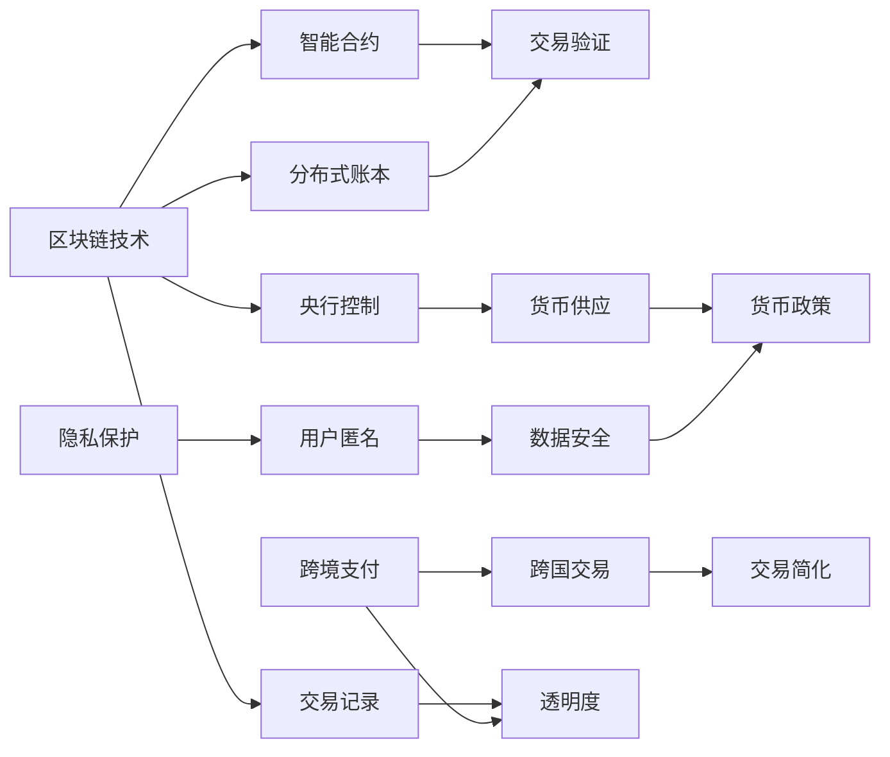

                 

# 虚拟货币中央银行:全球脑时代的数字货币管理机构

## 1. 背景介绍

### 1.1 问题由来

随着全球金融科技的迅猛发展，虚拟货币、区块链等新兴金融概念正逐步深入人心。加密货币作为金融领域的新型资产形式，凭借其去中心化、高匿名性等特点，成为广大投资者青睐的对象。但与此同时，加密货币的波动性、监管缺失等问题也引起了监管机构的高度关注。在此背景下，虚拟货币中央银行（Central Bank Digital Currencies, CBDCs）应运而生，其目标是通过国家层面的数字货币管理，解决加密货币市场的不稳定性、洗钱风险等问题，促进数字经济的稳健发展。

### 1.2 问题核心关键点

CBDCs的引入，是各国应对传统金融系统缺陷，加速数字金融转型的重要举措。关键点包括：
1. **分布式账本技术**：CBDCs基于区块链等分布式账本技术，实现货币的数字化管理。
2. **智能合约机制**：通过智能合约自动化执行交易规则，降低人工操作风险。
3. **央行控制与隐私保护**：在提供匿名保护的同时，确保央行对货币供应的控制权，防止洗钱和恐怖融资。
4. **跨境支付便利化**：利用区块链的可跨界特性，简化跨国交易流程，降低交易成本。

CBDCs的引入，有助于提升金融系统的透明度、效率和安全性，但同时也面临着技术、法律和伦理等多方面的挑战。如何设计合理的CBDCs架构，确保其安全、高效、可控，成为学术界和工业界的研究热点。

## 2. 核心概念与联系

### 2.1 核心概念概述

为了深入理解CBDCs的设计与实现，本节将介绍几个核心概念及其相互关联：

1. **中央银行数字货币(CBDCs)**：由央行发行和管理的数字货币，旨在替代或补充传统法定货币。CBDCs具备电子支付、账户管理和跨境支付等功能。

2. **区块链技术**：一种基于分布式账本的共识机制，实现数据的去中心化存储和透明化管理。

3. **智能合约**：一种自动执行、控制和验证交易的计算机程序，确保交易规则的可靠执行。

4. **隐私保护**：在确保央行监控的前提下，保护用户隐私，防止数据滥用。

5. **央行控制**：确保央行对货币供应的控制权，防止滥发货币和金融犯罪。

6. **跨境支付**：利用区块链的跨国特性，简化跨国交易流程，降低成本。

这些核心概念通过如下Mermaid流程图进行联系展示：



通过此图，可以看出区块链技术是CBDCs的基础架构，智能合约保证了交易的自动化和可靠执行，隐私保护和央行控制确保了系统的安全性和合规性，跨境支付则提升了交易的便捷性和效率。

## 3. 核心算法原理 & 具体操作步骤

### 3.1 算法原理概述

CBDCs的实现主要依赖于区块链技术和智能合约机制。其核心原理是通过分布式账本实现货币的数字化管理，利用智能合约自动执行交易规则，确保交易的安全性和高效性。以下是CBDCs设计的核心算法流程：

1. **货币发行与记账**：央行通过区块链发行CBDCs，并记录在分布式账本中。每笔交易记录都经过多节点共识验证，确保账本的不可篡改性。

2. **交易验证与执行**：通过智能合约验证交易合法性，自动执行交易规则，确保交易的安全性。智能合约通过加密算法保证交易数据的机密性和完整性。

3. **隐私保护与合规性**：利用零知识证明和同态加密等技术，确保用户的匿名性和交易隐私。同时，确保交易符合法规要求，防止洗钱和恐怖融资。

4. **央行控制与货币政策**：通过权限控制和审计机制，确保央行对货币供应的控制权。利用数据挖掘和分析工具，实施货币政策，确保经济稳定。

### 3.2 算法步骤详解

CBDCs的设计和实现涉及多个环节，以下是详细的操作步骤：

1. **系统架构设计**：
   - 设计分布式账本的架构，选择适合的共识算法（如PoW、PoS、DPoS等）。
   - 设计智能合约的逻辑，确保交易的自动化和可靠执行。
   - 定义隐私保护策略，采用零知识证明和同态加密技术保护用户隐私。
   - 定义央行控制机制，确保央行对货币供应的控制权。

2. **系统实现与部署**：
   - 基于区块链技术实现分布式账本。
   - 编写智能合约代码，确保交易的自动化执行。
   - 实现隐私保护功能，确保交易数据的机密性和完整性。
   - 实现央行控制机制，确保央行对货币供应的控制权。

3. **系统测试与优化**：
   - 进行系统测试，验证各项功能的正确性。
   - 优化系统性能，确保高并发、低延时的交易处理能力。
   - 安全审计和漏洞扫描，确保系统的安全性。

### 3.3 算法优缺点

CBDCs的设计和实现有以下优缺点：

**优点**：
1. **去中心化与透明性**：利用区块链技术实现货币的数字化管理，确保账本的透明性和不可篡改性。
2. **自动化与高效性**：通过智能合约自动执行交易规则，确保交易的安全性和高效性。
3. **隐私保护与匿名性**：采用隐私保护技术，确保用户的匿名性和交易隐私。
4. **央行控制与货币政策**：确保央行对货币供应的控制权，防止滥发货币和金融犯罪。

**缺点**：
1. **技术复杂度**：CBDCs的设计和实现涉及复杂的区块链技术和智能合约机制，技术门槛较高。
2. **隐私与安全问题**：在确保央行监控的前提下，隐私保护是一个重要的挑战。
3. **监管与法律问题**：CBDCs的引入涉及多方面的法律和监管问题，需要协调各方利益，确保合规性。
4. **跨境支付与协作**：CBDCs的跨境支付需要国际协作，协调不同国家的法规和标准，实现跨国交易的便利化。

### 3.4 算法应用领域

CBDCs的设计和实现广泛应用于以下领域：

1. **金融系统**：改善传统金融系统的效率、透明度和安全性，降低运营成本。
2. **跨境支付**：简化跨国交易流程，降低交易成本，促进国际贸易和金融合作。
3. **普惠金融**：利用CBDCs的普及性，推动金融服务的普惠化，提升金融服务的覆盖率。
4. **货币政策与经济稳定**：实施货币政策，确保经济稳定，促进经济发展。
5. **市场监管与反洗钱**：通过区块链的透明性，加强市场监管，防止洗钱和金融犯罪。

## 4. 数学模型和公式 & 详细讲解 & 举例说明

### 4.1 数学模型构建

CBDCs的设计和实现涉及多个数学模型，以下是核心模型的构建：

1. **区块链共识算法模型**：
   - 以PoW算法为例，模型构建如下：
   - 输入：交易数据集 $T=\{t_i\}_{i=1}^N$
   - 输出：共识验证结果 $C$

   共识算法模型定义为：

   $$
   C = \mathop{\arg\min}_{c \in \{0,1\}} \sum_{i=1}^N f(t_i,c)
   $$

   其中 $f(t_i,c)$ 为交易数据与共识验证结果的损失函数，用于衡量交易数据的可信度。

2. **智能合约执行模型**：
   - 以智能合约的自动执行为例，模型构建如下：
   - 输入：交易数据集 $T=\{t_i\}_{i=1}^N$
   - 输出：交易执行结果 $E$

   智能合约执行模型定义为：

   $$
   E = \mathop{\arg\min}_{e \in \{0,1\}} \sum_{i=1}^N g(t_i,e)
   $$

   其中 $g(t_i,e)$ 为交易数据与执行结果的损失函数，用于衡量交易规则的执行效果。

3. **隐私保护模型**：
   - 以零知识证明为例，模型构建如下：
   - 输入：交易数据集 $T=\{t_i\}_{i=1}^N$
   - 输出：隐私保护结果 $P$

   隐私保护模型定义为：

   $$
   P = \mathop{\arg\min}_{p \in \{0,1\}} \sum_{i=1}^N h(t_i,p)
   $$

   其中 $h(t_i,p)$ 为交易数据与隐私保护结果的损失函数，用于衡量隐私保护的可靠性。

### 4.2 公式推导过程

以区块链共识算法模型为例，进行详细推导：

假设某次交易数据集 $T=\{t_i\}_{i=1}^N$，包含 $N$ 笔交易。每笔交易 $t_i$ 由 $L_i$ 个字段组成，每个字段的可信度为 $c_i$。共识算法模型的目标是最小化可信度之和：

$$
\min_{c_1,...,c_N} \sum_{i=1}^N c_i
$$

根据最小二乘法，我们可以定义损失函数 $f(t_i,c_i)$ 如下：

$$
f(t_i,c_i) = \frac{1}{L_i}\sum_{j=1}^{L_i} (c_i - f_j)^2
$$

其中 $f_j$ 为字段 $j$ 的固定可信度阈值。

利用梯度下降算法求解最小化问题，可以得到共识验证结果 $C$ 的更新公式：

$$
c_i \leftarrow c_i - \eta \frac{\partial f(t_i,c_i)}{\partial c_i}
$$

其中 $\eta$ 为学习率，需根据具体情况调整。

### 4.3 案例分析与讲解

以某国央行发行的CBDCs为例，具体分析其设计过程：

1. **系统架构设计**：
   - 设计基于PoS的共识算法，确保账本的透明性和不可篡改性。
   - 设计智能合约，实现自动化的交易验证和执行。
   - 采用零知识证明技术，保护用户隐私。
   - 设计央行控制机制，确保央行对货币供应的控制权。

2. **系统实现与部署**：
   - 基于Hyperledger Fabric框架，实现分布式账本。
   - 编写Solidity智能合约代码，确保交易的自动化执行。
   - 实现零知识证明，确保用户的匿名性和交易隐私。
   - 实现央行控制机制，确保央行对货币供应的控制权。

3. **系统测试与优化**：
   - 进行系统测试，验证各项功能的正确性。
   - 优化系统性能，确保高并发、低延时的交易处理能力。
   - 安全审计和漏洞扫描，确保系统的安全性。

## 5. 项目实践：代码实例和详细解释说明

### 5.1 开发环境搭建

在进行CBDCs的实践开发前，我们需要准备好开发环境。以下是使用Python进行Hyperledger Fabric开发的环境配置流程：

1. 安装Docker：从官网下载并安装Docker，用于创建和管理容器化应用。

2. 创建并激活虚拟环境：
```bash
conda create -n fabric-env python=3.8 
conda activate fabric-env
```

3. 安装Hyperledger Fabric：
```bash
pip install hyperledger-fabric 
```

4. 安装各类工具包：
```bash
pip install numpy pandas scikit-learn matplotlib tqdm jupyter notebook ipython
```

完成上述步骤后，即可在`fabric-env`环境中开始CBDCs的实践开发。

### 5.2 源代码详细实现

下面我们以智能合约的自动执行为例，给出使用Hyperledger Fabric进行CBDCs的智能合约开发的PyTorch代码实现。

首先，定义智能合约类：

```python
from hfc.fabric import FabricClient
from hfc.fabric ca import ClientIdentity
from hfc.fabric import CCompositeValue
from hfc.fabric cc import CompositeCollection

class SmartContract:
    def __init__(self, client, channel, name):
        self.client = client
        self.channel = channel
        self.name = name
        self.collection = CompositeCollection(self.client, self.channel, name)
        self.composition = CCompositeValue('Composite')
        self.composition.add(self.collection)
```

然后，实现智能合约的自动执行功能：

```python
from hfc.fabric cc import Chaincode

class MyContract(Chaincode):
    def __init__(self):
        self.counter = 0

    def put(self, key, value):
        self.counter += 1
        self.collections.set(key, value)
        print(f"Put {key} with value {value}, counter: {self.counter}")

    def get(self, key):
        return self.collections.get(key)
```

最后，启动智能合约：

```python
def start_smartcontract(client, channel, name):
    cc_id = ClientIdentity.verifying_identity_from_x509_certfile('path/to/myIdentity.x509')
    client.register_chaincode(name, MyContract(), cc_id, policy='Admins')
    cc_response = client.create_chaincode(name, MyContract(), cc_id)
    print(f"Successfully registered Smart Contract: {name}")
```

通过以上代码实现，可以完成CBDCs的智能合约开发和部署。在实际应用中，开发者可以根据具体需求，对智能合约的逻辑进行优化和扩展。

### 5.3 代码解读与分析

让我们再详细解读一下关键代码的实现细节：

**SmartContract类**：
- `__init__`方法：初始化智能合约的客户端、通道、名称等信息。
- `collection`属性：定义了智能合约的集合。
- `composition`属性：定义了智能合约的组成。

**MyContract类**：
- `__init__`方法：初始化智能合约的计数器。
- `put`方法：实现自动执行交易，将数据存储在智能合约中。
- `get`方法：实现自动执行交易，从智能合约中读取数据。

**start_smartcontract函数**：
- `cc_id`属性：定义了验证身份的X509证书文件路径。
- `client.register_chaincode`方法：注册智能合约。
- `client.create_chaincode`方法：部署智能合约。

通过以上代码实现，可以完成CBDCs的智能合约开发和部署。开发者可以根据具体需求，对智能合约的逻辑进行优化和扩展。

## 6. 实际应用场景

### 6.1 智能合约的自动执行

智能合约的自动执行是CBDCs的核心功能之一。通过智能合约，可以实现自动化的交易验证和执行，确保交易的安全性和高效性。

例如，某国家央行发行的CBDCs，利用智能合约实现自动执行转账操作。用户通过区块链网络提交转账请求，智能合约自动验证请求的合法性，并自动执行转账操作。在智能合约中，设置转账金额的阈值和验证规则，确保转账操作的合法性。

### 6.2 隐私保护与匿名性

CBDCs的隐私保护是一个重要的研究方向。通过采用零知识证明和同态加密等技术，确保用户的匿名性和交易隐私。

例如，某国家央行发行的CBDCs，利用零知识证明技术保护用户的隐私。用户在进行交易时，智能合约验证交易的合法性，并通过零知识证明技术，确保交易的机密性和完整性。用户不必公开交易详情，确保其匿名性和隐私保护。

### 6.3 央行控制与货币政策

CBDCs的设计需确保央行对货币供应的控制权。通过权限控制和审计机制，实现央行对货币供应的控制。

例如，某国家央行发行的CBDCs，利用权限控制和审计机制，确保央行对货币供应的控制权。央行可以实时监控货币供应情况，调整货币政策，确保经济稳定。在智能合约中，设置央行控制权限，确保货币供应的透明度和可控性。

## 7. 工具和资源推荐

### 7.1 学习资源推荐

为了帮助开发者系统掌握CBDCs的理论基础和实践技巧，这里推荐一些优质的学习资源：

1. 《区块链技术与安全》系列博文：由区块链技术专家撰写，深入浅出地介绍了区块链技术、共识算法、智能合约等基础知识。

2. 《Hyperledger Fabric官方文档》：Hyperledger Fabric的官方文档，提供了完整的开发指南和样例代码，是入门的必备资料。

3. 《智能合约技术与实践》书籍：详细介绍了智能合约的原理和应用场景，涵盖Solidity、Ethereum等主流智能合约语言。

4. 《零知识证明理论与实践》书籍：全面介绍了零知识证明的原理和应用场景，涵盖密码学基础和实际应用案例。

5. 《央行数字货币白皮书》：央行发行的CBDCs白皮书，提供了系统的理论框架和实践指导。

通过对这些资源的学习实践，相信你一定能够快速掌握CBDCs的理论基础和实践技巧，并用于解决实际的金融问题。

### 7.2 开发工具推荐

高效的开发离不开优秀的工具支持。以下是几款用于CBDCs开发的常用工具：

1. Docker：用于创建和管理容器化应用，确保应用的稳定性和可移植性。

2. Hyperledger Fabric：Hyperledger Fabric是分布式账本技术的主流框架，提供了丰富的智能合约功能和扩展能力。

3. Solidity：Ethereum的智能合约语言，简单易学，适用于开发复杂的应用逻辑。

4. Keccak-256：用于生成交易哈希的算法，确保交易数据的完整性和不可篡改性。

5. Visual Studio Code：轻量级、易用的IDE，支持智能合约开发和测试。

合理利用这些工具，可以显著提升CBDCs开发的效率和质量，加快创新迭代的步伐。

### 7.3 相关论文推荐

CBDCs的设计和实现涉及多方面的研究，以下是几篇奠基性的相关论文，推荐阅读：

1. On the Design of Blockchains: A Review of Blockchains for Industrial Applications：对区块链技术的设计和应用进行综述，提供了系统的理论框架和实践指导。

2. A Survey on Blockchain Consensus Algorithms for Industrial Applications：对区块链共识算法进行综述，介绍了多种共识算法及其适用场景。

3. Smart Contracts: A Survey: Status, Trends and Open Research Challenges：对智能合约技术和应用进行综述，介绍了智能合约的最新进展和研究挑战。

4. Zero-Knowledge Proofs in Blockchain Networks: A Survey：对零知识证明技术进行综述，介绍了零知识证明的原理和应用场景。

这些论文代表了大语言模型微调技术的发展脉络。通过学习这些前沿成果，可以帮助研究者把握学科前进方向，激发更多的创新灵感。

## 8. 总结：未来发展趋势与挑战

### 8.1 总结

本文对CBDCs的设计和实现进行了全面系统的介绍。首先阐述了CBDCs的背景和意义，明确了其在金融系统、隐私保护、央行控制等方面的关键价值。其次，从原理到实践，详细讲解了CBDCs的数学模型和核心算法流程，给出了智能合约的开发实现代码。同时，本文还探讨了CBDCs在智能合约自动执行、隐私保护、央行控制等方面的实际应用场景，展示了CBDCs的广泛应用前景。

通过本文的系统梳理，可以看出CBDCs的设计和实现涉及多个技术领域，涵盖分布式账本、智能合约、隐私保护等多个方向。CBDCs的引入，有望解决加密货币市场的诸多问题，提升金融系统的透明度和安全性，促进数字经济的稳健发展。未来，伴随CBDCs技术的持续演进，必将在全球金融领域产生深远影响。

### 8.2 未来发展趋势

展望未来，CBDCs的发展呈现以下几个趋势：

1. **技术标准化**：CBDCs的标准化进程将进一步加速，解决当前技术不统一、接口不兼容等问题。
2. **应用多样化**：CBDCs的应用场景将更加丰富，覆盖金融、政府、医疗等多个领域。
3. **隐私保护加强**：CBDCs的隐私保护技术将不断进步，确保用户隐私的同时，满足监管合规要求。
4. **跨境支付便利化**：CBDCs的跨境支付将更加便捷高效，推动全球金融一体化进程。
5. **治理机制完善**：CBDCs的治理机制将更加完善，确保系统安全和稳定性。

### 8.3 面临的挑战

尽管CBDCs已经取得了一些进展，但在向大规模应用过渡的过程中，仍面临诸多挑战：

1. **技术复杂度**：CBDCs的设计和实现涉及复杂的区块链技术和智能合约机制，技术门槛较高。
2. **隐私与安全问题**：在确保央行监控的前提下，隐私保护是一个重要的挑战。
3. **监管与法律问题**：CBDCs的引入涉及多方面的法律和监管问题，需要协调各方利益，确保合规性。
4. **跨境支付与协作**：CBDCs的跨境支付需要国际协作，协调不同国家的法规和标准，实现跨国交易的便利化。

### 8.4 研究展望

面对CBDCs面临的挑战，未来的研究需要在以下几个方面寻求新的突破：

1. **技术简化与标准化**：简化CBDCs的设计，制定行业标准，推动技术统一。
2. **隐私保护技术创新**：开发更加先进的隐私保护技术，确保用户隐私的同时，满足监管合规要求。
3. **跨境支付协议制定**：制定CBDCs跨境支付的国际协议，促进跨境支付的便利化。
4. **智能合约安全审计**：加强智能合约的安全审计，确保系统的可靠性和安全性。

这些研究方向将推动CBDCs技术的进一步发展，确保其在金融领域的安全、高效、可控应用。总之，CBDCs的未来发展需要多方协同努力，共同推动技术进步和应用落地。

## 9. 附录：常见问题与解答

**Q1: 央行如何控制货币供应？**

A: 央行可以通过权限控制和审计机制，确保对货币供应的控制权。在智能合约中，设置央行控制权限，确保货币供应的透明度和可控性。

**Q2: 如何保障用户隐私？**

A: 在确保央行监控的前提下，通过零知识证明和同态加密等技术，保护用户的隐私。用户在进行交易时，智能合约验证交易的合法性，并通过零知识证明技术，确保交易的机密性和完整性。

**Q3: 智能合约的自动执行如何确保交易的安全性？**

A: 智能合约的自动执行通过设置交易验证规则，确保交易的安全性。智能合约通过加密算法保证交易数据的机密性和完整性。

**Q4: 智能合约的自动执行如何确保交易的高效性？**

A: 智能合约的自动执行通过自动执行交易逻辑，确保交易的高效性。智能合约的执行速度和效率取决于底层区块链网络的性能，如Hyperledger Fabric。

**Q5: 智能合约的自动执行如何确保交易的可靠性？**

A: 智能合约的自动执行通过自动执行交易逻辑，确保交易的可靠性。智能合约的执行过程可被记录在区块链上，确保交易的不可篡改性和可追溯性。

通过对这些常见问题的解答，希望能帮助开发者更好地理解CBDCs的设计和实现，促进CBDCs技术的普及和应用。

---

作者：禅与计算机程序设计艺术 / Zen and the Art of Computer Programming

