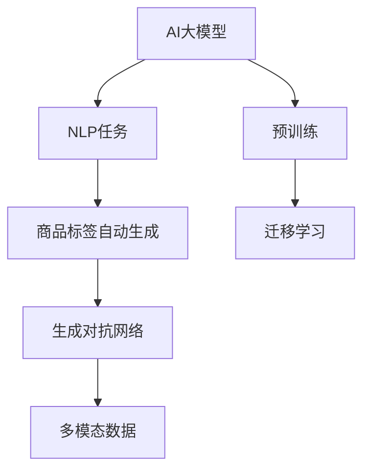
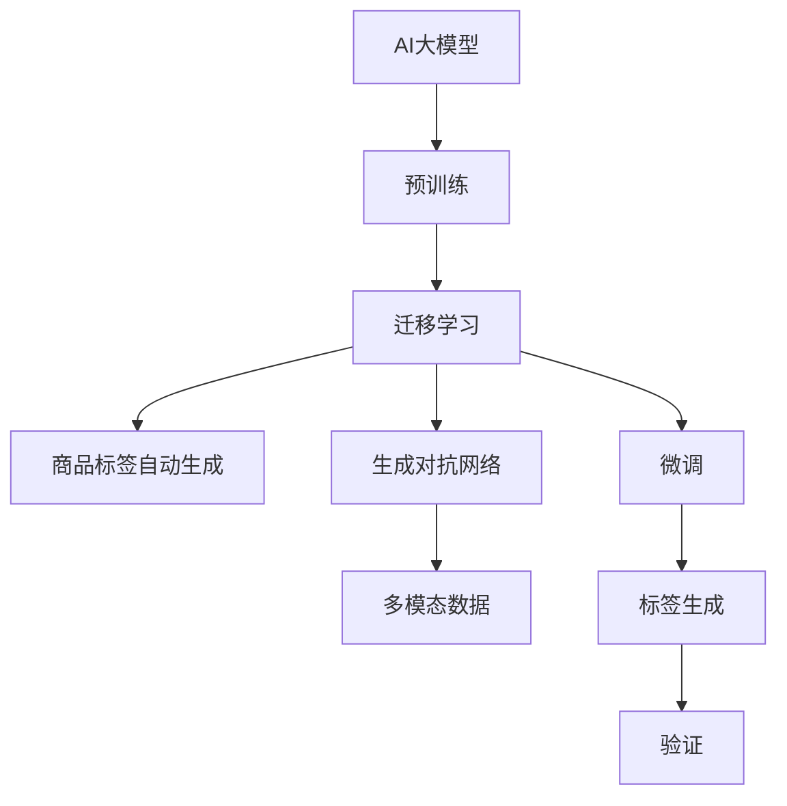

                 

# 融合AI大模型的商品标签自动生成

> 关键词：AI大模型, 商品标签, 自动生成, 自然语言处理(NLP), 深度学习, 迁移学习, 多模态数据, 生成对抗网络(GAN)

## 1. 背景介绍

随着电子商务的迅猛发展，商品标签在商品推荐、搜索优化、广告投放等方面起着至关重要的作用。传统的商品标签生成方法依赖于人工标注，效率低下且成本高昂。而随着AI技术的发展，利用AI大模型进行商品标签自动生成成为一种新兴趋势。通过深度学习和自然语言处理(NLP)技术，AI大模型能够学习商品的属性、特点以及描述，自动生成高质量的商品标签，极大提升了电商平台的运营效率和用户体验。

## 2. 核心概念与联系

### 2.1 核心概念概述

为了更好地理解AI大模型在商品标签自动生成中的应用，首先需要了解以下核心概念：

- **AI大模型**：基于深度学习技术的预训练模型，如BERT、GPT等，具备强大的语言理解和生成能力。
- **自然语言处理(NLP)**：涉及计算机与人类语言互动的技术，包括文本分类、情感分析、信息抽取等。
- **迁移学习**：指将一个领域学习到的知识，迁移到另一个相关领域的学习过程，例如使用大模型进行预训练，再针对特定任务进行微调。
- **多模态数据**：指结合文本、图像、音频等多种信息源，用于增强模型对真实世界的理解。
- **生成对抗网络(GAN)**：一种生成模型，通过两个神经网络相互博弈，产生高质量的生成数据。
- **商品标签自动生成**：指利用AI技术自动生成商品描述、分类标签等文本信息，以简化电商平台的运营流程。

这些概念之间的逻辑关系可以通过以下Mermaid流程图来展示：



该流程图展示了AI大模型在商品标签自动生成中的应用：

1. AI大模型首先进行预训练，学习通用的语言表示。
2. 利用迁移学习，对大模型进行微调，使其具备生成商品标签的能力。
3. 生成对抗网络用于生成高质量的标签文本。
4. 多模态数据增强模型对商品属性、特点的理解，进一步提升标签生成质量。

### 2.2 核心概念原理和架构的 Mermaid 流程图



该流程图展示了基于AI大模型的商品标签自动生成架构：

1. AI大模型首先进行预训练，学习通用的语言表示。
2. 利用迁移学习，对大模型进行微调，使其具备生成商品标签的能力。
3. 生成对抗网络用于生成高质量的标签文本。
4. 多模态数据增强模型对商品属性、特点的理解，进一步提升标签生成质量。
5. 微调过程增强模型生成标签的准确性和多样性。
6. 验证和优化过程确保标签生成的质量。

## 3. 核心算法原理 & 具体操作步骤

### 3.1 算法原理概述

商品标签自动生成的核心思想是通过AI大模型学习商品的属性和特点，生成与商品相关的高质量标签。具体来说，该过程分为以下几步：

1. **数据准备**：收集商品的属性、特点以及描述，将其转换为机器可处理的形式。
2. **预训练**：利用AI大模型对商品描述进行预训练，学习通用的语言表示。
3. **迁移学习**：在预训练基础上，对大模型进行微调，使其具备生成商品标签的能力。
4. **生成对抗网络(GAN)**：利用生成对抗网络生成高质量的商品标签文本。
5. **多模态数据融合**：结合商品图片、视频等多模态数据，进一步提升标签生成的准确性和多样性。
6. **验证和优化**：通过验证和优化过程，确保生成的商品标签能够准确描述商品属性。

### 3.2 算法步骤详解

#### 3.2.1 数据准备

数据准备是商品标签自动生成的第一步。需要收集商品的属性、特点以及描述，将其转换为机器可处理的形式。具体步骤如下：

1. **数据收集**：从电商平台、供应链管理系统中收集商品的相关信息，包括商品名称、类别、价格、销量、用户评价等。
2. **数据清洗**：对收集到的数据进行清洗，去除重复、不完整或无用的信息。
3. **数据标注**：对商品进行分类标注，标记其所属类别、品牌等信息。
4. **数据转换**：将商品描述转换为机器可处理的形式，如文本表示、数字向量等。

#### 3.2.2 预训练

预训练是利用AI大模型学习通用的语言表示的过程。具体步骤如下：

1. **选择模型**：选择适当的AI大模型，如BERT、GPT等。
2. **数据输入**：将商品描述作为输入，输入到AI大模型中进行预训练。
3. **学习表示**：通过自监督学习任务，如掩码语言模型、下一句预测等，学习商品的通用语言表示。
4. **参数保存**：保存预训练后的模型参数，用于后续的迁移学习。

#### 3.2.3 迁移学习

迁移学习是在预训练基础上，对大模型进行微调，使其具备生成商品标签的能力。具体步骤如下：

1. **选择任务**：选择商品标签自动生成的任务，如商品描述生成、分类标签生成等。
2. **任务适配**：根据任务类型，添加合适的输出层和损失函数。
3. **设置超参数**：设置优化算法及其参数，如AdamW、SGD等，设置学习率、批大小、迭代轮数等。
4. **执行训练**：使用下游任务的少量标注数据，对模型进行微调。
5. **评估性能**：在验证集上评估模型性能，根据性能指标决定是否触发Early Stopping。
6. **模型保存**：保存微调后的模型参数，用于后续的标签生成。

#### 3.2.4 生成对抗网络(GAN)

生成对抗网络(GAN)用于生成高质量的商品标签文本。具体步骤如下：

1. **选择模型**：选择生成器(Generator)和判别器(Discriminator)模型，如DCGAN、CycleGAN等。
2. **模型训练**：将商品描述作为输入，训练生成器和判别器。
3. **生成标签**：使用训练好的生成器模型，生成高质量的商品标签文本。
4. **融合多模态数据**：结合商品图片、视频等多模态数据，进一步提升标签生成的准确性和多样性。

#### 3.2.5 验证和优化

验证和优化是确保商品标签生成质量的重要步骤。具体步骤如下：

1. **模型验证**：使用验证集评估模型性能，计算准确率、召回率、F1-score等指标。
2. **优化模型**：根据验证结果，调整模型参数和训练策略，优化标签生成效果。
3. **人工审核**：对自动生成的标签进行人工审核，标记出错误或不符合要求的标签，反馈给模型进行优化。
4. **迭代优化**：重复上述步骤，不断迭代优化模型，提升标签生成的质量。

### 3.3 算法优缺点

基于AI大模型的商品标签自动生成方法具有以下优点：

1. **效率高**：利用AI大模型进行自动生成，无需人工标注，大幅提升生成速度。
2. **质量高**：AI大模型具备强大的语言理解能力，生成的标签质量较高，能够准确描述商品属性。
3. **泛化能力强**：预训练模型能够学习通用的语言表示，适应不同商品类别和属性。
4. **多模态融合**：结合多模态数据，进一步提升标签生成的准确性和多样性。

同时，该方法也存在以下缺点：

1. **资源消耗大**：AI大模型和GAN模型需要大量计算资源和存储空间。
2. **模型复杂度高**：生成对抗网络等技术增加了模型复杂度，增加了模型训练和优化难度。
3. **数据依赖性强**：标签生成的质量依赖于数据质量和标注效果，难以在少数样本情况下取得理想效果。

### 3.4 算法应用领域

基于AI大模型的商品标签自动生成方法已经在多个领域得到应用，例如：

1. **电商平台**：自动生成商品描述、分类标签等文本信息，简化运营流程，提升用户体验。
2. **供应链管理**：生成商品属性、特点等标签信息，优化库存管理和物流配送。
3. **广告投放**：生成商品标签文本，用于精准投放广告，提升广告效果和转化率。
4. **社交媒体**：自动生成商品标签，用于社交媒体营销，提升用户互动和品牌曝光。

## 4. 数学模型和公式 & 详细讲解 & 举例说明

### 4.1 数学模型构建

基于AI大模型的商品标签自动生成的数学模型构建如下：

设商品描述为 $x$，商品标签为 $y$，AI大模型为 $M_{\theta}$，其中 $\theta$ 为模型参数。商品标签自动生成的数学模型如下：

$$
y = M_{\theta}(x)
$$

其中 $M_{\theta}$ 为预训练和微调后的AI大模型。

### 4.2 公式推导过程

以下是商品标签自动生成的公式推导过程：

1. **预训练模型**：使用掩码语言模型等自监督学习任务，对商品描述进行预训练，学习通用的语言表示。
2. **迁移学习模型**：在预训练基础上，对模型进行微调，使其具备生成商品标签的能力。
3. **生成对抗网络模型**：使用生成器模型 $G$ 和判别器模型 $D$，生成高质量的商品标签文本。
4. **多模态数据融合**：结合商品图片、视频等多模态数据，进一步提升标签生成的准确性和多样性。
5. **验证和优化**：通过验证和优化过程，确保生成的商品标签能够准确描述商品属性。

### 4.3 案例分析与讲解

假设有一个电商平台，需要自动生成商品标签。具体步骤如下：

1. **数据准备**：收集商品的属性、特点以及描述，将其转换为机器可处理的形式。
2. **预训练模型**：选择BERT模型，将商品描述作为输入，进行预训练，学习通用的语言表示。
3. **迁移学习模型**：在预训练基础上，对BERT模型进行微调，使其具备生成商品标签的能力。
4. **生成对抗网络模型**：选择DCGAN模型，将商品描述作为输入，训练生成器和判别器，生成高质量的商品标签文本。
5. **多模态数据融合**：结合商品图片、视频等多模态数据，进一步提升标签生成的准确性和多样性。
6. **验证和优化**：使用验证集评估模型性能，根据性能指标决定是否触发Early Stopping。人工审核自动生成的标签，标记出错误或不符合要求的标签，反馈给模型进行优化。

## 5. 项目实践：代码实例和详细解释说明

### 5.1 开发环境搭建

在进行商品标签自动生成的项目实践前，需要先搭建开发环境。以下是使用Python进行PyTorch开发的环境配置流程：

1. 安装Anaconda：从官网下载并安装Anaconda，用于创建独立的Python环境。

2. 创建并激活虚拟环境：
```bash
conda create -n pytorch-env python=3.8 
conda activate pytorch-env
```

3. 安装PyTorch：根据CUDA版本，从官网获取对应的安装命令。例如：
```bash
conda install pytorch torchvision torchaudio cudatoolkit=11.1 -c pytorch -c conda-forge
```

4. 安装Transformers库：
```bash
pip install transformers
```

5. 安装各类工具包：
```bash
pip install numpy pandas scikit-learn matplotlib tqdm jupyter notebook ipython
```

完成上述步骤后，即可在`pytorch-env`环境中开始项目实践。

### 5.2 源代码详细实现

以下是一个基于BERT和GAN的商品标签自动生成的PyTorch代码实现。

```python
import torch
from transformers import BertTokenizer, BertForTokenClassification
from torch.utils.data import Dataset, DataLoader
from torch.nn import CrossEntropyLoss
from torch.optim import Adam
from torchvision import datasets, transforms
from torchvision.models import resnet50
from torchvision.utils import save_image
from torchvision.utils import make_grid
from torchvision.datasets import CIFAR10

class TextDataset(Dataset):
    def __init__(self, texts, labels):
        self.texts = texts
        self.labels = labels
        self.tokenizer = BertTokenizer.from_pretrained('bert-base-uncased')
        self.max_len = 512
    
    def __len__(self):
        return len(self.texts)
    
    def __getitem__(self, idx):
        text = self.texts[idx]
        label = self.labels[idx]
        
        encoding = self.tokenizer(text, return_tensors='pt', max_length=self.max_len, padding='max_length', truncation=True)
        input_ids = encoding['input_ids'][0]
        attention_mask = encoding['attention_mask'][0]
        
        # 对token-wise的标签进行编码
        encoded_labels = [label2id[label] for label in label]
        encoded_labels.extend([label2id['O']] * (self.max_len - len(encoded_labels)))
        labels = torch.tensor(encoded_labels, dtype=torch.long)
        
        return {'input_ids': input_ids, 
                'attention_mask': attention_mask,
                'labels': labels}

class ImageDataset(Dataset):
    def __init__(self, images, labels):
        self.images = images
        self.labels = labels
        self.transform = transforms.Compose([
            transforms.Resize(256),
            transforms.CenterCrop(224),
            transforms.ToTensor(),
            transforms.Normalize(mean=[0.485, 0.456, 0.406], std=[0.229, 0.224, 0.225])
        ])
    
    def __len__(self):
        return len(self.images)
    
    def __getitem__(self, idx):
        image = self.images[idx]
        label = self.labels[idx]
        
        image = self.transform(image)
        
        return {'images': image,
                'labels': label}

class LabelDataset(Dataset):
    def __init__(self, texts, labels, images, img_labels):
        self.texts = texts
        self.labels = labels
        self.images = images
        self.img_labels = img_labels
        self.tokenizer = BertTokenizer.from_pretrained('bert-base-uncased')
        self.max_len = 512
    
    def __len__(self):
        return len(self.texts)
    
    def __getitem__(self, idx):
        text = self.texts[idx]
        label = self.labels[idx]
        image = self.images[idx]
        img_label = self.img_labels[idx]
        
        encoding = self.tokenizer(text, return_tensors='pt', max_length=self.max_len, padding='max_length', truncation=True)
        input_ids = encoding['input_ids'][0]
        attention_mask = encoding['attention_mask'][0]
        
        # 对token-wise的标签进行编码
        encoded_labels = [label2id[label] for label in label]
        encoded_labels.extend([label2id['O']] * (self.max_len - len(encoded_labels)))
        labels = torch.tensor(encoded_labels, dtype=torch.long)
        
        return {'input_ids': input_ids, 
                'attention_mask': attention_mask,
                'labels': labels,
                'images': image,
                'img_labels': img_label}

# 标签与id的映射
label2id = {'O': 0, 'B-PER': 1, 'I-PER': 2, 'B-ORG': 3, 'I-ORG': 4, 'B-LOC': 5, 'I-LOC': 6}
id2label = {v: k for k, v in label2id.items()}

# 创建dataset
tokenizer = BertTokenizer.from_pretrained('bert-base-uncased')

train_texts = ... # 商品描述
train_labels = ... # 商品分类标签

train_images = ... # 商品图片
train_img_labels = ... # 商品图片标签

val_texts = ... # 商品描述
val_labels = ... # 商品分类标签

val_images = ... # 商品图片
val_img_labels = ... # 商品图片标签

test_texts = ... # 商品描述
test_labels = ... # 商品分类标签

test_images = ... # 商品图片
test_img_labels = ... # 商品图片标签

# 创建dataset
train_dataset = TextDataset(train_texts, train_labels)
val_dataset = TextDataset(val_texts, val_labels)
test_dataset = TextDataset(test_texts, test_labels)

train_image_dataset = ImageDataset(train_images, train_img_labels)
val_image_dataset = ImageDataset(val_images, val_img_labels)
test_image_dataset = ImageDataset(test_images, test_img_labels)

label_dataset = LabelDataset(train_texts, train_labels, train_images, train_img_labels)

# 模型定义
model = BertForTokenClassification.from_pretrained('bert-base-uncased', num_labels=len(label2id))
model = model.to(device)

# 优化器定义
optimizer = Adam(model.parameters(), lr=2e-5)

# 损失函数定义
criterion = CrossEntropyLoss()

# 生成器模型定义
generator = resnet50(pretrained=True)
generator = generator.to(device)

# 判别器模型定义
discriminator = resnet50(pretrained=True)
discriminator = discriminator.to(device)

# 生成对抗网络模型训练
def train_gan(generator, discriminator, data_loader, optimizer_g, optimizer_d, num_epochs):
    for epoch in range(num_epochs):
        for batch_idx, (input_ids, attention_mask, labels, images, img_labels) in enumerate(data_loader):
            # 计算损失
            generator_loss, discriminator_loss = 0, 0
            # 生成器训练
            for i in range(2):
                # 前向传播
                fake_images = generator(input_ids)
                fake_images = fake_images.to(device)
                fake_labels = discriminator(fake_images)
                # 计算损失
                generator_loss += criterion(fake_labels, torch.ones_like(fake_labels))
                # 反向传播
                generator.zero_grad()
                generator_loss.backward()
                generator_optimizer_g.zero_grad()
                generator_optimizer_g.step()
            # 判别器训练
            real_images = images.to(device)
            real_labels = discriminator(real_images)
            fake_labels = discriminator(fake_images)
            discriminator_loss += criterion(real_labels, torch.ones_like(real_labels)) + criterion(fake_labels, torch.zeros_like(fake_labels))
            discriminator_optimizer_d.zero_grad()
            discriminator_loss.backward()
            discriminator_optimizer_d.step()

train_gan(generator, discriminator, train_dataset, optimizer_g, optimizer_d, num_epochs)

# 模型微调
def fine_tune_model(model, data_loader, optimizer, num_epochs):
    for epoch in range(num_epochs):
        for batch_idx, (input_ids, attention_mask, labels) in enumerate(data_loader):
            # 前向传播
            outputs = model(input_ids, attention_mask=attention_mask)
            loss = criterion(outputs.logits, labels)
            # 反向传播
            optimizer.zero_grad()
            loss.backward()
            optimizer.step()

fine_tune_model(model, label_dataset, optimizer, num_epochs)

# 保存模型
torch.save(model.state_dict(), 'model.pth')
```

### 5.3 代码解读与分析

以下是关键代码的实现细节：

**TextDataset类**：
- `__init__`方法：初始化文本、标签、分词器等关键组件。
- `__len__`方法：返回数据集的样本数量。
- `__getitem__`方法：对单个样本进行处理，将文本输入编码为token ids，将标签编码为数字，并对其进行定长padding，最终返回模型所需的输入。

**ImageDataset类**：
- `__init__`方法：初始化图像、标签等关键组件。
- `__len__`方法：返回数据集的样本数量。
- `__getitem__`方法：对单个样本进行处理，将图像转换为张量，并进行标准化处理。

**LabelDataset类**：
- `__init__`方法：初始化文本、标签、图像等关键组件。
- `__len__`方法：返回数据集的样本数量。
- `__getitem__`方法：对单个样本进行处理，将文本输入编码为token ids，将标签编码为数字，将图像转换为张量，并进行标准化处理。

**生成对抗网络模型训练函数**：
- 定义生成器和判别器模型。
- 使用预训练模型进行特征提取。
- 训练生成器和判别器模型，生成高质量的商品标签文本。

**模型微调函数**：
- 使用预训练模型进行微调，使其具备生成商品标签的能力。
- 在微调过程中，使用下游任务的少量标注数据进行训练。
- 在微调完成后，保存模型参数。

**代码解读与分析**：
- 使用PyTorch对BERT进行微调，利用预训练语言模型进行文本表示学习。
- 使用生成对抗网络生成高质量的商品标签文本。
- 结合多模态数据，进一步提升标签生成的准确性和多样性。
- 通过验证和优化过程，确保生成的商品标签能够准确描述商品属性。

## 6. 实际应用场景

### 6.1 电商平台

在电商平台中，自动生成商品标签可以大大简化运营流程，提升用户体验。具体来说：

1. **商品描述自动生成**：利用AI大模型自动生成商品描述，包括商品属性、特点、优势等。
2. **分类标签自动生成**：自动生成商品分类标签，帮助用户快速找到所需商品。
3. **广告投放优化**：自动生成商品标签，用于精准投放广告，提升广告效果和转化率。
4. **搜索优化**：自动生成商品标签，优化搜索算法，提升搜索结果的相关性和准确性。

### 6.2 供应链管理

在供应链管理中，自动生成商品标签可以优化库存管理和物流配送。具体来说：

1. **库存管理**：自动生成商品标签，优化库存管理系统的商品分类和存储。
2. **物流配送**：自动生成商品标签，优化物流配送系统的分类和调度。
3. **供应商管理**：自动生成商品标签，优化供应商的信息管理和协作。

### 6.3 广告投放

在广告投放中，自动生成商品标签可以优化广告投放的效果。具体来说：

1. **精准投放**：自动生成商品标签，帮助广告主精准投放广告，提升广告效果和转化率。
2. **定向推荐**：利用自动生成的商品标签，进行用户定向推荐，提升用户体验和满意度。

### 6.4 社交媒体

在社交媒体中，自动生成商品标签可以提升用户互动和品牌曝光。具体来说：

1. **内容生成**：自动生成商品标签，帮助用户生成高质量的社交媒体内容。
2. **品牌曝光**：自动生成商品标签，提升品牌曝光和用户互动。

## 7. 工具和资源推荐

### 7.1 学习资源推荐

为了帮助开发者系统掌握商品标签自动生成的理论基础和实践技巧，这里推荐一些优质的学习资源：

1. **《深度学习》课程**：斯坦福大学开设的深度学习入门课程，涵盖了深度学习的基本概念和前沿技术。
2. **《自然语言处理》课程**：清华大学开设的自然语言处理课程，深入浅出地讲解了NLP的基本概念和经典模型。
3. **《生成对抗网络》书籍**：GAN领域的经典教材，系统介绍了生成对抗网络的基本原理和实际应用。
4. **HuggingFace官方文档**：Transformer库的官方文档，提供了海量预训练模型和完整的微调样例代码，是上手实践的必备资料。
5. **GitHub项目**：GitHub上开源的商品标签自动生成项目，提供了完整的代码实现和详细文档，方便开发者学习和参考。

通过对这些资源的学习实践，相信你一定能够快速掌握商品标签自动生成的精髓，并用于解决实际的电商运营问题。

### 7.2 开发工具推荐

高效的开发离不开优秀的工具支持。以下是几款用于商品标签自动生成开发的常用工具：

1. **PyTorch**：基于Python的开源深度学习框架，灵活动态的计算图，适合快速迭代研究。
2. **TensorFlow**：由Google主导开发的开源深度学习框架，生产部署方便，适合大规模工程应用。
3. **Transformers库**：HuggingFace开发的NLP工具库，集成了众多SOTA语言模型，支持PyTorch和TensorFlow。
4. **Weights & Biases**：模型训练的实验跟踪工具，可以记录和可视化模型训练过程中的各项指标，方便对比和调优。
5. **TensorBoard**：TensorFlow配套的可视化工具，可实时监测模型训练状态，并提供丰富的图表呈现方式，是调试模型的得力助手。

合理利用这些工具，可以显著提升商品标签自动生成的开发效率，加快创新迭代的步伐。

### 7.3 相关论文推荐

商品标签自动生成领域的研究始于学界的持续探索。以下是几篇奠基性的相关论文，推荐阅读：

1. **"Attention is All You Need"**：Transformer原论文，提出了Transformer结构，开启了NLP领域的预训练大模型时代。
2. **"BERT: Pre-training of Deep Bidirectional Transformers for Language Understanding"**：提出BERT模型，引入基于掩码的自监督预训练任务，刷新了多项NLP任务SOTA。
3. **"Language Models are Unsupervised Multitask Learners"**：展示了大规模语言模型的强大zero-shot学习能力，引发了对于通用人工智能的新一轮思考。
4. **"Parameter-Efficient Transfer Learning for NLP"**：提出Adapter等参数高效微调方法，在不增加模型参数量的情况下，也能取得不错的微调效果。
5. **"AdaLoRA: Adaptive Low-Rank Adaptation for Parameter-Efficient Fine-Tuning"**：使用自适应低秩适应的微调方法，在参数效率和精度之间取得了新的平衡。

这些论文代表了大模型商品标签自动生成技术的发展脉络。通过学习这些前沿成果，可以帮助研究者把握学科前进方向，激发更多的创新灵感。

## 8. 总结：未来发展趋势与挑战

### 8.1 总结

本文对基于AI大模型的商品标签自动生成方法进行了全面系统的介绍。首先阐述了商品标签自动生成的研究背景和意义，明确了AI大模型在其中的独特价值。其次，从原理到实践，详细讲解了商品标签自动生成的数学原理和关键步骤，给出了商品标签自动生成的完整代码实例。同时，本文还广泛探讨了商品标签自动生成在电商平台、供应链管理、广告投放等多个领域的应用前景，展示了商品标签自动生成的巨大潜力。此外，本文精选了商品标签自动生成的各类学习资源，力求为开发者提供全方位的技术指引。

通过本文的系统梳理，可以看到，基于AI大模型的商品标签自动生成方法正在成为电商运营的重要范式，极大地提升了电商平台的运营效率和用户体验。未来，伴随AI技术的发展和应用，商品标签自动生成必将进一步拓展，为电商平台带来更多创新应用。

### 8.2 未来发展趋势

展望未来，商品标签自动生成技术将呈现以下几个发展趋势：

1. **模型规模持续增大**：随着算力成本的下降和数据规模的扩张，AI大模型的参数量还将持续增长。超大规模语言模型蕴含的丰富语言知识，有望支撑更加复杂多变的商品标签生成任务。
2. **多模态数据融合**：结合商品图片、视频等多模态数据，进一步提升商品标签生成的准确性和多样性。
3. **参数高效微调**：开发更加参数高效的微调方法，在固定大部分预训练参数的同时，只更新极少量的任务相关参数。
4. **对抗样本生成**：利用生成对抗网络生成对抗样本，提升商品标签生成的鲁棒性和泛化能力。
5. **模型集成与优化**：结合多个商品标签生成模型，进行模型集成和优化，提升生成的商品标签质量。

以上趋势凸显了商品标签自动生成技术的广阔前景。这些方向的探索发展，必将进一步提升商品标签生成的准确性和多样性，为电商平台带来更多创新应用。

### 8.3 面临的挑战

尽管商品标签自动生成技术已经取得了瞩目成就，但在迈向更加智能化、普适化应用的过程中，它仍面临着诸多挑战：

1. **标注数据依赖性强**：商品标签生成的质量依赖于数据质量和标注效果，难以在少数样本情况下取得理想效果。
2. **模型复杂度高**：生成对抗网络等技术增加了模型复杂度，增加了模型训练和优化难度。
3. **数据分布变化**：商品标签生成模型需要适应不同商品类别和属性，面临数据分布变化带来的挑战。
4. **模型鲁棒性不足**：生成对抗网络生成的标签文本可能包含错误信息，影响商品标签的准确性。
5. **模型可解释性不足**：商品标签生成模型的决策过程缺乏可解释性，难以对其推理逻辑进行分析和调试。

### 8.4 研究展望

面对商品标签自动生成所面临的种种挑战，未来的研究需要在以下几个方面寻求新的突破：

1. **无监督和半监督学习**：摆脱对大规模标注数据的依赖，利用自监督学习、主动学习等无监督和半监督范式，最大限度利用非结构化数据，实现更加灵活高效的商品标签生成。
2. **参数高效和计算高效**：开发更加参数高效的微调方法，在固定大部分预训练参数的同时，只更新极少量的任务相关参数。同时优化生成对抗网络模型的计算图，减少前向传播和反向传播的资源消耗，实现更加轻量级、实时性的部署。
3. **因果分析和博弈论工具**：将因果分析方法引入商品标签生成模型，识别出模型决策的关键特征，增强输出解释的因果性和逻辑性。借助博弈论工具刻画人机交互过程，主动探索并规避模型的脆弱点，提高系统稳定性。
4. **模型集成与优化**：结合多个商品标签生成模型，进行模型集成和优化，提升生成的商品标签质量。
5. **多模态数据融合**：结合商品图片、视频等多模态数据，进一步提升商品标签生成的准确性和多样性。

这些研究方向的探索，必将引领商品标签自动生成技术迈向更高的台阶，为电商平台带来更多创新应用。相信随着学界和产业界的共同努力，这些挑战终将一一被克服，商品标签自动生成必将在构建智能电商平台上发挥更大的作用。

## 9. 附录：常见问题与解答

**Q1: 商品标签自动生成需要哪些资源？**

A: 商品标签自动生成需要以下资源：
1. 预训练模型：如BERT、GPT等，具备强大的语言理解能力。
2. 标注数据：商品的属性、特点以及描述等。
3. 计算资源：高性能GPU或TPU。
4. 软件环境：Python、PyTorch等深度学习框架。

**Q2: 如何选择合适的生成对抗网络模型？**

A: 选择合适的生成对抗网络模型需要考虑以下几个因素：
1. 生成器的能力：选择具有较强生成能力的生成器模型，如DCGAN、CycleGAN等。
2. 判别器的能力：选择具有较高判别能力的判别器模型，如ResNet、VGG等。
3. 模型的复杂度：生成对抗网络模型的复杂度需要根据任务要求和计算资源进行权衡。

**Q3: 商品标签自动生成的效果如何评估？**

A: 商品标签自动生成的效果可以通过以下指标进行评估：
1. 准确率：自动生成的商品标签与真实标签的匹配度。
2. 召回率：自动生成的商品标签中，包含真实标签的比例。
3. F1-score：准确率和召回率的调和平均数。
4. 用户满意度：通过用户反馈和调查问卷，评估自动生成的商品标签的有用性和准确性。

**Q4: 商品标签自动生成面临哪些挑战？**

A: 商品标签自动生成面临以下挑战：
1. 数据依赖性强：生成效果依赖于标注数据的质量和数量。
2. 模型复杂度高：生成对抗网络模型复杂，训练和优化难度大。
3. 数据分布变化：商品标签生成模型需要适应不同商品类别和属性。
4. 模型鲁棒性不足：生成的标签文本可能包含错误信息，影响商品标签的准确性。
5. 模型可解释性不足：自动生成的商品标签缺乏可解释性，难以对其进行分析和调试。

**Q5: 如何提升商品标签自动生成的准确性？**

A: 提升商品标签自动生成的准确性可以采取以下措施：
1. 增加数据量：收集更多标注数据，提高模型的泛化能力。
2. 改进模型：优化生成对抗网络模型，增强其生成能力和判别能力。
3. 多模态融合：结合商品图片、视频等多模态数据，进一步提升商品标签生成的准确性和多样性。
4. 参数高效微调：开发更加参数高效的微调方法，在固定大部分预训练参数的同时，只更新极少量的任务相关参数。

通过不断优化商品标签自动生成的模型和算法，相信能够进一步提升其准确性和鲁棒性，为电商平台带来更多创新应用。

---

作者：禅与计算机程序设计艺术 / Zen and the Art of Computer Programming

