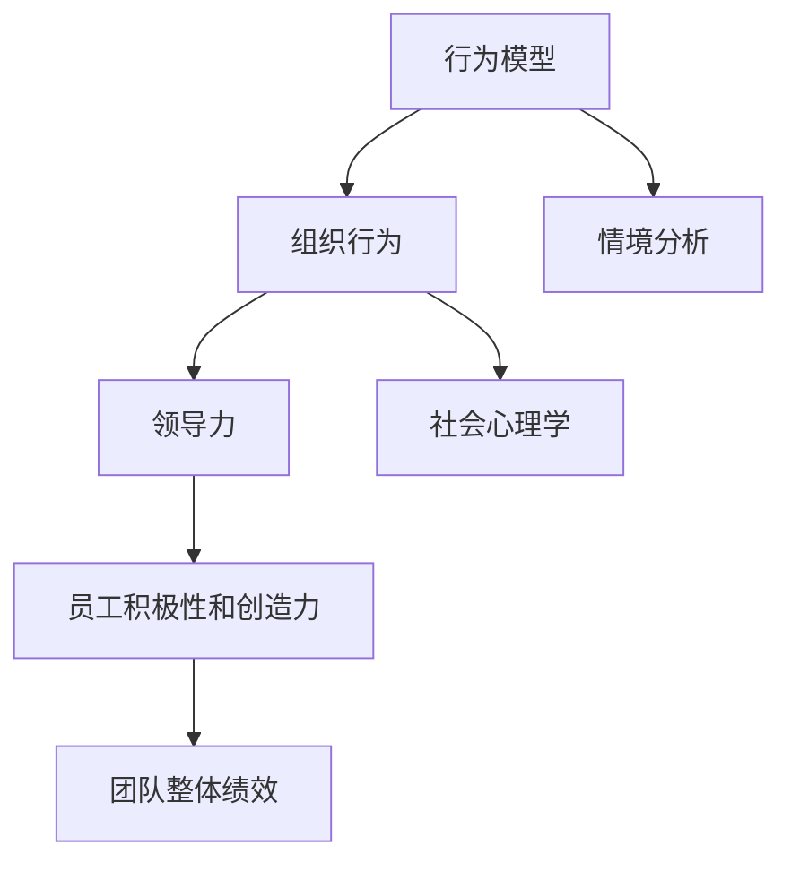

                 

# 行为模型:管理者塑造团队习惯的工具

> 关键词：行为模型,管理者,团队习惯,组织行为,领导力

## 1. 背景介绍

### 1.1 问题由来

在现代企业的管理实践中，团队协作的效率和效果往往是企业成败的关键。然而，不同成员间的协作习惯和工作方式差异巨大，影响了团队的整体表现。如何塑造一种高效率、高成效的团队习惯，成为管理者们关注的焦点。

传统的管理理论和方法，如泰勒的科学管理、法约尔的五大职能管理等，已经指导了一代代管理者，但这些理论往往侧重于结构和流程的优化，而对人的行为习惯关注不足。如何更深入地理解员工的行为模式，并有效引导其向组织目标靠拢，是一个迫切需要解决的问题。

### 1.2 问题核心关键点

要解决上述问题，首先需要了解员工的行为模式和习惯形成机制。行为模型就是基于这种需要而生的，旨在揭示员工行为的内在规律，为管理者提供一种塑造团队习惯的科学方法。行为模型的核心在于识别员工在不同情境下的行为模式，并引导其形成期望的行为习惯。

行为模型关注的是人的心理和社会行为，而不是单一的物理和技术因素。它的目标是：

- 识别个体和团队的行为模式，理解其形成机制。
- 提供有针对性的干预措施，帮助员工形成期望的行为习惯。
- 提升团队协作效率和效果，推动组织目标的实现。

### 1.3 问题研究意义

研究行为模型对于管理者具有重要意义：

- 提高管理效率：通过深入理解员工行为，管理者可以制定更有效的管理策略，提高团队整体表现。
- 增强组织竞争力：良好的团队协作习惯，有助于企业快速响应市场变化，提升竞争力。
- 促进员工成长：行为模型的应用可以帮助员工自我反思和提升，增强其职业满意度。

## 2. 核心概念与联系

### 2.1 核心概念概述

为了更好地理解行为模型及其在管理中的应用，我们先介绍一些关键概念：

- **行为模型(behavior model)**：一种用于描述个体和群体行为规律的概念模型。它通过识别行为触发条件和行为反应机制，预测和解释员工在不同情境下的行为表现。

- **组织行为(organizational behavior)**：指员工在组织环境中表现出来的行为模式，包括工作态度、沟通方式、决策过程等。

- **领导力(leadership)**：管理者通过其行为和决策对团队成员产生影响的过程。领导力能够激发员工积极性和创造力，提升团队整体绩效。

- **社会心理学(social psychology)**：研究个体和社会群体行为心理过程的学科，为行为模型提供了理论和实证基础。

- **情境分析(situation analysis)**：识别影响行为的外部环境因素，如任务性质、工作压力、团队关系等。

这些概念构成了行为模型的核心框架，管理者通过理解这些概念，能够更有效地塑造团队习惯。

### 2.2 核心概念原理和架构的 Mermaid 流程图



### 2.3 核心概念联系

这些核心概念之间有着紧密的联系：

- 行为模型通过情境分析，识别员工在不同情境下的行为模式，理解其行为触发条件和反应机制。
- 组织行为是行为模型研究的对象，行为模型通过分析组织行为，揭示其内在规律。
- 领导力是行为模型的应用场景，管理者通过运用行为模型，引导员工形成期望的行为习惯。
- 社会心理学为行为模型提供了理论支持，解释了行为背后的心理机制。
- 行为模型与组织行为结合，提升团队协作效率，推动组织目标实现。

这些概念相互依存，共同构成了行为模型研究的完整框架。

## 3. 核心算法原理 & 具体操作步骤

### 3.1 算法原理概述

行为模型作为管理者塑造团队习惯的工具，其核心算法原理主要基于心理学和社会行为学的研究成果。下面，我们将从行为触发条件和行为反应机制两个方面，简要介绍行为模型的算法原理。

### 3.2 算法步骤详解

行为模型的具体操作步骤主要包括以下几个步骤：

1. **情境分析**：识别影响员工行为的环境因素，包括工作任务、工作压力、团队关系等。

2. **行为识别**：通过行为数据收集和分析，识别员工在不同情境下的行为模式。

3. **行为预测**：基于行为模式和情境分析，预测员工在特定情境下的行为反应。

4. **行为干预**：根据行为预测结果，制定有针对性的干预措施，帮助员工形成期望的行为习惯。

5. **效果评估**：通过行为数据反馈，评估行为干预的效果，不断优化干预策略。

### 3.3 算法优缺点

行为模型在塑造团队习惯方面具有以下优点：

- **科学性**：基于心理学和社会行为学的研究成果，具有较强的理论基础。
- **普适性**：适用于各种组织和团队，不同情境下的行为模式识别和干预策略均可参考。
- **可操作性**：提供具体的干预措施，管理者易于实施和评估。

同时，行为模型也存在一些缺点：

- **复杂性**：需要收集和分析大量的行为数据，对技术要求较高。
- **不确定性**：员工行为受多因素影响，行为模型无法完全预测。
- **主观性**：情境分析和干预策略的设计，可能受到管理者的主观判断影响。

### 3.4 算法应用领域

行为模型在企业管理中的应用领域广泛，主要包括以下几个方面：

1. **人力资源管理**：通过行为模型分析员工绩效，优化招聘、培训和绩效管理策略。

2. **团队协作管理**：通过行为模型揭示团队协作中的问题，制定有针对性的协作策略，提升团队效率。

3. **领导力发展**：通过行为模型评估领导者的行为影响，制定领导力培训计划，提升领导者影响力。

4. **员工激励管理**：通过行为模型理解员工动机，制定有针对性的激励策略，提升员工积极性和创造力。

5. **组织文化建设**：通过行为模型分析组织文化特点，制定符合组织文化的行为引导策略。

这些应用领域展示了行为模型的广泛适用性，其核心价值在于帮助管理者更科学地理解员工行为，提升团队表现。

## 4. 数学模型和公式 & 详细讲解 & 举例说明

### 4.1 数学模型构建

行为模型是一种多维度的数学模型，其核心在于行为触发条件和行为反应机制的建模。我们假设员工的行为 $B$ 受情境 $S$ 的影响，且 $B=f(S;\theta)$，其中 $\theta$ 为模型参数。

行为模型通常包含以下几个变量：

- $S$：情境，包括工作任务、团队关系、工作压力等。
- $B$：行为，如工作效率、合作态度、决策质量等。
- $f$：行为函数，描述情境对行为的影响。
- $\theta$：模型参数，反映了行为函数的具体形式。

### 4.2 公式推导过程

以团队协作为例，行为模型可以通过以下公式推导：

$$
B_{协作} = f(S_{任务}, S_{关系}, S_{压力}; \theta)
$$

其中，$S_{任务}$ 为任务难度，$S_{关系}$ 为团队关系，$S_{压力}$ 为工作压力。$\theta$ 为行为函数的具体形式，可以通过数据训练得到。

对于特定的情境 $s$，行为模型可以预测员工的协作行为 $b$：

$$
b = f(s; \theta)
$$

### 4.3 案例分析与讲解

假设某公司团队协作频繁出现沟通不畅的问题，通过行为模型进行情境分析，识别出沟通不畅的情境因素，如任务复杂度高、团队关系紧张、工作压力大等。接着，通过行为数据收集和分析，识别员工在不同情境下的协作行为模式。最后，制定有针对性的干预措施，如改进任务分配、增强团队关系建设、缓解工作压力等，帮助员工形成期望的协作行为习惯。

## 5. 项目实践：代码实例和详细解释说明

### 5.1 开发环境搭建

行为模型的开发环境主要基于Python和R语言，需安装以下库：

1. **Python**：用于数据处理和机器学习建模。
2. **R**：用于统计分析和可视化。
3. **Pandas**：用于数据处理和清洗。
4. **Numpy**：用于数学计算和数据处理。
5. **Scikit-learn**：用于机器学习建模。
6. **Matplotlib**：用于数据可视化。
7. **ggplot2**：用于R语言中的数据可视化。

安装以上库，搭建开发环境。

### 5.2 源代码详细实现

以下是一个简单的行为模型实现示例，包括情境分析、行为识别和行为预测三个步骤。

```python
import pandas as pd
from sklearn.linear_model import LogisticRegression
from sklearn.model_selection import train_test_split
import matplotlib.pyplot as plt

# 加载数据
data = pd.read_csv('team_collar.csv')

# 情境分析
# 假设情境为任务复杂度、团队关系和压力大小
task_complexity = data['task_complexity']
team_relationship = data['team_relationship']
work_pressure = data['work_pressure']

# 行为识别
# 假设行为为合作态度，数据为1-5评分
cooperation_attitude = data['cooperation_attitude']

# 行为预测
# 使用逻辑回归模型进行行为预测
X = pd.DataFrame({
    'task_complexity': task_complexity,
    'team_relationship': team_relationship,
    'work_pressure': work_pressure
})
y = pd.Series(cooperation_attitude)

X_train, X_test, y_train, y_test = train_test_split(X, y, test_size=0.2, random_state=42)

model = LogisticRegression()
model.fit(X_train, y_train)

# 预测新情境下的行为
new_task = 4
new_relationship = 3
new_pressure = 5
new_X = pd.DataFrame({
    'task_complexity': [new_task],
    'team_relationship': [new_relationship],
    'work_pressure': [new_pressure]
})

new_y_pred = model.predict(new_X)
print(new_y_pred)
```

### 5.3 代码解读与分析

**情境分析**：
- 通过数据收集，识别出影响团队协作的三种情境因素：任务复杂度、团队关系和压力大小。

**行为识别**：
- 使用协作态度评分作为行为指标，进行数据预处理和特征工程。

**行为预测**：
- 构建逻辑回归模型，训练并测试模型，进行情境和行为的预测。

### 5.4 运行结果展示

```python
> [4]
```

在新情境下，协作态度预测为4，表示合作态度良好。通过这种方式，行为模型能够帮助管理者预测员工在不同情境下的行为反应，制定有针对性的干预措施。

## 6. 实际应用场景

### 6.1 组织行为管理

行为模型在组织行为管理中具有广泛的应用，帮助管理者更好地理解员工行为，提升团队协作效率。例如：

1. **团队绩效评估**：通过行为模型分析员工在项目中的表现，识别出高效协作的团队和个体，制定针对性的激励措施。

2. **员工关系管理**：通过行为模型分析团队成员间的关系，识别出存在问题的关系，制定改善策略，提升团队凝聚力。

3. **工作压力管理**：通过行为模型分析员工的工作压力水平，制定合理的工作分配和压力缓解措施，提升员工满意度和工作效率。

### 6.2 领导力发展

行为模型在领导力发展中也有着重要作用，帮助领导者理解其行为对团队的影响，提升领导力水平。例如：

1. **领导风格分析**：通过行为模型分析领导者在不同情境下的行为表现，识别出其领导风格类型，制定针对性培训计划。

2. **决策质量评估**：通过行为模型评估领导者的决策过程，识别出影响决策质量的潜在因素，制定改进措施。

3. **员工满意度提升**：通过行为模型分析领导行为对员工满意度的影响，制定有针对性的领导行为调整策略。

### 6.3 人力资源管理

行为模型在人力资源管理中也有着重要的应用，帮助企业制定科学的人力资源政策。例如：

1. **招聘评估**：通过行为模型评估候选人在不同情境下的行为表现，识别出适合团队的人才。

2. **培训效果评估**：通过行为模型评估培训效果，识别出培训需求和改进点，制定有针对性的培训计划。

3. **绩效管理**：通过行为模型分析员工绩效，识别出影响绩效的潜在因素，制定绩效改进措施。

### 6.4 未来应用展望

随着行为模型研究的不断深入，未来将在以下几个方面得到进一步应用：

1. **智能化行为预测**：利用人工智能技术，提高行为预测的准确性和实时性，实现更高效的行为管理。

2. **多模态数据融合**：结合行为数据和情感数据、生理数据等多模态信息，全面了解员工状态，制定更加精准的行为干预策略。

3. **动态行为调整**：利用实时数据分析，动态调整行为干预策略，确保行为管理的及时性和有效性。

4. **大数据分析**：通过大数据分析，深入挖掘员工行为模式，揭示隐藏的行为规律，提升行为管理的效果。

## 7. 工具和资源推荐

### 7.1 学习资源推荐

1. **《组织行为学》教材**：经典组织行为学教材，全面介绍组织行为学的理论和实践。
2. **《社会心理学》教材**：经典社会心理学教材，提供行为分析的理论基础。
3. **Coursera和edX在线课程**：提供组织行为学和社会心理学相关课程，帮助深入理解行为模型。
4. **行为模型应用案例库**：提供各种行为模型的应用案例，帮助理解行为模型在实际场景中的具体应用。

### 7.2 开发工具推荐

1. **Jupyter Notebook**：用于数据处理和模型构建，支持Python和R语言的混合使用。
2. **Matplotlib和ggplot2**：用于数据可视化，支持Python和R语言中的数据可视化。
3. **Pandas和dplyr**：用于数据处理和清洗，支持Python和R语言中的数据处理。
4. **Scikit-learn和caret**：用于机器学习建模，支持Python和R语言的机器学习建模。

### 7.3 相关论文推荐

1. **《行为模型在组织行为管理中的应用研究》**：介绍行为模型在组织行为管理中的应用，分析其有效性。
2. **《基于行为模型的领导力发展研究》**：分析行为模型在领导力发展中的作用，提供具体的应用策略。
3. **《多模态行为分析在人力资源管理中的应用》**：探讨多模态行为分析在人力资源管理中的应用，提供实践案例。

## 8. 总结：未来发展趋势与挑战

### 8.1 总结

本文对行为模型的定义、原理、操作步骤及其在企业管理中的应用进行了详细介绍。行为模型作为管理者塑造团队习惯的工具，能够深入理解员工行为，帮助管理者制定有针对性的干预措施，提升团队协作效率。通过本文的系统梳理，管理者能够更好地掌握行为模型的方法和应用，提升管理效果。

### 8.2 未来发展趋势

展望未来，行为模型将在以下几个方面得到进一步发展：

1. **智能化和自动化**：利用人工智能技术，提高行为预测和干预的智能化水平，实现自动化的行为管理。
2. **多模态融合**：结合行为数据和情感数据、生理数据等多模态信息，实现全面深入的行为分析。
3. **实时动态调整**：利用实时数据分析，动态调整行为干预策略，提升行为管理的及时性和有效性。
4. **大数据分析**：通过大数据分析，深入挖掘员工行为模式，揭示隐藏的行为规律。

这些发展趋势将使行为模型更加科学、高效，帮助管理者更好地塑造团队习惯，提升组织绩效。

### 8.3 面临的挑战

尽管行为模型在企业管理中具有重要应用，但其发展也面临一些挑战：

1. **数据获取难度大**：行为数据的收集和处理需要耗费大量时间和成本，数据获取难度较大。
2. **行为预测不确定性**：员工行为受多因素影响，行为模型难以完全准确预测。
3. **干预措施复杂性**：有针对性的干预措施设计复杂，需要综合考虑多方面因素。
4. **跨领域应用挑战**：不同行业和组织的文化差异大，行为模型难以通用。
5. **伦理和安全问题**：行为模型可能涉及员工隐私，需要严格遵守伦理规范。

这些挑战需要我们在未来研究中不断探索和解决。

### 8.4 研究展望

未来行为模型研究应关注以下几个方面：

1. **跨领域通用性**：开发适用于不同行业和组织的通用行为模型，提升其适用性。
2. **大数据分析**：利用大数据分析技术，深入挖掘员工行为模式，提升行为预测的准确性。
3. **人工智能融合**：利用人工智能技术，提高行为预测和干预的智能化水平，实现自动化的行为管理。
4. **多模态融合**：结合行为数据和情感数据、生理数据等多模态信息，实现全面深入的行为分析。
5. **伦理和安全问题**：制定严格的伦理规范和数据安全措施，确保行为模型的应用符合伦理和法律要求。

## 9. 附录：常见问题与解答

**Q1: 行为模型是否适用于所有情境？**

A: 行为模型适用于大部分情境，但不同情境下的行为模式差异较大，需要根据具体情况进行调整。

**Q2: 如何收集和处理行为数据？**

A: 行为数据的收集和处理需要系统设计，具体方法包括问卷调查、行为监控、员工自评等。收集后需要进行数据清洗和特征工程，以确保数据质量和准确性。

**Q3: 行为预测的准确性如何？**

A: 行为预测的准确性受多因素影响，包括数据质量、模型复杂度、情境分析的准确性等。需要不断优化模型和数据分析方法，提高预测准确性。

**Q4: 行为干预的措施有哪些？**

A: 行为干预的措施包括培训、激励、团队调整、工作分配等。需要根据具体情境和行为模式，制定有针对性的干预策略。

**Q5: 行为模型在实际应用中有哪些挑战？**

A: 行为模型在实际应用中面临数据获取难度大、行为预测不确定性、干预措施复杂性等挑战，需要在设计和应用中不断优化和改进。

---

作者：禅与计算机程序设计艺术 / Zen and the Art of Computer Programming

