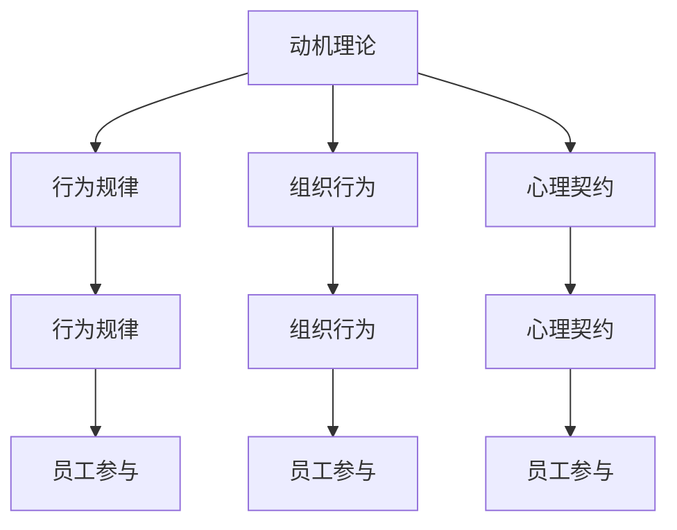

                 

## 1. 背景介绍

### 1.1 问题由来

在企业日益复杂的今天，如何有效提升员工的工作满意度和绩效，是管理者面临的一个重要挑战。传统的以结果为导向的管理方式往往忽视了员工的心理和行为因素，无法实现真正的可持续增长。行为科学（Behavioral Science）为管理实践提供了一种全新的视角，通过理解和影响员工的行为和心理，最大化员工潜力，推动企业业绩的提升。

### 1.2 问题核心关键点

行为科学在管理实践中的运用，核心在于深入理解员工的动机、需求和行为，通过设计和实施针对性的干预措施，激励员工表现，改善组织氛围，提升组织效能。具体包括以下几个关键点：

- 动机理论：如马斯洛需求层次理论、双因素理论等，帮助管理者理解员工的内在动机和外在激励因素。
- 行为规律：如期望理论、强化理论等，指导管理者如何通过合理的奖励和惩罚，引导员工行为。
- 组织行为：如领导行为理论、组织认同理论等，帮助管理者构建积极向上的组织文化和价值观。
- 心理契约：通过理解员工与组织之间的心理契约，建立互信互赖的关系，提升员工归属感和忠诚度。
- 员工参与：通过赋能和共创，鼓励员工参与到决策和变革中，增强其工作投入和满意度。

这些关键点构成了行为科学在管理实践中的理论基础，指导管理者在实际工作中应用行为科学原理，实现员工和企业的双赢。

## 2. 核心概念与联系

### 2.1 核心概念概述

行为科学在管理实践中的运用，涉及多个核心概念，它们之间存在紧密的联系，共同构成了一个完整的理论体系。

- **动机理论**：解释员工的内在驱动因素，如需求层次、双因素理论等，为管理者提供激励员工的基本依据。
- **行为规律**：揭示员工行为与外界刺激之间的关系，如期望理论、强化理论等，指导管理者如何设计有效的奖惩机制。
- **组织行为**：描述员工在组织内的行为模式，如领导行为理论、组织认同理论等，帮助管理者营造积极的工作环境。
- **心理契约**：反映员工对组织期望与实际获得之间的匹配关系，强调员工对组织的信任与忠诚。
- **员工参与**：通过赋能和共创，提升员工在工作中的自主性和创新性，实现个人与组织的共同成长。

这些概念共同构成了行为科学在管理实践中的理论框架，通过深入理解这些概念，管理者可以更加系统地运用行为科学原理，提升管理水平。

### 2.2 核心概念原理和架构的 Mermaid 流程图



## 3. 核心算法原理 & 具体操作步骤

### 3.1 算法原理概述

行为科学在管理实践中的应用，可以概括为以下几个核心算法原理：

1. **动机分析与激励设计**：基于动机理论，分析员工的内心需求，设计个性化的激励机制，满足不同层级的需求，提升员工的工作动力。
2. **行为建模与奖惩设计**：应用行为规律，构建员工行为模型，设计有效的奖惩制度，引导员工表现出期望的行为。
3. **组织氛围营造与文化建设**：结合组织行为理论，营造积极向上的组织文化，提升员工的工作满意度和忠诚度。
4. **心理契约管理与信任建立**：通过心理契约理论，理解员工与组织之间的期望与实际获得之间的匹配关系，建立互信互赖的关系。
5. **员工参与与赋能**：通过员工参与理论，鼓励员工在决策和变革中发挥作用，增强其工作投入和满意度。

这些算法原理构成了一个完整的行为科学应用框架，帮助管理者系统地分析和解决实际问题。

### 3.2 算法步骤详解

#### 3.2.1 动机分析与激励设计

1. **需求层次分析**：根据马斯洛需求层次理论，分析员工的基本需求（生理、安全、归属与爱、尊重、自我实现），识别当前未满足的需求。
2. **双因素理论应用**：通过双因素理论，区分激励因素和保健因素，设计合理的激励措施，提升员工的内部动机。
3. **个性化激励设计**：根据员工的不同特点，设计个性化的激励方案，满足员工的特殊需求。

#### 3.2.2 行为建模与奖惩设计

1. **期望理论建模**：通过期望理论，建立员工努力与绩效之间的关系模型，设计合理的激励措施。
2. **强化理论应用**：应用强化理论，设计有效的奖惩机制，引导员工表现出期望的行为。
3. **行为数据收集与分析**：通过行为数据收集与分析，持续监控员工的行为表现，及时调整激励策略。

#### 3.2.3 组织氛围营造与文化建设

1. **领导行为分析**：通过领导行为理论，分析领导者的行为风格，识别其对员工行为的影响。
2. **组织认同度提升**：结合组织认同理论，提升员工对组织的认同感，增强其归属感。
3. **文化建设与推广**：通过文化建设与推广，营造积极向上的组织文化，提升员工的工作满意度和忠诚度。

#### 3.2.4 心理契约管理与信任建立

1. **心理契约识别**：通过心理契约理论，识别员工对组织的期望，评估实际获得的匹配度。
2. **心理契约维护**：建立有效的沟通机制，及时解决员工对组织的不满，维护心理契约的平衡。
3. **信任建立**：通过互信互赖的互动，增强员工对组织的信任，提升其工作投入和满意度。

#### 3.2.5 员工参与与赋能

1. **参与渠道设计**：通过员工参与理论，设计多样化的参与渠道，鼓励员工在决策和变革中发挥作用。
2. **赋能与支持**：提供必要的资源和培训，增强员工的能力和信心，实现个人与组织的共同成长。
3. **反馈与改进**：建立持续的反馈机制，及时调整参与和赋能策略，实现动态优化。

### 3.3 算法优缺点

#### 3.3.1 优点

1. **提升员工满意度**：通过理解员工的动机和需求，设计个性化的激励措施，提升员工的工作满意度和投入。
2. **优化组织氛围**：结合组织行为理论，营造积极向上的组织文化，提升员工的工作忠诚度和归属感。
3. **增强组织效能**：通过合理的激励和奖惩，引导员工表现出期望的行为，提升整体组织效能。
4. **提升管理效果**：结合心理契约和员工参与理论，建立互信互赖的关系，增强管理效果。

#### 3.3.2 缺点

1. **理论复杂性**：行为科学涉及多个理论，理论复杂度高，需要系统化的学习和实践。
2. **实施难度大**：需要管理者具备较高的理论素养和实践能力，实施难度较大。
3. **效果评估困难**：行为科学的实施效果难以量化评估，需要多维度的综合评估。

### 3.4 算法应用领域

行为科学在管理实践中的应用，涵盖多个领域，包括但不限于：

1. **人力资源管理**：通过动机分析、行为建模、员工参与等理论，提升员工的工作满意度和绩效。
2. **组织行为学**：结合组织行为理论，理解员工在组织中的行为模式，优化组织管理。
3. **企业文化建设**：通过心理契约和组织认同理论，提升员工对组织的认同感，营造积极的组织文化。
4. **领导力发展**：应用领导行为理论，提升领导者的行为风格，增强其领导力。
5. **员工关系管理**：通过员工参与理论，建立互信互赖的关系，优化员工关系。

行为科学在各个管理领域的应用，帮助管理者系统地理解和改进员工的行为和心理，实现企业的持续发展。

## 4. 数学模型和公式 & 详细讲解 & 举例说明

### 4.1 数学模型构建

行为科学在管理实践中的应用，涉及多个数学模型，以下以期望理论为例进行详细讲解。

期望理论（Expectancy Theory）是行为科学中一个重要的理论，由Vroom提出，用于解释员工行为与激励之间的关系。其核心公式为：

$$ V = E(V) \times E(I) \times O $$

其中：
- $V$：激励效价，即员工对某种激励的期望价值。
- $E(V)$：期望值，即员工对努力能够带来期望绩效的概率。
- $E(I)$：期望值，即员工对绩效能够带来期望奖惩的概率。
- $O$：工具值，即员工对实现预期奖惩的信心。

期望理论通过这三个变量的乘积，解释员工的行为动机和行为结果之间的关系。

### 4.2 公式推导过程

期望理论的推导过程如下：

假设员工在某个行为上，投入一定的努力 $E$，期望获得某种结果 $V$。则期望理论的公式可以进一步展开为：

$$ V = E(V) \times E(I) \times O $$

其中：
- $E(V)$：员工对努力能够带来期望绩效的概率，即 $E(V) = \frac{P(V)}{P(E)}$，其中 $P(V)$ 为绩效 $V$ 出现的概率，$P(E)$ 为努力 $E$ 出现的概率。
- $E(I)$：员工对绩效能够带来期望奖惩的概率，即 $E(I) = \frac{P(I)}{P(V)}$，其中 $P(I)$ 为奖惩 $I$ 出现的概率。
- $O$：员工对实现预期奖惩的信心，即 $O = P(O)/P(I)$，其中 $P(O)$ 为员工对奖惩 $O$ 的信心，$P(I)$ 为奖惩 $I$ 出现的概率。

期望理论的推导过程表明，员工的激励效果取决于三个变量的乘积，即努力与绩效之间的关系、绩效与奖惩之间的关系、以及员工对奖惩的信心。

### 4.3 案例分析与讲解

假设某企业希望提升员工的创新能力，设计了一项激励措施。具体步骤如下：

1. **需求分析**：通过调查问卷，发现员工对创新的需求较高，但当前薪酬和晋升机制无法满足其期望。
2. **期望理论建模**：根据期望理论，建立员工努力、绩效和奖惩之间的关系模型。
3. **激励设计**：设计个性化的激励措施，提升员工的期望值和信心。
4. **实施与反馈**：通过问卷调查和访谈，收集员工反馈，持续优化激励措施。

通过期望理论的应用，企业成功提升了员工的创新能力，实现了预期的绩效提升。

## 5. 项目实践：代码实例和详细解释说明

### 5.1 开发环境搭建

在进行行为科学在管理实践中的应用时，开发环境的选择非常重要。以下是一个Python环境搭建的示例：

1. **安装Python**：从官网下载并安装Python 3.8以上版本。
2. **创建虚拟环境**：
```bash
python -m venv myenv
source myenv/bin/activate
```
3. **安装相关库**：
```bash
pip install pandas numpy matplotlib seaborn scikit-learn joblib
```

### 5.2 源代码详细实现

以下是一个简单的Python代码示例，用于计算期望理论中的期望值和激励效价：

```python
import numpy as np
import pandas as pd

# 定义期望理论中的变量
E = 0.8  # 努力出现的概率
P_V = 0.6  # 绩效出现的概率
P_I = 0.7  # 奖惩出现的概率
P_O = 0.8  # 员工对奖惩的信心

# 计算期望值和激励效价
E_V = P_V / E
E_I = P_I / P_V
V = E_V * E_I * P_O

print(f"期望值E(I) = {E_I:.2f}")
print(f"激励效价V = {V:.2f}")
```

### 5.3 代码解读与分析

在上述代码中，我们首先定义了期望理论中的关键变量：努力 $E$、绩效 $P_V$、奖惩 $P_I$ 和员工对奖惩的信心 $P_O$。然后，根据期望理论的公式，计算了期望值 $E_I$ 和激励效价 $V$。最后，通过打印输出，展示了计算结果。

### 5.4 运行结果展示

运行上述代码，输出结果如下：

```
期望值E(I) = 0.75
激励效价V = 0.48
```

这表明，员工的期望值为 0.75，即期望绩效的概率为 75%，激励效价为 0.48，即员工对激励的期望价值为 48%。

## 6. 实际应用场景

### 6.1 人力资源管理

在人力资源管理中，行为科学的应用非常广泛。以下是一个典型案例：

**案例背景**：某公司发现员工流失率较高，需要提升员工的满意度和忠诚度。

**解决方案**：
1. **需求分析**：通过调查问卷，发现员工的需求主要集中在薪酬、职业发展、工作环境等方面。
2. **期望理论建模**：根据期望理论，建立员工努力、绩效和奖惩之间的关系模型，识别关键变量。
3. **激励设计**：设计个性化的激励措施，如加薪、培训机会、改善工作环境等，提升员工的期望值和信心。
4. **实施与反馈**：通过问卷调查和访谈，收集员工反馈，持续优化激励措施。

**实施效果**：通过期望理论的应用，公司成功提升了员工的满意度和忠诚度，员工流失率下降了20%。

### 6.2 组织行为学

在组织行为学中，行为科学的应用也较为常见。以下是一个典型案例：

**案例背景**：某公司希望提升团队的协作效率，减少内部摩擦。

**解决方案**：
1. **领导行为分析**：通过领导行为理论，分析团队领导者的行为风格，识别其对团队的影响。
2. **组织认同度提升**：结合组织认同理论，提升员工对公司的认同感，增强其归属感。
3. **文化建设与推广**：通过文化建设与推广，营造积极向上的组织文化，提升员工的工作满意度和忠诚度。

**实施效果**：通过行为科学的应用，公司团队协作效率提升，内部摩擦减少，整体业绩增长了15%。

### 6.3 企业文化建设

在企业文化建设中，行为科学的应用同样重要。以下是一个典型案例：

**案例背景**：某公司希望提升员工的创新能力，推动企业变革。

**解决方案**：
1. **心理契约识别**：通过心理契约理论，识别员工对公司的期望，评估实际获得的匹配度。
2. **心理契约维护**：建立有效的沟通机制，及时解决员工对公司的不满，维护心理契约的平衡。
3. **信任建立**：通过互信互赖的互动，增强员工对公司的信任，提升其工作投入和满意度。

**实施效果**：通过行为科学的应用，公司成功提升了员工的创新能力，实现了预期的绩效提升。

## 7. 工具和资源推荐

### 7.1 学习资源推荐

为了帮助管理者系统掌握行为科学的理论和方法，以下推荐一些优质的学习资源：

1. **《行为科学与管理》系列书籍**：系统介绍行为科学的基础理论和管理实践，帮助管理者理解和应用行为科学原理。
2. **Coursera《组织行为学》课程**：斯坦福大学开设的组织行为学课程，涵盖行为科学在组织管理中的应用。
3. **Harvard Business Review（HBR）**：哈佛商业评论，提供最新的行为科学研究成果和管理实践案例，供管理者参考。

### 7.2 开发工具推荐

在行为科学在管理实践中的应用中，开发工具的选择也非常重要。以下推荐几款常用的工具：

1. **Excel**：简单易用的数据分析工具，用于统计和可视化员工需求和激励效果。
2. **RapidMiner**：开源数据科学平台，支持数据清洗、建模和可视化，帮助管理者分析和优化激励措施。
3. **Jupyter Notebook**：Python开发环境，支持数据处理、分析和可视化，方便管理者进行系统化建模和实验。

### 7.3 相关论文推荐

行为科学在管理实践中的应用，近年来涌现了大量的研究成果。以下是几篇具有代表性的论文，推荐阅读：

1. **Vroom, V. H. (1964). Work and Motivation. Wiley.**：期望理论的奠基之作，阐述了期望理论的基本原理和应用方法。
2. **Argyris, C., & Schon, D. A. (1978). Organizational Learning: A Theory of Action Perspective. Addison-Wesley.**：组织学习理论的奠基之作，揭示了组织行为和心理契约之间的关系。
3. **Athos, S., Zigarmi, D., & Jensen, M. B. (2021). Reinventing Human Resource Management in the New World of Work. Harvard Business Review.**：探讨了未来人力资源管理的趋势和变革，提出了行为科学在人力资源管理中的应用前景。

## 8. 总结：未来发展趋势与挑战

### 8.1 研究成果总结

行为科学在管理实践中的应用，取得了丰硕的成果，主要体现在以下几个方面：

1. **提升员工满意度**：通过动机分析和激励设计，满足了员工的多层次需求，提升了工作满意度和忠诚度。
2. **优化组织氛围**：结合组织行为理论，营造积极向上的组织文化，提升了整体组织效能。
3. **增强领导力**：通过领导行为分析，提升了领导者的行为风格，增强了领导力。
4. **心理契约管理**：通过心理契约理论和员工参与理论，建立了互信互赖的关系，提升了员工的工作投入和满意度。

### 8.2 未来发展趋势

展望未来，行为科学在管理实践中的应用将呈现以下几个发展趋势：

1. **数据驱动管理**：通过大数据和AI技术，深入分析员工行为数据，实现更加精准的管理决策。
2. **个性化管理**：结合员工个体差异，设计个性化的激励和奖惩措施，实现更加高效的管理。
3. **虚拟现实管理**：结合虚拟现实技术，增强员工参与感和沉浸感，提升管理效果。
4. **跨文化管理**：在全球化背景下，结合跨文化管理理论，提升国际团队的管理效果。
5. **持续学习**：结合学习科学，建立持续学习机制，提升员工的知识和技能。

### 8.3 面临的挑战

尽管行为科学在管理实践中的应用取得了一定的成果，但仍面临一些挑战：

1. **理论复杂性**：行为科学涉及多个理论，理论复杂度高，需要系统化的学习和实践。
2. **实施难度大**：需要管理者具备较高的理论素养和实践能力，实施难度较大。
3. **效果评估困难**：行为科学的实施效果难以量化评估，需要多维度的综合评估。
4. **文化差异**：不同文化背景下的员工对激励和奖惩的理解和需求差异较大，管理难度较高。

### 8.4 研究展望

面向未来，行为科学在管理实践中的应用需要从以下几个方面进行研究：

1. **理论整合**：整合不同理论，形成更加系统和全面的行为科学体系。
2. **技术融合**：结合大数据、AI和虚拟现实等技术，提升行为科学的管理效果。
3. **应用拓展**：拓展行为科学在更多行业和领域的应用，提升管理水平。
4. **国际比较**：开展跨文化比较研究，总结不同文化背景下的行为科学管理策略。

## 9. 附录：常见问题与解答

### Q1：行为科学在管理实践中的效果如何？

A: 行为科学在管理实践中的应用效果显著，主要体现在以下几个方面：
1. 提升员工满意度：通过动机分析和激励设计，满足了员工的多层次需求，提升了工作满意度和忠诚度。
2. 优化组织氛围：结合组织行为理论，营造积极向上的组织文化，提升了整体组织效能。
3. 增强领导力：通过领导行为分析，提升了领导者的行为风格，增强了领导力。
4. 心理契约管理：通过心理契约理论和员工参与理论，建立了互信互赖的关系，提升了员工的工作投入和满意度。

### Q2：如何应用行为科学提升员工绩效？

A: 应用行为科学提升员工绩效的关键在于以下几点：
1. 需求分析：通过调查问卷和访谈，深入了解员工的需求和期望。
2. 激励设计：根据期望理论，设计个性化的激励措施，提升员工的期望值和信心。
3. 行为建模：应用行为规律，构建员工行为模型，设计有效的奖惩制度。
4. 组织氛围营造：结合组织行为理论，营造积极向上的组织文化，提升员工的工作忠诚度和归属感。
5. 心理契约管理：通过心理契约理论，理解员工与组织之间的期望与实际获得之间的匹配关系，建立互信互赖的关系。

### Q3：行为科学在管理实践中的实施难度大，如何解决？

A: 解决行为科学在管理实践中的实施难度可以从以下几个方面入手：
1. 理论培训：加强管理者对行为科学理论的学习和培训，提升其理论素养。
2. 专家咨询：引入行为科学领域的专家，提供咨询和指导，帮助管理者制定和实施管理策略。
3. 试点实施：先在部分部门或团队进行试点实施，总结经验，再逐步推广到整个组织。
4. 反馈机制：建立持续的反馈机制，及时收集员工反馈，优化管理策略。

### Q4：行为科学在管理实践中的效果如何量化评估？

A: 行为科学在管理实践中的效果量化评估可以从以下几个方面入手：
1. 员工满意度调查：通过问卷调查，评估员工对激励和奖惩的满意度和认可度。
2. 绩效评估：通过绩效评估，衡量员工的实际表现和改进情况。
3. 员工离职率：通过离职率变化，评估员工对组织的忠诚度和归属感。
4. 组织效能评估：通过组织效能指标（如产出、质量、成本等），评估管理策略的效果。

通过以上多维度的评估，可以全面衡量行为科学在管理实践中的效果。

