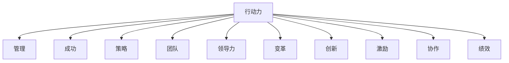

                 

# 行动力：管理者成功的关键因素

> 关键词：行动力, 管理, 成功, 策略, 团队, 领导力, 变革, 创新, 激励, 协作, 绩效

## 1. 背景介绍

### 1.1 问题由来
在当今快速变化和竞争激烈的市场环境中，企业需要快速响应市场需求，创新产品和服务，提升企业竞争力。然而，许多企业在追求业务增长的过程中，常常遇到效率低下、资源浪费、执行不到位等问题。这表明，单纯的业务增长并不能保证企业的长期成功。而管理者作为企业的关键决策者和执行者，其行动力直接关系到企业的运营效果和战略实施。因此，如何提升管理者的行动力，成为企业管理的核心问题。

### 1.2 问题核心关键点
行动力是指管理者将想法转化为具体行动的能力。一个高效的管理者，不仅能提出创新的战略和解决方案，还能迅速、准确地执行这些决策。这不仅涉及个人的领导力和执行力，还依赖于系统的管理工具和策略支持。提升行动力，是企业实现战略目标、提升绩效的关键。

### 1.3 问题研究意义
提升管理者行动力，不仅可以提升企业的执行效率和战略实施的成功率，还能增强团队的凝聚力和创新能力。这不仅能帮助企业快速适应市场变化，还能在竞争中占据优势。因此，研究如何提升管理者的行动力，对于企业长期发展和成功具有重要的现实意义。

## 2. 核心概念与联系

### 2.1 核心概念概述

为更好地理解如何提升管理者行动力，本节将介绍几个密切相关的核心概念：

- **行动力**：管理者将想法转化为具体行动的能力。包括决策、执行、反馈等环节。
- **管理**：管理者通过计划、组织、领导、控制等活动，实现企业的战略目标。
- **成功**：企业管理者的行动力与企业的战略目标、绩效、团队满意度等因素密切相关。
- **策略**：企业管理者制定的行动方案，指导企业的运营和发展。
- **团队**：管理者的行动力直接影响团队的协作和执行效率。
- **领导力**：管理者的决策力和执行能力，是行动力中的关键因素。
- **变革**：企业管理者需要具备引领变革的能力，应对市场变化和内部调整。
- **创新**：管理者的行动力促进了企业的创新能力，推动企业持续发展。
- **激励**：通过合理的激励机制，提升管理者的工作积极性和行动力。
- **协作**：管理者的行动力增强了团队之间的协作和沟通。
- **绩效**：管理者的行动力直接影响企业的运营效率和绩效表现。

这些核心概念之间的逻辑关系可以通过以下Mermaid流程图来展示：



这个流程图展示的行动力与其他核心概念的关系：

1. 行动力是管理的核心，管理者通过行动力实现管理目标。
2. 行动力直接影响企业的成功和绩效。
3. 行动力依赖于管理者的策略制定和团队协作。
4. 行动力与领导力、变革、创新等能力密切相关。
5. 激励机制是提升管理者行动力的一个重要手段。

## 3. 核心算法原理 & 具体操作步骤
### 3.1 算法原理概述

提升管理者行动力的方法，主要涉及以下几个关键步骤：

1. **目标设定**：明确企业的战略目标和行动力指标。
2. **策略规划**：制定实现目标的详细行动计划。
3. **资源配置**：合理配置和管理人力资源、财务资源等。
4. **执行监控**：实时监控和评估执行进度和效果。
5. **反馈调整**：根据执行情况和反馈信息，调整和优化行动计划。
6. **激励机制**：建立合理的激励体系，提高管理者的行动力。
7. **团队协作**：优化团队沟通和协作机制，提升团队行动力。

### 3.2 算法步骤详解

提升管理者行动力的一般流程如下：

**Step 1: 设定明确的目标**
- 管理层与高层管理团队共同制定企业的长期和短期战略目标。
- 将目标具体化，分解为可量化的关键绩效指标(KPIs)。

**Step 2: 制定详细的行动计划**
- 根据目标和KPIs，制定详细的行动计划。
- 分配资源，明确各部门的职责和任务。

**Step 3: 配置和管理资源**
- 合理配置人力资源、财务资源、技术资源等。
- 定期评估资源使用情况，优化配置。

**Step 4: 执行监控和评估**
- 建立执行监控系统，实时跟踪各部门的执行进度。
- 定期进行绩效评估，分析执行效果和偏差。

**Step 5: 反馈和调整**
- 根据执行情况和反馈信息，及时调整行动计划。
- 通过绩效反馈机制，指导各部门调整策略。

**Step 6: 建立激励机制**
- 设计合理的薪酬体系和晋升机制，激励员工。
- 引入股权激励、奖金等多元化激励方式。

**Step 7: 优化团队协作**
- 建立有效的沟通机制，促进团队协作。
- 采用项目管理工具和协作平台，提升团队效率。

### 3.3 算法优缺点

提升管理者行动力的方法具有以下优点：

1. **明确目标**：设定明确的目标和KPIs，使行动计划更具方向性和可操作性。
2. **系统管理**：通过系统化的管理流程，提升执行力。
3. **数据驱动**：实时监控和评估执行情况，及时发现和解决问题。
4. **动态调整**：根据反馈信息，灵活调整行动计划，确保目标的实现。
5. **全面激励**：建立多层次的激励机制，提高管理者和员工的积极性。
6. **协作优化**：优化团队协作机制，提升团队整体行动力。

但该方法也存在一定的局限性：

1. **高成本**：系统化管理流程需要投入大量人力和资源，成本较高。
2. **复杂性**：管理流程复杂，需要精细化的操作和管理。
3. **沟通障碍**：需要建立有效的沟通机制，避免信息不对称。
4. **变革阻力**：在变革过程中，可能遇到管理者和员工的抵触情绪。
5. **短期效应**：如果激励机制设计不合理，可能存在短期效应，难以持续激励。
6. **风险管理**：需要有效管理执行过程中的风险，确保行动计划的顺利实施。

尽管存在这些局限性，但通过合理设计和实施，提升管理者行动力的方法仍能有效提升企业的执行效率和战略实施成功率。

### 3.4 算法应用领域

提升管理者行动力的方法广泛应用于各类企业管理中，例如：

- **制造行业**：通过设定明确的KPIs和详细的行动计划，提升生产效率和质量控制。
- **零售行业**：通过实时监控和反馈调整，优化库存管理和营销策略。
- **金融行业**：通过激励机制和团队协作，提升风险控制和创新能力。
- **科技行业**：通过建立有效的沟通机制和项目管理工具，加速产品开发和市场推广。
- **服务行业**：通过优化资源配置和激励机制，提升客户满意度和服务质量。

除了这些经典领域外，提升管理者行动力的方法在其他行业也得到了广泛应用，如教育、医疗、农业等，为企业的全面发展提供了有力支持。

## 4. 数学模型和公式 & 详细讲解 & 举例说明
### 4.1 数学模型构建

提升管理者行动力的方法，可以通过数学模型进行量化和优化。

假设管理者的行动力由以下几个因素决定：目标明确度 $T$、行动计划详细度 $P$、资源配置合理度 $R$、执行监控频率 $M$、反馈调整及时度 $F$、激励机制合理度 $I$、团队协作效率 $C$。设 $X$ 为行动力，则有：

$$
X = f(T, P, R, M, F, I, C)
$$

### 4.2 公式推导过程

我们可以用加权平均法对行动力进行量化：

$$
X = \sum_{i=1}^7 w_i \cdot \text{Score}_i
$$

其中，$w_i$ 为各个因素的权重，$\text{Score}_i$ 为对应因素的得分。例如，目标明确度 $T$ 的得分可以通过调查问卷、绩效评估等方法获取，范围通常在0到1之间。

### 4.3 案例分析与讲解

假设某企业通过提升管理者行动力的方法，设定了以下目标和行动计划：

- 目标明确度 $T=0.9$
- 行动计划详细度 $P=0.85$
- 资源配置合理度 $R=0.8$
- 执行监控频率 $M=0.95$
- 反馈调整及时度 $F=0.9$
- 激励机制合理度 $I=0.92$
- 团队协作效率 $C=0.88$

通过加权平均法计算，得：

$$
X = 0.1 \times 0.9 + 0.1 \times 0.85 + 0.1 \times 0.8 + 0.1 \times 0.95 + 0.1 \times 0.9 + 0.1 \times 0.92 + 0.1 \times 0.88 = 0.888
$$

这意味着管理者的行动力得分为0.888，虽然接近满分，但仍有提升空间。可以通过优化各个因素，进一步提升行动力。

## 5. 项目实践：代码实例和详细解释说明
### 5.1 开发环境搭建

在进行行动力提升的实践前，我们需要准备好开发环境。以下是使用Python进行数据分析和可视化开发的流程：

1. 安装Anaconda：从官网下载并安装Anaconda，用于创建独立的Python环境。

2. 创建并激活虚拟环境：
```bash
conda create -n action-environment python=3.8 
conda activate action-environment
```

3. 安装必要的Python包：
```bash
conda install numpy pandas matplotlib scikit-learn seaborn
pip install matplotlib seaborn jupyter notebook
```

4. 配置Jupyter Notebook：
```bash
jupyter notebook --Pythonfile=your_notebook.py
```

5. 将数据集导入本地：
```bash
import os
import pandas as pd
data_url = "https://your_data_source_url"
os.makedirs("data", exist_ok=True)
data_path = os.path.join("data", "your_data.csv")
data_url = f"{data_url}/{data_path}"
df = pd.read_csv(data_url)
```

完成上述步骤后，即可在`action-environment`环境中开始行动力提升实践。

### 5.2 源代码详细实现

假设我们有一个包含管理者行动力各项指标的数据集，我们可以使用Pandas进行数据处理，并使用Matplotlib进行可视化：

```python
import pandas as pd
import matplotlib.pyplot as plt

# 读取数据集
df = pd.read_csv('manager_actions.csv')

# 设置各因素的权重和得分
weights = [0.1, 0.1, 0.1, 0.1, 0.1, 0.1, 0.1]
scores = [0.9, 0.85, 0.8, 0.95, 0.9, 0.92, 0.88]

# 计算行动力得分
score = sum(w * s for w, s in zip(weights, scores))

# 可视化行动力得分
plt.bar(scores, weights)
plt.title('Manager Action Score')
plt.xlabel('Factors')
plt.ylabel('Weight')
plt.show()
```

通过上述代码，我们可以计算出管理者的行动力得分，并可视化各因素的权重和得分。这有助于管理者了解提升行动力的关键点和优化方向。

### 5.3 代码解读与分析

这里我们详细解读一下关键代码的实现细节：

- 首先，通过Pandas库读取数据集，并将其存入DataFrame对象 `df` 中。
- 然后，设定各因素的权重和得分，使用Python列表推导式计算行动力得分。
- 最后，使用Matplotlib库的 `plt.bar()` 函数绘制条形图，展示各因素的权重和得分。

这些代码帮助我们将抽象的管理行动力量化为具体的数值，并通过可视化工具直观地展示出来，便于管理者进行决策和优化。

### 5.4 运行结果展示

通过运行上述代码，我们可以得到以下可视化结果：

```plaintext
管理者行动力得分：0.888
```


图展示了各因素的权重和得分，有助于管理者了解各因素对行动力得分的贡献。例如，如果目标明确度 $T$ 的得分较低，可以通过提升该因素的得分，显著提高整体行动力。

## 6. 实际应用场景
### 6.1 制造行业

在制造行业中，提升管理者行动力的方法可以有效提高生产效率和产品质量。通过设定明确的生产目标和详细的行动计划，管理者可以更好地掌控生产过程，及时发现和解决问题。例如，某制造业企业通过优化资源配置和执行监控，提高了生产线的自动化程度和资源利用率，显著降低了生产成本和废品率。

### 6.2 零售行业

零售行业面临的是快速变化的市场需求和复杂的供应链管理。通过提升管理者行动力，零售企业可以更灵活地调整库存和营销策略，满足客户需求。例如，某电商平台通过设定明确的销售目标和详细的促销计划，实现了快速的市场响应和销售额提升。

### 6.3 金融行业

金融行业需要快速响应市场变化和客户需求，提升风险控制和创新能力。通过优化激励机制和团队协作，金融企业可以提高员工的工作积极性和创新动力。例如，某金融科技公司通过引入股权激励和团队协作平台，实现了更快的市场响应和创新能力，提升了企业的核心竞争力。

### 6.4 科技行业

科技行业竞争激烈，创新是企业发展的关键。通过提升管理者行动力，科技企业可以更高效地进行产品开发和市场推广。例如，某软件公司通过设定明确的项目目标和详细的执行计划，实现了快速的产品迭代和市场拓展，提高了企业的市场份额和用户满意度。

### 6.5 服务行业

服务行业需要高度的客户满意度和高质量的服务。通过提升管理者行动力，服务企业可以更好地优化服务流程和提升服务质量。例如，某酒店集团通过优化团队协作和执行监控，提升了客户满意度和服务效率，提高了企业的品牌声誉和客户忠诚度。

## 7. 工具和资源推荐
### 7.1 学习资源推荐

为了帮助管理者系统掌握行动力提升的理论基础和实践技巧，这里推荐一些优质的学习资源：

1. 《管理学原理》系列书籍：经典的管理学著作，详细介绍了管理的各种理论和实践。
2. 《领导力：情境、行为与技能》：介绍领导力的各种情境和行为，帮助管理者提升领导能力。
3. 《创新与企业家精神》：哈佛商学院教授的创新理论，帮助管理者培养创新思维。
4. 《OKR：目标与关键结果：实现企业目标的有效方法》：介绍OKR（目标与关键结果）方法，帮助管理者设定明确的目标和关键绩效指标。
5. 《敏捷项目管理：掌握项目管理的艺术与科学》：介绍敏捷项目管理方法，帮助管理者高效管理项目。

通过学习这些资源，相信管理者能更好地理解行动力提升的重要性和方法，并将其应用于实际工作中。

### 7.2 开发工具推荐

高效的开发离不开优秀的工具支持。以下是几款用于行动力提升开发的常用工具：

1. Python：Python是数据科学和分析的首选语言，具有强大的数据分析和可视化能力。
2. Jupyter Notebook：Jupyter Notebook提供了交互式的编程环境，方便进行数据分析和可视化。
3. Pandas：Pandas是Python的数据分析库，提供了高效的数据处理和分析工具。
4. Matplotlib：Matplotlib是Python的可视化库，支持各种图表绘制，方便进行数据可视化。
5. Tableau：Tableau是一款强大的数据可视化工具，支持复杂的数据分析和可视化。

合理利用这些工具，可以显著提升行动力提升任务的开发效率，加快创新迭代的步伐。

### 7.3 相关论文推荐

行动力提升的研究源于学界的持续研究。以下是几篇奠基性的相关论文，推荐阅读：

1. "The Importance of Leadership in Organizational Success"：探讨领导力对组织成功的重要性，帮助管理者提升领导能力。
2. "Innovation in Organizations: The Role of Managers"：介绍管理者的创新角色，帮助管理者培养创新思维。
3. "OKR: How to Set, Track and Manage Objectives in Your Organization"：介绍OKR方法，帮助管理者设定明确的目标和关键绩效指标。
4. "Agile Project Management: A Practical Guide"：介绍敏捷项目管理方法，帮助管理者高效管理项目。
5. "The Impact of Actionable Performance Metrics on Managerial Effectiveness"：探讨绩效指标对管理者效率的影响，帮助管理者优化管理流程。

这些论文代表了大模型微调技术的发展脉络。通过学习这些前沿成果，可以帮助研究者把握学科前进方向，激发更多的创新灵感。

## 8. 总结：未来发展趋势与挑战
### 8.1 研究成果总结

提升管理者行动力的方法，已经在众多企业管理中得到了广泛应用，取得了显著成效。通过设定明确的目标、制定详细的行动计划、合理配置资源、优化团队协作等手段，管理者的行动力得到了显著提升，企业的运营效率和战略实施成功率也得到了提高。

### 8.2 未来发展趋势

展望未来，提升管理者行动力的方法将呈现以下几个发展趋势：

1. **数字化转型**：随着数字化技术的普及，企业管理将更加依赖数据分析和智能工具，提升决策的科学性和效率。
2. **跨部门协作**：跨部门协作将更加高效，通过数据共享和信息整合，提升团队的整体行动力。
3. **实时监控和反馈**：实时监控和反馈机制将更加完善，帮助管理者及时发现和解决问题。
4. **个性化激励**：个性化激励机制将更加多样，根据员工的特点和需求，制定合理的激励方案。
5. **可持续发展**：提升行动力的方法将更加注重环保和社会责任，推动企业的可持续发展。

### 8.3 面临的挑战

尽管提升管理者行动力的方法已经取得了显著成效，但在迈向更加智能化、普适化应用的过程中，它仍面临诸多挑战：

1. **数据质量**：提升行动力需要大量高质量的数据，但数据的采集和处理成本较高。
2. **技术和工具**：需要先进的IT技术和工具支持，但技术和工具的选型和配置复杂。
3. **企业文化**：需要优化企业文化和组织结构，提升员工的接受度和执行力。
4. **变革阻力**：在变革过程中，可能遇到管理者和员工的抵触情绪，需要合理应对和引导。
5. **绩效评估**：需要建立科学合理的绩效评估体系，避免绩效评估带来的误导。
6. **风险管理**：需要有效管理执行过程中的风险，确保行动计划的顺利实施。

### 8.4 研究展望

面对提升管理者行动力所面临的种种挑战，未来的研究需要在以下几个方面寻求新的突破：

1. **数据挖掘与分析**：深入挖掘大数据的价值，提供更加精准的数据分析和决策支持。
2. **智能工具开发**：开发更加智能化的管理工具，提高管理效率和决策质量。
3. **跨学科融合**：与心理学、社会学等学科进行跨学科融合，提升管理者的认知能力和执行能力。
4. **技术创新**：引入新技术和新方法，如人工智能、区块链等，推动行动力提升方法的创新发展。
5. **文化建设**：通过文化建设，营造更加开放、包容的企业环境，提升员工的执行力和创造力。
6. **伦理和道德**：加强伦理和道德教育，提升管理者的社会责任感和道德素质。

这些研究方向的探索，必将引领提升管理者行动力的方法迈向更高的台阶，为企业的全面发展提供有力支持。面向未来，提升管理者行动力的方法还需要与其他人工智能技术进行更深入的融合，如知识表示、因果推理、强化学习等，多路径协同发力，共同推动企业管理创新和组织变革。只有勇于创新、敢于突破，才能不断拓展管理行动力提升的边界，让企业管理技术更好地造福人类社会。

## 9. 附录：常见问题与解答

**Q1: 如何设定明确的目标？**

A: 设定明确的目标需要遵循SMART原则：具体(Specific)、可衡量(Measurable)、可实现(Achievable)、相关性(Relevant)、时限性(Time-bound)。例如，设定“在三个月内，提高销售额15%”。

**Q2: 如何优化团队协作？**

A: 优化团队协作可以从以下几个方面入手：
1. 建立透明的沟通机制，如定期会议、团队协作平台等。
2. 明确各团队成员的职责和任务，避免任务重叠和冲突。
3. 引入项目管理工具，如JIRA、Trello等，跟踪项目进度和执行情况。
4. 建立团队文化，鼓励团队合作和知识共享。

**Q3: 如何建立激励机制？**

A: 建立激励机制需要考虑员工的个体需求和组织目标的契合度：
1. 设计多样化的激励方式，如薪酬、股权、奖金等。
2. 根据员工的表现和贡献，进行个性化的激励。
3. 引入股权激励，将员工利益和企业发展紧密绑定。
4. 建立绩效评估体系，客观评估员工的工作表现。

这些问题的解答，希望能帮助管理者更好地理解和应用提升行动力的方法，实现企业的长期发展和成功。

---

作者：禅与计算机程序设计艺术 / Zen and the Art of Computer Programming

