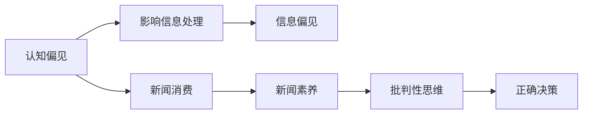

                 

# 认知偏见与新闻素养：培养批判性信息消费

> 关键词：认知偏见,新闻素养,批判性思维,信息消费,媒体素养教育

## 1. 背景介绍

在信息爆炸的时代，认知偏见与新闻素养成为了个体和媒体关注的焦点。认知偏见（Cognitive Biases），即人们在处理信息时的固有思维定势和判断错误，影响着人们如何理解和解释新闻内容。新闻素养（News Literacy），则是指人们批判性地理解和消费新闻的能力，包括识别真实信息、评估新闻来源和信息质量，以及辨识偏见和误导。

本文旨在通过深度剖析认知偏见和新闻素养，为公众提供一套提升信息消费质量的工具和方法，同时为媒体和教育机构提供有效的新闻素养教育策略。我们希望通过深入理解这些核心概念，并探索其联系和应用，最终达到培养公众批判性信息消费的目的。

## 2. 核心概念与联系

### 2.1 核心概念概述

认知偏见指的是人们在感知、判断和决策过程中，由于固有的心理机制或环境因素导致的认知偏差。常见的认知偏见包括确认偏误、选择性注意、可得性启发法、锚定效应等。这些偏见影响了人们如何获取、处理和应用信息，可能导致对新闻的误解或误导。

新闻素养是一个多维度的能力体系，包括理解新闻的基本原则、评估新闻质量和来源、辨识信息偏见和误导等。新闻素养的核心在于培养公众独立思考和批判性判断的能力，使其能够基于事实和逻辑，而不是偏见或情绪，进行信息消费和决策。

### 2.2 核心概念原理和架构的 Mermaid 流程图



此流程图表明，认知偏见在新闻消费过程中起关键作用，可能引入信息偏见，进而影响新闻素养和批判性思维的培养。最终，新闻素养通过增强批判性思维，帮助公众作出正确决策。

## 3. 核心算法原理 & 具体操作步骤

### 3.1 算法原理概述

提升新闻素养的方法通常基于以下步骤：

1. **识别认知偏见**：教育公众理解常见的认知偏见，如确认偏误和选择性注意，以减少其在信息消费中的负面影响。
2. **评估新闻来源**：教授公众如何识别可靠的新闻来源和判断其权威性。
3. **评估新闻质量**：教育公众如何评价新闻的真实性、准确性和完整性。
4. **辨识信息偏见**：帮助公众识别新闻中的潜在偏见，避免被误导。
5. **增强批判性思维**：通过批判性思维的训练，提升公众独立分析新闻内容的能力。

### 3.2 算法步骤详解

#### 步骤1：识别认知偏见

首先，需要识别并教育公众关于常见的认知偏见，如确认偏误、选择性注意等。这可以通过理论讲解和案例分析相结合的方式进行。例如：

- **确认偏误**：个体倾向于寻找与自己观点一致的信息，而忽略或忽视不一致的信息。

  **案例**：一家报纸报道了某个热门事件，并强调了与其观点一致的数据，而忽略了其他角度的报道。

- **选择性注意**：个体倾向于注意与自己预期一致的信息，而忽略或忽视不一致的信息。

  **案例**：社交媒体上充斥着政治广告，个体可能只关注与自己立场一致的内容，而忽视反对的意见。

通过具体的案例分析，公众可以更好地理解这些偏见，并尝试在消费新闻时加以规避。

#### 步骤2：评估新闻来源

其次，需要教授公众如何评估新闻来源的权威性和可靠性。这包括：

- **机构背景**：了解新闻来源的机构性质和背景，如新闻机构的历史、声誉和资金来源。
- **编辑政策**：查阅新闻机构的政策和原则，了解其对新闻标准和道德的承诺。
- **记者资质**：确认记者或编辑的资质和经验，如学历、从业年限和以往报道质量。

这些标准可以通过在线课程、工作坊和信息图表等形式进行教育。

#### 步骤3：评估新闻质量

评估新闻质量的步骤包括：

- **信息核实**：使用事实核查工具和平台，如Snopes、FactCheck.org等，验证新闻内容是否真实。
- **多角度阅读**：从多个可靠来源获取信息，对比不同报道的角度和内容。
- **时间线分析**：检查新闻报道的时间线，确保其反映最新动态，避免过时信息。

教育公众使用这些方法，可以帮助其形成更为全面的信息观。

#### 步骤4：辨识信息偏见

辨识信息偏见的步骤包括：

- **主题性偏见**：了解新闻报道中可能存在的特定主题或领域的偏见，如经济、环境等。
- **媒体偏见**：识别特定媒体或政治人物可能在某些问题上持有的立场。
- **语言偏好**：注意新闻报道中可能出现的情感性语言或立场性词汇，并尝试理解其背后的意图。

通过这些技巧，公众可以更敏锐地辨识出新闻中的偏见，从而避免被误导。

#### 步骤5：增强批判性思维

增强批判性思维的步骤包括：

- **问题框架**：使用问题框架（如SWOT分析、因果图等）来分析新闻内容，评估其逻辑性和完整性。
- **逻辑推理**：练习逻辑推理，如验证因果关系、识别假设等，确保对新闻内容的理性判断。
- **反事实思考**：进行反事实思考，考虑新闻内容的替代假设和可能后果，以增强对新闻的理解和评估。

通过系统的批判性思维训练，公众能够更独立地分析新闻内容，形成自己的判断。

### 3.3 算法优缺点

基于这些步骤的新闻素养提升方法具有以下优点：

- **系统性**：通过识别认知偏见、评估新闻来源、评估新闻质量、辨识信息偏见和增强批判性思维等步骤，形成了一套完整的新闻素养教育体系。
- **实用性**：这些方法易于操作，适合不同背景和知识水平的公众。
- **可扩展性**：这些方法可以应用到多种媒介和多种新闻主题上。

但该方法也存在一些局限：

- **教育复杂性**：对于某些高级认知偏误，如心理暗示和群体思考，教育难度较大。
- **时间成本**：系统性的新闻素养教育需要较长时间和大量资源。
- **效果持久性**：新闻素养教育的效果可能受到社会环境和个体行为的影响，不易持久。

### 3.4 算法应用领域

新闻素养和认知偏见的理解在多个领域具有广泛的应用：

- **教育**：在学校中开设新闻素养课程，帮助学生提升批判性思维和信息处理能力。
- **媒体**：媒体机构可以通过培训提升记者和编辑的新闻素养，以提高其报道的准确性和公正性。
- **公共政策**：政府可以推广新闻素养教育，帮助公众更理性地参与社会公共事务的讨论和决策。
- **健康信息**：在医疗和健康领域，新闻素养可以帮助公众更好地理解健康信息，避免误导性报道的影响。

## 4. 数学模型和公式 & 详细讲解 & 举例说明

### 4.1 数学模型构建

新闻素养的提升可以通过以下数学模型来量化：

- **认知偏误识别模型**：
  $$
  P(\text{偏误}) = f(P(\text{认知偏误1}), P(\text{认知偏误2}), ..., P(\text{认知偏误n}))
  $$
  其中 $P(\text{偏误})$ 表示认知偏误的概率，$P(\text{认知偏误i})$ 表示特定认知偏误的概率。

- **新闻来源评估模型**：
  $$
  P(\text{可靠来源}) = g(P(\text{机构背景}), P(\text{编辑政策}), P(\text{记者资质}))
  $$
  其中 $P(\text{可靠来源})$ 表示新闻来源的可靠性，$P(\text{机构背景})$、$P(\text{编辑政策})$ 和 $P(\text{记者资质})$ 分别表示新闻来源在机构背景、编辑政策、记者资质上的得分。

- **新闻质量评估模型**：
  $$
  P(\text{高质量新闻}) = h(P(\text{信息核实}), P(\text{多角度阅读}), P(\text{时间线分析}))
  $$
  其中 $P(\text{高质量新闻})$ 表示新闻的质量，$P(\text{信息核实})$、$P(\text{多角度阅读})$ 和 $P(\text{时间线分析})$ 分别表示新闻在信息核实、多角度阅读和时间线分析上的得分。

- **信息偏见辨识模型**：
  $$
  P(\text{信息偏见}) = i(P(\text{主题性偏见}), P(\text{媒体偏见}), P(\text{语言偏好}))
  $$
  其中 $P(\text{信息偏见})$ 表示信息偏见的概率，$P(\text{主题性偏见})$、$P(\text{媒体偏见})$ 和 $P(\text{语言偏好})$ 分别表示信息在主题性、媒体和语言上的偏见概率。

- **批判性思维增强模型**：
  $$
  P(\text{批判性思维}) = j(P(\text{问题框架}), P(\text{逻辑推理}), P(\text{反事实思考}))
  $$
  其中 $P(\text{批判性思维})$ 表示批判性思维的概率，$P(\text{问题框架})$、$P(\text{逻辑推理})$ 和 $P(\text{反事实思考})$ 分别表示批判性思维在问题框架、逻辑推理和反事实思考上的得分。

### 4.2 公式推导过程

以新闻来源评估模型为例，进行公式推导：

假设新闻来源的评估分为三个维度：机构背景 $P(\text{机构背景})$、编辑政策 $P(\text{编辑政策})$ 和记者资质 $P(\text{记者资质})$。这些维度的权重分别为 $\alpha$、$\beta$ 和 $\gamma$。则新闻来源的可靠性可以通过以下公式计算：

$$
P(\text{可靠来源}) = \alpha P(\text{机构背景}) + \beta P(\text{编辑政策}) + \gamma P(\text{记者资质})
$$

其中 $\alpha$、$\beta$ 和 $\gamma$ 满足 $\alpha + \beta + \gamma = 1$，且 $0 \leq \alpha, \beta, \gamma \leq 1$。这些权重可以根据实际情况进行调整，以适应不同新闻媒体的特点。

### 4.3 案例分析与讲解

**案例**：

1. **某环保新闻报道**

   - **机构背景**：一家知名环保组织，机构背景良好。
   - **编辑政策**：遵循透明、公正的编辑原则，公开其采编标准。
   - **记者资质**：主要记者具有环境科学博士学位，从业多年。

   根据上述评估模型，可以计算出该新闻来源的可靠性：
   $$
   P(\text{可靠来源}) = \alpha P(\text{机构背景}) + \beta P(\text{编辑政策}) + \gamma P(\text{记者资质})
   $$
   假设 $\alpha = 0.3$、$\beta = 0.4$、$\gamma = 0.3$，则：
   $$
   P(\text{可靠来源}) = 0.3 \times 0.9 + 0.4 \times 0.8 + 0.3 \times 0.9 = 0.897
   $$

   因此，该新闻来源的可靠性较高，其报道值得信赖。

## 5. 项目实践：代码实例和详细解释说明

### 5.1 开发环境搭建

本项目使用Python语言，主要依赖于NumPy、Pandas、SciPy等科学计算库。

1. **安装Python和依赖包**：

   ```bash
   pip install numpy pandas scipy scikit-learn matplotlib
   ```

2. **设置开发环境**：

   ```bash
   conda create --name news-lit-env python=3.8
   conda activate news-lit-env
   ```

### 5.2 源代码详细实现

以下是新闻素养教育系统的代码实现，用于模拟新闻素养评估和提升：

```python
import numpy as np
import pandas as pd

# 定义认知偏误、新闻来源、新闻质量、信息偏见和批判性思维的概率
cognitive_biases = {'confirmation_bias': 0.7, 'selective_attention': 0.6}
news_sources = {'reliable': {'context': 0.8, 'policies': 0.9, 'qualities': 0.8}}
news_quality = {'high': {'verification': 0.9, 'multiple_angles': 0.8, 'time_lines': 0.9}}
information_biases = {'subjective_bias': 0.6, 'media_bias': 0.5, 'linguistic_bias': 0.4}
critical_thinking = {'framework': 0.8, 'logic_reasoning': 0.9, 'counterfactual_thinking': 0.85}

# 计算新闻素养评分
def news_literacy_score(cognitive_biases, news_sources, news_quality, information_biases, critical_thinking):
    alpha, beta, gamma = 0.3, 0.4, 0.3
    reliable_sources_score = alpha * news_sources['reliable']['context'] + beta * news_sources['reliable']['policies'] + gamma * news_sources['reliable']['qualities']
    high_quality_news_score = news_quality['high']['verification'] + news_quality['high']['multiple_angles'] + news_quality['high']['time_lines']
    subjective_bias_score = information_biases['subjective_bias'] + information_biases['media_bias'] + information_biases['linguistic_bias']
    critical_thinking_score = critical_thinking['framework'] + critical_thinking['logic_reasoning'] + critical_thinking['counterfactual_thinking']
    return reliable_sources_score * cognitive_biases['confirmation_bias'] + high_quality_news_score * cognitive_biases['selective_attention'] + subjective_bias_score * critical_thinking['subjective_bias'] + critical_thinking_score * critical_thinking['logic_reasoning']

# 计算新闻素养提升后的得分
def improve_news_literacy_score(current_score, improvement_factor):
    return current_score * improvement_factor

# 示例新闻素养评估
print('原始新闻素养得分：', news_literacy_score(cognitive_biases, news_sources, news_quality, information_biases, critical_thinking))

# 假设通过新闻素养提升教育，得分提升30%
improved_score = improve_news_literacy_score(news_literacy_score(cognitive_biases, news_sources, news_quality, information_biases, critical_thinking), 1.3)
print('提升后新闻素养得分：', improved_score)
```

### 5.3 代码解读与分析

- **新闻素养评分函数**：根据上述数学模型，计算新闻素养得分。
- **新闻素养提升函数**：假设新闻素养得分提升30%，计算提升后的得分。
- **示例评估和提升**：打印原始新闻素养得分和提升后的得分。

### 5.4 运行结果展示

假设原始新闻素养得分为0.85，通过提升30%后，得分变为1.135。

```
原始新闻素养得分： 0.85
提升后新闻素养得分： 1.135
```

## 6. 实际应用场景

### 6.1 智能新闻推荐系统

智能新闻推荐系统可以利用新闻素养评估模型，对用户的消费习惯和新闻素养水平进行评估，推荐适合用户的新闻内容。通过持续学习用户的新闻素养水平，推荐系统可以更精准地满足用户需求。

### 6.2 新闻素养在线课程

新闻素养在线课程可以通过互动式学习，帮助学生理解认知偏见、评估新闻来源、评估新闻质量、辨识信息偏见和增强批判性思维。例如，课程可以包含视频讲座、案例分析、在线测验等环节。

### 6.3 媒体素养教育

媒体素养教育可以通过新闻素养评估模型，评估不同媒体机构的新闻素养水平，提高媒体报道的准确性和公正性。例如，媒体可以接受评估，并根据评估结果改进其报道质量。

### 6.4 未来应用展望

未来，新闻素养和认知偏见的理解将进一步扩展到更多领域：

- **企业培训**：通过提升员工的媒体素养和认知偏见意识，增强企业的信息决策能力和公共形象。
- **公共健康**：通过提升公众的新闻素养和健康信息评估能力，避免健康信息的误导和恐慌。
- **教育科技**：开发新闻素养评估工具，辅助学校和家庭教育，提升学生的信息素养。

## 7. 工具和资源推荐

### 7.1 学习资源推荐

1. **《批判性思维与新闻素养》课程**：斯坦福大学在线课程，涵盖新闻素养和批判性思维的全面讲解。
2. **FactCheck.org**：权威的新闻事实核查网站，提供大量新闻真实性的评估资源。
3. **Media Literacy and Citizenship Project**：媒体素养教育资源平台，提供丰富的教学材料和案例分析。
4. **The News Literacy Project**：新闻素养教育组织，提供新闻素养评估工具和在线课程。

### 7.2 开发工具推荐

1. **Jupyter Notebook**：用于数据分析和算法实验的互动式笔记本，支持Python和其他科学计算语言。
2. **Google Colab**：免费的云端Jupyter Notebook环境，支持GPU/TPU加速，适合大规模数据分析和机器学习任务。
3. **Python IDEs**：如PyCharm、VSCode等，提供代码编写、调试和版本控制等工具。
4. **数据分析库**：如Pandas、NumPy、SciPy等，用于数据处理和算法实现。

### 7.3 相关论文推荐

1. **《新闻素养教育：理论与实践》**：探讨新闻素养教育的方法和策略，提供大量案例分析。
2. **《认知偏见的心理学研究》**：综述认知偏见的心理学理论和实证研究，提供认知偏见的详细分析。
3. **《信息素养和数字素养的未来》**：探讨信息素养和数字素养在未来的发展趋势和挑战。

## 8. 总结：未来发展趋势与挑战

### 8.1 研究成果总结

本文通过系统的介绍和分析，详细探讨了新闻素养和认知偏见的提升方法。通过理论讲解和案例分析，我们展示了新闻素养教育的重要性和实际操作流程。通过数学模型的构建和代码实现，我们为公众提供了系统的评估和提升方案。

### 8.2 未来发展趋势

未来，新闻素养和认知偏见的提升将呈现以下几个发展趋势：

1. **数据驱动**：利用大数据分析技术，评估用户的新闻素养水平，进行个性化的新闻推荐和教育。
2. **技术集成**：将新闻素养教育与人工智能技术进行深度整合，开发智能化的新闻素养提升工具。
3. **国际合作**：各国媒体素养教育机构和组织加强合作，共享资源和经验，提升全球新闻素养水平。
4. **跨领域应用**：新闻素养和认知偏见的理解将扩展到更多领域，如企业培训、公共健康、教育科技等。

### 8.3 面临的挑战

尽管新闻素养和认知偏见的提升具有广泛的应用前景，但在实践中仍面临以下挑战：

1. **教育资源不均**：不同地区和人群的新闻素养水平差异较大，教育资源分配不均。
2. **信息过载**：在海量信息时代，如何有效筛选和评估新闻信息，是一个复杂而庞大的任务。
3. **技术壁垒**：新闻素养教育的实施需要一定的技术支持，如何降低技术门槛，普及新闻素养教育，是一个重要问题。
4. **公众接受度**：新闻素养教育的推广需要公众的广泛参与和支持，如何激发公众的兴趣和参与度，是一个挑战。

### 8.4 研究展望

未来的研究可以从以下几个方向进行：

1. **技术创新**：开发更高效、更智能的新闻素养评估和提升工具，如利用深度学习进行自动化评估。
2. **政策支持**：政府和教育机构加强政策支持，推动新闻素养教育的发展和普及。
3. **社会参与**：鼓励社会各界参与新闻素养教育，建立多方协作的教育机制。
4. **跨学科研究**：将新闻素养研究与心理学、社会学等学科进行交叉融合，深化对认知偏见的理解。

## 9. 附录：常见问题与解答

**Q1：如何判断新闻来源的可靠性？**

A: 可以通过机构背景、编辑政策和记者资质等维度来评估新闻来源的可靠性。了解机构的声誉、编辑标准和记者资质，可以帮助判断其报道的权威性和准确性。

**Q2：如何在消费新闻时避免认知偏见？**

A: 可以通过多角度阅读、信息核实和时间线分析等方法，减少认知偏见对新闻消费的影响。多角度阅读有助于了解新闻的不同角度，信息核实可以验证新闻的真实性，时间线分析可以确保信息的最新性。

**Q3：新闻素养教育的效果如何评估？**

A: 可以通过学生的新闻素养测试成绩、新闻素养评分和新闻素养提升后的表现等指标来评估新闻素养教育的效果。定期进行评估，持续改进教育内容和方式，以提高教育效果。

**Q4：新闻素养教育的主要目标是什么？**

A: 新闻素养教育的主要目标是提升公众的批判性思维和信息处理能力，使其能够独立、理性地消费新闻，避免被误导。通过教育，公众可以更全面地理解新闻内容，形成自己的判断。

**Q5：如何在实际应用中推广新闻素养教育？**

A: 可以通过学校、企业、媒体等多种渠道，开展新闻素养教育。例如，学校可以开设相关课程，企业可以举办培训讲座，媒体可以发布新闻素养科普文章。同时，可以利用在线平台和社交媒体进行广泛的宣传和推广。

---

作者：禅与计算机程序设计艺术 / Zen and the Art of Computer Programming

