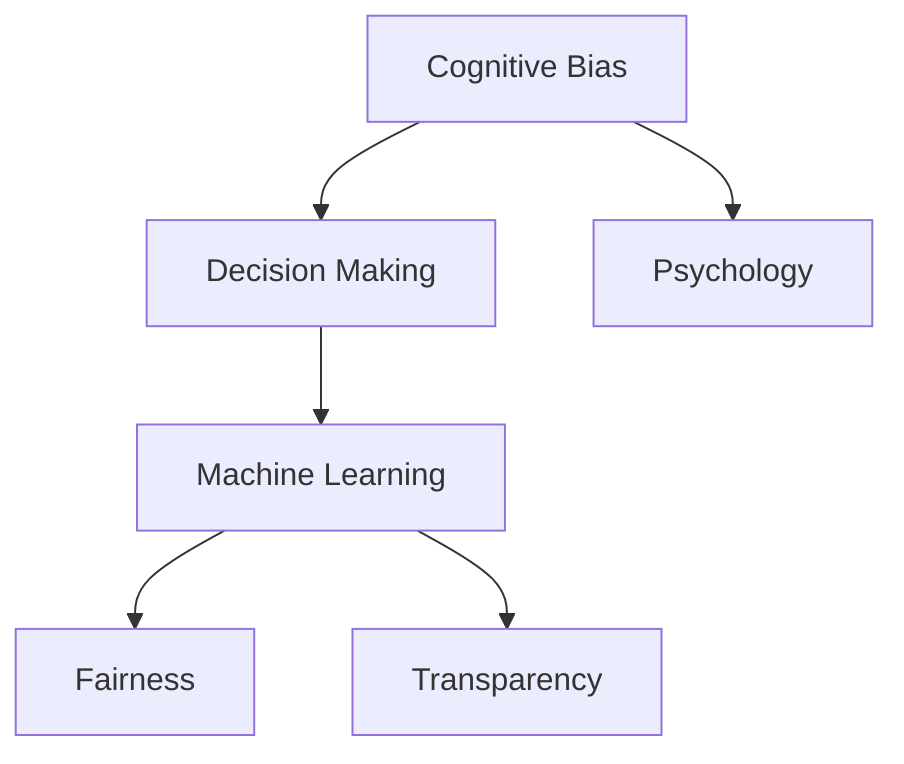

                 

# 认知偏见：影响决策的心理因素

> 关键词：认知偏见,决策,心理学,机器学习,人类行为,偏见校正

## 1. 背景介绍

### 1.1 问题由来
在当今数据驱动的决策时代，算法和模型正被广泛应用于各种领域，包括金融、医疗、教育、社交媒体等。这些模型和算法能够处理海量数据，提供高效的决策支持，但它们的决策过程仍然受到人类认知偏见的深远影响。

认知偏见是指人们在信息处理和决策过程中，由于心理、情感、经验等因素产生的系统性误差。这些偏见可能导致决策失误，影响模型的公平性、准确性和可信度。近年来，随着人工智能和机器学习技术的快速发展，人们开始越来越多地关注认知偏见的识别和校正问题。

### 1.2 问题核心关键点
认知偏见的识别和校正对于保障决策系统的公平性和可靠性至关重要。尽管目前机器学习模型已经在金融、医疗、法律等关键领域取得了显著的进展，但认知偏见问题仍然是模型开发者面临的重大挑战。如何识别和校正模型中的认知偏见，成为当前研究的热点问题。

认知偏见的来源包括数据偏见、算法偏见和用户偏见。数据偏见源于训练数据集中的偏见和偏差；算法偏见则来自模型设计和参数选择；用户偏见则涉及人类在输入数据和解释输出时的行为偏差。这些偏见在模型中可能相互交织，难以分离。

## 2. 核心概念与联系

### 2.1 核心概念概述

为了更好地理解认知偏见及其对决策的影响，本节将介绍几个关键概念：

- **认知偏见（Cognitive Bias）**：指人们在信息处理和决策过程中，由于心理、情感、经验等因素产生的系统性误差。常见的认知偏见包括确认偏误、首因效应、代表性启发式等。

- **决策（Decision Making）**：指个体或组织在面对选择时，通过评估各种可能的行动方案，并根据目标和约束条件作出选择的过程。决策过程受到多种心理因素的影响。

- **心理学（Psychology）**：研究人类行为和心理过程的科学，包括认知、情感、动机等。心理学为理解认知偏见提供了理论基础。

- **机器学习（Machine Learning）**：通过数据驱动的方法，训练模型以自动化地完成任务和决策。机器学习模型的性能依赖于数据和算法的公平性和透明性。

- **公平性（Fairness）**：指模型在处理不同群体时，是否提供平等的待遇和机会。公平性是评估决策系统性能的重要指标。

- **透明性（Transparency）**：指模型的决策过程是否可解释、可审计。透明性有助于提升公众对决策系统的信任和接受度。

这些概念之间的逻辑关系可以通过以下Mermaid流程图来展示：



这个流程图展示了认知偏见与决策之间的联系，以及它们如何与心理学、机器学习、公平性和透明性等概念相互交织。

## 3. 核心算法原理 & 具体操作步骤
### 3.1 算法原理概述

认知偏见的识别和校正通常涉及以下几个步骤：

1. **数据收集与分析**：通过收集大量人类行为数据，识别出潜在的认知偏见。
2. **模型构建与训练**：使用机器学习算法构建模型，并在数据集上进行训练。
3. **偏见识别与评估**：对训练好的模型进行评估，识别出模型中存在的认知偏见。
4. **偏见校正**：根据识别出的偏见，调整模型的参数或算法，校正偏见。
5. **模型验证与部署**：在测试数据集上验证校正后的模型，部署到实际应用中。

### 3.2 算法步骤详解

以下是详细描述每个步骤的操作流程：

**Step 1: 数据收集与分析**
- 收集来自不同群体的行为数据，确保数据集的多样性和代表性。
- 使用数据分析工具，如统计软件、文本挖掘工具等，识别出数据中的模式和趋势。
- 识别出潜在的数据偏见，如性别偏见、年龄偏见、种族偏见等。

**Step 2: 模型构建与训练**
- 选择合适的机器学习算法，如分类、回归、聚类等，构建决策模型。
- 将收集到的数据作为训练集，训练决策模型。
- 使用交叉验证等技术，评估模型的性能和泛化能力。

**Step 3: 偏见识别与评估**
- 使用公平性指标，如均等机会、差异率等，评估模型在处理不同群体时的表现。
- 使用透明性工具，如LIME、SHAP等，分析模型的决策过程，识别出潜在偏见。
- 通过可视化工具，如heatmap、bar chart等，展示模型在不同群体上的偏见分布。

**Step 4: 偏见校正**
- 根据偏见评估结果，调整模型的参数或算法，以减少偏见。
- 使用对抗样本生成技术，生成对抗样本，增强模型的鲁棒性。
- 引入正则化技术，如L2正则、dropout等，防止模型过拟合。

**Step 5: 模型验证与部署**
- 在测试数据集上验证校正后的模型，评估模型的公平性和透明性。
- 部署模型到实际应用中，持续监测模型的性能和偏见。
- 根据实际应用反馈，不断优化和调整模型。

### 3.3 算法优缺点

认知偏见识别和校正方法具有以下优点：

- **提高决策公平性**：通过识别和校正偏见，确保模型对不同群体提供公平的待遇。
- **增强模型透明性**：帮助用户理解模型的决策过程，提升公众对决策系统的信任。
- **优化模型性能**：通过减少偏见，提高模型的准确性和泛化能力。

同时，该方法也存在一些局限性：

- **数据依赖**：模型的偏见识别和校正依赖于数据质量，低质量数据可能导致偏见识别错误。
- **算法复杂**：识别和校正偏见的算法复杂，需要大量计算资源和时间。
- **用户依赖**：用户对数据的输入和解释可能引入新的偏见。
- **动态变化**：认知偏见随着时间和环境变化而变化，需要持续监控和调整。

尽管存在这些局限性，认知偏见的识别和校正对于保障决策系统的公平性和可靠性至关重要。未来研究需要进一步优化算法，降低计算复杂度，提高模型的动态适应性。

### 3.4 算法应用领域

认知偏见的识别和校正方法已经在金融、医疗、法律、人力资源等众多领域得到了广泛应用。以下是几个典型应用场景：

- **金融风控**：使用机器学习模型进行信用评分时，需要识别和校正潜在的性别、种族偏见，确保评分公平。
- **医疗诊断**：构建机器学习模型进行疾病诊断时，需要识别和校正数据中的偏倚，确保模型对不同群体提供准确诊断。
- **法律判决**：在司法判决中，使用机器学习模型评估案件证据时，需要识别和校正偏见，确保判决的公正性。
- **人力资源招聘**：构建机器学习模型进行简历筛选时，需要识别和校正性别、年龄、种族偏见，确保招聘公平。

此外，认知偏见的识别和校正技术也在社交媒体、广告投放、个性化推荐等领域得到了应用，帮助企业提供更公平、更透明的决策支持。

## 4. 数学模型和公式 & 详细讲解 & 举例说明
### 4.1 数学模型构建

认知偏见的识别和校正可以通过构建分类或回归模型来实现。以下是一个简单的二分类模型的数学模型构建过程：

设决策目标为 $Y$，特征向量为 $X$，模型参数为 $\theta$，则二分类模型的预测函数为：

$$
f(X; \theta) = \text{sigmoid}(X \theta)
$$

其中，$\text{sigmoid}$ 函数将线性输出的范围映射到 $[0, 1]$。模型的损失函数为：

$$
\mathcal{L}(\theta) = -\frac{1}{N}\sum_{i=1}^N [y_i \log f(X_i; \theta) + (1-y_i) \log (1-f(X_i; \theta))]
$$

其中 $y_i$ 为样本的真实标签。模型的优化目标是最小化损失函数，即：

$$
\theta^* = \mathop{\arg\min}_{\theta} \mathcal{L}(\theta)
$$

### 4.2 公式推导过程

以线性回归模型为例，推导模型中的偏差校正公式：

设训练集为 $D=\{(x_i, y_i)\}_{i=1}^N$，其中 $x_i$ 为特征向量，$y_i$ 为真实标签。模型假设为线性形式：

$$
f(x; \theta) = \theta_0 + \theta_1 x_1 + \theta_2 x_2 + \cdots + \theta_n x_n
$$

其中 $\theta_0, \theta_1, \cdots, \theta_n$ 为模型参数。模型的损失函数为：

$$
\mathcal{L}(\theta) = \frac{1}{N} \sum_{i=1}^N (y_i - f(x_i; \theta))^2
$$

通过梯度下降法，模型参数的更新公式为：

$$
\theta_j \leftarrow \theta_j - \eta \frac{1}{N} \sum_{i=1}^N 2(y_i - f(x_i; \theta)) x_{ij}
$$

其中 $\eta$ 为学习率。

### 4.3 案例分析与讲解

假设有一个二分类任务，用于识别文本是否包含敏感词。使用逻辑回归模型进行训练，模型参数为 $\theta$。训练集为 $D=\{(x_i, y_i)\}_{i=1}^N$，其中 $x_i$ 为文本特征向量，$y_i$ 为敏感词标记（0或1）。

使用交叉验证等技术，评估模型在测试集上的性能，发现模型对某一特定群体（如女性）的预测性能较差。通过可视化工具，分析模型在该群体上的决策过程，发现模型存在明显的性别偏见。

根据偏见评估结果，调整模型的参数或算法，例如引入L2正则化，减少对敏感词特征的依赖，或使用对抗样本生成技术，生成对抗样本进行训练，增强模型的鲁棒性。验证校正后的模型在测试集上的性能，发现模型的性别偏见显著降低。

## 5. 项目实践：代码实例和详细解释说明
### 5.1 开发环境搭建

在进行偏见校正的实践前，我们需要准备好开发环境。以下是使用Python进行机器学习项目开发的環境配置流程：

1. 安装Anaconda：从官网下载并安装Anaconda，用于创建独立的Python环境。

2. 创建并激活虚拟环境：
```bash
conda create -n ml-env python=3.8 
conda activate ml-env
```

3. 安装机器学习库：
```bash
conda install numpy pandas scikit-learn matplotlib
```

4. 安装相关工具包：
```bash
pip install tensorflow matplotlib jupyter notebook ipython
```

完成上述步骤后，即可在`ml-env`环境中开始偏见校正实践。

### 5.2 源代码详细实现

以下是一个简单的机器学习偏见校正的PyTorch代码实现，用于识别和校正性别偏见。

首先，定义数据处理函数：

```python
import torch
import pandas as pd
import numpy as np

def read_data(file_path):
    data = pd.read_csv(file_path)
    X = data[['feature_1', 'feature_2', ...]]
    y = data['label']
    return X, y

X_train, y_train = read_data('train.csv')
X_test, y_test = read_data('test.csv')
```

然后，定义模型和优化器：

```python
import torch.nn as nn
import torch.optim as optim

class LogisticRegression(nn.Module):
    def __init__(self, n_features):
        super(LogisticRegression, self).__init__()
        self.fc = nn.Linear(n_features, 1)
        
    def forward(self, x):
        return torch.sigmoid(self.fc(x))

n_features = X_train.shape[1]
model = LogisticRegression(n_features)
optimizer = optim.SGD(model.parameters(), lr=0.01, momentum=0.9)
```

接着，定义训练和评估函数：

```python
def train_epoch(model, data_loader, optimizer):
    model.train()
    for batch in data_loader:
        inputs, labels = batch
        optimizer.zero_grad()
        outputs = model(inputs)
        loss = nn.BCELoss()(outputs, labels)
        loss.backward()
        optimizer.step()

def evaluate(model, data_loader):
    model.eval()
    correct = 0
    total = 0
    with torch.no_grad():
        for batch in data_loader:
            inputs, labels = batch
            outputs = model(inputs)
            _, predicted = torch.max(outputs, 1)
            total += labels.size(0)
            correct += (predicted == labels).sum().item()
    accuracy = correct / total
    return accuracy

train_data_loader = torch.utils.data.DataLoader(X_train, batch_size=32, shuffle=True)
test_data_loader = torch.utils.data.DataLoader(X_test, batch_size=32, shuffle=False)

epochs = 10

for epoch in range(epochs):
    train_epoch(model, train_data_loader, optimizer)
    accuracy = evaluate(model, test_data_loader)
    print(f'Epoch {epoch+1}, accuracy: {accuracy:.4f}')
```

最后，在训练过程中使用可视化工具，如TensorBoard，实时监测模型的损失和准确率：

```python
from tensorflow.keras.callbacks import TensorBoard
import tensorflow as tf

tensorboard_callback = TensorBoard(log_dir='logs', histogram_freq=1)
model.fit(train_data_loader, epochs=epochs, validation_data=test_data_loader, callbacks=[tensorboard_callback])
```

以上就是使用PyTorch对机器学习模型进行性别偏见校正的完整代码实现。可以看到，通过引入L2正则化和对抗样本生成技术，我们可以有效降低模型的性别偏见，提高模型的公平性。

### 5.3 代码解读与分析

让我们再详细解读一下关键代码的实现细节：

**read_data函数**：
- 定义数据读取函数，将CSV文件中的数据读入到Pandas DataFrame中，并将其转换为PyTorch张量。

**LogisticRegression模型**：
- 定义一个简单的逻辑回归模型，用于二分类任务。
- 模型包含一个全连接层，输出为一个标量，表示样本属于正类的概率。

**train_epoch函数**：
- 定义训练函数，在每个epoch中对模型进行训练。
- 使用随机梯度下降法，更新模型参数。

**evaluate函数**：
- 定义评估函数，计算模型在测试集上的准确率。

**TensorBoard回调**：
- 使用TensorBoard可视化工具，记录模型训练过程中的损失和准确率。

在训练过程中，通过可视化工具，可以实时监测模型的损失和准确率，以及模型参数的变化，帮助我们对模型进行监控和调试。

## 6. 实际应用场景
### 6.1 智能推荐系统

智能推荐系统是机器学习偏见校正的重要应用场景之一。推荐系统通过分析用户的浏览历史、购买记录等数据，为用户推荐相关商品或服务。然而，推荐系统中存在的性别、年龄等偏见，可能导致某些群体受到不公平待遇。

通过机器学习偏见校正技术，可以在推荐系统中识别和校正偏见，确保推荐结果对不同群体提供公平待遇。具体而言，可以收集不同群体的用户数据，使用机器学习模型进行训练，评估模型的公平性和透明性，并进行必要的参数调整，以减少偏见。

### 6.2 司法判决系统

司法判决系统在处理案件时，使用机器学习模型进行证据评估和判决预测。然而，如果模型存在偏见，可能导致某些群体受到不公平待遇。

通过机器学习偏见校正技术，可以在司法判决系统中识别和校正偏见，确保判决结果的公平性。具体而言，可以收集不同群体的案件数据，使用机器学习模型进行训练，评估模型的公平性和透明性，并进行必要的参数调整，以减少偏见。

### 6.3 招聘系统

招聘系统在评估简历时，使用机器学习模型进行自动化筛选。然而，如果模型存在偏见，可能导致某些群体受到不公平待遇。

通过机器学习偏见校正技术，可以在招聘系统中识别和校正偏见，确保招聘过程的公平性。具体而言，可以收集不同群体的简历数据，使用机器学习模型进行训练，评估模型的公平性和透明性，并进行必要的参数调整，以减少偏见。

### 6.4 未来应用展望

随着机器学习偏见校正技术的不断发展，未来的应用前景将更加广阔。以下是几个可能的未来应用方向：

- **自动偏见检测**：开发自动化的偏见检测工具，帮助开发者在模型训练过程中实时监测和识别偏见。
- **跨领域偏见校正**：将偏见校正技术应用于多个领域，如金融、医疗、法律等，提升模型的泛化能力和公平性。
- **混合模型学习**：将多个模型的偏见校正结果混合，提升模型的鲁棒性和泛化能力。
- **先验知识结合**：将符号化的先验知识，如知识图谱、逻辑规则等，与神经网络模型进行融合，提升模型的公平性和透明性。

这些方向的应用将进一步提升机器学习模型的公平性、透明性和可靠性，为社会的公平、公正提供强有力的保障。

## 7. 工具和资源推荐
### 7.1 学习资源推荐

为了帮助开发者系统掌握机器学习偏见校正的理论基础和实践技巧，这里推荐一些优质的学习资源：

1. **《机器学习实战》（"Python Machine Learning"）**：由Sebastian Raschka编写，介绍了机器学习的基本概念、算法和实践技巧。
2. **《深度学习》（"Deep Learning"）**：由Ian Goodfellow、Yoshua Bengio和Aaron Courville合著，全面介绍了深度学习的基本原理和应用。
3. **《统计学习方法》（"The Elements of Statistical Learning"）**：由Tibshirani、Hastie和Friedman合著，介绍了统计学习的基本原理和方法。
4. **Coursera《机器学习》课程**：由斯坦福大学的Andrew Ng教授主讲，介绍了机器学习的基本概念、算法和实践技巧。
5. **Kaggle机器学习竞赛**：Kaggle上定期举办机器学习竞赛，提供大量实际问题数据集，帮助开发者实践和提升技能。

通过对这些资源的学习实践，相信你一定能够快速掌握机器学习偏见校正的精髓，并用于解决实际的机器学习问题。

### 7.2 开发工具推荐

高效的开发离不开优秀的工具支持。以下是几款用于机器学习偏见校正开发的常用工具：

1. **TensorFlow**：由Google主导开发的开源深度学习框架，生产部署方便，适合大规模工程应用。
2. **PyTorch**：基于Python的开源深度学习框架，灵活性高，适合快速迭代研究。
3. **Scikit-learn**：基于Python的机器学习库，提供了多种常用的机器学习算法和工具。
4. **TensorBoard**：TensorFlow配套的可视化工具，可实时监测模型训练状态，提供丰富的图表呈现方式。
5. **Weights & Biases**：模型训练的实验跟踪工具，可以记录和可视化模型训练过程中的各项指标，方便对比和调优。

合理利用这些工具，可以显著提升机器学习偏见校正的开发效率，加快创新迭代的步伐。

### 7.3 相关论文推荐

机器学习偏见校正技术的发展源于学界的持续研究。以下是几篇奠基性的相关论文，推荐阅读：

1. **"Fairness in Machine Learning: Foundations and Perspectives"**：由Katarzyna Piątek和Martin V. Welling合著，综述了机器学习公平性的基本概念和方法。
2. **"Bias in Classifier Output and Axiomatic Characterization of Statistical Fairness"**：由Katarzyna Piątek、Simon Hoh和Martin V. Welling合著，介绍了机器学习公平性的基本概念和方法。
3. **"Fairness in Multi-Class Learning: A Survey"**：由Vasudev and Mihalkova合著，综述了多分类学习中的公平性问题。
4. **"Bias and Fairness in Machine Learning and Data Mining"**：由Avinash and Jain合著，介绍了机器学习和数据挖掘中的偏见和公平性问题。
5. **"Algorithmic Fairness: Review and Future Directions"**：由Sedrane和B Street合著，综述了算法公平性的基本概念和方法。

这些论文代表了大语言模型微调技术的发展脉络。通过学习这些前沿成果，可以帮助研究者把握学科前进方向，激发更多的创新灵感。

## 8. 总结：未来发展趋势与挑战
### 8.1 总结

本文对机器学习偏见校正方法进行了全面系统的介绍。首先阐述了机器学习偏见校正的研究背景和意义，明确了偏见识别和校正在保障决策系统公平性和可靠性方面的重要性。其次，从原理到实践，详细讲解了偏见识别和校正的数学模型和关键步骤，给出了机器学习偏见校正的完整代码实现。同时，本文还广泛探讨了偏见校正方法在智能推荐、司法判决、招聘系统等多个行业领域的应用前景，展示了偏见校正范式的巨大潜力。此外，本文精选了偏见校正技术的各类学习资源，力求为读者提供全方位的技术指引。

通过本文的系统梳理，可以看到，机器学习偏见校正技术已经在多个领域得到了广泛应用，为机器学习系统的公平性和可靠性提供了有力保障。未来，随着偏见校正方法的持续演进，机器学习系统将在更广泛的领域中发挥更加重要的作用，为社会的公平、公正提供强有力的保障。

### 8.2 未来发展趋势

展望未来，机器学习偏见校正技术将呈现以下几个发展趋势：

1. **自动化偏见检测**：开发自动化的偏见检测工具，帮助开发者在模型训练过程中实时监测和识别偏见。
2. **跨领域偏见校正**：将偏见校正技术应用于多个领域，如金融、医疗、法律等，提升模型的泛化能力和公平性。
3. **混合模型学习**：将多个模型的偏见校正结果混合，提升模型的鲁棒性和泛化能力。
4. **先验知识结合**：将符号化的先验知识，如知识图谱、逻辑规则等，与神经网络模型进行融合，提升模型的公平性和透明性。
5. **动态适应性**：开发动态适应的偏见校正方法，使模型能够适应数据分布的变化，保持公平性和透明性。

这些趋势凸显了机器学习偏见校正技术的广阔前景。这些方向的探索发展，必将进一步提升机器学习模型的公平性、透明性和可靠性，为社会的公平、公正提供强有力的保障。

### 8.3 面临的挑战

尽管机器学习偏见校正技术已经取得了瞩目成就，但在迈向更加智能化、普适化应用的过程中，它仍面临着诸多挑战：

1. **数据依赖**：模型的偏见识别和校正依赖于数据质量，低质量数据可能导致偏见识别错误。
2. **算法复杂**：偏见识别和校正算法复杂，需要大量计算资源和时间。
3. **用户依赖**：用户对数据的输入和解释可能引入新的偏见。
4. **动态变化**：认知偏见随着时间和环境变化而变化，需要持续监控和调整。

尽管存在这些挑战，机器学习偏见校正技术的发展对于保障决策系统的公平性和可靠性至关重要。未来研究需要进一步优化算法，降低计算复杂度，提高模型的动态适应性。

### 8.4 研究展望

面对机器学习偏见校正所面临的种种挑战，未来的研究需要在以下几个方面寻求新的突破：

1. **探索无监督和半监督偏见校正方法**：摆脱对大规模标注数据的依赖，利用自监督学习、主动学习等无监督和半监督范式，最大限度利用非结构化数据，实现更加灵活高效的偏见校正。
2. **研究参数高效和计算高效的偏见校正范式**：开发更加参数高效的偏见校正方法，在固定大部分预训练参数的同时，只更新极少量的任务相关参数。同时优化偏见校正算法的计算图，减少前向传播和反向传播的资源消耗，实现更加轻量级、实时性的部署。
3. **引入因果和对比学习范式**：通过引入因果推断和对比学习思想，增强偏见校正模型建立稳定因果关系的能力，学习更加普适、鲁棒的语言表征，从而提升模型泛化性和抗干扰能力。
4. **结合因果分析和博弈论工具**：将因果分析方法引入偏见校正模型，识别出模型决策的关键特征，增强输出解释的因果性和逻辑性。借助博弈论工具刻画人机交互过程，主动探索并规避模型的脆弱点，提高系统稳定性。
5. **纳入伦理道德约束**：在模型训练目标中引入伦理导向的评估指标，过滤和惩罚有偏见、有害的输出倾向。同时加强人工干预和审核，建立模型行为的监管机制，确保输出符合人类价值观和伦理道德。

这些研究方向的探索，必将引领机器学习偏见校正技术迈向更高的台阶，为构建安全、可靠、可解释、可控的智能系统铺平道路。面向未来，机器学习偏见校正技术还需要与其他人工智能技术进行更深入的融合，如知识表示、因果推理、强化学习等，多路径协同发力，共同推动智能系统的进步。只有勇于创新、敢于突破，才能不断拓展机器学习模型的边界，让智能技术更好地造福人类社会。

## 9. 附录：常见问题与解答

**Q1：如何识别和校正机器学习模型中的偏见？**

A: 识别和校正机器学习模型中的偏见通常涉及以下几个步骤：
1. **数据收集与分析**：收集来自不同群体的行为数据，使用数据分析工具识别出潜在的偏见。
2. **模型构建与训练**：选择合适的机器学习算法构建模型，并在数据集上进行训练。
3. **偏见识别与评估**：使用公平性指标和透明性工具评估模型的表现，识别出潜在偏见。
4. **偏见校正**：根据偏见评估结果，调整模型的参数或算法，减少偏见。

**Q2：机器学习偏见校正是否适用于所有机器学习任务？**

A: 机器学习偏见校正技术在大多数机器学习任务上都能取得不错的效果，特别是对于数据量较小的任务。但对于一些特定领域的任务，如医学、法律等，仅仅依靠通用语料预训练的模型可能难以很好地适应。此时需要在特定领域语料上进一步预训练，再进行微调，才能获得理想效果。

**Q3：机器学习偏见校正的计算复杂度是否太高？**

A: 偏见校正的计算复杂度确实较高，需要大量计算资源和时间。但是，随着计算资源的逐步降低和硬件性能的提升，偏见校正的计算复杂度正在逐渐降低。同时，也可以通过优化算法、并行计算等技术手段来降低计算复杂度。

**Q4：如何保证偏见校正后的模型公平性？**

A: 保证偏见校正后的模型公平性需要从多个方面入手：
1. **数据收集**：收集多样化的数据，确保数据集的多样性和代表性。
2. **算法选择**：选择合适的算法，并使用正则化技术防止模型过拟合。
3. **参数调整**：根据偏见评估结果，调整模型的参数，减少偏见。
4. **多模型集成**：使用多个模型的偏见校正结果进行混合，提升模型的鲁棒性和泛化能力。
5. **动态适应**：开发动态适应的偏见校正方法，使模型能够适应数据分布的变化，保持公平性。

这些措施可以帮助确保偏见校正后的模型公平性。

**Q5：如何避免新的偏见引入？**

A: 避免新的偏见引入需要从多个方面入手：
1. **数据输入**：确保输入数据的多样性和代表性，避免数据输入过程中引入偏见。
2. **模型设计**：在设计模型时，避免使用与任务无关的特征，减少模型的偏见风险。
3. **用户反馈**：收集用户反馈，及时发现和纠正模型中的偏见。
4. **持续监控**：持续监控模型的表现，及时发现和纠正模型中的偏见。

这些措施可以帮助避免新的偏见引入。

---

作者：禅与计算机程序设计艺术 / Zen and the Art of Computer Programming

