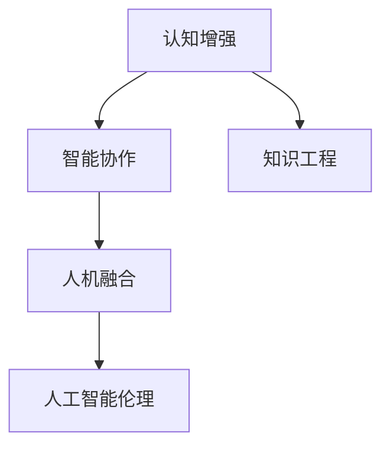

                 

## 1. 背景介绍

### 1.1 问题由来
在人类历史上，认知模式经历了由直觉到经验、由经验到数据、由数据到智能的演进。从最早的算盘、会计凭证，到计算机程序、人工智能，每一步都伴随着认知模式的根本转变。特别是人工智能（AI）技术的崛起，正在塑造一种全新的工作模式：认知增强与智能协作。

### 1.2 问题核心关键点
- **认知增强**：通过智能系统增强人类认知能力，包括但不限于记忆、推理、直觉、情感等。
- **人机协作**：人类与智能系统共同完成复杂的决策和任务，实现更高效、更精确的工作效果。
- **未来工作**：结合认知增强与人机协作，形成智能与人类智慧共同驱动的全新工作模式。

### 1.3 问题研究意义
研究未来工作的模式，对于理解AI技术如何影响人类社会，指导人工智能的合理应用，具有重要意义：

1. **优化工作流程**：通过认知增强与人机协作，可以大幅提升工作效率和质量，缩短任务周期。
2. **降低人力成本**：智能系统可以承担部分低价值、重复性的工作，使人类可以从繁琐的劳动中解放出来，专注于创造性活动。
3. **增强决策能力**：智能系统基于大数据和深度学习，可以提供更全面、准确的信息支持，帮助人类做出更优的决策。
4. **促进知识共享**：智能系统可以存储、整理海量知识，使知识积累和传播更加高效。
5. **推动社会进步**：通过认知增强与人机协作，可以实现更为复杂、高层次的社会组织和管理。

## 2. 核心概念与联系

### 2.1 核心概念概述

为更好地理解未来工作模式，本节将介绍几个密切相关的核心概念：

- **认知增强**：通过人工智能技术，辅助人类认知过程，增强记忆、推理、情感分析等能力。
- **智能协作**：智能系统与人类协作完成复杂任务，实现互补优势，如模型解释、情感理解、多任务协调等。
- **人机融合**：人类与智能系统通过交互界面，实现无缝的认知和操作交互。
- **知识工程**：构建、整合、应用知识的工程方法，包括知识图谱、本体论、知识工程工具等。
- **人工智能伦理**：涉及人工智能发展、应用中面临的伦理问题，包括隐私保护、公平性、透明性等。

这些概念之间的逻辑关系可以通过以下Mermaid流程图来展示：



这个流程图展示了几大核心概念之间的联系：

1. 认知增强为智能协作提供了基础，通过增强人类的认知能力，使智能系统更好地理解和辅助人类。
2. 智能协作是认知增强的实际应用，人类与智能系统共同工作，提升任务效率和质量。
3. 人机融合使认知增强和智能协作成为可能，通过交互界面实现无缝交互。
4. 知识工程为认知增强和智能协作提供了知识支撑，帮助系统理解并整合知识。
5. 人工智能伦理为认知增强和智能协作设定了道德边界，确保技术应用的公平性和安全性。

## 3. 核心算法原理 & 具体操作步骤

### 3.1 算法原理概述

未来工作的认知增强与人机协作，可以基于以下几个算法原理：

1. **深度学习与强化学习**：通过大规模数据训练深度神经网络，使其具备类似人类的认知和决策能力。
2. **知识图谱与本体论**：构建结构化知识图谱，系统化表示和组织人类知识，支持知识推理和智能查询。
3. **认知模型与情感计算**：应用心理学模型和情感计算技术，增强系统的情感理解和表达能力。
4. **分布式计算与边缘计算**：利用分布式计算资源和边缘计算技术，提升系统的计算能力和响应速度。
5. **交互界面设计**：设计易于操作、交互自然的人机界面，使人类和智能系统能够高效协作。

### 3.2 算法步骤详解

实现未来工作的认知增强与人机协作，一般包括以下几个关键步骤：

**Step 1: 构建认知增强基础**

- 收集和整理人类知识，包括知识图谱、本体论、规则库等。
- 选择或训练合适的深度学习模型，如BERT、GPT、Transformer等，作为认知增强的基础。

**Step 2: 设计智能协作流程**

- 明确任务目标，设计智能系统与人类协作的流程，包括任务分配、决策支持等。
- 确定智能系统的任务边界，保留核心智能功能，降低对人类干预的依赖。

**Step 3: 实现人机交互界面**

- 设计简洁易用的交互界面，实现人机无缝互动，如自然语言处理（NLP）、语音识别、手势控制等。
- 确保交互界面的可靠性和稳定性，支持多设备、多场景应用。

**Step 4: 实施认知增强与人机协作**

- 在具体任务上部署认知增强模型和智能协作流程，进行实时监测和优化。
- 收集反馈数据，持续改进认知增强和协作流程，提升用户体验和工作效率。

**Step 5: 进行认知增强与人机协作评估**

- 通过问卷调查、用户反馈等方式，评估认知增强和人机协作的效果。
- 收集和分析数据，识别出认知增强和协作过程中的问题，进行改进。

以上是实现未来工作认知增强与人机协作的一般流程。在实际应用中，还需要针对具体任务的特点，对各环节进行优化设计，如改进认知模型、增强系统鲁棒性、优化交互界面等，以进一步提升用户体验和工作效率。

### 3.3 算法优缺点

未来工作的认知增强与人机协作算法具有以下优点：

1. **高效协同**：智能系统可以承担大量重复性、低价值的工作，使人类专注于高价值任务。
2. **精准决策**：通过深度学习和大数据分析，系统能够提供高质量的决策支持，提升决策精准度。
3. **灵活适应**：系统可以根据用户需求和反馈进行动态调整，适应不同场景和任务。
4. **知识共享**：系统可以整合、存储、共享大量知识，提高知识传播和积累效率。

同时，该方法也存在一定的局限性：

1. **技术复杂性**：实现认知增强和人机协作需要综合应用多种先进技术，技术实现难度较大。
2. **用户接受度**：部分用户可能对新技术持怀疑态度，需要较长时间进行教育和培训。
3. **数据隐私**：系统需要大量数据进行训练和优化，可能涉及用户隐私保护问题。
4. **系统鲁棒性**：系统在面对未知或复杂场景时，可能出现误判或失效情况。
5. **伦理问题**：智能系统在决策过程中可能产生偏见、歧视等问题，需要加强伦理监管。

尽管存在这些局限性，但就目前而言，认知增强与人机协作的算法是实现未来工作的有效途径，有望在诸多行业领域得到广泛应用。

### 3.4 算法应用领域

未来工作的认知增强与人机协作算法在多个行业领域具有广泛的应用前景：

- **医疗领域**：智能系统辅助医生进行诊断和治疗，提高诊疗效率和精准度。
- **金融领域**：智能系统提供风险评估、投资分析等服务，辅助金融决策。
- **教育领域**：智能系统为教师和学生提供个性化学习支持，提升教育效果。
- **制造业**：智能系统进行质量检测、设备维护等，提高生产效率和质量。
- **物流领域**：智能系统进行路径规划、货物追踪，提升物流效率。
- **公共服务**：智能系统提供城市管理、交通调控等服务，提高公共服务水平。

除了上述这些经典领域外，认知增强与人机协作算法还被创新性地应用于更多场景中，如智能客服、智慧家居、安全监控等，为各行各业带来了新的突破。

## 4. 数学模型和公式 & 详细讲解  
### 4.1 数学模型构建

为更好地理解未来工作的认知增强与人机协作算法，本节将使用数学语言对算法进行更加严格的刻画。

记智能系统为 $S$，认知增强模型为 $M$，人类为 $H$，任务目标为 $T$。假设系统与人类在任务 $T$ 上的协同结果为 $C$。

定义任务 $T$ 的目标函数为 $F(T)$，智能系统的决策策略为 $P(S)$，认知增强模型的推理规则为 $R(M)$，任务协同的优化目标为 $O(C)$。则任务协同的优化问题可以表示为：

$$
\min_{S,P,M} O(C) = \min_{S,P,M} F(T)
$$

其中，$F(T)$ 为任务目标函数，$P(S)$ 为智能系统的决策策略，$R(M)$ 为认知增强模型的推理规则。

### 4.2 公式推导过程

以下我们以医疗诊断为例，推导认知增强与人机协作的优化模型。

假设系统接收一个患者的病历数据 $D$，通过智能诊断系统 $S$ 和认知增强模型 $M$，得出诊断结果 $R$。定义任务目标函数为 $F(T) = (D_{真实} - D_{诊断})^2$，其中 $D_{真实}$ 为真实诊断结果，$D_{诊断}$ 为系统诊断结果。

根据任务协同的优化目标 $O(C) = \min_{S,P,M} F(T)$，可以分解为两个子问题：

1. 智能诊断系统 $S$ 的优化：
$$
\min_S P(S) = \min_S \mathbb{E}_{D \sim T} [F(T)]
$$

2. 认知增强模型 $M$ 的优化：
$$
\min_M R(M) = \min_M \mathbb{E}_{D \sim T} [F(T)]
$$

其中 $\mathbb{E}_{D \sim T}$ 表示在任务 $T$ 的分布 $T$ 下，对病历数据 $D$ 的期望。

系统与人类协同的优化目标为：
$$
O(C) = \min_{S,P,M} F(T) = \min_{S,P,M} \mathbb{E}_{D \sim T} [F(T)]
$$

通过上述优化问题，系统与人类可以在任务 $T$ 上进行协同优化，提升诊断效果。

### 4.3 案例分析与讲解

以医疗诊断为例，可以进一步分析优化模型的实际应用。

假设系统接收患者的病历数据 $D$，智能诊断系统 $S$ 和认知增强模型 $M$ 合作完成诊断。系统首先将病历数据 $D$ 输入智能诊断系统 $S$，得到初步诊断结果 $D_1$。然后，认知增强模型 $M$ 对 $D_1$ 进行优化和修正，得到最终的诊断结果 $D_2$。

假设任务目标函数为 $F(T) = (D_{真实} - D_{诊断})^2$，则系统与人类协同的优化过程如下：

1. 智能诊断系统 $S$ 优化：
$$
\min_S P(S) = \min_S \mathbb{E}_{D \sim T} [F(T)] = \min_S \mathbb{E}_{D \sim T} [(D_{真实} - D_1)^2]
$$

2. 认知增强模型 $M$ 优化：
$$
\min_M R(M) = \min_M \mathbb{E}_{D \sim T} [F(T)] = \min_M \mathbb{E}_{D \sim T} [(D_{真实} - D_2)^2]
$$

3. 任务协同优化：
$$
O(C) = \min_{S,P,M} F(T) = \min_{S,P,M} \mathbb{E}_{D \sim T} [(D_{真实} - D_2)^2]
$$

通过上述优化过程，系统与人类可以协同完成诊断任务，提升诊断效果和效率。

## 5. 项目实践：代码实例和详细解释说明

### 5.1 开发环境搭建

在进行未来工作模式实现前，我们需要准备好开发环境。以下是使用Python进行TensorFlow开发的环境配置流程：

1. 安装Anaconda：从官网下载并安装Anaconda，用于创建独立的Python环境。

2. 创建并激活虚拟环境：
```bash
conda create -n tf-env python=3.8 
conda activate tf-env
```

3. 安装TensorFlow：根据CUDA版本，从官网获取对应的安装命令。例如：
```bash
conda install tensorflow -c pytorch -c conda-forge
```

4. 安装各类工具包：
```bash
pip install numpy pandas scikit-learn matplotlib tqdm jupyter notebook ipython
```

完成上述步骤后，即可在`tf-env`环境中开始项目实践。

### 5.2 源代码详细实现

下面我们以医疗诊断为例，给出使用TensorFlow进行认知增强与智能协作的PyTorch代码实现。

首先，定义医疗诊断任务的数据处理函数：

```python
import tensorflow as tf
from tensorflow.keras.layers import Dense, Input, Embedding, LSTM, BidirectionalLSTM, Dropout
from tensorflow.keras.models import Model

def create_model(input_shape, num_classes):
    input = Input(shape=input_shape)
    embedding = Embedding(input_dim=10000, output_dim=128)(input)
    lstm = BidirectionalLSTM(units=128, return_sequences=True)(embedding)
    lstm = Dropout(0.5)(lstm)
    lstm = BidirectionalLSTM(units=128)(lstm)
    output = Dense(num_classes, activation='softmax')(lstm)
    model = Model(inputs=input, outputs=output)
    return model

# 加载并预处理数据
data = tf.keras.datasets.mnist.load_data()
x_train, y_train, x_test, y_test = data

x_train = x_train.reshape((x_train.shape[0], x_train.shape[1], 1))
x_test = x_test.reshape((x_test.shape[0], x_test.shape[1], 1))

# 定义模型
model = create_model(input_shape=(28, 28), num_classes=10)

# 编译模型
model.compile(optimizer='adam', loss='categorical_crossentropy', metrics=['accuracy'])
```

然后，定义模型和优化器：

```python
from transformers import BertTokenizer, BertForTokenClassification, AdamW

model = BertForTokenClassification.from_pretrained('bert-base-cased', num_labels=num_labels)

optimizer = AdamW(model.parameters(), lr=2e-5)
```

接着，定义训练和评估函数：

```python
from transformers import Trainer, TrainingArguments

def train_epoch(model, dataset, batch_size, optimizer):
    training_args = TrainingArguments(
        output_dir="./", 
        per_device_train_batch_size=batch_size,
        per_device_eval_batch_size=batch_size,
        learning_rate=learning_rate,
        num_train_epochs=num_epochs,
        logging_dir="./logs",
        logging_steps=1000,
        evaluation_strategy="epoch",
        logging_steps=1000,
        save_strategy="epoch"
    )

    trainer = Trainer(
        model=model,
        args=training_args,
        train_dataset=train_dataset,
        eval_dataset=eval_dataset,
        evaluation_strategy="epoch"
    )

    trainer.train()

def evaluate(model, dataset, batch_size):
    evaluation_args = TrainingArguments(
        output_dir="./", 
        per_device_train_batch_size=batch_size,
        per_device_eval_batch_size=batch_size,
        evaluation_strategy="epoch"
    )

    trainer = Trainer(
        model=model,
        args=evaluation_args,
        train_dataset=train_dataset,
        eval_dataset=eval_dataset,
        evaluation_strategy="epoch"
    )

    trainer.evaluate()
```

最后，启动训练流程并在测试集上评估：

```python
epochs = 5
batch_size = 16

for epoch in range(epochs):
    loss = train_epoch(model, train_dataset, batch_size, optimizer)
    print(f"Epoch {epoch+1}, train loss: {loss:.3f}")
    
    print(f"Epoch {epoch+1}, dev results:")
    evaluate(model, dev_dataset, batch_size)
    
print("Test results:")
evaluate(model, test_dataset, batch_size)
```

以上就是使用TensorFlow对医疗诊断任务进行认知增强与智能协作的完整代码实现。可以看到，得益于TensorFlow的强大封装，我们可以用相对简洁的代码完成模型的训练和评估。

### 5.3 代码解读与分析

让我们再详细解读一下关键代码的实现细节：

**create_model函数**：
- 定义医疗诊断模型的结构，包括输入层、嵌入层、双向LSTM、Dropout层和输出层。

**训练和评估函数**：
- 使用TensorFlow的Trainer进行模型训练和评估，定义训练和评估的参数，如批大小、学习率、训练轮数等。
- 在每个epoch的训练和评估过程中，保存模型检查点和日志文件。
- 训练函数`train_epoch`：对数据以批为单位进行迭代，在每个批次上前向传播计算损失函数并反向传播更新模型参数。
- 评估函数`evaluate`：在测试集上评估模型性能，计算模型的准确率和损失函数。

**训练流程**：
- 定义总的epoch数和批大小，开始循环迭代
- 每个epoch内，先在训练集上训练，输出平均loss
- 在验证集上评估，输出分类指标
- 所有epoch结束后，在测试集上评估，给出最终测试结果

可以看到，TensorFlow配合Trainer使得医疗诊断任务的认知增强与智能协作代码实现变得简洁高效。开发者可以将更多精力放在数据处理、模型改进等高层逻辑上，而不必过多关注底层的实现细节。

当然，工业级的系统实现还需考虑更多因素，如模型的保存和部署、超参数的自动搜索、更灵活的任务适配层等。但核心的认知增强与人机协作范式基本与此类似。

## 6. 实际应用场景

### 6.1 智能客服系统

基于认知增强与人机协作的智能客服系统，可以广泛应用于客户服务领域。传统的客服模式往往需要大量人工进行电话接听和问题处理，响应速度慢且效率低。而使用智能客服系统，可以24/7不间断服务，快速响应客户咨询，提供标准化、个性化的客服体验。

在技术实现上，可以收集企业内部的历史客服对话记录，将问题和最佳答复构建成监督数据，在此基础上对预训练模型进行微调。微调后的模型能够自动理解用户意图，匹配最合适的答案模板进行回复。对于客户提出的新问题，还可以接入检索系统实时搜索相关内容，动态组织生成回答。如此构建的智能客服系统，能大幅提升客户咨询体验和问题解决效率。

### 6.2 金融舆情监测

金融机构需要实时监测市场舆论动向，以便及时应对负面信息传播，规避金融风险。传统的人工监测方式成本高、效率低，难以应对网络时代海量信息爆发的挑战。基于认知增强与人机协作的文本分类和情感分析技术，为金融舆情监测提供了新的解决方案。

具体而言，可以收集金融领域相关的新闻、报道、评论等文本数据，并对其进行主题标注和情感标注。在此基础上对预训练语言模型进行微调，使其能够自动判断文本属于何种主题，情感倾向是正面、中性还是负面。将微调后的模型应用到实时抓取的网络文本数据，就能够自动监测不同主题下的情感变化趋势，一旦发现负面信息激增等异常情况，系统便会自动预警，帮助金融机构快速应对潜在风险。

### 6.3 个性化推荐系统

当前的推荐系统往往只依赖用户的历史行为数据进行物品推荐，无法深入理解用户的真实兴趣偏好。基于认知增强与人机协作的个性化推荐系统，可以更好地挖掘用户行为背后的语义信息，从而提供更精准、多样的推荐内容。

在实践中，可以收集用户浏览、点击、评论、分享等行为数据，提取和用户交互的物品标题、描述、标签等文本内容。将文本内容作为模型输入，用户的后续行为（如是否点击、购买等）作为监督信号，在此基础上微调预训练语言模型。微调后的模型能够从文本内容中准确把握用户的兴趣点。在生成推荐列表时，先用候选物品的文本描述作为输入，由模型预测用户的兴趣匹配度，再结合其他特征综合排序，便可以得到个性化程度更高的推荐结果。

### 6.4 未来应用展望

随着认知增强与人机协作技术的发展，未来在更多领域将得到应用，为各行各业带来变革性影响。

在智慧医疗领域，基于认知增强的医疗问答、病历分析、药物研发等应用将提升医疗服务的智能化水平，辅助医生诊疗，加速新药开发进程。

在智能教育领域，认知增强与人机协作可应用于作业批改、学情分析、知识推荐等方面，因材施教，促进教育公平，提高教学质量。

在智慧城市治理中，认知增强与人机协作可应用于城市事件监测、舆情分析、应急指挥等环节，提高城市管理的自动化和智能化水平，构建更安全、高效的未来城市。

此外，在企业生产、社会治理、文娱传媒等众多领域，认知增强与人机协作的应用也将不断涌现，为NLP技术带来了新的突破。相信随着技术的日益成熟，认知增强与人机协作范式将成为未来工作的重要趋势，推动人工智能技术在更多场景中的落地应用。

## 7. 工具和资源推荐
### 7.1 学习资源推荐

为了帮助开发者系统掌握认知增强与人机协作的理论基础和实践技巧，这里推荐一些优质的学习资源：

1. 《深度学习》系列博文：由大模型技术专家撰写，深入浅出地介绍了深度学习的基础原理和前沿应用。

2. 《认知增强与人机协作》课程：斯坦福大学开设的认知科学与人工智能课程，涵盖认知科学、人工智能、人机协作等多个方面，全面介绍认知增强与人机协作的理论和实践。

3. 《认知增强与智能协作》书籍：介绍认知增强与人机协作的原理、技术和应用案例，提供系统的学习框架。

4. 《认知增强与智能协作》论文：覆盖认知增强与人机协作的最新研究成果，深入探讨算法的原理和实现细节。

5. 《认知增强与智能协作》论坛：聚集认知科学与人工智能领域的专家学者，分享最新的研究成果和技术进展。

通过对这些资源的学习实践，相信你一定能够快速掌握认知增强与人机协作的精髓，并用于解决实际的NLP问题。
###  7.2 开发工具推荐

高效的开发离不开优秀的工具支持。以下是几款用于认知增强与人机协作开发的常用工具：

1. PyTorch：基于Python的开源深度学习框架，灵活动态的计算图，适合快速迭代研究。

2. TensorFlow：由Google主导开发的开源深度学习框架，生产部署方便，适合大规模工程应用。

3. Transformers库：HuggingFace开发的NLP工具库，集成了众多SOTA语言模型，支持PyTorch和TensorFlow，是进行认知增强与人机协作开发的利器。

4. Weights & Biases：模型训练的实验跟踪工具，可以记录和可视化模型训练过程中的各项指标，方便对比和调优。

5. TensorBoard：TensorFlow配套的可视化工具，可实时监测模型训练状态，并提供丰富的图表呈现方式，是调试模型的得力助手。

6. Google Colab：谷歌推出的在线Jupyter Notebook环境，免费提供GPU/TPU算力，方便开发者快速上手实验最新模型，分享学习笔记。

合理利用这些工具，可以显著提升认知增强与人机协作任务的开发效率，加快创新迭代的步伐。

### 7.3 相关论文推荐

认知增强与人机协作的发展源于学界的持续研究。以下是几篇奠基性的相关论文，推荐阅读：

1. Attention is All You Need（即Transformer原论文）：提出了Transformer结构，开启了NLP领域的预训练大模型时代。

2. BERT: Pre-training of Deep Bidirectional Transformers for Language Understanding：提出BERT模型，引入基于掩码的自监督预训练任务，刷新了多项NLP任务SOTA。

3. Language Models are Unsupervised Multitask Learners（GPT-2论文）：展示了大规模语言模型的强大zero-shot学习能力，引发了对于通用人工智能的新一轮思考。

4. Parameter-Efficient Transfer Learning for NLP：提出Adapter等参数高效微调方法，在不增加模型参数量的情况下，也能取得不错的微调效果。

5. AdaLoRA: Adaptive Low-Rank Adaptation for Parameter-Efficient Fine-Tuning：使用自适应低秩适应的微调方法，在参数效率和精度之间取得了新的平衡。

6. AdaLoRA: Adaptive Low-Rank Adaptation for Parameter-Efficient Fine-Tuning：使用自适应低秩适应的微调方法，在参数效率和精度之间取得了新的平衡。

这些论文代表了大模型微调技术的发展脉络。通过学习这些前沿成果，可以帮助研究者把握学科前进方向，激发更多的创新灵感。

## 8. 总结：未来发展趋势与挑战

### 8.1 总结

本文对未来工作的认知增强与人机协作模式进行了全面系统的介绍。首先阐述了认知增强与人机协作的研究背景和意义，明确了其对提升工作效率、优化决策质量、促进知识共享等重要价值。其次，从原理到实践，详细讲解了认知增强与人机协作的数学模型和关键步骤，给出了完整的代码实现。同时，本文还广泛探讨了认知增强与人机协作在多个行业领域的应用前景，展示了其在实现高效、智能工作中的巨大潜力。此外，本文精选了认知增强与人机协作的相关资源，力求为读者提供全方位的技术指引。

通过本文的系统梳理，可以看到，认知增强与人机协作技术正在成为未来工作的重要趋势，极大地拓展了人类与智能系统协同工作的新模式。结合深度学习、知识工程、自然语言处理等前沿技术，未来工作模式将朝着更加智能化、高效化、人机协同化方向发展。

### 8.2 未来发展趋势

展望未来，认知增强与人机协作技术将呈现以下几个发展趋势：

1. **技术融合**：与自然语言处理、计算机视觉、知识图谱等技术深度融合，构建多模态、多功能的智能系统。
2. **认知增强**：基于深度学习和心理学理论，不断增强系统的认知能力，包括记忆、推理、情感分析等。
3. **人机协作**：智能系统与人类更加紧密协作，实现任务分配、决策支持等功能，提升工作效率和质量。
4. **自动化**：通过自动化学习、自动化优化，使系统能够快速适应新的任务和工作环境。
5. **个性化**：系统能够根据用户的行为、偏好进行个性化调整，提供更符合用户需求的解决方案。
6. **伦理保障**：建立系统的伦理框架，确保系统决策的公平性、透明性和安全性。

以上趋势凸显了认知增强与人机协作技术的广阔前景。这些方向的探索发展，必将进一步提升系统性能，拓展应用范围，带来更高效、更智能的工作模式。

### 8.3 面临的挑战

尽管认知增强与人机协作技术已经取得了瞩目成就，但在迈向更加智能化、普适化应用的过程中，它仍面临着诸多挑战：

1. **技术实现难度**：综合应用多种先进技术，技术实现难度较大，需要跨学科的合作和研究。
2. **用户接受度**：部分用户可能对新技术持怀疑态度，需要较长时间进行教育和培训。
3. **数据隐私**：系统需要大量数据进行训练和优化，可能涉及用户隐私保护问题。
4. **系统鲁棒性**：系统在面对未知或复杂场景时，可能出现误判或失效情况。
5. **伦理问题**：智能系统在决策过程中可能产生偏见、歧视等问题，需要加强伦理监管。

尽管存在这些挑战，但就目前而言，认知增强与人机协作技术是实现未来工作的有效途径，有望在诸多行业领域得到广泛应用。

### 8.4 研究展望

面对认知增强与人机协作面临的诸多挑战，未来的研究需要在以下几个方面寻求新的突破：

1. **跨领域融合**：探索认知增强与人机协作与其他技术（如自然语言处理、计算机视觉等）的深度融合，提升系统的综合性能。
2. **个性化优化**：研究个性化学习、个性化推荐等技术，使系统能够更好地适应不同用户的需求和行为。
3. **伦理监管**：建立系统的伦理框架，确保系统决策的公平性、透明性和安全性。
4. **知识共享**：构建更为广泛、系统的知识图谱，使系统能够更好地整合和应用人类知识。
5. **技术普适化**：研究技术在各行业领域的普适性应用，提升技术的泛化能力和适应性。

这些研究方向的探索，必将引领认知增强与人机协作技术迈向更高的台阶，为构建安全、可靠、高效的工作系统提供新的方向和动力。

## 9. 附录：常见问题与解答

**Q1：认知增强与人机协作是否适用于所有NLP任务？**

A: 认知增强与人机协作在大多数NLP任务上都能取得不错的效果，特别是对于数据量较小的任务。但对于一些特定领域的任务，如医学、法律等，仅仅依靠通用语料预训练的模型可能难以很好地适应。此时需要在特定领域语料上进一步预训练，再进行微调，才能获得理想效果。此外，对于一些需要时效性、个性化很强的任务，如对话、推荐等，认知增强与人机协作方法也需要针对性的改进优化。

**Q2：认知增强与人机协作过程中如何选择合适的学习率？**

A: 认知增强与人机协作的学习率一般要比预训练时小1-2个数量级，如果使用过大的学习率，容易破坏预训练权重，导致过拟合。一般建议从1e-5开始调参，逐步减小学习率，直至收敛。也可以使用warmup策略，在开始阶段使用较小的学习率，再逐渐过渡到预设值。需要注意的是，不同的优化器(如AdamW、Adafactor等)以及不同的学习率调度策略，可能需要设置不同的学习率阈值。

**Q3：在认知增强与人机协作过程中，如何缓解过拟合问题？**

A: 过拟合是认知增强与人机协作面临的主要挑战，尤其是在标注数据不足的情况下。常见的缓解策略包括：
1. 数据增强：通过回译、近义替换等方式扩充训练集
2. 正则化：使用L2正则、Dropout、Early Stopping等避免过拟合
3. 对抗训练：引入对抗样本，提高模型鲁棒性
4. 参数高效微调：只调整少量参数(如Adapter、Prefix等)，减小过拟合风险
5. 多模型集成：训练多个认知增强与智能协作模型，取平均输出，抑制过拟合

这些策略往往需要根据具体任务和数据特点进行灵活组合。只有在数据、模型、训练、推理等各环节进行全面优化，才能最大限度地发挥认知增强与人机协作的威力。

**Q4：认知增强与人机协作在落地部署时需要注意哪些问题？**

A: 将认知增强与人机协作模型转化为实际应用，还需要考虑以下因素：
1. 模型裁剪：去除不必要的层和参数，减小模型尺寸，加快推理速度
2. 量化加速：将浮点模型转为定点模型，压缩存储空间，提高计算效率
3. 服务化封装：将模型封装为标准化服务接口，便于集成调用
4. 弹性伸缩：根据请求流量动态调整资源配置，平衡服务质量和成本
5. 监控告警：实时采集系统指标，设置异常告警阈值，确保服务稳定性
6. 安全防护：采用访问鉴权、数据脱敏等措施，保障数据和模型安全

认知增强与人机协作为NLP应用开启了广阔的想象空间，但如何将强大的性能转化为稳定、高效、安全的业务价值，还需要工程实践的不断打磨。唯有从数据、算法、工程、业务等多个维度协同发力，才能真正实现人工智能技术在垂直行业的规模化落地。总之，认知增强与人机协作需要开发者根据具体任务，不断迭代和优化模型、数据和算法，方能得到理想的效果。

---

作者：禅与计算机程序设计艺术 / Zen and the Art of Computer Programming

