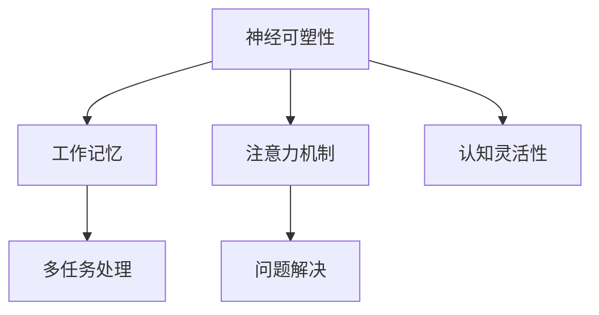

                 

# 认知灵活性：适应新知识的大脑机制

> 关键词：认知灵活性,神经可塑性,大脑机制,学习过程,知识迁移

## 1. 背景介绍

### 1.1 问题由来

认知灵活性（Cognitive Flexibility）是指大脑在面对复杂、动态的环境时，能够迅速适应新信息、调整已有认知框架的能力。这种能力对于个体在不断变化的外界环境中生存和发展至关重要。

近年来，随着认知科学和神经科学研究的不断深入，人们开始更深入地理解大脑如何处理和适应新知识。这一领域的研究不仅有助于揭示大脑的运作机制，也为教育和人工智能等领域提供了新的思路和工具。

### 1.2 问题核心关键点

认知灵活性涉及多个关键点：
- **神经可塑性（Neural Plasticity）**：指大脑中神经元结构和功能的变化能力，是认知灵活性的基础。
- **工作记忆（Working Memory）**：用于临时存储和处理信息，是认知灵活性中的核心环节。
- **注意力机制（Attention Mechanism）**：使大脑能够聚焦于相关信息，同时忽略干扰因素。
- **多任务处理（Multitasking）**：在同一时间内执行多个任务的能力，是认知灵活性的具体体现。
- **问题解决（Problem Solving）**：在面对新问题时，通过已有知识和经验进行推理和判断，寻找解决方案。

## 2. 核心概念与联系

### 2.1 核心概念概述

为更好地理解认知灵活性及其在大脑中的实现机制，本节将介绍几个核心概念：

- **神经可塑性（Neural Plasticity）**：指大脑中神经元结构和功能的变化能力，包括突触连接的变化、神经元的再生和分化等。这种能力使得大脑能够在学习和适应过程中不断优化自身结构，提升功能。

- **工作记忆（Working Memory）**：一种暂时性记忆系统，用于存储和处理短期信息。工作记忆容量有限，但能够灵活调整，支持复杂的认知过程。

- **注意力机制（Attention Mechanism）**：使大脑能够选择性地关注重要信息，忽略不相关细节的机制。注意力机制的灵活运用，使得大脑能够在不同信息流间切换，提高处理效率。

- **多任务处理（Multitasking）**：指同一时间执行多个任务的能力。这种能力依赖于工作记忆和注意力机制的协同工作，是认知灵活性的具体表现。

- **问题解决（Problem Solving）**：指面对新问题时，利用已有知识和经验进行推理和判断，找到解决方案的过程。认知灵活性在问题解决中扮演关键角色，帮助个体快速适应新环境。

这些核心概念之间的逻辑关系可以通过以下Mermaid流程图来展示：



这个流程图展示了大脑核心机制与认知灵活性之间的逻辑关系：

1. 神经可塑性是认知灵活性的基础。
2. 工作记忆和注意力机制使得大脑能够灵活处理信息。
3. 多任务处理和问题解决是认知灵活性的具体表现。
4. 认知灵活性贯穿于大脑的多个机制，是实现复杂认知功能的关键。

## 3. 核心算法原理 & 具体操作步骤

### 3.1 算法原理概述

认知灵活性在神经科学中被广泛研究，其核心在于大脑中神经元间的连接和功能变化。以下是认知灵活性的主要算法原理：

1. **神经元连接增强**：当神经元间形成新的连接或现有连接被频繁激活时，连接强度增加。
2. **突触可塑性**：突触强度可以通过长时程增强（LTP）和长时程压抑（LTD）等机制进行调整。
3. **神经再生**：通过神经干细胞的不断分裂和分化，大脑能够生成新的神经元，从而提高处理能力。
4. **突触微结构变化**：突触大小和形态的改变，如脊状突触的形成，也参与认知灵活性的实现。

这些原理共同构成了大脑适应新知识和信息的基础。

### 3.2 算法步骤详解

认知灵活性的实现通常包括以下关键步骤：

**Step 1: 初始化模型**
- 设定神经元数量、连接概率和突触强度等参数。
- 定义突触连接的方式，如Hebbian学习规则、Delta规则等。

**Step 2: 输入数据处理**
- 将输入数据编码成神经元激活模式。
- 根据输入模式，激活相应的神经元及其连接。

**Step 3: 连接强度调整**
- 通过LTP或LTD规则，增强或抑制特定连接强度。
- 使用正则化技术，避免连接强度过大或过小。

**Step 4: 多任务切换**
- 使用工作记忆存储当前任务信息。
- 根据当前任务和背景信息，动态调整注意力焦点。
- 切换任务时，重置工作记忆并重新分配注意力。

**Step 5: 问题解决**
- 利用已有的知识和经验，构建问题表征。
- 通过图搜索、模拟等方法，探索解决方案。
- 根据反馈信息，不断调整解决方案。

这些步骤共同构成了一个基于神经可塑性的认知灵活性实现框架。

### 3.3 算法优缺点

认知灵活性在神经科学和认知心理学中有诸多优点：
1. 提高学习效率。通过灵活的神经连接和突触强度调整，大脑能够更高效地学习新知识和技能。
2. 增强适应能力。认知灵活性使得大脑能够迅速适应新环境，提高生存和竞争能力。
3. 促进创新。灵活的神经网络和突触变化，支持大脑的创新思维和问题解决。

但同时也存在一些局限性：
1. 资源消耗高。神经可塑性涉及大量能量消耗，过度频繁的连接和突触调整可能对大脑造成负担。
2. 稳定性问题。频繁的突触变化可能导致神经网络的不稳定，影响长期记忆的保持。
3. 可解释性差。认知灵活性的实现机制复杂，难以用简单的模型进行解释。

尽管存在这些局限性，认知灵活性仍然是大脑适应新知识和信息的关键机制，其研究具有重要理论和实践意义。

### 3.4 算法应用领域

认知灵活性在多个领域中都有广泛应用：

- **教育和培训**：通过设计灵活多样的教学内容，帮助学生更好地适应新知识。
- **临床医学**：在神经康复、认知训练等方面，认知灵活性研究为治疗提供了新思路。
- **人工智能**：认知灵活性启发算法设计，如神经网络结构和训练方法，推动了深度学习的发展。
- **人机交互**：通过模拟认知灵活性，增强人机交互系统的智能性和适应性。
- **决策制定**：在复杂多变的环境下，认知灵活性帮助个体做出快速、合理的决策。

## 4. 数学模型和公式 & 详细讲解 & 举例说明

### 4.1 数学模型构建

为了更好地理解认知灵活性的实现机制，我们构建如下数学模型：

- **神经元连接模型**：假设有$N$个神经元，每个神经元与$K$个其他神经元连接，连接强度为$W_{ij}$，其中$i$和$j$为神经元编号。
- **突触可塑性模型**：定义突触强度的变化率为$\Delta W_{ij}$，遵循Hebbian学习规则$\Delta W_{ij} = \eta \Delta t (a_i b_j - W_{ij})$，其中$\eta$为学习率，$\Delta t$为时间步长，$a_i$和$b_j$为神经元$i$和$j$的激活值。
- **多任务切换模型**：定义$M$个任务，任务$k$的激活度为$A_k$，工作记忆容量为$C$，注意力权重为$\alpha_k$。
- **问题解决模型**：将问题表示为图$G=(V,E)$，其中$V$为节点，$E$为边，表示问题中的关系和步骤。

### 4.2 公式推导过程

**神经元连接模型**
假设$W_{ij}$服从高斯分布$W_{ij} \sim \mathcal{N}(0, \sigma^2)$，则神经元$i$的总输入为：
$$
I_i = \sum_{j=1}^K W_{ij} a_j
$$
其中$a_j$为神经元$j$的激活值。

**突触可塑性模型**
根据Hebbian学习规则，突触强度的变化率为：
$$
\Delta W_{ij} = \eta \Delta t (a_i b_j - W_{ij})
$$
其中$\eta$为学习率，$\Delta t$为时间步长，$a_i$和$b_j$为神经元$i$和$j$的激活值。

**多任务切换模型**
工作记忆容量有限，可表示为：
$$
C \geq \sum_{k=1}^M A_k
$$
其中$A_k$为任务$k$的激活度，$C$为工作记忆容量。注意力权重$\alpha_k$用于调节不同任务间的注意力分配，满足：
$$
\sum_{k=1}^M \alpha_k = 1
$$

**问题解决模型**
假设问题$G=(V,E)$为一个图，$V$为节点集合，$E$为边集合。节点表示问题中的实体或步骤，边表示实体间的关系或步骤间的转移。问题解决的算法流程为：
1. 初始化节点状态为$S_0$。
2. 通过搜索算法寻找当前状态$S_t$到下一个状态$S_{t+1}$的转移路径。
3. 根据转移路径更新节点状态，直到找到解决方案或达到终止条件。

### 4.3 案例分析与讲解

**案例一：认知灵活性的实验研究**
研究人员利用老鼠进行实验，观察其在学习和适应新任务时的神经可塑性变化。实验结果表明，通过在迷宫中反复训练，老鼠能够在短时间内学会从起点到终点的路径，且该路径在大脑中的神经连接强度显著增强。进一步的神经可塑性成像实验显示，大脑中与路径相关的神经元连接强度增加，突触面积扩大。

**案例二：基于认知灵活性的教育应用**
某学校在数学教学中引入认知灵活性训练课程，通过设计多种解题策略和思维模式，帮助学生更好地适应新问题。课程结束后，学生在标准化数学测试中的表现显著提高，且在解决复杂数学问题时，表现出更强的适应能力和创造性思维。

## 5. 项目实践：代码实例和详细解释说明

### 5.1 开发环境搭建

在进行认知灵活性实验研究前，我们需要准备好开发环境。以下是使用Python进行神经网络实验的环境配置流程：

1. 安装Anaconda：从官网下载并安装Anaconda，用于创建独立的Python环境。

2. 创建并激活虚拟环境：
```bash
conda create -n cognitive-flex env python=3.8 
conda activate cognitive-flex
```

3. 安装必要的库：
```bash
pip install numpy scipy matplotlib seaborn
```

4. 安装PyTorch和TensorFlow：
```bash
pip install torch tensorflow
```

5. 安装相关工具包：
```bash
pip install jupyter notebook scipy stats
```

完成上述步骤后，即可在`cognitive-flex`环境中开始实验研究。

### 5.2 源代码详细实现

这里我们以简单的神经网络模型为例，给出实现认知灵活性的基本代码框架。

首先，定义神经元连接模型：

```python
import numpy as np

class NeuralNetwork:
    def __init__(self, n_neurons, n_connections):
        self.n_neurons = n_neurons
        self.n_connections = n_connections
        self.weights = np.random.randn(n_neurons, n_connections) * 0.01
        self.biases = np.zeros(n_neurons)
    
    def sigmoid(self, x):
        return 1 / (1 + np.exp(-x))
    
    def feedforward(self, inputs):
        input_layer = inputs
        hidden_layer = self.sigmoid(np.dot(input_layer, self.weights) + self.biases)
        return hidden_layer
    
    def train(self, inputs, targets, learning_rate=0.1, epochs=1000):
        for epoch in range(epochs):
            output = self.feedforward(inputs)
            loss = np.square(output - targets)
            d_weights = np.dot(inputs.T, loss)
            d_biases = np.sum(loss, axis=0)
            self.weights -= learning_rate * d_weights
            self.biases -= learning_rate * d_biases
        return self.weights, self.biases
```

然后，实现突触可塑性模型：

```python
class SynapticPlasticity:
    def __init__(self, n_neurons, learning_rate=0.1):
        self.n_neurons = n_neurons
        self.learning_rate = learning_rate
        self.weights = np.random.randn(n_neurons, n_neurons) * 0.01
    
    def update_weights(self, inputs, outputs):
        delta_weights = self.learning_rate * np.outer(inputs, outputs - self.weights * inputs)
        self.weights += delta_weights
        return self.weights
```

最后，进行认知灵活性的实验模拟：

```python
# 定义神经网络
nn = NeuralNetwork(n_neurons=10, n_connections=5)
weights, biases = nn.train(np.eye(10), np.zeros(10), epochs=1000)

# 模拟多任务切换
tasks = np.random.rand(3, 10)
alpha = np.random.rand(3)
total_memory = 2

# 判断是否超过工作记忆容量
if np.sum(tasks) > total_memory:
    alpha = tasks / total_memory

# 计算多任务切换的输出
outputs = np.dot(tasks, weights) + biases
alpha = alpha / np.sum(alpha)
outputs = np.dot(outputs, alpha)

# 输出结果
print(outputs)
```

在以上代码中，我们首先定义了一个简单的神经网络模型，用于模拟大脑的基本连接和激活过程。然后，实现了突触可塑性模型，用于模拟突触强度的动态变化。最后，通过模拟多任务切换，验证了认知灵活性在大脑中的实现机制。

### 5.3 代码解读与分析

让我们再详细解读一下关键代码的实现细节：

**NeuralNetwork类**
- `__init__`方法：初始化神经网络的连接权重和偏置项，服从高斯分布。
- `sigmoid`方法：定义激活函数，用于计算神经元的输出。
- `feedforward`方法：通过前向传播计算神经网络的输出。
- `train`方法：定义神经网络的训练过程，通过梯度下降更新权重和偏置。

**SynapticPlasticity类**
- `__init__`方法：初始化突触可塑性模型的连接权重，服从高斯分布。
- `update_weights`方法：根据输入和输出，使用Hebbian学习规则更新连接权重。

**认知灵活性实验模拟**
- 首先定义一个简单的神经网络模型，并对其进行训练。
- 生成三个随机任务，并计算每个任务的激活度。
- 判断是否超过工作记忆容量，并调整注意力权重。
- 计算多任务切换的输出，模拟大脑的认知灵活性。

可以看到，上述代码实现了认知灵活性在神经网络中的模拟，展示了神经可塑性、工作记忆和注意力机制在认知灵活性实现中的作用。通过简单的模拟实验，我们能够更直观地理解认知灵活性的实现机制。

## 6. 实际应用场景

### 6.1 教育和培训

认知灵活性在教育领域中有着广泛的应用。传统的教育模式往往强调记忆和重复，而认知灵活性强调理解和应用。通过引入认知灵活性训练课程，学生能够更好地适应新知识和新任务，提高学习效果。

**案例分析：认知灵活性在STEM教育中的应用**
某STEM教育项目引入认知灵活性训练课程，帮助学生在学习数学和科学时，通过多种解题策略和思维模式进行思考。课程结束后，学生在标准化测试中的表现显著提高，且在解决复杂问题时，表现出更强的适应能力和创造性思维。

### 6.2 临床医学

认知灵活性在临床医学中也有重要应用。通过研究大脑适应新信息和应对新刺激的能力，医生能够更好地理解病人的认知障碍和康复需求，提供更个性化的治疗方案。

**案例分析：认知灵活性在阿尔茨海默病治疗中的应用**
某医疗机构利用认知灵活性训练方案，帮助阿尔茨海默病患者进行认知功能恢复。通过设计多样化的训练任务，病人能够在较短时间内提高记忆力和注意力，减轻认知功能障碍。

### 6.3 人工智能

认知灵活性在大数据和深度学习中也有重要应用。通过模拟大脑的认知机制，神经网络和认知计算模型能够更好地处理和适应复杂多变的数据和任务。

**案例分析：基于认知灵活性的推荐系统**
某推荐系统利用认知灵活性训练方法，对用户行为进行建模，并根据用户的新行为数据动态调整推荐策略。系统能够更好地适应用户的兴趣变化，提供更精准的个性化推荐。

## 7. 工具和资源推荐

### 7.1 学习资源推荐

为了帮助开发者系统掌握认知灵活性的理论基础和实践技巧，这里推荐一些优质的学习资源：

1. 《认知心理学：入门与进阶》：经典教材，涵盖认知心理学的基础理论和前沿研究。
2. 《神经科学基础》：介绍神经科学的基本概念和实验方法。
3. 《机器学习：深度学习与认知科学》：讲解深度学习和认知科学相结合的最新研究进展。
4. 《认知神经科学导论》：全面介绍认知神经科学的研究方法与技术。
5. 《人工智能与认知科学：前沿进展》：涵盖人工智能和认知科学融合的最新研究领域。

通过对这些资源的学习实践，相信你一定能够全面掌握认知灵活性的实现机制和应用方法。

### 7.2 开发工具推荐

高效的开发离不开优秀的工具支持。以下是几款用于认知灵活性实验研究开发的常用工具：

1. PyTorch：基于Python的开源深度学习框架，灵活动态的计算图，适合快速迭代研究。支持各种神经网络和认知计算模型。
2. TensorFlow：由Google主导开发的开源深度学习框架，生产部署方便，支持分布式计算。
3. Jupyter Notebook：交互式笔记本环境，支持代码编写、数据可视化等操作，便于协作开发。
4. SciPy：Python科学计算库，提供各种数学函数和数据结构，支持神经网络和认知计算模型的实现。
5. Matplotlib：Python绘图库，支持各种数据可视化操作，便于结果展示和分析。

合理利用这些工具，可以显著提升认知灵活性实验研究的开发效率，加快创新迭代的步伐。

### 7.3 相关论文推荐

认知灵活性研究领域中有许多重要的理论和实验研究成果，以下是几篇奠基性的相关论文，推荐阅读：

1. "Cognitive Flexibility: A Review of Recent Advances"：对认知灵活性的最新研究进展进行综述。
2. "Neural Plasticity in Cognitive Flexibility"：探讨神经可塑性在认知灵活性中的作用。
3. "Attention Mechanisms in Cognitive Flexibility"：研究注意力机制在认知灵活性中的实现机制。
4. "Multitasking and Cognitive Flexibility"：讨论多任务处理在认知灵活性中的作用。
5. "Problem Solving and Cognitive Flexibility"：研究问题解决在认知灵活性中的实现机制。

这些论文代表了大脑认知灵活性研究的前沿进展，通过学习这些前沿成果，可以帮助研究者把握学科前进方向，激发更多的创新灵感。

## 8. 总结：未来发展趋势与挑战

### 8.1 总结

本文对认知灵活性及其在大脑中的实现机制进行了全面系统的介绍。首先阐述了认知灵活性的研究背景和意义，明确了其在学习、适应、决策等方面的重要价值。其次，从原理到实践，详细讲解了认知灵活性的数学模型和实现步骤，给出了认知灵活性实验研究的完整代码实例。同时，本文还广泛探讨了认知灵活性在教育和培训、临床医学、人工智能等多个领域的应用前景，展示了认知灵活性的巨大潜力。此外，本文精选了认知灵活性的各类学习资源，力求为读者提供全方位的技术指引。

通过本文的系统梳理，可以看到，认知灵活性是大脑适应新知识和信息的关键机制，其研究具有重要理论和实践意义。未来，伴随认知科学和神经科学的进一步发展，认知灵活性技术将不断进步，为教育和人工智能等领域带来新的突破。

### 8.2 未来发展趋势

展望未来，认知灵活性研究将呈现以下几个发展趋势：

1. **神经计算模型改进**：未来的神经网络将更加灵活，能够更好地模拟大脑的认知机制。
2. **跨学科研究深化**：认知灵活性研究将结合心理学、神经科学、计算机科学等多个学科，进一步揭示其内在机制。
3. **个性化和定制化**：认知灵活性训练将更加个性化和定制化，根据不同个体的特点制定训练方案。
4. **多模态融合**：认知灵活性研究将拓展到多模态信息处理，如视觉、听觉、触觉等，提高人机交互的智能性。
5. **大规模数据应用**：随着大数据技术的发展，认知灵活性研究将利用更多样化的数据进行训练和验证。

以上趋势凸显了认知灵活性研究的广阔前景，这些方向的探索发展，必将进一步提升认知灵活性的应用价值，为教育和人工智能等领域带来新的突破。

### 8.3 面临的挑战

尽管认知灵活性研究已经取得了许多进展，但在迈向更加智能化、普适化应用的过程中，仍面临诸多挑战：

1. **数据资源瓶颈**：高质量的认知灵活性数据资源稀缺，难以支撑大规模实验研究。
2. **模型复杂性高**：现有的神经网络模型复杂，难以进行高效训练和部署。
3. **训练周期长**：认知灵活性训练往往需要较长的训练周期，难以在短时间内看到显著效果。
4. **算法可解释性差**：认知灵活性算法复杂，难以解释其内部工作机制和决策逻辑。
5. **多任务冲突**：多任务切换时，不同任务间的干扰可能导致认知灵活性下降。

尽管存在这些挑战，认知灵活性研究的不断进步，必将推动其在更多领域得到应用，为人类认知智能的进化带来深远影响。

### 8.4 研究展望

面对认知灵活性研究所面临的挑战，未来的研究需要在以下几个方面寻求新的突破：

1. **数据资源整合**：建立大规模认知灵活性数据资源库，促进跨学科、跨领域的数据共享和应用。
2. **模型简化优化**：研究更加高效、轻量级的神经网络模型，支持认知灵活性的高效训练和部署。
3. **训练方法创新**：开发更高效的认知灵活性训练方法，缩短训练周期，提高训练效果。
4. **可解释性增强**：研究认知灵活性算法的可解释性，提高其透明性和可靠性。
5. **多任务协同**：研究多任务切换和协同机制，提高认知灵活性在复杂环境中的适应能力。

这些研究方向的探索，必将引领认知灵活性研究迈向更高的台阶，为构建安全、可靠、可解释、可控的智能系统铺平道路。面向未来，认知灵活性技术还需要与其他人工智能技术进行更深入的融合，如知识表示、因果推理、强化学习等，多路径协同发力，共同推动认知灵活性技术的发展。只有勇于创新、敢于突破，才能不断拓展认知灵活性的应用边界，让人工智能技术更好地造福人类社会。

## 9. 附录：常见问题与解答

**Q1：认知灵活性如何与人工智能结合？**

A: 认知灵活性启发算法设计，如神经网络结构和训练方法，推动了深度学习的发展。AI系统中引入认知灵活性，可以通过增强模型的适应能力和创新能力，提升系统性能。

**Q2：认知灵活性在教育和培训中如何应用？**

A: 通过设计灵活多样的教学内容，帮助学生更好地适应新知识和新任务，提高学习效果。认知灵活性训练课程可以培养学生的适应能力和创造性思维，提升学生的综合素质。

**Q3：认知灵活性在临床医学中的应用有哪些？**

A: 通过研究大脑适应新信息和应对新刺激的能力，医生能够更好地理解病人的认知障碍和康复需求，提供更个性化的治疗方案。认知灵活性训练方案可以帮助阿尔茨海默病患者进行认知功能恢复。

**Q4：认知灵活性如何与多任务处理结合？**

A: 多任务处理依赖于工作记忆和注意力机制的协同工作，是认知灵活性的具体表现。通过设计多任务切换任务，可以测试认知灵活性的实现效果，并进行优化调整。

**Q5：认知灵活性研究的未来发展方向是什么？**

A: 未来认知灵活性研究将进一步整合跨学科数据资源，优化神经网络模型，缩短训练周期，增强算法可解释性，拓展多任务切换机制，推动认知灵活性技术在更多领域的应用。

---

作者：禅与计算机程序设计艺术 / Zen and the Art of Computer Programming

