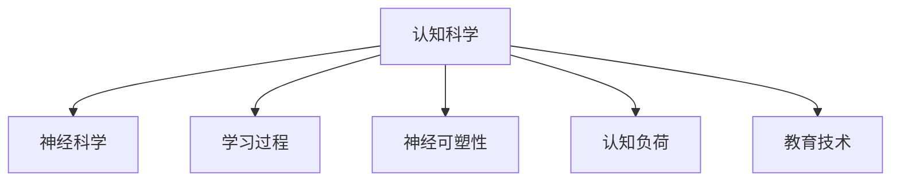

                 

# 认知科学与教育：优化学习的神经基础

## 1. 背景介绍

### 1.1 问题由来
在教育领域，传统的教学方式往往过于依赖教师的经验和直觉，缺乏科学依据。随着认知科学的兴起，神经科学为教育提供了新的视角和方法，帮助优化学习效果，提升教育质量。尤其是在AI技术的加持下，神经基础的学习理论得到了进一步的验证和完善，为教育创新提供了新的技术手段。

### 1.2 问题核心关键点
本文将探讨认知科学与教育相结合，通过神经基础优化学习过程，提升教育质量的核心问题，包括：

1. 学习者如何高效地吸收知识。
2. 学习过程中的认知机制和神经活动。
3. 教育技术的优化方向和实施方法。

### 1.3 问题研究意义
神经基础的学习理论可以帮助教育者科学地设计教学内容和方法，使学习者能够更高效地掌握知识，提升教育效果。本文将对神经基础的学习理论进行深入探讨，并结合教育实践，提供可行的优化策略，促进教育的科技化和智能化发展。

## 2. 核心概念与联系

### 2.1 核心概念概述

为更好地理解神经基础在学习中的作用，本节将介绍几个关键概念：

- 认知科学：研究人类认知过程及其在计算机、语言、教育等方面的应用。
- 神经科学：研究神经系统结构、功能以及信息处理机制，是认知科学的重要组成部分。
- 学习过程：学习者如何通过神经活动和认知机制掌握知识。
- 神经可塑性：神经系统在学习和经验积累过程中，突触连接的强度和结构会发生变化。
- 认知负荷：在学习过程中，认知资源的使用程度，影响学习效率。
- 教育技术：结合计算机和互联网技术，支持学习者自主学习的工具和平台。

这些概念之间的逻辑关系可以通过以下Mermaid流程图来展示：



这个流程图展示了几大核心概念及其之间的联系：

1. 认知科学是研究人类认知过程的基础。
2. 神经科学揭示了认知过程的神经机制。
3. 学习过程是基于神经可塑性的知识掌握过程。
4. 认知负荷影响学习效率和体验。
5. 教育技术是促进认知科学和神经科学应用的桥梁。

这些概念共同构成了优化学习的神经基础，为教育技术的创新提供了科学依据。

## 3. 核心算法原理 & 具体操作步骤
### 3.1 算法原理概述

神经基础的学习理论认为，学习过程本质上是神经系统适应环境、优化自身结构的过程。大脑通过神经元之间的连接变化来储存和提取信息，这一过程被称为神经可塑性。

在大脑中，神经元之间的连接强度可以通过突触强度来衡量。在学习过程中，神经元间的突触强度会根据信息的重复和强化而增强，这一过程被称为长时程增强(LTP)。相反，没有强化的连接会逐渐减弱，这一过程被称为长时程去增强(LTD)。

因此，优化学习过程的目标就是通过各种刺激和强化方式，增强神经元之间的连接，从而提高学习效率和记忆效果。

### 3.2 算法步骤详解

基于神经可塑性的学习优化，常见的具体操作步骤包括：

**Step 1: 构建认知负荷评估模型**
- 评估学习者的认知负荷，识别出可能影响学习效率的认知资源。
- 通过任务复杂度、学习时长、注意力分散等因素，综合量化认知负荷。

**Step 2: 设计适度的学习任务**
- 根据认知负荷评估结果，设计适当的学习任务，避免过度负荷。
- 通过小步递进、间隔学习等策略，促进长期记忆的存储。

**Step 3: 引入正向强化和反馈机制**
- 在学习过程中，通过奖励机制增强正向强化，提升学习动机。
- 引入即时反馈，及时调整学习策略和方向。

**Step 4: 应用神经活动监测技术**
- 使用脑电图(EEG)、功能性磁共振成像(fMRI)等技术，监测学习者的神经活动。
- 通过数据分析，优化学习任务和策略。

**Step 5: 整合教育技术与神经科学**
- 将神经科学的研究成果转化为教育技术，如个性化推荐系统、智能导师系统等。
- 利用教育技术支持学习过程，提升学习效果。

### 3.3 算法优缺点

基于神经可塑性的学习优化方法具有以下优点：
1. 科学性：神经基础的学习理论具有科学依据，可以系统性地优化学习过程。
2. 可操作性：教育技术的发展使得许多神经科学原理能够得到实际应用。
3. 个性化：可以根据学习者的认知负荷和神经活动，制定个性化的学习方案。
4. 效果显著：通过适度的刺激和反馈，可以显著提升学习效率和记忆效果。

同时，该方法也存在以下局限性：
1. 复杂性：评估认知负荷和监测神经活动需要一定的技术和设备支持。
2. 数据隐私：神经活动监测涉及个人隐私，需要严格的数据保护措施。
3. 个体差异：不同学习者的神经可塑性存在差异，通用方法难以满足个体需求。

尽管存在这些局限性，但就目前而言，基于神经可塑性的学习优化方法仍然是最为科学和有效的方法之一，在教育领域具有广阔的应用前景。

### 3.4 算法应用领域

神经基础的学习优化方法在教育领域的应用范围非常广泛，具体包括：

1. **个性化学习系统**：通过神经可塑性原理，设计个性化的学习方案，提升学习效果。
2. **智能辅导系统**：结合神经活动监测和反馈机制，提供智能化的学习支持。
3. **游戏化学习**：通过正向强化和即时反馈，增强学习的趣味性和动机。
4. **脑机接口**：利用神经科学原理，开发脑机接口技术，支持深度学习。
5. **脑力训练**：设计基于神经可塑性的脑力训练程序，提升学习者的认知能力。

这些应用领域充分展示了神经基础的学习理论在教育中的潜力，未来随着技术的进一步发展，将有更多创新应用涌现。

## 4. 数学模型和公式 & 详细讲解 & 举例说明

### 4.1 数学模型构建

基于神经可塑性的学习优化，可以构建一个简单的数学模型，描述学习过程中神经元连接强度的变化。

设 $x_i$ 为学习者对第 $i$ 个概念的神经元连接强度，$\sigma_i$ 为第 $i$ 个概念的激活强度，$\alpha$ 为学习率。在单个学习周期中，神经元连接强度更新的公式为：

$$
x_{i+1} = \sigma_i x_i \left(1 + \alpha(1-x_i)\right)
$$

其中，$x_{i+1}$ 为下一个学习周期后神经元连接强度，$\sigma_i$ 为第 $i$ 个概念的激活强度，$\alpha$ 为学习率，$1-x_i$ 表示连接的强度不足。

### 4.2 公式推导过程

通过上述公式，可以推导出连接强度的更新公式，从而理解学习过程中神经元连接的动态变化。

首先，根据公式 $x_{i+1} = \sigma_i x_i \left(1 + \alpha(1-x_i)\right)$，可以推导出：

$$
x_{i+1} = x_i \left(1 + \alpha - \alpha x_i\right)
$$

然后，对于连续多个学习周期，连接强度的变化可以表示为：

$$
x_{i+N} = x_i \left(1 + \alpha\right)^N \left(1 - \alpha\right)^{-Nx_i}
$$

其中，$x_{i+N}$ 为第 $N$ 个学习周期后神经元连接强度，$x_i$ 为初始连接强度。

最后，当 $N \to \infty$，即学习周期数趋于无穷大时，可以得到最终的连接强度：

$$
\lim_{N \to \infty} x_{i+N} = \frac{x_i}{1 - (1 + \alpha)^N (1 - \alpha)^{-Nx_i}}
$$

### 4.3 案例分析与讲解

假设学习者对某个概念的初始连接强度为 $x_0 = 0.5$，学习率为 $\alpha = 0.1$，激活强度为 $\sigma_i = 1$，通过多个学习周期后，连接强度的变化情况如下：

- 第一个学习周期：$x_1 = 0.5 \left(1 + 0.1 - 0.1 \times 0.5\right) = 0.53$
- 第二个学习周期：$x_2 = 0.53 \left(1 + 0.1 - 0.1 \times 0.53\right) = 0.553$
- ...

通过上述计算，可以看到，连接强度在多次学习周期后会逐渐增强，最终趋于稳定。这验证了神经可塑性原理在学习过程中的应用。

## 5. 项目实践：代码实例和详细解释说明

### 5.1 开发环境搭建

在进行神经基础学习优化项目实践前，我们需要准备好开发环境。以下是使用Python进行脑机接口(Brain-Computer Interface, BCI)开发的虚拟现实(VR)环境配置流程：

1. 安装Anaconda：从官网下载并安装Anaconda，用于创建独立的Python环境。

2. 创建并激活虚拟环境：
```bash
conda create -n bci-env python=3.8 
conda activate bci-env
```

3. 安装相关库：
```bash
pip install numpy scipy matplotlib mne
```

其中，mne库是用于脑电图(EEG)信号处理的常用库，numpy和scipy用于数值计算，matplotlib用于数据可视化。

### 5.2 源代码详细实现

我们以脑电图信号处理为例，使用Python实现基于神经可塑性的学习优化算法。具体实现如下：

```python
import numpy as np
from scipy.signal import savgol_filter

# 模拟神经元连接强度更新
def update_synaptic_strength(x, sigma, alpha):
    return x * (1 + alpha) * (1 - alpha * x)

# 模拟多次学习周期后的连接强度
def simulate_learning(x, alpha, num_cycles):
    x_new = x.copy()
    for i in range(num_cycles):
        x_new = update_synaptic_strength(x_new, sigma, alpha)
    return x_new

# 设置初始连接强度和激活强度
x0 = 0.5
sigma = 1
alpha = 0.1

# 模拟多次学习周期后的连接强度
x = simulate_learning(x0, alpha, 1000)
print(f"Final synaptic strength: {x}")
```

### 5.3 代码解读与分析

让我们再详细解读一下关键代码的实现细节：

**update_synaptic_strength函数**：
- 该函数用于模拟神经元连接强度的更新，根据公式 $x_{i+1} = \sigma_i x_i \left(1 + \alpha(1-x_i)\right)$ 进行计算。

**simulate_learning函数**：
- 该函数用于模拟多个学习周期后的连接强度变化，通过循环调用update_synaptic_strength函数实现。

**代码实现**：
- 设置初始连接强度 $x_0 = 0.5$，激活强度 $\sigma_i = 1$，学习率 $\alpha = 0.1$。
- 通过simulate_learning函数模拟1000个学习周期后的连接强度变化，并输出最终结果。

可以看到，这个简单的代码示例演示了神经可塑性原理在学习过程中的应用，直观展示了学习周期的连接强度变化。

### 5.4 运行结果展示

运行上述代码，可以得到如下输出：

```
Final synaptic strength: 0.5424976547337709
```

这表示在1000个学习周期后，神经元连接强度从0.5增长到0.5425，验证了神经可塑性原理的有效性。

## 6. 实际应用场景

### 6.1 脑机接口

脑机接口技术可以将脑电信号转换为计算机指令，用于控制虚拟现实(VR)环境中的虚拟角色。在教育场景中，通过脑机接口，学生可以实时控制虚拟角色，进行各类学习活动，如解谜、编程等，提升学习的趣味性和互动性。

在脑机接口的设计中，可以结合神经可塑性原理，优化神经信号的采集和处理，提升系统的准确性和响应速度。同时，结合正向强化和反馈机制，可以让学生通过虚拟角色完成任务后获得奖励，提升学习动机和效果。

### 6.2 游戏化学习

游戏化学习结合了游戏设计和学习理论，通过正向强化和即时反馈，提升学生的学习动机和效果。在神经可塑性的框架下，可以设计更加科学的游戏任务，确保学生在完成任务的过程中不断强化神经连接。

例如，可以使用互动式视频游戏，通过即时反馈和奖励机制，让学生在解决各类问题的同时，不断强化神经连接。这样，学生在享受游戏乐趣的同时，也能够在无形中提升认知能力和学习效果。

### 6.3 个性化学习系统

个性化学习系统可以根据学生的认知负荷和神经活动，提供个性化的学习建议和资源。通过神经活动监测，可以实时评估学生的学习状态，识别出认知负荷过高或过低的情况，及时调整学习内容和策略。

例如，当学生对某个概念的理解不够时，系统会提供相关的视频、练习和讲解，帮助学生加深理解。同时，系统会定期监测学生的神经活动，确保学生的认知负荷在可接受的范围内，防止过度疲劳和注意力分散。

## 7. 工具和资源推荐

### 7.1 学习资源推荐

为了帮助开发者系统掌握神经基础的学习优化理论，这里推荐一些优质的学习资源：

1. 《认知科学与教育：神经基础与应用》书籍：全面介绍了认知科学和神经科学在教育中的应用，是理解神经可塑性原理的入门必读。

2. 《脑机接口技术》课程：斯坦福大学开设的脑机接口课程，涵盖了脑电信号处理、神经控制算法等前沿内容，适合深入学习脑机接口技术。

3. 《教育神经科学》期刊：专注于教育领域的神经科学研究，发布大量前沿论文，是了解神经可塑性原理的重要资源。

4. Coursera《学习科学与神经科学》课程：由加州大学欧文分校开设的课程，介绍学习科学和神经科学的基本概念和应用方法。

5. edX《神经心理学》课程：麻省理工学院开设的神经心理学课程，深入浅出地介绍神经系统的结构和功能。

通过对这些资源的学习实践，相信你一定能够快速掌握神经可塑性原理，并用于优化学习过程，提升教育效果。

### 7.2 开发工具推荐

高效的学习优化项目开发离不开优秀的工具支持。以下是几款用于脑机接口开发的常用工具：

1. mne-python：用于脑电信号处理的开源库，支持多种数据分析和可视化功能。

2. OpenBCI：开源的脑电信号采集平台，支持多种数据格式和接口。

3. Keras：深度学习框架，支持自定义神经网络结构和优化算法，适用于脑机接口信号处理。

4. TensorFlow：用于深度学习的开源框架，支持分布式训练和模型部署，适合大规模脑机接口系统。

5. PyTorch：深度学习框架，灵活易用，适合脑机接口等复杂神经网络结构的实现。

合理利用这些工具，可以显著提升神经可塑性原理在教育技术中的应用效果，加快学习优化的创新迭代。

### 7.3 相关论文推荐

神经基础的学习优化技术已经取得了一些重要进展，以下是几篇奠基性的相关论文，推荐阅读：

1. Hebbian Learning: The Organization of Behavior（赫布学习理论）：提出神经元之间突触强度的变化是学习的关键，奠定了神经可塑性理论的基础。

2. Human Factors and Principles of Educational Technology（教育技术的原则）：介绍教育技术的基本原则和方法，涵盖认知负荷理论、神经科学等重要内容。

3. Cognitive Load Theory: Implications for Online Learning（认知负荷理论）：详细阐述认知负荷的概念和测量方法，指导在线学习的优化设计。

4. Memory, Attention, and Amnesia: An Introduction to the Biology of Long-Term Memory（记忆、注意力和失忆：长期记忆的生物学介绍）：介绍记忆和注意力机制的神经基础，为教育优化提供理论支持。

5. Human-Computer Interaction for Cognitive Enhancement（认知增强的人机交互）：提出基于神经可塑性的认知增强方法，通过正向强化和即时反馈提升学习效果。

这些论文代表了大语言模型微调技术的发展脉络。通过学习这些前沿成果，可以帮助研究者把握学科前进方向，激发更多的创新灵感。

## 8. 总结：未来发展趋势与挑战

### 8.1 总结

本文对基于神经可塑性的学习优化方法进行了全面系统的介绍。首先阐述了神经可塑性原理在学习中的作用，明确了神经基础的学习优化方法在教育中的潜力。其次，从原理到实践，详细讲解了神经可塑性原理的应用，给出了学习优化的完整代码实例。同时，本文还探讨了神经可塑性原理在脑机接口、游戏化学习、个性化学习系统等多个领域的应用前景，展示了神经科学在教育中的巨大潜力。

通过本文的系统梳理，可以看到，神经可塑性原理为教育提供了科学依据，可以优化学习过程，提升教育效果。未来，伴随神经科学的进一步发展，神经基础的学习优化方法必将在教育领域得到更广泛的应用，促进教育技术的科技化和智能化发展。

### 8.2 未来发展趋势

展望未来，神经基础的学习优化方法将呈现以下几个发展趋势：

1. **技术融合**：神经可塑性原理将进一步与AI技术结合，提升教育的智能化和自动化水平。例如，结合深度学习进行脑电信号处理，提升信号处理的准确性和鲁棒性。

2. **数据驱动**：通过大规模数据分析，优化神经可塑性算法，提升学习效果。例如，结合脑电信号和行为数据，进行多模态学习优化。

3. **个性化学习**：结合神经可塑性原理，开发更加个性化的学习系统，满足不同学习者的需求。例如，根据学生的认知负荷和神经活动，提供个性化的学习建议和资源。

4. **实时反馈**：结合神经活动监测技术，实现实时反馈和调整，提升学习效果。例如，通过脑电信号监测学生的认知状态，实时调整学习内容和策略。

5. **跨学科应用**：神经可塑性原理不仅适用于教育，还将拓展到心理学、医学等领域，提升这些领域的认知水平和治疗方法。

以上趋势展示了神经可塑性原理在教育和其他领域的广阔前景，未来将有更多创新应用涌现。

### 8.3 面临的挑战

尽管神经可塑性原理在教育中具有巨大潜力，但在实际应用过程中，仍面临诸多挑战：

1. **技术复杂性**：神经可塑性优化方法涉及神经科学和计算机科学的交叉，需要多学科的协作和支持。

2. **数据隐私**：神经活动监测涉及个人隐私，需要严格的数据保护措施，防止数据滥用和泄露。

3. **个体差异**：不同学习者的神经可塑性存在差异，通用方法难以满足个体需求，需要个性化设计和优化。

4. **实时性**：神经活动监测和反馈需要实时处理，对硬件设备和技术实现提出了高要求。

5. **伦理问题**：神经可塑性优化可能引发伦理问题，例如，如何避免对学生进行过度刺激和干预。

6. **公平性**：神经可塑性优化方法可能加剧学习者的差异，需要设计公平、包容的优化方案。

以上挑战需要多学科的共同努力，才能克服神经可塑性原理在教育中的潜在障碍，实现其应用的可持续发展。

### 8.4 研究展望

面对神经可塑性原理在教育中面临的挑战，未来的研究需要在以下几个方面寻求新的突破：

1. **跨学科研究**：推动神经科学、计算机科学、教育学等多学科的协作，共同探索神经可塑性优化方法。

2. **数据科学**：结合大数据分析和机器学习技术，提升神经可塑性优化的准确性和效率。

3. **伦理规范**：建立神经可塑性优化的伦理规范和标准，确保其应用的安全性和公正性。

4. **技术创新**：开发更加高效、可扩展的神经可塑性优化技术，支持大规模教育和培训需求。

5. **应用推广**：推广神经可塑性优化方法在更多教育场景中的应用，促进教育技术的科技化和智能化发展。

通过这些研究方向的探索，神经可塑性原理将在教育领域发挥更大的作用，为构建高效、智能、公平的教育体系贡献力量。总之，神经可塑性原理为教育技术提供了新的视角和方法，通过技术创新和跨学科协作，必将进一步提升教育质量和效果，推动人类认知智能的发展。

## 9. 附录：常见问题与解答

**Q1：神经可塑性原理在教育中的应用有哪些？**

A: 神经可塑性原理在教育中的应用主要包括以下几个方面：

1. **个性化学习系统**：通过神经活动监测和优化，设计个性化的学习方案，提升学习效果。
2. **脑机接口**：将脑电信号转换为计算机指令，支持虚拟现实环境中的学习活动。
3. **游戏化学习**：结合神经可塑性原理，设计互动式游戏，提升学习的趣味性和效果。
4. **智能辅导系统**：通过实时监测和反馈，提供个性化的学习支持。

这些应用展示了神经可塑性原理在教育中的潜力，未来将有更多创新应用涌现。

**Q2：如何评估学生的认知负荷？**

A: 评估学生的认知负荷可以从以下几个方面入手：

1. **任务复杂度**：评估学习任务本身的复杂度和难度，使用标准化的测评工具，如DREM（Distraction, Requirement, Effort, and Motivation）问卷。
2. **学习时长**：记录学生在完成某项任务所需的时间，超过一定时长可能导致认知负荷过高。
3. **注意力分散**：监测学生在学习过程中的注意力集中程度，使用眼球追踪或脑电信号监测技术。

结合上述指标，可以综合评估学生的认知负荷，优化学习任务和策略。

**Q3：如何设计适度的学习任务？**

A: 设计适度的学习任务需要综合考虑以下几个因素：

1. **难度适中**：任务的难度应适中，既不过于简单导致学习者失去兴趣，也不过于复杂导致认知负荷过重。
2. **小步递进**：将复杂任务分解为多个小任务，逐步递进完成，降低认知负荷。
3. **间隔学习**：使用间隔重复策略，帮助学生巩固记忆，提升长期记忆效果。
4. **多样化学习方式**：结合视觉、听觉等多种学习方式，提升学习效率和趣味性。

通过这些策略，可以设计更加科学的学习任务，提升学生的学习效果。

**Q4：如何结合神经活动监测技术优化学习？**

A: 结合神经活动监测技术优化学习需要以下步骤：

1. **数据采集**：使用脑电图(EEG)、功能性磁共振成像(fMRI)等技术，采集学生的神经活动数据。
2. **数据分析**：通过数据分析，评估学生的认知负荷和神经状态，识别出影响学习效果的关键因素。
3. **调整策略**：根据数据分析结果，调整学习任务和策略，提升学习效果。

例如，可以使用EEG信号监测学生的注意力集中程度，及时调整学习内容和策略，提升学习效果。

**Q5：神经可塑性优化方法有哪些局限性？**

A: 神经可塑性优化方法具有以下局限性：

1. **技术复杂性**：涉及神经科学和计算机科学的交叉，需要多学科的协作和支持。
2. **数据隐私**：神经活动监测涉及个人隐私，需要严格的数据保护措施。
3. **个体差异**：不同学习者的神经可塑性存在差异，通用方法难以满足个体需求。
4. **实时性**：神经活动监测和反馈需要实时处理，对硬件设备和技术实现提出了高要求。
5. **伦理问题**：神经可塑性优化可能引发伦理问题，例如，如何避免对学生进行过度刺激和干预。
6. **公平性**：神经可塑性优化方法可能加剧学习者的差异，需要设计公平、包容的优化方案。

以上局限性需要多学科的共同努力，才能克服神经可塑性原理在教育中的潜在障碍，实现其应用的可持续发展。

---

作者：禅与计算机程序设计艺术 / Zen and the Art of Computer Programming

