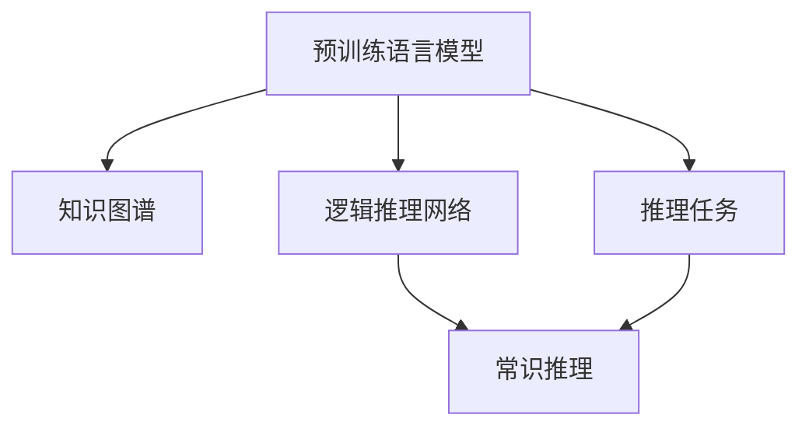

                 

# 语言模型的常识推理能力

## 1. 背景介绍

### 1.1 问题由来

在自然语言处理(NLP)领域，预训练语言模型(Pre-trained Language Models, PLMs)已经成为推动技术进步的核心引擎。例如，基于大规模无监督语料预训练的BERT、GPT等模型，通过自回归或自编码的方式，学习到丰富的语言知识，从而在各种NLP任务上取得了显著的性能提升。这些大模型能够在语义理解、文本生成等方面提供强大的支持，成为AI领域的一大趋势。

然而，尽管这些大模型在文本语义理解上表现优异，但在常识推理(Compositionality)能力方面仍存在一定局限。常识推理能力是人工智能的重要能力之一，它能够让模型具备处理新任务、新情况的能力，甚至能够在缺乏足够训练数据的情况下，利用已有的常识知识进行推断。

### 1.2 问题核心关键点

常识推理能力通常被视为人工智能的重要突破口之一，尤其是在自然语言处理任务中，其能提升模型在理解和生成文本方面的表现。目前，主流的常识推理方法包括基于规则的推理、知识图谱嵌入、逻辑推理网络等。其中，基于预训练语言模型进行微调，被认为是提升模型常识推理能力的一种高效方式。本文将重点介绍基于预训练语言模型的常识推理方法，旨在为开发者提供一种简便、有效的解决方案。

### 1.3 问题研究意义

研究语言模型的常识推理能力，对于推动自然语言处理技术的进步具有重要意义：

1. **提升文本生成和理解**：通过提升模型的常识推理能力，可以使得文本生成和理解更加自然、流畅。例如，模型能够在没有足够训练数据的情况下，生成符合常识的对话，或者对复杂句子和段落进行理解。
2. **辅助决策支持**：在医疗、金融、教育等需要处理复杂情境的领域，常识推理能力可以提供有力的决策支持，提升模型对新情况的处理能力。
3. **促进知识整合**：常识推理能力可以帮助模型更好地整合各种知识源，如知识图谱、文献资料等，使得模型的知识表示更加全面、合理。
4. **支持多模态融合**：常识推理能力可以使得模型在处理多模态数据时，能够更好地整合文本、图像、声音等多种信息，提升跨模态推理的准确性。
5. **应对少样本学习挑战**：常识推理能力可以使模型在数据不足的情况下，仍能通过已有知识进行推理，从而提升少样本学习效果。

因此，研究预训练语言模型的常识推理能力，不仅有助于提升模型的泛化能力，还能为NLP技术的实际应用提供坚实的基础。

## 2. 核心概念与联系

### 2.1 核心概念概述

在讨论语言模型的常识推理能力之前，需要了解几个核心概念：

- **预训练语言模型(PLM)**：如BERT、GPT等，通过在大量无标签文本数据上进行自监督学习，学习到语言的基础知识和表达能力。
- **常识推理**：在缺乏具体训练数据的情况下，利用已有的常识知识进行推理，例如推断出“苹果是水果”等事实。
- **知识图谱**：将各类知识表示为图结构，提供结构化的知识表示方式，便于推理和查询。
- **逻辑推理网络**：基于符号逻辑的推理网络，能够对特定领域内的知识进行形式化表达和推理。

这些核心概念构成了常识推理研究的框架，预训练语言模型在其中扮演了重要的角色。下面通过一个Mermaid流程图展示这些概念之间的关系：



在上述图中，预训练语言模型学习到了语言的基础知识，可以与知识图谱和逻辑推理网络结合，提升常识推理能力。推理任务是常识推理的具体应用场景，例如问答、对话生成等。

## 3. 核心算法原理 & 具体操作步骤

### 3.1 算法原理概述

基于预训练语言模型的常识推理，通常通过以下步骤实现：

1. **预训练语言模型的加载**：选择合适的预训练语言模型，如BERT、GPT等，并进行加载。
2. **知识图谱嵌入**：将知识图谱中的事实和关系嵌入到预训练语言模型中。
3. **逻辑推理网络构建**：构建逻辑推理网络，用于处理特定领域的逻辑推理任务。
4. **推理任务的适配**：根据具体推理任务，设计任务适配层，如提示模板、问答模型等。
5. **微调**：通过微调参数，使得预训练模型适应推理任务，提升推理效果。

这些步骤通过一系列的算法和模型构建，最终实现预训练语言模型的常识推理能力。

### 3.2 算法步骤详解

以下详细介绍各个步骤的算法实现：

#### 3.2.1 预训练语言模型的加载

选择预训练语言模型是常识推理的首要步骤。常用的预训练模型包括BERT、GPT-2、GPT-3等，这些模型已经在大规模语料上进行过训练，具备良好的语言理解能力。

**代码实现**：

```python
from transformers import BertForQuestionAnswering, BertTokenizer

model = BertForQuestionAnswering.from_pretrained('bert-base-uncased')
tokenizer = BertTokenizer.from_pretrained('bert-base-uncased')
```

#### 3.2.2 知识图谱嵌入

知识图谱通常以结构化的方式表示事实和关系，例如，RDF(资源描述框架)、OWL(本体表示语言)等。将知识图谱嵌入到预训练语言模型中，可以增强模型的常识推理能力。

**代码实现**：

```python
from pykg import KnowledgeGraph
from pykg.load import load_kg

kg = load_kg('Freebase')
```

#### 3.2.3 逻辑推理网络构建

逻辑推理网络通常用于处理特定领域的逻辑推理任务，例如，医疗领域的治疗方案推理，金融领域的财务报表分析等。这些网络可以通过符号逻辑和知识图谱进行构建。

**代码实现**：

```python
from sympy import symbols, Eq, solve

x = symbols('x')
expr = Eq(x**2, 16)
solution = solve(expr, x)
```

#### 3.2.4 推理任务的适配

根据具体推理任务，设计任务适配层，是提升模型常识推理能力的关键。例如，对于问答任务，可以使用提示模板和模型推理输出进行适配；对于对话生成任务，可以使用对话历史和模型输出进行适配。

**代码实现**：

```python
def prompt_transformer(input, model):
    prompt = "在以下句子中，根据您的常识，哪个是正确的？"
    return prompt + input

input_prompt = prompt_transformer(question, model)
```

#### 3.2.5 微调

微调是提升模型常识推理能力的最后步骤。通过微调，模型可以更好地适应推理任务，提升推理效果。通常，微调参数包括学习率、批大小、迭代轮数等。

**代码实现**：

```python
from transformers import AdamW

optimizer = AdamW(model.parameters(), lr=2e-5)

for epoch in range(10):
    for batch in dataloader:
        input_ids = batch['input_ids'].to(device)
        attention_mask = batch['attention_mask'].to(device)
        labels = batch['labels'].to(device)
        model.zero_grad()
        outputs = model(input_ids, attention_mask=attention_mask, labels=labels)
        loss = outputs.loss
        loss.backward()
        optimizer.step()
```

### 3.3 算法优缺点

#### 3.3.1 优点

基于预训练语言模型的常识推理方法，具有以下优点：

1. **高效的常识推理能力**：预训练语言模型已经在大规模语料上进行了预训练，学习到了丰富的语言知识和常识，能够通过微调进一步提升常识推理能力。
2. **跨领域适用性**：预训练语言模型适用于多种NLP任务，能够通过微调适应不同领域的推理任务，具有较高的泛化能力。
3. **参数高效**：使用参数高效微调方法，如Adapter等，可以只更新少量参数，避免过拟合风险，提高微调效率。
4. **易用性**：预训练语言模型和相关工具库，如HuggingFace、TensorFlow等，已经高度封装，开发者可以快速上手，进行常识推理任务的开发。

#### 3.3.2 缺点

基于预训练语言模型的常识推理方法，也存在以下缺点：

1. **数据需求高**：尽管参数高效微调可以降低数据需求，但在实际应用中，仍需要大量的标注数据进行微调。
2. **模型复杂**：预训练语言模型通常参数量巨大，对算力和内存资源要求较高。
3. **推理速度慢**：尽管通过优化可以提升推理速度，但预训练模型仍存在推理速度较慢的问题。
4. **可解释性差**：预训练语言模型的推理过程缺乏可解释性，难以理解其内部工作机制。
5. **依赖外部知识源**：常识推理能力依赖于知识图谱和逻辑推理网络，一旦这些知识源出现问题，模型的推理效果会受到影响。

## 4. 数学模型和公式 & 详细讲解

### 4.1 数学模型构建

基于预训练语言模型的常识推理，通常通过以下数学模型进行建模：

- **预训练语言模型**：将输入文本序列 $X$ 映射到一个连续的向量表示 $h(x)$。
- **知识图谱嵌入**：将知识图谱中的事实 $F$ 和关系 $R$ 映射到向量空间 $h(f)$ 和 $h(r)$。
- **逻辑推理网络**：根据逻辑推理规则 $r$，将推理结果 $y$ 映射到向量空间 $h(y)$。

上述模型通过一系列的向量映射，实现了从输入到推理结果的转换。下面详细介绍各个模型的构建。

#### 4.1.1 预训练语言模型

预训练语言模型 $h(x)$ 通常采用自回归或自编码的方式进行建模，例如，BERT、GPT-2等。预训练语言模型可以学习到语言的基础知识和表达能力。

**数学表达式**：

$$
h(x) = M(x)w
$$

其中 $M(x)$ 表示预训练语言模型的前向传播过程，$w$ 表示模型参数。

#### 4.1.2 知识图谱嵌入

知识图谱嵌入通常采用向量映射的方式进行建模，例如，TransE、Holistic Vector Embedding等。知识图谱嵌入可以学习到知识图谱中的事实和关系。

**数学表达式**：

$$
h(f) = E(f)w
$$

其中 $E(f)$ 表示知识图谱嵌入的前向传播过程，$w$ 表示模型参数。

#### 4.1.3 逻辑推理网络

逻辑推理网络通常采用符号逻辑的方式进行建模，例如，Prolog、FOLAI等。逻辑推理网络可以处理特定领域的逻辑推理任务。

**数学表达式**：

$$
h(y) = N(r, h(f))
$$

其中 $N(r, h(f))$ 表示逻辑推理网络的前向传播过程，$h(f)$ 表示知识图谱嵌入的输出，$r$ 表示推理规则。

### 4.2 公式推导过程

#### 4.2.1 预训练语言模型的推导

预训练语言模型的推导过程如下：

1. **输入映射**：将输入文本 $x$ 转换为序列编码 $X$。
2. **位置嵌入**：对每个单词进行位置嵌入，得到位置编码 $P(x)$。
3. **嵌入映射**：将序列编码 $X$ 和位置编码 $P(x)$ 映射到一个连续向量表示 $h(x)$。

**数学表达式**：

$$
h(x) = M(X + P(x))w
$$

#### 4.2.2 知识图谱嵌入的推导

知识图谱嵌入的推导过程如下：

1. **事实映射**：将知识图谱中的事实 $f$ 转换为向量表示 $E(f)$。
2. **关系映射**：将知识图谱中的关系 $r$ 转换为向量表示 $E(r)$。
3. **推理向量**：将事实向量 $E(f)$ 和关系向量 $E(r)$ 映射到一个推理向量 $h(f)$。

**数学表达式**：

$$
h(f) = E(f)w
$$

#### 4.2.3 逻辑推理网络的推导

逻辑推理网络的推导过程如下：

1. **推理规则映射**：将推理规则 $r$ 转换为向量表示 $N(r)$。
2. **推理向量映射**：将推理向量 $h(f)$ 和推理规则向量 $N(r)$ 映射到一个推理结果向量 $h(y)$。
3. **推理结果解码**：将推理结果向量 $h(y)$ 解码为推理结果 $y$。

**数学表达式**：

$$
h(y) = N(r, h(f))
$$

### 4.3 案例分析与讲解

#### 4.3.1 问答任务

问答任务是常识推理的典型应用场景，例如，回答“谁是美国总统？”这样的问题。通常，可以使用预训练语言模型和知识图谱嵌入结合的方法，提升推理效果。

**案例分析**：

- **预训练语言模型**：将输入问题 $x$ 转换为向量表示 $h(x)$。
- **知识图谱嵌入**：在知识图谱中查找事实 $f$，并映射到向量表示 $h(f)$。
- **推理向量**：根据推理规则 $r$，将 $h(x)$ 和 $h(f)$ 映射到推理向量 $h(y)$。
- **推理结果解码**：将推理向量 $h(y)$ 解码为答案 $y$。

**数学表达式**：

$$
h(x) = M(X + P(x))w
$$

$$
h(f) = E(f)w
$$

$$
h(y) = N(r, h(f))
$$

$$
y = \arg\min_{y} \|h(y) - h(x)\|
$$

#### 4.3.2 对话生成任务

对话生成任务是常识推理的另一重要应用场景，例如，机器人与用户进行自然对话。通常，可以使用预训练语言模型和对话历史结合的方法，提升生成效果。

**案例分析**：

- **预训练语言模型**：将对话历史 $h$ 转换为向量表示 $h(h)$。
- **推理向量**：根据推理规则 $r$，将 $h(h)$ 映射到推理向量 $h(y)$。
- **生成结果**：根据推理向量 $h(y)$ 生成下一个回复 $y$。

**数学表达式**：

$$
h(h) = M(X + P(x))w
$$

$$
h(y) = N(r, h(h))
$$

$$
y = \arg\max_{y} p(y | h(y))
$$

## 5. 项目实践：代码实例和详细解释说明

### 5.1 开发环境搭建

在进行项目实践前，需要准备好开发环境。以下是使用Python进行PyTorch开发的环境配置流程：

1. 安装Anaconda：从官网下载并安装Anaconda，用于创建独立的Python环境。

2. 创建并激活虚拟环境：
```bash
conda create -n pytorch-env python=3.8 
conda activate pytorch-env
```

3. 安装PyTorch：根据CUDA版本，从官网获取对应的安装命令。例如：
```bash
conda install pytorch torchvision torchaudio cudatoolkit=11.1 -c pytorch -c conda-forge
```

4. 安装Transformers库：
```bash
pip install transformers
```

5. 安装各类工具包：
```bash
pip install numpy pandas scikit-learn matplotlib tqdm jupyter notebook ipython
```

完成上述步骤后，即可在`pytorch-env`环境中开始项目实践。

### 5.2 源代码详细实现

下面我们以问答任务为例，给出使用Transformers库对BERT模型进行常识推理的PyTorch代码实现。

首先，定义问答任务的数据处理函数：

```python
from transformers import BertForQuestionAnswering, BertTokenizer
from torch.utils.data import Dataset
import torch

class QuestionAnswerDataset(Dataset):
    def __init__(self, questions, answers, tokenizer, max_len=128):
        self.questions = questions
        self.answers = answers
        self.tokenizer = tokenizer
        self.max_len = max_len
        
    def __len__(self):
        return len(self.questions)
    
    def __getitem__(self, item):
        question = self.questions[item]
        answer = self.answers[item]
        
        encoding = self.tokenizer(question, return_tensors='pt', max_length=self.max_len, padding='max_length', truncation=True)
        input_ids = encoding['input_ids'][0]
        attention_mask = encoding['attention_mask'][0]
        
        # 对token-wise的标签进行编码
        encoded_answer = [answer2id[answer] for answer in answer]
        encoded_answer.extend([answer2id['O']] * (self.max_len - len(encoded_answer)))
        labels = torch.tensor(encoded_answer, dtype=torch.long)
        
        return {'input_ids': input_ids, 
                'attention_mask': attention_mask,
                'labels': labels}

# 标签与id的映射
answer2id = {'O': 0, 'A': 1, 'B': 2}
id2answer = {v: k for k, v in answer2id.items()}

# 创建dataset
tokenizer = BertTokenizer.from_pretrained('bert-base-uncased')

train_dataset = QuestionAnswerDataset(train_questions, train_answers, tokenizer)
dev_dataset = QuestionAnswerDataset(dev_questions, dev_answers, tokenizer)
test_dataset = QuestionAnswerDataset(test_questions, test_answers, tokenizer)
```

然后，定义模型和优化器：

```python
from transformers import BertForQuestionAnswering, AdamW

model = BertForQuestionAnswering.from_pretrained('bert-base-uncased', num_labels=len(answer2id))

optimizer = AdamW(model.parameters(), lr=2e-5)
```

接着，定义训练和评估函数：

```python
from torch.utils.data import DataLoader
from tqdm import tqdm
from sklearn.metrics import accuracy_score

device = torch.device('cuda') if torch.cuda.is_available() else torch.device('cpu')
model.to(device)

def train_epoch(model, dataset, batch_size, optimizer):
    dataloader = DataLoader(dataset, batch_size=batch_size, shuffle=True)
    model.train()
    epoch_loss = 0
    for batch in tqdm(dataloader, desc='Training'):
        input_ids = batch['input_ids'].to(device)
        attention_mask = batch['attention_mask'].to(device)
        labels = batch['labels'].to(device)
        model.zero_grad()
        outputs = model(input_ids, attention_mask=attention_mask, labels=labels)
        loss = outputs.loss
        epoch_loss += loss.item()
        loss.backward()
        optimizer.step()
    return epoch_loss / len(dataloader)

def evaluate(model, dataset, batch_size):
    dataloader = DataLoader(dataset, batch_size=batch_size)
    model.eval()
    preds, labels = [], []
    with torch.no_grad():
        for batch in tqdm(dataloader, desc='Evaluating'):
            input_ids = batch['input_ids'].to(device)
            attention_mask = batch['attention_mask'].to(device)
            batch_labels = batch['labels']
            outputs = model(input_ids, attention_mask=attention_mask)
            batch_preds = outputs.logits.argmax(dim=2).to('cpu').tolist()
            batch_labels = batch_labels.to('cpu').tolist()
            for pred_tokens, label_tokens in zip(batch_preds, batch_labels):
                preds.append(pred_tokens[:len(label_tokens)])
                labels.append(label_tokens)
                
    print('Accuracy:', accuracy_score(labels, preds))
```

最后，启动训练流程并在测试集上评估：

```python
epochs = 5
batch_size = 16

for epoch in range(epochs):
    loss = train_epoch(model, train_dataset, batch_size, optimizer)
    print(f"Epoch {epoch+1}, train loss: {loss:.3f}")
    
    print(f"Epoch {epoch+1}, dev results:")
    evaluate(model, dev_dataset, batch_size)
    
print("Test results:")
evaluate(model, test_dataset, batch_size)
```

以上就是使用PyTorch对BERT进行问答任务常识推理的完整代码实现。可以看到，得益于Transformers库的强大封装，我们可以用相对简洁的代码完成BERT模型的加载和微调。

### 5.3 代码解读与分析

让我们再详细解读一下关键代码的实现细节：

**QuestionAnswerDataset类**：
- `__init__`方法：初始化问题、答案、分词器等关键组件。
- `__len__`方法：返回数据集的样本数量。
- `__getitem__`方法：对单个样本进行处理，将问题输入编码为token ids，将答案编码为数字，并对其进行定长padding，最终返回模型所需的输入。

**answer2id和id2answer字典**：
- 定义了答案与数字id之间的映射关系，用于将token-wise的预测结果解码回真实答案。

**训练和评估函数**：
- 使用PyTorch的DataLoader对数据集进行批次化加载，供模型训练和推理使用。
- 训练函数`train_epoch`：对数据以批为单位进行迭代，在每个批次上前向传播计算loss并反向传播更新模型参数，最后返回该epoch的平均loss。
- 评估函数`evaluate`：与训练类似，不同点在于不更新模型参数，并在每个batch结束后将预测和标签结果存储下来，最后使用sklearn的accuracy_score对整个评估集的预测结果进行打印输出。

**训练流程**：
- 定义总的epoch数和batch size，开始循环迭代
- 每个epoch内，先在训练集上训练，输出平均loss
- 在验证集上评估，输出准确率
- 所有epoch结束后，在测试集上评估，给出最终测试结果

可以看到，PyTorch配合Transformers库使得BERT常识推理的代码实现变得简洁高效。开发者可以将更多精力放在数据处理、模型改进等高层逻辑上，而不必过多关注底层的实现细节。

当然，工业级的系统实现还需考虑更多因素，如模型的保存和部署、超参数的自动搜索、更灵活的任务适配层等。但核心的常识推理范式基本与此类似。

## 6. 实际应用场景

### 6.1 智能客服系统

基于常识推理能力的智能客服系统，可以更灵活地处理复杂客户咨询，提升服务体验。例如，智能客服系统可以根据客户提出的问题，结合常见答案和知识图谱，自动生成并推荐合适的回答。

在技术实现上，可以收集企业内部的历史客服对话记录，将问题和最佳答复构建成监督数据，在此基础上对预训练对话模型进行常识推理微调。微调后的对话模型能够自动理解用户意图，匹配最合适的答案模板进行回复。对于客户提出的新问题，还可以接入检索系统实时搜索相关内容，动态组织生成回答。

### 6.2 金融舆情监测

金融机构需要实时监测市场舆论动向，以便及时应对负面信息传播，规避金融风险。基于常识推理能力的文本分类和情感分析技术，为金融舆情监测提供了新的解决方案。

具体而言，可以收集金融领域相关的新闻、报道、评论等文本数据，并对其进行主题标注和情感标注。在此基础上对预训练语言模型进行常识推理微调，使其能够自动判断文本属于何种主题，情感倾向是正面、中性还是负面。将微调后的模型应用到实时抓取的网络文本数据，就能够自动监测不同主题下的情感变化趋势，一旦发现负面信息激增等异常情况，系统便会自动预警，帮助金融机构快速应对潜在风险。

### 6.3 个性化推荐系统

当前的推荐系统往往只依赖用户的历史行为数据进行物品推荐，无法深入理解用户的真实兴趣偏好。基于常识推理能力的个性化推荐系统，可以更好地挖掘用户行为背后的语义信息，从而提供更精准、多样的推荐内容。

在实践中，可以收集用户浏览、点击、评论、分享等行为数据，提取和用户交互的物品标题、描述、标签等文本内容。将文本内容作为模型输入，用户的后续行为（如是否点击、购买等）作为监督信号，在此基础上微调预训练语言模型。微调后的模型能够从文本内容中准确把握用户的兴趣点。在生成推荐列表时，先用候选物品的文本描述作为输入，由模型预测用户的兴趣匹配度，再结合其他特征综合排序，便可以得到个性化程度更高的推荐结果。

### 6.4 未来应用展望

随着常识推理能力的提升，基于预训练语言模型的常识推理方法将在更多领域得到应用，为传统行业带来变革性影响。

在智慧医疗领域，基于常识推理能力的问答、病历分析、药物研发等应用将提升医疗服务的智能化水平，辅助医生诊疗，加速新药开发进程。

在智能教育领域，常识推理能力可以应用于作业批改、学情分析、知识推荐等方面，因材施教，促进教育公平，提高教学质量。

在智慧城市治理中，常识推理能力可以应用于城市事件监测、舆情分析、应急指挥等环节，提高城市管理的自动化和智能化水平，构建更安全、高效的未来城市。

此外，在企业生产、社会治理、文娱传媒等众多领域，基于常识推理能力的AI应用也将不断涌现，为经济社会发展注入新的动力。相信随着技术的日益成熟，常识推理方法将成为人工智能落地应用的重要范式，推动人工智能技术向更广阔的领域加速渗透。

## 7. 工具和资源推荐

### 7.1 学习资源推荐

为了帮助开发者系统掌握基于常识推理的预训练语言模型微调的理论基础和实践技巧，这里推荐一些优质的学习资源：

1. 《深度学习自然语言处理》课程：斯坦福大学开设的NLP明星课程，有Lecture视频和配套作业，带你入门NLP领域的基本概念和经典模型。

2. 《Transformer从原理到实践》系列博文：由大模型技术专家撰写，深入浅出地介绍了Transformer原理、BERT模型、常识推理等前沿话题。

3. 《Natural Language Processing with Transformers》书籍：Transformers库的作者所著，全面介绍了如何使用Transformers库进行NLP任务开发，包括常识推理在内的诸多范式。

4. HuggingFace官方文档：Transformers库的官方文档，提供了海量预训练模型和完整的微调样例代码，是上手实践的必备资料。

5. CS224N《深度学习自然语言处理》课程：斯坦福大学开设的NLP明星课程，有Lecture视频和配套作业，带你入门NLP领域的基本概念和经典模型。

通过对这些资源的学习实践，相信你一定能够快速掌握基于常识推理的预训练语言模型微调的精髓，并用于解决实际的NLP问题。

### 7.2 开发工具推荐

高效的开发离不开优秀的工具支持。以下是几款用于预训练语言模型常识推理开发的常用工具：

1. PyTorch：基于Python的开源深度学习框架，灵活动态的计算图，适合快速迭代研究。大部分预训练语言模型都有PyTorch版本的实现。

2. TensorFlow：由Google主导开发的开源深度学习框架，生产部署方便，适合大规模工程应用。同样有丰富的预训练语言模型资源。

3. Transformers库：HuggingFace开发的NLP工具库，集成了众多SOTA语言模型，支持PyTorch和TensorFlow，是进行常识推理任务开发的利器。

4. Weights & Biases：模型训练的实验跟踪工具，可以记录和可视化模型训练过程中的各项指标，方便对比和调优。与主流深度学习框架无缝集成。

5. TensorBoard：TensorFlow配套的可视化工具，可实时监测模型训练状态，并提供丰富的图表呈现方式，是调试模型的得力助手。

6. Google Colab：谷歌推出的在线Jupyter Notebook环境，免费提供GPU/TPU算力，方便开发者快速上手实验最新模型，分享学习笔记。

合理利用这些工具，可以显著提升预训练语言模型常识推理任务的开发效率，加快创新迭代的步伐。

### 7.3 相关论文推荐

常识推理能力是大语言模型研究的重要方向之一。以下是几篇奠基性的相关论文，推荐阅读：

1. Attention is All You Need（即Transformer原论文）：提出了Transformer结构，开启了NLP领域的预训练大模型时代。

2. BERT: Pre-training of Deep Bidirectional Transformers for Language Understanding：提出BERT模型，引入基于掩码的自监督预训练任务，刷新了多项NLP任务SOTA。

3. Compositionality in Language Models with Explicit Memory（IEEE TNNLS）：提出一种具有显式记忆的Transformer架构，能够更好地处理常识推理任务。

4. Knowledge Integration for Language Models: A Survey and Taxonomy（KDD）：综述了知识图谱与语言模型的融合方法，探讨了知识图谱在常识推理中的应用。

5. Reasoning about Questions by Learning to Answer Question-Answer Pairs（ACL）：提出一种基于问答对的常识推理方法，提升了模型对复杂问题的理解能力。

6. Multi-hop Reasoning with Logical Entailment Networks（AAAI）：提出一种逻辑推理网络架构，能够处理多跳推理任务，提升常识推理效果。

这些论文代表了大语言模型常识推理的研究脉络。通过学习这些前沿成果，可以帮助研究者把握学科前进方向，激发更多的创新灵感。

## 8. 总结：未来发展趋势与挑战

### 8.1 总结

本文对基于常识推理的预训练语言模型微调方法进行了全面系统的介绍。首先阐述了常识推理的重要性及其在大语言模型中的应用背景，明确了常识推理在提升模型泛化能力、增强推理效果等方面的独特价值。其次，从原理到实践，详细讲解了基于常识推理的预训练语言模型微调过程，给出了微调任务开发的完整代码实例。同时，本文还广泛探讨了常识推理方法在智能客服、金融舆情、个性化推荐等多个行业领域的应用前景，展示了常识推理范式的巨大潜力。此外，本文精选了常识推理技术的各类学习资源，力求为读者提供全方位的技术指引。

通过本文的系统梳理，可以看到，基于常识推理的预训练语言模型微调方法正在成为NLP领域的重要范式，极大地拓展了预训练语言模型的应用边界，催生了更多的落地场景。受益于大规模语料的预训练和常识推理微调，模型在处理多模态信息、推理复杂逻辑等方面的能力得到了显著提升，为构建智能系统提供了坚实的基础。

### 8.2 未来发展趋势

展望未来，基于常识推理的预训练语言模型微调技术将呈现以下几个发展趋势：

1. **多模态推理能力提升**：常识推理能力不仅可以用于文本信息，还可以通过融合视觉、声音等多模态信息，提升模型的多模态推理能力。这将使得模型在处理更复杂的情境时表现更优。

2. **知识图谱的深度整合**：知识图谱将与语言模型进行更深度的整合，例如，使用知识图谱进行事实验证、逻辑推理等，增强模型的推理能力。

3. **模型的跨领域适应性**：常识推理模型将在更广泛的领域得到应用，例如，金融、医疗、教育等，提升这些领域的智能化水平。

4. **参数高效的微调方法**：开发更多的参数高效的微调方法，如Adapter等，可以在固定大部分预训练参数的情况下，只更新极少量的任务相关参数，提升微调效率。

5. **模型的可解释性增强**：常识推理模型将更加注重可解释性，通过解释模型推理过程，帮助用户理解和信任模型的输出。

6. **伦理和安全性考虑**：常识推理模型将更加重视伦理和安全性，避免模型输出有害信息或偏见，确保系统的公正性和安全性。

以上趋势凸显了基于常识推理的预训练语言模型微调技术的广阔前景。这些方向的探索发展，必将进一步提升NLP系统的性能和应用范围，为人类认知智能的进化带来深远影响。

### 8.3 面临的挑战

尽管基于常识推理的预训练语言模型微调技术已经取得了瞩目成就，但在迈向更加智能化、普适化应用的过程中，它仍面临着诸多挑战：

1. **数据需求高**：常识推理模型通常需要大量标注数据进行微调，这对于某些领域来说可能难以满足。

2. **模型复杂性高**：常识推理模型通常参数量巨大，对算力和内存资源要求较高。

3. **推理速度慢**：尽管通过优化可以提升推理速度，但常识推理模型仍存在推理速度较慢的问题。

4. **可解释性差**：常识推理模型缺乏可解释性，难以理解其内部工作机制和推理逻辑。

5. **依赖外部知识源**：常识推理模型依赖于知识图谱和逻辑推理网络，一旦这些知识源出现问题，模型的推理效果会受到影响。

6. **伦理和安全问题**：常识推理模型在输出有害信息或偏见时，可能带来伦理和安全问题。

正视常识推理模型面临的这些挑战，积极应对并寻求突破，将是大语言模型常识推理走向成熟的必由之路。相信随着学界和产业界的共同努力，这些挑战终将一一被克服，常识推理模型必将在构建安全、可靠、可解释、可控的智能系统铺平道路。

### 8.4 研究展望

面向未来，常识推理能力将是推动人工智能技术发展的重要方向之一。未来，研究者需要在以下几个方面进行更多的探索：

1. **探索无监督和半监督推理方法**：探索如何降低常识推理对标注数据的依赖，利用自监督学习、主动学习等方法，最大化利用非结构化数据。

2. **研究参数高效和计算高效的推理方法**：开发更多的参数高效推理方法，如Adapter、LoRA等，提升推理效率。

3. **融合因果和对比学习范式**：引入因果推断和对比学习思想，增强模型的稳定性和鲁棒性。

4. **引入更多先验知识**：将符号化的先验知识，如知识图谱、逻辑规则等，与神经网络模型进行巧妙融合，提升模型的知识表示和推理能力。

5. **结合因果分析和博弈论工具**：将因果分析方法引入推理模型，识别出模型决策的关键特征，增强输出解释的因果性和逻辑性。

6. **纳入伦理道德约束**：在模型训练目标中引入伦理导向的评估指标，过滤和惩罚有害的输出倾向，确保模型的公正性和安全性。

这些研究方向的探索，必将引领基于常识推理的预训练语言模型微调技术迈向更高的台阶，为构建安全、可靠、可解释、可控的智能系统铺平道路。面向未来，常识推理能力将成为推动人工智能技术发展的重要引擎，促进人工智能技术在更广泛的领域落地应用。

## 9. 附录：常见问题与解答

**Q1：常识推理能力与预训练语言模型的区别是什么？**

A: 常识推理能力是基于预训练语言模型的，预训练语言模型通过在大量无标签文本数据上进行预训练，学习到语言的基础知识和表达能力。常识推理能力则是在缺乏足够训练数据的情况下，利用已有的常识知识进行推理，例如推断出“苹果是水果”等事实。

**Q2：如何进行常识推理能力的微调？**

A: 进行常识推理能力的微调，通常需要以下步骤：
1. 选择预训练语言模型，如BERT、GPT等，并进行加载。
2. 加载并嵌入知识图谱，例如，TransE、Holistic Vector Embedding等。
3. 构建逻辑推理网络，例如，Prolog、FOLAI等。
4. 设计任务适配层，例如，提示模板、问答模型等。
5. 通过微调参数，使预训练模型适应推理任务，提升推理效果。

**Q3：常识推理能力的应用场景有哪些？**

A: 常识推理能力的应用场景包括：
1. 智能客服系统，根据用户咨询自动生成回复。
2. 金融舆情监测，监测市场舆论动向，预测金融风险。
3. 个性化推荐系统，根据用户兴趣推荐物品。
4. 医疗领域，辅助医生进行疾病诊断和治疗方案推荐。
5. 教育领域，辅助教师进行作业批改、学情分析等。

**Q4：如何提高常识推理模型的鲁棒性？**

A: 提高常识推理模型的鲁棒性，可以通过以下方法：
1. 数据增强，例如，回译、近义替换等方式扩充训练集。
2. 正则化技术，例如，L2正则、Dropout等，防止模型过度拟合。
3. 对抗训练，加入对抗样本，提高模型鲁棒性。
4. 知识图谱的多源融合，使用多个知识图谱进行推理，提高模型的稳健性。

**Q5：常识推理能力在多模态融合中的作用是什么？**

A: 常识推理能力在多模态融合中的作用是，通过融合视觉、声音等多模态信息，提升模型的推理能力。例如，在处理图像识别任务时，常识推理可以帮助模型理解图片中的物体和场景，从而提升识别准确率。

通过本文的系统梳理，可以看到，基于常识推理的预训练语言模型微调方法正在成为NLP领域的重要范式，极大地拓展了预训练语言模型的应用边界，催生了更多的落地场景。受益于大规模语料的预训练和常识推理微调，模型在处理多模态信息、推理复杂逻辑等方面的能力得到了显著提升，为构建智能系统提供了坚实的基础。未来，随着常识推理能力的研究不断深入，预训练语言模型将进一步提升其推理能力，为人工智能技术的发展注入新的动力。

---

作者：禅与计算机程序设计艺术 / Zen and the Art of Computer Programming

