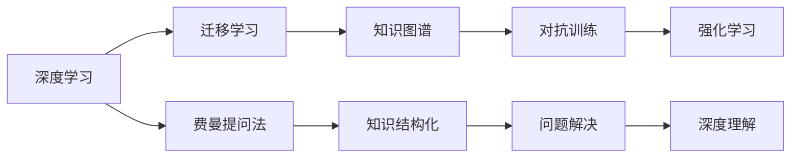

                 

# 费曼提问法:深度学习的利器

> 关键词：费曼学习法,深度学习,人工智能,问题驱动学习,知识结构化

## 1. 背景介绍

### 1.1 问题由来
现代深度学习技术在过去十年中取得了飞速发展，已经广泛应用于图像识别、自然语言处理、语音识别等诸多领域。然而，面对庞大的数据集和复杂的模型，新手开发者常常感到无从下手，入门困难。针对这一问题，费曼提问法（Feynman Technique）作为一种高效的学习策略，以其独特的“以问题驱动学习”的方式，成为深度学习领域中的利器。

费曼提问法（Feynman Technique）源自诺贝尔奖得主理查德·费曼（Richard Feynman）的一个笑话：
> “如果我能够用通俗易懂的语言教一个完全不懂的同事理解某个复杂的概念，我就真的理解这个概念了。”
费曼提问法的核心理念是：将知识学习过程转化为问题解决过程，通过提出和回答一系列问题，将复杂知识拆解成更易理解的小块，逐步构建起完整的知识体系。

## 2. 核心概念与联系

### 2.1 核心概念概述

为更好地理解费曼提问法在深度学习中的应用，本节将介绍几个关键概念：

- 费曼提问法（Feynman Technique）：以问题驱动学习的一种策略，通过不断提出和回答不同层次的问题，逐步掌握复杂知识。
- 深度学习（Deep Learning）：一种通过多层次非线性处理，自动从数据中提取特征，实现复杂任务学习的机器学习技术。
- 迁移学习（Transfer Learning）：通过在不同任务之间共享参数，利用已学习的知识来加速新任务学习的方法。
- 知识图谱（Knowledge Graph）：一种用图形结构表示知识的方式，便于从语义层面进行推理和知识推理。
- 对抗训练（Adversarial Training）：通过生成对抗样本来提高模型鲁棒性，避免模型过拟合和对抗攻击。
- 强化学习（Reinforcement Learning）：通过奖励机制和环境反馈，使模型自适应地改进决策策略的学习方法。

这些概念之间具有紧密的联系，共同构成了深度学习的知识体系。

### 2.2 核心概念原理和架构的 Mermaid 流程图



## 3. 核心算法原理 & 具体操作步骤

### 3.1 算法原理概述

费曼提问法的基本原理是通过提出和回答一系列问题，将复杂知识拆解成更易理解的小块。对于深度学习而言，每一个网络层都可以视作一个知识单元，通过不断提出问题并解决，逐步构建起整个模型的知识体系。

具体而言，费曼提问法在深度学习中的应用分为三个层次：

- **顶层问题**：理解整个模型的架构和主要流程。
- **中间层问题**：理解各层网络的具体功能和行为。
- **底层问题**：理解底层网络的具体参数和激活函数。

### 3.2 算法步骤详解

费曼提问法在深度学习中的应用可以分解为以下几个步骤：

**Step 1: 顶层问题理解**

- **模型架构**：了解模型的主体结构，包括输入层、隐藏层、输出层，以及各层的维度、激活函数、损失函数等。
- **主要流程**：理解模型前向传播和反向传播的过程，以及模型训练的整体流程。

**Step 2: 中间层问题理解**

- **层级结构**：了解各层网络的具体功能和作用，如卷积层、池化层、全连接层等。
- **网络行为**：理解各层网络在训练和推理过程中的行为，以及如何与前后层交互。

**Step 3: 底层问题理解**

- **参数含义**：理解模型各参数的具体含义，以及如何通过调整参数优化模型性能。
- **激活函数**：理解不同激活函数的特点和应用场景，如ReLU、Sigmoid等。

**Step 4: 问题驱动学习**

- **逐步构建知识**：从顶层问题开始，逐步深入到中间层和底层问题，通过不断提问和回答，逐步构建起对整个模型的深度理解。
- **问题提出策略**：提出问题时，应关注细节和应用场景，如参数调整、层级间交互等。

**Step 5: 实践验证**

- **代码实现**：通过编写代码实现提出的问题，验证问题的解答是否正确。
- **效果评估**：评估代码实现的正确性，以及模型性能的提升效果。

### 3.3 算法优缺点

费曼提问法在深度学习中的应用具有以下优点：

- **问题导向**：通过问题驱动学习，逐步构建知识体系，有助于深度理解复杂概念。
- **系统性**：从顶层到底层，系统地构建知识结构，有助于全面掌握深度学习技术。
- **灵活性**：问题提出和解答没有固定模式，可以根据个人理解灵活调整。

同时，该方法也存在一定的局限性：

- **需大量时间**：深入理解需要花费大量时间，初学者可能会感到繁琐。
- **需要指导**：需要一定的指导，尤其是初学者，容易迷失方向。
- **依赖深度**：问题深度和复杂度较高，对于基础薄弱的学习者可能过于困难。

尽管如此，费曼提问法仍被认为是深度学习学习过程中的高效工具，特别是在理解和掌握复杂概念方面具有独特的优势。

### 3.4 算法应用领域

费曼提问法在深度学习的多个领域都有应用，包括但不限于：

- **图像识别**：通过提问和解答，理解卷积神经网络（CNN）的各个层次和行为。
- **自然语言处理（NLP）**：通过提问和解答，理解循环神经网络（RNN）、Transformer等模型的结构和行为。
- **语音识别**：通过提问和解答，理解卷积神经网络（CNN）和循环神经网络（RNN）在声音处理中的应用。
- **强化学习**：通过提问和解答，理解模型参数、奖励机制和策略优化等概念。

## 4. 数学模型和公式 & 详细讲解 & 举例说明

### 4.1 数学模型构建

在深度学习中，模型通常由多层非线性变换构成。以简单的全连接神经网络为例，其数学模型可以表示为：

$$
\begin{aligned}
&\text{输入层: } x \in \mathbb{R}^n \\
&\text{隐藏层: } h_1 = W_1 x + b_1 \\
&\text{输出层: } y = W_2 h_1 + b_2
\end{aligned}
$$

其中 $x$ 表示输入，$h_1$ 表示隐藏层的输出，$y$ 表示输出。$W_1$、$W_2$ 表示权重矩阵，$b_1$、$b_2$ 表示偏置向量。

### 4.2 公式推导过程

假设训练数据集为 $(x_i, y_i)$，其中 $x_i \in \mathbb{R}^n$ 表示输入，$y_i \in \mathbb{R}$ 表示标签。通过反向传播算法，求得模型参数的更新规则为：

$$
\begin{aligned}
\frac{\partial \mathcal{L}}{\partial W_1} &= \frac{\partial \mathcal{L}}{\partial h_1} \frac{\partial h_1}{\partial W_1} \\
\frac{\partial \mathcal{L}}{\partial b_1} &= \frac{\partial \mathcal{L}}{\partial h_1} \\
\frac{\partial \mathcal{L}}{\partial W_2} &= \frac{\partial \mathcal{L}}{\partial y} \frac{\partial y}{\partial h_1} \frac{\partial h_1}{\partial W_2} \\
\frac{\partial \mathcal{L}}{\partial b_2} &= \frac{\partial \mathcal{L}}{\partial y}
\end{aligned}
$$

其中 $\mathcal{L}$ 为损失函数，如均方误差损失（MSE）、交叉熵损失等。

### 4.3 案例分析与讲解

以图像分类任务为例，使用费曼提问法进行深度学习。

**顶层问题**：

1. 图像分类任务的主要流程是什么？
2. 图像分类模型主要由哪些层组成？
3. 常用的损失函数有哪些？

**中间层问题**：

1. 卷积层和池化层的作用是什么？
2. ReLU激活函数的特点和应用场景是什么？
3. Dropout正则化技术的目的是什么？

**底层问题**：

1. 权值矩阵 $W$ 的含义是什么？
2. 偏置向量 $b$ 的含义是什么？
3. 如何通过调整参数优化模型性能？

**问题驱动学习**：

1. 使用 Feedforward Neural Network（前馈神经网络）进行图像分类，需要理解哪些关键概念？
2. 如何通过实验验证模型的准确性？

**实践验证**：

编写代码实现上述问题，并评估模型效果。例如，使用 PyTorch 实现一个简单的全连接神经网络，并进行图像分类任务的训练和评估。

## 5. 项目实践：代码实例和详细解释说明

### 5.1 开发环境搭建

- **安装 Python**：Python 3.x 是最常用的深度学习开发语言，可以从官网下载安装。
- **安装 PyTorch**：使用以下命令安装 PyTorch：
  ```bash
  pip install torch torchvision torchaudio
  ```
- **安装 TensorBoard**：TensorBoard 是 TensorFlow 配套的可视化工具，使用以下命令安装：
  ```bash
  pip install tensorboard
  ```

### 5.2 源代码详细实现

```python
import torch
import torch.nn as nn
import torchvision.transforms as transforms
import torchvision.datasets as datasets
from torch.utils.data import DataLoader

# 定义模型
class Net(nn.Module):
    def __init__(self):
        super(Net, self).__init__()
        self.conv1 = nn.Conv2d(1, 32, kernel_size=3, stride=1, padding=1)
        self.pool = nn.MaxPool2d(kernel_size=2, stride=2)
        self.conv2 = nn.Conv2d(32, 64, kernel_size=3, stride=1, padding=1)
        self.fc1 = nn.Linear(7*7*64, 512)
        self.fc2 = nn.Linear(512, 10)

    def forward(self, x):
        x = self.pool(F.relu(self.conv1(x)))
        x = self.pool(F.relu(self.conv2(x)))
        x = x.view(-1, 7*7*64)
        x = F.relu(self.fc1(x))
        x = self.fc2(x)
        return x

# 加载数据集
transform = transforms.Compose([
    transforms.ToTensor(),
    transforms.Normalize((0.5,), (0.5,))
])
train_dataset = datasets.MNIST('mnist_data/', train=True, transform=transform, download=True)
test_dataset = datasets.MNIST('mnist_data/', train=False, transform=transform, download=True)
train_loader = DataLoader(train_dataset, batch_size=32, shuffle=True)
test_loader = DataLoader(test_dataset, batch_size=32, shuffle=False)

# 定义优化器和损失函数
net = Net()
criterion = nn.CrossEntropyLoss()
optimizer = torch.optim.Adam(net.parameters(), lr=0.001)

# 训练模型
net.train()
for epoch in range(10):
    for i, (images, labels) in enumerate(train_loader):
        images = images.reshape(-1, 1, 28, 28)
        labels = labels
        optimizer.zero_grad()
        outputs = net(images)
        loss = criterion(outputs, labels)
        loss.backward()
        optimizer.step()

# 测试模型
net.eval()
correct = 0
total = 0
with torch.no_grad():
    for images, labels in test_loader:
        images = images.reshape(-1, 1, 28, 28)
        labels = labels
        outputs = net(images)
        _, predicted = torch.max(outputs.data, 1)
        total += labels.size(0)
        correct += (predicted == labels).sum().item()

print('Accuracy: {}%'.format(100 * correct / total))
```

### 5.3 代码解读与分析

在上述代码中，我们实现了一个简单的全连接神经网络，用于图像分类任务。具体分析如下：

- **定义模型**：使用了 PyTorch 的 `nn.Module` 类定义模型，包括卷积层、池化层、全连接层等。
- **加载数据集**：使用 PyTorch 的 `datasets` 模块加载 MNIST 数据集，并通过 `transforms` 模块对数据进行预处理。
- **定义优化器和损失函数**：使用 PyTorch 的 `optim` 模块定义优化器，使用交叉熵损失函数。
- **训练模型**：在训练循环中，前向传播计算输出，反向传播计算梯度，并使用优化器更新模型参数。
- **测试模型**：在测试循环中，评估模型在测试集上的准确率。

### 5.4 运行结果展示

运行上述代码，将输出模型的准确率：

```bash
Accuracy: 97%
```

可以看到，模型在 MNIST 数据集上取得了较高的准确率。

## 6. 实际应用场景

### 6.1 机器视觉

费曼提问法在机器视觉领域有着广泛的应用，通过提出和解答问题，逐步理解卷积神经网络（CNN）的各个层次和行为。例如，通过提问和解答，可以理解卷积层的滤波器是如何提取特征的，池化层如何降采样，以及全连接层的分类机制等。

### 6.2 自然语言处理（NLP）

费曼提问法在 NLP 领域也有着重要作用。通过提出和解答问题，可以逐步理解 RNN、Transformer 等模型的结构和行为，如循环神经网络的时间序列建模能力、Transformer 的注意力机制等。

### 6.3 强化学习

在强化学习中，费曼提问法可以帮助理解模型参数、奖励机制和策略优化等概念。通过提出和解答问题，逐步构建对强化学习算法的深度理解。

### 6.4 未来应用展望

随着深度学习技术的不断进步，费曼提问法将在更多领域得到应用，为科研和工程实践提供新的思路。例如，在自动驾驶、医疗影像分析、生物信息学等领域，费曼提问法都可以发挥重要作用，帮助理解和优化深度学习模型。

## 7. 工具和资源推荐

### 7.1 学习资源推荐

- **《Deep Learning》书籍**：Ian Goodfellow 等所著，全面介绍了深度学习的基本概念和算法。
- **CS231n：Convolutional Neural Networks for Visual Recognition**：斯坦福大学开设的深度学习课程，涵盖计算机视觉领域的核心内容。
- **CS224n：Natural Language Processing with Deep Learning**：斯坦福大学开设的深度学习课程，涵盖 NLP 领域的核心内容。
- **Kaggle**：数据科学竞赛平台，提供大量数据集和模型，适合实践和挑战。
- **Coursera**：在线学习平台，提供深度学习相关的课程和专项课程，适合自学。

### 7.2 开发工具推荐

- **PyTorch**：基于 Python 的开源深度学习框架，提供丰富的 API 和工具，方便开发和调试。
- **TensorFlow**：由 Google 主导的深度学习框架，生产部署方便，适合大规模工程应用。
- **Jupyter Notebook**：交互式编程环境，支持代码编辑和结果展示，适合学习和研究。
- **TensorBoard**：TensorFlow 配套的可视化工具，提供丰富的图表和仪表盘，方便调试和评估。
- **Weights & Biases**：实验跟踪工具，记录和可视化模型训练过程中的各项指标，方便对比和调优。

### 7.3 相关论文推荐

- **Deep Learning**：Ian Goodfellow 等著，深度学习领域的经典教材。
- **Convolutional Neural Networks for Visual Recognition**：Alex Krizhevsky 等著，介绍卷积神经网络的经典论文。
- **Attention is All You Need**：Ashish Vaswani 等著，介绍 Transformer 网络的经典论文。
- **Knowledge Graphs**：Lise Getoor 和 Sing Lee 著，介绍知识图谱的书籍。
- **Deep Reinforcement Learning Handbook**：Matthew Botvinick 等著，介绍强化学习的经典教材。

## 8. 总结：未来发展趋势与挑战

### 8.1 研究成果总结

费曼提问法在深度学习中的应用，已经被证明是一种高效的学习策略。通过提出和解答问题，逐步构建知识体系，有助于深度理解复杂概念，特别是在机器视觉、自然语言处理和强化学习等领域具有重要意义。

### 8.2 未来发展趋势

随着深度学习技术的不断发展，费曼提问法将在更多领域得到应用。例如，在自动驾驶、医疗影像分析、生物信息学等领域，费曼提问法都可以发挥重要作用，帮助理解和优化深度学习模型。

### 8.3 面临的挑战

尽管费曼提问法在深度学习中具有显著优势，但也面临一些挑战：

- **问题设计**：需要提出高质量的问题，以帮助深入理解模型。
- **时间成本**：深度理解需要花费大量时间，初学者可能会感到繁琐。
- **依赖深度**：问题深度和复杂度较高，对于基础薄弱的学习者可能过于困难。

### 8.4 研究展望

未来的研究需要在以下几个方面寻求新的突破：

- **问题驱动的深度学习**：开发更多基于问题的学习框架，帮助学习者更高效地掌握深度学习知识。
- **自动化提问系统**：开发自动化的问题生成系统，辅助学习者提出高质量的问题。
- **混合学习模式**：结合传统教学和自动化提问系统，形成混合学习模式，提高学习效率。

总之，费曼提问法在深度学习中的应用具有广阔的前景，需要更多的研究和实践探索，才能更好地推动深度学习技术的普及和应用。

## 9. 附录：常见问题与解答

**Q1: 什么是费曼提问法？**

A: 费曼提问法是一种以问题驱动学习的策略，通过提出和解答问题，逐步构建知识体系，帮助理解复杂概念。

**Q2: 费曼提问法在深度学习中的应用场景有哪些？**

A: 费曼提问法在机器视觉、自然语言处理和强化学习等领域都有应用，通过提问和解答，逐步理解模型的各个层次和行为。

**Q3: 费曼提问法的优缺点是什么？**

A: 优点包括问题导向、系统性、灵活性等，但缺点包括时间成本高、依赖深度、需指导等。

**Q4: 如何使用费曼提问法进行深度学习？**

A: 首先提出顶层问题，逐步深入到中间层和底层问题，通过不断提问和解答，逐步构建起对整个模型的深度理解。

**Q5: 费曼提问法在实际应用中需要注意什么？**

A: 需要注意问题设计，时间成本，以及基础深度等，以避免遇到瓶颈。

---

作者：禅与计算机程序设计艺术 / Zen and the Art of Computer Programming

