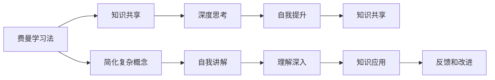

                 

# 费曼提问法促进团队学习与成长

> 关键词：费曼学习法、知识共享、团队协作、深度思考、自我提升

## 1. 背景介绍

在快节奏的技术发展中，学习和成长成为每一个技术人必须面对的挑战。无论是个人自学还是团队协作，都需要高效且系统的方法来提升学习效率和效果。本文将围绕费曼学习法（Feynman Learning Method）这一高效的学习技巧，探讨其如何通过提问促进团队学习与成长。

### 1.1 费曼学习法的提出背景

费曼学习法由著名物理学家理查德·费曼（Richard Feynman）提出，旨在通过简化复杂概念和自我讲解的方式，实现对知识的深入理解和掌握。费曼在自传中提道：“我试图尽可能地以简单的方式表达复杂的概念，通过这个方法，我逐渐发现自己在教学过程中学到了更多，对知识的理解也更为深刻。”

### 1.2 费曼学习法在团队协作中的应用

在团队协作中，费曼学习法的核心在于通过提问和相互解释，促进知识共享和团队成员之间的深度互动。费曼学习法不仅适用于个人自学，更能成为团队中知识传递和深度学习的有力工具。通过成员之间相互提出问题和解答，不仅能加深理解，还能迅速发现知识盲点，提升整个团队的学习效能。

## 2. 核心概念与联系

### 2.1 核心概念概述

- **费曼学习法**：一种通过自我解释和简化复杂概念来加深理解的学习方法。
- **知识共享**：团队成员通过互相交流和提问，分享各自的知识和经验。
- **深度思考**：通过深度问答和讨论，促进思考的深入和创新。
- **自我提升**：个人通过不断学习新知识和技能，实现职业成长。

这些核心概念通过提问这一桥梁，紧密联系起来，形成了一个高效的学习和成长循环系统。

### 2.2 核心概念原理和架构的 Mermaid 流程图



这个流程图展示了费曼学习法通过简化复杂概念、自我讲解和反馈改进，促进知识共享和深度思考，最终实现自我提升的全过程。

## 3. 核心算法原理 & 具体操作步骤

### 3.1 算法原理概述

费曼学习法的核心在于通过提问和自我解释，深入理解和掌握复杂概念。其基本原理包括：

- **简化复杂概念**：将复杂问题分解成基础概念，便于理解和记忆。
- **自我讲解**：通过自我讲解来检测理解和记忆的准确性，发现知识盲点。
- **他人讲解**：与他人讨论，通过不同的视角和理解来深化学习。

这些步骤构成了一个互动的学习循环，通过不断的提问和解释，促进知识的深入理解和掌握。

### 3.2 算法步骤详解

费曼学习法主要包含以下五个步骤：

**Step 1: 选择主题**

1. 选择一个你想要深入学习的主题，确保这个主题对你有挑战性，但并非完全无法理解。

**Step 2: 简化概念**

1. 将主题的核心概念和原理逐一拆解，直到你能够用最简单的语言描述它们。

**Step 3: 自我讲解**

1. 假设你在向一个外行讲解这个主题，尝试用最简单的语言和例子解释这些概念。

**Step 4: 查找问题**

1. 在自我讲解过程中，找出自己理解不透或解释不清楚的地方。

**Step 5: 回顾和改进**

1. 回顾并完善你的解释，确保每个概念都解释得清晰无误。

### 3.3 算法优缺点

**优点**：

- **高效**：通过简化复杂概念和自我讲解，迅速掌握关键知识。
- **深度**：通过不断提问和讨论，深入理解复杂问题。
- **灵活**：适用于任何领域的知识学习和技能提升。

**缺点**：

- **时间成本**：需要投入大量时间进行自我解释和他人讨论。
- **依赖交流**：效果依赖于团队成员之间的积极交流和互动。

### 3.4 算法应用领域

费曼学习法不仅适用于个人自学，也适用于团队知识共享和深度协作。在软件开发、项目管理、产品设计等多个领域，费曼学习法都被广泛应用于促进知识传递和团队成长。

## 4. 数学模型和公式 & 详细讲解 & 举例说明

### 4.1 数学模型构建

费曼学习法的数学模型可以抽象为一种互动反馈系统，其中每个步骤都可以表示为一个函数映射。设 $f_i$ 为第 $i$ 个步骤的映射函数，输入为当前理解水平 $u_i$，输出为改进后的理解水平 $u_{i+1}$。则费曼学习法的数学模型可以表示为：

$$
u_{i+1} = f_i(u_i)
$$

其中 $f_1$ 为简化复杂概念的函数，$f_2$ 为自我讲解的函数，$f_3$ 为查找问题的函数，$f_4$ 为回顾和改进的函数。

### 4.2 公式推导过程

以简化复杂概念的函数 $f_1$ 为例，设当前理解水平为 $u_i$，简化后的概念为 $s_i$。简化过程可以表示为：

$$
s_i = g(u_i)
$$

其中 $g$ 为简化函数。假设 $g$ 是一个线性函数，则：

$$
s_i = a \cdot u_i + b
$$

将 $s_i$ 代入 $f_1$，得到：

$$
u_{i+1} = f_1(u_i) = g^{-1}(s_i) = \frac{1}{a}(u_i - b)
$$

### 4.3 案例分析与讲解

假设我们正在学习一个复杂的机器学习算法——梯度下降（Gradient Descent），并使用费曼学习法进行学习。

**Step 1: 选择主题**：梯度下降

**Step 2: 简化概念**：

1. 将梯度下降拆解为学习率、损失函数和梯度等基础概念。

2. 定义简化函数 $g$：

$$
s_i = a \cdot u_i + b
$$

其中 $u_i$ 为对梯度下降的理解水平，$s_i$ 为简化后的概念。

**Step 3: 自我讲解**：

1. 假设向一个外行讲解梯度下降，使用简单的语言和例子，如：

“想象你在山上走，每次朝着坡度的反方向迈一小步，这样最终能走到山脚。”

**Step 4: 查找问题**：

1. 在讲解过程中，发现自己对“学习率”的解释不够清晰，需要进一步理解。

**Step 5: 回顾和改进**：

1. 回顾并改进对“学习率”的解释，确保每个概念都解释得清晰无误。

## 5. 项目实践：代码实例和详细解释说明

### 5.1 开发环境搭建

要实践费曼学习法，需要一个支持在线协作和讨论的平台。以下是常用的工具：

1. **Trello**：用于任务管理和进度跟踪。
2. **Slack**：用于实时沟通和消息传递。
3. **Google Docs**：用于团队文档协作和共享。
4. **Miro**：用于在线白板和协作绘图。

**安装和配置**：

1. 访问 Trello、Slack、Google Docs、Miro 官网，创建团队账号。
2. 在 Trello 中创建“学习任务”板块，列出每个学习主题。
3. 在 Slack 中创建学习频道，用于讨论和提问。
4. 在 Google Docs 和 Miro 中创建共享文档，用于记录学习进度和协作绘图。

### 5.2 源代码详细实现

以学习机器学习算法为例，我们通过 Trello 和 Slack 实现费曼学习法的具体步骤：

1. **Trello 任务管理**：
   - 创建“选择主题”卡片。
   - 创建“简化概念”卡片。
   - 创建“自我讲解”卡片。
   - 创建“查找问题”卡片。
   - 创建“回顾和改进”卡片。

2. **Slack 实时沟通**：
   - 创建“学习讨论”频道。
   - 在每个学习卡片中创建对应的讨论线程。
   - 在讨论线程中提出问题和解答，分享知识。

### 5.3 代码解读与分析

以下是一个 Trello 任务管理的示例：

**选择主题**：梯度下降

**简化概念**：
1. 在 Trello 卡片中添加：“学习率”、“损失函数”、“梯度”等基础概念。
2. 创建简化函数 $g$：

$$
s_i = a \cdot u_i + b
$$

**自我讲解**：
1. 在 Slack 中创建讨论线程，解释梯度下降的过程。
2. 使用类比和例子，如“从山上走”。

**查找问题**：
1. 在 Slack 讨论中发现“学习率”解释不清。
2. 将此问题记录在 Trello 卡片中。

**回顾和改进**：
1. 返回 Slack 讨论线程，查找并理解“学习率”的解释。
2. 在 Trello 卡片中添加对“学习率”的改进解释。

### 5.4 运行结果展示

以下是一个 Slack 讨论线程的示例：

**学习讨论**：

```
Alice: 大家好，今天我学习了梯度下降，但感觉“学习率”这一概念有些抽象。
Bob: 我理解学习率就像我们下山时的步幅，步幅太小可能会走得太慢，步幅太大可能会跳过最优解。
Charlie: 有道理，但我还是不太明白“学习率”的计算方法。
Alice: 好的，那我们来具体讨论一下。
Bob: 学习率可以是固定的，也可以根据梯度变化动态调整。
Charlie: 我明白了，谢谢！
Alice: 还有其他问题吗？
Charlie: 暂时没有，希望这次讨论能让我更深入理解梯度下降。
```

## 6. 实际应用场景

### 6.1 软件开发

在软件开发中，费曼学习法可用于团队知识共享和协作。通过将复杂的技术问题拆解成基础概念，并不断进行自我解释和讨论，团队成员可以迅速掌握新技术，提升开发效率。

### 6.2 项目管理

在项目管理中，费曼学习法可用于项目知识和经验的传递。通过项目成员互相提问和讲解，确保每个成员对项目需求、任务分配和进展状态有深入理解，从而提高项目管理和执行的效率和质量。

### 6.3 产品设计

在产品设计中，费曼学习法可用于市场调研和用户需求分析。通过深入理解用户需求，并将其分解为具体的技术问题和设计点，团队可以更有针对性地进行设计和开发，提升产品的市场竞争力。

### 6.4 未来应用展望

随着技术的不断进步，费曼学习法将在更多的领域得到应用，如教育、医疗、金融等。通过不断的提问和讨论，促进知识传递和创新，提升整个社会的学习效能。

## 7. 工具和资源推荐

### 7.1 学习资源推荐

1. **《费曼学习法》书籍**：由理查德·费曼自传《The Pleasure of Finding Things Out》改编，详细介绍了费曼学习法的核心理念和实际应用。
2. **Coursera《How to Learn》课程**：由芭芭拉·奥克利（Barbara Oakley）教授讲解，深入探讨了费曼学习法的应用和技巧。
3. **Udemy《Feynman Technique》课程**：由 expert 讲解，提供具体实践案例和实用技巧，适合初学者和进阶者。

### 7.2 开发工具推荐

1. **Trello**：任务管理和进度跟踪工具，适合团队协作和知识共享。
2. **Slack**：实时沟通和消息传递工具，适合团队讨论和即时交流。
3. **Google Docs**：文档协作和共享工具，适合团队协作和知识共享。
4. **Miro**：在线白板和协作绘图工具，适合团队讨论和知识图谱构建。

### 7.3 相关论文推荐

1. **“The Feynman Technique: How to Learn Anything, Fast”**：由保罗·阿德莫尔（Paulo Coelho）所写，介绍了费曼学习法的核心理念和实践应用。
2. **“The Art of Learning”**：由乔什·韦斯特默弗勒（Josh Waitzkin）所写，探讨了费曼学习法在多个领域的应用和效果。
3. **“Mastery”**：由罗伯特·格林（Robert Greene）所写，讲述了成为专家的途径和方法，其中包括费曼学习法。

## 8. 总结：未来发展趋势与挑战

### 8.1 研究成果总结

费曼学习法通过提问和自我解释，深入理解和掌握复杂概念，已经成为一种高效的学习方法。在团队协作中，费曼学习法促进了知识传递和深度互动，提升了整体学习效能。

### 8.2 未来发展趋势

随着技术的不断进步，费曼学习法将在更多的领域得到应用，如教育、医疗、金融等。通过不断的提问和讨论，促进知识传递和创新，提升整个社会的学习效能。

### 8.3 面临的挑战

尽管费曼学习法在实践中已经取得了显著成效，但仍面临一些挑战：

1. **时间成本**：需要投入大量时间进行自我解释和他人讨论。
2. **依赖交流**：效果依赖于团队成员之间的积极交流和互动。
3. **资源需求**：需要合适的工具和平台支持协作和讨论。

### 8.4 研究展望

未来，费曼学习法需要在以下几个方面寻求新的突破：

1. **工具和平台优化**：开发更加智能和易于使用的工具，降低使用门槛，提升应用效果。
2. **文化建设**：在团队内部建立良好的知识分享和学习氛围，激励成员积极参与讨论和反馈。
3. **多样化应用**：将费曼学习法应用于更多领域，探索其在不同场景下的效果和应用方式。

## 9. 附录：常见问题与解答

**Q1：费曼学习法的时间成本如何控制？**

A: 费曼学习法的时间成本可以通过以下方式控制：

1. **时间块分配**：将学习时间分为固定的块，每个块集中进行某一主题的学习和讨论。
2. **优先级排序**：根据学习目标和任务的紧急程度，优先处理重要且紧急的主题。
3. **记录和回顾**：记录每次学习的心得和问题，定期回顾和总结，避免重复劳动。

**Q2：如何确保费曼学习法的有效性？**

A: 确保费曼学习法的有效性可以通过以下方式：

1. **持续互动**：保持团队成员之间的持续互动，及时解答问题和提供反馈。
2. **多样性**：鼓励不同背景和专业领域的成员参与，增加讨论的多样性和深度。
3. **评估和改进**：定期评估学习效果，根据反馈不断改进学习方法和工具。

**Q3：费曼学习法是否适用于所有团队？**

A: 费曼学习法适用于大多数团队，特别是那些重视知识共享和团队协作的团队。但在以下情况下可能需要特别注意：

1. **规模过大**：大型团队可能难以保持紧密的互动和讨论，需要通过技术手段辅助。
2. **文化差异**：不同文化和背景的团队成员可能需要适应和调整学习方式。

**Q4：如何衡量费曼学习法的学习效果？**

A: 衡量费曼学习法的学习效果可以通过以下方式：

1. **自我评估**：通过自我反思和评估，检查对主题的理解和掌握程度。
2. **他人反馈**：通过团队成员的反馈，了解学习效果和改进空间。
3. **绩效指标**：通过工作绩效和项目进展，评估学习效果对实际工作的贡献。

**Q5：如何在远程团队中应用费曼学习法？**

A: 在远程团队中应用费曼学习法，可以通过以下方式：

1. **视频会议**：利用视频会议工具，进行实时的讨论和解释。
2. **在线协作平台**：使用Trello、Slack、Google Docs等在线协作平台，记录和共享学习进展。
3. **异步交流**：通过邮件、评论等方式进行异步交流，确保信息传递和记录的完整性。

---

作者：禅与计算机程序设计艺术 / Zen and the Art of Computer Programming

