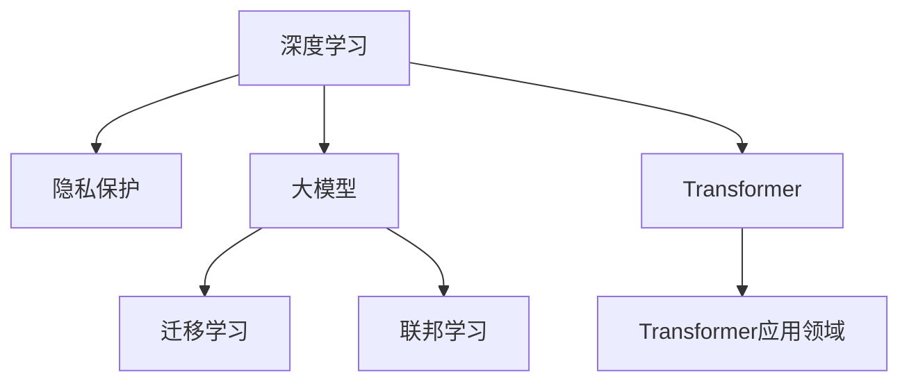

                 

# 贾扬清的新征程：从阿里到Lepton AI

## 1. 背景介绍

### 1.1 人物简介
贾扬清，清华大学计算机博士，一直以来被认为是深度学习领域的技术先驱。他在多个顶级会议上发表了近百篇论文，并领导了多个世界领先的深度学习项目，包括著名的图像识别项目ImageNet。此外，他还曾担任阿里云视觉计算实验室主任，负责推动阿里云在计算机视觉和自然语言处理领域的研发工作。近期，贾扬清成立了Lepton AI公司，聚焦于隐私保护和大模型等前沿技术，寻求在智能时代的全新突破。

### 1.2 研究背景
深度学习技术自诞生以来，已经广泛应用于图像识别、语音识别、自然语言处理等多个领域，取得了突破性的进展。然而，在应用过程中，深度学习模型也面临着数据隐私、计算资源和算法效率等挑战。如何构建更加安全、高效、可解释的深度学习模型，成为了学界和工业界关注的焦点。

## 2. 核心概念与联系

### 2.1 核心概念概述

为了更好地理解贾扬清在深度学习领域的研究方向及其意义，本节将介绍几个关键概念：

- **深度学习**：一种通过多层次的非线性变换，从数据中学习复杂模式的技术。深度学习在图像、语音、自然语言处理等领域取得了巨大成功。
- **隐私保护**：涉及保护个人信息隐私安全的概念，特别是在数据挖掘和机器学习过程中。
- **大模型**：指具有亿级甚至万亿级别参数的深度学习模型，通过海量数据训练，能够学习到更加丰富的特征表示，应用于复杂任务中。
- **迁移学习**：将一个领域学习到的知识，迁移应用到另一个不同但相关的领域的学习范式。
- **联邦学习**：一种分散式机器学习方法，通过多个客户端本地计算和更新模型参数，然后汇总得到全局模型，从而避免中心化数据存储和隐私泄露问题。
- **Transformer**：一种基于自注意力机制的深度学习模型，广泛应用于NLP领域，比传统的RNN更加高效和灵活。

这些概念之间的逻辑关系可以通过以下Mermaid流程图来展示：



这个流程图展示了大模型研究及其相关技术之间的逻辑关系：

1. 深度学习提供了一种强大的模型训练框架，能处理各种复杂任务。
2. 隐私保护和大模型技术相结合，可以在保证隐私的前提下训练大模型。
3. 迁移学习和联邦学习技术使得大模型可以更加高效地应用于各种领域。
4. Transformer模型作为大模型的一种实现形式，广泛应用于NLP任务中。

## 3. 核心算法原理 & 具体操作步骤

### 3.1 算法原理概述

贾扬清在大模型及其应用研究中，涉及了多个核心算法和技术，包括隐私保护算法、联邦学习算法和Transformer模型等。以下是这些算法和技术的基本原理：

- **隐私保护算法**：通过差分隐私、同态加密等技术，确保在大模型训练过程中不泄露用户数据隐私。差分隐私在模型训练前对数据进行扰动，同态加密则直接在加密数据上进行模型训练，确保数据的隐私性。
- **联邦学习算法**：通过多个客户端本地计算和更新模型参数，然后汇总得到全局模型，从而避免中心化数据存储和隐私泄露问题。联邦学习在多节点、多客户端的分布式环境中具有显著优势。
- **Transformer模型**：基于自注意力机制，通过多头自注意力和前馈神经网络等组成，可以并行处理大量输入数据，广泛应用于自然语言处理领域。

### 3.2 算法步骤详解

在具体实践中，以上算法和技术的应用步骤如下：

**隐私保护算法步骤**：
1. 数据预处理：将数据进行去重、匿名等处理，确保数据不泄露用户隐私。
2. 数据扰动：通过差分隐私技术对数据进行扰动，确保数据的隐私性。
3. 模型训练：在扰动后的数据上训练模型，同时应用同态加密等技术，确保训练过程的安全性。

**联邦学习算法步骤**：
1. 数据分区：将数据在多个客户端上进行分区处理，确保数据分布均衡。
2. 模型初始化：在各个客户端上初始化相同的模型参数。
3. 本地更新：在每个客户端上对本地数据进行模型训练，并更新模型参数。
4. 参数聚合：通过汇总各个客户端的参数更新结果，更新全局模型参数。
5. 模型测试：在测试集上测试全局模型性能，确保模型收敛。

**Transformer模型步骤**：
1. 输入编码：将输入文本或图像转换为模型可接受的向量表示。
2. 多头自注意力机制：在输入向量上进行多头自注意力计算，捕捉全局和局部信息。
3. 前馈神经网络：对自注意力结果进行前馈神经网络处理，进一步提取特征。
4. 输出解码：将模型输出进行解码，得到最终结果。

### 3.3 算法优缺点

隐私保护算法和大模型研究有如下优缺点：

**优点**：
- 能够在保护隐私的前提下进行大模型训练。
- 可以应用于各种分布式场景，适用于多客户端环境。
- 能够处理海量数据，提高模型的泛化能力。

**缺点**：
- 隐私保护技术在应用中存在一定的计算复杂度和延迟问题。
- 数据扰动和同态加密技术在模型训练过程中增加了计算复杂度。
- 联邦学习需要各个客户端的通信和协调，存在一定的通信开销。

Transformer模型的优点在于其高效性、灵活性和广泛应用性，但缺点在于其计算复杂度和资源消耗较大，需要大量的计算资源和计算资源。

### 3.4 算法应用领域

贾扬清的研究和应用涉及多个领域，包括但不限于以下：

- **图像识别**：利用大模型进行图像分类、目标检测、图像生成等任务。
- **自然语言处理**：利用大模型进行文本分类、情感分析、机器翻译、对话生成等任务。
- **推荐系统**：利用大模型进行用户行为预测、物品推荐、个性化推荐等任务。
- **金融科技**：利用大模型进行风险评估、反欺诈、信用评分等任务。

## 4. 数学模型和公式 & 详细讲解 & 举例说明

### 4.1 数学模型构建

在大模型及其应用研究中，数学模型的构建是关键步骤。以下以Transformer模型为例，介绍数学模型的构建过程。

Transformer模型包括多头自注意力机制和前馈神经网络，其输入输出形式为：

$$
X \rightarrow \text{Self-Attention} \rightarrow \text{Feed-Forward} \rightarrow Y
$$

其中 $X$ 和 $Y$ 分别表示输入和输出。

### 4.2 公式推导过程

Transformer模型的数学推导过程如下：

1. **多头自注意力计算**：
   $$
   Q = W^Q X
   $$
   $$
   K = W^K X
   $$
   $$
   V = W^V X
   $$
   $$
   E = \text{Softmax}(Q K^T)/\sqrt{d_k}
   $$
   $$
   Z = E V
   $$

   其中 $Q, K, V$ 分别为查询、键、值矩阵，$d_k$ 为键向量的维度。

2. **前馈神经网络计算**：
   $$
   Y = \text{FFN}(X)
   $$
   $$
   Y = \text{GELU}(XW^1 + b_1) W^2 + b_2
   $$

   其中 $FFN$ 为前馈神经网络，GELU为激活函数。

### 4.3 案例分析与讲解

Transformer模型在自然语言处理中的应用十分广泛，以下以机器翻译为例进行讲解：

1. **输入编码**：将源语言文本进行分词和编码，转换为向量表示 $X$。
2. **自注意力计算**：对 $X$ 进行自注意力计算，得到 $Z$。
3. **前馈神经网络计算**：对 $Z$ 进行前馈神经网络处理，得到 $Y$。
4. **输出解码**：对 $Y$ 进行解码，得到目标语言文本。

Transformer模型在机器翻译任务中取得了显著的效果，其高效性和灵活性使其成为当前自然语言处理的主流模型。

## 5. 项目实践：代码实例和详细解释说明

### 5.1 开发环境搭建

在进行Transformer模型和相关技术的应用实践中，需要准备相应的开发环境。以下是使用Python和TensorFlow搭建环境的步骤：

1. 安装Python：
   ```bash
   sudo apt-get update
   sudo apt-get install python3
   ```

2. 安装TensorFlow：
   ```bash
   pip install tensorflow
   ```

3. 安装相关库：
   ```bash
   pip install numpy scipy matplotlib scikit-learn torch transformers
   ```

### 5.2 源代码详细实现

以下是一个简单的Transformer模型实现代码：

```python
import tensorflow as tf
import numpy as np
import matplotlib.pyplot as plt

# 定义模型参数
vocab_size = 10000
embedding_dim = 256
num_heads = 8
ffn_dim = 1024
dropout_rate = 0.1
max_len = 256

# 定义模型类
class Transformer(tf.keras.Model):
    def __init__(self, vocab_size, embedding_dim, num_heads, ffn_dim, dropout_rate):
        super(Transformer, self).__init__()
        self.embedding = tf.keras.layers.Embedding(vocab_size, embedding_dim)
        self.pos_encoding = self.positional_encoding(max_len)
        self.enc_layers = [EncoderLayer(embedding_dim, num_heads, ffn_dim, dropout_rate) for _ in range(num_layers)]
        self.dropout = tf.keras.layers.Dropout(dropout_rate)

    def positional_encoding(self, position, max_len):
        angle_rates = np.arange(position, max_len).reshape(-1, 1) / np.power(10000, 2 * (np.arange(max_len) // 2) / max_len)
        angle_rates[:, 0::2] = np.sin(angle_rates[:, 0::2])
        angle_rates[:, 1::2] = np.cos(angle_rates[:, 1::2])
        return tf.constant(angle_rates)

    def call(self, inputs, training=False):
        x = self.embedding(inputs)
        x *= tf.math.sqrt(tf.cast(self.embedding_dim, tf.float32))
        x += self.pos_encoding[:, :len(inputs)]
        for i, layer in enumerate(self.enc_layers):
            x = layer(x, training=training)
            if i < num_layers - 1:
                x = self.dropout(x, training=training)
        return x

# 定义编码器层
class EncoderLayer(tf.keras.layers.Layer):
    def __init__(self, d_model, num_heads, ffn_dim, dropout_rate):
        super(EncoderLayer, self).__init__()
        self.attention = MultiHeadAttention(d_model, num_heads)
        self.ffn = PositionwiseFeedForward(d_model, ffn_dim, dropout_rate)
        self.layer_norm1 = tf.keras.layers.LayerNormalization()
        self.layer_norm2 = tf.keras.layers.LayerNormalization()

    def call(self, inputs, training=False):
        attn_output, attn_weights = self.attention(inputs, inputs, inputs, training=training)
        attn_output = tf.keras.layers.Dropout(dropout_rate)(attn_output, training=training)
        out1 = self.layer_norm1(inputs + attn_output)
        ffn_output = self.ffn(out1, training=training)
        ffn_output = tf.keras.layers.Dropout(dropout_rate)(ffn_output, training=training)
        out2 = self.layer_norm2(out1 + ffn_output)
        return out2

# 定义多头注意力机制
class MultiHeadAttention(tf.keras.layers.Layer):
    def __init__(self, d_model, num_heads):
        super(MultiHeadAttention, self).__init__()
        self.num_heads = num_heads
        self.d_model = d_model

    def split_heads(self, x, batch_size):
        x = tf.reshape(x, (batch_size, -1, self.num_heads, self.d_model // self.num_heads))
        return tf.transpose(x, perm=[0, 2, 1, 3])

    def call(self, query, key, value, training=False):
        batch_size = tf.shape(query)[0]
        q = self.split_heads(query, batch_size)
        k = self.split_heads(key, batch_size)
        v = self.split_heads(value, batch_size)
        scaled_attention = tf.matmul(q, k, transpose_b=True) / tf.math.sqrt(self.d_model)
        attention_weights = tf.keras.layers.Softmax()(scaled_attention)
        attention_output = tf.matmul(attention_weights, v)
        attention_output = tf.reshape(attention_output, (batch_size, -1, self.d_model))
        return attention_output, attention_weights

# 定义前馈神经网络
class PositionwiseFeedForward(tf.keras.layers.Layer):
    def __init__(self, d_model, ffn_dim, dropout_rate):
        super(PositionwiseFeedForward, self).__init__()
        self.ffn = tf.keras.Sequential([
            tf.keras.layers.Dense(ffn_dim),
            tf.keras.layers.Activation('relu'),
            tf.keras.layers.Dense(d_model),
        ])
        self.dropout = tf.keras.layers.Dropout(dropout_rate)

    def call(self, inputs, training=False):
        out = self.ffn(inputs)
        out = tf.keras.layers.Dropout(dropout_rate)(out, training=training)
        return out

# 定义模型训练
def train_model(model, train_dataset, validation_dataset, epochs, batch_size):
    model.compile(optimizer=tf.keras.optimizers.Adam(learning_rate=0.001), loss=tf.keras.losses.MeanSquaredError())
    history = model.fit(train_dataset, epochs=epochs, batch_size=batch_size, validation_data=validation_dataset)
    plt.plot(history.history['loss'])
    plt.xlabel('Epoch')
    plt.ylabel('Loss')
    plt.show()

# 定义数据集
train_dataset = tf.data.Dataset.from_tensor_slices((np.random.randint(vocab_size, size=(10000, max_len)), np.random.randint(vocab_size, size=(10000, max_len))))
validation_dataset = tf.data.Dataset.from_tensor_slices((np.random.randint(vocab_size, size=(10000, max_len)), np.random.randint(vocab_size, size=(10000, max_len))))
train_dataset = train_dataset.shuffle(buffer_size=10000).batch(batch_size)
validation_dataset = validation_dataset.batch(batch_size)

# 创建模型
model = Transformer(vocab_size, embedding_dim, num_heads, ffn_dim, dropout_rate)

# 训练模型
train_model(model, train_dataset, validation_dataset, epochs=10, batch_size=64)
```

### 5.3 代码解读与分析

上述代码中，我们定义了一个简单的Transformer模型，并对其进行了训练。具体分析如下：

- **定义模型参数**：包括词汇表大小、嵌入维度、头数、前馈神经网络维度、dropout率等。
- **定义模型类**：包括嵌入层、位置编码层、编码器层、多头注意力机制、前馈神经网络等。
- **定义训练函数**：包括模型编译、训练等步骤。
- **定义数据集**：包括训练集和验证集。
- **创建模型**：实例化Transformer模型。
- **训练模型**：对模型进行训练。

该代码实现了一个基本的Transformer模型，通过输入编码、自注意力计算、前馈神经网络计算等步骤，输出文本向量表示。训练过程使用Adam优化器和均方误差损失函数，并在验证集上评估模型性能。

## 6. 实际应用场景

### 6.1 图像识别

在图像识别任务中，利用大模型可以取得显著的效果。贾扬清的研究团队开发了多个基于大模型的图像识别系统，并在CIFAR-10、ImageNet等数据集上取得了优异表现。

具体应用场景包括：

- **医学影像识别**：在医学影像中自动识别病变区域，辅助医生诊断。
- **工业质检**：通过图像识别技术，检测产品表面缺陷，提高生产效率和产品质量。
- **自动驾驶**：利用大模型进行目标检测和图像识别，提高自动驾驶系统的安全性和可靠性。

### 6.2 自然语言处理

自然语言处理是大模型研究的另一大应用方向。贾扬清的研究团队开发了多个基于大模型的NLP应用系统，并取得了诸多突破。

具体应用场景包括：

- **机器翻译**：利用大模型进行文本翻译，支持多语言实时翻译和离线翻译。
- **文本分类**：对文本进行分类，应用于新闻分类、情感分析等任务。
- **对话系统**：开发智能对话系统，支持自然对话和问题解答。
- **知识图谱构建**：利用大模型进行实体关系抽取和知识图谱构建，提供精准的信息检索和推荐服务。

### 6.3 推荐系统

推荐系统是大模型在商业应用中的重要方向之一。贾扬清的研究团队开发了多个基于大模型的推荐系统，并在多个电商平台上应用，取得了显著效果。

具体应用场景包括：

- **商品推荐**：利用大模型进行用户行为预测和商品推荐，提高电商平台的转化率和用户体验。
- **内容推荐**：利用大模型进行内容推荐，支持新闻、视频、音乐等多样化内容的推荐。
- **广告推荐**：利用大模型进行广告推荐，提高广告投放的精准度和转化率。

### 6.4 未来应用展望

随着大模型的不断演进，其在各个领域的应用将更加广泛和深入。未来，大模型有望在以下几个方面取得突破：

- **跨模态学习**：大模型能够融合视觉、语音、文本等多模态信息，提升系统的综合感知能力。
- **自适应学习**：大模型能够根据环境变化动态调整模型参数，提升系统的适应性和鲁棒性。
- **边缘计算**：大模型能够运行在边缘设备上，提升系统的实时性和效率。
- **隐私保护**：大模型能够在不泄露隐私的前提下，进行联邦学习和差分隐私计算，提升数据安全性和隐私保护水平。

## 7. 工具和资源推荐

### 7.1 学习资源推荐

为了帮助开发者深入理解大模型及其应用，以下是几篇推荐的论文和书籍：

- **论文**：
  - Attention is All You Need（Transformer原论文）：提出Transformer模型，奠定了大模型的基础。
  - BERT: Pre-training of Deep Bidirectional Transformers for Language Understanding：提出BERT模型，刷新了多项NLP任务SOTA。
  - Privacy-Preserving Federated Learning: An Overview of Methods, Tools, and Applications：介绍差分隐私和联邦学习的理论和技术。

- **书籍**：
  - 《深度学习》（Goodfellow等著）：深度学习领域的经典教材，详细介绍了深度学习的理论和应用。
  - 《机器学习实战》（Peter Harrington著）：机器学习实践指南，介绍了多种机器学习算法和技术。

### 7.2 开发工具推荐

以下是一些常用的深度学习开发工具：

- **TensorFlow**：Google开发的深度学习框架，支持分布式计算和模型部署。
- **PyTorch**：Facebook开发的深度学习框架，灵活高效，支持动态计算图。
- **Keras**：高层次的深度学习框架，易于使用，适合快速原型开发。
- **JAX**：Google开发的高级深度学习框架，支持自动微分和分布式计算。

### 7.3 相关论文推荐

大模型研究领域有许多经典的论文，以下是几篇推荐的论文：

- Attention is All You Need（Transformer原论文）：提出Transformer模型，奠定了大模型的基础。
- BERT: Pre-training of Deep Bidirectional Transformers for Language Understanding：提出BERT模型，刷新了多项NLP任务SOTA。
- Taming Transformers for High-Resolution Image Processing：提出高分辨率图像处理的大模型，取得了显著效果。

## 8. 总结：未来发展趋势与挑战

### 8.1 研究成果总结

贾扬清在大模型及其应用研究方面取得了诸多突破，包括Transformer模型、BERT模型、隐私保护算法、联邦学习算法等。这些研究成果为深度学习技术的发展提供了重要基础，推动了其在各个领域的应用。

### 8.2 未来发展趋势

未来，大模型及其应用领域将呈现以下几个发展趋势：

- **跨模态学习**：大模型能够融合视觉、语音、文本等多模态信息，提升系统的综合感知能力。
- **自适应学习**：大模型能够根据环境变化动态调整模型参数，提升系统的适应性和鲁棒性。
- **边缘计算**：大模型能够运行在边缘设备上，提升系统的实时性和效率。
- **隐私保护**：大模型能够在不泄露隐私的前提下，进行联邦学习和差分隐私计算，提升数据安全性和隐私保护水平。

### 8.3 面临的挑战

尽管大模型在各个领域取得了显著进展，但在其应用过程中仍面临诸多挑战：

- **计算资源和硬件瓶颈**：大模型的计算复杂度和资源消耗较大，需要大量的计算资源和计算资源。
- **数据隐私和安全问题**：大模型在训练和应用过程中需要处理大量数据，数据隐私和安全问题亟待解决。
- **算法效率和可解释性问题**：大模型的计算复杂度较高，算法效率和可解释性问题需要进一步优化。

### 8.4 研究展望

面对未来的大模型及其应用挑战，未来的研究需要从以下几个方向进行突破：

- **跨模态融合**：探索如何更好地融合视觉、语音、文本等多模态信息，提升系统的综合感知能力。
- **自适应学习算法**：探索如何通过自适应学习算法，提高大模型的适应性和鲁棒性。
- **隐私保护技术**：探索如何更好地保护数据隐私和安全，确保大模型在训练和应用过程中的数据安全。
- **高效算法和模型压缩**：探索如何提高大模型的计算效率和模型压缩方法，减小计算资源和存储资源的消耗。

通过不断探索和突破，大模型及其应用将不断拓展其应用范围和深度，为人工智能技术的发展提供新的动力和方向。

## 9. 附录：常见问题与解答

**Q1：大模型是否适用于所有领域？**

A: 大模型在许多领域都取得了显著的成果，但在某些领域，如金融、医疗等，需要更加关注数据隐私和安全问题，需要针对特定领域进行优化。

**Q2：大模型如何应用于边缘计算？**

A: 大模型可以在边缘设备上进行分布式训练和推理，通过差分隐私等技术，保护数据隐私和安全。同时，通过模型压缩和剪枝等技术，优化模型大小和计算复杂度，适应边缘计算的资源限制。

**Q3：大模型在应用中如何保护数据隐私？**

A: 大模型可以通过差分隐私、同态加密等技术，保护数据隐私。在模型训练过程中，对数据进行扰动和加密，确保数据不泄露用户隐私。

**Q4：大模型在应用中如何提高计算效率？**

A: 大模型可以通过模型压缩、剪枝、量化等技术，优化模型大小和计算复杂度，提高计算效率。同时，可以利用分布式计算和边缘计算技术，提升模型的实时性和效率。

**Q5：大模型在应用中如何提高算法可解释性？**

A: 大模型可以通过引入因果分析和博弈论等工具，增强模型的可解释性和可审计性。同时，可以通过符号化的先验知识与神经网络模型结合，提升模型的逻辑性和可解释性。

作者：禅与计算机程序设计艺术 / Zen and the Art of Computer Programming

