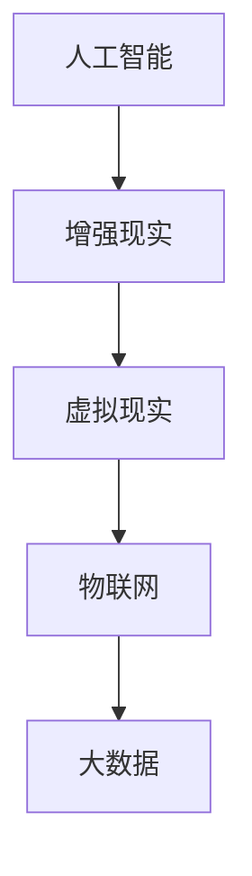

                 

# 赋能人类：释放个体潜能

## 1. 背景介绍

在当今这个快速变化的数字时代，技术正在以前所未有的速度重塑我们的世界。从云计算到人工智能，从区块链到物联网，技术的力量让无数不可能变成了可能。然而，尽管技术赋予了人们前所未有的能力，却也带来了新的挑战。如何确保技术的普及与运用能够真正赋能人类，释放每个人的潜力，成为摆在技术创新者面前的一大课题。本文将深入探讨这一问题，并提出一些可能的解决方案。

## 2. 核心概念与联系

### 2.1 核心概念概述

要理解如何通过技术赋能人类，首先需要理解几个核心概念：

- **人工智能（AI）**：一种模拟人类智能的技术，包括学习、推理、决策等能力。AI技术的进步正在改变许多行业的运作方式，从医疗到金融，从教育到零售。

- **增强现实（AR）**：通过计算机生成信息叠加到现实世界，增强用户的感知体验。AR技术在教育、培训、娱乐等领域有着广泛的应用前景。

- **虚拟现实（VR）**：一种通过计算机生成的仿真环境，提供沉浸式体验。VR技术在培训、医疗、游戏等领域有重要应用。

- **物联网（IoT）**：通过互联网连接各种设备，实现设备间的互联互通。物联网技术正在改变我们的生活方式，从智能家居到智能城市。

- **大数据（Big Data）**：指大量、高速、多样化的数据。大数据技术帮助人们从海量数据中提取有价值的信息，支持决策制定。

### 2.2 核心概念原理和架构的 Mermaid 流程图



这个流程图展示了几个核心概念之间的联系：

- **人工智能**为增强现实、虚拟现实、物联网、大数据等技术提供了智能支持。
- **增强现实**、**虚拟现实**和**物联网**通过数据收集和处理，使AI技术能够更好地理解和预测用户需求。
- **大数据**技术为AI提供了海量的数据源，使得AI能够进行更加精准的预测和决策。

## 3. 核心算法原理 & 具体操作步骤

### 3.1 算法原理概述

要通过技术赋能人类，首先需要理解AI的原理。AI的核心是机器学习，包括监督学习、无监督学习和强化学习。机器学习通过算法让机器能够从数据中学习规律，从而进行预测和决策。

### 3.2 算法步骤详解

以深度学习中的卷积神经网络（CNN）为例，其基本步骤如下：

1. **数据预处理**：将原始数据转换为网络可以处理的格式，如将图像数据转换为像素值矩阵。
2. **网络构建**：设计多层卷积和池化层，以及全连接层，构建网络结构。
3. **模型训练**：使用训练数据对模型进行训练，通过反向传播算法更新网络参数。
4. **模型评估**：使用测试数据对模型进行评估，计算准确率、精确率、召回率等指标。
5. **模型应用**：将训练好的模型应用到实际问题中，进行预测和决策。

### 3.3 算法优缺点

深度学习的优点在于其强大的数据处理能力和泛化能力，能够在各种领域取得卓越的性能。然而，深度学习也存在一些缺点：

- **数据依赖性强**：深度学习模型需要大量标注数据进行训练，标注数据的获取成本较高。
- **计算资源消耗大**：深度学习模型参数量大，计算资源需求高，训练和推理速度慢。
- **可解释性差**：深度学习模型通常是"黑盒"，难以解释其内部决策过程。

### 3.4 算法应用领域

深度学习已经在图像识别、语音识别、自然语言处理等领域取得了巨大成功。在医疗领域，深度学习被用于疾病诊断、影像分析等；在金融领域，深度学习被用于风险评估、交易预测等；在教育领域，深度学习被用于智能辅导、情感分析等。

## 4. 数学模型和公式 & 详细讲解 & 举例说明

### 4.1 数学模型构建

以图像分类为例，常用的深度学习模型是卷积神经网络（CNN）。其数学模型可以表示为：

$$
\text{输出} = \text{CNN}(\text{输入}) = \text{softmax}(\text{fc}(\text{conv}(\text{maxpool}(\text{conv}(\text{input})))) 
$$

其中，$\text{conv}$表示卷积层，$\text{maxpool}$表示池化层，$\text{fc}$表示全连接层，$\text{softmax}$表示输出层。

### 4.2 公式推导过程

以卷积层的计算为例，其公式推导如下：

$$
\text{卷积核} * \text{输入数据} = \sum_{i,j} \text{卷积核}_{i,j} \cdot \text{输入数据}_{i,j}
$$

其中，$\text{卷积核}$和$\text{输入数据}$都是二维数组，$\text{卷积核}_{i,j}$表示卷积核中位置$(i,j)$的权重，$\text{输入数据}_{i,j}$表示输入数据中位置$(i,j)$的像素值。

### 4.3 案例分析与讲解

以图像分类为例，使用MNIST数据集进行训练。首先，将原始图像数据归一化，然后使用多个卷积层和池化层进行特征提取，最后使用全连接层进行分类。在训练过程中，使用交叉熵损失函数进行优化，使用随机梯度下降算法更新网络参数。训练完成后，使用测试集评估模型性能，输出结果为预测标签和真实标签之间的差异。

## 5. 项目实践：代码实例和详细解释说明

### 5.1 开发环境搭建

要搭建深度学习项目，需要安装以下软件：

- Python：作为主要开发语言，版本为3.7及以上。
- TensorFlow：深度学习框架，支持CPU和GPU计算。
- PyTorch：深度学习框架，提供动态计算图功能。
- Keras：高级神经网络API，易于使用。

### 5.2 源代码详细实现

以下是一个使用TensorFlow实现图像分类的示例代码：

```python
import tensorflow as tf
from tensorflow.keras import layers

# 定义模型
model = tf.keras.Sequential([
    layers.Conv2D(32, (3, 3), activation='relu', input_shape=(28, 28, 1)),
    layers.MaxPooling2D((2, 2)),
    layers.Flatten(),
    layers.Dense(10, activation='softmax')
])

# 编译模型
model.compile(optimizer='adam', loss='sparse_categorical_crossentropy', metrics=['accuracy'])

# 训练模型
model.fit(train_images, train_labels, epochs=5, validation_data=(test_images, test_labels))

# 评估模型
model.evaluate(test_images, test_labels)
```

### 5.3 代码解读与分析

上述代码中，首先定义了一个包含卷积层、池化层和全连接层的神经网络模型。然后使用`compile`方法指定优化器、损失函数和评估指标。最后，使用`fit`方法进行模型训练，使用`evaluate`方法进行模型评估。

## 6. 实际应用场景

### 6.1 医疗健康

深度学习在医疗健康领域有着广泛的应用。例如，使用深度学习模型进行医学影像分析，可以自动检测出肿瘤、病变等。使用自然语言处理技术，可以自动分析患者病历，提供诊断建议。

### 6.2 智能家居

智能家居通过物联网技术，将家庭设备互联互通。使用深度学习技术，可以优化家庭能源消耗，提高家庭安全性和舒适度。例如，使用深度学习模型分析家庭用电数据，可以预测家庭用电高峰，优化电力分配。

### 6.3 金融行业

金融行业是深度学习应用的重要领域。使用深度学习模型进行风险评估，可以准确预测贷款违约率、信用评分等。使用自然语言处理技术，可以自动分析金融报告，提供投资建议。

## 7. 工具和资源推荐

### 7.1 学习资源推荐

- Coursera：提供深度学习、机器学习、自然语言处理等课程，涵盖从基础到高级的内容。
- Udacity：提供深度学习、计算机视觉、自然语言处理等课程，强调实战应用。
- GitHub：提供大量开源项目和代码示例，方便学习和实践。

### 7.2 开发工具推荐

- TensorFlow：提供灵活的计算图机制，支持CPU和GPU计算，广泛应用于深度学习领域。
- PyTorch：提供动态计算图机制，易于使用，适用于研究和开发。
- Keras：提供高级API，易于上手，适合快速迭代开发。

### 7.3 相关论文推荐

- AlexNet：ImageNet大规模视觉识别挑战赛的冠军，开启了深度学习时代。
- ResNet：解决了深度神经网络退化问题，提高了网络的深度和精度。
- RNN与LSTM：在自然语言处理领域，解决了长序列数据处理问题，支持文本生成和情感分析等任务。

## 8. 总结：未来发展趋势与挑战

### 8.1 研究成果总结

深度学习技术在多个领域取得了显著成果，推动了技术的进步和产业的发展。然而，深度学习也面临一些挑战，如数据依赖性强、计算资源消耗大、可解释性差等。

### 8.2 未来发展趋势

未来，深度学习技术将继续发展，以下几个方向值得关注：

- **联邦学习**：通过分布式计算，降低数据依赖性，保护数据隐私。
- **边缘计算**：将计算任务推向设备端，提高计算效率，降低延迟。
- **可解释性AI**：开发可解释性AI模型，提高模型的透明度和可解释性。
- **跨领域学习**：将不同领域的知识进行融合，提高模型的泛化能力和适应性。

### 8.3 面临的挑战

深度学习技术面临着一些挑战：

- **数据隐私**：大规模数据训练需要高昂的成本和隐私风险，如何保护数据隐私成为重要问题。
- **计算资源**：深度学习模型参数量大，计算资源消耗大，如何提高计算效率成为重要问题。
- **模型可解释性**：深度学习模型通常是"黑盒"，难以解释其内部决策过程，如何提高模型可解释性成为重要问题。

### 8.4 研究展望

未来，深度学习技术需要在以下几个方面进行研究：

- **联邦学习**：通过分布式计算，降低数据依赖性，保护数据隐私。
- **边缘计算**：将计算任务推向设备端，提高计算效率，降低延迟。
- **可解释性AI**：开发可解释性AI模型，提高模型的透明度和可解释性。
- **跨领域学习**：将不同领域的知识进行融合，提高模型的泛化能力和适应性。

## 9. 附录：常见问题与解答

### Q1: 什么是深度学习？

A: 深度学习是一种模拟人类智能的技术，通过多层神经网络实现数据的复杂非线性映射。深度学习在图像识别、语音识别、自然语言处理等领域有广泛应用。

### Q2: 如何降低深度学习模型的计算资源消耗？

A: 可以采用以下方法降低计算资源消耗：
- 使用GPU加速计算。
- 使用量化技术，将浮点数计算转为定点计算。
- 使用模型剪枝技术，去除不必要的层和参数。
- 使用模型压缩技术，优化模型结构。

### Q3: 如何提高深度学习模型的可解释性？

A: 可以采用以下方法提高模型的可解释性：
- 使用可视化工具，可视化模型输入和输出。
- 使用可解释性模型，如LIME、SHAP等。
- 设计更简单的模型，便于理解。

### Q4: 深度学习在医疗健康领域有哪些应用？

A: 深度学习在医疗健康领域的应用包括：
- 医学影像分析，自动检测肿瘤、病变等。
- 患者病历分析，提供诊断建议。
- 药物研发，预测药物效果和副作用。

### Q5: 智能家居如何通过深度学习优化能源消耗？

A: 智能家居通过物联网技术将设备互联互通，使用深度学习模型分析家庭用电数据，预测用电高峰，优化电力分配，提高能源利用效率。

---

作者：禅与计算机程序设计艺术 / Zen and the Art of Computer Programming

