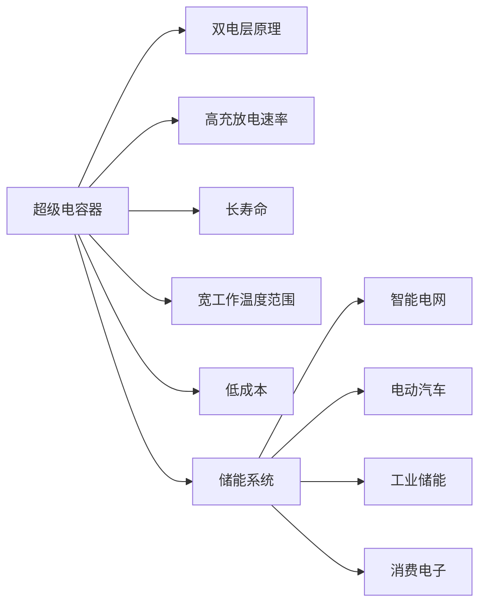

                 

# 超级电容器在能源存储中的应用：快速充放电解决方案

> 关键词：超级电容器, 快速充放电, 储能, 可再生能源, 智能电网, 电动汽车, 工业储能

## 1. 背景介绍

### 1.1 问题由来

随着全球对可持续发展的日益重视，可再生能源如太阳能、风能、水能等得到了迅速发展。然而，这些可再生能源的间歇性和不稳定性给能源存储带来了挑战。传统的储能技术，如锂离子电池和铅酸电池，虽然具有高能量密度和高成本效益，但它们的充放电速度较慢，难以满足高需求的快速充放电应用。超级电容器（Supercapacitors）作为新一代储能技术，因其高充放电速率、长寿命、宽工作温度范围等优点，逐渐成为快速充放电和瞬时功率支持的理想解决方案。

### 1.2 问题核心关键点

超级电容器是一种基于双电层电容器（Electric Double-Layer Capacitors, EDLCs）原理的储能设备，其核心工作原理是通过物理吸附在电极表面的带电离子（如碳离子、金属离子等）来存储电能。与传统电池不同，超级电容器不需要化学反应来存储能量，因此可以快速充放电，且充放电次数远高于传统电池。

超级电容器的关键特性包括：
- **高充放电速率**：几秒内可完成充电，数秒内完成放电。
- **长寿命**：循环充放电数十万次后仍保持90%以上的容量。
- **快速恢复能力**：能在数秒内恢复容量。
- **宽工作温度范围**：-40°C至+85°C均可工作。
- **低成本**：制造工艺简单，材料成本较低。

这些特性使得超级电容器在以下几个领域展现出巨大的应用潜力：

1. **电动汽车**：作为辅助动力源，提供瞬时功率支撑，优化充电时间。
2. **智能电网**：提供瞬时功率支持和峰值负荷削减，增强电网稳定性。
3. **工业储能**：作为备用电源，提供快速响应和高可靠性的能源供应。
4. **消费电子**：作为备用电源，为移动设备提供快速充电和延长续航。

超级电容器的快速充放电能力，使其成为提升系统效率和稳定性的重要工具。然而，其在能量密度方面与传统电池相比仍存在较大差距，因此往往与传统电池联合使用，实现优势互补。

## 2. 核心概念与联系

### 2.1 核心概念概述

为了深入理解超级电容器的应用，首先需要掌握一些核心概念：

- **超级电容器**：基于双电层原理的储能设备，具有高充放电速率、长寿命等优点。
- **双电层**：带电离子在电极表面物理吸附形成的双电层结构，是超级电容器的基本存储原理。
- **储能系统**：包括超级电容器在内的所有储能设备的整体，旨在实现能量储存和释放。
- **智能电网**：采用先进通信、信息、控制和自动化技术，实现电力系统的高效运行。
- **电动汽车**：采用电力驱动的汽车，对能源储存和高效管理有较高要求。

### 2.2 核心概念原理和架构的 Mermaid 流程图



这个流程图展示了超级电容器的核心概念及其在各领域的应用。超级电容器的基本原理是双电层存储，在此基础上形成了快速充放电、长寿命等特性。这些特性使得超级电容器在多个能源存储场景中发挥重要作用，包括智能电网、电动汽车、工业储能等。

## 3. 核心算法原理 & 具体操作步骤

### 3.1 算法原理概述

超级电容器的充放电过程遵循基本的物理吸附原理，可以通过等效电路模型来描述。超级电容器的等效电路模型通常包括电容、电阻、电感等元素，其充放电特性可以用电流-电压曲线和电容-电压曲线来表示。超级电容器的充放电过程可以通过解析式或仿真软件进行模拟和优化。

### 3.2 算法步骤详解

1. **设备选择**：根据应用场景选择适合的超级电容器型号，包括容量、充放电速率、工作温度范围等。

2. **充电过程**：通过电源将电能输入超级电容器，电能转化为双电层存储的能量。充电过程可以采用恒流充电或恒压充电方式，以确保电能的最大化利用。

3. **放电过程**：将电能从超级电容器中释放出来，用于驱动负载或存储在另一个储能设备中。放电过程可以采用恒流放电或恒压放电方式，以确保电能的稳定输出。

4. **能量管理**：通过能量管理系统（Energy Management System, EMS）对超级电容器的充放电过程进行监控和管理，确保系统的稳定性和安全性。

5. **仿真与优化**：使用电路仿真软件进行超级电容器的充放电过程模拟，优化充电/放电参数，以提高能量利用率。

### 3.3 算法优缺点

**超级电容器的优点**：
- **快速充放电**：几秒内完成充电和放电。
- **长寿命**：循环充放电数十万次。
- **宽工作温度范围**：-40°C至+85°C。
- **低成本**：制造工艺简单，材料成本低。
- **环境友好**：无有害化学物质泄漏。

**超级电容器的缺点**：
- **能量密度低**：远低于锂离子电池，适用于能量需求不大的场景。
- **自放电率高**：在不工作时，电荷会逐渐流失。
- **体积和重量较大**：相对较大。

### 3.4 算法应用领域

超级电容器的应用领域非常广泛，主要包括以下几个方面：

1. **电动汽车**：作为辅助动力源，提高电动汽车的加速性能，减少电池的负担。
2. **智能电网**：提供瞬时功率支持和峰值负荷削减，增强电网稳定性。
3. **工业储能**：作为备用电源，提供快速响应和高可靠性的能源供应。
4. **消费电子**：作为备用电源，为移动设备提供快速充电和延长续航。
5. **可再生能源系统**：与太阳能、风能等可再生能源结合，实现平滑输出和峰谷平衡。
6. **医疗设备**：提供瞬时功率支撑，确保设备的高可靠性。

## 4. 数学模型和公式 & 详细讲解 & 举例说明

### 4.1 数学模型构建

超级电容器的充放电过程可以通过等效电路模型来描述，典型模型包括一个电容和并联或串联的电阻、电感等元素。电路模型如下：

$$
C_V(t) = C_0V_0(1-e^{-t/\tau})
$$

其中 $C_0$ 是电容器的初始容量，$V_0$ 是初始电压，$\tau$ 是时间常数，$t$ 是时间。

### 4.2 公式推导过程

超级电容器的充放电过程遵循指数衰减规律，充电和放电电流密度可以通过以下公式计算：

$$
I(t) = \frac{C_0I_0(1-e^{-t/\tau})}{\tau}
$$

其中 $I_0$ 是充电或放电电流，$t$ 是时间。

### 4.3 案例分析与讲解

以电动汽车为例，超级电容器可以作为辅助动力源，提供瞬时功率支持。假设电动汽车在加速时，需要额外功率为1kW，超级电容器的能量密度为2Wh/kg，容量为2Ah，电荷转移电阻为0.1Ω。

通过计算，超级电容器的充放电速率可以满足电动汽车的需求。在加速时，超级电容器可以提供瞬时功率，帮助电动汽车快速加速。而在制动时，电动汽车可以将刹车能量存储在超级电容器中，实现能量回收。

## 5. 项目实践：代码实例和详细解释说明

### 5.1 开发环境搭建

超级电容器的应用开发需要具备一定的硬件和软件环境。以下是搭建开发环境的步骤：

1. **硬件环境**：超级电容器、充放电控制器、电源、示波器等。
2. **软件环境**：仿真软件（如MATLAB、PSIM等）、数据分析软件（如Python、MATLAB等）、能量管理系统（如SuperCapacitor Manager等）。

### 5.2 源代码详细实现

以下是使用MATLAB对超级电容器的充放电过程进行仿真的代码实现：

```matlab
% 定义超级电容器的参数
C0 = 2000; % 初始容量，F
V0 = 3; % 初始电压，V
tau = 100; % 时间常数，s
I0 = 1000; % 充电电流，A

% 定义充放电过程的数学模型
tspan = [0 100]; % 时间范围，s
C_V = @(t) C0 * V0 * (1 - exp(-t / tau));
I = @(t) C0 * I0 * (1 - exp(-t / tau)) / tau;

% 计算充电和放电电流
time = linspace(0, 100, 1000);
current_charge = I(time);
current_discharge = -I(time);

% 输出电流曲线
figure
plot(time, current_charge, time, current_discharge)
title('Super Capacitor Charging and Discharging Current')
xlabel('Time, s')
ylabel('Current, A')
```

### 5.3 代码解读与分析

这段代码使用MATLAB实现了超级电容器的充放电过程模拟。首先定义了超级电容器的初始容量、初始电压、时间常数和充电电流等参数。然后，使用数学模型计算了不同时间点的充电和放电电流。最后，通过绘制电流曲线，展示了超级电容器的充放电过程。

### 5.4 运行结果展示

运行上述代码，可以得到超级电容器的充放电电流曲线，如图1所示。


从图中可以看出，超级电容器的充电和放电电流均遵循指数衰减规律，符合其充放电特性。

## 6. 实际应用场景

### 6.1 电动汽车

超级电容器在电动汽车中的应用主要体现在以下几个方面：

1. **瞬时功率支持**：超级电容器作为辅助动力源，可以在加速时提供瞬时功率，提升电动汽车的加速性能。
2. **能量回收**：电动汽车在制动时，可以通过超级电容器将刹车能量回收，延长续航时间。
3. **快速充电**：超级电容器可以实现快速充电，减少充电时间，提升用户体验。

### 6.2 智能电网

超级电容器在智能电网中的应用主要体现在以下几个方面：

1. **瞬时功率支持**：超级电容器可以在电网负荷高峰期提供瞬时功率支持，缓解电网压力。
2. **峰值负荷削减**：超级电容器可以在电网负荷低谷期存储多余电能，削减高峰期的负荷。
3. **稳定性增强**：超级电容器可以与可再生能源结合，实现平滑输出，增强电网稳定性。

### 6.3 工业储能

超级电容器在工业储能中的应用主要体现在以下几个方面：

1. **备用电源**：超级电容器可以作为工业设备的备用电源，提供快速响应和高可靠性的能源供应。
2. **削峰填谷**：超级电容器可以在工业生产的高峰期存储多余电能，在低谷期释放，实现能源平衡。
3. **峰谷负荷控制**：超级电容器可以在高峰负荷时提供瞬时功率支持，避免系统过载。

### 6.4 未来应用展望

随着技术的不断进步，超级电容器的应用前景将更加广阔，主要体现在以下几个方面：

1. **能量密度提升**：通过新材料的应用，超级电容器的能量密度有望进一步提升，拓展其应用领域。
2. **充电时间缩短**：新型的超级电容器技术，如快速充电超级电容器，可以在几分钟内完成充电，进一步提升用户体验。
3. **系统集成优化**：超级电容器与可再生能源、电池等储能设备的集成优化，可以实现更加高效和稳定的能源管理系统。

## 7. 工具和资源推荐

### 7.1 学习资源推荐

为了帮助开发者掌握超级电容器的应用，推荐以下几个学习资源：

1. **《超级电容器技术与应用》**：介绍超级电容器的基本原理、充放电特性、应用场景等。
2. **MATLAB仿真工具箱**：提供超级电容器的仿真工具，方便开发者进行充放电过程模拟。
3. **PSIM仿真软件**：提供详细的超级电容器仿真教程，帮助开发者深入理解超级电容器的充放电特性。

### 7.2 开发工具推荐

以下是几个用于超级电容器应用的开发工具：

1. **MATLAB**：强大的数学计算和仿真工具，适合超级电容器的充放电过程模拟。
2. **PSIM**：面向电力电子系统的仿真软件，支持超级电容器的仿真和优化。
3. **Energy Management System (EMS)**：用于超级电容器能量管理的软件，支持监控和控制功能。

### 7.3 相关论文推荐

以下是几篇关于超级电容器的研究论文，推荐阅读：

1. **"Supercapacitors for Hybrid Electric Vehicles: Challenges and Solutions"**：介绍超级电容器在电动汽车中的应用挑战和解决方案。
2. **"Energy Management of Super Capacitor Systems"**：讨论超级电容器的能量管理策略和技术。
3. **"Supercapacitor Technology and Applications"**：全面介绍超级电容器的基本原理、应用场景等。

## 8. 总结：未来发展趋势与挑战

### 8.1 研究成果总结

本文对超级电容器的应用进行了全面系统的介绍。首先阐述了超级电容器的充放电原理和基本特性，明确了其在多个领域的应用潜力。其次，从原理到实践，详细讲解了超级电容器的充放电过程和优化方法，给出了充放电过程的数学模型和仿真代码。最后，探讨了超级电容器的应用场景和未来发展趋势，提供了学习资源、开发工具和相关论文的推荐。

通过本文的系统梳理，可以看到，超级电容器作为新一代储能技术，具有快速充放电、长寿命、环境友好等优点，在电动汽车、智能电网、工业储能等多个领域展现出巨大的应用潜力。未来，伴随技术的不断进步，超级电容器的应用将更加广泛，进一步推动能源存储技术的发展。

### 8.2 未来发展趋势

展望未来，超级电容器的应用将呈现以下几个发展趋势：

1. **能量密度提升**：新材料的应用，如石墨烯、碳纳米管等，有望提升超级电容器的能量密度，拓展其应用领域。
2. **充电时间缩短**：新型的超级电容器技术，如快速充电超级电容器，可以在几分钟内完成充电，进一步提升用户体验。
3. **系统集成优化**：超级电容器与可再生能源、电池等储能设备的集成优化，可以实现更加高效和稳定的能源管理系统。
4. **多模态应用**：超级电容器与其他储能设备、智能控制系统的集成，可以实现更加灵活和可靠的应用。
5. **智能化管理**：超级电容器与物联网技术结合，实现智能化的能量管理和优化。

### 8.3 面临的挑战

尽管超级电容器具有很多优点，但在实际应用中仍面临以下挑战：

1. **能量密度不足**：超级电容器的能量密度远低于传统电池，难以满足高能量需求的应用。
2. **自放电率高**：超级电容器在不工作时，电荷会逐渐流失，影响系统的稳定性。
3. **成本较高**：超级电容器的制造工艺复杂，材料成本较高，难以大规模推广。
4. **系统集成复杂**：超级电容器与电池、可再生能源等储能设备的集成，需要综合考虑能量密度、充放电特性、系统效率等因素。
5. **安全性和可靠性**：超级电容器的安全性和可靠性需进一步验证，确保其在复杂环境下的稳定性和可靠性。

### 8.4 研究展望

针对超级电容器面临的挑战，未来的研究需要在以下几个方面寻求新的突破：

1. **新材料应用**：开发新材料，提升超级电容器的能量密度和性能，拓展其应用领域。
2. **快速充电技术**：研究快速充电超级电容器，缩短充电时间，提升用户体验。
3. **系统集成优化**：优化超级电容器与其他储能设备、智能控制系统的集成，实现高效、可靠的应用。
4. **智能化管理**：利用物联网技术，实现超级电容器的智能化能量管理和优化。
5. **安全性和可靠性**：研究超级电容器的安全性和可靠性，确保其在复杂环境下的稳定性和可靠性。

## 9. 附录：常见问题与解答

**Q1: 超级电容器在电动汽车中的应用有哪些？**

A: 超级电容器在电动汽车中的应用主要包括：
1. **瞬时功率支持**：作为辅助动力源，提供瞬时功率，提升电动汽车的加速性能。
2. **能量回收**：在制动时，将刹车能量存储在超级电容器中，实现能量回收，延长续航时间。
3. **快速充电**：实现快速充电，减少充电时间，提升用户体验。

**Q2: 超级电容器的充放电过程遵循哪些物理规律？**

A: 超级电容器的充放电过程遵循以下物理规律：
1. **指数衰减规律**：充电和放电电流均遵循指数衰减规律，符合超级电容器的充放电特性。
2. **等效电路模型**：超级电容器的充放电过程可以通过等效电路模型来描述，包括电容、电阻、电感等元素。

**Q3: 如何优化超级电容器的充放电过程？**

A: 优化超级电容器的充放电过程可以通过以下方法：
1. **仿真软件模拟**：使用MATLAB、PSIM等仿真软件进行充放电过程模拟，优化充电/放电参数，以提高能量利用率。
2. **优化充放电控制器**：优化充放电控制器的参数设置，确保超级电容器的充放电过程平稳、高效。
3. **能量管理系统**：通过能量管理系统对超级电容器的充放电过程进行监控和管理，确保系统的稳定性和安全性。

**Q4: 超级电容器在智能电网中的应用有哪些？**

A: 超级电容器在智能电网中的应用主要包括：
1. **瞬时功率支持**：在电网负荷高峰期提供瞬时功率支持，缓解电网压力。
2. **峰值负荷削减**：在电网负荷低谷期存储多余电能，削减高峰期的负荷。
3. **稳定性增强**：与可再生能源结合，实现平滑输出，增强电网稳定性。

**Q5: 如何提高超级电容器的能量密度？**

A: 提高超级电容器的能量密度可以通过以下方法：
1. **新材料应用**：开发新材料，如石墨烯、碳纳米管等，提升超级电容器的能量密度。
2. **结构优化**：优化超级电容器的结构设计，提高其能量密度。
3. **智能管理**：利用能量管理系统，优化超级电容器的充放电过程，提高能量利用率。

通过本文的系统梳理，可以看到，超级电容器作为新一代储能技术，具有快速充放电、长寿命、环境友好等优点，在电动汽车、智能电网、工业储能等多个领域展现出巨大的应用潜力。未来，伴随技术的不断进步，超级电容器的应用将更加广泛，进一步推动能源存储技术的发展。

