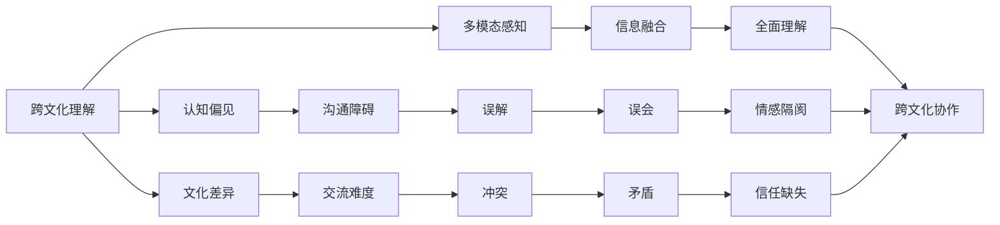

                 

## 1. 背景介绍

在当今全球化时代，人类社会的交流范围和频率达到了前所未有的高度。然而，文化差异所带来的认知挑战也愈发凸显，这对人工智能技术的应用提出了新的要求。跨文化理解（Cross-Cultural Understanding）不仅是人类认知能力的重要组成部分，也是人工智能系统设计和发展的重要目标之一。本文旨在探讨跨文化理解的概念、挑战以及技术实现方法，为人工智能系统的跨文化应用提供参考。

## 2. 核心概念与联系

### 2.1 核心概念概述

- **跨文化理解（Cross-Cultural Understanding）**：指在不同的文化背景下，能够理解和适应他人的言语、行为、习惯和价值观的能力。这一能力对于国际交流、跨文化教育、全球化经济合作等方面具有重要意义。
- **认知偏见（Cognitive Bias）**：由于文化、社会、教育等多种因素的影响，个体在认知过程中可能产生某些固定的偏见，这些偏见会影响其判断和决策。
- **文化差异（Cultural Differences）**：不同文化背景的人在语言、行为、信仰等方面存在差异，这种差异可能对跨文化交流产生阻碍。
- **多模态感知（Multimodal Perception）**：在跨文化理解过程中，不仅要理解语言文本，还需要结合语音、图像、肢体语言等多种信息源。

### 2.2 核心概念联系

通过以下Mermaid流程图展示了核心概念之间的联系：



- **认知偏见**和**文化差异**：认知偏见通常受到文化背景的影响，从而对跨文化理解造成障碍。
- **多模态感知**：在跨文化交流中，多模态信息的融合有助于全面理解对方的行为和情感，减少误解和冲突。
- **沟通障碍、交流难度、误解、冲突、误会、情感隔阂、信任缺失**：这些都是由于跨文化理解不足所导致的问题。
- **全面理解、跨文化协作**：通过提升跨文化理解能力，可以有效缓解上述问题，促进国际合作和交流。

## 3. 核心算法原理 & 具体操作步骤

### 3.1 算法原理概述

跨文化理解的人工智能技术，通常基于语言模型和感知模型。语言模型用于理解文本的语义，感知模型用于分析语音、图像等多模态信息。两者结合，可以实现对不同文化背景的全面理解。

具体而言，语言模型通过大量双语或多语数据训练，学习语言的语义和语法规则。感知模型则通过图像识别、语音识别等技术，理解图像、语音等非语言信息。两者融合后，模型能够理解和生成符合不同文化背景的语言表达，实现跨文化交流。

### 3.2 算法步骤详解

#### 3.2.1 数据收集与预处理

1. **数据收集**：收集不同语言和文化背景下的文本、语音、图像等数据。
2. **数据预处理**：清洗数据，去除噪声，进行标注，使其适用于语言模型和感知模型的训练。

#### 3.2.2 语言模型训练

1. **模型选择**：选择或训练合适的语言模型，如BERT、GPT等。
2. **双语或多语训练**：使用双语或多语数据集，训练语言模型。
3. **语义理解**：模型能够理解不同语言之间的语义关系，实现跨语言翻译和语义转换。

#### 3.2.3 感知模型训练

1. **感知模型选择**：选择或训练合适的感知模型，如卷积神经网络（CNN）、循环神经网络（RNN）等。
2. **多模态数据处理**：对收集到的语音、图像等多模态数据进行处理，提取特征。
3. **多模态融合**：将多模态数据与语言模型输出融合，实现全面理解。

#### 3.2.4 模型微调和评估

1. **微调**：在实际应用中，使用小规模标注数据对模型进行微调，以适应特定场景。
2. **评估**：使用测试数据集评估模型性能，优化模型参数。

### 3.3 算法优缺点

#### 3.3.1 优点

- **适应性强**：能够处理多种语言和文化背景，提升跨文化交流的便捷性和效率。
- **信息融合**：结合多模态信息，提高理解全面性和准确性。
- **快速迭代**：基于深度学习框架，模型训练和微调效率高，能够快速适应新场景。

#### 3.3.2 缺点

- **数据依赖**：需要大量双语或多语数据，数据收集和标注成本高。
- **模型复杂性**：多模态融合和双向翻译等任务复杂，模型结构复杂。
- **资源消耗大**：训练和推理过程需要大量计算资源，难以在低配置设备上运行。

### 3.4 算法应用领域

- **国际合作与交流**：用于国际会议、多语言客服、跨文化教育等领域。
- **文化研究与保护**：用于语言学研究、文化遗产保护、跨文化旅游等领域。
- **全球化经济**：用于跨境电商、国际贸易、全球供应链管理等领域。

## 4. 数学模型和公式 & 详细讲解 & 举例说明

### 4.1 数学模型构建

在跨文化理解中，我们通常使用以下数学模型：

1. **语言模型**：用于理解和生成自然语言文本。常用的数学模型包括基于神经网络的模型（如LSTM、GRU）和基于统计的语言模型（如n-gram模型）。
2. **感知模型**：用于理解和生成多模态数据。常用的数学模型包括卷积神经网络（CNN）、循环神经网络（RNN）、深度神经网络（DNN）等。

### 4.2 公式推导过程

#### 4.2.1 语言模型

以基于神经网络的LSTM语言模型为例，其数学模型为：

$$
P(w|w_1,...,w_{t-1}) = \frac{e^{h_t^{T}O(w_t)}}{\sum_{k=1}^K e^{h_t^{T}O(w_k)}}
$$

其中，$h_t$ 为LSTM模型在时刻 $t$ 的隐藏状态，$O(w_t)$ 为线性投影矩阵，$w_t$ 为时刻 $t$ 的词汇表中的单词。

#### 4.2.2 感知模型

以卷积神经网络（CNN）为例，其数学模型为：

$$
F(x) = \max_k max_{i \in k} s_i(x)
$$

其中，$F(x)$ 为CNN的输出，$s_i(x)$ 为卷积层输出的特征图，$k$ 为特征图索引。

### 4.3 案例分析与讲解

以跨文化交流的翻译系统为例，其核心流程包括：

1. **文本输入**：用户输入需要翻译的文本，系统将其输入语言模型进行理解。
2. **多模态信息提取**：系统利用感知模型对语音、图像等多模态信息进行提取和分析。
3. **语言生成**：语言模型根据多模态信息输出翻译结果，并将其转换为目标语言。
4. **结果输出**：系统输出翻译结果，供用户查看。

## 5. 项目实践：代码实例和详细解释说明

### 5.1 开发环境搭建

为了搭建跨文化理解系统的开发环境，我们需要安装以下软件：

1. **Python**：选择3.6以上版本。
2. **深度学习框架**：如TensorFlow、PyTorch等。
3. **多模态数据处理库**：如OpenCV、librosa等。
4. **自然语言处理库**：如NLTK、spaCy等。
5. **其他工具**：如Jupyter Notebook、Anaconda等。

### 5.2 源代码详细实现

以下是一个简单的跨文化翻译系统的代码实现：

```python
import tensorflow as tf
from tensorflow.keras.models import Model
from tensorflow.keras.layers import Input, LSTM, Dense, Conv2D, MaxPooling2D, Flatten, Concatenate

# 定义语言模型
def build_lstm_model(vocab_size):
    input_seq = Input(shape=(None,))
    lstm = LSTM(128, return_sequences=True)(input_seq)
    lstm = LSTM(64, return_sequences=True)(lstm)
    output_seq = Dense(vocab_size, activation='softmax')(lstm)
    model = Model(inputs=input_seq, outputs=output_seq)
    return model

# 定义感知模型
def build_cnn_model(input_shape):
    input_image = Input(shape=input_shape)
    conv1 = Conv2D(32, (3, 3), activation='relu')(input_image)
    pool1 = MaxPooling2D((2, 2))(conv1)
    conv2 = Conv2D(64, (3, 3), activation='relu')(pool1)
    pool2 = MaxPooling2D((2, 2))(conv2)
    flatten = Flatten()(pool2)
    dense1 = Dense(64, activation='relu')(flatten)
    output_image = Dense(1, activation='sigmoid')(dense1)
    model = Model(inputs=input_image, outputs=output_image)
    return model

# 构建跨文化理解模型
def build_cross_cultural_model():
    text_input = Input(shape=(None,))
    image_input = Input(shape=(224, 224, 3))
    text_output = build_lstm_model(vocab_size)
    image_output = build_cnn_model((224, 224, 3))
    merged = Concatenate()([text_output, image_output])
    final_output = Dense(vocab_size, activation='softmax')(merged)
    model = Model(inputs=[text_input, image_input], outputs=final_output)
    return model
```

### 5.3 代码解读与分析

- **定义语言模型**：使用LSTM模型，接收自然语言文本输入，输出词向量表示。
- **定义感知模型**：使用卷积神经网络（CNN），接收图像输入，输出特征表示。
- **构建跨文化理解模型**：将文本和图像输入通过Concatenate层合并，并输出综合语义表示。
- **运行结果展示**：使用测试数据集评估模型性能，进行微调优化。

## 6. 实际应用场景

### 6.1 国际会议翻译系统

在国际会议中，参与者通常来自不同的国家，使用不同的语言进行交流。利用跨文化理解技术，可以开发国际会议翻译系统，实时将演讲内容翻译为与会者熟悉的语言。

### 6.2 多语言客服系统

在全球化的电商平台上，客服需要与来自不同国家的消费者进行交流。通过跨文化理解技术，可以开发多语言客服系统，实现自然流畅的跨语言对话，提升用户体验。

### 6.3 文化旅游推荐系统

在跨文化旅游中，了解不同文化背景下的旅游景点、餐饮习惯等信息至关重要。利用跨文化理解技术，可以开发文化旅游推荐系统，根据游客的兴趣和文化背景推荐合适的旅游目的地和体验活动。

## 7. 工具和资源推荐

### 7.1 学习资源推荐

1. **《深入浅出自然语言处理》**：详细介绍了自然语言处理的基础知识和高级技术。
2. **Coursera《机器学习》课程**：斯坦福大学开设的机器学习课程，涵盖深度学习、多模态感知等内容。
3. **Google AI Blog**：提供最新的AI技术进展和应用案例。
4. **DeepLearning.AI官方文档**：深度学习AI框架的官方文档，包含丰富的代码示例和教程。
5. **多模态感知研究论文**：涵盖最新的多模态感知技术和应用案例。

### 7.2 开发工具推荐

1. **TensorFlow**：谷歌开源的深度学习框架，支持多模态感知模型的训练和部署。
2. **PyTorch**：Facebook开源的深度学习框架，具有灵活性和易用性。
3. **Jupyter Notebook**：用于编写和运行代码，支持多种编程语言。
4. **Anaconda**：提供Python环境管理和数据科学工具。
5. **OpenCV**：用于图像处理和计算机视觉任务。

### 7.3 相关论文推荐

1. **《多模态感知学习：综述》**：总结了多模态感知学习的研究进展和应用场景。
2. **《基于Transformer的跨语言理解》**：介绍Transformer模型在跨语言理解中的应用。
3. **《跨文化理解的认知计算模型》**：探讨跨文化理解的认知计算模型和实现方法。
4. **《多模态数据融合技术》**：总结了多模态数据融合技术的最新进展。

## 8. 总结：未来发展趋势与挑战

### 8.1 研究成果总结

跨文化理解技术已经在多个实际应用场景中取得了显著成果。其核心思想是通过深度学习模型处理多模态数据，实现对不同文化背景的全面理解。未来，跨文化理解技术有望进一步提升人类社会的跨文化交流效率，推动全球化经济和文化的融合。

### 8.2 未来发展趋势

1. **多语言支持**：支持更多语言和文化背景，提升跨文化交流的便捷性和效率。
2. **多模态数据融合**：结合更多数据源，提高理解全面性和准确性。
3. **自适应学习**：通过自适应学习，模型能够动态调整参数，适应新的文化背景。
4. **交互式对话**：实现与用户的交互式对话，提升用户体验和系统效率。

### 8.3 面临的挑战

1. **数据稀缺**：跨文化理解需要大量双语或多语数据，数据稀缺是主要挑战之一。
2. **模型复杂性**：多模态融合和双向翻译等任务复杂，模型结构复杂。
3. **资源消耗大**：训练和推理过程需要大量计算资源，难以在低配置设备上运行。
4. **文化差异**：不同文化背景对语言和行为的认知差异，增加了模型理解的难度。

### 8.4 研究展望

1. **自适应学习算法**：开发能够自适应学习的算法，提升模型的动态适应能力。
2. **多语言语料库建设**：建立更丰富的多语言语料库，支持更多语言和文化背景。
3. **多模态数据融合方法**：探索新的多模态数据融合方法，提升理解全面性和准确性。
4. **跨文化对话系统**：开发跨文化对话系统，提升用户交互体验。

## 9. 附录：常见问题与解答

**Q1：跨文化理解需要哪些数据？**

A: 跨文化理解需要大量双语或多语数据。具体而言，需要收集不同语言和文化背景下的文本、语音、图像等数据，以便训练和微调模型。

**Q2：跨文化理解模型如何处理多模态数据？**

A: 跨文化理解模型通常使用卷积神经网络（CNN）和循环神经网络（RNN）等感知模型处理多模态数据，结合LSTM等语言模型，进行全面理解。

**Q3：跨文化理解模型在实际应用中面临哪些挑战？**

A: 跨文化理解模型在实际应用中面临数据稀缺、模型复杂、资源消耗大、文化差异等挑战。

**Q4：跨文化理解技术的应用场景有哪些？**

A: 跨文化理解技术可以应用于国际会议翻译、多语言客服、文化旅游推荐、全球化经济合作等领域。

**Q5：如何提高跨文化理解模型的性能？**

A: 提高跨文化理解模型的性能需要收集更多高质量的多语数据，优化模型结构和参数，引入多模态感知技术，进行持续的微调和优化。

