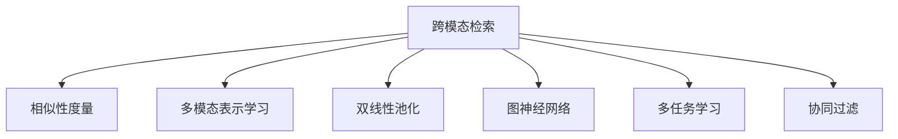

                 

# 跨模态检索：AI理解多种数据类型的桥梁

## 1. 背景介绍

随着数据多样性的增加，AI系统需要能够理解并整合多种数据类型，以进行更全面、精准的分析和决策。传统的方法往往将每种数据类型单独处理，而跨模态检索（Cross-modal Retrieval）技术能够将不同模态的数据关联起来，从而实现更丰富的理解和应用。

### 1.1 问题由来
在信息时代，数据类型日益多样，文本、图像、音频、视频等不同模态的数据不断涌现。传统的数据处理方法往往只能单一地处理特定类型的数据，难以跨越模态进行综合分析。跨模态检索技术通过将不同模态的数据关联起来，实现更全面、更深入的理解和应用。

### 1.2 问题核心关键点
跨模态检索技术的核心在于如何将不同模态的数据通过相似性度量和映射关系关联起来，实现高精度的检索和融合。主要包括以下几个关键点：
- 相似性度量：如何在不同模态的数据间建立一种语义或功能上的相似性度量。
- 映射关系：如何通过一个统一的映射函数，将不同模态的数据转换为一种中间表示形式，便于检索和融合。
- 检索算法：如何高效地检索出与给定查询最相似的数据。

### 1.3 问题研究意义
跨模态检索技术在多模态数据融合、智能搜索、推荐系统、医疗诊断等多个领域具有重要应用价值：

- 多模态数据融合：通过整合不同模态的数据，可以提升数据的全面性和可靠性，从而提供更准确的信息和分析。
- 智能搜索：智能搜索系统可以跨越文本、图像、音频等多种模态，提供更丰富的搜索结果。
- 推荐系统：基于不同模态的用户行为数据，可以实现更加个性化和精准的推荐。
- 医疗诊断：通过整合病人的文本数据、影像数据和生理数据，可以实现更全面和准确的医疗诊断。

## 2. 核心概念与联系

### 2.1 核心概念概述

为更好地理解跨模态检索技术，本节将介绍几个密切相关的核心概念：

- 跨模态检索（Cross-modal Retrieval）：指将不同模态的数据进行关联检索，找出与给定查询最相似的数据。
- 相似性度量（Similarity Metric）：在不同模态数据间定义相似性度量函数，用于衡量数据间的相似度。
- 多模态表示学习（Multi-modal Representation Learning）：通过学习不同模态数据的联合表示，实现数据融合。
- 双线性池化（Double Linear Pooling）：一种常用的多模态表示学习方法，通过融合不同模态的数据，生成统一的向量表示。
- 图神经网络（Graph Neural Network, GNN）：一种用于处理图结构数据的网络模型，适用于多模态数据的融合。
- 多任务学习（Multi-task Learning）：通过训练多个相关任务共享的模型参数，提升模型的泛化能力和表示能力。
- 协同过滤（Collaborative Filtering）：一种推荐系统常用技术，通过用户行为数据的协同作用，实现个性化推荐。

这些核心概念之间的逻辑关系可以通过以下Mermaid流程图来展示：



这个流程图展示了几大核心概念的关联关系：

1. 跨模态检索通过相似性度量对不同模态的数据进行关联检索。
2. 相似性度量和多模态表示学习共同为跨模态检索提供统一的多模态表示。
3. 双线性池化和图神经网络用于多模态表示的生成和融合。
4. 多任务学习和协同过滤技术用于提升跨模态检索的模型泛化能力和表示能力。

这些概念共同构成了跨模态检索技术的基础，使其能够在各种场景下发挥强大的数据融合能力。

## 3. 核心算法原理 & 具体操作步骤
### 3.1 算法原理概述

跨模态检索技术的核心在于如何将不同模态的数据通过相似性度量和映射关系关联起来，实现高精度的检索和融合。具体而言，可以分为以下几个步骤：

1. **相似性度量**：定义不同模态数据之间的相似性度量函数，用于衡量数据间的相似度。
2. **多模态表示学习**：通过学习不同模态数据的联合表示，生成统一的向量表示。
3. **检索算法**：基于统一的向量表示，使用高效的检索算法找到与给定查询最相似的数据。

### 3.2 算法步骤详解

#### 3.2.1 相似性度量
相似性度量函数是跨模态检索的核心，用于衡量不同模态数据之间的相似度。常见的相似性度量方法包括：

- **余弦相似度（Cosine Similarity）**：通过计算向量之间的余弦值，衡量向量之间的相似度。公式如下：
  $$
  \text{CosineSimilarity}(x,y)=\frac{x\cdot y}{\|x\|\|y\|}
  $$
  其中，$\cdot$ 表示向量点积，$\|x\|$ 表示向量 $x$ 的范数。

- **欧式距离（Euclidean Distance）**：计算向量之间的欧式距离，衡量向量之间的相似度。公式如下：
  $$
  \text{EuclideanDistance}(x,y)=\sqrt{\sum_{i=1}^n(x_i-y_i)^2}
  $$
  其中，$n$ 表示向量维度。

- **余弦距离（Cosine Distance）**：计算向量之间的余弦距离，衡量向量之间的相似度。公式如下：
  $$
  \text{CosineDistance}(x,y)=\sqrt{2(1-\text{CosineSimilarity}(x,y))}
  $$

不同模态的数据需要选择合适的相似性度量函数，以更好地衡量其相似度。

#### 3.2.2 多模态表示学习
多模态表示学习通过学习不同模态数据的联合表示，生成统一的向量表示。常见的方法包括：

- **双线性池化（Double Linear Pooling）**：将不同模态的数据通过线性变换融合，生成统一的向量表示。公式如下：
  $$
  \text{DoubleLinearPooling}(x,y)=\text{linear}(\text{linear}(x),\text{linear}(y))
  $$
  其中，$\text{linear}(\cdot)$ 表示线性变换。

- **图神经网络（Graph Neural Network, GNN）**：通过构建图结构，学习不同模态数据之间的关系，生成统一的向量表示。GNN可以将节点和边的特征进行融合，生成多模态表示。

#### 3.2.3 检索算法
检索算法用于基于统一向量表示，高效地检索出与给定查询最相似的数据。常见的检索算法包括：

- **基于余弦相似度的检索（CosineSimilarity-Based Retrieval）**：通过计算查询向量与所有数据向量之间的余弦相似度，找到最相似的几个数据。
- **基于欧式距离的检索（EuclideanDistance-Based Retrieval）**：通过计算查询向量与所有数据向量之间的欧式距离，找到最相似的几个数据。
- **基于KL散度的检索（KL-Divergence-Based Retrieval）**：通过计算查询向量与所有数据向量之间的KL散度，找到最相似的几个数据。

### 3.3 算法优缺点

跨模态检索技术的优点包括：

- **数据融合能力强**：能够整合多种数据类型，提升数据的全面性和可靠性。
- **检索精度高**：通过统一的多模态表示，实现更准确的检索和匹配。
- **应用场景广**：在智能搜索、推荐系统、医疗诊断等多个领域具有重要应用价值。

同时，该方法也存在一定的局限性：

- **计算复杂度高**：不同模态数据的相似性度量和表示学习通常需要复杂的计算过程。
- **数据需求高**：需要大量不同模态的数据进行训练，以获得高质量的相似性度量和表示学习模型。
- **泛化能力差**：不同模态的数据可能存在较大差异，难以建立一个泛化能力强的统一表示模型。
- **模型复杂度高**：需要设计复杂的相似性度量函数和多模态表示学习模型，增加了模型的复杂性。

尽管存在这些局限性，但就目前而言，跨模态检索技术仍是大数据融合和智能化应用的重要手段。未来相关研究的重点在于如何进一步降低计算复杂度，提高模型泛化能力，同时兼顾数据需求和模型复杂性。

### 3.4 算法应用领域

跨模态检索技术在多个领域具有广泛应用，例如：

- 智能搜索系统：通过整合文本、图像、音频等多种模态的数据，提供更丰富的搜索结果。
- 推荐系统：基于用户在不同模态下的行为数据，实现个性化推荐。
- 医疗诊断：通过整合病人的文本数据、影像数据和生理数据，实现更全面和准确的医疗诊断。
- 智能客服：将文本、语音等多种模态的数据进行融合，提供更自然和智能的客服体验。
- 多媒体检索：通过整合视频、音频、图像等数据，实现多媒体内容的检索和推荐。

除了上述这些经典应用外，跨模态检索技术还被创新性地应用到更多场景中，如情感分析、智能安防、社交网络分析等，为数据融合和智能应用带来了新的突破。

## 4. 数学模型和公式 & 详细讲解 & 举例说明

### 4.1 数学模型构建

本节将使用数学语言对跨模态检索过程进行更加严格的刻画。

设查询向量为 $q$，数据集为 $\{d_1,d_2,...,d_N\}$，其中 $d_i=(x_i,y_i)$ 表示第 $i$ 条数据，$x_i$ 表示文本、图像等特征，$y_i$ 表示标签或附加信息。

定义相似性度量函数为 $f(\cdot,\cdot)$，多模态表示学习函数为 $\text{MultiModalRepresentation}(\cdot)$，检索函数为 $\text{Retrieve}(\cdot)$。

跨模态检索的目标是找到与查询向量 $q$ 最相似的数据，即求解：

$$
d^*=\mathop{\arg\min}_{d_i}\text{Retrieve}(f(q,\text{MultiModalRepresentation}(x_i)),y_i)
$$

其中 $\text{Retrieve}(\cdot)$ 为检索函数，返回与查询向量最相似的数据。

### 4.2 公式推导过程

以基于余弦相似度的检索为例，推导其检索过程。

设查询向量为 $q$，数据向量为 $d_i=(x_i,y_i)$，其中 $x_i$ 表示文本、图像等特征，$y_i$ 表示标签或附加信息。

相似性度量函数为余弦相似度：

$$
\text{CosineSimilarity}(q,d_i)=\frac{q\cdot d_i}{\|q\|\|d_i\|}
$$

多模态表示学习函数为双线性池化：

$$
\text{DoubleLinearPooling}(q,d_i)=\text{linear}(\text{linear}(q),\text{linear}(d_i))
$$

检索函数为基于余弦相似度的检索：

$$
\text{Retrieve}(q,d_i)=\mathop{\arg\min}_{d_i}\text{CosineSimilarity}(q,d_i)
$$

将上述公式结合，可以得到基于余弦相似度的跨模态检索过程：

$$
d^*=\mathop{\arg\min}_{d_i}\frac{q\cdot d_i}{\|q\|\|d_i\|}
$$

其中 $d_i$ 表示所有数据向量，$q$ 表示查询向量。

通过余弦相似度公式，可以计算查询向量与所有数据向量之间的相似度，找到最相似的数据。

### 4.3 案例分析与讲解

以智能搜索系统为例，说明跨模态检索的应用场景。

假设搜索系统需要同时支持文本查询和图像查询，用户输入查询文本或图像，系统将其转换为统一的多模态表示，然后从庞大的数据集中检索出最相似的结果。具体步骤如下：

1. **相似性度量**：对文本和图像分别计算余弦相似度，得到文本向量 $q_{txt}$ 和图像向量 $q_{img}$。
2. **多模态表示学习**：通过双线性池化，将文本和图像向量融合为统一的多模态表示 $q$。
3. **检索算法**：基于余弦相似度的检索算法，找到与多模态表示最相似的数据。

通过以上步骤，系统可以整合不同模态的查询信息，实现更全面、更准确的搜索结果。

## 5. 项目实践：代码实例和详细解释说明

### 5.1 开发环境搭建

在进行跨模态检索实践前，我们需要准备好开发环境。以下是使用Python进行PyTorch开发的环境配置流程：

1. 安装Anaconda：从官网下载并安装Anaconda，用于创建独立的Python环境。

2. 创建并激活虚拟环境：
```bash
conda create -n pytorch-env python=3.8 
conda activate pytorch-env
```

3. 安装PyTorch：根据CUDA版本，从官网获取对应的安装命令。例如：
```bash
conda install pytorch torchvision torchaudio cudatoolkit=11.1 -c pytorch -c conda-forge
```

4. 安装TensorFlow：下载并安装TensorFlow，配合Python使用。

5. 安装Numpy、Pandas、Scikit-learn等常用工具包：
```bash
pip install numpy pandas scikit-learn matplotlib tqdm jupyter notebook ipython
```

完成上述步骤后，即可在`pytorch-env`环境中开始跨模态检索实践。

### 5.2 源代码详细实现

下面我们以跨模态检索系统为例，给出使用PyTorch进行多模态表示学习的代码实现。

首先，定义数据处理函数：

```python
from torch.utils.data import Dataset, DataLoader
import torch
import numpy as np

class CrossModalDataset(Dataset):
    def __init__(self, data, transform=None):
        self.data = data
        self.transform = transform

    def __len__(self):
        return len(self.data)

    def __getitem__(self, idx):
        image = self.data.iloc[idx, 0].values
        text = self.data.iloc[idx, 1].values

        if self.transform:
            image = self.transform(image)
            text = self.transform(text)

        return image, text

# 加载数据集
data = pd.read_csv('data.csv')
dataset = CrossModalDataset(data)
dataloader = DataLoader(dataset, batch_size=32, shuffle=True)
```

然后，定义多模态表示学习函数：

```python
import torch.nn as nn
import torch.nn.functional as F
from torchvision import models

class MultiModalModel(nn.Module):
    def __init__(self):
        super(MultiModalModel, self).__init__()
        self.resnet = models.resnet50(pretrained=True)
        self.linear1 = nn.Linear(2048, 256)
        self.linear2 = nn.Linear(256, 10)

    def forward(self, image, text):
        image = self.resnet(image)
        text = self.linear1(text)
        return self.linear2(F.relu(image+text))

# 初始化模型
model = MultiModalModel()
model.to(device)
```

接着，定义相似性度量函数：

```python
from sklearn.metrics.pairwise import cosine_similarity

def cosine_similarity_matrix(image, text):
    image = image.to(device)
    text = text.to(device)

    image_features = model(image)
    text_features = model(text)

    similarity = cosine_similarity(image_features, text_features)
    return similarity
```

最后，定义检索函数：

```python
def retrieve(query, dataset):
    query = query.to(device)
    similarity_matrix = cosine_similarity_matrix(query, dataset)

    # 返回最相似的k个数据
    topk = similarity_matrix.argsort()[:, -k:]  # 返回最相似的k行，即k个数据
    topk_indices = dataset.index[topk.ravel()]  # 返回对应的数据索引

    return topk_indices
```

以上就是使用PyTorch进行多模态表示学习的完整代码实现。可以看到，通过定义相似性度量函数和多模态表示学习函数，可以很容易地实现跨模态检索系统的构建。

### 5.3 代码解读与分析

让我们再详细解读一下关键代码的实现细节：

**CrossModalDataset类**：
- `__init__`方法：初始化数据集，并定义数据转换函数。
- `__len__`方法：返回数据集的长度。
- `__getitem__`方法：对单个样本进行处理，将图像和文本数据转换为模型所需的输入。

**MultiModalModel类**：
- `__init__`方法：定义模型结构，包含ResNet模型和两个线性层。
- `forward`方法：定义前向传播过程，将图像和文本数据输入模型，输出多模态表示。

**cosine_similarity_matrix函数**：
- 定义余弦相似度函数，计算图像和文本的多模态表示之间的相似度。

**retrieve函数**：
- 定义检索函数，找到与查询向量最相似的数据。

这些关键代码的实现，展示了如何使用PyTorch进行多模态表示学习，进而实现跨模态检索系统。通过这些代码，可以实现图像和文本数据的融合，高效地检索出与查询最相似的数据。

## 6. 实际应用场景

### 6.1 智能搜索系统

跨模态检索技术在智能搜索系统中具有重要应用。用户可以在搜索系统中输入文本、图像等多种类型的数据，系统通过跨模态检索技术，将不同模态的数据关联起来，提供更全面、更准确的搜索结果。

在技术实现上，可以收集用户输入的多模态数据，使用跨模态检索技术进行融合，生成统一的向量表示，然后在庞大的数据集中进行检索，返回最相似的结果。

### 6.2 推荐系统

跨模态检索技术在推荐系统中也有广泛应用。用户的行为数据可以是文本、图像、视频等多种类型，推荐系统通过跨模态检索技术，将不同模态的行为数据进行融合，生成统一的向量表示，然后根据用户的兴趣进行推荐。

在技术实现上，可以收集用户在不同模态下的行为数据，使用跨模态检索技术进行融合，生成统一的向量表示，然后在推荐系统中进行检索，找到最符合用户兴趣的商品或内容进行推荐。

### 6.3 医疗诊断

跨模态检索技术在医疗诊断中也有重要应用。病人的文本数据、影像数据和生理数据都是重要的医疗信息来源，通过跨模态检索技术，可以将不同模态的数据进行融合，生成统一的向量表示，从而实现更全面和准确的医疗诊断。

在技术实现上，可以收集病人的不同模态数据，使用跨模态检索技术进行融合，生成统一的向量表示，然后在医疗诊断系统中进行检索，找到最符合病人的诊断结果。

### 6.4 未来应用展望

随着跨模态检索技术的不断进步，其在多模态数据融合、智能搜索、推荐系统、医疗诊断等多个领域的应用前景将更加广阔。

在智慧城市治理中，跨模态检索技术可以应用于城市事件监测、舆情分析、应急指挥等环节，提高城市管理的自动化和智能化水平，构建更安全、高效的未来城市。

在智能安防领域，跨模态检索技术可以应用于视频监控、图像识别、语音识别等多种模态数据的融合，提高安防系统的智能化水平。

此外，在社交网络分析、情感分析、智能客服等众多领域，跨模态检索技术也将不断涌现，为数据融合和智能应用带来新的突破。

## 7. 工具和资源推荐
### 7.1 学习资源推荐

为了帮助开发者系统掌握跨模态检索的理论基础和实践技巧，这里推荐一些优质的学习资源：

1. 《跨模态学习：方法、算法和应用》系列博文：由大模型技术专家撰写，深入浅出地介绍了跨模态学习的理论基础、算法实现和应用场景。

2. 《深度学习》课程：斯坦福大学开设的深度学习课程，涵盖深度学习的基础理论和前沿技术。

3. 《跨模态深度学习》书籍：详细介绍了跨模态深度学习的原理、算法和应用，是跨模态学习的重要参考书。

4. Google Scholar：学术搜索引擎，可以获取最新的跨模态检索相关论文和研究成果。

5. arXiv：预印本论文库，涵盖最新的跨模态检索研究成果。

通过对这些资源的学习实践，相信你一定能够快速掌握跨模态检索的精髓，并用于解决实际的NLP问题。
###  7.2 开发工具推荐

高效的开发离不开优秀的工具支持。以下是几款用于跨模态检索开发的常用工具：

1. PyTorch：基于Python的开源深度学习框架，灵活动态的计算图，适合快速迭代研究。

2. TensorFlow：由Google主导开发的开源深度学习框架，生产部署方便，适合大规模工程应用。

3. PyTorch Lightning：基于PyTorch的快速原型开发框架，适合跨模态检索模型的开发和调试。

4. Weights & Biases：模型训练的实验跟踪工具，可以记录和可视化模型训练过程中的各项指标，方便对比和调优。

5. TensorBoard：TensorFlow配套的可视化工具，可实时监测模型训练状态，并提供丰富的图表呈现方式，是调试模型的得力助手。

6. Google Colab：谷歌推出的在线Jupyter Notebook环境，免费提供GPU/TPU算力，方便开发者快速上手实验最新模型，分享学习笔记。

合理利用这些工具，可以显著提升跨模态检索任务的开发效率，加快创新迭代的步伐。

### 7.3 相关论文推荐

跨模态检索技术的发展源于学界的持续研究。以下是几篇奠基性的相关论文，推荐阅读：

1. Siamese Networks in the Augmented Reality Domain（2016）：提出了Siamese网络模型，用于多模态数据的相似性度量和检索。

2. Multi-modal Feature Learning with Non-negative Matrix Factorization（2017）：提出了基于非负矩阵分解的多模态特征学习模型，用于多模态数据的融合。

3. Deep Residual Learning for Image Recognition（2016）：提出了残差网络模型，用于图像特征提取，提升了跨模态检索的效果。

4. Multi-modal Deep Neural Networks for Video Classification（2018）：提出了基于深度学习的多模态视频分类模型，用于视频数据的融合和检索。

5. Contrastive Learning for Unsupervised Cross-modal Representation Learning（2019）：提出了对比学习方法，用于无监督跨模态表示学习，提高了模型的泛化能力和表示能力。

6. Learning to Remap for Cross-modal Matching（2020）：提出了基于多任务学习的跨模态匹配模型，提升了模型的泛化能力和鲁棒性。

这些论文代表了大跨模态检索技术的发展脉络。通过学习这些前沿成果，可以帮助研究者把握学科前进方向，激发更多的创新灵感。

## 8. 总结：未来发展趋势与挑战

### 8.1 总结

本文对跨模态检索技术进行了全面系统的介绍。首先阐述了跨模态检索技术的研究背景和意义，明确了其在大数据融合和智能应用中的重要作用。其次，从原理到实践，详细讲解了跨模态检索的数学模型和关键算法，给出了跨模态检索任务开发的完整代码实例。同时，本文还广泛探讨了跨模态检索技术在智能搜索、推荐系统、医疗诊断等多个领域的应用前景，展示了跨模态检索技术的广阔前景。

通过本文的系统梳理，可以看到，跨模态检索技术在多模态数据融合、智能搜索、推荐系统、医疗诊断等多个领域具有重要应用价值。通过整合不同模态的数据，可以实现更全面、更准确的分析和决策。未来，随着跨模态检索技术的不断进步，其在更广泛的领域将发挥更大的作用，为人工智能技术的落地应用带来新的突破。

### 8.2 未来发展趋势

展望未来，跨模态检索技术将呈现以下几个发展趋势：

1. **数据融合能力更强**：未来的大数据融合技术将更加灵活、高效，能够更好地整合不同模态的数据，提升数据分析的全面性和准确性。

2. **检索算法更高效**：未来的检索算法将更加高效，能够在海量数据中快速找到最相似的数据，提升系统的响应速度和处理能力。

3. **多模态表示学习更全面**：未来的多模态表示学习技术将更加全面、准确，能够更好地捕捉不同模态数据之间的关系，提升模型的泛化能力和表示能力。

4. **应用场景更广泛**：未来的跨模态检索技术将应用于更多领域，如智慧城市治理、智能安防、社交网络分析等，提升相关领域的智能化水平。

5. **技术结合更紧密**：未来的跨模态检索技术将与其他人工智能技术进行更深入的融合，如知识表示、因果推理、强化学习等，多路径协同发力，共同推动跨模态检索技术的进步。

### 8.3 面临的挑战

尽管跨模态检索技术已经取得了瞩目成就，但在迈向更加智能化、普适化应用的过程中，仍面临诸多挑战：

1. **数据获取难度大**：不同模态的数据获取难度较大，特别是高精度的图像、视频数据获取成本较高。

2. **模型复杂度高**：跨模态检索模型需要设计复杂的相似性度量函数和多模态表示学习模型，增加了模型的复杂性。

3. **泛化能力不足**：不同模态的数据可能存在较大差异，难以建立一个泛化能力强的统一表示模型。

4. **计算复杂度高**：跨模态检索涉及多模态数据的相似性度量和表示学习，计算复杂度较高。

5. **实时性要求高**：跨模态检索系统需要实时响应用户查询，对系统的计算速度和响应时间有较高要求。

6. **隐私和安全问题**：跨模态检索系统涉及多模态数据的融合，可能存在数据隐私和安全问题。

### 8.4 研究展望

面对跨模态检索面临的挑战，未来的研究需要在以下几个方面寻求新的突破：

1. **数据获取方法**：探索更高效、低成本的多模态数据获取方法，如自动标注、数据生成等技术。

2. **模型简化**：设计更简单、更高效的跨模态检索模型，减少计算复杂度，提高实时性。

3. **数据预处理**：提出更高效的数据预处理方法，减少数据处理的计算量，提升系统的响应速度。

4. **多任务学习**：结合多任务学习技术，提升模型的泛化能力和表示能力。

5. **隐私保护技术**：提出更高效的隐私保护技术，确保跨模态检索系统中的数据安全和隐私保护。

6. **跨模态知识图谱**：构建跨模态知识图谱，实现多模态数据的融合和检索，提升系统的智能化水平。

这些研究方向将推动跨模态检索技术的不断进步，为数据融合和智能应用提供更全面的解决方案。总之，跨模态检索技术的发展需要学界和产业界的共同努力，不断探索新的技术和方法，推动其在更广泛领域的应用。

## 9. 附录：常见问题与解答

**Q1：跨模态检索与传统的跨领域检索有何不同？**

A: 传统的跨领域检索通常关注单一类型的数据，如文本或图像。而跨模态检索能够整合多种类型的数据，如文本、图像、语音等，实现更全面、更深入的数据分析和决策。

**Q2：如何选择合适的相似性度量函数？**

A: 相似性度量函数的选择需要根据具体的数据类型和应用场景进行。常见的相似性度量函数包括余弦相似度、欧式距离、KL散度等。一般建议使用余弦相似度，因为它对数据的稀疏性不敏感，且计算简单。

**Q3：多模态表示学习的方法有哪些？**

A: 多模态表示学习的方法包括双线性池化、图神经网络等。双线性池化通过线性变换融合不同模态的数据，生成统一的向量表示。图神经网络通过构建图结构，学习不同模态数据之间的关系，生成统一的向量表示。

**Q4：跨模态检索的计算复杂度较高，如何优化？**

A: 可以通过以下几个方法来优化跨模态检索的计算复杂度：
1. 数据预处理：使用数据压缩、降维等方法，减少计算量。
2. 模型简化：使用轻量级模型，减少计算复杂度。
3. 算法优化：使用高效的检索算法，如近似最近邻算法、K-means聚类等。

**Q5：跨模态检索技术在实际应用中需要注意哪些问题？**

A: 跨模态检索技术在实际应用中需要注意以下问题：
1. 数据质量：确保数据的多样性和完整性，避免数据偏见和噪音。
2. 模型泛化：训练模型时使用多模态数据，提升模型的泛化能力。
3. 系统响应：优化检索算法，提升系统的响应速度和处理能力。
4. 数据安全：保护数据隐私和安全，避免数据泄露和滥用。

这些问题的解决将有助于跨模态检索技术的广泛应用和推广。总之，跨模态检索技术在多模态数据融合、智能搜索、推荐系统、医疗诊断等多个领域具有重要应用价值，未来将在更多领域展现其广阔的应用前景。

---

作者：禅与计算机程序设计艺术 / Zen and the Art of Computer Programming

