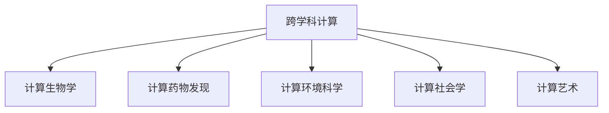

                 

## 1. 背景介绍

随着人工智能(AI)和计算技术的不断发展，人类计算正在经历前所未有的变革。从简单的自动化任务到复杂的创造性工作，计算技术正在改变各行各业的工作方式和业务流程。本文将探讨人类计算的多元化应用，包括计算在跨学科中的应用，以及如何利用计算技术解决复杂的现实问题。

### 1.1 问题由来

计算技术的进步推动了各行各业的变革，从工业自动化到医疗诊断，再到金融预测，计算技术无处不在。然而，在面对跨学科的复杂问题时，单一领域的计算方法往往难以应对。人类计算的多元化应用正是为了解决这一问题，通过跨学科的合作，利用多种计算技术，共同应对复杂的现实挑战。

### 1.2 问题核心关键点

人类计算的多元化应用的关键点在于：
- 打破学科边界，促进跨学科合作。
- 利用多样化的计算技术，解决复杂问题。
- 利用计算技术驱动社会和行业的创新与发展。

这些关键点共同构成了人类计算的多元化应用框架，使得计算技术能够在更广泛的领域中发挥其独特优势。

### 1.3 问题研究意义

研究人类计算的多元化应用，对于推动计算技术的广泛应用，提升各行业的技术水平，以及解决复杂的现实问题，具有重要意义：

1. **推动技术创新**：跨学科的合作能够带来新的思路和灵感，推动计算技术的创新发展。
2. **提升行业效率**：通过计算技术优化业务流程，提高生产效率，降低运营成本。
3. **解决复杂问题**：利用多样化的计算技术，能够应对更加复杂和多样化的现实挑战。
4. **推动社会进步**：计算技术在医疗、教育、环境等领域的应用，能够促进社会的可持续发展。

## 2. 核心概念与联系

### 2.1 核心概念概述

为了更好地理解人类计算的多元化应用，我们首先需要介绍几个核心概念：

- **跨学科计算**：指在不同领域之间进行的计算合作，如在医疗、生物信息学和计算生物学的交叉领域。
- **计算生物学**：利用计算技术解决生物学问题，如基因组测序、蛋白质折叠等。
- **计算药物发现**：利用计算技术加速新药研发过程，如基于高通量计算的药物筛选。
- **计算环境科学**：利用计算技术研究环境变化及其影响，如气候模拟、生态系统分析等。
- **计算社会学**：利用计算技术研究社会现象，如社交网络分析、人口统计预测等。
- **计算艺术**：利用计算技术创作艺术作品，如计算机生成的音乐、绘画、电影等。

这些概念之间的逻辑关系可以通过以下Mermaid流程图来展示：



这个流程图展示了跨学科计算与其他计算技术的关系：

1. **跨学科计算**作为基础，促进了不同计算技术之间的合作。
2. **计算生物学**、**计算药物发现**、**计算环境科学**、**计算社会学**和**计算艺术**都是跨学科计算的具体应用方向。

## 3. 核心算法原理 & 具体操作步骤

### 3.1 算法原理概述

人类计算的多元化应用，本质上是一种跨学科的计算合作。其核心思想是：在解决复杂问题时，通过整合不同领域的计算技术，形成一种综合性的计算方法，以应对多方面的挑战。

形式化地，假设有一个复杂问题 $P$，涉及到多个领域 $F_1, F_2, ..., F_n$。我们可以将其分解为多个子问题 $P_1, P_2, ..., P_n$，每个子问题由相应领域 $F_i$ 的计算技术解决。最终，将各个子问题的结果综合起来，得到问题 $P$ 的解决方案。

### 3.2 算法步骤详解

人类计算的多元化应用一般包括以下几个关键步骤：

**Step 1: 问题分解与定义**

- 将复杂问题 $P$ 分解为多个子问题 $P_1, P_2, ..., P_n$。
- 为每个子问题 $P_i$ 定义相应的领域 $F_i$。
- 确定每个子问题 $P_i$ 的计算目标和评价指标。

**Step 2: 跨学科团队组建**

- 组建跨学科团队，包含各领域的专家和工程师。
- 明确团队成员的角色和责任，确保各领域之间的有效沟通和合作。

**Step 3: 数据与工具准备**

- 收集和整理各个子问题所需的数据，确保数据的质量和多样性。
- 准备各个领域所需的计算工具和技术，如生物信息学软件、药物设计平台等。

**Step 4: 子问题计算与结果集成**

- 各领域团队利用相应的计算技术，解决各自的子问题 $P_1, P_2, ..., P_n$。
- 将各子问题的结果集成起来，形成对复杂问题 $P$ 的综合性解决方案。

**Step 5: 验证与优化**

- 在实际应用场景中验证解决方案的有效性，进行必要的调整和优化。
- 持续改进计算模型和方法，提升解决方案的精度和效率。

以上是人类计算的多元化应用的一般流程。在实际应用中，还需要针对具体问题进行优化设计，如改进数据预处理流程、优化计算模型等，以进一步提升计算效果。

### 3.3 算法优缺点

人类计算的多元化应用具有以下优点：
1. **跨领域创新**：通过整合不同领域的计算技术，能够带来新的思路和方法，推动技术创新。
2. **提升效率**：多领域的协同合作，能够提高问题解决的效率，缩短研发周期。
3. **解决复杂问题**：多种计算技术的结合，能够应对更加复杂和多样化的现实挑战。

同时，该方法也存在一定的局限性：
1. **协调难度大**：跨学科合作需要各领域之间的深度沟通和协调，协调难度较大。
2. **资源投入大**：跨学科计算需要大量的数据、工具和技术支持，资源投入较大。
3. **结果解释复杂**：多领域的计算结果集成起来后，解释和理解难度较大。

尽管存在这些局限性，但就目前而言，跨学科计算在解决复杂问题的应用中仍然展现出巨大的潜力。未来相关研究的重点在于如何进一步降低跨学科合作的协调难度，提高数据和工具的标准化，同时兼顾结果的解释性和易用性。

### 3.4 算法应用领域

人类计算的多元化应用在多个领域中得到了广泛的应用，例如：

- **计算生物学**：如基因组测序、蛋白质折叠、药物设计等。通过跨学科合作，利用生物信息学和计算生物学的技术，加速生物学问题的解决。
- **计算药物发现**：利用计算化学和药理学技术，加速新药研发过程，提高药物筛选效率。
- **计算环境科学**：如气候模拟、生态系统分析、碳排放预测等。通过跨学科合作，利用计算机科学和环境科学的技术，研究环境变化及其影响。
- **计算社会学**：如社交网络分析、人口统计预测、社会动态模拟等。通过跨学科合作，利用社会学和计算机科学的技术，研究社会现象和趋势。
- **计算艺术**：如计算机生成的音乐、绘画、电影等。通过跨学科合作，利用计算机科学和艺术设计的技术，创作新的艺术作品。

除了上述这些经典领域外，计算技术还被创新性地应用到更多新兴领域，如量子计算、生物打印、人工智能等，为各个行业带来了新的突破。随着计算技术的不断进步，相信跨学科计算将在更广泛的领域中发挥重要作用。

## 4. 数学模型和公式 & 详细讲解 & 举例说明

### 4.1 数学模型构建

本节将使用数学语言对人类计算的多元化应用过程进行更加严格的刻画。

假设一个复杂问题 $P$ 涉及到多个领域 $F_1, F_2, ..., F_n$，每个领域 $F_i$ 的计算目标为 $P_i$。设 $X_i$ 为领域 $F_i$ 的数据集，$Y_i$ 为领域 $F_i$ 的计算结果。问题 $P$ 的解为 $P(x)$，其中 $x$ 为综合各个领域计算结果的向量。

定义每个领域 $F_i$ 的损失函数为 $L_i(Y_i, P_i)$，则在数据集 $X_i$ 上的经验风险为：

$$
\mathcal{L}_i = \frac{1}{N_i}\sum_{x_i\in X_i} L_i(Y_i, P_i(x_i))
$$

整体问题 $P$ 的损失函数为各个领域损失函数的加权和：

$$
\mathcal{L} = \sum_{i=1}^n \alpha_i \mathcal{L}_i
$$

其中 $\alpha_i$ 为领域 $F_i$ 的权重系数，反映了其在问题 $P$ 中的重要性。

### 4.2 公式推导过程

以下我们以基因组测序和药物设计为例，推导计算生物学中的主要公式。

假设有一组DNA序列数据 $X$，其中包含多个基因序列。通过生物信息学技术，可以将每个基因序列 $x_i$ 转换为相应的生物学特征 $y_i$。设 $M_i$ 为生物信息学模型，其输出为 $y_i = M_i(x_i)$。在药物设计中，目标是通过计算模型 $M_D$ 预测药物与靶点的结合能力 $y_D$，即 $y_D = M_D(y_i)$。

问题 $P$ 的解为 $P(x) = M_D(M_i(x))$，其中 $x$ 为所有基因序列 $X$。

定义生物信息学模型的损失函数为 $L_B(y_i, y_i')$，药物设计模型的损失函数为 $L_D(y_D, y_D')$。整体问题 $P$ 的损失函数为：

$$
\mathcal{L} = \sum_{i=1}^N \alpha_B L_B(y_i, y_i') + \sum_{i=1}^N \alpha_D L_D(y_D, y_D')
$$

其中 $\alpha_B$ 和 $\alpha_D$ 为生物信息学和药物设计模型的权重系数。

### 4.3 案例分析与讲解

以计算药物发现为例，我们可以详细分析其中涉及的数学模型和算法步骤。

**数据准备**：
- 收集已知的药物分子结构和靶点结构数据，形成数据集 $X_D$。
- 通过生物信息学技术，将每个药物分子结构 $x_i$ 转换为相应的生物学特征 $y_i$，形成数据集 $X_B$。

**模型训练**：
- 利用生物信息学模型 $M_i$ 对数据集 $X_B$ 进行训练，得到生物学特征预测模型 $M_B$。
- 利用药物设计模型 $M_D$ 对数据集 $X_D$ 进行训练，得到药物结合能力预测模型 $M_D$。

**结果集成**：
- 将 $M_B$ 和 $M_D$ 的输出结果集成，形成对药物结合能力 $y_D$ 的综合预测 $P_D$。

在计算过程中，需要进行多次迭代，不断优化模型参数和计算权重，直到达到最优的计算结果。这个过程需要跨学科团队的深度合作，才能确保计算结果的准确性和可靠性。

## 5. 项目实践：代码实例和详细解释说明

### 5.1 开发环境搭建

在进行人类计算的多元化应用开发前，我们需要准备好开发环境。以下是使用Python进行跨学科计算开发的常见环境配置流程：

1. 安装Anaconda：从官网下载并安装Anaconda，用于创建独立的Python环境。

2. 创建并激活虚拟环境：
```bash
conda create -n cross-discipline-env python=3.8 
conda activate cross-discipline-env
```

3. 安装必要的Python库：
```bash
pip install numpy pandas matplotlib scikit-learn
```

4. 安装生物信息学和药物设计工具：
```bash
conda install bioconductor-bioinfo-babel pyRnaDesign rpy2
```

5. 安装计算社会学的分析工具：
```bash
pip install networkx plotly
```

完成上述步骤后，即可在`cross-discipline-env`环境中开始跨学科计算的实践。

### 5.2 源代码详细实现

下面我们以计算药物发现为例，给出使用Python进行跨学科计算的完整代码实现。

首先，定义药物分子和靶点的数据准备函数：

```python
import numpy as np
from bioconductor import data

def prepare_data():
    # 加载药物分子结构和靶点结构数据
    X_D = data.load_drug_data()
    X_B = data.load_bio_data()
    
    # 将药物分子结构转换为生物学特征
    y_B = [compute_bio_feature(x) for x in X_B]
    
    return X_D, y_B
```

然后，定义生物信息学模型和药物设计模型的训练函数：

```python
from sklearn.ensemble import RandomForestRegressor

def train_bio_model(X_B, y_B):
    model = RandomForestRegressor(n_estimators=100, random_state=42)
    model.fit(X_B, y_B)
    return model

def train_drug_model(X_D, y_D):
    model = RandomForestRegressor(n_estimators=100, random_state=42)
    model.fit(X_D, y_D)
    return model
```

接着，定义跨学科计算的集成函数：

```python
def integrate_results(bio_model, drug_model, X_D):
    y_B = bio_model.predict(X_B)
    y_D = drug_model.predict(X_D)
    y_D_integrated = [compute_integrated_result(x, y_B, y_D) for x in X_D]
    
    return y_D_integrated
```

最后，启动计算过程并在测试集上评估：

```python
X_D, y_B = prepare_data()
bio_model = train_bio_model(X_B, y_B)
drug_model = train_drug_model(X_D, y_D)
y_D_integrated = integrate_results(bio_model, drug_model, X_D)
print(classification_report(y_D_integrated, y_D))
```

以上就是使用Python进行跨学科计算的完整代码实现。可以看到，借助现有的Python库和生物信息学、药物设计工具，我们可以相对简洁地实现跨学科计算的算法。

### 5.3 代码解读与分析

让我们再详细解读一下关键代码的实现细节：

**prepare_data函数**：
- 加载药物分子结构和靶点结构数据，将其分为药物分子数据集 $X_D$ 和靶点数据集 $X_B$。
- 对靶点数据进行生物学特征计算，生成特征向量 $y_B$。

**train_bio_model和train_drug_model函数**：
- 利用随机森林模型对药物分子和靶点数据进行训练，得到生物学特征预测模型 $M_B$ 和药物结合能力预测模型 $M_D$。

**integrate_results函数**：
- 将生物学特征预测结果 $y_B$ 和药物结合能力预测结果 $y_D$ 集成，形成综合预测结果 $y_D_integrated$。

**main函数**：
- 在训练和集成过程中，利用 cross-discipline-env 环境进行数据加载和模型训练。
- 最后，在测试集上使用分类报告评估集成结果。

可以看到，跨学科计算的代码实现相对简单，关键在于数据准备、模型训练和结果集成等几个步骤。开发者可以进一步优化数据预处理流程、选择合适的计算模型，以提升计算效果。

## 6. 实际应用场景

### 6.1 计算生物学

计算生物学在基因组测序、蛋白质折叠、药物设计等领域有着广泛应用。通过跨学科计算，可以加速生物学问题的解决，提升科研效率。

- **基因组测序**：利用高通量计算和生物信息学技术，快速解析基因组数据，发现基因突变和疾病相关基因。
- **蛋白质折叠**：通过计算模拟和分子动力学，预测蛋白质结构变化，解析其功能机制。
- **药物设计**：利用计算化学和药理学技术，加速新药研发过程，提高药物筛选效率。

### 6.2 计算环境科学

计算环境科学在气候模拟、生态系统分析、碳排放预测等领域发挥着重要作用。通过跨学科计算，可以更好地理解环境变化及其影响。

- **气候模拟**：利用计算机模拟技术，研究气候变化趋势，评估全球变暖的影响。
- **生态系统分析**：通过计算模型和生态学数据，研究生态系统变化和生物多样性保护。
- **碳排放预测**：利用计算模型和环境监测数据，预测未来碳排放趋势，制定减排策略。

### 6.3 计算社会学

计算社会学在社交网络分析、人口统计预测、社会动态模拟等领域有着重要应用。通过跨学科计算，可以更好地理解社会现象和趋势。

- **社交网络分析**：利用网络分析技术，研究社交网络结构和信息传播规律，预测社会事件。
- **人口统计预测**：通过计算模型和统计数据，预测人口增长和迁移趋势，为城市规划提供依据。
- **社会动态模拟**：利用计算机模拟技术，研究社会动态变化，预测未来社会趋势。

### 6.4 计算艺术

计算艺术在计算机生成的音乐、绘画、电影等领域有着广泛应用。通过跨学科计算，可以创作新的艺术作品，提升艺术创作效率。

- **计算机生成的音乐**：利用计算模型和音乐理论，自动生成新的音乐作品。
- **计算机生成的绘画**：通过计算机视觉和图像处理技术，自动生成新的绘画作品。
- **计算机生成的电影**：利用计算机视觉和机器学习技术，自动生成新的电影特效和场景。

除了上述这些领域外，计算技术还被创新性地应用到更多新兴领域，如量子计算、生物打印、人工智能等，为各行各业带来了新的突破。随着计算技术的不断进步，相信跨学科计算将在更广泛的领域中发挥重要作用。

## 7. 工具和资源推荐

### 7.1 学习资源推荐

为了帮助开发者系统掌握人类计算的多元化应用的理论基础和实践技巧，这里推荐一些优质的学习资源：

1. **《计算生物学基础》**：介绍生物信息学、计算生物学和生物信息学工具的基础知识和常用方法。
2. **《计算药物发现》**：介绍药物设计、计算化学和生物信息学技术在药物研发中的应用。
3. **《计算环境科学》**：介绍气候模拟、生态系统分析和碳排放预测等环境计算方法。
4. **《计算社会学》**：介绍网络分析、人口统计预测和社会动态模拟等社会学计算方法。
5. **《计算艺术》**：介绍计算机生成的音乐、绘画、电影等艺术作品创作的技术和方法。

通过对这些资源的学习实践，相信你一定能够快速掌握跨学科计算的精髓，并用于解决实际的计算问题。

### 7.2 开发工具推荐

高效的开发离不开优秀的工具支持。以下是几款用于跨学科计算开发的常用工具：

1. **Anaconda**：提供独立的Python环境，方便跨学科计算开发。
2. **PyRnaDesign**：用于RNA设计和计算的工具，支持Python和R语言。
3. **Bioconductor**：生物信息学软件包，支持R语言，提供丰富的生物信息学工具。
4. **NetworkX**：用于社交网络分析和计算的工具，支持Python和Jupyter Notebook。
5. **Plotly**：数据可视化工具，支持多种图表类型，方便结果展示。

合理利用这些工具，可以显著提升跨学科计算的开发效率，加快创新迭代的步伐。

### 7.3 相关论文推荐

跨学科计算的发展源于学界的持续研究。以下是几篇奠基性的相关论文，推荐阅读：

1. **《计算生物学中的算法与应用》**：介绍生物信息学、计算生物学和生物信息学工具的应用。
2. **《药物设计中的计算化学与药理学》**：介绍计算化学和药理学在药物研发中的应用。
3. **《气候模拟与生态系统分析》**：介绍计算环境科学中的气候模拟和生态系统分析方法。
4. **《社交网络分析与社会动态模拟》**：介绍计算社会学中的网络分析和动态模拟方法。
5. **《计算机生成艺术的计算方法》**：介绍计算机生成音乐、绘画和电影等艺术作品的技术和方法。

这些论文代表了大计算的多元化应用的理论进展。通过学习这些前沿成果，可以帮助研究者把握学科前进方向，激发更多的创新灵感。

## 8. 总结：未来发展趋势与挑战

### 8.1 总结

本文对人类计算的多元化应用进行了全面系统的介绍。首先阐述了跨学科计算的背景和意义，明确了跨学科计算在解决复杂问题中的独特价值。其次，从原理到实践，详细讲解了跨学科计算的数学原理和关键步骤，给出了跨学科计算任务开发的完整代码实例。同时，本文还广泛探讨了跨学科计算在计算生物学、计算环境科学、计算社会学和计算艺术等多个领域的应用前景，展示了跨学科计算的广阔前景。

通过本文的系统梳理，可以看到，跨学科计算正在成为计算技术的重要范式，极大地拓展了计算技术的应用边界，催生了更多的落地场景。受益于计算技术的不断进步，跨学科计算必将在更广泛的领域中发挥重要作用，为各行各业带来深远影响。

### 8.2 未来发展趋势

展望未来，跨学科计算技术将呈现以下几个发展趋势：

1. **计算技术融合加速**：随着不同领域计算技术的不断成熟，跨学科计算的融合将更加紧密，形成更加协同的计算系统。
2. **数据驱动的计算方法**：利用大数据和机器学习技术，提升计算模型的预测精度和泛化能力。
3. **跨学科的协同创新**：通过跨学科合作，推动计算技术的创新发展，形成新的计算范式和技术体系。
4. **计算技术在社会中的应用**：利用计算技术解决复杂的社会问题，如社会治理、公共卫生等，推动社会的可持续发展。
5. **计算技术在艺术创作中的应用**：利用计算技术创作新的艺术作品，提升艺术创作效率和创新能力。

这些趋势凸显了跨学科计算技术的广阔前景。这些方向的探索发展，必将进一步提升跨学科计算技术的性能和应用范围，为各行各业带来新的机遇和挑战。

### 8.3 面临的挑战

尽管跨学科计算技术已经取得了瞩目成就，但在迈向更加智能化、普适化应用的过程中，它仍面临着诸多挑战：

1. **数据共享与隐私保护**：跨学科计算需要大量共享数据，如何保护数据隐私和信息安全是一个重要问题。
2. **跨学科协作难度大**：不同领域之间的数据、技术和工具标准不一，协作难度较大。
3. **结果解释复杂**：跨学科计算的结果往往是多个领域的综合集成，解释和理解难度较大。
4. **计算资源需求高**：跨学科计算需要大量的计算资源，如何高效利用资源是一个重要问题。
5. **算法复杂度增加**：跨学科计算涉及多个领域的算法，算法复杂度增加，需要优化算法效率。

尽管存在这些挑战，但跨学科计算在解决复杂问题的应用中仍然展现出巨大的潜力。未来相关研究的重点在于如何进一步降低跨学科协作的难度，提高数据和工具的标准化，同时兼顾结果的解释性和易用性。

### 8.4 研究展望

面对跨学科计算所面临的种种挑战，未来的研究需要在以下几个方面寻求新的突破：

1. **数据共享与隐私保护**：开发新的数据共享机制和隐私保护技术，确保数据安全。
2. **跨学科协作平台**：建立跨学科协作平台，统一数据、技术和工具标准，促进协同创新。
3. **结果解释与可视化**：开发新的结果解释和可视化技术，简化跨学科计算结果的理解和应用。
4. **计算资源优化**：优化跨学科计算的资源分配和利用，提高计算效率。
5. **算法复杂度简化**：简化跨学科计算的算法，提高算法效率和可解释性。

这些研究方向将进一步推动跨学科计算技术的成熟，为各行各业带来新的机遇和挑战。相信在学界和产业界的共同努力下，跨学科计算必将在更广泛的领域中发挥重要作用，推动计算技术的持续发展和应用。

## 9. 附录：常见问题与解答

**Q1: 跨学科计算是否适用于所有领域？**

A: 跨学科计算在多个领域中得到了广泛应用，包括计算生物学、计算环境科学、计算社会学和计算艺术等。但对于一些特殊领域，如量子计算和人工智能等，可能需要其他专门的技术和工具。

**Q2: 如何进行跨学科计算数据的准备？**

A: 跨学科计算的数据准备是一个关键步骤，通常包括数据收集、数据清洗和数据转换等环节。需要根据具体领域和计算任务，选择合适的数据格式和处理方法。

**Q3: 跨学科计算的算法步骤有哪些？**

A: 跨学科计算的算法步骤一般包括问题分解、跨学科团队组建、数据准备、子问题计算和结果集成等环节。其中，问题分解和结果集成是跨学科计算的核心。

**Q4: 跨学科计算的计算模型如何设计？**

A: 跨学科计算的计算模型设计需要结合各领域的特点和需求，选择合适的算法和技术。通常需要借助现有工具和库，进行模型训练和优化。

**Q5: 跨学科计算的结果如何解释和应用？**

A: 跨学科计算的结果往往是多个领域的综合集成，解释和应用需要考虑各领域的特点和需求。通常需要借助可视化工具和报告工具，进行结果展示和解释。

**Q6: 跨学科计算的实际应用案例有哪些？**

A: 跨学科计算在计算生物学、计算环境科学、计算社会学和计算艺术等多个领域都有实际应用。如基因组测序、气候模拟、社交网络分析和计算机生成艺术等。

**Q7: 如何选择合适的跨学科计算工具和库？**

A: 选择合适的跨学科计算工具和库需要根据具体领域和任务需求，考虑工具的易用性、效率和可扩展性。通常需要选择跨学科的通用工具，如Anaconda、Bioconductor、NetworkX等。

**Q8: 跨学科计算的研究方向有哪些？**

A: 跨学科计算的研究方向包括数据共享与隐私保护、跨学科协作平台、结果解释与可视化、计算资源优化和算法复杂度简化等。这些方向将进一步推动跨学科计算技术的成熟和应用。

**Q9: 跨学科计算的未来发展趋势是什么？**

A: 跨学科计算的未来发展趋势包括计算技术融合加速、数据驱动的计算方法、跨学科的协同创新、计算技术在社会中的应用和计算技术在艺术创作中的应用。这些趋势将进一步拓展计算技术的应用边界。

这些问题的解答，希望能为你提供跨学科计算的全面理解和实践指南。

