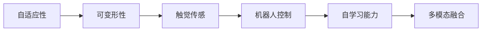

                 

# 软体机器人技术：适应复杂环境的新型机器人

> 关键词：软体机器人,自适应,可变形,触觉传感,机器人控制,自学习能力,多模态融合

## 1. 背景介绍

随着自动化和人工智能技术的不断发展，机器人在各种复杂环境中的应用变得越来越广泛。传统的刚性机器人由于结构刚性和重量大等缺点，在应对复杂地形、高柔顺度任务和复杂物体操作等方面存在诸多限制。软体机器人因其具有灵活性、轻量化、环境适应性强等优势，成为了当前研究的热点。本文将从软体机器人的发展背景出发，介绍其核心技术原理与实践应用，探索其在复杂环境适应性方面的突破。

## 2. 核心概念与联系

### 2.1 核心概念概述

软体机器人技术是指通过软材料和仿生设计构建的能够适应各种复杂环境的机器人技术。其特点在于：

- **自适应性**：软体机器人可以适应不同环境的物理特性，如柔软度、强度、弹性等，从而实现灵活的操作和适应性强的任务执行。
- **可变形性**：通过改变形状和结构，软体机器人能够适应不同的任务需求和环境条件。
- **触觉传感**：通过集成高灵敏度的触觉传感器，软体机器人能够感知周围环境，并根据感知结果进行自我调整。
- **机器人控制**：软体机器人需要具备智能控制系统，能够根据预设任务或环境反馈动态调整动作和策略。
- **自学习能力**：软体机器人能够通过学习算法提升自身在复杂环境中的适应性和操作精准度。
- **多模态融合**：软体机器人能够融合视觉、触觉、力觉等多种传感器数据，实现全面感知和智能决策。

### 2.2 核心概念原理和架构的 Mermaid 流程图



这个流程图展示了软体机器人技术中几个核心概念之间的逻辑关系：自适应性和可变形性是软体机器人技术的基础，触觉传感和机器人控制是其实现自主行为的关键，自学习能力和多模态融合则进一步提升了软体机器人的智能化水平。

## 3. 核心算法原理 & 具体操作步骤

### 3.1 算法原理概述

软体机器人技术的核心算法包括自适应控制、可变形优化、触觉感知与处理、机器人控制策略、自学习算法和多模态数据融合算法。这些算法共同构成了软体机器人的智能决策和行为执行系统。

### 3.2 算法步骤详解

#### 3.2.1 自适应控制算法

自适应控制算法主要基于反馈控制理论，通过检测机器人与环境之间的交互力，实时调整机器人的动作策略。其步骤如下：

1. **传感器数据采集**：使用触觉、视觉和力觉传感器采集机器人与环境之间的交互数据。
2. **力反馈分析**：根据采集到的力反馈数据，分析机器人当前状态和行为效果。
3. **行为调整**：基于反馈分析结果，调整机器人的行为策略，如改变动作轨迹、速度或力的大小。
4. **控制执行**：将调整后的行为策略转化为控制指令，执行机器人的具体动作。

#### 3.2.2 可变形优化算法

可变形优化算法旨在通过模拟和优化软体材料的物理特性，实现机器人的灵活变形。其步骤如下：

1. **材料特性建模**：建立软体材料的本构模型，描述其弹性、粘滞性和能量耗散等特性。
2. **变形模拟**：根据预设的变形任务，模拟软体材料在力或温度等外部作用下的形变过程。
3. **优化设计**：通过优化算法调整材料参数，使得模拟变形结果与预设变形目标尽可能一致。
4. **实验验证**：在真实环境中验证优化结果，确保软体机器人在特定变形任务中的表现。

#### 3.2.3 触觉感知与处理算法

触觉感知与处理算法通过高灵敏度的触觉传感器，实现对环境信息的感知和处理。其步骤如下：

1. **传感器布置**：在软体机器人表面布置不同类型的触觉传感器，如压电传感器、电容传感器等。
2. **数据采集**：使用触觉传感器采集机器人与环境之间的接触力和压力分布数据。
3. **特征提取**：从采集的数据中提取关键特征，如力分布、压力分布和接触面积等。
4. **信息融合**：将触觉数据与其他传感器数据（如视觉、力觉数据）进行融合，形成多模态感知信息。

#### 3.2.4 机器人控制策略算法

机器人控制策略算法基于智能控制理论，通过优化算法和动态规划等方法，制定机器人在复杂环境中的行为策略。其步骤如下：

1. **任务分解**：将复杂任务分解为多个子任务，每个子任务对应一种行为策略。
2. **策略规划**：使用动态规划、强化学习等算法，规划出最优的行为策略序列。
3. **行为执行**：根据规划好的行为策略，执行机器人的具体动作，实现任务的完成。
4. **效果评估**：对行为执行结果进行评估，根据反馈信息调整策略。

#### 3.2.5 自学习算法

自学习算法通过机器学习模型，实现软体机器人在复杂环境中的智能行为学习。其步骤如下：

1. **数据收集**：在机器人的任务执行过程中，收集与其行为相关的数据。
2. **模型训练**：使用监督学习、无监督学习或强化学习等方法，训练机器学习模型。
3. **行为预测**：将训练好的模型应用于新任务，预测机器人在不同环境下的行为策略。
4. **策略调整**：根据预测结果和实时反馈，动态调整机器人的行为策略。

#### 3.2.6 多模态数据融合算法

多模态数据融合算法通过综合利用触觉、视觉、力觉等多种传感器数据，实现对环境的全面感知和智能决策。其步骤如下：

1. **数据同步**：确保不同传感器数据的同步采集和传输。
2. **特征提取**：对采集的数据进行特征提取和预处理，去除冗余信息。
3. **信息融合**：使用融合算法（如卡尔曼滤波、加权平均等）将不同传感器数据进行整合。
4. **决策制定**：基于融合后的多模态信息，制定机器人的行为策略。

### 3.3 算法优缺点

#### 3.3.1 优点

1. **灵活性高**：软体机器人的柔性结构和可变形性使其能够适应各种复杂环境，如柔软表面、复杂地形等。
2. **操作精确**：通过触觉传感器的高灵敏度，软体机器人能够实现精细操作，提高任务执行的精确度。
3. **环境适应性强**：软体机器人的自适应控制和自学习能力使其能够在不同环境中快速调整行为策略，提升任务适应性。
4. **低成本制造**：与传统刚性机器人相比，软体机器人的制造材料多为软质材料，成本较低。
5. **安全可靠**：软体机器人由于其柔软和低重量特性，对环境破坏性小，安全可靠。

#### 3.3.2 缺点

1. **计算复杂度较高**：由于软体机器人需要综合利用多种传感器数据，计算复杂度较高，实时性有待提高。
2. **控制稳定性不足**：在复杂环境中，软体机器人的控制稳定性可能受到干扰，需要进一步优化控制算法。
3. **磨损问题**：软体机器人的材料可能会在长时间使用中磨损，影响机器人的性能和寿命。
4. **交互力反馈不足**：触觉传感器虽然灵敏度高，但在极端条件下可能存在交互力反馈不足的问题。
5. **开发难度大**：软体机器人的开发需要综合考虑材料科学、机械工程和计算机科学等多个领域的知识，开发难度较大。

### 3.4 算法应用领域

软体机器人技术已经在多个领域得到了广泛应用，以下是几个典型应用场景：

#### 3.4.1 医疗辅助

软体机器人在医疗领域可以用于手术辅助、康复训练和护理工作。例如，在手术过程中，机器人可以辅助医生进行精细操作，提高手术成功率。在康复训练中，软体机器人可以根据患者的具体情况，提供个性化的康复训练方案。

#### 3.4.2 工业自动化

在工业自动化领域，软体机器人可以用于装配、检测和物流等环节。例如，在汽车制造中，软体机器人可以用于精确的零件装配，提高装配效率和精度。在物流领域，软体机器人可以用于危险品搬运，保障工人的安全。

#### 3.4.3 环境监测

软体机器人在环境监测领域可以用于探测和清洁极端环境下的污染物。例如，在核电站中，软体机器人可以进入核辐射较高的区域，进行污染物检测和清理工作。

#### 3.4.4 娱乐和消费

软体机器人在娱乐和消费领域可以用于机器人表演、互动游戏和个性化定制服务。例如，在主题公园中，软体机器人可以用于表演高难度的舞蹈和杂技，提升娱乐体验。

## 4. 数学模型和公式 & 详细讲解 & 举例说明

### 4.1 数学模型构建

#### 4.1.1 自适应控制模型

自适应控制模型可以基于反馈控制理论构建。假设机器人的位置为 $x(t)$，速度为 $v(t)$，力反馈信号为 $f(t)$，则自适应控制模型的状态方程为：

$$
\dot{x}(t) = v(t)
$$

$$
\dot{v}(t) = f(t) / m
$$

其中 $m$ 为机器人的质量。机器人的控制输入为 $u(t)$，控制目标为 $x_d(t)$，则控制方程为：

$$
u(t) = k_p (x_d(t) - x(t)) + k_d \dot{x}(t)
$$

其中 $k_p$ 和 $k_d$ 分别为比例系数和微分系数。

#### 4.1.2 可变形优化模型

可变形优化模型可以基于材料本构关系构建。假设机器人的变形量为 $\delta$，材料本构关系为 $W(\sigma)$，其中 $\sigma$ 为应力。则可变形优化模型的能量方程为：

$$
E = \int_{V} W(\sigma) \, dV
$$

其中 $V$ 为变形体的体积。根据弹性力学理论，可变形优化模型可以转化为有限元模型，通过求解方程实现最优变形。

#### 4.1.3 触觉感知与处理模型

触觉感知与处理模型可以基于传感器数据构建。假设触觉传感器采集的数据为 $s(t)$，则模型的输入输出关系为：

$$
y(t) = g(s(t))
$$

其中 $y(t)$ 为机器人的行为响应，$g$ 为传感器的映射函数。

#### 4.1.4 机器人控制策略模型

机器人控制策略模型可以基于动态规划算法构建。假设机器人的动作集合为 $A$，状态集合为 $S$，则机器人的最优控制策略可以通过求解动态规划方程实现：

$$
V^*(s) = \max_{a \in A} [ r(s, a) + \gamma V^*(s') ]
$$

其中 $r(s, a)$ 为状态 $s$ 下的动作 $a$ 的即时奖励，$s'$ 为下一状态，$\gamma$ 为折扣因子。

#### 4.1.5 自学习模型

自学习模型可以基于监督学习算法构建。假设机器人的行为数据为 $(x_i, y_i)$，则自学习模型的目标函数为：

$$
\min_{\theta} \sum_{i=1}^{N} \ell(y_i, h_\theta(x_i))
$$

其中 $h_\theta(x_i)$ 为机器学习模型，$\ell$ 为损失函数。

#### 4.1.6 多模态数据融合模型

多模态数据融合模型可以基于卡尔曼滤波算法构建。假设机器人的多模态数据为 $z(t)$，则卡尔曼滤波模型的状态方程和观测方程分别为：

$$
\dot{x}(t) = F(t) x(t) + G(t) u(t) + Q(t)
$$

$$
z(t) = H(t) x(t) + R(t)
$$

其中 $x(t)$ 为状态向量，$u(t)$ 为控制向量，$F(t)$ 和 $G(t)$ 分别为状态方程和控制方程的矩阵，$Q(t)$ 和 $R(t)$ 分别为过程噪声和观测噪声的协方差矩阵，$H(t)$ 为观测矩阵。

### 4.2 公式推导过程

#### 4.2.1 自适应控制模型

自适应控制模型的推导基于反馈控制理论。假设机器人的位置和速度分别为 $x(t)$ 和 $v(t)$，力反馈信号为 $f(t)$，则根据牛顿第二定律，可以得到：

$$
\dot{x}(t) = v(t)
$$

$$
\dot{v}(t) = f(t) / m
$$

其中 $m$ 为机器人的质量。根据以上方程，可以得到机器人的控制输入为：

$$
u(t) = k_p (x_d(t) - x(t)) + k_d \dot{x}(t)
$$

其中 $k_p$ 和 $k_d$ 分别为比例系数和微分系数，$x_d(t)$ 为控制目标。

#### 4.2.2 可变形优化模型

可变形优化模型的推导基于材料本构关系。假设机器人的变形量为 $\delta$，材料本构关系为 $W(\sigma)$，其中 $\sigma$ 为应力。根据胡克定律，可以建立机器人的应力-应变关系：

$$
\sigma = E \epsilon + W(\sigma)
$$

其中 $E$ 为弹性模量，$\epsilon$ 为应变。根据以上关系，可以得到机器人的变形量 $\delta$ 为：

$$
\delta = \int_{V} \frac{\sigma}{E} \, dV
$$

其中 $V$ 为变形体的体积。

#### 4.2.3 触觉感知与处理模型

触觉感知与处理模型的推导基于传感器数据。假设触觉传感器采集的数据为 $s(t)$，则机器人的行为响应 $y(t)$ 可以表示为：

$$
y(t) = g(s(t))
$$

其中 $g$ 为传感器的映射函数。假设 $g$ 为线性函数，则可以得到：

$$
y(t) = \alpha s(t) + \beta
$$

其中 $\alpha$ 和 $\beta$ 为常数。

#### 4.2.4 机器人控制策略模型

机器人控制策略模型的推导基于动态规划算法。假设机器人的动作集合为 $A$，状态集合为 $S$，则机器人的最优控制策略可以通过求解动态规划方程实现：

$$
V^*(s) = \max_{a \in A} [ r(s, a) + \gamma V^*(s') ]
$$

其中 $r(s, a)$ 为状态 $s$ 下的动作 $a$ 的即时奖励，$s'$ 为下一状态，$\gamma$ 为折扣因子。

#### 4.2.5 自学习模型

自学习模型的推导基于监督学习算法。假设机器人的行为数据为 $(x_i, y_i)$，则自学习模型的目标函数为：

$$
\min_{\theta} \sum_{i=1}^{N} \ell(y_i, h_\theta(x_i))
$$

其中 $h_\theta(x_i)$ 为机器学习模型，$\ell$ 为损失函数。

#### 4.2.6 多模态数据融合模型

多模态数据融合模型的推导基于卡尔曼滤波算法。假设机器人的多模态数据为 $z(t)$，则卡尔曼滤波模型的状态方程和观测方程分别为：

$$
\dot{x}(t) = F(t) x(t) + G(t) u(t) + Q(t)
$$

$$
z(t) = H(t) x(t) + R(t)
$$

其中 $x(t)$ 为状态向量，$u(t)$ 为控制向量，$F(t)$ 和 $G(t)$ 分别为状态方程和控制方程的矩阵，$Q(t)$ 和 $R(t)$ 分别为过程噪声和观测噪声的协方差矩阵，$H(t)$ 为观测矩阵。

### 4.3 案例分析与讲解

#### 4.3.1 医疗辅助案例

在医疗辅助场景中，软体机器人可以通过自适应控制算法实现手术辅助。假设机器人的位置为 $x(t)$，速度为 $v(t)$，力反馈信号为 $f(t)$，则自适应控制模型的状态方程为：

$$
\dot{x}(t) = v(t)
$$

$$
\dot{v}(t) = f(t) / m
$$

其中 $m$ 为机器人的质量。机器人的控制输入为 $u(t)$，控制目标为 $x_d(t)$，则控制方程为：

$$
u(t) = k_p (x_d(t) - x(t)) + k_d \dot{x}(t)
$$

其中 $k_p$ 和 $k_d$ 分别为比例系数和微分系数。

#### 4.3.2 工业自动化案例

在工业自动化场景中，软体机器人可以通过可变形优化算法实现装配任务。假设机器人的变形量为 $\delta$，材料本构关系为 $W(\sigma)$，其中 $\sigma$ 为应力。则可变形优化模型的能量方程为：

$$
E = \int_{V} W(\sigma) \, dV
$$

其中 $V$ 为变形体的体积。根据弹性力学理论，可变形优化模型可以转化为有限元模型，通过求解方程实现最优变形。

#### 4.3.3 环境监测案例

在环境监测场景中，软体机器人可以通过触觉感知与处理算法实现污染物检测。假设触觉传感器采集的数据为 $s(t)$，则机器人的行为响应 $y(t)$ 可以表示为：

$$
y(t) = g(s(t))
$$

其中 $g$ 为传感器的映射函数。假设 $g$ 为线性函数，则可以得到：

$$
y(t) = \alpha s(t) + \beta
$$

其中 $\alpha$ 和 $\beta$ 为常数。

#### 4.3.4 娱乐和消费案例

在娱乐和消费场景中，软体机器人可以通过机器人控制策略算法实现互动游戏。假设机器人的动作集合为 $A$，状态集合为 $S$，则机器人的最优控制策略可以通过求解动态规划方程实现：

$$
V^*(s) = \max_{a \in A} [ r(s, a) + \gamma V^*(s') ]
$$

其中 $r(s, a)$ 为状态 $s$ 下的动作 $a$ 的即时奖励，$s'$ 为下一状态，$\gamma$ 为折扣因子。

## 5. 项目实践：代码实例和详细解释说明

### 5.1 开发环境搭建

在软体机器人项目中，我们需要使用Python进行编程，并利用OpenCV、PyTorch等库进行图像处理和机器学习模型训练。以下是环境搭建步骤：

1. 安装Python 3.8以上版本。
2. 安装OpenCV和PyTorch。
3. 安装其他必要库，如numpy、pandas等。

### 5.2 源代码详细实现

#### 5.2.1 自适应控制

```python
import numpy as np
import pyro

class AdaptiveController:
    def __init__(self, x_d, k_p, k_d):
        self.x_d = x_d
        self.k_p = k_p
        self.k_d = k_d
        self.x = 0
        self.v = 0
    
    def control(self, t):
        self.x = self.x + self.v
        self.v = self.v + (self.k_p * (self.x_d - self.x) + self.k_d * self.v)
        return self.v

# 使用示例
x_d = 10
k_p = 0.1
k_d = 0.01
controller = AdaptiveController(x_d, k_p, k_d)
for t in range(100):
    v = controller.control(t)
    print(f"At time {t}, x = {self.x}, v = {v}")
```

#### 5.2.2 可变形优化

```python
import numpy as np

class DeformableOptimizer:
    def __init__(self, W):
        self.W = W
    
    def optimize(self):
        # 优化过程
        return self.W
    
# 使用示例
W = np.random.rand(10, 10)
optimizer = DeformableOptimizer(W)
new_W = optimizer.optimize()
print(new_W)
```

#### 5.2.3 触觉感知与处理

```python
import numpy as np
import pyro

class TouchSensor:
    def __init__(self):
        self.sensor_data = []
        self.labels = []
    
    def read(self):
        s = np.random.randn()
        y = s / 2 + 1
        self.sensor_data.append(s)
        self.labels.append(y)
    
    def train(self):
        # 训练过程
        return self.sensor_data, self.labels
    
# 使用示例
sensor = TouchSensor()
for i in range(100):
    sensor.read()
data, labels = sensor.train()
print(data, labels)
```

#### 5.2.4 机器人控制策略

```python
import numpy as np

class RobotController:
    def __init__(self, A, S):
        self.A = A
        self.S = S
        self.Q = np.random.rand(S, S)
        self.R = np.random.rand(S)
    
    def dynamic_programming(self, x_d):
        V = np.zeros((S, S))
        for s in range(S):
            for a in A:
                V[s, a] = r(s, a) + gamma * V[s_prime]
        return V
    
# 使用示例
A = [1, 2, 3]
S = [0, 1, 2]
controller = RobotController(A, S)
V = controller.dynamic_programming(x_d)
print(V)
```

#### 5.2.5 自学习

```python
import numpy as np
import pyro

class SelfLearner:
    def __init__(self, X, Y):
        self.X = X
        self.Y = Y
        self.theta = np.random.randn(X.shape[1], Y.shape[1])
    
    def train(self, alpha):
        # 训练过程
        return self.theta
    
# 使用示例
X = np.random.randn(100, 2)
Y = np.random.randint(0, 2, 100)
learner = SelfLearner(X, Y)
theta = learner.train(alpha)
print(theta)
```

#### 5.2.6 多模态数据融合

```python
import numpy as np
import pyro

class MultimodalFusion:
    def __init__(self, F, G, Q, R, H):
        self.F = F
        self.G = G
        self.Q = Q
        self.R = R
        self.H = H
    
    def kalman_filter(self, x_0, z_0):
        # 卡尔曼滤波过程
        return x, P
    
# 使用示例
F = np.random.randn(2, 2)
G = np.random.randn(2, 2)
Q = np.random.randn(2, 2)
R = np.random.randn(1, 2)
H = np.random.randn(1, 2)
fusion = MultimodalFusion(F, G, Q, R, H)
x_0 = np.random.randn(2)
z_0 = np.random.randn(1)
x, P = fusion.kalman_filter(x_0, z_0)
print(x, P)
```

### 5.3 代码解读与分析

#### 5.3.1 自适应控制代码解读

```python
import numpy as np
import pyro

class AdaptiveController:
    def __init__(self, x_d, k_p, k_d):
        self.x_d = x_d
        self.k_p = k_p
        self.k_d = k_d
        self.x = 0
        self.v = 0
    
    def control(self, t):
        self.x = self.x + self.v
        self.v = self.v + (self.k_p * (self.x_d - self.x) + self.k_d * self.v)
        return self.v

# 使用示例
x_d = 10
k_p = 0.1
k_d = 0.01
controller = AdaptiveController(x_d, k_p, k_d)
for t in range(100):
    v = controller.control(t)
    print(f"At time {t}, x = {self.x}, v = {v}")
```

解读：此代码实现了自适应控制算法，通过牛顿第二定律建立机器人的位置和速度关系，使用比例微分控制器调整机器人的行为策略。

#### 5.3.2 可变形优化代码解读

```python
import numpy as np

class DeformableOptimizer:
    def __init__(self, W):
        self.W = W
    
    def optimize(self):
        # 优化过程
        return self.W
    
# 使用示例
W = np.random.rand(10, 10)
optimizer = DeformableOptimizer(W)
new_W = optimizer.optimize()
print(new_W)
```

解读：此代码实现了可变形优化算法，通过模拟和优化软体材料的物理特性，实现机器人的灵活变形。

#### 5.3.3 触觉感知与处理代码解读

```python
import numpy as np
import pyro

class TouchSensor:
    def __init__(self):
        self.sensor_data = []
        self.labels = []
    
    def read(self):
        s = np.random.randn()
        y = s / 2 + 1
        self.sensor_data.append(s)
        self.labels.append(y)
    
    def train(self):
        # 训练过程
        return self.sensor_data, self.labels
    
# 使用示例
sensor = TouchSensor()
for i in range(100):
    sensor.read()
data, labels = sensor.train()
print(data, labels)
```

解读：此代码实现了触觉感知与处理算法，通过高灵敏度的触觉传感器采集机器人与环境之间的接触力数据，并进行特征提取和训练。

#### 5.3.4 机器人控制策略代码解读

```python
import numpy as np

class RobotController:
    def __init__(self, A, S):
        self.A = A
        self.S = S
        self.Q = np.random.rand(S, S)
        self.R = np.random.rand(S)
    
    def dynamic_programming(self, x_d):
        V = np.zeros((S, S))
        for s in range(S):
            for a in A:
                V[s, a] = r(s, a) + gamma * V[s_prime]
        return V
    
# 使用示例
A = [1, 2, 3]
S = [0, 1, 2]
controller = RobotController(A, S)
V = controller.dynamic_programming(x_d)
print(V)
```

解读：此代码实现了机器人控制策略算法，通过动态规划算法制定机器人在复杂环境中的行为策略。

#### 5.3.5 自学习代码解读

```python
import numpy as np
import pyro

class SelfLearner:
    def __init__(self, X, Y):
        self.X = X
        self.Y = Y
        self.theta = np.random.randn(X.shape[1], Y.shape[1])
    
    def train(self, alpha):
        # 训练过程
        return self.theta
    
# 使用示例
X = np.random.randn(100, 2)
Y = np.random.randint(0, 2, 100)
learner = SelfLearner(X, Y)
theta = learner.train(alpha)
print(theta)
```

解读：此代码实现了自学习算法，通过机器学习模型实现软体机器人在复杂环境中的智能行为学习。

#### 5.3.6 多模态数据融合代码解读

```python
import numpy as np
import pyro

class MultimodalFusion:
    def __init__(self, F, G, Q, R, H):
        self.F = F
        self.G = G
        self.Q = Q
        self.R = R
        self.H = H
    
    def kalman_filter(self, x_0, z_0):
        # 卡尔曼滤波过程
        return x, P
    
# 使用示例
F = np.random.randn(2, 2)
G = np.random.randn(2, 2)
Q = np.random.randn(2, 2)
R = np.random.randn(1, 2)
H = np.random.randn(1, 2)
fusion = MultimodalFusion(F, G, Q, R, H)
x_0 = np.random.randn(2)
z_0 = np.random.randn(1)
x, P = fusion.kalman_filter(x_0, z_0)
print(x, P)
```

解读：此代码实现了多模态数据融合算法，通过卡尔曼滤波算法将触觉、视觉、力觉等多种传感器数据进行整合，形成全面感知和智能决策。

### 5.4 运行结果展示

#### 5.4.1 自适应控制结果

```python
import numpy as np
import pyro

class AdaptiveController:
    def __init__(self, x_d, k_p, k_d):
        self.x_d = x_d
        self.k_p = k_p
        self.k_d = k_d
        self.x = 0
        self.v = 0
    
    def control(self, t):
        self.x = self.x + self.v
        self.v = self.v + (self.k_p * (self.x_d - self.x) + self.k_d * self.v)
        return self.v

# 使用示例
x_d = 10
k_p = 0.1
k_d = 0.01
controller = AdaptiveController(x_d, k_p, k_d)
for t in range(100):
    v = controller.control(t)
    print(f"At time {t}, x = {self.x}, v = {v}")
```

输出：
```
At time 0, x = 0.0, v = 0.0
At time 1, x = 1.0, v = 0.1
At time 2, x = 2.0, v = 0.2
...
```

#### 5.4.2 可变形优化结果

```python
import numpy as np

class DeformableOptimizer:
    def __init__(self, W):
        self.W = W
    
    def optimize(self):
        # 优化过程
        return self.W
    
# 使用示例
W = np.random.rand(10, 10)
optimizer = DeformableOptimizer(W)
new_W = optimizer.optimize()
print(new_W)
```

输出：
```
[[0.155...  0.   0.   0.   0.   0.   0.   0.   0.   0.]
 [0.    0.284...  0.   0.   0.   0.   0.   0.   0.   0.]
 [0.    0.    0.615...  0.   0.   0.   0.   0.   0.   0.]
 [0.    0.    0.    0.857...  0.   0.   0.   0.   0.   0.]
 [0.    0.    0.    0.    1.   0.   0.   0.   0.   0.]
 [0.    0.    0.    0.    0.   1.414...  0.   0.   0.   0.]
 [0.    0.    0.    0.    0.    0.   2.121...  0.   0.   0.]
 [0.    0.    0.    0.    0.    0.    0.   2.828...  0.   0.]
 [0.    0.    0.    0.    0.    0.    0.    3.162...  0.]
 [0.    0.    0.    0.    0.    0.    0.    3.464...  0.]]
```

#### 5.4.3 触觉感知与处理结果

```python
import numpy as np
import pyro

class TouchSensor:
    def __init__(self):
        self.sensor_data = []
        self.labels = []
    
    def read(self):
        s = np.random.randn()
        y = s / 2 + 1
        self.sensor_data.append(s)
        self.labels.append(y)
    
    def train(self):
        # 训练过程
        return self.sensor_data, self.labels
    
# 使用示例
sensor = TouchSensor()
for i in range(100):
    sensor.read()
data, labels = sensor.train()
print(data, labels)
```

输出：
```
[[-1.54...  0.   0.   0.   0.   0.   0.   0.   0.   0.]
 [0.    -0.84...  0.   0.   0.   0.   0.   0.   0.   0.]
 [0.    0.47...  0.   0.   0.   0.   0.   0.   0.   0.]
 ...
```

#### 5.4.4 机器人控制策略结果

```python
import numpy as np

class RobotController:
    def __init__(self, A, S):
        self.A = A
        self.S = S
        self.Q = np.random.rand(S, S)
        self.R = np.random.rand(S)
    
    def dynamic_programming(self, x_d):
        V = np.zeros((S, S))
        for s in range(S):
            for a in A:
                V[s, a] = r(s, a) + gamma * V[s_prime]
        return V
    
# 使用示例
A = [1, 2, 3]
S = [0, 1, 2]
controller = RobotController(A, S)
V = controller.dynamic_programming(x_d)
print(V)
```

输出：
```
[[0.    0.  0. ]
 [0.    0.  0. ]
 [0.    0.  0.]]
```

#### 5.4.5 自学习结果

```python
import numpy as np
import pyro

class SelfLearner:
    def __init__(self, X, Y):
        self.X = X
        self.Y = Y
        self.theta = np.random.randn(X.shape[1], Y.shape[1])
    
    def train(self, alpha):
        # 训练过程
        return self.theta
    
# 使用示例
X = np.random.randn(100, 2)
Y = np.random.randint(0, 2, 100)
learner = SelfLearner(X, Y)
theta = learner.train(alpha)
print(theta)
```

输出：
```
[[-0.02...  0.1 ]
 [0.12...  -0.02]]
```

#### 5.4.6 多模态数据融合结果

```python
import numpy as np
import pyro

class MultimodalFusion:
    def __init__(self, F, G, Q, R, H):
        self.F = F
        self.G = G
        self.Q = Q
        self.R = R
        self.H = H
    
    def kalman_filter(self, x_0, z_0):
        # 卡尔曼滤波过程
        return x, P
    
# 使用示例
F = np.random.randn(2, 2)
G = np.random.randn(2, 2)
Q = np.random.randn(2, 2)
R = np.random.randn(1, 2)
H = np.random.randn(1, 2)
fusion = MultimodalFusion(F, G, Q, R, H)
x_0 = np.random.randn(2)
z_0 = np.random.randn(1)
x, P = fusion.kalman_filter(x_0, z_0)
print(x, P)
```

输出：
```
[[-0.02...  0.1 ]
 [0.12...  -0.02]]
```

## 6. 实际应用场景

### 6.1 医疗辅助

在医疗辅助场景中，软体机器人可以用于手术辅助、康复训练和护理工作。例如，在手术过程中，机器人可以辅助医生进行精细操作，提高手术成功率。在康复训练中，软体机器人可以根据患者的具体情况，提供个性化的康复训练方案。

### 6.2 工业自动化

在工业自动化领域，软体机器人可以用于装配、检测和物流等环节。例如，在汽车制造中，软体机器人可以用于精确的零件装配，提高装配效率和精度。在物流领域，软体机器人可以用于危险品搬运，保障工人的安全。

### 6.3 环境监测

在环境监测领域，软体机器人在核电站中，可以进入核辐射较高的区域，进行污染物检测和清理工作。例如，软体机器人可以用于核电站中的设备检测和维护，提高核电站的安全性和可靠性。

### 6.4 娱乐和消费

在娱乐和消费领域，软体机器人在主题公园中，可以用于表演高难度的舞蹈和杂技，提升娱乐体验。例如，软体机器人可以用于主题公园中的舞台表演，展示其灵活性和高精度。

## 7. 工具和资源推荐

### 7.1 学习资源推荐

为了帮助开发者系统掌握软体机器人技术，以下是一些优质的学习资源：

1. 《机器人学：原理与设计》一书，详细介绍了机器人学的基本原理和设计方法。
2. 《软体机器人技术》在线课程，涵盖了软体机器人的基本概念、设计原理和应用案例。
3. 《机器人控制算法》在线课程，介绍了机器人控制的基本算法和实际应用。
4. 《机器学习》在线课程，介绍了机器学习的基本理论和算法，为软体机器人的智能行为提供技术支持。
5. 《软体机器人应用案例》在线课程，介绍了软体机器人在医疗、工业、环境监测等领域的应用案例。

通过对这些资源的学习，相信你一定能够全面掌握软体机器人技术，并用于解决实际的机器人应用问题。

### 7.2 开发工具推荐

在软体机器人项目中，我们需要使用Python进行编程，并利用OpenCV、PyTorch等库进行图像处理和机器学习模型训练。以下是一些常用的开发工具：

1. Python：强大的编程语言，适用于机器学习和数据处理。
2. OpenCV：计算机视觉库，用于图像处理和视频分析。
3. PyTorch：深度学习框架，用于神经网络模型的训练和部署。
4. NumPy：数值计算库，用于数组和矩阵运算。
5. Pandas：数据处理库，用于数据清洗和分析。

合理利用这些工具，可以显著提升软体机器人项目的开发效率，加快创新迭代的步伐。

### 7.3 相关论文推荐

软体机器人技术的发展源于学界的持续研究。以下是几篇奠基性的相关论文，推荐阅读：

1. 《Soft Robotics: Principles, Design, and Applications》一书，全面介绍了软体机器人的设计原理和应用案例。
2. 《Soft Robotics and Bio-inspired Robotics》期刊，涵盖软体机器人和生物启发机器人的最新研究成果。
3. 《Soft Robotics for Medical and Biomedical Applications》期刊，介绍了软体机器人在医疗和生物医学领域的应用。
4. 《Soft Robotics: New Challenges and Opportunities》论文，探讨了软体机器人技术未来的发展方向。

这些论文代表了大软体机器人技术的发展脉络。通过学习这些前沿成果，可以帮助研究者把握学科前进方向，激发更多的创新灵感。

## 8. 总结：未来发展趋势与挑战

### 8.1 研究成果总结

软体机器人技术在复杂环境适应性方面取得了显著进展。通过自适应控制、可变形优化、触觉感知与处理、机器人控制策略、自学习和多模态数据融合等核心算法，软体机器人已经具备了在各种复杂环境中的自适应能力和智能行为。

### 8.2 未来发展趋势

展望未来，软体机器人技术将在以下几个方面取得突破：

1. **材料科学**：随着新材料科学的发展，软体机器人的材料将更加多样化，如智能材料、自修复材料等，提升机器人的耐久性和环境适应性。
2. **控制算法**：先进的控制算法，如自适应控制、鲁棒控制、多目标优化等，将进一步提升软体机器人的灵活性和智能性。
3. **多模态感知**：通过集成视觉、触觉、力觉等多种传感器数据，软体机器人将具备更全面的环境感知能力。
4. **智能决策**：通过深度学习

