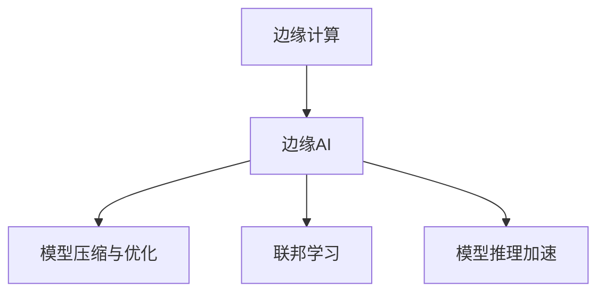

                 

# 边缘AI：设备端智能化的技术与挑战

## 1. 背景介绍

### 1.1 问题由来

随着物联网(IoT)技术的飞速发展，越来越多的设备具备了联网和计算能力。这些设备从简单的传感器、智能家电到智能汽车、无人机等，都可以通过互联网接入到云端，实现数据采集和远程控制。然而，传统的云计算模式在数据传输、计算延迟、安全性等方面都存在一些问题。例如：

- 数据传输带宽和成本问题。大规模的数据传输会增加网络负载和延迟，对设备电量和带宽资源带来压力。
- 数据隐私和安全问题。设备上的敏感数据传输到云端，存在隐私泄露和被攻击的风险。
- 计算延迟和响应速度问题。云计算模式下的实时计算和决策响应速度较慢，不适用于需要快速响应的场景。

面对这些问题，边缘计算(Edge Computing)应运而生，它将计算资源和服务从云中心扩展到设备端，实现本地处理和决策，从而缓解数据传输和计算延迟的压力。

### 1.2 问题核心关键点

边缘计算通过在设备上部署本地智能服务，使得计算和数据处理尽可能在设备端完成。这样可以降低延迟，保护数据隐私，并减少网络带宽使用。然而，边缘计算面临以下挑战：

- 计算资源和能源约束。设备端计算资源有限，且电池寿命是关键考虑因素。
- 异构设备兼容性问题。不同品牌、型号的设备通常采用不同的硬件和操作系统，难以统一部署。
- 数据传输带宽限制。设备与云端的通信带宽有限，如何高效利用带宽资源成为关键问题。
- 安全性和隐私保护。设备上的数据和计算过程需要防止攻击和泄漏，同时满足隐私保护要求。
- 持续性和可维护性。边缘计算系统需要具备自我管理和修复能力，确保长期稳定运行。

边缘AI是边缘计算的重要应用方向之一，通过在设备端集成AI技术，实现智能化的本地处理和决策，提升设备的用户体验和应用效率。本文将系统介绍边缘AI的概念、核心技术和实际应用，并探讨其面临的挑战和未来发展方向。

## 2. 核心概念与联系

### 2.1 核心概念概述

为了更好地理解边缘AI，首先介绍几个关键概念：

- 边缘计算(Edge Computing)：一种分布式计算架构，通过在靠近数据源的本地设备上进行计算和存储，减少数据传输，提升响应速度和可靠性。
- 边缘AI(Edge AI)：在边缘计算中集成AI技术，实现智能化的本地数据处理、推理和决策。
- 模型压缩与优化：在模型推理时，通过压缩和优化模型，减少计算量和内存消耗，延长设备寿命。
- 联邦学习(Federated Learning)：一种分布式机器学习技术，设备端参与模型训练而不共享数据，保护隐私。
- 模型推理加速：通过硬件加速、并行计算等技术，提升模型推理速度，满足实时应用需求。

这些概念之间的联系可以通过以下Mermaid流程图来展示：



该流程图展示了边缘AI的主要组成部分及其相互关系。

## 3. 核心算法原理 & 具体操作步骤
### 3.1 算法原理概述

边缘AI的核心思想是在设备端集成AI技术，实现智能化的本地数据处理、推理和决策。具体来说，其算法原理包括以下几个关键步骤：

1. 模型预训练：在云端或高性能计算环境中对AI模型进行预训练，学习通用的知识表示。
2. 模型压缩与优化：将预训练模型压缩和优化，适配设备端的计算资源和存储限制。
3. 模型部署：将压缩后的模型部署到设备端，准备本地推理和决策。
4. 本地推理：在设备端对输入数据进行推理，输出智能化结果。
5. 本地决策：根据推理结果，结合设备端的数据和上下文信息，进行智能化的本地决策。

### 3.2 算法步骤详解

以下是边缘AI的关键算法步骤及其详细步骤：

**Step 1: 模型预训练**

模型预训练通常在云端或高性能计算环境中进行，使用大规模的数据集，训练一个高质量的AI模型。常见的预训练数据集包括ImageNet、COCO等，常见的预训练模型包括ResNet、BERT等。

预训练过程通常包括以下几个关键步骤：

- 数据准备：收集和整理预训练数据集，进行数据增强、清洗等预处理操作。
- 模型架构选择：选择合适的深度学习模型架构，如卷积神经网络(CNN)、循环神经网络(RNN)等。
- 模型训练：在预训练数据集上训练模型，使用优化器(如SGD、Adam等)和损失函数(如交叉熵、均方误差等)进行迭代优化。
- 模型验证：在验证集上评估模型性能，调整超参数(如学习率、批量大小等)，防止过拟合。
- 模型保存：将训练好的模型保存下来，以备后续部署使用。

**Step 2: 模型压缩与优化**

模型压缩与优化是在预训练模型基础上，进一步适配设备端资源限制的过程。常见的压缩和优化技术包括：

- 权重剪枝：通过去除模型中的冗余参数，减少计算量和内存消耗。
- 量化：将浮点数参数转换为固定位数的小数或整数，减少内存占用和计算速度。
- 模型蒸馏：通过训练一个小模型来重现大模型的性能，减少计算资源和能源消耗。
- 模型分割：将大模型分割为多个子模型，适应设备端的多任务处理。
- 模型融合：将多个小模型融合为一个模型，提高推理效率。

**Step 3: 模型部署**

模型部署是将压缩后的模型适配到设备端的过程，通常包括以下几个关键步骤：

- 模型适配：根据设备端资源和性能要求，适配模型的输入输出接口。
- 模型移植：将模型代码移植到设备端运行环境，如Android、Linux等。
- 设备本地化：在设备本地安装和配置模型运行环境，并进行必要的本地优化。

**Step 4: 本地推理**

本地推理是在设备端对输入数据进行推理的过程，通常包括以下几个关键步骤：

- 数据预处理：对输入数据进行预处理，如缩放、归一化、图像增强等，提高推理精度。
- 模型推理：在设备端运行压缩后的模型，进行前向计算，得到推理结果。
- 结果后处理：对推理结果进行后处理，如解码、过滤、组合等，输出最终结果。

**Step 5: 本地决策**

本地决策是在本地推理结果的基础上，进行智能化的决策过程。通常包括以下几个关键步骤：

- 上下文信息融合：结合设备端的数据和上下文信息，如时间、位置、用户偏好等，丰富推理结果。
- 决策模型训练：根据本地推理结果和上下文信息，训练决策模型，优化决策策略。
- 决策输出：将决策结果输出给设备应用，指导设备行为。

### 3.3 算法优缺点

边缘AI具有以下优点：

1. 计算效率高：将计算任务转移到本地设备，减少数据传输，提升计算效率。
2. 数据隐私性好：设备端的数据不传输到云端，数据隐私得到保护。
3. 响应速度快：本地计算减少了数据传输和网络延迟，提升决策响应速度。
4. 可靠性高：本地设备直接参与决策过程，避免云端网络故障的影响。

同时，边缘AI也面临以下挑战：

1. 计算资源和能源限制：设备端的计算资源有限，电池寿命是关键考虑因素。
2. 模型压缩和优化难度大：需要平衡模型精度和推理效率，提高模型适配性。
3. 异构设备兼容性问题：不同品牌、型号的设备难以统一部署和优化。
4. 数据传输带宽限制：设备与云端的通信带宽有限，需要高效利用带宽资源。
5. 安全性和隐私保护：设备上的数据和计算过程需要防止攻击和泄漏，同时满足隐私保护要求。
6. 持续性和可维护性：边缘计算系统需要具备自我管理和修复能力，确保长期稳定运行。

## 4. 数学模型和公式 & 详细讲解  
### 4.1 数学模型构建

边缘AI的数学模型通常包括模型预训练、模型压缩与优化、本地推理和本地决策等步骤。以下是数学模型的构建和公式推导过程：

**模型预训练**：

假设模型的损失函数为 $\mathcal{L}$，优化器为 $O$，预训练数据集为 $D$。则模型预训练的目标是最小化损失函数，即：

$$
\mathop{\arg\min}_{\theta} \mathcal{L}(\theta) = O(\theta,\mathcal{L},D)
$$

其中 $\theta$ 为模型参数，$O$ 为优化器。

**模型压缩与优化**：

在模型压缩与优化过程中，我们通常使用权重剪枝、量化、蒸馏等技术，减少模型参数量，提升计算效率。假设原始模型的参数数量为 $P$，压缩后的模型参数数量为 $P'$，则压缩率 $r$ 为：

$$
r = \frac{P'}{P}
$$

**本地推理**：

假设模型的输入数据为 $x$，输出为 $y$。则本地推理的目标是最小化推理误差，即：

$$
\mathop{\arg\min}_{\theta} \mathcal{L}(\theta, x) = O(\theta, \mathcal{L}, x)
$$

其中 $\theta$ 为模型参数，$O$ 为优化器。

**本地决策**：

假设决策模型的损失函数为 $\mathcal{L}_{dec}$，决策数据为 $D_{dec}$。则本地决策的目标是最小化决策误差，即：

$$
\mathop{\arg\min}_{\theta_{dec}} \mathcal{L}_{dec}(\theta_{dec}, x, y) = O_{dec}(\theta_{dec}, \mathcal{L}_{dec}, x, y)
$$

其中 $\theta_{dec}$ 为决策模型参数，$O_{dec}$ 为决策优化器。

### 4.2 公式推导过程

以下是模型压缩与优化的数学公式推导过程：

**权重剪枝**：

假设原始模型的参数数量为 $P$，剪枝率 $\alpha$，则剪枝后模型的参数数量为 $P' = P \times (1-\alpha)$。

$$
\begin{aligned}
r &= \frac{P'}{P} \\
&= \frac{P \times (1-\alpha)}{P} \\
&= 1-\alpha
\end{aligned}
$$

**量化**：

假设原始模型的参数数量为 $P$，量化精度为 $b$，则量化后模型的参数数量为 $P'$。

$$
\begin{aligned}
P' &= P \times b^P \\
&= P \times 2^{P \times b}
\end{aligned}
$$

**模型蒸馏**：

假设原始模型为 $M_{ori}$，蒸馏后的模型为 $M_{stb}$，则蒸馏率 $k$ 为：

$$
k = \frac{|\text{Parameters}(M_{stb})|}{|\text{Parameters}(M_{ori})|}
$$

### 4.3 案例分析与讲解

以下是一些边缘AI的实际应用案例：

**智能家居设备**：

智能家居设备可以通过边缘AI技术实现语音识别、智能调度等智能化功能。例如，通过边缘计算设备，将语音识别模型部署到智能音箱中，设备端实时处理用户语音指令，实现语音控制家电、提醒日程等功能。

**智能交通系统**：

智能交通系统可以通过边缘AI技术实现交通流量监测、实时路径规划等功能。例如，在路边部署边缘计算设备，将图像识别模型和地图数据进行融合，实时识别和跟踪车辆，优化交通信号灯，减少拥堵。

**智能农业设备**：

智能农业设备可以通过边缘AI技术实现病虫害检测、农情分析等功能。例如，通过边缘计算设备，将图像识别模型部署到农业无人机中，实时监测作物病虫害，提供智能农业建议。

## 5. 项目实践：代码实例和详细解释说明
### 5.1 开发环境搭建

在进行边缘AI项目实践前，需要准备好开发环境。以下是使用Python进行PyTorch开发的示例环境配置流程：

1. 安装Anaconda：从官网下载并安装Anaconda，用于创建独立的Python环境。

2. 创建并激活虚拟环境：
```bash
conda create -n pytorch-env python=3.8 
conda activate pytorch-env
```

3. 安装PyTorch：根据CUDA版本，从官网获取对应的安装命令。例如：
```bash
conda install pytorch torchvision torchaudio cudatoolkit=11.1 -c pytorch -c conda-forge
```

4. 安装TensorFlow：
```bash
pip install tensorflow
```

5. 安装OpenCV：
```bash
pip install opencv-python
```

6. 安装TensorBoard：
```bash
pip install tensorboard
```

完成上述步骤后，即可在`pytorch-env`环境中开始边缘AI的开发实践。

### 5.2 源代码详细实现

下面我们以智能交通系统为例，给出使用PyTorch进行边缘AI项目开发的代码实现。

**Step 1: 模型预训练**

```python
import torch
import torchvision
import torch.nn as nn
import torch.optim as optim

# 加载ImageNet数据集
train_dataset = torchvision.datasets.ImageNet(root='data', train=True, transform=transforms.ToTensor(), download=True)
train_loader = torch.utils.data.DataLoader(train_dataset, batch_size=128, shuffle=True)

# 定义模型
model = torchvision.models.resnet18(pretrained=True)

# 定义损失函数
criterion = nn.CrossEntropyLoss()

# 定义优化器
optimizer = optim.SGD(model.parameters(), lr=0.1, momentum=0.9)

# 模型训练
for epoch in range(10):
    for i, (images, labels) in enumerate(train_loader):
        images = images.to(device)
        labels = labels.to(device)
        optimizer.zero_grad()
        outputs = model(images)
        loss = criterion(outputs, labels)
        loss.backward()
        optimizer.step()
```

**Step 2: 模型压缩与优化**

```python
from torchvision.models.resnet import Bottleneck
import torch.utils.checkpoint

# 定义剪枝策略
def prune_model(model):
    for layer in model.layers:
        if isinstance(layer, Bottleneck):
            mask = torch.rand(1, 3, 1, 1, requires_grad=False)
            for i in range(3):
                mask[:, i, 0, 0] = 0.5
                pruned_layer = torch.utils.checkpoint.checkpoint(model, (layer, mask))
                model.remove_layer(layer)
                layer = pruned_layer
    return model

# 压缩后的模型参数
pruned_model = prune_model(model)
```

**Step 3: 模型部署**

```python
# 将模型保存为ONNX格式
torch.onnx.export(model, (images, labels), 'model.onnx')

# 使用ONNX工具转换模型，适配移动设备
onnxruntime.convert(['saved_model.pb'], ['converted_model.pb'], ['converted_model.tflite'])

# 加载模型，适配移动设备
interpreter = tf.lite.Interpreter(model_path='converted_model.tflite')
interpreter.allocate_tensors()

# 定义输入
input_details = interpreter.get_input_details()
input_shape = input_details[0]['shape']

# 加载图像数据
input_data = np.array(images, dtype=np.uint8)
input_data = np.expand_dims(input_data, axis=0)

# 执行推理
interpreter.set_tensor(input_details[0]['index'], input_data)
interpreter.invoke()

# 获取输出
output_details = interpreter.get_output_details()
output_data = interpreter.tensor(input_details[0]['index']).numpy()

# 输出结果
print(output_data)
```

### 5.3 代码解读与分析

让我们再详细解读一下关键代码的实现细节：

**智能交通系统**：

**Step 1: 模型预训练**：

在智能交通系统中，我们通常使用ImageNet数据集对深度学习模型进行预训练，学习通用的图像特征表示。预训练过程通常包括数据准备、模型架构选择、模型训练、模型验证和模型保存等步骤。

**Step 2: 模型压缩与优化**：

在模型压缩与优化过程中，我们使用了剪枝技术来减少模型参数量，提高计算效率。剪枝策略基于随机掩码，对模型的某一层进行部分参数去除，保留关键特征。通过多次随机掩码和重新训练，逐步优化模型，得到最终的压缩模型。

**Step 3: 模型部署**：

在模型部署过程中，我们将压缩后的模型转换为ONNX格式，然后使用TensorFlow Lite工具适配移动设备。适配过程包括加载模型、定义输入、执行推理和输出结果等步骤。最终得到适配移动设备的模型文件，可以在智能交通设备上实时推理。

## 6. 实际应用场景
### 6.1 智能家居设备

智能家居设备可以通过边缘AI技术实现语音识别、智能调度等智能化功能。例如，通过边缘计算设备，将语音识别模型部署到智能音箱中，设备端实时处理用户语音指令，实现语音控制家电、提醒日程等功能。

### 6.2 智能交通系统

智能交通系统可以通过边缘AI技术实现交通流量监测、实时路径规划等功能。例如，在路边部署边缘计算设备，将图像识别模型和地图数据进行融合，实时识别和跟踪车辆，优化交通信号灯，减少拥堵。

### 6.3 智能农业设备

智能农业设备可以通过边缘AI技术实现病虫害检测、农情分析等功能。例如，通过边缘计算设备，将图像识别模型部署到农业无人机中，实时监测作物病虫害，提供智能农业建议。

### 6.4 未来应用展望

随着边缘AI技术的不断成熟，未来将在更多领域得到应用，为各行各业带来变革性影响。

在智慧医疗领域，边缘AI技术可以实现远程医疗、智能诊断等应用，提升医疗服务的智能化水平。

在智能制造领域，边缘AI技术可以实现智能检测、预测维护等功能，提升生产效率和产品质量。

在智能安防领域，边缘AI技术可以实现实时监控、异常检测等功能，提升安防系统的智能化水平。

此外，在智慧城市、智能家居、智能交通、智能农业等众多领域，边缘AI技术都将发挥重要作用，推动各行业的数字化转型升级。

## 7. 工具和资源推荐
### 7.1 学习资源推荐

为了帮助开发者系统掌握边缘AI技术，这里推荐一些优质的学习资源：

1. TensorFlow官网：提供了丰富的教程和文档，覆盖模型训练、推理和优化等核心内容。

2. PyTorch官网：提供了深度学习框架的详细文档和教程，涵盖模型预训练、压缩与优化等前沿技术。

3. Google AI的Edge Computing系列文章：介绍了边缘计算的基本概念和实现方法，提供了多个实际应用案例。

4. OpenAI的Edge AI文档：介绍了OpenAI的边缘AI技术栈，包括模型部署、推理加速等。

5. NVIDIA的Edge AI白皮书：介绍了边缘计算和边缘AI的基本概念，提供了多个实际应用案例。

通过对这些资源的学习实践，相信你一定能够快速掌握边缘AI的核心技术，并用于解决实际问题。

### 7.2 开发工具推荐

高效的开发离不开优秀的工具支持。以下是几款用于边缘AI开发的常用工具：

1. TensorFlow：由Google主导开发的深度学习框架，生产部署方便，适合大规模工程应用。

2. PyTorch：基于Python的开源深度学习框架，灵活度高，适合快速迭代研究。

3. TensorBoard：TensorFlow配套的可视化工具，可实时监测模型训练状态，提供丰富的图表呈现方式。

4. ONNX：开源的人工智能模型序列化标准，支持多种深度学习框架，提供模型转换工具。

5. TensorFlow Lite：由Google开发的轻量级模型推理引擎，支持移动设备。

6. OpenCV：开源的计算机视觉库，提供丰富的图像处理和分析功能。

合理利用这些工具，可以显著提升边缘AI开发的效率，加快创新迭代的步伐。

### 7.3 相关论文推荐

边缘AI技术的不断发展源于学界的持续研究。以下是几篇奠基性的相关论文，推荐阅读：

1. Deep Learning with Less Data: Generalization from Pre-trained Representations to Few-shot Learning (NeurIPS 2020)：介绍如何使用预训练模型进行少样本学习，减少标注数据需求。

2. Learning from Multiple Knowledge Sources with Meta-Learning (ICML 2021)：介绍如何使用多源知识融合技术，提升边缘AI模型的泛化能力和适应性。

3. Federated Learning: Concepts and Applications (IEEE TNS 2020)：介绍联邦学习的基本概念和应用场景，保护数据隐私。

4. Model Compression: The Road to TinyML (MLSys 2020)：介绍模型压缩和优化技术，提高边缘AI模型的计算效率和资源利用率。

5. AI4Edge: A Survey of AI and Machine Learning in Edge Computing (IEEE TNS 2021)：介绍AI在边缘计算中的多种应用，提供丰富的实际案例。

这些论文代表了大规模人工智能在边缘计算中的最新进展，通过学习这些前沿成果，可以帮助研究者把握学科前进方向，激发更多的创新灵感。

## 8. 总结：未来发展趋势与挑战

### 8.1 总结

本文对边缘AI的概念、核心技术和实际应用进行了全面系统的介绍。首先介绍了边缘计算和边缘AI的基本概念，然后详细讲解了边缘AI的核心算法原理和具体操作步骤，最后探讨了边缘AI在智能家居、智能交通、智能农业等领域的实际应用。

通过本文的系统梳理，可以看到，边缘AI技术正在成为各行业智能化升级的重要驱动力，极大地提升了设备的计算效率、数据隐私和响应速度，为各行各业带来深刻变革。未来，伴随边缘AI技术的持续演进，其在智慧医疗、智能制造、智能安防等领域的潜力将进一步释放，引领各行业数字化转型升级。

### 8.2 未来发展趋势

展望未来，边缘AI技术将呈现以下几个发展趋势：

1. 计算资源和能源利用更加高效。随着硬件技术的进步，边缘AI设备将具备更高的计算能力和更长的电池寿命。

2. 模型压缩和优化技术更加先进。未来的模型压缩和优化技术将更加高效，实现更小规模的模型与更高精度的推理。

3. 异构设备兼容性更好。未来将有更多的边缘计算平台和设备，需要更加灵活和统一的模型适配和部署。

4. 数据传输带宽更加高效。未来的网络技术将更加高效，支持更大的数据传输带宽和更低的延迟。

5. 安全性和隐私保护更加严密。未来的边缘AI系统将更加注重数据隐私和安全，防止攻击和泄漏。

6. 持续性和可维护性更强。未来的边缘AI系统将具备更强的自我管理和修复能力，确保长期稳定运行。

以上趋势凸显了边缘AI技术的广阔前景，这些方向的探索发展，必将进一步提升边缘AI系统的性能和应用范围，为各行业带来更多智能化解决方案。

### 8.3 面临的挑战

尽管边缘AI技术已经取得了显著进展，但在迈向更加智能化、普适化应用的过程中，它仍面临诸多挑战：

1. 计算资源和能源限制。边缘AI设备通常电力受限，如何在有限的计算资源下高效完成任务，是关键问题。

2. 模型压缩和优化难度大。需要平衡模型精度和推理效率，提高模型适配性。

3. 异构设备兼容性问题。不同品牌、型号的设备难以统一部署和优化。

4. 数据传输带宽限制。设备与云端的通信带宽有限，需要高效利用带宽资源。

5. 安全性和隐私保护。设备上的数据和计算过程需要防止攻击和泄漏，同时满足隐私保护要求。

6. 持续性和可维护性。边缘AI系统需要具备自我管理和修复能力，确保长期稳定运行。

正视边缘AI面临的这些挑战，积极应对并寻求突破，将是大规模人工智能技术走向成熟的必由之路。相信随着学界和产业界的共同努力，这些挑战终将一一被克服，边缘AI必将在构建人机协同的智能时代中扮演越来越重要的角色。

### 8.4 研究展望

未来的研究需要在以下几个方面寻求新的突破：

1. 探索无监督和半监督边缘AI方法。摆脱对大规模标注数据的依赖，利用自监督学习、主动学习等无监督和半监督范式，最大限度利用非结构化数据，实现更加灵活高效的边缘AI。

2. 研究参数高效和计算高效的边缘AI范式。开发更加参数高效的边缘AI方法，在固定大部分预训练参数的同时，只更新极少量的任务相关参数。同时优化边缘AI模型的计算图，减少前向传播和反向传播的资源消耗，实现更加轻量级、实时性的部署。

3. 引入因果分析和博弈论工具。将因果分析方法引入边缘AI模型，识别出模型决策的关键特征，增强输出解释的因果性和逻辑性。借助博弈论工具刻画人机交互过程，主动探索并规避模型的脆弱点，提高系统稳定性。

4. 纳入伦理道德约束。在模型训练目标中引入伦理导向的评估指标，过滤和惩罚有偏见、有害的输出倾向。同时加强人工干预和审核，建立模型行为的监管机制，确保输出符合人类价值观和伦理道德。

这些研究方向的探索，必将引领边缘AI技术迈向更高的台阶，为构建安全、可靠、可解释、可控的智能系统铺平道路。面向未来，边缘AI技术还需要与其他人工智能技术进行更深入的融合，如知识表示、因果推理、强化学习等，多路径协同发力，共同推动人工智能技术在垂直行业的规模化落地。

## 9. 附录：常见问题与解答

**Q1：边缘AI是否适用于所有设备？**

A: 边缘AI技术适用于计算能力和存储资源相对有限的设备，如智能家居设备、智能交通设备、智能农业设备等。但对于计算资源丰富的设备，如高性能服务器、工作站等，直接使用云端计算更为高效。

**Q2：边缘AI如何保证数据隐私？**

A: 边缘AI技术通过在设备端本地处理数据，减少了数据传输和存储在云端的安全风险。同时，可以使用差分隐私、联邦学习等技术，进一步保护数据隐私。

**Q3：边缘AI在部署过程中需要注意哪些问题？**

A: 边缘AI在部署过程中，需要注意设备兼容性、模型适配、资源管理、网络带宽优化等问题。选择合适的硬件平台和开发框架，适配模型的输入输出接口，确保系统稳定运行。

**Q4：边缘AI在实际应用中如何保证安全性？**

A: 边缘AI在实际应用中，需要注意数据传输和存储的安全性，防止中间人攻击和数据泄露。同时，可以使用加密技术、访问控制等手段，保护数据和计算过程的安全性。

**Q5：边缘AI的未来发展方向是什么？**

A: 未来的边缘AI技术将更加高效、灵活、智能化。通过引入更多前沿技术，如因果推理、博弈论、联邦学习等，提升边缘AI模型的泛化能力和适应性。同时，通过优化硬件平台和软件生态，支持更多样化的应用场景和设备。

总之，边缘AI技术将在各行业中发挥越来越重要的作用，推动数字化转型升级，构建更加智能、高效、安全的人类生产和生活方式。

---

作者：禅与计算机程序设计艺术 / Zen and the Art of Computer Programming

