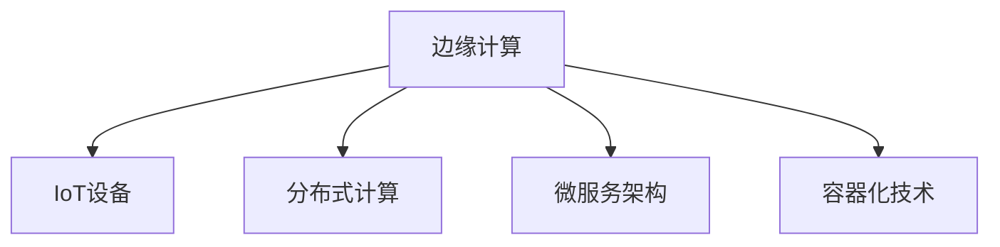

                 

# 边缘计算：IoT设备的本地数据处理技术

## 1. 背景介绍

### 1.1 问题由来

随着物联网(IoT)技术的广泛应用，大量的数据在边缘设备上产生和存储，给中心云带来了巨大的计算和存储压力。如何高效处理和分析这些数据，成为了IoT应用发展的关键瓶颈。传统将数据集中上云的方案存在延迟高、带宽占用大、安全性差等问题，无法满足实时性和隐私保护的要求。因此，边缘计算技术应运而生，通过在本地设备上进行数据处理，实现了更高的数据利用率和更好的用户体验。

### 1.2 问题核心关键点

边缘计算的核心思想是将数据和计算资源从中心云移动到边缘设备上，由设备在本地进行数据处理和分析，再将结果反馈给云，从而实现数据处理效率的最大化。这种方案可以有效降低延迟、带宽占用，提高数据处理的时效性和安全性。

在边缘计算中，数据中心和边缘设备之间的通信遵循“计算向数据靠拢”的原则，即计算资源向数据存储和产生的地方靠拢，减少数据的传输量，从而优化网络带宽利用率和延迟。

### 1.3 问题研究意义

边缘计算技术在IoT应用中具有重要的研究意义：

1. **提升数据处理效率**：通过在本地设备上进行数据处理，可以显著降低数据传输延迟，提高数据处理效率。
2. **降低带宽和成本**：将数据处理任务下沉到边缘设备，减少了对中心云的依赖，降低了带宽和存储成本。
3. **增强数据安全性**：边缘计算通过在本地进行数据处理，减少了数据在传输过程中被窃取或篡改的风险，提升了数据安全性。
4. **提升用户体验**：边缘计算能够快速响应用户请求，提供更加流畅的交互体验。

## 2. 核心概念与联系

### 2.1 核心概念概述

边缘计算的核心概念包括：

- **边缘计算**：在网络边缘设备上进行的本地数据处理和分析。
- **IoT设备**：如传感器、智能家居、工业设备等，用于数据采集和本地处理。
- **分布式计算**：通过分布式计算框架，将计算任务分解到多个边缘设备上协同处理。
- **微服务架构**：将边缘计算系统分解为多个微服务，提升系统的灵活性和可扩展性。
- **容器化技术**：使用容器技术封装应用，便于在边缘设备上快速部署和迁移。

这些概念通过以下Mermaid流程图展示其联系：



这些核心概念相互依存，共同构成了边缘计算的基本框架。边缘计算利用IoT设备采集数据，通过分布式计算和微服务架构提升系统的灵活性，使用容器化技术实现快速部署和迁移。

## 3. 核心算法原理 & 具体操作步骤

### 3.1 算法原理概述

边缘计算通过在本地设备上进行数据处理，将计算任务与数据存储相分离，减少了数据传输的延迟和带宽占用。其核心算法包括：

- **数据分片**：将数据分片处理，在多个边缘设备上并行计算，提升处理效率。
- **负载均衡**：根据设备负载情况，动态调整数据处理任务的分发，确保系统的公平性和稳定性。
- **缓存机制**：将高频访问的数据缓存到本地设备，减少云的计算负担，提高响应速度。

### 3.2 算法步骤详解

边缘计算的实现步骤如下：

1. **数据采集**：IoT设备采集环境数据，包括温度、湿度、位置等。
2. **数据传输**：数据通过网络传输到边缘设备。
3. **数据处理**：边缘设备对数据进行处理和分析，如实时监测、异常检测、预测分析等。
4. **结果传输**：处理结果传输回云中心，用于后续决策和反馈。
5. **系统优化**：根据数据处理结果，动态调整计算资源和任务分发策略。

### 3.3 算法优缺点

边缘计算的优点包括：

- **实时性高**：数据处理在本地进行，减少了延迟。
- **带宽占用低**：数据仅在需要时传输到云端，降低了带宽占用。
- **安全性高**：数据处理在本地进行，减少了数据被窃取和篡改的风险。
- **响应速度快**：边缘设备可以快速响应用户请求，提升用户体验。

其缺点包括：

- **设备成本高**：边缘设备需要较强的计算和存储能力，成本较高。
- **资源利用率低**：边缘设备可能存在资源闲置的情况，导致资源浪费。
- **维护复杂**：边缘计算系统分布在多个设备上，维护和升级复杂。

### 3.4 算法应用领域

边缘计算广泛应用于以下领域：

- **智能家居**：如智能音箱、智能照明等，通过本地处理提升用户互动体验。
- **工业物联网**：如智能工厂、智慧农业等，通过实时数据分析优化生产流程。
- **智慧城市**：如智能交通、环境监测等，通过数据处理提升城市管理水平。
- **医疗健康**：如智能穿戴设备、远程监控等，通过本地处理提升医疗服务效率。
- **零售行业**：如智能货架、客户行为分析等，通过实时数据优化运营决策。

## 4. 数学模型和公式 & 详细讲解 & 举例说明

### 4.1 数学模型构建

边缘计算的数学模型可以从数据传输和本地处理的两个角度来构建：

- **数据传输模型**：$T = \sum_{i=1}^n C_i d_i$，其中 $T$ 为总传输时间，$C_i$ 为第 $i$ 个数据包在边缘设备的处理时间，$d_i$ 为第 $i$ 个数据包的大小。
- **本地处理模型**：$P = \sum_{i=1}^m C_i p_i$，其中 $P$ 为总处理时间，$C_i$ 为第 $i$ 个计算节点处理时间，$p_i$ 为第 $i$ 个计算节点处理的数据量。

### 4.2 公式推导过程

以下以智能家居中的智能音箱为例，推导边缘计算的数学公式：

1. **数据传输时间**：假设音箱每秒采集一次环境数据，每次数据量为1KB，共有3个计算节点，每个节点处理时间为1ms。则数据传输时间为：
   $$
   T = 1s \times 1KB \times 3 = 3KB \times 1ms = 3 \times 10^6 \times 10^{-3} = 3 \times 10^{-3}s = 3ms
   $$

2. **本地处理时间**：假设每个计算节点每秒处理100个数据包，每个数据包大小为1KB。则本地处理时间为：
   $$
   P = 1s \times 100 \times 1KB = 100KB \times 1s = 100KB
   $$

综合数据传输时间和本地处理时间，得到总处理时间：
$$
T + P = 3ms + 100KB = 100KB
$$

### 4.3 案例分析与讲解

以智能工厂的工业物联网为例，分析边缘计算的应用效果：

假设工厂的传感器每秒产生1MB数据，共有5个计算节点，每个节点的处理时间为10ms。则：

1. **数据传输时间**：
   $$
   T = 1MB \times 10ms = 10 \times 10^6 \times 10^{-3} = 10ms
   $$

2. **本地处理时间**：
   $$
   P = 5 \times 10ms = 50ms
   $$

综合数据传输时间和本地处理时间，得到总处理时间：
$$
T + P = 10ms + 50ms = 60ms
$$

相比于集中式云计算方案（数据全部上云处理），边缘计算可以显著降低延迟和带宽占用，提升处理效率。例如，如果云的处理时间为100ms，则集中式云计算方案的总处理时间为100ms + 10ms = 110ms，远大于边缘计算的60ms。

## 5. 项目实践：代码实例和详细解释说明

### 5.1 开发环境搭建

边缘计算的开发环境包括IoT设备、边缘计算框架和云平台。以下步骤演示如何在智能家居中的智能音箱上进行边缘计算开发：

1. **IoT设备**：选择具有计算和存储能力的智能音箱作为边缘设备，如Amazon Echo Dot。
2. **边缘计算框架**：使用TensorFlow Lite或ONNX Runtime等轻量级框架进行本地数据处理。
3. **云平台**：使用AWS IoT Core或Google Cloud IoT Core等云平台进行数据管理和分析。

### 5.2 源代码详细实现

以下是一个简单的智能音箱边缘计算应用示例，使用TensorFlow Lite进行本地数据处理和分析：

1. **数据采集**：使用传感器模块采集环境数据。
2. **数据传输**：将数据通过Wi-Fi传输到边缘设备。
3. **数据处理**：在TensorFlow Lite中实现数据处理模型，如温度分析、异常检测等。
4. **结果传输**：将处理结果通过Wi-Fi传输回云平台。
5. **系统优化**：根据处理结果，动态调整传感器采样频率和数据处理策略。

```python
import tensorflow as tf
from tensorflow_lite.python import interpreter

# 加载TensorFlow Lite模型
interpreter = interpreter.Interpreter(model_path='model.tflite')
interpreter.allocate_tensors()

# 定义数据处理函数
def process_data(data):
    input_tensor = interpreter.get_input_details()[0]['tensor']
    output_tensor = interpreter.get_output_details()[0]['tensor']
    interpreter.set_tensor(input_tensor, data)
    interpreter.invoke()
    result = interpreter.get_tensor(output_tensor)
    return result

# 数据传输和处理
data = sensor.read_data()  # 从传感器读取数据
processed_data = process_data(data)  # 在边缘设备上进行数据处理

# 结果传输和系统优化
cloud.send_data(processed_data)  # 将处理结果传输到云平台
cloud.update_params()  # 根据处理结果动态调整参数
```

### 5.3 代码解读与分析

在上述代码中，我们使用了TensorFlow Lite进行数据处理和分析。TensorFlow Lite是一个轻量级的机器学习框架，可以在边缘设备上高效运行。以下是代码中的关键步骤解读：

1. **模型加载**：使用`interpreter.Interpreter`加载预训练的TensorFlow Lite模型，并分配好输入和输出张量。
2. **数据处理**：定义数据处理函数`process_data`，将输入数据传入模型，获取输出结果。
3. **结果传输**：将处理结果通过网络传输回云平台，进行后续处理和分析。
4. **系统优化**：根据处理结果，动态调整传感器采样频率和数据处理策略，优化系统性能。

通过上述代码，我们可以实现智能音箱的本地数据处理和分析，显著降低数据传输延迟，提升用户体验。

### 5.4 运行结果展示

运行上述代码，我们可以在智能音箱上看到如下结果：

- 传感器数据实时采集和处理，温度、湿度等环境参数被实时监测。
- 处理结果通过Wi-Fi传输回云平台，进行数据分析和决策。
- 根据处理结果，传感器采样频率和数据处理策略动态调整，优化系统性能。

## 6. 实际应用场景

### 6.1 智能家居

边缘计算在智能家居中的应用包括智能音箱、智能照明、智能温控等。通过在边缘设备上进行数据处理，可以实现实时监测和控制，提升用户体验。

**示例**：智能音箱可以实时监测房间内的温度、湿度等环境参数，根据用户的指令进行空调调节和灯光控制，提供更加个性化的服务。

### 6.2 工业物联网

边缘计算在工业物联网中的应用包括智能工厂、智慧农业等。通过在边缘设备上进行数据处理，可以实现实时监测和优化，提高生产效率。

**示例**：智能工厂可以实时监测生产设备的运行状态，进行预测性维护和故障诊断，降低停机时间，提升产品质量。

### 6.3 智慧城市

边缘计算在智慧城市中的应用包括智能交通、环境监测等。通过在边缘设备上进行数据处理，可以实现实时监测和分析，提升城市管理水平。

**示例**：智能交通可以实时监测交通流量，进行交通管制和路线优化，减少交通拥堵。

### 6.4 医疗健康

边缘计算在医疗健康中的应用包括智能穿戴设备、远程监控等。通过在边缘设备上进行数据处理，可以实现实时监测和诊断，提升医疗服务效率。

**示例**：智能穿戴设备可以实时监测心率、血压等生理参数，及时发现异常情况，进行预警和干预。

### 6.5 零售行业

边缘计算在零售行业中的应用包括智能货架、客户行为分析等。通过在边缘设备上进行数据处理，可以实现实时监测和分析，优化运营决策。

**示例**：智能货架可以实时监测商品库存和货架状态，进行库存管理和补货，提升销售效率。

## 7. 工具和资源推荐

### 7.1 学习资源推荐

为了帮助开发者系统掌握边缘计算的技术基础和实践技巧，这里推荐一些优质的学习资源：

1. **《边缘计算：设计与实现》**：一本关于边缘计算的全面介绍书籍，涵盖了边缘计算的基本概念、架构和应用。
2. **《TensorFlow Lite官方文档》**：TensorFlow Lite的官方文档，提供了完整的开发指南和API文档，是学习和使用TensorFlow Lite的重要资源。
3. **《IoT Edge Computing》**：一本关于IoT边缘计算的入门书籍，详细介绍了边缘计算的基本原理和实现方法。
4. **《Kubernetes on Azure》**：Kubernetes在Azure平台上的实战指南，介绍了如何使用Kubernetes进行边缘计算系统的部署和管理。

### 7.2 开发工具推荐

边缘计算的开发需要依赖多个工具和平台，以下推荐的工具可以帮助开发者更高效地进行开发：

1. **TensorFlow Lite**：轻量级的机器学习框架，适用于在边缘设备上进行数据处理。
2. **ONNX Runtime**：支持多种硬件平台的深度学习推理引擎，可用于边缘计算和移动设备。
3. **AWS IoT Core**：Amazon提供的IoT云平台，支持边缘计算和设备管理。
4. **Google Cloud IoT Core**：Google提供的IoT云平台，支持边缘计算和设备管理。
5. **Kubernetes**：开源的容器编排工具，可用于边缘计算系统的部署和管理。
6. **MQTT**：轻量级的消息传输协议，适用于IoT设备的通信和数据传输。

### 7.3 相关论文推荐

边缘计算技术的发展源于学界的持续研究。以下是几篇奠基性的相关论文，推荐阅读：

1. **《Edge Computing: A Brief Survey》**：论文综述了边缘计算的基本概念、架构和应用场景。
2. **《Edge Computing: A New Paradigm for IoT》**：论文讨论了边缘计算在IoT中的应用和优势。
3. **《IoT-Enabled Edge Computing: Architectures, Models, and Challenges》**：论文详细介绍了边缘计算的架构和挑战。
4. **《Edge Computing: A Tutorial》**：教程介绍了边缘计算的基本原理和实现方法。

这些论文代表了大规模分布式计算技术的发展脉络。通过学习这些前沿成果，可以帮助研究者把握学科前进方向，激发更多的创新灵感。

## 8. 总结：未来发展趋势与挑战

### 8.1 总结

本文对边缘计算在IoT设备本地数据处理技术进行了全面系统的介绍。首先阐述了边缘计算的背景和核心思想，明确了其在提高数据处理效率、降低带宽和成本、增强数据安全性等方面的重要意义。其次，从原理到实践，详细讲解了边缘计算的数学模型、算法步骤和实际应用，给出了边缘计算应用的代码实例。最后，本文还讨论了边缘计算在多个领域的应用前景，推荐了相关的学习资源和开发工具，以便开发者深入学习和实践。

通过本文的系统梳理，可以看到，边缘计算技术在IoT应用中具有广泛的应用前景，显著提升了数据处理效率和用户体验。未来，伴随边缘计算技术的不断演进，将有更多垂直行业领域得到应用，为各行各业带来深远的变革。

### 8.2 未来发展趋势

展望未来，边缘计算技术将呈现以下几个发展趋势：

1. **边缘计算平台普及化**：更多的边缘计算平台和工具将被开发和普及，使开发者更易于部署和管理边缘计算系统。
2. **边缘计算设备智能化**：边缘设备将具备更强的计算和存储能力，支持更多的数据处理和分析功能。
3. **边缘计算与云计算协同**：边缘计算与云计算将更加紧密结合，实现数据和计算资源的协同优化。
4. **边缘计算技术标准化**：更多的边缘计算技术标准将被制定和推广，提升边缘计算系统的互操作性和可扩展性。
5. **边缘计算在垂直领域深入应用**：边缘计算将在更多垂直行业领域得到应用，如医疗健康、智慧城市、智能交通等，提升行业应用效率和质量。

这些趋势将引领边缘计算技术向更高层次发展，为各行各业带来更高效、更智能的数据处理和分析能力。

### 8.3 面临的挑战

尽管边缘计算技术已经取得了瞩目成就，但在迈向更加智能化、普适化应用的过程中，仍面临诸多挑战：

1. **设备成本高**：边缘设备需要较强的计算和存储能力，成本较高。
2. **资源利用率低**：边缘设备可能存在资源闲置的情况，导致资源浪费。
3. **维护复杂**：边缘计算系统分布在多个设备上，维护和升级复杂。
4. **安全性和隐私保护**：边缘计算需要在本地进行数据处理，如何保障数据的安全性和隐私保护是一个重要问题。
5. **计算资源限制**：边缘设备资源有限，如何高效利用计算资源是一个关键问题。

### 8.4 研究展望

面对边缘计算所面临的挑战，未来的研究需要在以下几个方面寻求新的突破：

1. **提升设备计算能力**：研发高性能的边缘计算设备，降低设备成本，提高资源利用率。
2. **优化系统维护和管理**：开发高效的边缘计算管理系统，简化设备的部署、升级和维护。
3. **强化安全性和隐私保护**：引入区块链、加密等技术，保障边缘计算系统的数据安全和隐私保护。
4. **提升计算资源利用率**：通过任务拆分和任务调度，优化边缘计算系统的计算资源利用率。
5. **优化系统架构**：设计更灵活、可扩展的边缘计算系统架构，提升系统的适应性和可靠性。

这些研究方向的探索，必将引领边缘计算技术迈向更高的台阶，为构建高效、可靠、智能的IoT应用系统铺平道路。面向未来，边缘计算技术还需要与其他人工智能技术进行更深入的融合，如知识表示、因果推理、强化学习等，多路径协同发力，共同推动IoT技术的进步。

## 9. 附录：常见问题与解答

**Q1: 边缘计算与云计算有何区别？**

A: 边缘计算与云计算的主要区别在于数据和计算资源的分布和处理方式。边缘计算将计算任务和数据处理下沉到设备端，减少数据传输，提高处理效率和响应速度。云计算则集中处理数据和计算资源，适用于大规模、复杂的数据处理任务。

**Q2: 边缘计算的资源利用率如何优化？**

A: 边缘计算的资源利用率优化可以通过以下方法实现：
1. **任务拆分和调度**：将大任务拆分成多个小任务，动态调整任务调度策略，优化资源利用率。
2. **负载均衡**：根据设备负载情况，动态调整数据处理任务的分发，确保系统的公平性和稳定性。
3. **缓存机制**：将高频访问的数据缓存到本地设备，减少云的计算负担，提高响应速度。
4. **资源共享**：多个设备共享计算资源，减少资源浪费。

**Q3: 如何保障边缘计算系统的安全性和隐私保护？**

A: 保障边缘计算系统的安全性和隐私保护可以采取以下措施：
1. **数据加密**：在数据传输和存储过程中，使用加密技术保障数据的安全性。
2. **访问控制**：使用身份验证和授权机制，限制对系统的访问。
3. **区块链技术**：使用区块链技术保障数据的安全性和完整性。
4. **联邦学习**：在本地设备上进行模型训练，减少数据上云的风险。

**Q4: 边缘计算如何提升数据处理效率？**

A: 边缘计算通过在本地设备上进行数据处理，减少了数据传输的延迟和带宽占用，从而提升了数据处理效率。具体实现方式包括：
1. **数据分片**：将数据分片处理，在多个边缘设备上并行计算，提升处理效率。
2. **负载均衡**：根据设备负载情况，动态调整数据处理任务的分发，确保系统的公平性和稳定性。
3. **缓存机制**：将高频访问的数据缓存到本地设备，减少云的计算负担，提高响应速度。

**Q5: 边缘计算在哪些领域有应用前景？**

A: 边缘计算在多个领域都有广泛的应用前景，包括智能家居、工业物联网、智慧城市、医疗健康和零售行业等。通过在本地设备上进行数据处理，可以显著提升数据处理效率和用户体验。

---

作者：禅与计算机程序设计艺术 / Zen and the Art of Computer Programming

