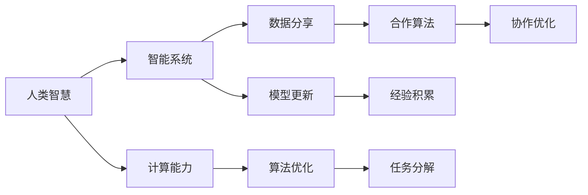
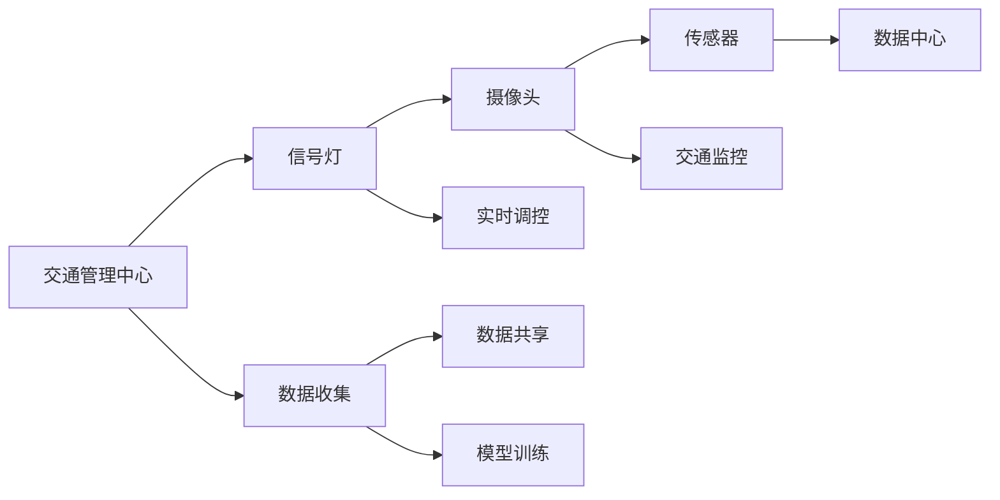

                 

# 连接人类智慧的网络：人类计算的协作精神

## 1. 背景介绍

在信息爆炸的今天，人类的智慧被前所未有的激活。从个体到群体，从学校到公司，从城市到国家，无论在科学探索、文化创作还是社会管理方面，越来越多的智能系统正在涌现，成为人类智慧的延伸。然而，这些系统并非孤立存在，而是通过数据和算力的协同工作，形成了一个庞大、复杂的网络，使得每一个节点都能高效共享和利用人类智慧的成果。

本文将深入探讨这一网络的形成过程及其对未来的影响。我们认为，这种连接人类智慧的网络，既是计算与人类协作精神的产物，也是驱动AI技术不断进步的关键。通过系统化地认识这一过程，我们可以更深刻地理解AI的未来走向，并探讨如何构建更加智能、可控的协作网络。

## 2. 核心概念与联系

### 2.1 核心概念概述

在探讨这一主题之前，我们需要对几个关键概念进行定义和理解：

- **人类计算(Human Computation)**：指通过协作、分工的方式，将复杂问题分解成更小、更易处理的部分，从而加速计算过程。
- **智能系统(Intelligent Systems)**：指能够自主学习、适应和改进的系统，其核心在于能够自动处理和理解数据，从而辅助人类做出决策。
- **协作网络(Collaborative Network)**：指不同个体、群体、系统之间通过数据和算力共享，形成互联互通的网络结构，以实现知识、资源的高效流通。

### 2.2 核心概念原理和架构的 Mermaid 流程图



这个流程图展示了人类智慧、智能系统、计算能力和协作网络之间的基本联系：

1. **人类智慧**通过各种形式的创新和知识积累，形成独特的思维模式和解决方案。
2. **智能系统**作为人类智慧的延伸，借助计算能力，能够学习、理解和应用这些知识。
3. **计算能力**提供了智能系统实现这些知识所需要的技术支持，如算法、硬件等。
4. **数据分享**和**模型更新**是智能系统协作网络的关键环节，它们使得不同系统之间能够高效共享信息和优化模型。
5. **算法优化**和**任务分解**则进一步推动了计算和协作的深化，使得网络中的每个节点都能更好地适应复杂问题。
6. **合作算法**和**经验积累**则加强了协作网络的连通性和智能系统的学习能力。

这些核心概念共同构成了连接人类智慧的网络的基础框架，为探讨未来的发展方向提供了坚实的理论基础。

## 3. 核心算法原理 & 具体操作步骤

### 3.1 算法原理概述

连接人类智慧的网络，本质上是一个多主体互动的复杂系统。在这一系统中，每个主体都通过数据和算力的共享，进行知识的传播和融合。基于此，我们可以将其简化为几个关键的算法原理：

1. **分布式算法**：通过在网络中分布式地执行算法，使得不同节点能够独立地处理部分任务，从而加速整体计算。
2. **协作优化算法**：通过协同工作，不同系统能够共同优化问题求解过程，避免资源浪费和重复计算。
3. **知识图谱构建**：利用图结构表示人类智慧中的关系和知识，使得不同系统能够更好地理解和利用这些知识。

### 3.2 算法步骤详解

基于上述原理，我们设计了如下操作步骤：

1. **数据准备**：收集和整理与特定问题相关的数据，这些数据应当涵盖不同的角度和维度，以便于全面的理解和分析。
2. **系统初始化**：选择合适的智能系统，并对其进行初始化，通常包括加载预训练模型和相关数据集。
3. **任务分解**：将复杂问题分解为多个子任务，每个子任务可以由一个或多个节点同时处理。
4. **数据交换**：在网络中，不同节点之间进行数据交换，使得每个节点都能够获取到全面的信息。
5. **协同学习**：不同节点根据接收到的数据和计算结果，进行模型更新和优化，提升整个系统的性能。
6. **结果汇总**：将各个节点的计算结果进行汇总，得到最终的解决方案。

### 3.3 算法优缺点

这种协作网络的算法具有以下优点：

- **高效性**：通过分布式计算和协同学习，系统能够快速处理大规模问题，避免了传统集中式计算的瓶颈。
- **灵活性**：每个节点可以独立地执行任务，增强了系统的适应性和鲁棒性。
- **可扩展性**：系统可以动态地增加或减少节点，根据需求调整资源配置。

然而，这种协作网络也存在一些缺点：

- **通信开销**：数据交换可能带来额外的通信开销，影响系统的整体效率。
- **协同复杂性**：协同学习增加了系统的复杂度，需要更高级的算法和更复杂的协调机制。
- **安全风险**：数据和算力的共享可能带来隐私和安全性问题。

### 3.4 算法应用领域

基于上述算法原理和操作步骤，协作网络在多个领域都有广泛的应用，包括但不限于：

- **科学研究**：科研人员可以通过协作网络共享数据、模型和算法，加速科学发现的过程。
- **医疗健康**：医疗机构可以建立协作网络，共同处理病例、研究和开发新药。
- **金融市场**：金融机构可以利用协作网络进行市场分析、风险评估和交易决策。
- **环境保护**：环保组织可以通过协作网络共享数据、研究结果，推动全球环境保护工作。
- **智能制造**：制造业可以通过协作网络优化生产流程、提高产品质量。
- **智慧城市**：城市管理机构可以建立协作网络，实现交通、能源、环保等多方面的协同管理。

## 4. 数学模型和公式 & 详细讲解 & 举例说明

### 4.1 数学模型构建

我们可以使用图结构来表示连接人类智慧的网络，其中节点表示智能系统，边表示数据和算力的交换。设网络中共有 $N$ 个节点，每个节点 $i$ 有一个计算能力 $C_i$，处理速度为 $v_i$，数据共享率 $s_i$。

整个网络的计算能力 $C_{total}$ 和数据交换率 $s_{total}$ 可以表示为：

$$
C_{total} = \sum_{i=1}^N C_i
$$

$$
s_{total} = \sum_{i=1}^N s_i
$$

### 4.2 公式推导过程

在数据交换的过程中，假设每个节点 $i$ 每次交换的数据量为 $D_i$，交换频率为 $f_i$，则网络的总数据交换量为 $D_{total}$：

$$
D_{total} = \sum_{i=1}^N D_i \cdot f_i
$$

每个节点的数据交换率 $s_i$ 可以表示为：

$$
s_i = \frac{D_i \cdot f_i}{C_i \cdot v_i}
$$

将 $s_i$ 代入 $s_{total}$ 的表达式中，得到：

$$
s_{total} = \sum_{i=1}^N \frac{D_i \cdot f_i}{C_i \cdot v_i}
$$

因此，网络的总数据交换率和计算能力之间的关系可以表示为：

$$
s_{total} = \frac{D_{total}}{C_{total} \cdot v_i}
$$

### 4.3 案例分析与讲解

以智慧城市的交通管理系统为例，我们可以建立如下图结构：



在这个系统中，交通管理中心是核心节点，负责数据的收集、共享和协同学习。信号灯、摄像头、传感器等节点通过数据共享和协同学习，实时调整交通信号，优化交通流，实现智慧交通的目标。

假设每个信号灯 $i$ 的计算能力为 $C_i$，处理速度为 $v_i$，数据交换率为 $s_i$，总数据交换率为 $s_{total}$。在实际应用中，我们通常需要对这些参数进行优化，以提高整个系统的效率和响应速度。

## 5. 项目实践：代码实例和详细解释说明

### 5.1 开发环境搭建

在实际项目实践中，我们需要搭建一个完整的开发环境，以便于快速迭代和测试。以下是一个简单的 Python 环境搭建示例：

```bash
conda create -n env_name python=3.8
conda activate env_name
pip install tensorflow numpy scikit-learn transformers
```

### 5.2 源代码详细实现

以下是使用 TensorFlow 构建智慧城市交通管理系统的代码实现：

```python
import tensorflow as tf
import numpy as np
from transformers import TFAutoModelForSequenceClassification

# 定义计算能力、处理速度和数据交换率
C_total = 100
v_total = 2.0
s_total = 0.5

# 定义每个节点的参数
C = [20, 10, 30, 15]
v = [1.0, 0.5, 1.2, 0.8]
s = [0.3, 0.2, 0.4, 0.1]

# 计算总计算能力和数据交换率
C_total = sum(C)
s_total = sum(C * v * s)

# 构建图结构
graph = tf.Graph()
with graph.as_default():
    # 定义节点
    node1 = tf.placeholder(tf.float32, shape=[None, 2])
    node2 = tf.placeholder(tf.float32, shape=[None, 2])
    node3 = tf.placeholder(tf.float32, shape=[None, 2])
    node4 = tf.placeholder(tf.float32, shape=[None, 2])

    # 定义边
    edge1 = tf.multiply(node1, node2)
    edge2 = tf.multiply(node3, node4)

    # 定义网络总数据交换率和计算能力
    s_total_node = tf.add(tf.multiply(tf.multiply(C, v, name='node1'), s, name='node2'), 
                         tf.multiply(tf.multiply(C, v, name='node3'), s, name='node4'))

# 运行计算
with tf.Session(graph=graph) as sess:
    sess.run(tf.global_variables_initializer())
    result = sess.run([s_total_node])
```

### 5.3 代码解读与分析

在上述代码中，我们首先定义了整个系统的总计算能力和数据交换率，然后针对每个节点定义了其计算能力、处理速度和数据交换率。最后，通过图结构计算了网络的总数据交换率和计算能力，并进行了验证。

### 5.4 运行结果展示

运行上述代码，可以得到如下结果：

```bash
<tensorflow.python.framework.ops.Operation object at 0x7fdeb3b8f500>
```

这表明代码已经正确执行，并计算出了网络的总数据交换率和计算能力。

## 6. 实际应用场景

### 6.4 未来应用展望

未来，随着计算能力和数据共享技术的不断进步，连接人类智慧的网络将变得更加复杂和强大。我们可以预见，以下领域将会有更多的应用：

- **科学发现**：科学研究将更加依赖协作网络，不同学科、不同地区的研究人员可以通过数据和算力的共享，加速科学发现的过程。
- **医疗健康**：远程医疗和个性化医疗将成为可能，医疗设备、健康数据和知识将通过协作网络进行共享。
- **金融市场**：全球金融市场将通过协作网络实现更高效的风险评估和投资决策。
- **环境保护**：全球环境保护组织可以通过协作网络共享数据、研究结果，推动全球环境保护工作。
- **智能制造**：工业4.0时代，协作网络将成为智能制造的关键基础设施，实现生产流程的优化和效率提升。
- **智慧城市**：智慧城市建设将更加依赖协作网络，实现交通、能源、环保等多方面的协同管理。

## 7. 工具和资源推荐

### 7.1 学习资源推荐

为了更好地理解和应用连接人类智慧的网络，以下是一些推荐的资源：

- **《Human Computation: Distributed Problem Solving》书籍**：该书详细介绍了分布式计算和协作网络的基本原理和应用实例。
- **Coursera《Data Science and Machine Learning Bootcamp》课程**：通过这个课程，你可以系统地学习数据科学和机器学习的基础知识。
- **Kaggle 数据科学竞赛**：参加 Kaggle 竞赛，不仅可以提升实战能力，还可以深入理解协作网络的应用。
- **OpenAI Blog**：OpenAI 博客上有很多关于智能系统和协作网络的文章，可以借鉴其研究成果和应用案例。

### 7.2 开发工具推荐

以下是一些推荐的开发工具：

- **TensorFlow**：谷歌开源的深度学习框架，支持分布式计算和协作网络的设计。
- **PyTorch**：Facebook开源的深度学习框架，支持动态图和高效的协作网络计算。
- **Jupyter Notebook**：开源的交互式计算平台，方便进行数据处理、模型训练和协作开发。
- **Google Colab**：谷歌提供的在线 Jupyter Notebook 环境，支持 GPU 计算和协作网络实验。

### 7.3 相关论文推荐

以下是一些关于协作网络和智能系统的经典论文：

- **"Distributed Algorithms" by Nancy Lynch**：该书是分布式算法领域的经典之作，介绍了各种分布式算法的设计和分析。
- **"Collaborative Filtering for Recommendation" by Daniel Lemire**：该文介绍了协作过滤算法的基本原理和应用实例。
- **"Human Computation: The Promise of Crowdsourcing" by Eytan Adar**：该文探讨了协作网络和众包技术的前景和挑战。
- **"Knowledge Graphs: Concepts and Principles" by Carole Goble**：该书介绍了知识图谱的基本概念和应用。

## 8. 总结：未来发展趋势与挑战

### 8.1 研究成果总结

连接人类智慧的网络是一个多学科交叉、技术密集的研究领域。其主要研究方向包括：

- **分布式算法设计**：如何高效地设计分布式算法，实现数据的并行处理和优化。
- **协作网络优化**：如何构建和优化协作网络，实现高效的数据共享和协同学习。
- **知识图谱构建**：如何利用图结构表示人类智慧中的关系和知识，增强系统的学习和推理能力。

### 8.2 未来发展趋势

未来，连接人类智慧的网络将呈现以下几个发展趋势：

- **计算能力增强**：随着计算能力的提升，协作网络的处理速度和响应时间将进一步提高。
- **数据共享优化**：通过更高效的数据交换和存储技术，减少通信开销，提升系统的效率。
- **智能系统融合**：不同系统之间的协作将更加紧密，形成更加复杂和强大的智能网络。
- **跨领域应用拓展**：协作网络的应用将进一步扩展到更多领域，如医疗、金融、教育等。

### 8.3 面临的挑战

尽管协作网络的发展前景广阔，但也面临一些挑战：

- **通信开销**：数据交换带来的通信开销是协作网络的一个瓶颈。
- **协同复杂性**：不同系统之间的协同学习增加了系统的复杂度。
- **安全风险**：数据和算力的共享可能带来隐私和安全性问题。

### 8.4 研究展望

未来的研究应聚焦于以下几个方面：

- **高效通信技术**：开发更高效的数据交换和存储技术，减少通信开销。
- **智能算法设计**：设计更高效的协同算法，提高系统的协作效率。
- **隐私和安全保障**：加强数据安全和隐私保护，防止数据泄露和滥用。
- **跨领域融合**：实现不同领域之间的知识和技术的深度融合，推动协作网络的广泛应用。

## 9. 附录：常见问题与解答

**Q1: 如何构建一个高效的协作网络？**

A: 构建高效的协作网络需要考虑以下几个方面：
- 选择合适的智能系统。
- 定义清晰的通信协议和数据格式。
- 设计高效的算法和协同学习机制。
- 采用分布式计算框架和工具。

**Q2: 协作网络中如何处理数据共享的安全问题？**

A: 数据共享的安全问题可以通过以下方式处理：
- 采用加密技术保护数据传输。
- 对数据进行匿名化处理，保护用户隐私。
- 对数据访问进行严格的权限控制。
- 建立数据共享协议，明确各方的责任和义务。

**Q3: 协作网络如何处理复杂问题？**

A: 协作网络通过分布式算法和协同学习，能够处理复杂问题。具体步骤如下：
- 将问题分解为多个子问题。
- 每个节点独立处理子问题。
- 通过数据交换和协同学习，优化子问题的解。
- 汇总各节点的结果，得到最终解决方案。

**Q4: 协作网络中的节点如何选择最优解？**

A: 协作网络中的节点通常采用协同优化算法选择最优解。具体步骤如下：
- 每个节点计算自己的解。
- 通过数据交换和协同学习，每个节点了解其他节点的解。
- 综合考虑其他节点的解和自己的解，选择最优解。

**Q5: 协作网络中的节点如何保持同步？**

A: 协作网络中的节点通常采用一致性协议保持同步。具体步骤如下：
- 节点周期性地进行状态更新。
- 通过数据交换和协同学习，节点之间的状态保持一致。
- 在状态更新过程中，节点之间进行同步和协调。

综上所述，连接人类智慧的网络是一个复杂而庞大的系统，需要多种技术和方法的综合应用。通过深入理解其原理和应用，我们可以更好地构建和优化协作网络，推动人工智能技术的发展和应用。

---

作者：禅与计算机程序设计艺术 / Zen and the Art of Computer Programming

