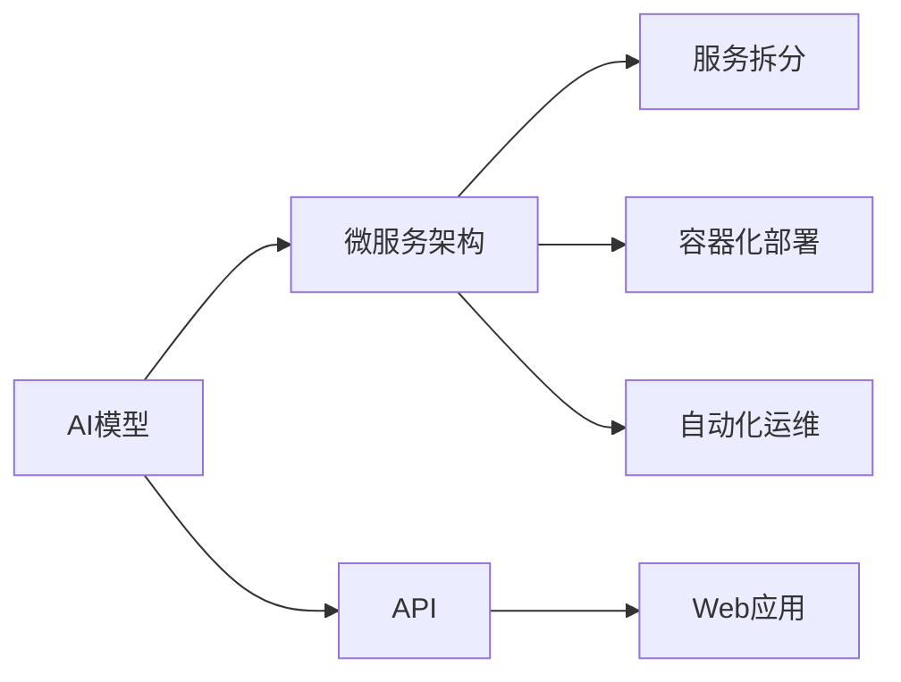

                 

# 部署AI模型：从API到Web应用

> 关键词：AI模型,API,Web应用,部署,微服务架构

## 1. 背景介绍

在当今信息爆炸的时代，人工智能(AI)技术的应用已经渗透到各个行业。AI模型，尤其是深度学习模型，在图像识别、自然语言处理、语音识别等领域展现出了强大的能力。然而，这些模型往往需要高精度的硬件设备和专业知识才能训练和部署。如何将这些高精度的AI模型封装成易于使用、高可用性的服务，从而让更多的开发者和业务人员能够快速集成到自己的应用中，成为了一个重要的课题。

本文将探讨如何从API到Web应用，系统化地部署AI模型，并重点介绍微服务架构在AI模型部署中的应用。通过了解这些核心概念和关键技术，开发者可以更有效地部署和管理AI模型，使AI技术的落地应用更加便捷和高效。

## 2. 核心概念与联系

### 2.1 核心概念概述

在讨论部署AI模型的过程中，需要理解几个关键概念：

- **AI模型**：通常是指经过训练的深度学习模型，用于处理特定类型的任务，如图像分类、文本生成等。
- **API**：应用编程接口，是软件系统之间交互的接口。API使得不同的系统能够通过标准化的方式进行通信，提高系统的互操作性。
- **Web应用**：通过浏览器访问的网页应用，通常由前端和后端组成。前端负责界面展示，后端负责业务逻辑和数据处理。
- **微服务架构**：将大型应用拆分成多个小型、独立的服务，每个服务负责单一功能，通过轻量级的通信机制（如REST API）进行协同工作，以提高系统的灵活性、可维护性和可扩展性。

### 2.2 核心概念联系

这些概念之间的联系可以通过以下Mermaid流程图来展示：



这个流程图展示了大语言模型从AI模型到Web应用的过程：

1. **AI模型**：经过训练并得到验证的AI模型，通常以中间件的形式存在。
2. **微服务架构**：将AI模型封装成多个微服务，每个微服务负责特定功能，可以独立部署和扩展。
3. **API**：通过API，微服务与其他系统进行通信，提供模型推理能力。
4. **Web应用**：Web应用通过调用API，将AI模型的推理结果展示给用户。
5. **服务拆分和容器化部署**：将微服务拆分为独立的模块，并使用容器化技术进行部署，以提高系统的可扩展性和灵活性。
6. **自动化运维**：通过自动化运维技术，确保系统的稳定性和高效性。

## 3. 核心算法原理 & 具体操作步骤

### 3.1 算法原理概述

从API到Web应用的过程，本质上是一个将AI模型封装并嵌入到Web应用中的过程。这一过程需要考虑模型的推理效率、系统的可扩展性以及服务的可靠性等因素。

### 3.2 算法步骤详解

1. **模型选择与训练**：选择合适的AI模型，并在大量数据上训练得到。训练过程中需要注意选择合适的损失函数、优化器、学习率等超参数，以确保模型能够学习到有用的知识。

2. **API设计**：将训练好的模型封装成API，提供模型的推理能力。API的设计需要考虑模型的输入输出格式、处理性能、安全性等要求。

3. **服务拆分**：将模型API拆分成多个微服务，每个微服务负责单一功能，如模型推理、数据预处理等。微服务的设计需要考虑服务粒度、通信机制等因素。

4. **容器化部署**：将每个微服务部署在容器中，如Docker，以确保服务的独立性、可移植性和可伸缩性。

5. **自动化运维**：通过自动化运维工具，如Kubernetes、Prometheus等，监控服务的运行状态，进行故障排查和自动修复，确保服务的稳定性和可靠性。

### 3.3 算法优缺点

基于微服务架构的AI模型部署方法有以下优点：

- **高可扩展性**：微服务架构可以独立扩展各个服务，满足不同业务场景的需求。
- **高可用性**：服务拆分和容器化部署确保了系统的容错性和可用性。
- **灵活性**：微服务可以独立更新，不影响其他服务的正常运行。

同时，也存在一些缺点：

- **复杂性**：微服务架构需要考虑服务的依赖关系、通信机制等复杂问题。
- **性能开销**：多个微服务之间的通信和数据传输可能会带来一定的性能开销。
- **管理成本**：微服务架构需要更多的运维和管理成本。

### 3.4 算法应用领域

微服务架构在AI模型部署中的应用非常广泛，包括但不限于以下领域：

- **金融领域**：用于风险评估、信用评分、反欺诈检测等任务。
- **医疗领域**：用于疾病诊断、病理分析、基因测序等任务。
- **教育领域**：用于智能推荐、内容生成、情感分析等任务。
- **电商领域**：用于商品推荐、价格预测、用户行为分析等任务。

## 4. 数学模型和公式 & 详细讲解 & 举例说明

### 4.1 数学模型构建

在AI模型的推理过程中，数学模型起到了核心作用。以深度学习模型为例，其核心数学模型通常包括：

- **神经网络结构**：如卷积神经网络(CNN)、循环神经网络(RNN)等。
- **损失函数**：如交叉熵损失、均方误差等。
- **优化算法**：如随机梯度下降(SGD)、Adam等。

### 4.2 公式推导过程

以卷积神经网络为例，其核心公式包括：

- **前向传播公式**：
$$
y_i = \sigma(\sum_{j=1}^{n} w_{i,j}x_j + b_i)
$$
其中，$x_j$表示输入的特征，$w_{i,j}$表示权重，$b_i$表示偏置，$\sigma$表示激活函数。

- **反向传播公式**：
$$
\frac{\partial L}{\partial w_{i,j}} = \delta_i x_j
$$
其中，$\delta_i$表示梯度，$L$表示损失函数。

### 4.3 案例分析与讲解

假设我们有一个简单的卷积神经网络模型，用于图像分类任务。模型输入为28x28像素的灰度图像，输出为10个类别的概率分布。以下是该模型的代码实现：

```python
import torch
import torch.nn as nn
import torchvision.transforms as transforms
from torchvision.datasets import MNIST

class CNNModel(nn.Module):
    def __init__(self):
        super(CNNModel, self).__init__()
        self.conv1 = nn.Conv2d(1, 32, kernel_size=3, stride=1, padding=1)
        self.relu = nn.ReLU()
        self.maxpool = nn.MaxPool2d(kernel_size=2, stride=2)
        self.fc1 = nn.Linear(32 * 14 * 14, 128)
        self.fc2 = nn.Linear(128, 10)

    def forward(self, x):
        x = self.conv1(x)
        x = self.relu(x)
        x = self.maxpool(x)
        x = x.view(-1, 32 * 14 * 14)
        x = self.fc1(x)
        x = self.relu(x)
        x = self.fc2(x)
        return x
```

## 5. 项目实践：代码实例和详细解释说明

### 5.1 开发环境搭建

在部署AI模型的过程中，需要搭建一个适合的开发环境。以下是Python开发环境的具体搭建步骤：

1. **安装Anaconda**：从官网下载并安装Anaconda，用于创建独立的Python环境。

2. **创建并激活虚拟环境**：
```bash
conda create -n ai_env python=3.8
conda activate ai_env
```

3. **安装依赖包**：
```bash
conda install numpy scipy matplotlib scikit-learn torch torchvision torchaudio
```

4. **安装TensorFlow**：
```bash
pip install tensorflow
```

5. **安装Keras**：
```bash
pip install keras
```

完成以上步骤后，即可在虚拟环境中进行AI模型的部署实践。

### 5.2 源代码详细实现

以下是一个简单的AI模型部署示例，包括模型的训练、保存、API设计和API调用：

```python
import tensorflow as tf
from tensorflow.keras.models import Sequential
from tensorflow.keras.layers import Conv2D, MaxPooling2D, Flatten, Dense

# 定义模型
model = Sequential()
model.add(Conv2D(32, (3, 3), activation='relu', input_shape=(28, 28, 1)))
model.add(MaxPooling2D((2, 2)))
model.add(Flatten())
model.add(Dense(128, activation='relu'))
model.add(Dense(10, activation='softmax'))

# 编译模型
model.compile(optimizer='adam', loss='categorical_crossentropy', metrics=['accuracy'])

# 训练模型
model.fit(train_images, train_labels, epochs=10, validation_data=(test_images, test_labels))

# 保存模型
model.save('cnn_model.h5')

# 定义API
app = tf.keras.Sequential([
    tf.keras.layers.Input(shape=(28, 28, 1)),
    tf.keras.layers.Conv2D(32, (3, 3), activation='relu'),
    tf.keras.layers.MaxPooling2D((2, 2)),
    tf.keras.layers.Flatten(),
    tf.keras.layers.Dense(128, activation='relu'),
    tf.keras.layers.Dense(10, activation='softmax'),
])

# 定义API端点
@app.add_get('/predict/{image}')
def predict(image):
    image = tf.keras.preprocessing.image.load_img(image, target_size=(28, 28))
    image = tf.keras.preprocessing.image.img_to_array(image)
    image = tf.keras.applications.mobilenet_v2.preprocess_input(image)
    result = app.predict(image[np.newaxis, ...])
    return result[0]

# 启动API
if __name__ == '__main__':
    app.run(debug=True)
```

### 5.3 代码解读与分析

让我们逐一解读上述代码的关键部分：

- **模型定义与编译**：使用Keras定义了一个简单的卷积神经网络模型，并使用`compile`方法编译模型，指定优化器和损失函数。
- **模型训练**：使用`fit`方法在训练集上训练模型，并通过`validation_data`参数指定验证集。
- **模型保存**：使用`save`方法将训练好的模型保存为HDF5格式的文件，方便后续部署。
- **API定义**：使用Keras的`Sequential`模型定义了一个与训练模型相同的结构，并将其作为API的核心。
- **API端点定义**：使用`add_get`方法定义了一个名为`/predict/{image}`的端点，接收图片路径作为参数，并调用`predict`方法进行推理。
- **API启动**：使用`run`方法启动API，并在`debug`模式下运行。

通过以上代码，可以看到，从模型训练到API部署的完整流程。开发者可以将该示例代码作为基础，进一步扩展和优化，以满足实际需求。

### 5.4 运行结果展示

在完成上述代码后，运行该Python脚本，启动API服务。可以通过访问`http://localhost:5000/predict/{image}`的路径，上传图片进行预测，API会返回预测结果的概率分布。

## 6. 实际应用场景

### 6.1 金融领域

在金融领域，AI模型可以用于风险评估、信用评分、反欺诈检测等任务。通过将AI模型部署为API，金融公司可以方便地将其集成到现有的业务系统中，实时处理用户的金融交易数据，提供精准的风险评估和欺诈检测服务。

### 6.2 医疗领域

在医疗领域，AI模型可以用于疾病诊断、病理分析、基因测序等任务。通过将AI模型部署为API，医院和诊所可以快速获取诊断结果，提高医疗服务的效率和准确性。

### 6.3 教育领域

在教育领域，AI模型可以用于智能推荐、内容生成、情感分析等任务。通过将AI模型部署为API，教育平台可以快速响应用户需求，提供个性化的学习资源和推荐服务。

### 6.4 电商领域

在电商领域，AI模型可以用于商品推荐、价格预测、用户行为分析等任务。通过将AI模型部署为API，电商公司可以实时分析用户行为数据，提供精准的商品推荐和价格优化建议。

## 7. 工具和资源推荐

### 7.1 学习资源推荐

为了帮助开发者掌握从API到Web应用的技术，以下是一些优质的学习资源：

1. **TensorFlow官方文档**：TensorFlow的官方文档提供了丰富的教程和示例，帮助开发者理解TensorFlow的核心概念和使用方法。

2. **Keras官方文档**：Keras的官方文档详细介绍了Keras的使用方法和API设计，适合初学者入门。

3. **Flask官方文档**：Flask的官方文档提供了丰富的教程和示例，帮助开发者快速搭建Web应用。

4. **Django官方文档**：Django的官方文档提供了丰富的教程和示例，帮助开发者快速搭建Web应用。

5. **Kubernetes官方文档**：Kubernetes的官方文档提供了丰富的教程和示例，帮助开发者理解容器化部署和自动化运维。

### 7.2 开发工具推荐

在部署AI模型的过程中，需要一些合适的开发工具，以下是推荐的工具：

1. **TensorFlow**：开源的机器学习框架，支持深度学习模型的训练和推理。

2. **Keras**：基于TensorFlow的高级API，提供简单易用的接口，适合初学者使用。

3. **Flask**：轻量级的Web框架，易于搭建REST API。

4. **Django**：功能强大的Web框架，适合构建复杂的应用。

5. **Kubernetes**：容器编排平台，支持自动化运维和管理。

### 7.3 相关论文推荐

以下是一些关于AI模型部署和微服务架构的相关论文，推荐阅读：

1. **“Model Interpretation and Inference in the Cloud”**：探讨了在云端部署和推理AI模型的挑战和解决方案。

2. **“Towards Microservices, The Microservice Architecture”**：介绍了微服务架构的基本概念和设计原则。

3. **“Towards Generalist AI Models”**：探讨了通用AI模型的设计和应用。

4. **“TensorFlow Serving: A Generic, High-Performance Serving System for Machine Learning Models”**：介绍了TensorFlow Serving的设计和实现。

5. **“Kubernetes: A Platform for Managing Elastic Cloud-Native Applications”**：介绍了Kubernetes的基本概念和设计原则。

## 8. 总结：未来发展趋势与挑战

### 8.1 总结

本文详细介绍了如何从API到Web应用，系统化地部署AI模型，并重点探讨了微服务架构在AI模型部署中的应用。通过理解这些核心概念和关键技术，开发者可以更有效地部署和管理AI模型，使AI技术的落地应用更加便捷和高效。

## 8.2 未来发展趋势

未来，AI模型部署将呈现以下几个发展趋势：

1. **边缘计算**：随着5G和物联网的发展，边缘计算将逐渐普及，AI模型可以在本地设备上进行推理，降低网络延迟和带宽需求。

2. **自动化运维**：自动化运维将进一步发展，AI和机器学习技术将用于自动监控、自动修复和自动扩展，提高系统的稳定性和效率。

3. **模型压缩与优化**：模型压缩和优化技术将进一步发展，使得AI模型能够更高效地运行在资源受限的设备上，如嵌入式设备和移动设备。

4. **跨平台部署**：AI模型将能够在多个平台（如云端、本地、边缘等）上部署，以适应不同的应用场景和需求。

5. **分布式训练**：分布式训练技术将进一步发展，使得大型AI模型能够在大规模集群上进行高效训练，加速模型的迭代和优化。

6. **自适应学习**：自适应学习技术将进一步发展，使得AI模型能够根据环境变化进行自我调整和优化。

### 8.3 面临的挑战

尽管AI模型部署取得了显著进展，但仍面临诸多挑战：

1. **模型复杂性**：AI模型通常较为复杂，需要高精度的硬件设备和专业知识才能训练和部署。

2. **性能瓶颈**：在大规模数据和复杂模型的情况下，推理性能可能成为瓶颈，需要进一步优化。

3. **安全性与隐私**：AI模型需要处理敏感数据，安全性与隐私保护成为重要问题，需要采取措施防止数据泄露和模型滥用。

4. **运维成本**：AI模型部署和运维需要大量资源和人力，成本较高。

5. **模型可解释性**：AI模型的黑盒特性使得其可解释性不足，难以解释模型的决策过程和输出结果。

### 8.4 研究展望

未来，需要在以下几个方面进行进一步研究：

1. **模型压缩与优化**：进一步研究模型压缩和优化技术，使得AI模型能够在资源受限的设备上高效运行。

2. **自适应学习**：研究自适应学习技术，使得AI模型能够根据环境变化进行自我调整和优化。

3. **模型可解释性**：研究模型可解释性技术，使得AI模型具备更好的可解释性，增强用户信任和接受度。

4. **自动化运维**：研究自动化运维技术，提高系统的稳定性和效率，降低运维成本。

5. **分布式训练**：研究分布式训练技术，加速模型的迭代和优化，提高模型的性能和精度。

通过这些研究方向的探索，AI模型部署将更加高效、可靠和易用，加速AI技术在各个领域的落地应用。

## 9. 附录：常见问题与解答

**Q1: AI模型的推理性能如何提升？**

A: 推理性能的提升可以通过以下几个方面进行：

1. **模型优化**：通过优化模型的结构和参数，提高模型的推理速度。

2. **量化加速**：将模型从浮点运算转换为定点运算，提高计算效率和存储效率。

3. **模型压缩**：通过剪枝、量化、蒸馏等技术，减小模型的尺寸，提高推理速度。

4. **异构计算**：利用GPU、TPU等异构计算资源，加速模型的推理。

**Q2: 如何选择合适的模型部署架构？**

A: 选择合适的模型部署架构需要考虑以下几个因素：

1. **应用场景**：根据应用场景选择适合的架构，如微服务、单体应用等。

2. **资源限制**：根据硬件资源限制选择适合的部署方式，如云端、本地、边缘等。

3. **扩展性**：根据系统扩展需求选择适合的架构，如微服务可以独立扩展，单体应用难以扩展。

4. **性能要求**：根据性能要求选择适合的架构，如微服务架构可以通过水平扩展提高性能。

5. **运维成本**：根据运维成本选择适合的架构，如微服务架构需要更多运维资源，单体应用运维成本较低。

**Q3: 如何确保AI模型的安全性与隐私保护？**

A: 确保AI模型的安全性与隐私保护需要采取以下措施：

1. **数据加密**：对敏感数据进行加密处理，防止数据泄露。

2. **访问控制**：采用身份认证和权限控制技术，防止未经授权的访问。

3. **模型水印**：在模型中添加水印，防止模型被滥用或复制。

4. **隐私保护**：采用差分隐私、联邦学习等技术，保护用户隐私。

5. **监控审计**：对模型的访问和使用进行监控和审计，及时发现和防范安全威胁。

**Q4: 如何提升AI模型的可解释性？**

A: 提升AI模型的可解释性需要采取以下措施：

1. **可视化技术**：利用可视化技术，展示模型的决策过程和特征重要性。

2. **规则嵌入**：将规则和知识嵌入到模型中，提高模型的可解释性。

3. **模型蒸馏**：通过模型蒸馏技术，将复杂模型转化为更简单、更易解释的模型。

4. **解释性算法**：研究解释性算法，如LIME、SHAP等，解释模型的预测结果。

通过这些措施，可以有效提升AI模型的可解释性，增强用户信任和接受度。

---

作者：禅与计算机程序设计艺术 / Zen and the Art of Computer Programming

