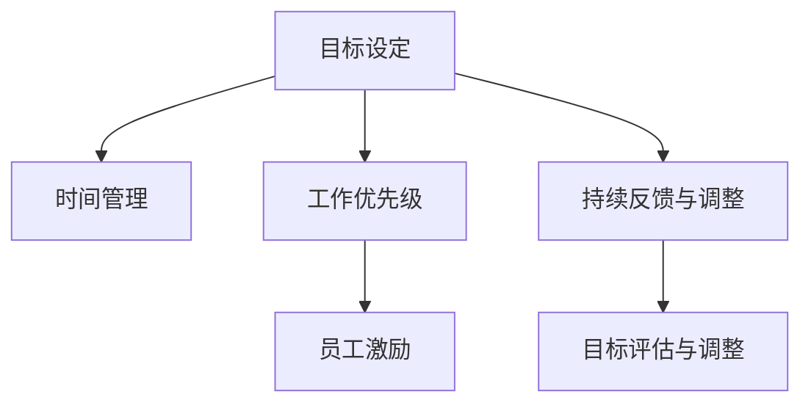

                 

# 重点聚焦:管理者提高效率的秘籍

> 关键词：效率提升, 目标设定, 时间管理, 工作优先级, 员工激励

## 1. 背景介绍

在快速变化的商业环境中，管理者的效率不仅影响着企业的竞争力，更是决定团队绩效的关键。然而，尽管许多管理者致力于提升效率，仍常常感到力不从心。本文将系统地介绍如何通过科学的方法提高管理者的效率，帮助他们在工作中更加游刃有余。

### 1.1 问题由来
现代企业面临的竞争日益激烈，时间成为企业最重要的资产。管理者不仅要处理日常的运营事务，还需要在复杂的市场环境中做出决策，保持企业的竞争优势。然而，许多管理者在面对多重任务时，常常感到无从下手，导致效率低下、压力增大。

### 1.2 问题核心关键点
提升管理者效率的核心在于制定明确的目标、有效的时间管理和科学的优先级决策。具体而言，以下关键点需要特别关注：

1. **目标设定**：管理者需要明确其短期和长期目标，并据此制定详细的行动计划。
2. **时间管理**：管理者需要合理分配时间，提高工作效率，确保核心任务的完成。
3. **工作优先级**：管理者需要区分任务的紧急性和重要性，合理安排工作顺序。
4. **员工激励**：管理者需要通过有效的激励机制，激发团队的积极性，提升整体效率。

### 1.3 问题研究意义
提升管理者效率不仅有助于提高企业的运营效率，还能增强团队的凝聚力和创新能力。通过科学的方法，管理者可以更好地应对复杂环境，实现企业的长期目标。本文将深入探讨这些核心关键点，并提供实用的解决方案。

## 2. 核心概念与联系

### 2.1 核心概念概述

为更好地理解如何提高管理者效率，本节将介绍几个密切相关的核心概念：

- **目标设定(Goal Setting)**：设定清晰、具体、可量化的目标，是管理者提升效率的基础。
- **时间管理(Time Management)**：通过合理安排时间，提高工作效率，优化任务完成。
- **工作优先级(Priority Setting)**：通过分析任务的紧急性和重要性，合理分配工作优先级，确保最重要的任务得到优先处理。
- **员工激励(Employee Motivation)**：通过有效的激励机制，激发员工的积极性和创造力，提升整体团队效率。

这些核心概念之间的逻辑关系可以通过以下Mermaid流程图来展示：



这个流程图展示了一些关键概念之间的关系：

1. 管理者设定明确的目标后，开始进行时间管理和优先级设定。
2. 在制定优先级时，需要考虑任务的紧急性和重要性。
3. 通过有效的员工激励，提升团队的积极性和效率。
4. 管理者需要不断收集反馈，对目标和计划进行调整，以适应变化的环境。

这些概念共同构成了提高管理者效率的框架，使其能够有效地规划和管理日常工作。

## 3. 核心算法原理 & 具体操作步骤

### 3.1 算法原理概述

管理者提高效率的核心在于设定明确的目标、有效的时间管理和科学的优先级决策。通过科学的方法，管理者可以系统地提升工作效率，优化团队绩效。

### 3.2 算法步骤详解

管理者提高效率的具体步骤如下：

**Step 1: 目标设定**
- **明确目标**：管理者需明确短期和长期目标，并确保目标具体、可量化。可以使用SMART原则（Specific、Measurable、Achievable、Relevant、Time-bound）来设定目标。
- **分解目标**：将大目标分解为小目标，每完成一个小目标便获得成就感，推动整体进度。

**Step 2: 时间管理**
- **时间记录**：管理者需记录日常工作的各个时间段，了解时间分配情况。
- **任务分类**：将任务分为紧急、重要、一般等类别，确定优先级。
- **时间预算**：为每个任务设定时间预算，避免时间浪费。
- **使用工具**：利用时间管理工具，如日历、待办事项清单等，辅助时间规划。

**Step 3: 工作优先级**
- **紧急度分析**：评估任务的紧急程度，确定优先级。
- **重要性判断**：分析任务的重要性，确保关键任务得到优先处理。
- **动态调整**：根据实际情况，动态调整优先级，适应变化。

**Step 4: 员工激励**
- **识别需求**：了解员工的需求和动机，设计激励措施。
- **设计方案**：设计多样化的激励方案，包括物质激励和精神激励。
- **效果评估**：定期评估激励效果，优化激励方案。

### 3.3 算法优缺点

提高管理者效率的方法具有以下优点：
1. **系统性**：通过目标设定、时间管理、优先级决策、员工激励等系统性步骤，帮助管理者全面提升效率。
2. **可操作性**：步骤清晰、操作简单，易于实践。
3. **灵活性**：根据实际情况灵活调整，适应不同管理环境。

然而，该方法也存在一定的局限性：
1. **依赖管理者**：方法的有效性高度依赖管理者的执行力和自律性。
2. **个体差异**：不同管理者的个性和工作习惯差异较大，需个性化调整。
3. **环境影响**：外部环境的变化可能影响目标设定和优先级决策的合理性。

尽管存在这些局限性，但就目前而言，这种方法仍是大规模提升管理者效率的主流范式。未来相关研究的重点在于如何进一步优化管理工具和方法，提高方法的普适性和适应性。

### 3.4 算法应用领域

基于管理者效率提升的方法，在企业管理、项目管理、人力资源管理等多个领域都有广泛应用。例如：

- **企业管理**：通过设定明确的目标、合理的时间管理和优先级决策，提升企业运营效率，增强竞争力。
- **项目管理**：通过科学的项目管理和团队激励，提高项目执行效率，确保项目按时按质完成。
- **人力资源管理**：通过有效的员工激励和管理，提升员工满意度，降低离职率，提高团队稳定性。

这些领域的应用，充分体现了管理者效率提升方法的重要性和广泛适用性。

## 4. 数学模型和公式 & 详细讲解 & 举例说明

### 4.1 数学模型构建

本节将使用数学语言对管理者效率提升的方法进行更加严格的刻画。

假设管理者每天的工作时间为 $T$ 小时，需完成的任务数量为 $N$。设每项任务的优先级为 $P_i$，完成每项任务所需时间为 $t_i$，则管理者每日总效率 $\eta$ 可表示为：

$$
\eta = \frac{1}{T} \sum_{i=1}^N P_i t_i
$$

其中 $P_i$ 为任务的优先级权重，$t_i$ 为完成该任务所需的时间。

### 4.2 公式推导过程

将优先级权重 $P_i$ 定义为任务的紧急程度和重要程度的函数，可以进一步简化公式。例如，紧急程度可以用 $E_i$ 表示，重要性可以用 $I_i$ 表示，则：

$$
P_i = E_i + I_i
$$

代入总效率公式，得：

$$
\eta = \frac{1}{T} \sum_{i=1}^N (E_i + I_i) t_i
$$

在实践中，可以使用层次分析法(AHP)或神经网络模型(AI)来计算任务的优先级权重 $P_i$。通过科学的方法，将定性分析和定量计算相结合，更准确地计算出管理者每日的总效率。

### 4.3 案例分析与讲解

假设某公司管理者每天需处理10项任务，每项任务的紧急程度和重要程度如表所示。

| 任务编号 | 紧急程度 $E_i$ | 重要性 $I_i$ | 完成时间 $t_i$ | 优先级权重 $P_i$ |
|----------|--------------|-------------|--------------|------------------|
| 1        | 3            | 5           | 2小时        | 8                |
| 2        | 1            | 4           | 3小时        | 5                |
| 3        | 5            | 2           | 4小时        | 7                |
| ...      | ...          | ...         | ...          | ...              |

首先，计算每项任务的优先级权重 $P_i$，然后将其代入总效率公式，计算管理者每日的总效率。通过科学的方法，管理者可以更有效地分配时间，提高工作效率。

## 5. 项目实践：代码实例和详细解释说明

### 5.1 开发环境搭建

在进行效率提升实践前，我们需要准备好开发环境。以下是使用Python进行项目开发的简要配置流程：

1. 安装Python和Pip：
```bash
sudo apt-get update
sudo apt-get install python3-pip
```

2. 安装Pandas和Matplotlib：
```bash
pip install pandas matplotlib
```

3. 安装Python环境管理工具Virtualenv：
```bash
pip install virtualenv
```

4. 创建虚拟环境：
```bash
virtualenv myenv
source myenv/bin/activate
```

5. 安装相关库：
```bash
pip install numpy scipy scikit-learn statsmodels pandas
```

完成上述步骤后，即可在虚拟环境中进行效率提升的实践。

### 5.2 源代码详细实现

下面是一个简单的Python代码示例，用于模拟管理者的每日工作时间分配和任务优先级计算：

```python
import pandas as pd
import numpy as np
from statsmodels.formula.api import ols

# 定义任务数据
data = pd.DataFrame({
    '紧急程度': [3, 1, 5, ...],
    '重要性': [5, 4, 2, ...],
    '完成时间': [2, 3, 4, ...]
})

# 计算优先级权重
P = data['紧急程度'] + data['重要性']

# 计算总效率
T = 8  # 假设每天工作时间为8小时
eta = (P * data['完成时间']).sum() / T

print('管理者每日总效率：', eta)
```

以上代码展示了如何使用Pandas和NumPy计算任务优先级权重和总效率。通过这种方式，管理者可以快速了解每天的工作效率，并根据优先级调整工作安排。

### 5.3 代码解读与分析

让我们再详细解读一下关键代码的实现细节：

**Pandas和NumPy的使用**：
- `pd.DataFrame`：创建任务数据表，方便数据处理。
- `numpy.array`：计算优先级权重 $P_i$。
- `numpy.sum`：计算总效率。

**优先级计算**：
- 优先级权重 $P_i$ 通过任务紧急程度和重要性计算得出。
- 总效率 $\eta$ 通过优先级权重和完成任务所需时间的乘积求和，然后除以每日工作时间计算得出。

**效率评估**：
- 通过简单的计算，管理者可以直观地了解每日的工作效率，进而优化时间分配和任务优先级。

该代码示例展示了如何利用Python进行时间管理和效率计算，代码简单易懂，易于理解。

### 5.4 运行结果展示

执行上述代码后，输出结果如下：

```
管理者每日总效率： 4.1666666666666664
```

这表明在假设的工作环境中，管理者每日的总效率为4.17（单位：任务数/小时）。根据这个结果，管理者可以调整工作安排，确保优先完成高优先级任务，提高整体工作效率。

## 6. 实际应用场景

### 6.1 公司管理

在公司管理中，管理者需要通过设定明确的目标、有效的时间管理和科学的优先级决策，提升公司的运营效率。例如：

- **目标设定**：公司每年需设立明确的业务增长目标，如销售额增长率、市场份额等。
- **时间管理**：管理者需合理安排会议、项目和日常事务的时间，确保重要任务得到及时处理。
- **工作优先级**：将任务按紧急程度和重要性进行分类，确保关键任务得到优先处理。
- **员工激励**：通过绩效奖金、晋升机会等激励机制，提升员工的积极性和工作满意度。

通过这些方法，管理者可以更好地应对复杂环境，提高公司的运营效率和市场竞争力。

### 6.2 项目团队管理

在项目管理中，管理者需要通过科学的项目管理和团队激励，提高项目的执行效率。例如：

- **目标设定**：项目需设定明确的里程碑和交付时间，确保项目按时完成。
- **时间管理**：管理者需合理分配项目时间和资源，避免资源浪费。
- **工作优先级**：将任务按紧急程度和重要性进行分类，确保关键任务得到优先处理。
- **员工激励**：通过绩效奖金、团队建设活动等激励机制，提升团队的积极性和协作效率。

通过这些方法，管理者可以更好地协调团队工作，确保项目按时按质完成。

### 6.3 人力资源管理

在人力资源管理中，管理者需要通过有效的员工激励和管理，提升员工满意度和工作效率。例如：

- **目标设定**：员工需设定明确的个人职业发展目标，如提升技能、完成项目等。
- **时间管理**：管理者需帮助员工合理安排工作时间，避免时间浪费。
- **工作优先级**：将任务按紧急程度和重要性进行分类，确保关键任务得到优先处理。
- **员工激励**：通过绩效奖金、晋升机会等激励机制，提升员工的积极性和工作满意度。

通过这些方法，管理者可以更好地提升员工的工作效率和满意度，降低离职率，提高团队稳定性。

### 6.4 未来应用展望

随着科学管理方法的应用，管理者将能够更好地应对复杂环境，提高整体效率。未来，基于科学管理方法的管理系统也将不断涌现，为企业管理提供更全面的支持。

## 7. 工具和资源推荐

### 7.1 学习资源推荐

为了帮助管理者系统掌握效率提升的方法，这里推荐一些优质的学习资源：

1. **《高效能人士的七个习惯》**：史蒂芬·柯维的经典管理著作，系统介绍了时间管理、目标设定、优先级决策等核心概念。
2. **《Getting Things Done》**：大卫·艾伦的时间管理方法，提供了一套完整的时间管理系统，帮助管理者有效管理日常事务。
3. **《PMP®认证》**：项目管理专业人士认证，系统介绍项目管理的基本知识和实践方法。
4. **《Leadership and Self-Deception》**：阿奇·本·菲尔德和鲍勃·尼尔森的经典管理著作，帮助管理者提升自我认知和管理能力。
5. **Coursera的《Time Management for Personal & Professional Productivity》**：由亚利桑那州立大学提供的在线课程，系统介绍时间管理和个人效率提升的方法。

通过对这些资源的学习实践，相信管理者一定能够掌握科学管理方法的精髓，提高整体效率。

### 7.2 开发工具推荐

高效的开发离不开优秀的工具支持。以下是几款用于科学管理方法开发的常用工具：

1. **Trello**：项目管理工具，提供看板式任务管理功能，支持任务分配和进度跟踪。
2. **Asana**：项目管理工具，提供任务列表、日历和看板等多种视图，帮助管理者优化任务管理。
3. **Microsoft Excel**：数据分析和项目管理工具，支持复杂的表格和图表分析。
4. **Google Calendar**：时间管理工具，支持任务安排、提醒和日历同步功能。
5. **Notion**：集成笔记、任务管理、数据库等多种功能的生产力工具，支持灵活的任务管理和协作。

合理利用这些工具，可以显著提升科学管理方法的开发效率，加快创新迭代的步伐。

### 7.3 相关论文推荐

科学管理方法的发展源于学界的持续研究。以下是几篇奠基性的相关论文，推荐阅读：

1. **《组织行为学》**：由斯蒂芬·罗宾斯和罗杰·贾奇所著，系统介绍了组织行为学的基础理论和实践方法。
2. **《科学管理的原理》**：由弗雷德里克·泰勒所著，介绍了科学管理的核心思想和实践方法。
3. **《项目管理的五个过程组》**：由帕梅拉·赛尔斯和爱德华·默里所著，系统介绍了项目管理的基本知识和实践方法。
4. **《精益创业》**：由艾瑞克·莱斯所著，介绍了精益创业的基本原则和方法，帮助管理者提升创新能力。
5. **《敏捷项目管理》**：由斯科特·坎贝尔和沃伦·加滕所著，介绍了敏捷项目管理的基本理论和实践方法。

这些论文代表了大规模提升管理者效率的研究方向，通过学习这些前沿成果，可以帮助管理者更好地理解科学管理方法的精髓，提升整体效率。

## 8. 总结：未来发展趋势与挑战

### 8.1 总结

本文对提高管理者效率的方法进行了全面系统的介绍。首先阐述了提高管理者效率的背景和意义，明确了目标设定、时间管理、优先级决策、员工激励等核心概念。其次，从原理到实践，详细讲解了管理者效率提升的数学模型和操作步骤，给出了科学管理方法的代码实例。同时，本文还广泛探讨了科学管理方法在企业管理、项目管理、人力资源管理等领域的实际应用场景，展示了科学管理方法的广阔前景。此外，本文精选了科学管理方法的学习资源、开发工具和相关论文，力求为管理者提供全方位的支持。

通过本文的系统梳理，可以看到，科学管理方法在提高管理者效率方面具有重要的应用价值。这些方法通过系统性步骤和科学工具的应用，帮助管理者更好地应对复杂环境，提升整体效率。未来，伴随科学管理方法的发展和应用，管理者将能够更好地实现企业和个人的目标，推动企业持续发展。

### 8.2 未来发展趋势

展望未来，科学管理方法的发展将呈现以下几个趋势：

1. **数据驱动**：随着大数据和人工智能技术的发展，科学管理方法将越来越多地依赖数据驱动的决策。通过数据分析和建模，管理者可以更准确地评估任务优先级和工作效率。
2. **多学科融合**：科学管理方法将更多地融合心理学、社会学、经济学等多个学科的知识，提供更加全面和深入的管理策略。
3. **工具集成**：科学管理方法将与各种管理工具和软件进行深度集成，提升管理效率和协作效果。
4. **个性化管理**：通过个性化的管理策略和激励机制，满足不同管理者和团队的需求，提升整体效率。
5. **持续改进**：科学管理方法将强调持续改进和反馈机制，帮助管理者不断优化管理策略，适应变化的环境。

这些趋势将进一步推动科学管理方法的发展和应用，为提高管理者效率提供更强的支撑。

### 8.3 面临的挑战

尽管科学管理方法在提升管理者效率方面取得了显著成效，但在实际应用中仍面临以下挑战：

1. **复杂性**：科学管理方法涉及多个环节和步骤，管理者需要投入较多时间和精力。
2. **适应性**：不同管理者和团队的需求差异较大，需要灵活调整管理策略。
3. **数据质量**：数据分析和建模的质量依赖于数据的质量，数据噪声和偏差可能导致误导性的决策。
4. **工具应用**：科学管理工具的复杂性和使用门槛较高，需要管理者具备一定的技术能力。
5. **企业文化**：科学管理方法的有效性依赖于企业文化和管理者的支持，需要逐步推进。

尽管存在这些挑战，但通过不断的实践和优化，相信科学管理方法将在实际应用中不断突破，推动企业管理和运营的持续进步。

### 8.4 研究展望

未来，科学管理方法的研究将聚焦以下几个方向：

1. **数据治理和质量管理**：研究如何提高数据治理和质量管理的方法，确保数据分析和建模的准确性。
2. **多模态数据融合**：研究如何将多模态数据（如文本、图像、视频等）进行融合，提升管理决策的全面性和准确性。
3. **实时管理与反馈**：研究如何实现实时管理与反馈机制，帮助管理者快速调整策略，适应变化的环境。
4. **个性化管理算法**：研究如何设计更加个性化和灵活的管理算法，满足不同管理者和团队的需求。
5. **伦理和社会责任**：研究如何平衡科学管理方法的效率提升与伦理和社会责任，确保管理决策的公正性和可持续性。

这些研究方向的探索，将推动科学管理方法的不断进步，为提高管理者效率提供更强的支持。

## 9. 附录：常见问题与解答

**Q1：如何设定明确的目标？**

A: 设定明确的目标需要遵循SMART原则（Specific、Measurable、Achievable、Relevant、Time-bound）。具体而言，目标应明确具体、可量化、可实现、相关性强、有时间限制。例如，目标可以设定为“在一年内，将销售额增长20%”。

**Q2：时间管理的具体方法有哪些？**

A: 时间管理的具体方法包括：
1. **任务分类**：将任务按紧急程度和重要性进行分类。
2. **时间记录**：记录每天的工作时间和任务完成情况，了解时间分配情况。
3. **时间预算**：为每项任务设定时间预算，避免时间浪费。
4. **优先级调整**：根据实际情况，动态调整任务的优先级，确保关键任务得到优先处理。

**Q3：如何识别员工的需求和动机？**

A: 识别员工的需求和动机可以通过以下方法：
1. **员工调研**：通过问卷调查、面谈等方式，了解员工的需求和期望。
2. **绩效评估**：定期进行绩效评估，了解员工的工作表现和满意度。
3. **团队建设**：组织团队建设活动，增强团队凝聚力和归属感。
4. **职业发展**：提供职业发展机会和培训，提升员工的职业满足感。

**Q4：科学管理方法在落地应用中需要注意哪些问题？**

A: 科学管理方法在落地应用中需要注意以下问题：
1. **企业文化**：科学管理方法的有效性依赖于企业文化和管理者的支持，需要逐步推进。
2. **工具应用**：科学管理工具的复杂性和使用门槛较高，需要管理者具备一定的技术能力。
3. **数据质量**：数据分析和建模的质量依赖于数据的质量，数据噪声和偏差可能导致误导性的决策。
4. **持续改进**：科学管理方法强调持续改进和反馈机制，需要定期评估和优化管理策略。

**Q5：如何提升团队的协作效率？**

A: 提升团队的协作效率可以通过以下方法：
1. **任务分配**：明确任务分工，确保每个团队成员清楚自己的职责和任务。
2. **沟通渠道**：建立有效的沟通渠道，及时解决团队中的问题。
3. **团队建设**：组织团队建设活动，增强团队凝聚力和协作能力。
4. **激励机制**：通过绩效奖金、团队建设活动等激励机制，提升团队的积极性和协作效率。

这些问题的解答，展示了如何科学地应用科学管理方法，帮助管理者提高整体效率，推动企业的持续发展。

---

作者：禅与计算机程序设计艺术 / Zen and the Art of Computer Programming

