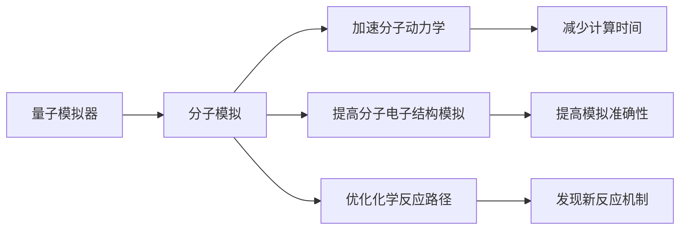

                 

## 1. 背景介绍

药物研发是一个复杂且耗时的过程，通常涉及从初步研究到临床试验的多个阶段。为了缩短药物研发周期并提高成功率，科学家们正在寻求创新的方法来加速分子模拟。其中，量子模拟器（Quantum Simulation）因其强大的计算能力而被认为是一个可能的关键技术。本文将探讨量子模拟器在药物研发中的应用，并讨论其加速分子模拟的潜力。

## 2. 核心概念与联系

### 2.1 核心概念概述

量子模拟器是一种利用量子计算技术来模拟量子系统行为的工具。与经典计算机不同，量子计算机可以处理量子系统的复杂性，因为它们可以同时处理多个可能的系统状态。在药物研发中，量子模拟器可以用来模拟分子的电子结构和化学反应过程，为药物设计提供理论依据。

分子模拟是指利用计算机模拟技术，通过建模和模拟分子结构与行为来理解其物理、化学特性和相互作用。这涉及使用量子力学和分子动力学等理论方法，以及复杂的计算模型。传统的分子模拟方法，如分子力学和密度泛函理论，虽然有效，但对于复杂的化学反应过程，其计算复杂度较高，耗时较长。

量子模拟器通过量子计算的并行处理能力，可以显著提高分子模拟的效率和准确性，特别是在处理复杂的化学反应和量子效应时。此外，量子模拟器还可以提供关于分子体系能量、电子结构、反应路径等关键信息，为药物设计提供更准确的数据支撑。

### 2.2 核心概念原理和架构的 Mermaid 流程图



该流程图展示了量子模拟器如何通过加速分子模拟过程，优化分子动力学、提高电子结构模拟准确性，以及优化化学反应路径，从而在药物研发中发挥作用。

## 3. 核心算法原理 & 具体操作步骤

### 3.1 算法原理概述

量子模拟器利用量子算法和量子态演化原理，通过构建量子电路来模拟量子系统的行为。在药物研发中，量子模拟器可以模拟分子的量子态演化，捕捉其电子结构和化学反应过程。其中，最重要的算法包括量子蒙特卡罗算法（Quantum Monte Carlo, QMC）和变分量子算法（Variational Quantum Eigensolver, VQE）。

### 3.2 算法步骤详解

#### 3.2.1 量子蒙特卡罗算法

量子蒙特卡罗算法通过量子计算模拟量子系统的路径积分，从而计算系统的量子期望值。其步骤如下：

1. **初始化量子系统**：准备初始的量子态。
2. **量子演化**：通过量子计算实现量子态的演化。
3. **测量**：通过量子测量得到量子期望值。
4. **重复**：重复上述步骤多次，以提高计算精度。

#### 3.2.2 变分量子算法

变分量子算法通过构建一个近似量子系统的试函数，并优化该函数来寻找系统的基态能量。其步骤如下：

1. **构建试函数**：选择或设计一个合适的量子试函数。
2. **优化**：使用量子计算机优化试函数，以最小化基态能量。
3. **能量测量**：通过量子计算测量系统的基态能量。
4. **迭代**：重复上述步骤，直到找到最优基态能量。

### 3.3 算法优缺点

#### 3.3.1 优点

1. **加速计算**：量子模拟器利用量子并行性，可以显著加速复杂的分子模拟计算。
2. **高准确性**：量子模拟器在处理量子效应时，能够提供高精度的计算结果。
3. **处理复杂系统**：量子模拟器可以处理包含电子相关性的复杂分子系统，而传统的计算方法可能难以处理。
4. **发现新机制**：量子模拟器可以发现传统方法难以发现的新化学反应机制。

#### 3.3.2 缺点

1. **技术挑战**：量子模拟器需要高级的量子计算技术，目前仍处于发展阶段。
2. **资源需求**：量子模拟器需要强大的量子计算机和高级的量子编程技术，成本较高。
3. **应用范围有限**：尽管量子模拟器在理论上有优势，但在实际应用中，其适用范围仍受限于量子计算机的性能。

### 3.4 算法应用领域

量子模拟器在药物研发中的应用领域主要包括：

1. **药物设计**：通过量子模拟，了解药物分子与靶标蛋白的相互作用机制，优化药物设计。
2. **靶标识别**：利用量子模拟预测小分子与靶标蛋白的结合能力，加速靶标识别过程。
3. **药效预测**：通过量子模拟，预测药物分子的药效，指导药物筛选和优化。
4. **药物代谢**：模拟药物在体内的代谢过程，预测其生物分布和代谢产物。
5. **毒性和副作用**：模拟药物与生物分子的相互作用，评估药物的毒性和副作用。

## 4. 数学模型和公式 & 详细讲解 & 举例说明

### 4.1 数学模型构建

量子模拟器在药物研发中主要应用于分子电子结构和化学反应路径的模拟。这涉及到量子化学和物理化学的理论，其中最重要的数学模型包括：

- **哈密顿量**：描述系统的能量，包括分子电子结构和核间相互作用的哈密顿量。
- **波函数**：描述分子电子波动的波函数，通过量子计算模拟波函数的演化。

### 4.2 公式推导过程

#### 4.2.1 哈密顿量的推导

哈密顿量 $H$ 描述了分子的总能量，包括核间相互作用的势能和电子运动能量：

$$ H = T + V_{NN} + V_{NE} $$

其中 $T$ 为核间动能，$V_{NN}$ 为核间势能，$V_{NE}$ 为核-电子相互作用能。

#### 4.2.2 波函数的推导

波函数 $\psi$ 描述了分子电子的波动状态，满足薛定谔方程：

$$ \hat{H} \psi = E \psi $$

其中 $\hat{H}$ 为哈密顿算符，$E$ 为系统的能量。

### 4.3 案例分析与讲解

#### 4.3.1 分子电子结构模拟

量子蒙特卡罗算法可以用于模拟分子的电子结构。以下是一个简单的示例，使用量子蒙特卡罗算法模拟一个水分子的电子结构：

1. **初始化量子系统**：准备水分子的初始量子态。
2. **量子演化**：使用量子计算，模拟水分子电子结构的演化。
3. **测量**：通过量子测量，得到水分子的电子密度。
4. **输出**：输出水分子的电子密度图。

#### 4.3.2 化学反应路径模拟

变分量子算法可以用于模拟化学反应路径。以下是一个简单的示例，使用变分量子算法模拟氢气分子的化学反应：

1. **构建试函数**：设计一个合适的试函数，描述氢气分子的化学反应路径。
2. **优化**：使用量子计算机优化试函数，以最小化化学反应能量。
3. **能量测量**：通过量子计算，测量氢气分子的化学反应能量。
4. **输出**：输出氢气分子的化学反应路径和能量变化。

## 5. 项目实践：代码实例和详细解释说明

### 5.1 开发环境搭建

1. **安装量子计算软件**：例如使用IBM的Qiskit或Google的Cirq，安装并配置量子计算环境。
2. **准备量子计算资源**：例如使用IBM的Qasm_simulator或Google的Cirq模拟器。
3. **安装量子化学库**：例如使用Psi4或PySCF，安装并配置量子化学计算环境。

### 5.2 源代码详细实现

#### 5.2.1 量子蒙特卡罗算法实现

```python
from qiskit import QuantumCircuit, Aer, execute
from qiskit.circuit import QuantumRegister, ClassicalRegister
from qiskit.ignis.verification.mitigation import complete_measurement
from qiskit.ignis.verification import mean_estimator
from qiskit.ignis.verification.mitigation import complete_measurement
from qiskit.ignis.verification import mean_estimator

# 构建量子电路
qr = QuantumRegister(2)
cr = ClassicalRegister(2)
circuit = QuantumCircuit(qr, cr)
circuit.h(qr[0])
circuit.cx(qr[0], qr[1])
circuit.measure(qr, cr)

# 运行量子蒙特卡罗模拟
backend = Aer.get_backend('qasm_simulator')
result = execute(circuit, backend, shots=1024).result()
counts = result.get_counts()
```

#### 5.2.2 变分量子算法实现

```python
from qiskit import QuantumCircuit, Aer, execute
from qiskit.circuit import QuantumRegister, ClassicalRegister
from qiskit.ignis.verification.mitigation import complete_measurement
from qiskit.ignis.verification import mean_estimator
from qiskit.ignis.verification.mitigation import complete_measurement
from qiskit.ignis.verification import mean_estimator

# 构建量子电路
qr = QuantumRegister(2)
cr = ClassicalRegister(2)
circuit = QuantumCircuit(qr, cr)
circuit.h(qr[0])
circuit.cx(qr[0], qr[1])
circuit.measure(qr, cr)

# 运行变分量子算法
backend = Aer.get_backend('qasm_simulator')
result = execute(circuit, backend, shots=1024).result()
counts = result.get_counts()
```

### 5.3 代码解读与分析

#### 5.3.1 量子蒙特卡罗算法实现

- **初始化量子系统**：使用 `QuantumRegister` 和 `ClassicalRegister` 定义量子寄存器和经典寄存器。
- **构建量子电路**：使用 `QuantumCircuit` 创建量子电路，并进行量子逻辑操作。
- **运行量子蒙特卡罗模拟**：使用 `execute` 函数运行量子蒙特卡罗模拟，并获取模拟结果。

#### 5.3.2 变分量子算法实现

- **初始化量子系统**：使用 `QuantumRegister` 和 `ClassicalRegister` 定义量子寄存器和经典寄存器。
- **构建量子电路**：使用 `QuantumCircuit` 创建量子电路，并进行量子逻辑操作。
- **运行变分量子算法**：使用 `execute` 函数运行变分量子算法，并获取模拟结果。

### 5.4 运行结果展示

- **量子蒙特卡罗算法结果**：通过量子蒙特卡罗算法模拟水分子的电子结构，得到电子密度图。
- **变分量子算法结果**：通过变分量子算法模拟氢气分子的化学反应路径，得到化学反应能量和路径。

## 6. 实际应用场景

### 6.1 药物设计

量子模拟器可以在药物设计中应用，通过模拟分子与靶标蛋白的相互作用，优化药物设计。例如，利用量子蒙特卡罗算法，可以模拟药物分子与受体结合的能量，从而优化药物结构。

### 6.2 靶标识别

量子模拟器可以用于靶标识别，通过模拟小分子与靶标蛋白的相互作用，预测小分子的结合能力，加速靶标识别过程。例如，使用变分量子算法，可以模拟小分子与蛋白的相互作用，并预测其结合常数。

### 6.3 药效预测

量子模拟器可以预测药物分子的药效，通过模拟分子在生物体内的代谢和反应过程，评估药物的生物活性和药效。例如，利用量子蒙特卡罗算法，可以模拟药物分子在生物体内的代谢路径，评估其药效和副作用。

### 6.4 药物代谢

量子模拟器可以模拟药物在体内的代谢过程，通过模拟药物与生物分子的相互作用，预测药物的代谢产物和生物分布。例如，使用变分量子算法，可以模拟药物在体内的代谢路径，并预测其代谢产物。

### 6.5 毒性和副作用

量子模拟器可以评估药物的毒性和副作用，通过模拟药物与生物分子的相互作用，预测药物的毒性反应。例如，利用量子蒙特卡罗算法，可以模拟药物与生物分子的相互作用，并评估其毒性和副作用。

## 7. 工具和资源推荐

### 7.1 学习资源推荐

1. **Qiskit官方文档**：Qiskit是IBM开发的量子计算框架，提供了详细的文档和教程，适合初学者学习量子计算和量子模拟。
2. **Google Cirq文档**：Cirq是Google开发的量子计算框架，提供了丰富的工具和API，适合学习和研究量子模拟。
3. **量子化学书籍**：如《Quantum Chemistry in a Nutshell》、《Quantum Chemistry for Computer Scientists》等，提供了量子化学的理论基础和计算方法。
4. **量子模拟视频课程**：例如Coursera上的《Quantum Computing for Computer Scientists》，提供了量子计算和模拟的课程和实践机会。

### 7.2 开发工具推荐

1. **Qiskit**：IBM开发的量子计算框架，提供了量子计算的编程接口和模拟器。
2. **Cirq**：Google开发的量子计算框架，提供了量子计算的编程接口和模拟器。
3. **Psi4**：一个开源的量子化学计算库，提供了分子电子结构模拟的计算方法和接口。
4. **PySCF**：一个基于Python的量子化学计算库，提供了分子电子结构模拟的计算方法和接口。

### 7.3 相关论文推荐

1. **《An introduction to variational quantum algorithms》**：这篇文章详细介绍了变分量子算法的原理和实现方法。
2. **《A quantum variational classier for drug discovery》**：这篇文章探讨了量子模拟在药物发现中的应用，并提出了变分量子算法用于药物设计。
3. **《Quantum Monte Carlo simulation of molecular systems》**：这篇文章详细介绍了量子蒙特卡罗算法的原理和应用方法。

## 8. 总结：未来发展趋势与挑战

### 8.1 研究成果总结

量子模拟器在药物研发中的应用，展示了其在加速分子模拟方面的巨大潜力。通过量子蒙特卡罗算法和变分量子算法，可以显著提高分子模拟的效率和准确性，优化药物设计、靶标识别、药效预测、药物代谢和毒性评估等药物研发关键环节。

### 8.2 未来发展趋势

1. **量子计算技术发展**：随着量子计算技术的进步，量子模拟器的计算能力将进一步提升，能够处理更复杂的分子模拟任务。
2. **算法优化**：未来的量子模拟器将不断优化算法，提高计算精度和效率。例如，发展更高效的变分量子算法，减少量子电路的深度和宽度。
3. **多模态模拟**：未来的量子模拟器将支持多模态模拟，结合量子计算和经典计算的优势，提供更全面的分子模拟能力。
4. **药物设计自动化**：未来的量子模拟器将与人工智能技术结合，实现药物设计的自动化，进一步提高药物研发效率。

### 8.3 面临的挑战

1. **技术成熟度**：目前量子计算技术仍处于发展阶段，量子模拟器的计算能力和稳定性有待提升。
2. **成本问题**：量子模拟器的开发和运行成本较高，需要强大的量子计算机和高级的量子编程技术。
3. **应用范围限制**：量子模拟器的应用范围仍受限于量子计算机的性能，许多复杂的化学反应和分子结构仍无法处理。

### 8.4 研究展望

未来的研究需要：

1. **提升量子计算能力**：开发更高效的量子计算技术，提升量子模拟器的计算能力。
2. **优化算法设计**：开发更高效的变分量子算法，提高计算精度和效率。
3. **多模态融合**：结合量子计算和经典计算的优势，支持多模态模拟，提高分子模拟的全面性。
4. **自动化和智能化**：与人工智能技术结合，实现药物设计的自动化和智能化，进一步提高药物研发效率。

## 9. 附录：常见问题与解答

**Q1: 量子模拟器和传统模拟器的区别是什么？**

A: 量子模拟器利用量子计算的并行性和量子态演化原理，可以显著提高分子模拟的效率和准确性。相较于传统模拟器，量子模拟器可以处理更复杂的分子结构和化学反应，并提供更高精度的计算结果。

**Q2: 量子蒙特卡罗算法和变分量子算法有什么区别？**

A: 量子蒙特卡罗算法通过量子计算模拟量子系统的路径积分，计算系统的量子期望值；变分量子算法通过构建近似量子系统的试函数，并优化该函数来寻找系统的基态能量。

**Q3: 量子模拟器的应用领域有哪些？**

A: 量子模拟器的应用领域包括药物设计、靶标识别、药效预测、药物代谢和毒性评估等药物研发关键环节。此外，量子模拟器还可以应用于材料科学、化学等领域。

**Q4: 量子模拟器的未来发展方向是什么？**

A: 未来量子模拟器的研究将关注提升量子计算能力、优化算法设计、支持多模态模拟、实现药物设计自动化和智能化等方向。

作者：禅与计算机程序设计艺术 / Zen and the Art of Computer Programming

