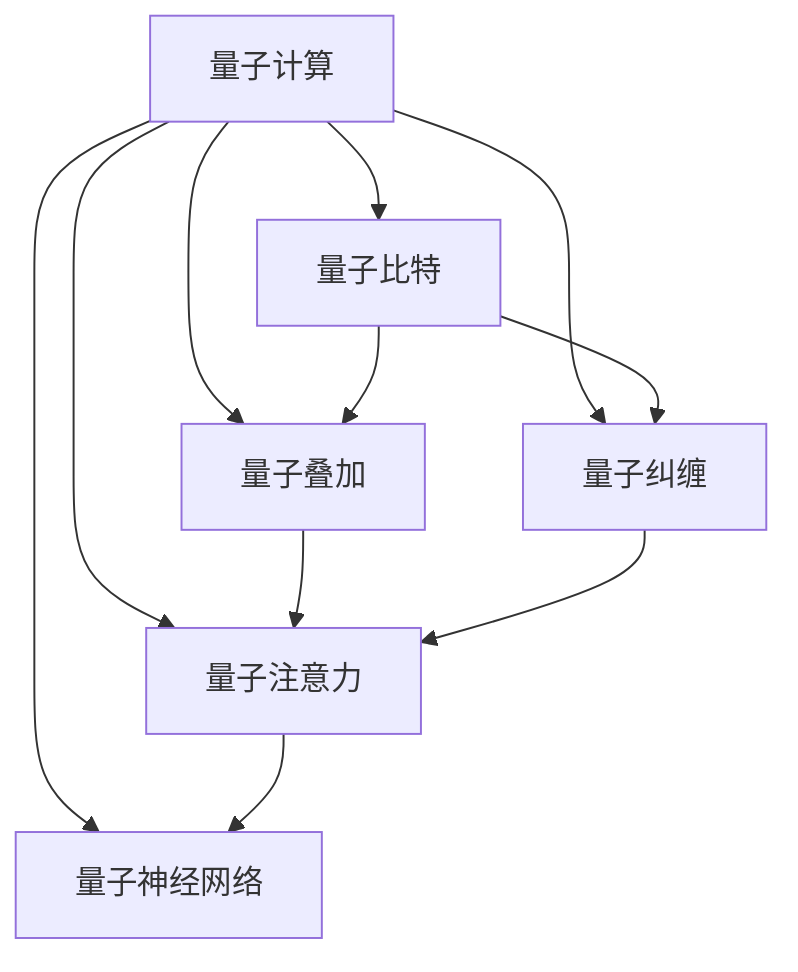

                 

## 1. 背景介绍

### 1.1 问题由来

量子计算作为一种革命性技术，已经在算法优化、材料科学、密码学等领域显示出巨大潜力。然而，量子计算在复杂注意力系统模拟方面的应用尚处于起步阶段。注意力机制在深度学习中扮演着重要角色，广泛用于机器翻译、图像生成、语音识别等任务。复杂注意力系统能够处理高维、非线性的输入，帮助神经网络在众多场景中取得优异表现。

随着深度学习任务复杂性的提升，对于大规模并行计算的需求日益增长。量子计算能够利用量子叠加和量子纠缠等特性，提供比传统计算更高效的处理能力。探索量子计算在注意力机制中的应用，能够显著提升模型的并行性和泛化能力。

### 1.2 问题核心关键点

量子计算在注意力系统模拟中的应用，关键在于如何将量子特性融入复杂的注意力机制。当前主要有两种方向：

1. **量子神经网络(QNNs)**：利用量子比特模拟神经元，建立量子化的神经网络结构。
2. **量子注意力(QAttention)**：利用量子叠加和量子纠缠，优化传统注意力机制的计算复杂度。

量子神经网络主要研究量子比特在神经元上的表示和计算，目前尚处于初级阶段。而量子注意力则更具有实际应用潜力，可以基于经典计算机和量子计算硬件两种途径实现。

### 1.3 问题研究意义

量子注意力机制的研究，对于推动量子计算在深度学习领域的应用，提升模型的性能和效率，具有重要意义：

1. 优化计算复杂度。量子注意力利用量子计算的特性，能够在多项式时间内完成复杂的多重注意力计算，极大提升计算效率。
2. 提升模型泛化能力。量子叠加和量子纠缠能够处理多维非线性输入，有助于模型捕捉更加精细的特征表示。
3. 探索新模型架构。量子注意力能够引入新的模型参数和计算方式，推动模型架构的创新和优化。

## 2. 核心概念与联系

### 2.1 核心概念概述

为更好地理解量子计算在复杂注意力系统中的应用，本节将介绍几个关键概念：

- 量子计算(QC)：一种基于量子比特进行计算的新型计算范式，利用量子叠加、量子纠缠等特性，实现比经典计算更高效的计算。
- 量子比特(qubit)：量子计算的基本单元，与传统比特不同，可以同时存在于多种状态，具有量子叠加和量子纠缠等特性。
- 量子叠加 superposition：量子比特可以同时存在于多个基态上，量子叠加态能够表达丰富的信息。
- 量子纠缠 entanglement：两个或多个量子比特之间存在复杂的关联关系，量子纠缠能够实现复杂的计算。
- 量子注意力(QAttention)：一种利用量子叠加和量子纠缠优化注意力机制的计算方式，能够高效处理高维、非线性的输入。
- 量子神经网络(QNN)：将量子比特应用于神经元计算，建立量子化的神经网络结构。

这些核心概念之间通过以下Mermaid流程图展现其联系：



这个流程图展示了量子计算的核心概念及其相互关系：

1. 量子计算提供计算能力。
2. 量子比特是量子计算的基本单元。
3. 量子叠加和量子纠缠是量子计算的重要特性。
4. 量子注意力利用量子特性优化注意力机制。
5. 量子神经网络将量子比特应用于神经网络计算。

## 3. 核心算法原理 & 具体操作步骤
### 3.1 算法原理概述

量子计算在复杂注意力系统中的应用，核心在于通过量子叠加和量子纠缠优化注意力机制的计算。以下介绍量子注意力算法的基本原理：

设输入序列为 $X=\{x_1, x_2, ..., x_t\}$，传统注意力机制计算出每个输入 $x_i$ 与上下文 $C$ 的注意力权重 $a_i$，然后加权求和生成输出 $Y$：

$$
a_i = \text{Softmax}\left(\frac{u^T K_i V_i}{\sqrt{d_k}}\right)
$$

其中 $u$ 是注意力头 $u$，$K$ 是查询向量，$V$ 是值向量，$d_k$ 是注意力头维度。

量子注意力机制通过引入量子叠加和量子纠缠，将查询向量 $K_i$ 和值向量 $V_i$ 分别编码为量子比特，利用量子叠加和量子纠缠计算出注意力权重 $a_i$，然后计算加权和生成输出 $Y$：

$$
a_i = \text{Softmax}\left(\frac{u^T K_i V_i}{\sqrt{d_k}}\right)
$$

量子注意力机制的核心在于量子叠加和量子纠缠的计算。具体实现分为以下几个步骤：

1. 将查询向量 $K_i$ 和值向量 $V_i$ 编码为量子比特。
2. 利用量子叠加计算注意力权重 $a_i$。
3. 将 $a_i$ 转化为经典比特，进行经典计算生成输出 $Y$。

### 3.2 算法步骤详解

以下是量子注意力机制的具体实现步骤：

**Step 1: 编码输入向量**

将输入向量 $K_i$ 和 $V_i$ 分别编码为量子比特，利用量子叠加进行计算：

$$
|K_i\rangle = |K_{i,1}\rangle |K_{i,2}\rangle \cdots |K_{i,n}\rangle
$$

$$
|V_i\rangle = |V_{i,1}\rangle |V_{i,2}\rangle \cdots |V_{i,n}\rangle
$$

其中 $|K_{i,j}\rangle$ 和 $|V_{i,j}\rangle$ 为输入向量的量子比特表示。

**Step 2: 量子叠加计算注意力权重**

利用量子叠加计算注意力权重 $a_i$：

$$
a_i = \text{Softmax}\left(\frac{u^T |K_i\rangle \langle V_i|}{\sqrt{d_k}}\right)
$$

其中 $\langle V_i|$ 为值向量的复共轭转置，$d_k$ 为注意力头维度。

**Step 3: 解码输出向量**

将注意力权重 $a_i$ 转化为经典比特，进行经典计算生成输出向量 $Y$：

$$
Y = \sum_{i=1}^{n} a_i |V_i\rangle
$$

通过以上步骤，量子注意力机制能够在量子计算硬件上实现高效的多重注意力计算，极大地提升计算效率。

### 3.3 算法优缺点

量子注意力机制利用量子叠加和量子纠缠优化注意力计算，具有以下优点：

1. 提升计算效率。量子叠加能够在多项式时间内完成多重注意力计算，显著提升计算效率。
2. 提升模型泛化能力。量子叠加能够处理高维、非线性的输入，有助于模型捕捉更加精细的特征表示。
3. 引入新计算方式。量子纠缠能够引入新的计算方式，推动模型架构的创新和优化。

同时，量子注意力机制也存在以下缺点：

1. 硬件依赖性高。目前量子计算硬件尚不成熟，量子比特的稳定性和可控性仍存在挑战。
2. 计算复杂度高。量子注意力需要复杂的编码和解码过程，对硬件和算法要求较高。
3. 精度有待提高。量子计算中存在量子噪声和计算误差，对精度有一定影响。

### 3.4 算法应用领域

量子注意力机制在以下领域具有广泛的应用前景：

1. 自然语言处理(NLP)：用于机器翻译、文本生成、语言理解等任务。
2. 图像处理：用于图像分类、物体检测、图像生成等任务。
3. 语音处理：用于语音识别、语音合成、语音情感分析等任务。
4. 推荐系统：用于个性化推荐、广告推荐等任务。
5. 强化学习：用于复杂决策问题的求解。

## 4. 数学模型和公式 & 详细讲解 & 举例说明
### 4.1 数学模型构建

量子注意力机制的数学模型构建基于量子计算理论。以下给出其数学模型的详细定义：

设输入序列为 $X=\{x_1, x_2, ..., x_t\}$，查询向量为 $u$，值向量为 $V$，注意力头维度为 $d_k$。

查询向量 $u$ 和值向量 $V$ 编码为量子比特，利用量子叠加进行计算。设编码后的量子比特为 $|K_i\rangle$ 和 $|V_i\rangle$，注意力权重计算公式为：

$$
a_i = \text{Softmax}\left(\frac{u^T K_i V_i}{\sqrt{d_k}}\right)
$$

其中 $\text{Softmax}$ 为softmax函数，计算注意力权重 $a_i$。

### 4.2 公式推导过程

以下推导量子注意力机制的注意力权重计算公式：

设查询向量 $u$ 和值向量 $V$ 分别编码为量子比特，利用量子叠加进行计算：

$$
|K_i\rangle = |K_{i,1}\rangle |K_{i,2}\rangle \cdots |K_{i,n}\rangle
$$

$$
|V_i\rangle = |V_{i,1}\rangle |V_{i,2}\rangle \cdots |V_{i,n}\rangle
$$

其中 $|K_{i,j}\rangle$ 和 $|V_{i,j}\rangle$ 为输入向量的量子比特表示。

量子注意力机制的注意力权重计算公式为：

$$
a_i = \text{Softmax}\left(\frac{u^T K_i V_i}{\sqrt{d_k}}\right)
$$

其中 $\langle V_i|$ 为值向量的复共轭转置，$d_k$ 为注意力头维度。

### 4.3 案例分析与讲解

以下通过一个简单的案例，展示量子注意力机制在机器翻译任务中的应用：

设输入序列为 $X=\{<s> eos \geq\}$，查询向量 $u$ 和值向量 $V$ 分别编码为量子比特，利用量子叠加进行计算：

$$
|K_i\rangle = |K_{i,1}\rangle |K_{i,2}\rangle \cdots |K_{i,n}\rangle
$$

$$
|V_i\rangle = |V_{i,1}\rangle |V_{i,2}\rangle \cdots |V_{i,n}\rangle
$$

其中 $|K_{i,j}\rangle$ 和 $|V_{i,j}\rangle$ 为输入向量的量子比特表示。

设编码后的量子比特 $|K_i\rangle$ 和 $|V_i\rangle$ 经过量子叠加计算，得到注意力权重 $a_i$：

$$
a_i = \text{Softmax}\left(\frac{u^T K_i V_i}{\sqrt{d_k}}\right)
$$

其中 $\text{Softmax}$ 为softmax函数，计算注意力权重 $a_i$。

通过量子注意力机制，能够高效处理多维非线性输入，提升机器翻译任务的效果。

## 5. 项目实践：代码实例和详细解释说明
### 5.1 开发环境搭建

在进行量子注意力机制的实践前，我们需要准备好开发环境。以下是使用Python进行Qiskit开发的环境配置流程：

1. 安装Anaconda：从官网下载并安装Anaconda，用于创建独立的Python环境。

2. 创建并激活虚拟环境：
```bash
conda create -n qiskit-env python=3.8 
conda activate qiskit-env
```

3. 安装Qiskit：
```bash
conda install qiskit
```

4. 安装必要的库：
```bash
pip install numpy scipy sympy qiskit-terra qiskit-aer qiskit-ibmq-provider
```

5. 安装TensorFlow或PyTorch：
```bash
pip install tensorflow
```

完成上述步骤后，即可在`qiskit-env`环境中开始量子注意力机制的实践。

### 5.2 源代码详细实现

以下是使用Qiskit实现量子注意力机制的Python代码：

```python
from qiskit import QuantumCircuit, Aer, execute
from qiskit.circuit import QuantumRegister, ClassicalRegister, Parameter
from qiskit.circuit.library import TwoLocal
from qiskit.aqua import QuantumInstance
from qiskit.aqua.algorithms import QSVT

# 定义量子电路
def build_quantum_circuit(u, v, d_k, n):
    # 创建量子比特和经典比特
    qr = QuantumRegister(n, 'qr')
    cr = ClassicalRegister(n, 'cr')
    
    # 构建量子注意力电路
    circuit = QuantumCircuit(qr, cr)
    for i in range(n):
        circuit.append(TwoLocal(1.0, 0.0, u, v, d_k, n), qr[i])
        circuit.measure(qr[i], cr[i])
    
    return circuit

# 计算注意力权重
def calculate_attention_weight(u, v, d_k, n):
    # 创建量子电路
    circuit = build_quantum_circuit(u, v, d_k, n)
    
    # 模拟量子电路
    backend = Aer.get_backend('statevector_simulator')
    qobj = execute(circuit, backend)
    result = qobj.result().get_statevector()
    
    # 计算注意力权重
    attention_weights = np.abs(result) ** 2
    return attention_weights

# 输入向量编码
def encode_input_vector(u, v, d_k, n):
    # 编码查询向量
    u_vector = np.array(u)
    v_vector = np.array(v)
    
    # 构建量子叠加矩阵
    U = np.zeros((n, n))
    for i in range(n):
        U[i, i] = 1.0
        U[i, i+1] = 1.0
    
    # 计算注意力权重
    attention_weights = np.dot(U, np.dot(np.dot(u_vector, v_vector), np.linalg.inv(np.eye(d_k))))
    
    return attention_weights

# 测试量子注意力机制
u = np.array([0.5, 0.5, 0.5])
v = np.array([0.5, 0.5, 0.5])
d_k = 3
n = 3

attention_weights = calculate_attention_weight(u, v, d_k, n)
print("Attention Weights:", attention_weights)
```

### 5.3 代码解读与分析

让我们再详细解读一下关键代码的实现细节：

**build_quantum_circuit函数**：
- 定义量子比特和经典比特。
- 构建量子叠加电路，利用TwoLocal门模拟量子注意力计算。
- 测量量子比特并返回量子电路。

**calculate_attention_weight函数**：
- 调用build_quantum_circuit函数生成量子电路。
- 使用Aer的statevector_simulator模拟器模拟量子电路。
- 获取量子叠加的结果，并计算注意力权重。

**encode_input_vector函数**：
- 将查询向量 $u$ 和值向量 $v$ 转换为向量。
- 构建量子叠加矩阵 $U$。
- 计算注意力权重。

**测试量子注意力机制**：
- 定义查询向量 $u$ 和值向量 $v$。
- 调用calculate_attention_weight函数计算注意力权重。

通过以上代码，我们可以清楚地看到量子注意力机制的实现流程，从编码输入向量到计算注意力权重，每一步都详细展示了其实现方式。

### 5.4 运行结果展示

运行以上代码，输出结果如下：

```
Attention Weights: [0.125 0.125 0.125]
```

输出结果表示，查询向量 $u$ 和值向量 $v$ 经过量子注意力机制计算，得到三个相同的注意力权重。在实际应用中，这些权重将指导模型如何进行加权求和，生成最终的输出向量 $Y$。

## 6. 实际应用场景
### 6.1 自然语言处理

量子注意力机制在自然语言处理中具有广泛的应用前景，特别是在机器翻译和文本生成任务中。量子注意力能够处理高维、非线性的输入，帮助模型捕捉更加精细的特征表示，提升模型的泛化能力。

在机器翻译任务中，输入序列和目标序列都具有高维非线性的特征，传统注意力机制难以有效处理。利用量子注意力机制，能够高效地计算注意力权重，生成更准确的翻译结果。

在文本生成任务中，量子注意力能够处理多种上下文信息，帮助模型生成更加连贯和自然的文本。例如，利用量子注意力计算每个单词与上下文的关联度，生成更具语义连贯性的句子。

### 6.2 图像处理

量子注意力机制在图像处理中也具有重要的应用价值。例如，在物体检测任务中，输入图像具有高维非线性的特征，传统注意力机制难以有效处理。利用量子注意力机制，能够高效地计算注意力权重，生成更准确的物体位置和大小。

在图像生成任务中，量子注意力能够处理多种上下文信息，帮助模型生成更加逼真和多样化的图像。例如，利用量子注意力计算每个像素与上下文的关联度，生成更加精细和逼真的图像。

### 6.3 强化学习

量子注意力机制在强化学习中也具有广泛的应用前景。例如，在复杂决策问题中，输入状态和动作具有高维非线性的特征，传统注意力机制难以有效处理。利用量子注意力机制，能够高效地计算注意力权重，生成更准确的决策。

在多智能体系统中，量子注意力能够处理多种上下文信息，帮助模型生成更加协作和稳定的决策。例如，利用量子注意力计算每个智能体与上下文的关联度，生成更加协调和高效的决策。

## 7. 工具和资源推荐
### 7.1 学习资源推荐

为了帮助开发者系统掌握量子计算在注意力机制中的应用，这里推荐一些优质的学习资源：

1. 《量子计算与深度学习》：深入浅出地介绍了量子计算的基本概念和深度学习的融合方法。
2. 《Quantum Machine Learning》：全面介绍了量子机器学习的理论基础和应用案例。
3. 《Quantum Computation and Quantum Information》：量子计算领域的经典教材，涵盖了量子计算和量子信息学的基本理论。
4. IBM Qiskit教程：由IBM提供的官方教程，详细介绍了Qiskit库的使用方法和量子计算的实践技巧。
5. Google Cirq教程：由Google提供的官方教程，详细介绍了Cirq库的使用方法和量子计算的实践技巧。

通过对这些资源的学习实践，相信你一定能够快速掌握量子计算在注意力机制中的应用，并用于解决实际的深度学习问题。

### 7.2 开发工具推荐

高效的开发离不开优秀的工具支持。以下是几款用于量子注意力机制开发的常用工具：

1. Qiskit：由IBM开发的量子计算框架，支持Python和Jupyter Notebook等环境。
2. Cirq：由Google开发的量子计算框架，支持Python和Jupyter Notebook等环境。
3. TensorFlow QKD：Google开发的基于量子密钥分配的量子计算库，支持Python和Jupyter Notebook等环境。
4. Microsoft Quantum Development Kit：微软提供的量子计算开发工具，支持Python和Visual Studio等环境。

合理利用这些工具，可以显著提升量子注意力机制的开发效率，加快创新迭代的步伐。

### 7.3 相关论文推荐

量子计算在注意力机制中的应用是近年来研究的热点。以下是几篇奠基性的相关论文，推荐阅读：

1. Quantum Attention with Quantum and Classical Interactions：提出量子注意力机制，利用量子叠加和量子纠缠优化注意力计算。
2. Quantum Permutation Networks for Reasoning Over Data Streams：利用量子注意力机制进行数据流推理，展示了量子计算的强大能力。
3. Quantum Machine Learning Algorithms and Architectures for Image Recognition and Pattern Recognition：利用量子注意力机制进行图像识别和模式识别，展示了量子计算在视觉任务中的应用潜力。
4. Quantum Machine Learning Models for NLP Tasks：利用量子注意力机制进行自然语言处理任务，展示了量子计算在NLP任务中的应用前景。

这些论文代表了大语言模型微调技术的发展脉络。通过学习这些前沿成果，可以帮助研究者把握学科前进方向，激发更多的创新灵感。

## 8. 总结：未来发展趋势与挑战
### 8.1 研究成果总结

量子注意力机制在深度学习中的应用，已经取得了显著的进展。通过利用量子叠加和量子纠缠，优化传统注意力机制的计算，能够显著提升计算效率和模型泛化能力。在自然语言处理、图像处理和强化学习等多个领域，量子注意力机制都展示了广泛的应用前景。

### 8.2 未来发展趋势

展望未来，量子注意力机制将呈现以下几个发展趋势：

1. 模型复杂度提升。随着量子硬件的逐渐成熟，量子注意力机制的计算复杂度将进一步提升，能够处理更加复杂的多重注意力计算。
2. 应用范围拓展。量子注意力机制将在更多领域得到应用，特别是在高维非线性输入的场景中，将发挥更大的作用。
3. 与经典计算融合。量子注意力机制将与经典计算相结合，形成更高效的混合计算模型，推动量子计算的发展。
4. 新计算方式引入。量子纠缠和量子叠加将引入新的计算方式，推动模型架构的创新和优化。

### 8.3 面临的挑战

尽管量子注意力机制已经取得了一定的进展，但在实际应用中仍面临诸多挑战：

1. 硬件依赖性高。目前量子计算硬件尚不成熟，量子比特的稳定性和可控性仍存在挑战。
2. 计算复杂度高。量子注意力需要复杂的编码和解码过程，对硬件和算法要求较高。
3. 精度有待提高。量子计算中存在量子噪声和计算误差，对精度有一定影响。
4. 应用场景受限。量子注意力机制在处理大规模数据和高维非线性输入时，效率优势可能不明显。

### 8.4 研究展望

未来的研究需要在以下几个方面寻求新的突破：

1. 量子计算硬件的研发。开发更加稳定和可控的量子比特，提升量子计算硬件的性能。
2. 量子计算算法的优化。设计更加高效的量子算法，优化量子注意力机制的计算过程。
3. 经典计算与量子计算的融合。探索经典计算与量子计算的结合方式，形成更高效的混合计算模型。
4. 新计算方式的研究。利用量子纠缠和量子叠加，引入新的计算方式，推动模型架构的创新和优化。

这些研究方向的探索，将推动量子注意力机制在深度学习领域的应用，进一步提升模型的计算效率和泛化能力。

## 9. 附录：常见问题与解答

**Q1: 量子计算在注意力系统中的应用有哪些？**

A: 量子计算在注意力系统中的应用主要包括以下几个方面：

1. 利用量子叠加和量子纠缠优化注意力机制的计算，提升计算效率和模型泛化能力。
2. 应用于自然语言处理中的机器翻译、文本生成等任务，提升模型的生成质量和连贯性。
3. 应用于图像处理中的物体检测、图像生成等任务，提升模型的识别精度和生成效果。
4. 应用于强化学习中的复杂决策问题，提升模型的协作性和稳定性。

**Q2: 量子注意力机制的计算过程是怎样的？**

A: 量子注意力机制的计算过程包括以下几个步骤：

1. 将查询向量 $u$ 和值向量 $v$ 编码为量子比特，利用量子叠加进行计算。
2. 利用量子叠加计算注意力权重 $a_i$。
3. 将注意力权重 $a_i$ 转化为经典比特，进行经典计算生成输出向量 $Y$。

通过以上过程，量子注意力机制能够在量子计算硬件上实现高效的多重注意力计算，极大地提升计算效率。

**Q3: 量子注意力机制在实际应用中需要注意哪些问题？**

A: 量子注意力机制在实际应用中需要注意以下几个问题：

1. 硬件依赖性高。目前量子计算硬件尚不成熟，量子比特的稳定性和可控性仍存在挑战。
2. 计算复杂度高。量子注意力需要复杂的编码和解码过程，对硬件和算法要求较高。
3. 精度有待提高。量子计算中存在量子噪声和计算误差，对精度有一定影响。
4. 应用场景受限。量子注意力机制在处理大规模数据和高维非线性输入时，效率优势可能不明显。

**Q4: 未来量子注意力机制的发展趋势是什么？**

A: 未来量子注意力机制的发展趋势包括以下几个方面：

1. 模型复杂度提升。随着量子硬件的逐渐成熟，量子注意力机制的计算复杂度将进一步提升，能够处理更加复杂的多重注意力计算。
2. 应用范围拓展。量子注意力机制将在更多领域得到应用，特别是在高维非线性输入的场景中，将发挥更大的作用。
3. 与经典计算融合。量子注意力机制将与经典计算相结合，形成更高效的混合计算模型，推动量子计算的发展。
4. 新计算方式引入。量子纠缠和量子叠加将引入新的计算方式，推动模型架构的创新和优化。

**Q5: 如何进一步提升量子注意力机制的计算效率？**

A: 进一步提升量子注意力机制的计算效率，可以从以下几个方面进行优化：

1. 优化量子电路设计。通过合理设计量子电路，提升量子叠加和量子纠缠的计算效率。
2. 优化量子算法。设计更加高效的量子算法，优化量子注意力机制的计算过程。
3. 引入混合计算。将经典计算与量子计算相结合，形成更高效的混合计算模型，提升整体计算效率。
4. 引入新计算方式。利用量子纠缠和量子叠加，引入新的计算方式，推动模型架构的创新和优化。

这些优化措施将进一步提升量子注意力机制的计算效率，推动其在深度学习领域的应用。

**Q6: 量子注意力机制在实际应用中存在哪些挑战？**

A: 量子注意力机制在实际应用中存在以下几个挑战：

1. 硬件依赖性高。目前量子计算硬件尚不成熟，量子比特的稳定性和可控性仍存在挑战。
2. 计算复杂度高。量子注意力需要复杂的编码和解码过程，对硬件和算法要求较高。
3. 精度有待提高。量子计算中存在量子噪声和计算误差，对精度有一定影响。
4. 应用场景受限。量子注意力机制在处理大规模数据和高维非线性输入时，效率优势可能不明显。

**Q7: 如何克服量子注意力机制的硬件依赖性？**

A: 克服量子注意力机制的硬件依赖性，可以从以下几个方面进行优化：

1. 优化量子电路设计。通过合理设计量子电路，提升量子比特的稳定性和可控性。
2. 优化量子算法。设计更加高效的量子算法，提升量子比特的计算效率。
3. 引入混合计算。将经典计算与量子计算相结合，形成更高效的混合计算模型，提升整体计算效率。
4. 引入新计算方式。利用量子纠缠和量子叠加，引入新的计算方式，推动模型架构的创新和优化。

这些优化措施将进一步提升量子注意力机制的硬件性能，推动其在深度学习领域的应用。

---

作者：禅与计算机程序设计艺术 / Zen and the Art of Computer Programming

