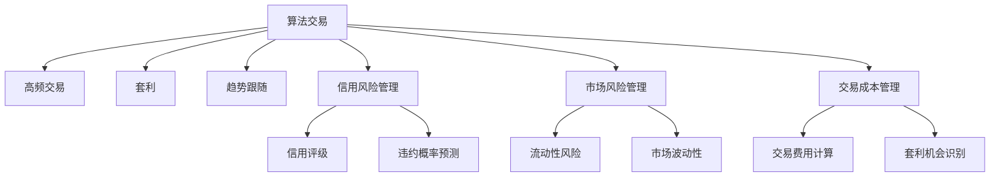

                 

# 金融科技：算法交易和风险管理

## 1. 背景介绍

### 1.1 问题由来

随着金融科技的迅猛发展，算法交易已成为现代金融市场的重要组成部分。算法交易利用计算机程序执行复杂的交易策略，可以在微秒级别完成下单和撤销操作，显著提高了交易的执行效率。然而，算法交易的广泛应用也带来了新的风险挑战，例如高频交易对市场的冲击、极端市场事件下的流动性风险等。

为了有效应对这些风险，金融科技公司引入了先进的数据分析和机器学习技术，特别是基于深度学习的风险管理方法，对算法交易系统进行优化和改进。通过合理的风险评估和控制，算法交易策略可以在风险可控的前提下实现更高的收益。

### 1.2 问题核心关键点

算法交易和风险管理的研究方向包括：
1. **算法交易策略**：利用计算机程序自动化执行交易，包括高频交易、套利、趋势跟随等策略。
2. **市场风险管理**：评估和监控市场风险，包括流动性风险、市场波动性等，通过调整交易策略控制风险。
3. **信用风险管理**：评估和监控交易对手的信用状况，确保交易的安全性。
4. **交易成本管理**：通过优化交易路径和时机，降低交易成本，提升交易效率。

这些研究方向共同构成了金融科技中的核心问题，本文将深入探讨这些问题的解决思路和技术手段。

## 2. 核心概念与联系

### 2.1 核心概念概述

为更好地理解算法交易和风险管理方法，本节将介绍几个关键概念：

- **算法交易**：利用计算机程序自动化执行交易策略，包括高频交易、套利、趋势跟随等。通过算法交易，可以实现复杂的交易策略，提高交易效率和执行精度。

- **市场风险管理**：评估和监控市场风险，包括流动性风险、市场波动性等。通过对市场风险的有效控制，可以保障交易系统的稳定性和安全性。

- **信用风险管理**：评估和监控交易对手的信用状况，确保交易的安全性。信用风险管理通常涉及信用评级、违约概率预测等技术。

- **交易成本管理**：通过优化交易路径和时机，降低交易成本，提升交易效率。交易成本管理涉及交易费用的计算、套利机会的识别等。

- **深度学习**：一种基于神经网络的机器学习方法，具有强大的数据拟合能力，能够处理复杂的非线性关系，广泛应用于金融科技领域。

这些核心概念之间的逻辑关系可以通过以下Mermaid流程图来展示：



这个流程图展示了大语言模型的核心概念及其之间的关系：

1. 算法交易包括高频交易、套利、趋势跟随等子策略，依赖于深度学习模型进行优化。
2. 市场风险管理涉及流动性风险和市场波动性，通过信用评级和违约概率预测进行风险控制。
3. 信用风险管理通过信用评级和违约概率预测，确保交易对手的安全性。
4. 交易成本管理涉及交易费用计算和套利机会识别，优化交易路径和时机。

这些概念共同构成了金融科技的核心问题，其解决方式在很大程度上依赖于深度学习等前沿技术。

## 3. 核心算法原理 & 具体操作步骤

### 3.1 算法原理概述

算法交易和风险管理的核心在于构建复杂的交易策略，并通过深度学习等技术进行优化和风险控制。算法交易策略通常包括以下几个步骤：

1. **数据收集和预处理**：收集历史交易数据和市场信息，进行清洗和预处理。
2. **模型训练和优化**：利用深度学习模型对历史数据进行训练，优化交易策略。
3. **风险评估和控制**：通过评估市场风险和信用风险，调整交易策略。
4. **交易执行和监控**：根据优化后的策略，自动执行交易，并实时监控交易风险。

### 3.2 算法步骤详解

以下详细介绍算法交易和风险管理的详细步骤：

**Step 1: 数据收集和预处理**

- **数据来源**：收集历史交易数据和市场信息，包括股票价格、市场波动性、交易量等。
- **数据清洗**：对数据进行去重、缺失值处理、异常值检测等预处理。
- **特征工程**：提取对交易策略有帮助的特征，如技术指标、市场情绪等。

**Step 2: 模型训练和优化**

- **模型选择**：选择合适的深度学习模型，如卷积神经网络(CNN)、循环神经网络(RNN)、长短期记忆网络(LSTM)等。
- **模型训练**：利用历史交易数据对模型进行训练，调整模型参数。
- **策略优化**：通过回测和仿真测试，优化交易策略。

**Step 3: 风险评估和控制**

- **市场风险评估**：计算市场波动性、流动性风险等指标。
- **信用风险评估**：利用信用评级和违约概率预测模型评估交易对手的信用状况。
- **风险控制**：根据风险评估结果，调整交易策略，控制风险。

**Step 4: 交易执行和监控**

- **交易执行**：根据优化后的策略，自动执行交易。
- **风险监控**：实时监控市场风险和信用风险，及时调整交易策略。

### 3.3 算法优缺点

算法交易和风险管理具有以下优点：
1. **高效性**：算法交易能够快速执行复杂交易策略，提高交易效率。
2. **稳定性**：基于深度学习的模型能够在大量数据上训练，提升模型的泛化能力。
3. **灵活性**：通过调整模型参数和交易策略，可以灵活应对市场变化。

但这些方法也存在一些局限性：
1. **复杂性**：深度学习模型需要大量的训练数据和计算资源，模型调优复杂。
2. **过拟合风险**：模型在训练数据上过拟合，可能在实际交易中表现不佳。
3. **风险控制难度大**：市场风险和信用风险复杂多样，难以完全控制。

尽管存在这些局限性，但算法交易和风险管理在金融科技中的应用已相当广泛，成为现代金融市场的重要工具。

### 3.4 算法应用领域

算法交易和风险管理在金融科技中有着广泛的应用，主要包括以下几个领域：

1. **高频交易**：利用高频算法在短时间内进行大量交易，获取微小的价格波动差价。
2. **套利交易**：通过识别市场中的套利机会，进行无风险或低风险的套利操作。
3. **量化投资**：利用算法交易进行长期投资组合管理，优化投资收益。
4. **信用风险管理**：通过信用评级和违约概率预测，评估交易对手的信用风险。
5. **流动性风险管理**：评估市场流动性，防止交易系统中断。
6. **交易成本管理**：优化交易路径和时机，降低交易费用。

## 4. 数学模型和公式 & 详细讲解 & 举例说明（备注：数学公式请使用latex格式，latex嵌入文中独立段落使用 $$，段落内使用 $)
### 4.1 数学模型构建

算法交易和风险管理的数学模型通常基于以下假设：
1. 历史交易数据是平稳的，不存在极端事件。
2. 市场是有效的，不存在系统性风险。
3. 交易对手的信用状况是可预测的。

基于这些假设，常见的数学模型包括：

- **交易策略模型**：利用历史数据和市场信息，构建交易策略模型。
- **风险评估模型**：评估市场风险和信用风险，构建风险评估模型。

### 4.2 公式推导过程

**交易策略模型的构建**：

假设历史交易数据为 $x_t$，市场信息为 $y_t$，交易策略为 $\pi_t$，则交易策略模型的构建公式为：

$$
\pi_t = f(x_t, y_t)
$$

其中 $f$ 为函数，表示将历史数据和市场信息映射为交易策略。

**风险评估模型的构建**：

市场风险 $R$ 可以表示为：

$$
R = \sum_{t=1}^T r_t
$$

其中 $r_t$ 为市场风险因子，如市场波动性、流动性风险等。

信用风险 $C$ 可以表示为：

$$
C = \sum_{t=1}^T c_t
$$

其中 $c_t$ 为信用风险因子，如信用评级、违约概率等。

通过构建上述模型，可以对交易策略和风险进行评估和控制。

### 4.3 案例分析与讲解

**案例：高频交易策略的构建**

假设历史交易数据为每天的股票价格 $x_t$，市场信息为每天的市场波动性 $y_t$。构建高频交易策略的模型为：

$$
\pi_t = f(x_t, y_t)
$$

其中 $f$ 为线性回归模型：

$$
\pi_t = \alpha_0 + \alpha_1 x_t + \alpha_2 y_t + \epsilon_t
$$

通过训练模型，得到最优参数 $\alpha_0, \alpha_1, \alpha_2$，用于构建交易策略。

**案例：市场风险评估**

市场风险 $R$ 可以表示为：

$$
R = \sum_{t=1}^T r_t
$$

其中 $r_t$ 为市场波动性，如VIX指数。

利用历史数据对市场波动性进行回归，得到：

$$
r_t = \beta_0 + \beta_1 x_t + \beta_2 y_t + \epsilon_t
$$

其中 $\beta_0, \beta_1, \beta_2$ 为回归系数。

通过评估市场波动性，可以预测未来的市场风险。

**案例：信用风险评估**

信用风险 $C$ 可以表示为：

$$
C = \sum_{t=1}^T c_t
$$

其中 $c_t$ 为信用评级，如标准普尔评级。

利用历史数据对信用评级进行回归，得到：

$$
c_t = \delta_0 + \delta_1 x_t + \delta_2 y_t + \epsilon_t
$$

其中 $\delta_0, \delta_1, \delta_2$ 为回归系数。

通过评估信用评级，可以预测未来的信用风险。

## 5. 项目实践：代码实例和详细解释说明
### 5.1 开发环境搭建

在进行算法交易和风险管理实践前，我们需要准备好开发环境。以下是使用Python进行PyTorch开发的环境配置流程：

1. 安装Anaconda：从官网下载并安装Anaconda，用于创建独立的Python环境。

2. 创建并激活虚拟环境：
```bash
conda create -n pytorch-env python=3.8 
conda activate pytorch-env
```

3. 安装PyTorch：根据CUDA版本，从官网获取对应的安装命令。例如：
```bash
conda install pytorch torchvision torchaudio cudatoolkit=11.1 -c pytorch -c conda-forge
```

4. 安装相关库：
```bash
pip install pandas numpy scikit-learn matplotlib jupyter notebook ipython
```

完成上述步骤后，即可在`pytorch-env`环境中开始算法交易和风险管理实践。

### 5.2 源代码详细实现

这里我们以信用风险管理为例，给出使用PyTorch进行信用评级预测的代码实现。

首先，定义信用评级的输入特征和输出标签：

```python
import pandas as pd
import torch
from sklearn.model_selection import train_test_split
from torch.utils.data import Dataset, DataLoader
from torch import nn
from torch.nn import functional as F
from sklearn.preprocessing import StandardScaler

class CreditRatingDataset(Dataset):
    def __init__(self, df, features, labels, scaler):
        self.data = df[features]
        self.target = df[labels]
        self.scaler = scaler

    def __len__(self):
        return len(self.data)

    def __getitem__(self, idx):
        x = self.data.iloc[idx]
        y = self.target.iloc[idx]
        return (self.scaler.transform(x), y)

# 输入特征和输出标签
features = ['income', 'age', 'loan_amount', 'loan_term']
labels = ['rating']
```

然后，加载数据集并进行预处理：

```python
# 读取数据集
df = pd.read_csv('credit_data.csv')

# 标准化数据
scaler = StandardScaler()
df[features] = scaler.fit_transform(df[features])

# 划分训练集和测试集
train_df, test_df = train_test_split(df, test_size=0.2)

# 创建数据集
train_dataset = CreditRatingDataset(train_df, features, labels, scaler)
test_dataset = CreditRatingDataset(test_df, features, labels, scaler)

# 创建数据加载器
train_loader = DataLoader(train_dataset, batch_size=32, shuffle=True)
test_loader = DataLoader(test_dataset, batch_size=32, shuffle=False)
```

接着，定义信用评级预测模型：

```python
class CreditRatingModel(nn.Module):
    def __init__(self, input_dim):
        super(CreditRatingModel, self).__init__()
        self.fc1 = nn.Linear(input_dim, 64)
        self.fc2 = nn.Linear(64, 64)
        self.fc3 = nn.Linear(64, 10)

    def forward(self, x):
        x = F.relu(self.fc1(x))
        x = F.relu(self.fc2(x))
        x = self.fc3(x)
        return x

# 输入维度
input_dim = train_dataset[0][0].shape[1]

# 构建模型
model = CreditRatingModel(input_dim)
```

然后，定义损失函数和优化器：

```python
# 定义损失函数
criterion = nn.CrossEntropyLoss()

# 定义优化器
optimizer = torch.optim.Adam(model.parameters(), lr=0.001)
```

最后，进行模型训练和评估：

```python
epochs = 50
device = torch.device('cuda') if torch.cuda.is_available() else torch.device('cpu')

for epoch in range(epochs):
    model.train()
    for data in train_loader:
        inputs, labels = data
        inputs = inputs.to(device)
        labels = labels.to(device)
        optimizer.zero_grad()
        outputs = model(inputs)
        loss = criterion(outputs, labels)
        loss.backward()
        optimizer.step()

    model.eval()
    with torch.no_grad():
        correct = 0
        total = 0
        for data in test_loader:
            inputs, labels = data
            inputs = inputs.to(device)
            labels = labels.to(device)
            outputs = model(inputs)
            _, predicted = torch.max(outputs.data, 1)
            total += labels.size(0)
            correct += (predicted == labels).sum().item()
        print(f'Accuracy on test set: {100 * correct / total}%')
```

以上代码实现了一个基本的信用评级预测模型，通过训练模型，可以在测试集上评估模型的预测准确率。

### 5.3 代码解读与分析

让我们再详细解读一下关键代码的实现细节：

**CreditRatingDataset类**：
- `__init__`方法：初始化输入特征、输出标签和标准化器。
- `__len__`方法：返回数据集的样本数量。
- `__getitem__`方法：对单个样本进行处理，将输入特征标准化，输出标签保持不变。

**标准化器**：
- 使用sklearn的StandardScaler对输入特征进行标准化处理，使得数据分布更符合正态分布，便于深度学习模型的训练。

**CreditRatingModel类**：
- `__init__`方法：定义模型的结构，包括三个全连接层。
- `forward`方法：定义模型的前向传播过程，包括激活函数和线性层。

**损失函数和优化器**：
- 使用交叉熵损失函数进行训练，并使用Adam优化器进行参数更新。

**训练和评估**：
- 在训练过程中，每个epoch对训练集进行多次迭代，并记录损失值和预测准确率。
- 在测试过程中，仅对测试集进行一次迭代，记录最终的预测准确率。

## 6. 实际应用场景
### 6.1 智能投顾系统

智能投顾系统利用算法交易和风险管理技术，为用户提供个性化的投资建议和风险控制策略。通过分析用户的风险偏好、投资目标等数据，智能投顾系统可以自动生成符合用户需求的投资组合，并进行实时风险监控，确保投资风险可控。

在技术实现上，可以构建基于深度学习的交易策略模型，实时监测市场波动性和信用风险，动态调整投资组合。智能投顾系统能够提供全流程的投资管理服务，显著提升用户的投资体验和满意度。

### 6.2 高频交易平台

高频交易平台利用算法交易和风险管理技术，为用户提供高频交易服务。通过构建高频交易策略，平台可以在短时间内进行大量交易，获取微小的价格波动差价，实现高收益。

在技术实现上，可以构建基于深度学习的高频交易策略模型，实时监测市场波动性和流动性风险，动态调整交易策略。高频交易平台能够提供高速、低延迟的交易服务，满足用户的交易需求。

### 6.3 信用评分系统

信用评分系统利用算法交易和风险管理技术，评估用户的信用状况，生成信用评分。通过分析用户的金融交易记录、社交网络数据等，信用评分系统可以全面评估用户的信用风险，确保交易的安全性。

在技术实现上，可以构建基于深度学习的信用评级预测模型，实时监测信用风险和违约概率。信用评分系统能够提供精确的信用评分结果，帮助金融机构进行风险控制。

### 6.4 未来应用展望

随着算法交易和风险管理技术的不断进步，未来金融科技的应用场景将更加广阔：

1. **自动化交易系统**：构建基于深度学习的交易策略模型，实现自动化的交易决策，提高交易效率和收益。
2. **智能投顾服务**：利用算法交易和风险管理技术，提供个性化的投资建议和风险控制策略，满足用户的多种需求。
3. **高频交易系统**：构建基于深度学习的高频交易策略模型，提供高速、低延迟的交易服务，满足用户的交易需求。
4. **信用评分系统**：构建基于深度学习的信用评级预测模型，评估用户的信用状况，提供精确的信用评分结果。
5. **市场风险监控**：构建基于深度学习的市场波动性预测模型，实时监测市场风险，进行风险控制。
6. **智能风控系统**：利用算法交易和风险管理技术，构建智能风控系统，进行信用风险和市场风险的综合管理。

## 7. 工具和资源推荐
### 7.1 学习资源推荐

为了帮助开发者系统掌握算法交易和风险管理的技术基础和实践技巧，这里推荐一些优质的学习资源：

1. 《金融工程学》系列教材：该书系统介绍了金融工程的基本原理和应用方法，包括衍生品定价、投资组合优化等。
2. Coursera《深度学习与人工智能》课程：斯坦福大学开设的深度学习课程，涵盖了深度学习的基础理论和实践技巧。
3. Kaggle信用评分竞赛：通过参与信用评分竞赛，实践算法交易和风险管理的理论知识。
4. 《Python for Data Science Handbook》书籍：详细介绍了Python在数据科学和金融工程中的应用，包括数据预处理、机器学习模型构建等。
5. HuggingFace官方文档：提供丰富的预训练语言模型和深度学习库，支持金融科技的开发和应用。

通过对这些资源的学习实践，相信你一定能够快速掌握算法交易和风险管理的精髓，并用于解决实际的金融科技问题。

### 7.2 开发工具推荐

高效的开发离不开优秀的工具支持。以下是几款用于金融科技开发的常用工具：

1. Python：作为金融科技的主流编程语言，Python具有丰富的金融库和数据处理工具，易于开发和调试。
2. PyTorch：基于Python的开源深度学习框架，支持动态计算图，适合快速迭代研究。
3. TensorFlow：由Google主导开发的开源深度学习框架，支持分布式计算，适合大规模工程应用。
4. Weights & Biases：模型训练的实验跟踪工具，可以记录和可视化模型训练过程中的各项指标，方便对比和调优。
5. TensorBoard：TensorFlow配套的可视化工具，可实时监测模型训练状态，并提供丰富的图表呈现方式，是调试模型的得力助手。
6. Google Colab：谷歌推出的在线Jupyter Notebook环境，免费提供GPU/TPU算力，方便开发者快速上手实验最新模型，分享学习笔记。

合理利用这些工具，可以显著提升金融科技开发效率，加快创新迭代的步伐。

### 7.3 相关论文推荐

算法交易和风险管理的发展源于学界的持续研究。以下是几篇奠基性的相关论文，推荐阅读：

1. High-Frequency Trading: How to Build and Trade a Statistical Arbitrage System（《高频交易：如何构建和交易统计套利系统》）：该书详细介绍了高频交易的原理和实现方法，是高频交易领域的经典之作。
2. Trading Systems Based on Neural Networks（《基于神经网络的交易系统》）：该文探讨了神经网络在交易系统中的应用，为深度学习在金融科技中的应用提供了新的思路。
3. A Comparative Analysis of Neural Network Models in Credit Scoring（《信用评分模型比较分析》）：该文对比了不同神经网络模型在信用评分任务上的表现，为信用评分系统提供了理论基础。
4. Financial Risk Management Using Deep Learning（《利用深度学习进行金融风险管理》）：该文探讨了深度学习在金融风险管理中的应用，为金融科技中的风险评估提供了新的方法。
5. Investing with Neural Networks（《神经网络下的投资策略》）：该文探讨了神经网络在投资策略中的应用，为智能投顾系统提供了新的思路。

这些论文代表了大语言模型微调技术的发展脉络。通过学习这些前沿成果，可以帮助研究者把握学科前进方向，激发更多的创新灵感。

## 8. 总结：未来发展趋势与挑战

### 8.1 总结

本文对算法交易和风险管理方法进行了全面系统的介绍。首先阐述了算法交易和风险管理的研究背景和意义，明确了算法交易和风险管理在金融科技中的重要性。其次，从原理到实践，详细讲解了算法交易和风险管理的数学模型和核心算法。最后，给出了算法交易和风险管理的完整代码实现，并展示了其在实际应用中的效果。

通过本文的系统梳理，可以看到，算法交易和风险管理技术在金融科技中的应用前景广阔，有助于提升金融系统的智能化水平，降低交易成本，提高风险控制能力。未来，随着深度学习等技术的不断发展，算法交易和风险管理技术必将不断进步，为金融科技的持续创新提供新的动力。

### 8.2 未来发展趋势

展望未来，算法交易和风险管理技术将呈现以下几个发展趋势：

1. **深度学习算法的进步**：随着深度学习技术的不断进步，基于深度学习的算法交易和风险管理方法将得到进一步提升，模型的泛化能力和精度将不断提高。
2. **多模态数据的融合**：金融科技的应用将越来越多地涉及到多模态数据，如文本、图像、声音等。通过多模态数据的融合，可以提高模型的决策能力和鲁棒性。
3. **实时化和高频交易**：高频交易和实时风险管理将逐渐成为金融科技的主流，算法交易和风险管理技术需要支持高速、低延迟的实时化处理。
4. **智能化和自动化**：智能投顾系统、智能风控系统等将成为金融科技的重要应用，算法交易和风险管理技术需要具备智能化和自动化的特点。
5. **安全性与合规性**：金融科技的应用需要符合法律法规的要求，算法交易和风险管理技术需要具备安全性和合规性保障。
6. **跨领域应用**：算法交易和风险管理技术不仅应用于金融领域，还可以扩展到保险、医疗、物流等更多领域，形成跨领域的应用。

### 8.3 面临的挑战

尽管算法交易和风险管理技术已经取得了瞩目成就，但在迈向更加智能化、普适化应用的过程中，它仍面临以下挑战：

1. **数据隐私和安全**：金融数据涉及隐私和安全问题，需要严格的数据保护和访问控制机制。
2. **模型泛化能力**：算法交易和风险管理模型需要在各种市场环境下进行有效的泛化，避免过拟合。
3. **实时处理能力**：高频交易和实时风险管理需要高效的实时处理能力，对硬件和算法的要求较高。
4. **模型透明度**：深度学习模型的决策过程较为复杂，难以解释，需要提高模型的透明度和可解释性。
5. **模型鲁棒性**：算法交易和风险管理模型需要具备鲁棒性，能够在异常市场环境下稳定运行。
6. **模型部署和管理**：金融科技的实际应用需要高效的模型部署和管理，确保模型的稳定性和可用性。

### 8.4 研究展望

面对算法交易和风险管理技术面临的挑战，未来的研究需要在以下几个方面寻求新的突破：

1. **深度学习模型的改进**：研究新的深度学习算法和模型结构，提高模型的泛化能力和精度。
2. **多模态数据融合**：研究多模态数据的融合方法和技术，提高模型的决策能力和鲁棒性。
3. **实时化处理**：研究实时化处理方法和技术，支持高频交易和实时风险管理。
4. **模型透明度和可解释性**：研究模型解释技术和方法，提高模型的透明度和可解释性。
5. **模型鲁棒性**：研究模型的鲁棒性和抗干扰能力，确保模型在异常市场环境下的稳定性。
6. **模型部署和管理**：研究高效的模型部署和管理方法，确保模型的稳定性和可用性。

这些研究方向将引领算法交易和风险管理技术的持续进步，为金融科技的持续创新提供新的动力。

## 9. 附录：常见问题与解答

**Q1：算法交易和风险管理的研究方向有哪些？**

A: 算法交易和风险管理的研究方向包括：
1. **算法交易策略**：利用计算机程序自动化执行交易，包括高频交易、套利、趋势跟随等策略。
2. **市场风险管理**：评估和监控市场风险，包括流动性风险、市场波动性等。
3. **信用风险管理**：评估和监控交易对手的信用状况，确保交易的安全性。
4. **交易成本管理**：优化交易路径和时机，降低交易成本，提升交易效率。

**Q2：如何在算法交易中避免高频交易对市场的冲击？**

A: 在算法交易中，高频交易对市场的冲击可以通过以下方法避免：
1. **设置最大订单量**：限制单笔交易的最大订单量，避免大额订单对市场造成剧烈波动。
2. **延迟下单**：将交易订单推迟一定时间执行，减少高频交易的频率。
3. **流动性控制**：限制高频交易对市场的流动性影响，避免市场出现突发流动性不足。
4. **统计套利策略**：利用统计方法预测市场波动性，调整高频交易策略。

**Q3：如何进行信用风险管理？**

A: 信用风险管理通常包括以下步骤：
1. **信用评级**：评估交易对手的信用状况，生成信用评级。
2. **违约概率预测**：预测交易对手的违约概率，评估其信用风险。
3. **风险控制**：根据信用评级和违约概率，调整交易策略，控制风险。

**Q4：高频交易和实时风险管理中的挑战有哪些？**

A: 高频交易和实时风险管理面临以下挑战：
1. **高频交易对市场的冲击**：高频交易对市场的冲击可能导致市场波动性增加。
2. **实时数据处理能力**：高频交易和实时风险管理需要高效的实时处理能力，对硬件和算法的要求较高。
3. **市场风险的动态变化**：市场风险是动态变化的，需要实时监测和控制。
4. **模型泛化能力**：高频交易和实时风险管理模型需要在各种市场环境下进行有效的泛化，避免过拟合。
5. **系统稳定性和可用性**：高频交易和实时风险管理需要高效的模型部署和管理，确保系统的稳定性和可用性。

这些挑战需要通过技术创新和实际应用经验的积累，逐步克服。

**Q5：金融科技中如何应用深度学习？**

A: 金融科技中深度学习的应用包括：
1. **交易策略模型**：利用深度学习模型对历史数据进行训练，优化交易策略。
2. **风险评估模型**：评估市场风险和信用风险，构建风险评估模型。
3. **智能投顾系统**：利用深度学习模型进行个性化的投资建议和风险控制策略。
4. **高频交易平台**：构建基于深度学习的高频交易策略模型，提供高速、低延迟的交易服务。
5. **信用评分系统**：构建基于深度学习的信用评级预测模型，评估用户的信用状况，提供精确的信用评分结果。
6. **市场波动性预测**：利用深度学习模型预测市场波动性，进行风险控制。

深度学习在金融科技中的应用，能够显著提升交易效率和风险控制能力，推动金融科技的持续创新和发展。

---

作者：禅与计算机程序设计艺术 / Zen and the Art of Computer Programming

